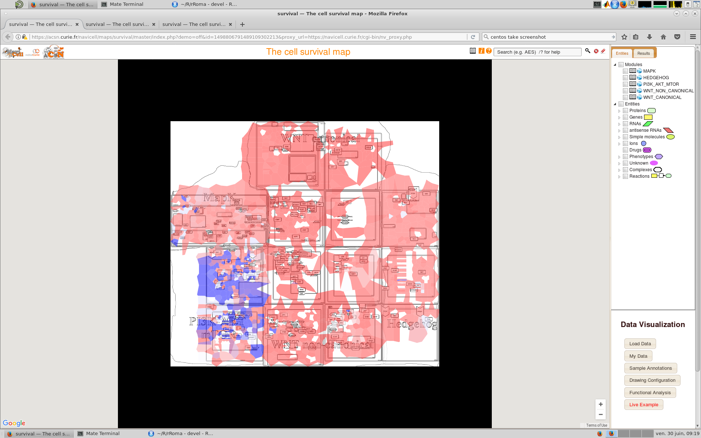
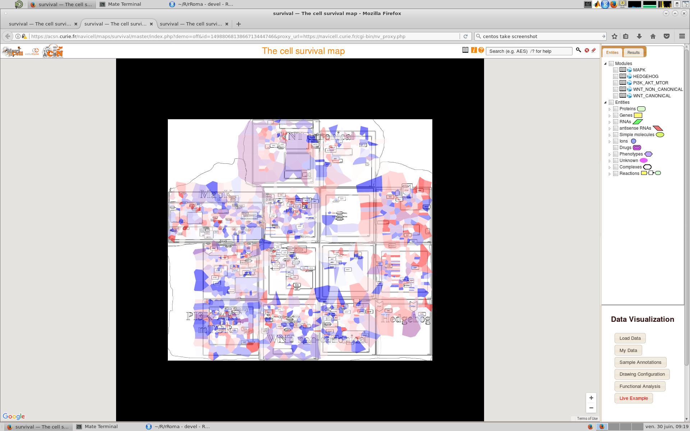
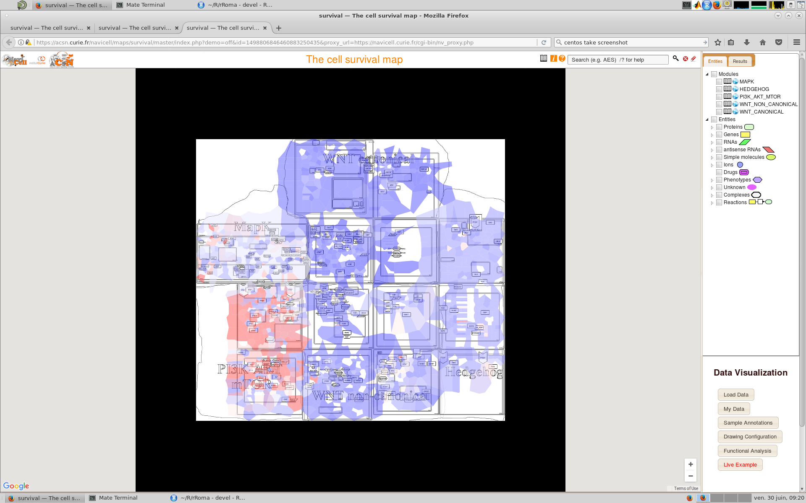

This package provides an R implementation of [ROMA](http://journal.frontiersin.org/article/10.3389/fgene.2016.00018/full). The package is under active development and is currently being tested.

A Java implementation developed by Andrei Zynovyev and is also [available](https://github.com/sysbio-curie/Roma).

# Intalling rROMA

The rRoma package relies on the `scater` and `biomaRt` packages, which are available only on BioConductor. These packagee can be installed with the following command

```{r, eval=TRUE}
source("https://bioconductor.org/biocLite.R")

if(!requireNamespace("scater")){
  biocLite("scater")
}

if(!requireNamespace("biomaRt")){
  biocLite("biomaRt")
}

```

rRoma can then be installed using `devtools`

```{r, eval=FALSE}
if(!requireNamespace("devtools")){
  install.packages("devtools")
}

if(!requireNamespace("rRoma")){
  devtools::install_github("Albluca/rROMA")
}
```

To fill missing values rRoma uses the mice package. This package needs to be installed manually if datasets with missing values need to be analysed:

```{r, eval=FALSE}
if(!requireNamespace("tictoc")){
  install.packages("tictoc")
}
```

Finally, rRoma allow projecting the results of the analysis on [ACSN maps](https://acsn.curie.fr). To use this functionality it is necessary to install the `RNaviCell` package:

```{r, eval=FALSE}
if(!requireNamespace("devtools")){
  install.packages("devtools")
}

if(!requireNamespace("RNaviCell")){
  devtools::install_github("sysbio-curie/RNaviCell")
}
```

The packages `GEOquery`, `tictoc`, and `readr` are not required to run rRoma, but are used in the following example and need to be installed to reproduce the analysis 

```{r, eval=TRUE}
if(!requireNamespace("GEOquery")){
  source("https://bioconductor.org/biocLite.R")
  biocLite("GEOquery")
}

if(!requireNamespace("readr")){
  install.packages("readr")
}

if(!requireNamespace("tictoc")){
  install.packages("tictoc")
}
```

# Using rROMA

The package can be loaded with the usual syntax, i.e., by typing

```{r}
library(rRoma)
```

rRoma requires a gene expression matrix - with column names indicating samples and row names indicating gene names - and a module file containing information on the genesets that need to be evaluated. The module file can be loaded from a GMT file. Functions to automate the generation of then GMT file are also available.

Various functions are then available to explore the analysis, including plotting and statistical cross sample analysis.

# An example

To show a concrete example of rROMA we will use a dataset available on GEO. 

## Getting the dataset

Let us begin by getting the description of the dataset

```{r, eval=TRUE}
library(GEOquery)
gse <- getGEO("GSE50760", GSEMatrix = TRUE, destdir = getwd())
```

Then we get the actual expression expression files

```{r, eval=TRUE}
filePaths = getGEOSuppFiles("GSE50760")
```

Now we can construct the expression matrix. Note that the code below is designed to work on a Unix-like environment (e.g. MacOS). The execution on a Windows environment may require replacing `"/"` with `"\"`.

```{r, eval=TRUE}
library(readr)
Content <- untar(row.names(filePaths)[1], list = TRUE)
untar(row.names(filePaths)[1], list = FALSE)

MatData <- NULL

for(i in 1:length(Content)){
  Exp <- read_delim(Content[i], "\t", escape_double = FALSE, trim_ws = TRUE)
  
  if(is.null(MatData)){
    MatData <- cbind(unlist(Exp[,1]), unlist(Exp[,2]))
  } else {
    if(any(MatData[,1] != unlist(Exp[,1]))){
      stop("Incompatible samples")
    }
    MatData <- cbind(MatData, unlist(Exp[,2]))
  }
  
  file.remove(Content[i])
  
}

SplitPath <- unlist(strsplit(rownames(filePaths)[1], "/"))
SplitPath <- SplitPath[-length(SplitPath)]
unlink(x = paste(SplitPath, collapse = "/"), recursive = TRUE)

Genes <- MatData[,1]
MatData <- data.matrix(data.frame(MatData[,-1]))
rownames(MatData) <- Genes
colnames(MatData) <- unlist(lapply(strsplit(Content, "_"), "[[", 1))
```

And look at the different groups of cells present

```{r, eval=TRUE}
Type <- as.character(gse$GSE50760_series_matrix.txt.gz[[1]])
Type <- unlist(lapply(strsplit(Type, " "), "[[", 1))
names(Type) = as.character(gse$GSE50760_series_matrix.txt.gz[[2]])

table(Type)
```

For convenience, we will transform `Type` into a factor:

```{r, eval=TRUE}
Type <- factor(Type, levels = c("normal", "primary", "metastasized"))
```

This will allow plotting functions, such as `Plot.Genesets`, to use more meaningful ordering when reporting information. 

### Selecting the module list

At this point we can create the metagene files. We will extract all the "HALLMARK" geneset from MSig. We will also remove "HALLMARK_" from the names to simplify the graphical representation. 

```{r, eval=TRUE}
AllHall <- SelectFromMSIGdb("HALLMARK")

AllHall <- lapply(AllHall, function(x){
  x$Name <- sub("HALLMARK_", "", x$Name)
  x
})

```

## Performing ROMA

To reduce potential problems we will remove genes with a duplicated name

```{r, eval=TRUE}
if(any(duplicated(rownames(MatData)))){
  MatData <- MatData[!(rownames(MatData) %in% rownames(MatData)[duplicated(rownames(MatData))]), ]
}
```

Moreover, we will use pseudocount transformation to boost the normality of the data

```{r, eval=TRUE}
MatData <- log2(MatData + 1)
```

And now we are ready to perform ROMA by using the `rRoma.R` function. The function has a number of parameters that can be used to control its behaviour, but can be run with a minimal set of input: the expression matrix (ExpressionMatrix) and the module list (ModuleList). In the following example we will also used `FixedCenter` (which control if PCA with fuixed center should be used), `UseParallel` (which control if the computation should be done in parallel,   analyzsis  with fuixed center should be used), `nCores` (the number of cores to use), and `ClusType` (the type of parallel environment to use). We will also use a PC orientation mode that will try to correlates gene expression level and module score (`PCSignMode="CorrelateAllWeightsByGene"`). Other parameters are described in the fucntion manual.

To perform ROMA fixed center in parallel, by using 8 cores, it is sufficient write:

```{r, eval=TRUE}
tictoc::tic()
Data.FC <- rRoma.R(ExpressionMatrix = MatData, ModuleList = AllHall, FixedCenter = TRUE,
                   UseParallel = TRUE, nCores = 8, ClusType = "FORK", MaxGenes = 100,
                   PCSignMode="CorrelateAllWeightsByGene", PCAType = "DimensionsAreSamples")
tictoc::toc()

```

## Module activity

We can now explore the overdispersed genesets in ROMA with fixed center. Since we have information on the groups, we can also aggregate the module weigths by groups and consider the mean and standard deviation. Note how we used the `SelectGeneSets` function to determind the overdispersed genesets. 

```{r, fig.height=6, fig.width=12, eval=TRUE}
AggData.FC <- Plot.Genesets(RomaData = Data.FC,
              Selected = SelectGeneSets(RomaData = Data.FC, VarThr = 5e-2,
                                        VarMode = "Wil", VarType = "Over"),
              GenesetMargin = 20, SampleMargin = 14, cluster_cols = FALSE,
              GroupInfo = Type, AggByGroupsFL = c("mean", "sd"),
              HMTite = "Overdispersed genesets (Fixed center)")
```

The fucntion returns a list of matrices with the aggregated data, which we saved in the `AggData.FC` variable.

```{r}
AggData.FC
```

We can also look at underdispersed datasets. In this case we will also look at the expression level and select only the genesets that are significantly overexpressed (`MedType = "Over"`).

```{r, fig.height=6, fig.width=12, eval=TRUE}
AggData2.FC <- Plot.Genesets(RomaData = Data.FC,
              Selected = SelectGeneSets(RomaData = Data.FC, VarThr = 5e-2,
                                        VarMode = "Wil", VarType = "Under",
                                        MedThr = 5e-3, MedMode = "Wil", MedType = "Over"),
              GenesetMargin = 20, SampleMargin = 14, cluster_cols = FALSE,
              GroupInfo = Type, AggByGroupsFL = c("mean", "sd"),
              HMTite = "Underdispersed genesets (Fixed center)")

```

## Statistical comparison across samples

Visual inspection already stresses the difference between the groups. It is possible to quantify theses differnces performing statistical testing:

```{r, eval=TRUE, fig.height=10}
CompareAcrossSamples(RomaData = Data.FC,
                     Selected = SelectGeneSets(RomaData = Data.FC, VarThr = 5e-2,
                                               VarMode = "Wil", VarType = "Over"),
                     Groups = Type)
```


## Top contributing genes

We can also explore the top contributing genes, i.e., the genes with the largers weights in the selected modules. The number of selected genes can be specified via the ratio of genes of the module (`nGenes` larger than 0 and smaller than 1) of via the absolute number of genes to return (`nGenes` integer and larger than 1). Additionally, top contributing genes can be obtained via their correlation with the module score (`Mode` = "Cor") of via their weight (`Mode` = "Wei").If `Plot = TRUE` a summary heatmap will be plotted as well. To use correlation the expression matrix needs to be specified (via the `ExpressionMatrix` parameter).

The function will return a table (`Table`) with the computed information and the matrix used to produce the heatmap (`VizMat`).

```{r, fig.height=12, fig.width=6}
GeneMat <- GetTopContrib(Data.FC,
                         Selected = SelectGeneSets(RomaData = Data.FC, VarThr = 1e-5,
                                                   VarMode = "Wil", VarType = "Over"),
                         nGenes = .1, OrderType = "Abs", Mode = "Wei", Plot = TRUE)
```


```{r, fig.height=12, fig.width=6}
GeneMat <- GetTopContrib(Data.FC,
                         Selected = SelectGeneSets(RomaData = Data.FC, VarThr = 1e-5,
                                                   VarMode = "Wil", VarType = "Over"),
                         ExpressionMatrix = MatData,
                         nGenes = .1, OrderType = "Abs", Mode = "Cor", Plot = TRUE)
```


The heatmap cha be used to quicky determine if a set of genes play a strong (potentially opposite) role across different genesets.

## Gene weights

We can also explore the gene weigths

```{r, eval=TRUE}
PlotGeneWeight(RomaData = Data.FC, PlotGenes = 30,
               ExpressionMatrix = MatData, LogExpression = FALSE,
               Selected = SelectGeneSets(RomaData = Data.FC, VarThr = 5e-2,
                                         VarMode = "Wil", VarType = "Over"),
               PlotWeigthSign = TRUE)
```


## Sample projections

Moreover, we can look at the projections of the samples with the fixed center

```{r, eval=TRUE}
PlotSampleProjections(RomaData = Data.FC, PlotSamples = 30,
                      ExpressionMatrix = MatData, LogExpression = FALSE,
                      Selected = SelectGeneSets(RomaData = Data.FC, VarThr = 5e-3,
                                                VarMode = "Wil", VarType = "Over"))
```

## Recurrent genes

Finally, we can look at genes which appear across different genesests and explore thier weithgs

```{r, eval=TRUE}
PlotRecurringGenes(RomaData = Data.FC,
                   Selected = SelectGeneSets(RomaData = Data.FC, VarThr = 5e-3,
                                             VarMode = "Wil", VarType = "Over"),
                   GenesByGroup = 25, MinMult = 2)
```


## Exploring the dynamics of a selected gene

If we are interested in the dynamics of a specific gene, it is possible to look at it using the function `ExploreGeneProperties`. This function will repost a number of plots that provide information on the working of a gene. Note the `DO_tSNE`, which will produce a tSNE plot when set to `TRUE`, and the `initial_dims` and `perplexity` parameters that control the tSNE plot.

```{r}
ExploreGeneProperties(RomaData = Data.FC, 
                      Selected = SelectGeneSets(RomaData = Data.FC, VarThr = 5e-3,
                                             VarMode = "Wil", VarType = "Over"),
                      GeneName = "JAG1", ExpressionMatrix = MatData, GroupInfo = Type,
                      DO_tSNE = TRUE, initial_dims = 50, perplexity = 15)
```


```{r}
ExploreGeneProperties(RomaData = Data.FC, 
                      Selected = SelectGeneSets(RomaData = Data.FC, VarThr = 5e-3,
                                             VarMode = "Wil", VarType = "Over"),
                      GeneName = "NEUROG3", ExpressionMatrix = MatData, GroupInfo = Type,
                      DO_tSNE = TRUE, initial_dims = 50, perplexity = 15)
```


## Looking at the details 

By default, rRoma will perform the appropiate anaysis without showing all the details to the users. However, it is possible to obtain additioanl graphical and textual information. This will results in a large amount of inromation being derived an plotted. Hence, it is not advisable to do that for large analysis. To show an example of the extended information that can be produced, we will first obtain a smaller module list.

```{r}
RedGMT <- SelectFromMSIGdb(SearchString = c("xenobiotic", "keg"), Mode = "ALL")
```

Wen perfoming ROMA we will now set `PlotData = TRUE` (to produce diagnostic plots), `MoreInfo = TRUE` (to print additional diagnostic information), and `FullSampleInfo = TRUE` (to compute and save additional information on the samples). Note that rRoma will ask to confim cetain choiches if R is run interactivelly.

```{r, eval=TRUE}
tictoc::tic()
RedData.NFC <- rRoma.R(ExpressionMatrix = MatData, ModuleList = RedGMT, FixedCenter = FALSE,
                    UseParallel = TRUE, nCores = 8, ClusType = "FORK",
                    PCSignMode="CorrelateAllWeightsByGene", 
                    PlotData = TRUE, MoreInfo = TRUE, FullSampleInfo = TRUE,
                    Grouping = Type, GroupPCSign = FALSE, PCAType = "DimensionsAreGenes")
tictoc::toc()
```


```{r, eval=TRUE}
PlotPCProjections(RomaData = RedData.NFC, Selected = NULL,
                  PlotPCProj = c('Points', 'Density',  'Bins'))

```

## Using the interactive dashboard

An interactive dasboard that can be used to perform ROMA and visualize the results is available as a separate r package on [GitHub](https://github.com/Albluca/rRomaDash)

## Converting gene names 

Sometimes it may be necessary to convert gene names between different conventions and possibly organisms. The rRoma package provides the fucntion `ConvertNames` that can be used to conver the genes specified by the Module list. The fucntion relies on the `biomaRt` package and therefore a working internet connection is required. The `HOST` and `PATH` argument are optional and can be used to specify an alternative host when ensembl.org is having problems.

To derive and convert the MyoGS module list into the Ensembl format it is sufficient to write:

```{r}
MyoGS <- SelectFromInternalDB("myogenesis")
MyoGS.ENS <- ConvertModuleNames(ModuleList = MyoGS,
                                SourceOrganism = "hsapiens", TargetOrganism = "hsapiens",
                   SourceTypes = "Names", TargetTypes = "Ensembl",
                   HOST = "grch37.ensembl.org", PATH = "/biomart/martservice")
```

```{r}
MyoGS.ENS[[1]]$Genes
```


It is also possible to convert gene names across organisms. To minimize potential problematic results this is done only on genes with an homology score:

```{r}
MyoGS.Mouse <- ConvertModuleNames(ModuleList = MyoGS, SourceOrganism = "hsapiens", TargetOrganism = "mmusculus",
                   SourceTypes = "Names", TargetTypes = "Names", HomologyLevel = 1,
                   HOST = "grch37.ensembl.org", PATH = "/biomart/martservice")
```

```{r}
MyoGS.Mouse[[1]]$Genes
```

Converting across species, will suppress the weigth information.

## Visualising on ACSN 

It is possible to project the results of rRoma analysis on a map. This functionality is currently experimental. ACSN maps needs gene lists. Therefore it is necessary to map the module activity to a gene specific value. Since a gene can be associated with multiple modules, it is possible to filter genes with a large variation in the gene weigths, as this is associated with a larger variation, and hence uncertainlty, on the contribution of the gene. The function takes several parameters: `SampleName`, which indicates the name of the sample(s) to consider, `AggScoreFun`, which describes the function used to group the module scores when different samples are present, `FilterByWei`, which is a parameters used to filter genes based on the variance of the gene weight across modules, and `AggGeneFun`, which describes the function used to obtain the value associated to a gene when the multiples weigths and scores are present. The parameters `QTop`, `QBottom`, and `Steps` control the heatmap of the plot. Finally, `DispMode` indicates which quantities should be projected on the maps, the module score ("Module"), or the gene weigths ("Gene").

In this example we will use the cell survival map and therefore we will recompute ROMA using the associated GMT.

```{r, eval=TRUE}
tictoc::tic()
Data.NFC.CS <- rRoma.R(ExpressionMatrix = MatData,
                       ModuleList = ReadGMTFile("http://acsn.curie.fr/files/survival_v1.1.gmt"),
                       FixedCenter = FALSE, MaxGenes = 500,
                       UseParallel = TRUE, nCores = 8, ClusType = "FORK",
                       PCSignMode="CorrelateAllWeightsByGene")
tictoc::toc()

```

We can now project the information obtained by using the following commands, which will open a windows in the default browser to visualize the map. We will start by displaying information relative to normal samples

```{r}
PlotOnACSN(RomaData = Data.NFC.CS, SampleName = names(Type[Type == "normal"]),
           AggScoreFun = "median", FilterByWei = 30, 
           DispMode = c("Module", "Gene"), DataName = "Normal", 
           QTop = .99, QBottom = .1,
           Selected = NULL,
           MapURL = 'https://acsn.curie.fr/navicell/maps/survival/master/index.php',
           AggGeneFun = "median")
```

This command will result in the following maps to be drawn:





We can then compare the information with metastatic samples.

```{r}
PlotOnACSN(RomaData = Data.NFC.CS, SampleName = names(Type[Type == "metastasized"]),
           AggScoreFun = "median", FilterByWei = 30, 
           DispMode = "Module", DataName = "Metastasized", 
           QTop = .99, QBottom = .1,
           Selected = NULL,
           MapURL = 'https://acsn.curie.fr/navicell/maps/survival/master/index.php',
           AggGeneFun = "median")
```



## Session information

```{r}
sessionInfo()
```

# Using the docker image

A docker image contains rRoma, the [rRomaDash package](https://github.com/Albluca/rRomaDash), and all the necessary dependencies is available. It can be installed by typing 

```{r, engine='bash', eval=FALSE}
docker pull albluca/rroma
```

After installation, the image can be started with the command

```{r, engine='bash', eval=FALSE}
docker run -p 8787:8787 albluca/rromadock
```

At this point the RStudio web interface containing rRoma will be availabe, in Unix-like systems, at the address [http://localhost:8787](http://localhost:8787). It is then possible to access the interface by using "rstudio" as the username and password.

On windows, it may be necessary to replace localhost with the address of the machine. If any problem is encountered see the instruction [here](https://github.com/rocker-org/rocker/wiki/Using-the-RStudio-image).

# Using the docker container

A docker image containing the RStusio web server and all the packages needed to run rRoma is also available. After installing [docker](http://www.docker.com), the image can be obtained using 

```{r, engine='bash', eval=FALSE}
docker pull albluca/rroma
```

After installation, the image can be started with the command

```{r, engine='bash', eval=FALSE}
docker run -p 8787:8787 albluca/rroma
```

At this point, the RStudio web interface containing rRoma and the [rRomaDash interface](https://github.com/Albluca/rRomaDash) will be availabe.

In Unix-like systems, the interface will be available at the address http://localhost:8787. It is then possible to access the interface by using "rstudio" as the username and password.

On windows systems, it may be necessary to replace localhost with a different address. On windows 10 professional, the docker image will be accessuible at the address http://127.0.0.1:8787.

Further instructions to troubleshoot any difficulty related to accessing the rstudio interface can be found [here](https://github.com/rocker-org/rocker/wiki/Using-the-RStudio-image). 

After starting the interface, it is possible to write r code as in the desktop version of RStudio.


