# rROMA
[Luca Albergante](mailto:luca.albergante@gmail.com)  
April 2017  

This package provides an R implementation of [ROMA](http://journal.frontiersin.org/article/10.3389/fgene.2016.00018/full). The package is under active development and is currently being tested.

A Java implementation developed by Andrei Zynovyev and is also [available](https://github.com/sysbio-curie/Roma).

## Intalling rROMA

The rRoma package relies on the `scater` package, which is available only on BioConductor. This package can be installed with the following command


```r
if(!require("devtools")){
  source("https://bioconductor.org/biocLite.R")
  biocLite("scater")
}
```

```
## Loading required package: devtools
```

rRoma can then be installed using `devtools`


```r
if(!require("devtools")){
  install.packages("devtools")
}
devtools::install_github("Albluca/rROMA")
```

The packages `GEOquery`, `tictoc`, and `readr` are not required to run rROMA, but are used in the following example and need to be installed to reproduce the analysis 


```r
if(!require("GEOquery")){
  source("https://bioconductor.org/biocLite.R")
  biocLite("GEOquery")
}
```

```
## Loading required package: GEOquery
```

```
## Loading required package: Biobase
```

```
## Loading required package: BiocGenerics
```

```
## Loading required package: parallel
```

```
## 
## Attaching package: 'BiocGenerics'
```

```
## The following objects are masked from 'package:parallel':
## 
##     clusterApply, clusterApplyLB, clusterCall, clusterEvalQ,
##     clusterExport, clusterMap, parApply, parCapply, parLapply,
##     parLapplyLB, parRapply, parSapply, parSapplyLB
```

```
## The following objects are masked from 'package:stats':
## 
##     IQR, mad, xtabs
```

```
## The following objects are masked from 'package:base':
## 
##     anyDuplicated, append, as.data.frame, cbind, colnames,
##     do.call, duplicated, eval, evalq, Filter, Find, get, grep,
##     grepl, intersect, is.unsorted, lapply, lengths, Map, mapply,
##     match, mget, order, paste, pmax, pmax.int, pmin, pmin.int,
##     Position, rank, rbind, Reduce, rownames, sapply, setdiff,
##     sort, table, tapply, union, unique, unsplit, which, which.max,
##     which.min
```

```
## Welcome to Bioconductor
## 
##     Vignettes contain introductory material; view with
##     'browseVignettes()'. To cite Bioconductor, see
##     'citation("Biobase")', and for packages 'citation("pkgname")'.
```

```
## Setting options('download.file.method.GEOquery'='auto')
```

```
## Setting options('GEOquery.inmemory.gpl'=FALSE)
```

```r
if(!require("readr")){
  install.packages("readr")
}
```

```
## Loading required package: readr
```

```r
if(!require("tictoc")){
  install.packages("tictoc")
}
```

```
## Loading required package: tictoc
```

## Using rROMA

The package can be loaded with the usual syntax, i.e., by typing


```r
library(rRoma)
```

rRoma requires a gene expression matrix - with column names indicating samples and row names indicating gene names - and a module file containing information on the genesets that need to be evaluated. The module file can be loaded from a GMT file. Functions to automate the generation of then GMT file are also available.

Various functions are then available to explore the analysis, including plotting and statistical cross sample analysis.

## An example

To show a concrete example of rROMA we will use a dataset available on GEO. 

### Getting teh dataset

Let us begin by getting the description of the dataset


```r
library(GEOquery)
gse <- getGEO("GSE50760", GSEMatrix = TRUE)
```

```
## https://ftp.ncbi.nlm.nih.gov/geo/series/GSE50nnn/GSE50760/matrix/
```

```
## OK
```

```
## Found 1 file(s)
```

```
## GSE50760_series_matrix.txt.gz
```

```
## File stored at:
```

```
## /tmp/RtmpiJAByy/GPL11154.soft
```

Then we get the actual expression expression files


```r
filePaths = getGEOSuppFiles("GSE50760")
```

```
## https://ftp.ncbi.nlm.nih.gov/geo/series/GSE50nnn/GSE50760/suppl/
```

```
## OK
```

Now we can construct the expression matrix. Note that the code below is designed to work on a Unix-like environment (e.g. MacOS). The execution on a Windows environment may require replacing `"/"` with `"\"`.


```r
library(readr)
Content <- untar(row.names(filePaths)[1], list = TRUE)
untar(row.names(filePaths)[1], list = FALSE)

MatData <- NULL

for(i in 1:length(Content)){
  Exp <- read_delim(Content[i], "\t", escape_double = FALSE, trim_ws = TRUE)
  
  if(is.null(MatData)){
    MatData <- cbind(unlist(Exp[,1]), unlist(Exp[,2]))
  } else {
    if(any(MatData[,1] != unlist(Exp[,1]))){
      stop("Incompatible samples")
    }
    MatData <- cbind(MatData, unlist(Exp[,2]))
  }
  
  file.remove(Content[i])
  
}
```

```
## Parsed with column specification:
## cols(
##   genes = col_character(),
##   AMC_2.1_FPKM = col_double()
## )
```

```
## Parsed with column specification:
## cols(
##   genes = col_character(),
##   AMC_3.1_FPKM = col_double()
## )
```

```
## Parsed with column specification:
## cols(
##   genes = col_character(),
##   AMC_5.1_FPKM = col_double()
## )
```

```
## Parsed with column specification:
## cols(
##   genes = col_character(),
##   AMC_6.1_FPKM = col_double()
## )
```

```
## Parsed with column specification:
## cols(
##   genes = col_character(),
##   AMC_7.1_FPKM = col_double()
## )
```

```
## Parsed with column specification:
## cols(
##   genes = col_character(),
##   AMC_8.1_FPKM = col_double()
## )
```

```
## Parsed with column specification:
## cols(
##   genes = col_character(),
##   AMC_9.1_FPKM = col_double()
## )
```

```
## Parsed with column specification:
## cols(
##   genes = col_character(),
##   AMC_10.1_FPKM = col_double()
## )
```

```
## Parsed with column specification:
## cols(
##   genes = col_character(),
##   AMC_12.1_FPKM = col_double()
## )
```

```
## Parsed with column specification:
## cols(
##   genes = col_character(),
##   AMC_13.1_FPKM = col_double()
## )
```

```
## Parsed with column specification:
## cols(
##   genes = col_character(),
##   AMC_17.1_FPKM = col_double()
## )
```

```
## Parsed with column specification:
## cols(
##   genes = col_character(),
##   AMC_18.1_FPKM = col_double()
## )
```

```
## Parsed with column specification:
## cols(
##   genes = col_character(),
##   AMC_19.1_FPKM = col_double()
## )
```

```
## Parsed with column specification:
## cols(
##   genes = col_character(),
##   AMC_20.1_FPKM = col_double()
## )
```

```
## Parsed with column specification:
## cols(
##   genes = col_character(),
##   AMC_21.1_FPKM = col_double()
## )
```

```
## Parsed with column specification:
## cols(
##   genes = col_character(),
##   AMC_22.1_FPKM = col_double()
## )
```

```
## Parsed with column specification:
## cols(
##   genes = col_character(),
##   AMC_23.1_FPKM = col_double()
## )
```

```
## Parsed with column specification:
## cols(
##   genes = col_character(),
##   AMC_24.1_FPKM = col_double()
## )
```

```
## Parsed with column specification:
## cols(
##   genes = col_character(),
##   AMC_2.2_FPKM = col_double()
## )
```

```
## Parsed with column specification:
## cols(
##   genes = col_character(),
##   AMC_3.2_FPKM = col_double()
## )
```

```
## Parsed with column specification:
## cols(
##   genes = col_character(),
##   AMC_5.2_FPKM = col_double()
## )
```

```
## Parsed with column specification:
## cols(
##   genes = col_character(),
##   AMC_6.2_FPKM = col_double()
## )
```

```
## Parsed with column specification:
## cols(
##   genes = col_character(),
##   AMC_7.2_FPKM = col_double()
## )
```

```
## Parsed with column specification:
## cols(
##   genes = col_character(),
##   AMC_8.2_FPKM = col_double()
## )
```

```
## Parsed with column specification:
## cols(
##   genes = col_character(),
##   AMC_9.2_FPKM = col_double()
## )
```

```
## Parsed with column specification:
## cols(
##   genes = col_character(),
##   AMC_10.2_FPKM = col_double()
## )
```

```
## Parsed with column specification:
## cols(
##   genes = col_character(),
##   AMC_12.2_FPKM = col_double()
## )
```

```
## Parsed with column specification:
## cols(
##   genes = col_character(),
##   AMC_13.2_FPKM = col_double()
## )
```

```
## Parsed with column specification:
## cols(
##   genes = col_character(),
##   AMC_17.2_FPKM = col_double()
## )
```

```
## Parsed with column specification:
## cols(
##   genes = col_character(),
##   AMC_18.2_FPKM = col_double()
## )
```

```
## Parsed with column specification:
## cols(
##   genes = col_character(),
##   AMC_19.2_FPKM = col_double()
## )
```

```
## Parsed with column specification:
## cols(
##   genes = col_character(),
##   AMC_20.2_FPKM = col_double()
## )
```

```
## Parsed with column specification:
## cols(
##   genes = col_character(),
##   AMC_21.2_FPKM = col_double()
## )
```

```
## Parsed with column specification:
## cols(
##   genes = col_character(),
##   AMC_22.2_FPKM = col_double()
## )
```

```
## Parsed with column specification:
## cols(
##   genes = col_character(),
##   AMC_23.2_FPKM = col_double()
## )
```

```
## Parsed with column specification:
## cols(
##   genes = col_character(),
##   AMC_24.2_FPKM = col_double()
## )
```

```
## Parsed with column specification:
## cols(
##   genes = col_character(),
##   AMC_2.3_FPKM = col_double()
## )
```

```
## Parsed with column specification:
## cols(
##   genes = col_character(),
##   AMC_3.3_FPKM = col_double()
## )
```

```
## Parsed with column specification:
## cols(
##   genes = col_character(),
##   AMC_5.3_FPKM = col_double()
## )
```

```
## Parsed with column specification:
## cols(
##   genes = col_character(),
##   AMC_6.3_FPKM = col_double()
## )
```

```
## Parsed with column specification:
## cols(
##   genes = col_character(),
##   AMC_7.3_FPKM = col_double()
## )
```

```
## Parsed with column specification:
## cols(
##   genes = col_character(),
##   AMC_8.3_FPKM = col_double()
## )
```

```
## Parsed with column specification:
## cols(
##   genes = col_character(),
##   AMC_9.3_FPKM = col_double()
## )
```

```
## Parsed with column specification:
## cols(
##   genes = col_character(),
##   AMC_10.3_FPKM = col_double()
## )
```

```
## Parsed with column specification:
## cols(
##   genes = col_character(),
##   AMC_12.3_FPKM = col_double()
## )
```

```
## Parsed with column specification:
## cols(
##   genes = col_character(),
##   AMC_13.3_FPKM = col_double()
## )
```

```
## Parsed with column specification:
## cols(
##   genes = col_character(),
##   AMC_17.3_FPKM = col_double()
## )
```

```
## Parsed with column specification:
## cols(
##   genes = col_character(),
##   AMC_18.3_FPKM = col_double()
## )
```

```
## Parsed with column specification:
## cols(
##   genes = col_character(),
##   AMC_19.3_FPKM = col_double()
## )
```

```
## Parsed with column specification:
## cols(
##   genes = col_character(),
##   AMC_20.3_FPKM = col_double()
## )
```

```
## Parsed with column specification:
## cols(
##   genes = col_character(),
##   AMC_21.3_FPKM = col_double()
## )
```

```
## Parsed with column specification:
## cols(
##   genes = col_character(),
##   AMC_22.3_FPKM = col_double()
## )
```

```
## Parsed with column specification:
## cols(
##   genes = col_character(),
##   AMC_23.3_FPKM = col_double()
## )
```

```
## Parsed with column specification:
## cols(
##   genes = col_character(),
##   AMC_24.3_FPKM = col_double()
## )
```

```r
SplitPath <- unlist(strsplit(rownames(filePaths)[1], "/"))
SplitPath <- SplitPath[-length(SplitPath)]
unlink(x = paste(SplitPath, collapse = "/"), recursive = TRUE)

Genes <- MatData[,1]
MatData <- data.matrix(data.frame(MatData[,-1]))
rownames(MatData) <- Genes
colnames(MatData) <- unlist(lapply(strsplit(Content, "_"), "[[", 1))
```

And look at the different groups of cells present


```r
Type <- as.character(gse$GSE50760_series_matrix.txt.gz[[1]])
Type <- unlist(lapply(strsplit(Type, " "), "[[", 1))
names(Type) = as.character(gse$GSE50760_series_matrix.txt.gz[[2]])

table(Type)
```

```
## Type
## metastasized       normal      primary 
##           18           18           18
```

For convenience, we will transform `Type` into a factor:


```r
Type <- factor(Type, levels = c("normal", "primary", "metastasized"))
```

### Selecting the module list

At this point we can create the metagene files. We will extract all the "HALLMARK" geneset from MSig. We will also remove "HALLMARK_" from the names to simplify the graphical representation. 


```r
AllHall <- SelectFromMSIGdb("HALLMARK")
```

```
## [1] "Searching in MsigDB v6.0"
## [1] "The following genesets have been selected:"
##  [1] "HALLMARK_TNFA_SIGNALING_VIA_NFKB (200 genes)"          
##  [2] "HALLMARK_HYPOXIA (200 genes)"                          
##  [3] "HALLMARK_CHOLESTEROL_HOMEOSTASIS (74 genes)"           
##  [4] "HALLMARK_MITOTIC_SPINDLE (200 genes)"                  
##  [5] "HALLMARK_WNT_BETA_CATENIN_SIGNALING (42 genes)"        
##  [6] "HALLMARK_TGF_BETA_SIGNALING (54 genes)"                
##  [7] "HALLMARK_IL6_JAK_STAT3_SIGNALING (87 genes)"           
##  [8] "HALLMARK_DNA_REPAIR (150 genes)"                       
##  [9] "HALLMARK_G2M_CHECKPOINT (200 genes)"                   
## [10] "HALLMARK_APOPTOSIS (161 genes)"                        
## [11] "HALLMARK_NOTCH_SIGNALING (32 genes)"                   
## [12] "HALLMARK_ADIPOGENESIS (200 genes)"                     
## [13] "HALLMARK_ESTROGEN_RESPONSE_EARLY (200 genes)"          
## [14] "HALLMARK_ESTROGEN_RESPONSE_LATE (200 genes)"           
## [15] "HALLMARK_ANDROGEN_RESPONSE (101 genes)"                
## [16] "HALLMARK_MYOGENESIS (200 genes)"                       
## [17] "HALLMARK_PROTEIN_SECRETION (96 genes)"                 
## [18] "HALLMARK_INTERFERON_ALPHA_RESPONSE (97 genes)"         
## [19] "HALLMARK_INTERFERON_GAMMA_RESPONSE (200 genes)"        
## [20] "HALLMARK_APICAL_JUNCTION (200 genes)"                  
## [21] "HALLMARK_APICAL_SURFACE (44 genes)"                    
## [22] "HALLMARK_HEDGEHOG_SIGNALING (36 genes)"                
## [23] "HALLMARK_COMPLEMENT (200 genes)"                       
## [24] "HALLMARK_UNFOLDED_PROTEIN_RESPONSE (113 genes)"        
## [25] "HALLMARK_PI3K_AKT_MTOR_SIGNALING (105 genes)"          
## [26] "HALLMARK_MTORC1_SIGNALING (200 genes)"                 
## [27] "HALLMARK_E2F_TARGETS (200 genes)"                      
## [28] "HALLMARK_MYC_TARGETS_V1 (200 genes)"                   
## [29] "HALLMARK_MYC_TARGETS_V2 (58 genes)"                    
## [30] "HALLMARK_EPITHELIAL_MESENCHYMAL_TRANSITION (200 genes)"
## [31] "HALLMARK_INFLAMMATORY_RESPONSE (200 genes)"            
## [32] "HALLMARK_XENOBIOTIC_METABOLISM (200 genes)"            
## [33] "HALLMARK_FATTY_ACID_METABOLISM (158 genes)"            
## [34] "HALLMARK_OXIDATIVE_PHOSPHORYLATION (200 genes)"        
## [35] "HALLMARK_GLYCOLYSIS (200 genes)"                       
## [36] "HALLMARK_REACTIVE_OXIGEN_SPECIES_PATHWAY (49 genes)"   
## [37] "HALLMARK_P53_PATHWAY (200 genes)"                      
## [38] "HALLMARK_UV_RESPONSE_UP (158 genes)"                   
## [39] "HALLMARK_UV_RESPONSE_DN (144 genes)"                   
## [40] "HALLMARK_ANGIOGENESIS (36 genes)"                      
## [41] "HALLMARK_HEME_METABOLISM (200 genes)"                  
## [42] "HALLMARK_COAGULATION (138 genes)"                      
## [43] "HALLMARK_IL2_STAT5_SIGNALING (200 genes)"              
## [44] "HALLMARK_BILE_ACID_METABOLISM (112 genes)"             
## [45] "HALLMARK_PEROXISOME (104 genes)"                       
## [46] "HALLMARK_ALLOGRAFT_REJECTION (200 genes)"              
## [47] "HALLMARK_SPERMATOGENESIS (135 genes)"                  
## [48] "HALLMARK_KRAS_SIGNALING_UP (200 genes)"                
## [49] "HALLMARK_KRAS_SIGNALING_DN (200 genes)"                
## [50] "HALLMARK_PANCREAS_BETA_CELLS (40 genes)"
```

```r
AllHall <- lapply(AllHall, function(x){
  x$Name <- sub("HALLMARK_", "", x$Name)
  x
})
```

### Performing ROMA

To reduce potential problmes we will remove genes with a duplicated name


```r
if(any(duplicated(rownames(MatData)))){
  MatData <- MatData[!(rownames(MatData) %in% rownames(MatData)[duplicated(rownames(MatData))]), ]
}
```

Moreover, we will use pseudocount transformation to boost the normality of the data


```r
MatData <- log2(MatData + 1)
```

And now we are ready to perform ROMA by using the `rRoma.R` function. The function has a number of parameters that can be used to control its behaviour, but can be run with a minimal set of input: the expression matrix (ExpressionMatrix) and the module list (ModuleList). In the following example we will also used `FixedCenter` (which control if PCA with fuixed center should be used), `UseParallel` (which control if the computation should be done in parallel,   analyzsis  with fuixed center should be used), `nCores` (the number of cores to use), and `ClusType` (the type of parallel environment to use). We will also use a PC orientation mode that will try to correlates gene expression level and module score (`PCSignMode="CorrelateAllWeightsByGene"`). Other parameters are described in the fucntion manual.

To perform ROMA without fixed center in parallel, by using 6 cores, it is sufficient write:


```r
tictoc::tic()
Data.NFC <- rRoma.R(ExpressionMatrix = MatData, ModuleList = AllHall, FixedCenter = FALSE,
                    UseParallel = TRUE, nCores = 8, ClusType = "FORK",
                    PCSignMode="CorrelateAllWeightsByGene")
```

```
## [1] "Centering gene expression over samples"
## [1] "Using local center (NOT centering over genes)"
## [1] "All the genesets will be used"
## [1] "2017-04-14 09:03:27 CEST"
## [1] "[1/50] Working on NOTCH_SIGNALING - http://www.broadinstitute.org/gsea/msigdb/cards/HALLMARK_NOTCH_SIGNALING"
## [1] "32 genes available for analysis"
## [1] "Detecting outliers using leave one out and median-absolute-deviations away from median (scater package)"
## [1] "1 gene(s) will be filtered:"
## [1] "WNT2"
## [1] "Not using weigths for PCA computation"
## [1] "Pre-filter data"
## [1] "L1 = 0.7845774757366 L1/L2 = 20.9380865985342"
## [1] "Median expression (uncentered): 13.5150221827314"
## [1] "Median expression (centered/weighted): 0.037757073795591"
## [1] "Post-filter data"
## [1] "L1 = 0.210577774023805 L1/L2 = 1.70164701199614"
## [1] "Median expression (uncentered): 13.5291252684908"
## [1] "Median expression (centered/weighted): 0.0307346105077642"
## [1] "Previous sample size: 0"
## [1] "Next sample size: 32"
## [1] "Computing samples"
##    user  system elapsed 
##   0.102   0.132   9.637 
## [1] "Missing gene weights will be replaced by 1"
## [1] "Orienting PC by correlating gene expression and PC projections"
## [1] "Not using groups"
## [1] "Computing correlations"
## [1] "Correcting using weights"
## [1] "Missing gene weights will be replaced by 1"
## [1] "Orienting PC by correlating gene expression and PC projections"
## [1] "Not using groups"
## [1] "Computing correlations"
## [1] "Correcting using weights"
## [1] "Missing gene weights will be replaced by 1"
## [1] "Orienting PC by correlating gene expression and PC projections"
## [1] "Not using groups"
## [1] "Computing correlations"
## [1] "Correcting using weights"
## [1] "2017-04-14 09:03:43 CEST"
## [1] "[2/50] Working on HEDGEHOG_SIGNALING - http://www.broadinstitute.org/gsea/msigdb/cards/HALLMARK_HEDGEHOG_SIGNALING"
## [1] "36 genes available for analysis"
## [1] "Detecting outliers using leave one out and median-absolute-deviations away from median (scater package)"
## [1] "5 gene(s) will be filtered:"
## [1] "SCG2"   "SLIT1"  "PLG"    "NKX6-1" "CNTFR" 
## [1] "Not using weigths for PCA computation"
## [1] "Pre-filter data"
## [1] "L1 = 0.361551425314883 L1/L2 = 1.78370751599497"
## [1] "Median expression (uncentered): 13.1529183587471"
## [1] "Median expression (centered/weighted): 0.0413564747252826"
## [1] "Post-filter data"
## [1] "L1 = 0.260022540843775 L1/L2 = 2.54743673689199"
## [1] "Median expression (uncentered): 13.2823644791553"
## [1] "Median expression (centered/weighted): 0.0435256859842612"
## [1] "Previous sample size: 32"
## [1] "Next sample size: 36"
## [1] "Computing samples"
##    user  system elapsed 
##   0.102   0.168   1.959 
## [1] "Missing gene weights will be replaced by 1"
## [1] "Orienting PC by correlating gene expression and PC projections"
## [1] "Not using groups"
## [1] "Computing correlations"
## [1] "Correcting using weights"
## [1] "Missing gene weights will be replaced by 1"
## [1] "Orienting PC by correlating gene expression and PC projections"
## [1] "Not using groups"
## [1] "Computing correlations"
## [1] "Correcting using weights"
## [1] "Missing gene weights will be replaced by 1"
## [1] "Orienting PC by correlating gene expression and PC projections"
## [1] "Not using groups"
## [1] "Computing correlations"
## [1] "Correcting using weights"
## [1] "2017-04-14 09:03:45 CEST"
## [1] "[3/50] Working on ANGIOGENESIS - http://www.broadinstitute.org/gsea/msigdb/cards/HALLMARK_ANGIOGENESIS"
## [1] "36 genes available for analysis"
## [1] "Detecting outliers using leave one out and median-absolute-deviations away from median (scater package)"
## [1] "5 gene(s) will be filtered:"
## [1] "PF4"      "SERPINA5" "OLR1"     "PGLYRP1"  "CXCL6"   
## [1] "Not using weigths for PCA computation"
## [1] "Pre-filter data"
## [1] "L1 = 0.365857778739857 L1/L2 = 1.4987002284041"
## [1] "Median expression (uncentered): 13.211812247159"
## [1] "Median expression (centered/weighted): 0.0347573527178193"
## [1] "Post-filter data"
## [1] "L1 = 0.682888966255021 L1/L2 = 9.30079307768829"
## [1] "Median expression (uncentered): 13.396336970849"
## [1] "Median expression (centered/weighted): 0.00857800454901181"
## [1] "Previous sample size: 36"
## [1] "Next sample size: 36"
## [1] "Reusing previous sampling (Same metagene size)"
## [1] "Missing gene weights will be replaced by 1"
## [1] "Orienting PC by correlating gene expression and PC projections"
## [1] "Not using groups"
## [1] "Computing correlations"
## [1] "Correcting using weights"
## [1] "Missing gene weights will be replaced by 1"
## [1] "Orienting PC by correlating gene expression and PC projections"
## [1] "Not using groups"
## [1] "Computing correlations"
## [1] "Correcting using weights"
## [1] "Missing gene weights will be replaced by 1"
## [1] "Orienting PC by correlating gene expression and PC projections"
## [1] "Not using groups"
## [1] "Computing correlations"
## [1] "Correcting using weights"
## [1] "2017-04-14 09:03:45 CEST"
## [1] "[4/50] Working on PANCREAS_BETA_CELLS - http://www.broadinstitute.org/gsea/msigdb/cards/HALLMARK_PANCREAS_BETA_CELLS"
## [1] "40 genes available for analysis"
## [1] "Detecting outliers using leave one out and median-absolute-deviations away from median (scater package)"
## [1] "10 gene(s) will be filtered:"
##  [1] "NEUROD1" "NKX2-2"  "NKX6-1"  "SLC2A2"  "DCX"     "GCK"     "ABCC8"  
##  [8] "IAPP"    "GCG"     "G6PC2"  
## [1] "Not using weigths for PCA computation"
## [1] "Pre-filter data"
## [1] "L1 = 0.420494929851732 L1/L2 = 4.21861562742295"
## [1] "Median expression (uncentered): 12.5489421629889"
## [1] "Median expression (centered/weighted): 0.117565615124752"
## [1] "Post-filter data"
## [1] "L1 = 0.479462188705406 L1/L2 = 2.74709882748781"
## [1] "Median expression (uncentered): 13.0562141256366"
## [1] "Median expression (centered/weighted): 0.104745685346487"
## [1] "Previous sample size: 36"
## [1] "Next sample size: 40"
## [1] "Computing samples"
##    user  system elapsed 
##   0.117   0.158   2.291 
## [1] "Missing gene weights will be replaced by 1"
## [1] "Orienting PC by correlating gene expression and PC projections"
## [1] "Not using groups"
## [1] "Computing correlations"
## [1] "Correcting using weights"
## [1] "Missing gene weights will be replaced by 1"
## [1] "Orienting PC by correlating gene expression and PC projections"
## [1] "Not using groups"
## [1] "Computing correlations"
## [1] "Correcting using weights"
## [1] "Missing gene weights will be replaced by 1"
## [1] "Orienting PC by correlating gene expression and PC projections"
## [1] "Not using groups"
## [1] "Computing correlations"
## [1] "Correcting using weights"
## [1] "2017-04-14 09:03:48 CEST"
## [1] "[5/50] Working on WNT_BETA_CATENIN_SIGNALING - http://www.broadinstitute.org/gsea/msigdb/cards/HALLMARK_WNT_BETA_CATENIN_SIGNALING"
## [1] "42 genes available for analysis"
## [1] "Detecting outliers using leave one out and median-absolute-deviations away from median (scater package)"
## [1] "4 gene(s) will be filtered:"
## [1] "WNT6" "DKK4" "DKK1" "WNT1"
## [1] "Not using weigths for PCA computation"
## [1] "Pre-filter data"
## [1] "L1 = 0.52070616644396 L1/L2 = 2.56220129678017"
## [1] "Median expression (uncentered): 13.3219279229047"
## [1] "Median expression (centered/weighted): 0.0169510716864609"
## [1] "Post-filter data"
## [1] "L1 = 0.244894632316475 L1/L2 = 2.24922188862975"
## [1] "Median expression (uncentered): 13.4160717745688"
## [1] "Median expression (centered/weighted): -0.00381518525660862"
## [1] "Previous sample size: 40"
## [1] "Next sample size: 42"
## [1] "Reusing previous sampling (Comparable metagene size)"
## [1] "Missing gene weights will be replaced by 1"
## [1] "Orienting PC by correlating gene expression and PC projections"
## [1] "Not using groups"
## [1] "Computing correlations"
## [1] "Correcting using weights"
## [1] "Missing gene weights will be replaced by 1"
## [1] "Orienting PC by correlating gene expression and PC projections"
## [1] "Not using groups"
## [1] "Computing correlations"
## [1] "Correcting using weights"
## [1] "Missing gene weights will be replaced by 1"
## [1] "Orienting PC by correlating gene expression and PC projections"
## [1] "Not using groups"
## [1] "Computing correlations"
## [1] "Correcting using weights"
## [1] "2017-04-14 09:03:48 CEST"
## [1] "[6/50] Working on APICAL_SURFACE - http://www.broadinstitute.org/gsea/msigdb/cards/HALLMARK_APICAL_SURFACE"
## [1] "44 genes available for analysis"
## [1] "Detecting outliers using leave one out and median-absolute-deviations away from median (scater package)"
## [1] "10 gene(s) will be filtered:"
##  [1] "RHCG"     "MAL"      "PKHD1"    "ATP6V0A4" "GHRL"     "SLC34A3" 
##  [7] "RTN4RL1"  "CD160"    "SLC22A12" "NTNG1"   
## [1] "Not using weigths for PCA computation"
## [1] "Pre-filter data"
## [1] "L1 = 0.289941754026123 L1/L2 = 1.58119175613412"
## [1] "Median expression (uncentered): 13.078317612573"
## [1] "Median expression (centered/weighted): 0.0753638263199106"
## [1] "Post-filter data"
## [1] "L1 = 0.340350583016407 L1/L2 = 3.19359216891785"
## [1] "Median expression (uncentered): 13.4014128725526"
## [1] "Median expression (centered/weighted): 0.050915048130002"
## [1] "Previous sample size: 40"
## [1] "Next sample size: 44"
## [1] "Computing samples"
##    user  system elapsed 
##   0.117   0.159   3.155 
## [1] "Missing gene weights will be replaced by 1"
## [1] "Orienting PC by correlating gene expression and PC projections"
## [1] "Not using groups"
## [1] "Computing correlations"
## [1] "Correcting using weights"
## [1] "Missing gene weights will be replaced by 1"
## [1] "Orienting PC by correlating gene expression and PC projections"
## [1] "Not using groups"
## [1] "Computing correlations"
## [1] "Correcting using weights"
## [1] "Missing gene weights will be replaced by 1"
## [1] "Orienting PC by correlating gene expression and PC projections"
## [1] "Not using groups"
## [1] "Computing correlations"
## [1] "Correcting using weights"
## [1] "2017-04-14 09:03:51 CEST"
## [1] "[7/50] Working on REACTIVE_OXIGEN_SPECIES_PATHWAY - http://www.broadinstitute.org/gsea/msigdb/cards/HALLMARK_REACTIVE_OXIGEN_SPECIES_PATHWAY"
## [1] "48 genes available for analysis"
## [1] "Detecting outliers using leave one out and median-absolute-deviations away from median (scater package)"
## [1] "1 gene(s) will be filtered:"
## [1] "MPO"
## [1] "Not using weigths for PCA computation"
## [1] "Pre-filter data"
## [1] "L1 = 0.569955615609776 L1/L2 = 8.16612744010492"
## [1] "Median expression (uncentered): 13.6307790036278"
## [1] "Median expression (centered/weighted): 0.0260893771933679"
## [1] "Post-filter data"
## [1] "L1 = 0.182711738331294 L1/L2 = 1.77618343981681"
## [1] "Median expression (uncentered): 13.6419952649137"
## [1] "Median expression (centered/weighted): 0.0232639687242875"
## [1] "Previous sample size: 44"
## [1] "Next sample size: 48"
## [1] "Computing samples"
##    user  system elapsed 
##   0.118   0.176   2.744 
## [1] "Missing gene weights will be replaced by 1"
## [1] "Orienting PC by correlating gene expression and PC projections"
## [1] "Not using groups"
## [1] "Computing correlations"
## [1] "Correcting using weights"
## [1] "Missing gene weights will be replaced by 1"
## [1] "Orienting PC by correlating gene expression and PC projections"
## [1] "Not using groups"
## [1] "Computing correlations"
## [1] "Correcting using weights"
## [1] "Missing gene weights will be replaced by 1"
## [1] "Orienting PC by correlating gene expression and PC projections"
## [1] "Not using groups"
## [1] "Computing correlations"
## [1] "Correcting using weights"
## [1] "2017-04-14 09:03:54 CEST"
## [1] "[8/50] Working on TGF_BETA_SIGNALING - http://www.broadinstitute.org/gsea/msigdb/cards/HALLMARK_TGF_BETA_SIGNALING"
## [1] "54 genes available for analysis"
## [1] "Detecting outliers using leave one out and median-absolute-deviations away from median (scater package)"
## [1] "2 gene(s) will be filtered:"
## [1] "LEFTY2" "NOG"   
## [1] "Not using weigths for PCA computation"
## [1] "Pre-filter data"
## [1] "L1 = 0.568244601249453 L1/L2 = 6.34922015211858"
## [1] "Median expression (uncentered): 13.6414872140507"
## [1] "Median expression (centered/weighted): 0.0463459063768825"
## [1] "Post-filter data"
## [1] "L1 = 0.174825228302225 L1/L2 = 2.20100016480859"
## [1] "Median expression (uncentered): 13.6720935948085"
## [1] "Median expression (centered/weighted): 0.0420981222425176"
## [1] "Previous sample size: 48"
## [1] "Next sample size: 54"
## [1] "Computing samples"
##    user  system elapsed 
##   0.138   0.169   3.680 
## [1] "Missing gene weights will be replaced by 1"
## [1] "Orienting PC by correlating gene expression and PC projections"
## [1] "Not using groups"
## [1] "Computing correlations"
## [1] "Correcting using weights"
## [1] "Missing gene weights will be replaced by 1"
## [1] "Orienting PC by correlating gene expression and PC projections"
## [1] "Not using groups"
## [1] "Computing correlations"
## [1] "Correcting using weights"
## [1] "Missing gene weights will be replaced by 1"
## [1] "Orienting PC by correlating gene expression and PC projections"
## [1] "Not using groups"
## [1] "Computing correlations"
## [1] "Correcting using weights"
## [1] "2017-04-14 09:03:58 CEST"
## [1] "[9/50] Working on MYC_TARGETS_V2 - http://www.broadinstitute.org/gsea/msigdb/cards/HALLMARK_MYC_TARGETS_V2"
## [1] "58 genes available for analysis"
## [1] "Detecting outliers using leave one out and median-absolute-deviations away from median (scater package)"
## [1] "No gene will be filtered"
## [1] "Not using weigths for PCA computation"
## [1] "Pre-filter data"
## [1] "L1 = 0.306136722877466 L1/L2 = 3.50828449751277"
## [1] "Median expression (uncentered): 13.5235005936785"
## [1] "Median expression (centered/weighted): 0.0500712163723467"
## [1] "Post-filter data"
## [1] "L1 = 0.306136722877466 L1/L2 = 3.50828449751278"
## [1] "Median expression (uncentered): 13.5235005936785"
## [1] "Median expression (centered/weighted): 0.0500712163723467"
## [1] "Previous sample size: 54"
## [1] "Next sample size: 58"
## [1] "Computing samples"
##    user  system elapsed 
##   0.133   0.184   4.457 
## [1] "Missing gene weights will be replaced by 1"
## [1] "Orienting PC by correlating gene expression and PC projections"
## [1] "Not using groups"
## [1] "Computing correlations"
## [1] "Correcting using weights"
## [1] "Missing gene weights will be replaced by 1"
## [1] "Orienting PC by correlating gene expression and PC projections"
## [1] "Not using groups"
## [1] "Computing correlations"
## [1] "Correcting using weights"
## [1] "Missing gene weights will be replaced by 1"
## [1] "Orienting PC by correlating gene expression and PC projections"
## [1] "Not using groups"
## [1] "Computing correlations"
## [1] "Correcting using weights"
## [1] "2017-04-14 09:04:03 CEST"
## [1] "[10/50] Working on CHOLESTEROL_HOMEOSTASIS - http://www.broadinstitute.org/gsea/msigdb/cards/HALLMARK_CHOLESTEROL_HOMEOSTASIS"
## [1] "74 genes available for analysis"
## [1] "Detecting outliers using leave one out and median-absolute-deviations away from median (scater package)"
## [1] "2 gene(s) will be filtered:"
## [1] "ADH4"   "AVPR1A"
## [1] "Not using weigths for PCA computation"
## [1] "Pre-filter data"
## [1] "L1 = 0.189332731689824 L1/L2 = 1.55163556135418"
## [1] "Median expression (uncentered): 13.5770747151966"
## [1] "Median expression (centered/weighted): 0.0449030468319824"
## [1] "Post-filter data"
## [1] "L1 = 0.131243681099426 L1/L2 = 1.50955736715844"
## [1] "Median expression (uncentered): 13.6116012020924"
## [1] "Median expression (centered/weighted): 0.0457713486637674"
## [1] "Previous sample size: 58"
## [1] "Next sample size: 74"
## [1] "Computing samples"
##    user  system elapsed 
##   0.148   0.163   5.254 
## [1] "Missing gene weights will be replaced by 1"
## [1] "Orienting PC by correlating gene expression and PC projections"
## [1] "Not using groups"
## [1] "Computing correlations"
## [1] "Correcting using weights"
## [1] "Missing gene weights will be replaced by 1"
## [1] "Orienting PC by correlating gene expression and PC projections"
## [1] "Not using groups"
## [1] "Computing correlations"
## [1] "Correcting using weights"
## [1] "Missing gene weights will be replaced by 1"
## [1] "Orienting PC by correlating gene expression and PC projections"
## [1] "Not using groups"
## [1] "Computing correlations"
## [1] "Correcting using weights"
## [1] "2017-04-14 09:04:08 CEST"
## [1] "[11/50] Working on IL6_JAK_STAT3_SIGNALING - http://www.broadinstitute.org/gsea/msigdb/cards/HALLMARK_IL6_JAK_STAT3_SIGNALING"
## [1] "87 genes available for analysis"
## [1] "Detecting outliers using leave one out and median-absolute-deviations away from median (scater package)"
## [1] "9 gene(s) will be filtered:"
## [1] "IL6"   "REG1A" "INHBE" "CRLF2" "PF4"   "DNTT"  "CSF2"  "CNTFR" "CCL7" 
## [1] "Not using weigths for PCA computation"
## [1] "Pre-filter data"
## [1] "L1 = 0.256459399859803 L1/L2 = 1.15452969225159"
## [1] "Median expression (uncentered): 13.4361909954814"
## [1] "Median expression (centered/weighted): 0.0349649566625638"
## [1] "Post-filter data"
## [1] "L1 = 0.183410463816607 L1/L2 = 1.2840674275963"
## [1] "Median expression (uncentered): 13.4997835811167"
## [1] "Median expression (centered/weighted): 0.0263944602654718"
## [1] "Previous sample size: 74"
## [1] "Next sample size: 87"
## [1] "Computing samples"
##    user  system elapsed 
##   0.148   0.168   7.637 
## [1] "Missing gene weights will be replaced by 1"
## [1] "Orienting PC by correlating gene expression and PC projections"
## [1] "Not using groups"
## [1] "Computing correlations"
## [1] "Correcting using weights"
## [1] "Missing gene weights will be replaced by 1"
## [1] "Orienting PC by correlating gene expression and PC projections"
## [1] "Not using groups"
## [1] "Computing correlations"
## [1] "Correcting using weights"
## [1] "Missing gene weights will be replaced by 1"
## [1] "Orienting PC by correlating gene expression and PC projections"
## [1] "Not using groups"
## [1] "Computing correlations"
## [1] "Correcting using weights"
## [1] "2017-04-14 09:04:16 CEST"
## [1] "[12/50] Working on PROTEIN_SECRETION - http://www.broadinstitute.org/gsea/msigdb/cards/HALLMARK_PROTEIN_SECRETION"
## [1] "96 genes available for analysis"
## [1] "Detecting outliers using leave one out and median-absolute-deviations away from median (scater package)"
## [1] "2 gene(s) will be filtered:"
## [1] "SH3GL2"   "ATP6V1B1"
## [1] "Not using weigths for PCA computation"
## [1] "Pre-filter data"
## [1] "L1 = 0.474427666040979 L1/L2 = 2.55721287029195"
## [1] "Median expression (uncentered): 13.52851515655"
## [1] "Median expression (centered/weighted): 0.011050272792188"
## [1] "Post-filter data"
## [1] "L1 = 0.1440000660404 L1/L2 = 1.66966505559554"
## [1] "Median expression (uncentered): 13.5401280182475"
## [1] "Median expression (centered/weighted): 0.00777681880488057"
## [1] "Previous sample size: 87"
## [1] "Next sample size: 96"
## [1] "Computing samples"
##    user  system elapsed 
##   0.149   0.155   8.317 
## [1] "Missing gene weights will be replaced by 1"
## [1] "Orienting PC by correlating gene expression and PC projections"
## [1] "Not using groups"
## [1] "Computing correlations"
## [1] "Correcting using weights"
## [1] "Missing gene weights will be replaced by 1"
## [1] "Orienting PC by correlating gene expression and PC projections"
## [1] "Not using groups"
## [1] "Computing correlations"
## [1] "Correcting using weights"
## [1] "Missing gene weights will be replaced by 1"
## [1] "Orienting PC by correlating gene expression and PC projections"
## [1] "Not using groups"
## [1] "Computing correlations"
## [1] "Correcting using weights"
## [1] "2017-04-14 09:04:25 CEST"
## [1] "[13/50] Working on INTERFERON_ALPHA_RESPONSE - http://www.broadinstitute.org/gsea/msigdb/cards/HALLMARK_INTERFERON_ALPHA_RESPONSE"
## [1] "97 genes available for analysis"
## [1] "Detecting outliers using leave one out and median-absolute-deviations away from median (scater package)"
## [1] "4 gene(s) will be filtered:"
## [1] "RSAD2"  "SAMD9"  "SAMD9L" "IL7"   
## [1] "Not using weigths for PCA computation"
## [1] "Pre-filter data"
## [1] "L1 = 0.141422096958606 L1/L2 = 1.15127131750935"
## [1] "Median expression (uncentered): 13.5266826196238"
## [1] "Median expression (centered/weighted): 0.0502252254794415"
## [1] "Post-filter data"
## [1] "L1 = 0.12833759675665 L1/L2 = 1.24248650616765"
## [1] "Median expression (uncentered): 13.5319296663691"
## [1] "Median expression (centered/weighted): 0.0468316702721188"
## [1] "Previous sample size: 96"
## [1] "Next sample size: 97"
## [1] "Reusing previous sampling (Comparable metagene size)"
## [1] "Missing gene weights will be replaced by 1"
## [1] "Orienting PC by correlating gene expression and PC projections"
## [1] "Not using groups"
## [1] "Computing correlations"
## [1] "Correcting using weights"
## [1] "Missing gene weights will be replaced by 1"
## [1] "Orienting PC by correlating gene expression and PC projections"
## [1] "Not using groups"
## [1] "Computing correlations"
## [1] "Correcting using weights"
## [1] "Missing gene weights will be replaced by 1"
## [1] "Orienting PC by correlating gene expression and PC projections"
## [1] "Not using groups"
## [1] "Computing correlations"
## [1] "Correcting using weights"
## [1] "2017-04-14 09:04:26 CEST"
## [1] "[14/50] Working on ANDROGEN_RESPONSE - http://www.broadinstitute.org/gsea/msigdb/cards/HALLMARK_ANDROGEN_RESPONSE"
## [1] "101 genes available for analysis"
## [1] "Detecting outliers using leave one out and median-absolute-deviations away from median (scater package)"
## [1] "4 gene(s) will be filtered:"
## [1] "KLK3"   "KLK2"   "BMPR1B" "MAK"   
## [1] "Not using weigths for PCA computation"
## [1] "Pre-filter data"
## [1] "L1 = 0.340933866843137 L1/L2 = 1.43743086574727"
## [1] "Median expression (uncentered): 13.5126787432295"
## [1] "Median expression (centered/weighted): 0.0393666862440254"
## [1] "Post-filter data"
## [1] "L1 = 0.175339800241004 L1/L2 = 1.32627521419351"
## [1] "Median expression (uncentered): 13.5330254869332"
## [1] "Median expression (centered/weighted): 0.0334946391456477"
## [1] "Previous sample size: 96"
## [1] "Next sample size: 101"
## [1] "Reusing previous sampling (Comparable metagene size)"
## [1] "Missing gene weights will be replaced by 1"
## [1] "Orienting PC by correlating gene expression and PC projections"
## [1] "Not using groups"
## [1] "Computing correlations"
## [1] "Correcting using weights"
## [1] "Missing gene weights will be replaced by 1"
## [1] "Orienting PC by correlating gene expression and PC projections"
## [1] "Not using groups"
## [1] "Computing correlations"
## [1] "Correcting using weights"
## [1] "Missing gene weights will be replaced by 1"
## [1] "Orienting PC by correlating gene expression and PC projections"
## [1] "Not using groups"
## [1] "Computing correlations"
## [1] "Correcting using weights"
## [1] "2017-04-14 09:04:26 CEST"
## [1] "[15/50] Working on PEROXISOME - http://www.broadinstitute.org/gsea/msigdb/cards/HALLMARK_PEROXISOME"
## [1] "103 genes available for analysis"
## [1] "Detecting outliers using leave one out and median-absolute-deviations away from median (scater package)"
## [1] "11 gene(s) will be filtered:"
##  [1] "ABCD2"    "HAO2"     "DIO1"     "ABCC8"    "ALB"      "RXRG"    
##  [7] "UGT2B17"  "SERPINA6" "CRABP1"   "FABP6"    "CACNA1B" 
## [1] "Not using weigths for PCA computation"
## [1] "Pre-filter data"
## [1] "L1 = 0.362519705811994 L1/L2 = 2.08226072971223"
## [1] "Median expression (uncentered): 13.4885931973324"
## [1] "Median expression (centered/weighted): 0.0567406088884859"
## [1] "Post-filter data"
## [1] "L1 = 0.201918537656894 L1/L2 = 2.63489479079917"
## [1] "Median expression (uncentered): 13.5633750472982"
## [1] "Median expression (centered/weighted): 0.0388901593585498"
## [1] "Previous sample size: 96"
## [1] "Next sample size: 103"
## [1] "Computing samples"
##    user  system elapsed 
##   0.180   0.166  10.562 
## [1] "Missing gene weights will be replaced by 1"
## [1] "Orienting PC by correlating gene expression and PC projections"
## [1] "Not using groups"
## [1] "Computing correlations"
## [1] "Correcting using weights"
## [1] "Missing gene weights will be replaced by 1"
## [1] "Orienting PC by correlating gene expression and PC projections"
## [1] "Not using groups"
## [1] "Computing correlations"
## [1] "Correcting using weights"
## [1] "Missing gene weights will be replaced by 1"
## [1] "Orienting PC by correlating gene expression and PC projections"
## [1] "Not using groups"
## [1] "Computing correlations"
## [1] "Correcting using weights"
## [1] "2017-04-14 09:04:38 CEST"
## [1] "[16/50] Working on PI3K_AKT_MTOR_SIGNALING - http://www.broadinstitute.org/gsea/msigdb/cards/HALLMARK_PI3K_AKT_MTOR_SIGNALING"
## [1] "105 genes available for analysis"
## [1] "Detecting outliers using leave one out and median-absolute-deviations away from median (scater package)"
## [1] "9 gene(s) will be filtered:"
## [1] "GNGT1" "ADCY2" "FGF6"  "FGF17" "FGF22" "IL4"   "PITX2" "FASLG" "NGF"  
## [1] "Not using weigths for PCA computation"
## [1] "Pre-filter data"
## [1] "L1 = 0.28312472232723 L1/L2 = 1.47820901692716"
## [1] "Median expression (uncentered): 13.4811687232326"
## [1] "Median expression (centered/weighted): 0.0187193031740556"
## [1] "Post-filter data"
## [1] "L1 = 0.208435966676515 L1/L2 = 2.68537506996982"
## [1] "Median expression (uncentered): 13.5280877688783"
## [1] "Median expression (centered/weighted): 0.0208046327498694"
## [1] "Previous sample size: 103"
## [1] "Next sample size: 105"
## [1] "Reusing previous sampling (Comparable metagene size)"
## [1] "Missing gene weights will be replaced by 1"
## [1] "Orienting PC by correlating gene expression and PC projections"
## [1] "Not using groups"
## [1] "Computing correlations"
## [1] "Correcting using weights"
## [1] "Missing gene weights will be replaced by 1"
## [1] "Orienting PC by correlating gene expression and PC projections"
## [1] "Not using groups"
## [1] "Computing correlations"
## [1] "Correcting using weights"
## [1] "Missing gene weights will be replaced by 1"
## [1] "Orienting PC by correlating gene expression and PC projections"
## [1] "Not using groups"
## [1] "Computing correlations"
## [1] "Correcting using weights"
## [1] "2017-04-14 09:04:38 CEST"
## [1] "[17/50] Working on UNFOLDED_PROTEIN_RESPONSE - http://www.broadinstitute.org/gsea/msigdb/cards/HALLMARK_UNFOLDED_PROTEIN_RESPONSE"
## [1] "112 genes available for analysis"
## [1] "Detecting outliers using leave one out and median-absolute-deviations away from median (scater package)"
## [1] "2 gene(s) will be filtered:"
## [1] "IGFBP1" "STC2"  
## [1] "Not using weigths for PCA computation"
## [1] "Pre-filter data"
## [1] "L1 = 0.250809376719114 L1/L2 = 1.4771910357591"
## [1] "Median expression (uncentered): 13.5550683863539"
## [1] "Median expression (centered/weighted): 0.0218908904285424"
## [1] "Post-filter data"
## [1] "L1 = 0.197483496791699 L1/L2 = 2.92184674407216"
## [1] "Median expression (uncentered): 13.5609298477138"
## [1] "Median expression (centered/weighted): 0.0222758894664725"
## [1] "Previous sample size: 103"
## [1] "Next sample size: 112"
## [1] "Computing samples"
##    user  system elapsed 
##   0.192   0.163  10.683 
## [1] "Missing gene weights will be replaced by 1"
## [1] "Orienting PC by correlating gene expression and PC projections"
## [1] "Not using groups"
## [1] "Computing correlations"
## [1] "Correcting using weights"
## [1] "Missing gene weights will be replaced by 1"
## [1] "Orienting PC by correlating gene expression and PC projections"
## [1] "Not using groups"
## [1] "Computing correlations"
## [1] "Correcting using weights"
## [1] "Missing gene weights will be replaced by 1"
## [1] "Orienting PC by correlating gene expression and PC projections"
## [1] "Not using groups"
## [1] "Computing correlations"
## [1] "Correcting using weights"
## [1] "2017-04-14 09:04:50 CEST"
## [1] "[18/50] Working on BILE_ACID_METABOLISM - http://www.broadinstitute.org/gsea/msigdb/cards/HALLMARK_BILE_ACID_METABOLISM"
## [1] "112 genes available for analysis"
## [1] "Detecting outliers using leave one out and median-absolute-deviations away from median (scater package)"
## [1] "22 gene(s) will be filtered:"
##  [1] "AKR1D1"  "ABCD2"   "CYP8B1"  "CYP7A1"  "HSD3B1"  "HAO1"    "CYP46A1"
##  [8] "BBOX1"   "ABCG4"   "ABCA6"   "GNMT"    "ABCA9"   "ABCA8"   "DIO1"   
## [15] "KLF1"    "SLCO1A2" "GC"      "ABCA4"   "RXRG"    "CH25H"   "SOAT2"  
## [22] "NR0B2"  
## [1] "Not using weigths for PCA computation"
## [1] "Pre-filter data"
## [1] "L1 = 0.334875928345309 L1/L2 = 2.92678111065294"
## [1] "Median expression (uncentered): 13.3039947238114"
## [1] "Median expression (centered/weighted): 0.0709893797570853"
## [1] "Post-filter data"
## [1] "L1 = 0.315834677623048 L1/L2 = 2.02291100197211"
## [1] "Median expression (uncentered): 13.5042603675207"
## [1] "Median expression (centered/weighted): 0.0485131276835444"
## [1] "Previous sample size: 112"
## [1] "Next sample size: 112"
## [1] "Reusing previous sampling (Same metagene size)"
## [1] "Missing gene weights will be replaced by 1"
## [1] "Orienting PC by correlating gene expression and PC projections"
## [1] "Not using groups"
## [1] "Computing correlations"
## [1] "Correcting using weights"
## [1] "Missing gene weights will be replaced by 1"
## [1] "Orienting PC by correlating gene expression and PC projections"
## [1] "Not using groups"
## [1] "Computing correlations"
## [1] "Correcting using weights"
## [1] "Missing gene weights will be replaced by 1"
## [1] "Orienting PC by correlating gene expression and PC projections"
## [1] "Not using groups"
## [1] "Computing correlations"
## [1] "Correcting using weights"
## [1] "2017-04-14 09:04:50 CEST"
## [1] "[19/50] Working on SPERMATOGENESIS - http://www.broadinstitute.org/gsea/msigdb/cards/HALLMARK_SPERMATOGENESIS"
## [1] "133 genes available for analysis"
## [1] "Detecting outliers using leave one out and median-absolute-deviations away from median (scater package)"
## [1] "43 gene(s) will be filtered:"
##  [1] "ZPBP"     "DPEP3"    "ADAM2"    "ACTL7B"   "TUBA3C"   "LDHC"    
##  [7] "DDX25"    "TCP11"    "PAPOLB"   "ODF1"     "TULP2"    "DDX4"    
## [13] "TEKT2"    "ACRV1"    "CRISP2"   "AKAP4"    "CCNA1"    "PACRG"   
## [19] "GSG1"     "THEG"     "DCC"      "NOS1"     "ART3"     "SNAP91"  
## [25] "TNP2"     "HBZ"      "POMC"     "TKTL1"    "HIST1H1T" "MTNR1A"  
## [31] "DMC1"     "CHRM4"    "NPY5R"    "TNNI3"    "GPR182"   "HTR5A"   
## [37] "CNIH2"    "ADCYAP1"  "MEP1B"    "SCG3"     "ELOVL3"   "GAD1"    
## [43] "HOXB1"   
## [1] "Not using weigths for PCA computation"
## [1] "Pre-filter data"
## [1] "L1 = 0.161145610344455 L1/L2 = 1.88492083798771"
## [1] "Median expression (uncentered): 12.3032098359823"
## [1] "Median expression (centered/weighted): 0"
## [1] "Post-filter data"
## [1] "L1 = 0.446300897910213 L1/L2 = 4.99111663275706"
## [1] "Median expression (uncentered): 13.1982145587564"
## [1] "Median expression (centered/weighted): 0"
## [1] "Previous sample size: 112"
## [1] "Next sample size: 133"
## [1] "Computing samples"
##    user  system elapsed 
##   0.207   0.184  16.280 
## [1] "Missing gene weights will be replaced by 1"
## [1] "Orienting PC by correlating gene expression and PC projections"
## [1] "Not using groups"
## [1] "Computing correlations"
## [1] "Correcting using weights"
## [1] "Missing gene weights will be replaced by 1"
## [1] "Orienting PC by correlating gene expression and PC projections"
## [1] "Not using groups"
## [1] "Computing correlations"
## [1] "Correcting using weights"
## [1] "Missing gene weights will be replaced by 1"
## [1] "Orienting PC by correlating gene expression and PC projections"
## [1] "Not using groups"
## [1] "Computing correlations"
## [1] "Correcting using weights"
## [1] "2017-04-14 09:05:07 CEST"
## [1] "[20/50] Working on COAGULATION - http://www.broadinstitute.org/gsea/msigdb/cards/HALLMARK_COAGULATION"
## [1] "137 genes available for analysis"
## [1] "Detecting outliers using leave one out and median-absolute-deviations away from median (scater package)"
## [1] "30 gene(s) will be filtered:"
##  [1] "F2"       "PLG"      "F9"       "PROZ"     "MMP1"     "F11"     
##  [7] "HPN"      "MBL2"     "F13B"     "MMP8"     "MMP10"    "C8A"     
## [13] "C8B"      "C9"       "GP9"      "KLK8"     "SERPINC1" "ITIH1"   
## [19] "KLKB1"    "MMP3"     "TF"       "COMP"     "PF4"      "HRG"     
## [25] "C8G"      "SERPINB2" "CPN1"     "CPB2"     "DCT"      "APOC3"   
## [1] "Not using weigths for PCA computation"
## [1] "Pre-filter data"
## [1] "L1 = 0.360249990998782 L1/L2 = 2.61494487039743"
## [1] "Median expression (uncentered): 13.3824889301197"
## [1] "Median expression (centered/weighted): 0.0443468996018508"
## [1] "Post-filter data"
## [1] "L1 = 0.2534977474552 L1/L2 = 2.26752905515344"
## [1] "Median expression (uncentered): 13.5238069581873"
## [1] "Median expression (centered/weighted): 0.0265526966919269"
## [1] "Previous sample size: 133"
## [1] "Next sample size: 137"
## [1] "Reusing previous sampling (Comparable metagene size)"
## [1] "Missing gene weights will be replaced by 1"
## [1] "Orienting PC by correlating gene expression and PC projections"
## [1] "Not using groups"
## [1] "Computing correlations"
## [1] "Correcting using weights"
## [1] "Missing gene weights will be replaced by 1"
## [1] "Orienting PC by correlating gene expression and PC projections"
## [1] "Not using groups"
## [1] "Computing correlations"
## [1] "Correcting using weights"
## [1] "Missing gene weights will be replaced by 1"
## [1] "Orienting PC by correlating gene expression and PC projections"
## [1] "Not using groups"
## [1] "Computing correlations"
## [1] "Correcting using weights"
## [1] "2017-04-14 09:05:08 CEST"
## [1] "[21/50] Working on UV_RESPONSE_DN - http://www.broadinstitute.org/gsea/msigdb/cards/HALLMARK_UV_RESPONSE_DN"
## [1] "144 genes available for analysis"
## [1] "Detecting outliers using leave one out and median-absolute-deviations away from median (scater package)"
## [1] "8 gene(s) will be filtered:"
## [1] "LPAR1"   "CACNA1A" "PRKAR2B" "AMPH"    "KCNMA1"  "SCHIP1"  "PTGFR"  
## [8] "KIT"    
## [1] "Not using weigths for PCA computation"
## [1] "Pre-filter data"
## [1] "L1 = 0.247316162335726 L1/L2 = 2.19961233049459"
## [1] "Median expression (uncentered): 13.5051292259532"
## [1] "Median expression (centered/weighted): 0.0465003070594525"
## [1] "Post-filter data"
## [1] "L1 = 0.177846062808455 L1/L2 = 1.80596345206258"
## [1] "Median expression (uncentered): 13.5315642215184"
## [1] "Median expression (centered/weighted): 0.0419754483120753"
## [1] "Previous sample size: 133"
## [1] "Next sample size: 144"
## [1] "Computing samples"
##    user  system elapsed 
##   0.235   0.191  17.731 
## [1] "Missing gene weights will be replaced by 1"
## [1] "Orienting PC by correlating gene expression and PC projections"
## [1] "Not using groups"
## [1] "Computing correlations"
## [1] "Correcting using weights"
## [1] "Missing gene weights will be replaced by 1"
## [1] "Orienting PC by correlating gene expression and PC projections"
## [1] "Not using groups"
## [1] "Computing correlations"
## [1] "Correcting using weights"
## [1] "Missing gene weights will be replaced by 1"
## [1] "Orienting PC by correlating gene expression and PC projections"
## [1] "Not using groups"
## [1] "Computing correlations"
## [1] "Correcting using weights"
## [1] "2017-04-14 09:05:27 CEST"
## [1] "[22/50] Working on DNA_REPAIR - http://www.broadinstitute.org/gsea/msigdb/cards/HALLMARK_DNA_REPAIR"
## [1] "149 genes available for analysis"
## [1] "Detecting outliers using leave one out and median-absolute-deviations away from median (scater package)"
## [1] "4 gene(s) will be filtered:"
## [1] "POLR2D" "RPA3"   "FEN1"   "CCNO"  
## [1] "Not using weigths for PCA computation"
## [1] "Pre-filter data"
## [1] "L1 = 0.189529807083034 L1/L2 = 2.42884548737775"
## [1] "Median expression (uncentered): 13.5689654831483"
## [1] "Median expression (centered/weighted): 0.0254114729881705"
## [1] "Post-filter data"
## [1] "L1 = 0.154822828066577 L1/L2 = 2.04206932109555"
## [1] "Median expression (uncentered): 13.5718118844612"
## [1] "Median expression (centered/weighted): 0.0256268707662235"
## [1] "Previous sample size: 144"
## [1] "Next sample size: 149"
## [1] "Reusing previous sampling (Comparable metagene size)"
## [1] "Missing gene weights will be replaced by 1"
## [1] "Orienting PC by correlating gene expression and PC projections"
## [1] "Not using groups"
## [1] "Computing correlations"
## [1] "Correcting using weights"
## [1] "Missing gene weights will be replaced by 1"
## [1] "Orienting PC by correlating gene expression and PC projections"
## [1] "Not using groups"
## [1] "Computing correlations"
## [1] "Correcting using weights"
## [1] "Missing gene weights will be replaced by 1"
## [1] "Orienting PC by correlating gene expression and PC projections"
## [1] "Not using groups"
## [1] "Computing correlations"
## [1] "Correcting using weights"
## [1] "2017-04-14 09:05:28 CEST"
## [1] "[23/50] Working on FATTY_ACID_METABOLISM - http://www.broadinstitute.org/gsea/msigdb/cards/HALLMARK_FATTY_ACID_METABOLISM"
## [1] "158 genes available for analysis"
## [1] "Detecting outliers using leave one out and median-absolute-deviations away from median (scater package)"
## [1] "14 gene(s) will be filtered:"
##  [1] "CYP4A11" "FABP2"   "ADH7"    "HAO2"    "RDH16"   "CA6"     "FMO1"   
##  [8] "CIDEA"   "XIST"    "CYP4A22" "CYP1A1"  "GAD2"    "CEL"     "BMPR1B" 
## [1] "Not using weigths for PCA computation"
## [1] "Pre-filter data"
## [1] "L1 = 0.309739718094724 L1/L2 = 2.12517602566484"
## [1] "Median expression (uncentered): 13.5139742684693"
## [1] "Median expression (centered/weighted): 0.0460705150282932"
## [1] "Post-filter data"
## [1] "L1 = 0.498027590857316 L1/L2 = 5.38534362842334"
## [1] "Median expression (uncentered): 13.568965502686"
## [1] "Median expression (centered/weighted): 0.048488981796627"
## [1] "Previous sample size: 144"
## [1] "Next sample size: 158"
## [1] "Computing samples"
##    user  system elapsed 
##   0.248   0.208  21.169 
## [1] "Missing gene weights will be replaced by 1"
## [1] "Orienting PC by correlating gene expression and PC projections"
## [1] "Not using groups"
## [1] "Computing correlations"
## [1] "Correcting using weights"
## [1] "Missing gene weights will be replaced by 1"
## [1] "Orienting PC by correlating gene expression and PC projections"
## [1] "Not using groups"
## [1] "Computing correlations"
## [1] "Correcting using weights"
## [1] "Missing gene weights will be replaced by 1"
## [1] "Orienting PC by correlating gene expression and PC projections"
## [1] "Not using groups"
## [1] "Computing correlations"
## [1] "Correcting using weights"
## [1] "2017-04-14 09:05:51 CEST"
## [1] "[24/50] Working on UV_RESPONSE_UP - http://www.broadinstitute.org/gsea/msigdb/cards/HALLMARK_UV_RESPONSE_UP"
## [1] "158 genes available for analysis"
## [1] "Detecting outliers using leave one out and median-absolute-deviations away from median (scater package)"
## [1] "12 gene(s) will be filtered:"
##  [1] "SHOX2"   "LHX2"    "IL6"     "CYP1A1"  "NKX2-5"  "FMO1"    "COL2A1" 
##  [8] "NTRK3"   "FGF18"   "ONECUT1" "TACR3"   "CCK"    
## [1] "Not using weigths for PCA computation"
## [1] "Pre-filter data"
## [1] "L1 = 0.283325686426311 L1/L2 = 1.90755788228841"
## [1] "Median expression (uncentered): 13.5058115485883"
## [1] "Median expression (centered/weighted): 0.044507000057413"
## [1] "Post-filter data"
## [1] "L1 = 0.198508362331416 L1/L2 = 2.07482303770745"
## [1] "Median expression (uncentered): 13.5504461913507"
## [1] "Median expression (centered/weighted): 0.0432274639192389"
## [1] "Previous sample size: 158"
## [1] "Next sample size: 158"
## [1] "Reusing previous sampling (Same metagene size)"
## [1] "Missing gene weights will be replaced by 1"
## [1] "Orienting PC by correlating gene expression and PC projections"
## [1] "Not using groups"
## [1] "Computing correlations"
## [1] "Correcting using weights"
## [1] "Missing gene weights will be replaced by 1"
## [1] "Orienting PC by correlating gene expression and PC projections"
## [1] "Not using groups"
## [1] "Computing correlations"
## [1] "Correcting using weights"
## [1] "Missing gene weights will be replaced by 1"
## [1] "Orienting PC by correlating gene expression and PC projections"
## [1] "Not using groups"
## [1] "Computing correlations"
## [1] "Correcting using weights"
## [1] "2017-04-14 09:05:52 CEST"
## [1] "[25/50] Working on APOPTOSIS - http://www.broadinstitute.org/gsea/msigdb/cards/HALLMARK_APOPTOSIS"
## [1] "161 genes available for analysis"
## [1] "Detecting outliers using leave one out and median-absolute-deviations away from median (scater package)"
## [1] "9 gene(s) will be filtered:"
## [1] "IL1A"   "FASLG"  "IFNB1"  "LPPR4"  "GSTM1"  "F2"     "IL6"    "GUCY2D"
## [9] "AVPR1A"
## [1] "Not using weigths for PCA computation"
## [1] "Pre-filter data"
## [1] "L1 = 0.208436596685521 L1/L2 = 1.31948664236326"
## [1] "Median expression (uncentered): 13.5023967412149"
## [1] "Median expression (centered/weighted): 0.037177005963458"
## [1] "Post-filter data"
## [1] "L1 = 0.409560520649577 L1/L2 = 4.06193972279804"
## [1] "Median expression (uncentered): 13.5267437429997"
## [1] "Median expression (centered/weighted): 0.0333235020967946"
## [1] "Previous sample size: 158"
## [1] "Next sample size: 161"
## [1] "Reusing previous sampling (Comparable metagene size)"
## [1] "Missing gene weights will be replaced by 1"
## [1] "Orienting PC by correlating gene expression and PC projections"
## [1] "Not using groups"
## [1] "Computing correlations"
## [1] "Correcting using weights"
## [1] "Missing gene weights will be replaced by 1"
## [1] "Orienting PC by correlating gene expression and PC projections"
## [1] "Not using groups"
## [1] "Computing correlations"
## [1] "Correcting using weights"
## [1] "Missing gene weights will be replaced by 1"
## [1] "Orienting PC by correlating gene expression and PC projections"
## [1] "Not using groups"
## [1] "Computing correlations"
## [1] "Correcting using weights"
## [1] "2017-04-14 09:05:54 CEST"
## [1] "[26/50] Working on ADIPOGENESIS - http://www.broadinstitute.org/gsea/msigdb/cards/HALLMARK_ADIPOGENESIS"
## [1] "197 genes available for analysis"
## [1] "Detecting outliers using leave one out and median-absolute-deviations away from median (scater package)"
## [1] "8 gene(s) will be filtered:"
## [1] "FABP4"  "ADIPOQ" "ACADL"  "LEP"    "RETN"   "CYP4B1" "OMD"    "CIDEA" 
## [1] "Not using weigths for PCA computation"
## [1] "Pre-filter data"
## [1] "L1 = 0.364318501311002 L1/L2 = 2.49635587265433"
## [1] "Median expression (uncentered): 13.5298575391099"
## [1] "Median expression (centered/weighted): 0.0257391433255343"
## [1] "Post-filter data"
## [1] "L1 = 0.179601325002436 L1/L2 = 2.38183199645137"
## [1] "Median expression (uncentered): 13.5554878565741"
## [1] "Median expression (centered/weighted): 0.0204853478419027"
## [1] "Previous sample size: 158"
## [1] "Next sample size: 197"
## [1] "Computing samples"
##    user  system elapsed 
##   0.287   0.190  32.996 
## [1] "Missing gene weights will be replaced by 1"
## [1] "Orienting PC by correlating gene expression and PC projections"
## [1] "Not using groups"
## [1] "Computing correlations"
## [1] "Correcting using weights"
## [1] "Missing gene weights will be replaced by 1"
## [1] "Orienting PC by correlating gene expression and PC projections"
## [1] "Not using groups"
## [1] "Computing correlations"
## [1] "Correcting using weights"
## [1] "Missing gene weights will be replaced by 1"
## [1] "Orienting PC by correlating gene expression and PC projections"
## [1] "Not using groups"
## [1] "Computing correlations"
## [1] "Correcting using weights"
## [1] "2017-04-14 09:06:29 CEST"
## [1] "[27/50] Working on COMPLEMENT - http://www.broadinstitute.org/gsea/msigdb/cards/HALLMARK_COMPLEMENT"
## [1] "198 genes available for analysis"
## [1] "Detecting outliers using leave one out and median-absolute-deviations away from median (scater package)"
## [1] "21 gene(s) will be filtered:"
##  [1] "F5"       "MMP13"    "F7"       "PLG"      "CR2"      "GP9"     
##  [7] "F2"       "SERPINB2" "MT3"      "TMPRSS6"  "OLR1"     "ACTN2"   
## [13] "HPCAL4"   "C9"       "S100A12"  "PHEX"     "MMP8"     "SERPINC1"
## [19] "SCG3"     "APOA4"    "IL6"     
## [1] "Not using weigths for PCA computation"
## [1] "Pre-filter data"
## [1] "L1 = 0.253949403625122 L1/L2 = 1.56417452661836"
## [1] "Median expression (uncentered): 13.4448854735829"
## [1] "Median expression (centered/weighted): 0.0555428823946222"
## [1] "Post-filter data"
## [1] "L1 = 0.168422745524879 L1/L2 = 1.40693039731688"
## [1] "Median expression (uncentered): 13.5052533180781"
## [1] "Median expression (centered/weighted): 0.0446615594055553"
## [1] "Previous sample size: 197"
## [1] "Next sample size: 198"
## [1] "Reusing previous sampling (Comparable metagene size)"
## [1] "Missing gene weights will be replaced by 1"
## [1] "Orienting PC by correlating gene expression and PC projections"
## [1] "Not using groups"
## [1] "Computing correlations"
## [1] "Correcting using weights"
## [1] "Missing gene weights will be replaced by 1"
## [1] "Orienting PC by correlating gene expression and PC projections"
## [1] "Not using groups"
## [1] "Computing correlations"
## [1] "Correcting using weights"
## [1] "Missing gene weights will be replaced by 1"
## [1] "Orienting PC by correlating gene expression and PC projections"
## [1] "Not using groups"
## [1] "Computing correlations"
## [1] "Correcting using weights"
## [1] "2017-04-14 09:06:30 CEST"
## [1] "[28/50] Working on HEME_METABOLISM - http://www.broadinstitute.org/gsea/msigdb/cards/HALLMARK_HEME_METABOLISM"
## [1] "198 genes available for analysis"
## [1] "Detecting outliers using leave one out and median-absolute-deviations away from median (scater package)"
## [1] "30 gene(s) will be filtered:"
##  [1] "ALAS2"    "FECH"     "RHD"      "GYPA"     "GYPE"     "EPB42"   
##  [7] "SLC4A1"   "RHCE"     "RHAG"     "HBQ1"     "AHSP"     "SPTA1"   
## [13] "CLIC2"    "KEL"      "TSPO2"    "KLF1"     "HBD"      "GATA1"   
## [19] "CTSE"     "ACSL6"    "SLC30A10" "HBZ"      "DARC"     "HIST1H4C"
## [25] "FTCD"     "ADD2"     "MYL4"     "HBBP1"    "TRIM58"   "ABCG2"   
## [1] "Not using weigths for PCA computation"
## [1] "Pre-filter data"
## [1] "L1 = 0.150215673630014 L1/L2 = 1.20152275220085"
## [1] "Median expression (uncentered): 13.4131651120199"
## [1] "Median expression (centered/weighted): 0.0267321786954611"
## [1] "Post-filter data"
## [1] "L1 = 0.172853983716396 L1/L2 = 1.74107223042496"
## [1] "Median expression (uncentered): 13.5262546886462"
## [1] "Median expression (centered/weighted): 0.0231760392932694"
## [1] "Previous sample size: 197"
## [1] "Next sample size: 198"
## [1] "Reusing previous sampling (Comparable metagene size)"
## [1] "Missing gene weights will be replaced by 1"
## [1] "Orienting PC by correlating gene expression and PC projections"
## [1] "Not using groups"
## [1] "Computing correlations"
## [1] "Correcting using weights"
## [1] "Missing gene weights will be replaced by 1"
## [1] "Orienting PC by correlating gene expression and PC projections"
## [1] "Not using groups"
## [1] "Computing correlations"
## [1] "Correcting using weights"
## [1] "Missing gene weights will be replaced by 1"
## [1] "Orienting PC by correlating gene expression and PC projections"
## [1] "Not using groups"
## [1] "Computing correlations"
## [1] "Correcting using weights"
## [1] "2017-04-14 09:06:32 CEST"
## [1] "[29/50] Working on MITOTIC_SPINDLE - http://www.broadinstitute.org/gsea/msigdb/cards/HALLMARK_MITOTIC_SPINDLE"
## [1] "199 genes available for analysis"
## [1] "Detecting outliers using leave one out and median-absolute-deviations away from median (scater package)"
## [1] "17 gene(s) will be filtered:"
##  [1] "KIF11"  "KIF23"  "CKAP5"  "TTK"    "KIF15"  "KIF4A"  "BRCA2" 
##  [8] "ESPL1"  "CENPJ"  "CENPF"  "KIF20B" "CENPE"  "DLGAP5" "KNTC1" 
## [15] "SMC1A"  "NDC80"  "CEP72" 
## [1] "Not using weigths for PCA computation"
## [1] "Pre-filter data"
## [1] "L1 = 0.219440200195472 L1/L2 = 1.84054943638304"
## [1] "Median expression (uncentered): 13.4697053692697"
## [1] "Median expression (centered/weighted): 0.0248784889369986"
## [1] "Post-filter data"
## [1] "L1 = 0.153827287342936 L1/L2 = 1.67942569845177"
## [1] "Median expression (uncentered): 13.4915399761321"
## [1] "Median expression (centered/weighted): 0.023398011843546"
## [1] "Previous sample size: 197"
## [1] "Next sample size: 199"
## [1] "Reusing previous sampling (Comparable metagene size)"
## [1] "Missing gene weights will be replaced by 1"
## [1] "Orienting PC by correlating gene expression and PC projections"
## [1] "Not using groups"
## [1] "Computing correlations"
## [1] "Correcting using weights"
## [1] "Missing gene weights will be replaced by 1"
## [1] "Orienting PC by correlating gene expression and PC projections"
## [1] "Not using groups"
## [1] "Computing correlations"
## [1] "Correcting using weights"
## [1] "Missing gene weights will be replaced by 1"
## [1] "Orienting PC by correlating gene expression and PC projections"
## [1] "Not using groups"
## [1] "Computing correlations"
## [1] "Correcting using weights"
## [1] "2017-04-14 09:06:34 CEST"
## [1] "[30/50] Working on INTERFERON_GAMMA_RESPONSE - http://www.broadinstitute.org/gsea/msigdb/cards/HALLMARK_INTERFERON_GAMMA_RESPONSE"
## [1] "199 genes available for analysis"
## [1] "Detecting outliers using leave one out and median-absolute-deviations away from median (scater package)"
## [1] "7 gene(s) will be filtered:"
## [1] "CCL7"   "GBP6"   "HLA-G"  "IRF4"   "P2RY14" "IL6"    "XCL1"  
## [1] "Not using weigths for PCA computation"
## [1] "Pre-filter data"
## [1] "L1 = 0.226131894060287 L1/L2 = 1.46042228655456"
## [1] "Median expression (uncentered): 13.500032686712"
## [1] "Median expression (centered/weighted): 0.0577083028044632"
## [1] "Post-filter data"
## [1] "L1 = 0.170999504470196 L1/L2 = 1.46165824897876"
## [1] "Median expression (uncentered): 13.5198819224974"
## [1] "Median expression (centered/weighted): 0.0526043057201937"
## [1] "Previous sample size: 197"
## [1] "Next sample size: 199"
## [1] "Reusing previous sampling (Comparable metagene size)"
## [1] "Missing gene weights will be replaced by 1"
## [1] "Orienting PC by correlating gene expression and PC projections"
## [1] "Not using groups"
## [1] "Computing correlations"
## [1] "Correcting using weights"
## [1] "Missing gene weights will be replaced by 1"
## [1] "Orienting PC by correlating gene expression and PC projections"
## [1] "Not using groups"
## [1] "Computing correlations"
## [1] "Correcting using weights"
## [1] "Missing gene weights will be replaced by 1"
## [1] "Orienting PC by correlating gene expression and PC projections"
## [1] "Not using groups"
## [1] "Computing correlations"
## [1] "Correcting using weights"
## [1] "2017-04-14 09:06:36 CEST"
## [1] "[31/50] Working on E2F_TARGETS - http://www.broadinstitute.org/gsea/msigdb/cards/HALLMARK_E2F_TARGETS"
## [1] "199 genes available for analysis"
## [1] "Detecting outliers using leave one out and median-absolute-deviations away from median (scater package)"
## [1] "5 gene(s) will be filtered:"
## [1] "ORC6"   "KIF4A"  "KIF18B" "DSCC1"  "DIAPH3"
## [1] "Not using weigths for PCA computation"
## [1] "Pre-filter data"
## [1] "L1 = 0.35270833390346 L1/L2 = 3.36205711937983"
## [1] "Median expression (uncentered): 13.580670763685"
## [1] "Median expression (centered/weighted): 0.0321470365724377"
## [1] "Post-filter data"
## [1] "L1 = 0.313679979911884 L1/L2 = 2.81286935631313"
## [1] "Median expression (uncentered): 13.5875431366116"
## [1] "Median expression (centered/weighted): 0.0316014819933157"
## [1] "Previous sample size: 197"
## [1] "Next sample size: 199"
## [1] "Reusing previous sampling (Comparable metagene size)"
## [1] "Missing gene weights will be replaced by 1"
## [1] "Orienting PC by correlating gene expression and PC projections"
## [1] "Not using groups"
## [1] "Computing correlations"
## [1] "Correcting using weights"
## [1] "Missing gene weights will be replaced by 1"
## [1] "Orienting PC by correlating gene expression and PC projections"
## [1] "Not using groups"
## [1] "Computing correlations"
## [1] "Correcting using weights"
## [1] "Missing gene weights will be replaced by 1"
## [1] "Orienting PC by correlating gene expression and PC projections"
## [1] "Not using groups"
## [1] "Computing correlations"
## [1] "Correcting using weights"
## [1] "2017-04-14 09:06:38 CEST"
## [1] "[32/50] Working on MYC_TARGETS_V1 - http://www.broadinstitute.org/gsea/msigdb/cards/HALLMARK_MYC_TARGETS_V1"
## [1] "199 genes available for analysis"
## [1] "Detecting outliers using leave one out and median-absolute-deviations away from median (scater package)"
## [1] "1 gene(s) will be filtered:"
## [1] "SSBP1"
## [1] "Not using weigths for PCA computation"
## [1] "Pre-filter data"
## [1] "L1 = 0.267646243967929 L1/L2 = 4.24018243091325"
## [1] "Median expression (uncentered): 13.6681093715379"
## [1] "Median expression (centered/weighted): 0.0165808123679909"
## [1] "Post-filter data"
## [1] "L1 = 0.262487591168989 L1/L2 = 4.11379622928134"
## [1] "Median expression (uncentered): 13.6681093715379"
## [1] "Median expression (centered/weighted): 0.0165808123679909"
## [1] "Previous sample size: 197"
## [1] "Next sample size: 199"
## [1] "Reusing previous sampling (Comparable metagene size)"
## [1] "Missing gene weights will be replaced by 1"
## [1] "Orienting PC by correlating gene expression and PC projections"
## [1] "Not using groups"
## [1] "Computing correlations"
## [1] "Correcting using weights"
## [1] "Missing gene weights will be replaced by 1"
## [1] "Orienting PC by correlating gene expression and PC projections"
## [1] "Not using groups"
## [1] "Computing correlations"
## [1] "Correcting using weights"
## [1] "Missing gene weights will be replaced by 1"
## [1] "Orienting PC by correlating gene expression and PC projections"
## [1] "Not using groups"
## [1] "Computing correlations"
## [1] "Correcting using weights"
## [1] "2017-04-14 09:06:40 CEST"
## [1] "[33/50] Working on INFLAMMATORY_RESPONSE - http://www.broadinstitute.org/gsea/msigdb/cards/HALLMARK_INFLAMMATORY_RESPONSE"
## [1] "199 genes available for analysis"
## [1] "Detecting outliers using leave one out and median-absolute-deviations away from median (scater package)"
## [1] "30 gene(s) will be filtered:"
##  [1] "CCL7"    "AQP9"    "OPRK1"   "INHBA"   "OSM"     "IL12B"   "CXCL6"  
##  [8] "BDKRB1"  "CSF3"    "OLR1"    "PTGER2"  "TNFAIP6" "PROK2"   "TACR1"  
## [15] "CCL17"   "SLC1A2"  "NPFFR2"  "IL10"    "KCNA3"   "VIP"     "KCNMB2" 
## [22] "MARCO"   "ROS1"    "NDP"     "SELE"    "CLEC5A"  "TACR3"   "SLC4A4" 
## [29] "ICAM4"   "SLC28A2"
## [1] "Not using weigths for PCA computation"
## [1] "Pre-filter data"
## [1] "L1 = 0.178364518647488 L1/L2 = 1.17429459930538"
## [1] "Median expression (uncentered): 13.263782678381"
## [1] "Median expression (centered/weighted): 0.0631259367297767"
## [1] "Post-filter data"
## [1] "L1 = 0.247015171469784 L1/L2 = 2.08982341125814"
## [1] "Median expression (uncentered): 13.3837042861594"
## [1] "Median expression (centered/weighted): 0.0470773233409014"
## [1] "Previous sample size: 197"
## [1] "Next sample size: 199"
## [1] "Reusing previous sampling (Comparable metagene size)"
## [1] "Missing gene weights will be replaced by 1"
## [1] "Orienting PC by correlating gene expression and PC projections"
## [1] "Not using groups"
## [1] "Computing correlations"
## [1] "Correcting using weights"
## [1] "Missing gene weights will be replaced by 1"
## [1] "Orienting PC by correlating gene expression and PC projections"
## [1] "Not using groups"
## [1] "Computing correlations"
## [1] "Correcting using weights"
## [1] "Missing gene weights will be replaced by 1"
## [1] "Orienting PC by correlating gene expression and PC projections"
## [1] "Not using groups"
## [1] "Computing correlations"
## [1] "Correcting using weights"
## [1] "2017-04-14 09:06:42 CEST"
## [1] "[34/50] Working on XENOBIOTIC_METABOLISM - http://www.broadinstitute.org/gsea/msigdb/cards/HALLMARK_XENOBIOTIC_METABOLISM"
## [1] "199 genes available for analysis"
## [1] "Detecting outliers using leave one out and median-absolute-deviations away from median (scater package)"
## [1] "32 gene(s) will be filtered:"
##  [1] "CYP1A1"  "CYP1A2"  "GSTA3"   "CYP2C18" "FMO3"    "ARG1"    "FMO1"   
##  [8] "UPB1"    "HGFAC"   "F11"     "CYP26A1" "GNMT"    "ADH7"    "GAD1"   
## [15] "GSTT2"   "PLG"     "ABCD2"   "G6PC"    "CRP"     "VTN"     "HRG"    
## [22] "IGFBP1"  "ITIH4"   "LEAP2"   "CYP17A1" "REG1A"   "CCL25"   "TAT"    
## [29] "MBL2"    "ANGPTL3" "CYP2E1"  "ITIH1"  
## [1] "Not using weigths for PCA computation"
## [1] "Pre-filter data"
## [1] "L1 = 0.348690321161574 L1/L2 = 3.46753082855244"
## [1] "Median expression (uncentered): 13.450824618143"
## [1] "Median expression (centered/weighted): 0.0381739268993764"
## [1] "Post-filter data"
## [1] "L1 = 0.385075068959023 L1/L2 = 2.09382568767503"
## [1] "Median expression (uncentered): 13.5288813847742"
## [1] "Median expression (centered/weighted): 0.0376223007201899"
## [1] "Previous sample size: 197"
## [1] "Next sample size: 199"
## [1] "Reusing previous sampling (Comparable metagene size)"
## [1] "Missing gene weights will be replaced by 1"
## [1] "Orienting PC by correlating gene expression and PC projections"
## [1] "Not using groups"
## [1] "Computing correlations"
## [1] "Correcting using weights"
## [1] "Missing gene weights will be replaced by 1"
## [1] "Orienting PC by correlating gene expression and PC projections"
## [1] "Not using groups"
## [1] "Computing correlations"
## [1] "Correcting using weights"
## [1] "Missing gene weights will be replaced by 1"
## [1] "Orienting PC by correlating gene expression and PC projections"
## [1] "Not using groups"
## [1] "Computing correlations"
## [1] "Correcting using weights"
## [1] "2017-04-14 09:06:44 CEST"
## [1] "[35/50] Working on GLYCOLYSIS - http://www.broadinstitute.org/gsea/msigdb/cards/HALLMARK_GLYCOLYSIS"
## [1] "199 genes available for analysis"
## [1] "Detecting outliers using leave one out and median-absolute-deviations away from median (scater package)"
## [1] "15 gene(s) will be filtered:"
##  [1] "PFKFB1" "FBP2"   "MIOX"   "TKTL1"  "LCT"    "LHX9"   "DPYSL4"
##  [8] "HS6ST2" "CLDN9"  "GYS2"   "LDHC"   "GPR87"  "NDST3"  "ARTN"  
## [15] "CHST4" 
## [1] "Not using weigths for PCA computation"
## [1] "Pre-filter data"
## [1] "L1 = 0.207380959746695 L1/L2 = 1.78704418428199"
## [1] "Median expression (uncentered): 13.4970409648082"
## [1] "Median expression (centered/weighted): 0.0374566700168213"
## [1] "Post-filter data"
## [1] "L1 = 0.212290553742246 L1/L2 = 2.71947647031873"
## [1] "Median expression (uncentered): 13.542850503762"
## [1] "Median expression (centered/weighted): 0.032680871598215"
## [1] "Previous sample size: 197"
## [1] "Next sample size: 199"
## [1] "Reusing previous sampling (Comparable metagene size)"
## [1] "Missing gene weights will be replaced by 1"
## [1] "Orienting PC by correlating gene expression and PC projections"
## [1] "Not using groups"
## [1] "Computing correlations"
## [1] "Correcting using weights"
## [1] "Missing gene weights will be replaced by 1"
## [1] "Orienting PC by correlating gene expression and PC projections"
## [1] "Not using groups"
## [1] "Computing correlations"
## [1] "Correcting using weights"
## [1] "Missing gene weights will be replaced by 1"
## [1] "Orienting PC by correlating gene expression and PC projections"
## [1] "Not using groups"
## [1] "Computing correlations"
## [1] "Correcting using weights"
## [1] "2017-04-14 09:06:45 CEST"
## [1] "[36/50] Working on KRAS_SIGNALING_DN - http://www.broadinstitute.org/gsea/msigdb/cards/HALLMARK_KRAS_SIGNALING_DN"
## [1] "199 genes available for analysis"
## [1] "Detecting outliers using leave one out and median-absolute-deviations away from median (scater package)"
## [1] "50 gene(s) will be filtered:"
##  [1] "CDH16"    "NOS1"     "TAS2R4"   "SLC6A3"   "CLDN8"    "CALCB"   
##  [7] "KRT4"     "MYH7"     "KCNN1"    "SNCB"     "DLK2"     "WNT16"   
## [13] "SLC12A3"  "CKM"      "CPB1"     "KRT1"     "MYOT"     "KLK7"    
## [19] "CHRNG"    "KRT13"    "CCNA1"    "KLK8"     "KCNQ2"    "EGF"     
## [25] "CLDN16"   "FGF22"    "OXT"      "TNNI3"    "TFF2"     "SSTR4"   
## [31] "IL5"      "TSHB"     "PAX4"     "IL12B"    "EPHA5"    "SOX10"   
## [37] "CACNG1"   "SMPX"     "PNMT"     "IFNG"     "ACTC1"    "HTR1B"   
## [43] "FGF16"    "SHOX2"    "NGB"      "SLC5A5"   "KRT5"     "ATP4A"   
## [49] "SERPINB2" "P2RY4"   
## [1] "Not using weigths for PCA computation"
## [1] "Pre-filter data"
## [1] "L1 = 0.171574316427013 L1/L2 = 2.64717430027499"
## [1] "Median expression (uncentered): 11.801304186049"
## [1] "Median expression (centered/weighted): 0.0635717236217204"
## [1] "Post-filter data"
## [1] "L1 = 0.168903511584548 L1/L2 = 1.9531743331734"
## [1] "Median expression (uncentered): 12.3062041215584"
## [1] "Median expression (centered/weighted): 0.0218376398868481"
## [1] "Previous sample size: 197"
## [1] "Next sample size: 199"
## [1] "Reusing previous sampling (Comparable metagene size)"
## [1] "Missing gene weights will be replaced by 1"
## [1] "Orienting PC by correlating gene expression and PC projections"
## [1] "Not using groups"
## [1] "Computing correlations"
## [1] "Correcting using weights"
## [1] "Missing gene weights will be replaced by 1"
## [1] "Orienting PC by correlating gene expression and PC projections"
## [1] "Not using groups"
## [1] "Computing correlations"
## [1] "Correcting using weights"
## [1] "Missing gene weights will be replaced by 1"
## [1] "Orienting PC by correlating gene expression and PC projections"
## [1] "Not using groups"
## [1] "Computing correlations"
## [1] "Correcting using weights"
## [1] "2017-04-14 09:06:47 CEST"
## [1] "[37/50] Working on TNFA_SIGNALING_VIA_NFKB - http://www.broadinstitute.org/gsea/msigdb/cards/HALLMARK_TNFA_SIGNALING_VIA_NFKB"
## [1] "200 genes available for analysis"
## [1] "Detecting outliers using leave one out and median-absolute-deviations away from median (scater package)"
## [1] "7 gene(s) will be filtered:"
## [1] "IL6"      "FOSL1"    "SERPINB2" "CXCL6"    "OLR1"     "CSF2"    
## [7] "IL12B"   
## [1] "Not using weigths for PCA computation"
## [1] "Pre-filter data"
## [1] "L1 = 0.29957916956138 L1/L2 = 1.73705532290551"
## [1] "Median expression (uncentered): 13.4979141914068"
## [1] "Median expression (centered/weighted): 0.0572709135055138"
## [1] "Post-filter data"
## [1] "L1 = 0.232381853709356 L1/L2 = 3.2393075627688"
## [1] "Median expression (uncentered): 13.5150221827314"
## [1] "Median expression (centered/weighted): 0.0506893281763876"
## [1] "Previous sample size: 197"
## [1] "Next sample size: 200"
## [1] "Reusing previous sampling (Comparable metagene size)"
## [1] "Missing gene weights will be replaced by 1"
## [1] "Orienting PC by correlating gene expression and PC projections"
## [1] "Not using groups"
## [1] "Computing correlations"
## [1] "Correcting using weights"
## [1] "Missing gene weights will be replaced by 1"
## [1] "Orienting PC by correlating gene expression and PC projections"
## [1] "Not using groups"
## [1] "Computing correlations"
## [1] "Correcting using weights"
## [1] "Missing gene weights will be replaced by 1"
## [1] "Orienting PC by correlating gene expression and PC projections"
## [1] "Not using groups"
## [1] "Computing correlations"
## [1] "Correcting using weights"
## [1] "2017-04-14 09:06:49 CEST"
## [1] "[38/50] Working on HYPOXIA - http://www.broadinstitute.org/gsea/msigdb/cards/HALLMARK_HYPOXIA"
## [1] "200 genes available for analysis"
## [1] "Detecting outliers using leave one out and median-absolute-deviations away from median (scater package)"
## [1] "14 gene(s) will be filtered:"
##  [1] "GCK"    "STC2"   "IGFBP1" "WISP2"  "EDN2"   "DPYSL4" "BRS3"  
##  [8] "TKTL1"  "PKP1"   "HAS1"   "INHA"   "IL6"    "LALBA"  "NCAN"  
## [1] "Not using weigths for PCA computation"
## [1] "Pre-filter data"
## [1] "L1 = 0.226266912084905 L1/L2 = 1.68518471206882"
## [1] "Median expression (uncentered): 13.459175435552"
## [1] "Median expression (centered/weighted): 0.0350543393795393"
## [1] "Post-filter data"
## [1] "L1 = 0.36474753226958 L1/L2 = 2.14249549868496"
## [1] "Median expression (uncentered): 13.4943556035328"
## [1] "Median expression (centered/weighted): 0.0295978382560831"
## [1] "Previous sample size: 197"
## [1] "Next sample size: 200"
## [1] "Reusing previous sampling (Comparable metagene size)"
## [1] "Missing gene weights will be replaced by 1"
## [1] "Orienting PC by correlating gene expression and PC projections"
## [1] "Not using groups"
## [1] "Computing correlations"
## [1] "Correcting using weights"
## [1] "Missing gene weights will be replaced by 1"
## [1] "Orienting PC by correlating gene expression and PC projections"
## [1] "Not using groups"
## [1] "Computing correlations"
## [1] "Correcting using weights"
## [1] "Missing gene weights will be replaced by 1"
## [1] "Orienting PC by correlating gene expression and PC projections"
## [1] "Not using groups"
## [1] "Computing correlations"
## [1] "Correcting using weights"
## [1] "2017-04-14 09:06:51 CEST"
## [1] "[39/50] Working on G2M_CHECKPOINT - http://www.broadinstitute.org/gsea/msigdb/cards/HALLMARK_G2M_CHECKPOINT"
## [1] "200 genes available for analysis"
## [1] "Detecting outliers using leave one out and median-absolute-deviations away from median (scater package)"
## [1] "2 gene(s) will be filtered:"
## [1] "HOXC10" "EGF"   
## [1] "Not using weigths for PCA computation"
## [1] "Pre-filter data"
## [1] "L1 = 0.316135120687682 L1/L2 = 1.54772881534986"
## [1] "Median expression (uncentered): 13.5330863421676"
## [1] "Median expression (centered/weighted): 0.0191386541324308"
## [1] "Post-filter data"
## [1] "L1 = 0.352343793415687 L1/L2 = 3.28428904954841"
## [1] "Median expression (uncentered): 13.53885578248"
## [1] "Median expression (centered/weighted): 0.0183850169107673"
## [1] "Previous sample size: 197"
## [1] "Next sample size: 200"
## [1] "Reusing previous sampling (Comparable metagene size)"
## [1] "Missing gene weights will be replaced by 1"
## [1] "Orienting PC by correlating gene expression and PC projections"
## [1] "Not using groups"
## [1] "Computing correlations"
## [1] "Correcting using weights"
## [1] "Missing gene weights will be replaced by 1"
## [1] "Orienting PC by correlating gene expression and PC projections"
## [1] "Not using groups"
## [1] "Computing correlations"
## [1] "Correcting using weights"
## [1] "Missing gene weights will be replaced by 1"
## [1] "Orienting PC by correlating gene expression and PC projections"
## [1] "Not using groups"
## [1] "Computing correlations"
## [1] "Correcting using weights"
## [1] "2017-04-14 09:06:53 CEST"
## [1] "[40/50] Working on ESTROGEN_RESPONSE_EARLY - http://www.broadinstitute.org/gsea/msigdb/cards/HALLMARK_ESTROGEN_RESPONSE_EARLY"
## [1] "200 genes available for analysis"
## [1] "Detecting outliers using leave one out and median-absolute-deviations away from median (scater package)"
## [1] "15 gene(s) will be filtered:"
##  [1] "ELOVL2"  "MSMB"    "WISP2"   "TFAP2C"  "DHRS2"   "KCNK15"  "MPPED2" 
##  [8] "GFRA1"   "CYP26B1" "KLK10"   "CALCR"   "SYT12"   "KRT13"   "CALB2"  
## [15] "SOX3"   
## [1] "Not using weigths for PCA computation"
## [1] "Pre-filter data"
## [1] "L1 = 0.205633173093055 L1/L2 = 1.34811133549062"
## [1] "Median expression (uncentered): 13.4208813130355"
## [1] "Median expression (centered/weighted): 0.0463838287020799"
## [1] "Post-filter data"
## [1] "L1 = 0.218788732484331 L1/L2 = 2.53863493427953"
## [1] "Median expression (uncentered): 13.4760499975117"
## [1] "Median expression (centered/weighted): 0.0425087582105155"
## [1] "Previous sample size: 197"
## [1] "Next sample size: 200"
## [1] "Reusing previous sampling (Comparable metagene size)"
## [1] "Missing gene weights will be replaced by 1"
## [1] "Orienting PC by correlating gene expression and PC projections"
## [1] "Not using groups"
## [1] "Computing correlations"
## [1] "Correcting using weights"
## [1] "Missing gene weights will be replaced by 1"
## [1] "Orienting PC by correlating gene expression and PC projections"
## [1] "Not using groups"
## [1] "Computing correlations"
## [1] "Correcting using weights"
## [1] "Missing gene weights will be replaced by 1"
## [1] "Orienting PC by correlating gene expression and PC projections"
## [1] "Not using groups"
## [1] "Computing correlations"
## [1] "Correcting using weights"
## [1] "2017-04-14 09:06:55 CEST"
## [1] "[41/50] Working on ESTROGEN_RESPONSE_LATE - http://www.broadinstitute.org/gsea/msigdb/cards/HALLMARK_ESTROGEN_RESPONSE_LATE"
## [1] "200 genes available for analysis"
## [1] "Detecting outliers using leave one out and median-absolute-deviations away from median (scater package)"
## [1] "24 gene(s) will be filtered:"
##  [1] "PGR"     "RET"     "GPER"    "WISP2"   "CALCR"   "TMPRSS3" "MAPT"   
##  [8] "SOX3"    "PCP4"    "ASCL1"   "KRT13"   "KLK11"   "PLAC1"   "CCNA1"  
## [15] "HOMER2"  "TFAP2C"  "IGSF1"   "DHRS2"   "CYP4F11" "SCUBE2"  "PRKAR2B"
## [22] "TNNC1"   "TH"      "CHST8"  
## [1] "Not using weigths for PCA computation"
## [1] "Pre-filter data"
## [1] "L1 = 0.207476232787469 L1/L2 = 1.39574121616825"
## [1] "Median expression (uncentered): 13.4437206006566"
## [1] "Median expression (centered/weighted): 0.0604645951952651"
## [1] "Post-filter data"
## [1] "L1 = 0.164281408082725 L1/L2 = 1.63352846417506"
## [1] "Median expression (uncentered): 13.5113820509377"
## [1] "Median expression (centered/weighted): 0.0474227898343864"
## [1] "Previous sample size: 197"
## [1] "Next sample size: 200"
## [1] "Reusing previous sampling (Comparable metagene size)"
## [1] "Missing gene weights will be replaced by 1"
## [1] "Orienting PC by correlating gene expression and PC projections"
## [1] "Not using groups"
## [1] "Computing correlations"
## [1] "Correcting using weights"
## [1] "Missing gene weights will be replaced by 1"
## [1] "Orienting PC by correlating gene expression and PC projections"
## [1] "Not using groups"
## [1] "Computing correlations"
## [1] "Correcting using weights"
## [1] "Missing gene weights will be replaced by 1"
## [1] "Orienting PC by correlating gene expression and PC projections"
## [1] "Not using groups"
## [1] "Computing correlations"
## [1] "Correcting using weights"
## [1] "2017-04-14 09:06:57 CEST"
## [1] "[42/50] Working on MYOGENESIS - http://www.broadinstitute.org/gsea/msigdb/cards/HALLMARK_MYOGENESIS"
## [1] "200 genes available for analysis"
## [1] "Detecting outliers using leave one out and median-absolute-deviations away from median (scater package)"
## [1] "47 gene(s) will be filtered:"
##  [1] "ACTA1"  "TNNI2"  "TNNC1"  "MYLPF"  "TNNT3"  "TNNT2"  "CASQ2" 
##  [8] "ACTC1"  "MYL4"   "MYBPH"  "MYH7"   "MYH8"   "ACTN2"  "SGCG"  
## [15] "TNNT1"  "MYOZ1"  "CSRP3"  "ADAM12" "CKM"    "MYL2"   "MYH1"  
## [22] "ACTN3"  "TCAP"   "MYL3"   "LDB3"   "COX6A2" "MYL7"   "CHRNA1"
## [29] "KCNH1"  "MYF6"   "MYH2"   "MYOG"   "MYH4"   "NOS1"   "CACNG1"
## [36] "MB"     "SCHIP1" "CASQ1"  "ANKRD2" "NCAM1"  "IGF1"   "PVALB" 
## [43] "CHRNG"  "CAV3"   "MYBPC3" "STC2"   "SLN"   
## [1] "Not using weigths for PCA computation"
## [1] "Pre-filter data"
## [1] "L1 = 0.163005670456978 L1/L2 = 1.62850643279721"
## [1] "Median expression (uncentered): 13.0835624270981"
## [1] "Median expression (centered/weighted): 0.0420342109486675"
## [1] "Post-filter data"
## [1] "L1 = 0.187659978045121 L1/L2 = 1.93753254029834"
## [1] "Median expression (uncentered): 13.4075333072334"
## [1] "Median expression (centered/weighted): 0.0374002102773519"
## [1] "Previous sample size: 197"
## [1] "Next sample size: 200"
## [1] "Reusing previous sampling (Comparable metagene size)"
## [1] "Missing gene weights will be replaced by 1"
## [1] "Orienting PC by correlating gene expression and PC projections"
## [1] "Not using groups"
## [1] "Computing correlations"
## [1] "Correcting using weights"
## [1] "Missing gene weights will be replaced by 1"
## [1] "Orienting PC by correlating gene expression and PC projections"
## [1] "Not using groups"
## [1] "Computing correlations"
## [1] "Correcting using weights"
## [1] "Missing gene weights will be replaced by 1"
## [1] "Orienting PC by correlating gene expression and PC projections"
## [1] "Not using groups"
## [1] "Computing correlations"
## [1] "Correcting using weights"
## [1] "2017-04-14 09:06:59 CEST"
## [1] "[43/50] Working on APICAL_JUNCTION - http://www.broadinstitute.org/gsea/msigdb/cards/HALLMARK_APICAL_JUNCTION"
## [1] "200 genes available for analysis"
## [1] "Detecting outliers using leave one out and median-absolute-deviations away from median (scater package)"
## [1] "29 gene(s) will be filtered:"
##  [1] "ACTN3"   "CLDN19"  "CLDN9"   "CDH3"    "CLDN14"  "CADM3"   "CLDN8"  
##  [8] "CLDN18"  "NRAP"    "ACTN2"   "CLDN6"   "CALB2"   "CDH8"    "CADM2"  
## [15] "DMP1"    "DSC1"    "ICAM4"   "ACTC1"   "PDZD3"   "KRT31"   "AMH"    
## [22] "CDH15"   "COL9A1"  "SLC30A3" "CD209"   "NEGR1"   "PPP2R2C" "ACTA1"  
## [29] "MADCAM1"
## [1] "Not using weigths for PCA computation"
## [1] "Pre-filter data"
## [1] "L1 = 0.211587976542751 L1/L2 = 1.78524839068595"
## [1] "Median expression (uncentered): 13.2903068962579"
## [1] "Median expression (centered/weighted): 0.036583404712883"
## [1] "Post-filter data"
## [1] "L1 = 0.211235425611954 L1/L2 = 2.1486277457187"
## [1] "Median expression (uncentered): 13.4361909896099"
## [1] "Median expression (centered/weighted): 0.0208864825654471"
## [1] "Previous sample size: 197"
## [1] "Next sample size: 200"
## [1] "Reusing previous sampling (Comparable metagene size)"
## [1] "Missing gene weights will be replaced by 1"
## [1] "Orienting PC by correlating gene expression and PC projections"
## [1] "Not using groups"
## [1] "Computing correlations"
## [1] "Correcting using weights"
## [1] "Missing gene weights will be replaced by 1"
## [1] "Orienting PC by correlating gene expression and PC projections"
## [1] "Not using groups"
## [1] "Computing correlations"
## [1] "Correcting using weights"
## [1] "Missing gene weights will be replaced by 1"
## [1] "Orienting PC by correlating gene expression and PC projections"
## [1] "Not using groups"
## [1] "Computing correlations"
## [1] "Correcting using weights"
## [1] "2017-04-14 09:07:01 CEST"
## [1] "[44/50] Working on MTORC1_SIGNALING - http://www.broadinstitute.org/gsea/msigdb/cards/HALLMARK_MTORC1_SIGNALING"
## [1] "200 genes available for analysis"
## [1] "Detecting outliers using leave one out and median-absolute-deviations away from median (scater package)"
## [1] "3 gene(s) will be filtered:"
## [1] "CCNF"   "STC1"   "NUFIP1"
## [1] "Not using weigths for PCA computation"
## [1] "Pre-filter data"
## [1] "L1 = 0.208978626577414 L1/L2 = 3.15040171299161"
## [1] "Median expression (uncentered): 13.5665892384264"
## [1] "Median expression (centered/weighted): 0.0258187398171996"
## [1] "Post-filter data"
## [1] "L1 = 0.185702813879538 L1/L2 = 2.70473113711569"
## [1] "Median expression (uncentered): 13.5686093207709"
## [1] "Median expression (centered/weighted): 0.0257729600576253"
## [1] "Previous sample size: 197"
## [1] "Next sample size: 200"
## [1] "Reusing previous sampling (Comparable metagene size)"
## [1] "Missing gene weights will be replaced by 1"
## [1] "Orienting PC by correlating gene expression and PC projections"
## [1] "Not using groups"
## [1] "Computing correlations"
## [1] "Correcting using weights"
## [1] "Missing gene weights will be replaced by 1"
## [1] "Orienting PC by correlating gene expression and PC projections"
## [1] "Not using groups"
## [1] "Computing correlations"
## [1] "Correcting using weights"
## [1] "Missing gene weights will be replaced by 1"
## [1] "Orienting PC by correlating gene expression and PC projections"
## [1] "Not using groups"
## [1] "Computing correlations"
## [1] "Correcting using weights"
## [1] "2017-04-14 09:07:02 CEST"
## [1] "[45/50] Working on EPITHELIAL_MESENCHYMAL_TRANSITION - http://www.broadinstitute.org/gsea/msigdb/cards/HALLMARK_EPITHELIAL_MESENCHYMAL_TRANSITION"
## [1] "200 genes available for analysis"
## [1] "Detecting outliers using leave one out and median-absolute-deviations away from median (scater package)"
## [1] "18 gene(s) will be filtered:"
##  [1] "COL11A1" "FAP"     "MMP3"    "COMP"    "INHBA"   "LRRC15"  "FBN2"   
##  [8] "IL6"     "DKK1"    "MFAP5"   "SGCG"    "CRLF1"   "PRSS2"   "OXTR"   
## [15] "SCG2"    "CXCL6"   "FOXC2"   "ADAM12" 
## [1] "Not using weigths for PCA computation"
## [1] "Pre-filter data"
## [1] "L1 = 0.355366291762283 L1/L2 = 2.35976562473681"
## [1] "Median expression (uncentered): 13.4324114047036"
## [1] "Median expression (centered/weighted): 0.053178360595024"
## [1] "Post-filter data"
## [1] "L1 = 0.192510669729352 L1/L2 = 1.50479825717114"
## [1] "Median expression (uncentered): 13.4804115575415"
## [1] "Median expression (centered/weighted): 0.0475244958183181"
## [1] "Previous sample size: 197"
## [1] "Next sample size: 200"
## [1] "Reusing previous sampling (Comparable metagene size)"
## [1] "Missing gene weights will be replaced by 1"
## [1] "Orienting PC by correlating gene expression and PC projections"
## [1] "Not using groups"
## [1] "Computing correlations"
## [1] "Correcting using weights"
## [1] "Missing gene weights will be replaced by 1"
## [1] "Orienting PC by correlating gene expression and PC projections"
## [1] "Not using groups"
## [1] "Computing correlations"
## [1] "Correcting using weights"
## [1] "Missing gene weights will be replaced by 1"
## [1] "Orienting PC by correlating gene expression and PC projections"
## [1] "Not using groups"
## [1] "Computing correlations"
## [1] "Correcting using weights"
## [1] "2017-04-14 09:07:04 CEST"
## [1] "[46/50] Working on OXIDATIVE_PHOSPHORYLATION - http://www.broadinstitute.org/gsea/msigdb/cards/HALLMARK_OXIDATIVE_PHOSPHORYLATION"
## [1] "200 genes available for analysis"
## [1] "Detecting outliers using leave one out and median-absolute-deviations away from median (scater package)"
## [1] "6 gene(s) will be filtered:"
## [1] "SDHA"     "ATP5G3"   "UQCRFS1"  "ATP5F1"   "ATP6V1C1" "CASP7"   
## [1] "Not using weigths for PCA computation"
## [1] "Pre-filter data"
## [1] "L1 = 0.153047032987852 L1/L2 = 1.6309291120611"
## [1] "Median expression (uncentered): 13.6974563074403"
## [1] "Median expression (centered/weighted): 0.0317366804657526"
## [1] "Post-filter data"
## [1] "L1 = 0.132786050399367 L1/L2 = 1.39003789494423"
## [1] "Median expression (uncentered): 13.6963155588928"
## [1] "Median expression (centered/weighted): 0.0304939475998749"
## [1] "Previous sample size: 197"
## [1] "Next sample size: 200"
## [1] "Reusing previous sampling (Comparable metagene size)"
## [1] "Missing gene weights will be replaced by 1"
## [1] "Orienting PC by correlating gene expression and PC projections"
## [1] "Not using groups"
## [1] "Computing correlations"
## [1] "Correcting using weights"
## [1] "Missing gene weights will be replaced by 1"
## [1] "Orienting PC by correlating gene expression and PC projections"
## [1] "Not using groups"
## [1] "Computing correlations"
## [1] "Correcting using weights"
## [1] "Missing gene weights will be replaced by 1"
## [1] "Orienting PC by correlating gene expression and PC projections"
## [1] "Not using groups"
## [1] "Computing correlations"
## [1] "Correcting using weights"
## [1] "2017-04-14 09:07:06 CEST"
## [1] "[47/50] Working on P53_PATHWAY - http://www.broadinstitute.org/gsea/msigdb/cards/HALLMARK_P53_PATHWAY"
## [1] "200 genes available for analysis"
## [1] "Detecting outliers using leave one out and median-absolute-deviations away from median (scater package)"
## [1] "10 gene(s) will be filtered:"
##  [1] "SERPINB5" "KLK8"     "TP63"     "ZNF365"   "IL1A"     "TCHH"    
##  [7] "CLCA2"    "KRT17"    "ZBTB16"   "NHLH2"   
## [1] "Not using weigths for PCA computation"
## [1] "Pre-filter data"
## [1] "L1 = 0.434507513534255 L1/L2 = 2.61872967633857"
## [1] "Median expression (uncentered): 13.5261324004452"
## [1] "Median expression (centered/weighted): 0.0286711509186777"
## [1] "Post-filter data"
## [1] "L1 = 0.158924005683559 L1/L2 = 2.38239317385385"
## [1] "Median expression (uncentered): 13.5601536495903"
## [1] "Median expression (centered/weighted): 0.0279344057261799"
## [1] "Previous sample size: 197"
## [1] "Next sample size: 200"
## [1] "Reusing previous sampling (Comparable metagene size)"
## [1] "Missing gene weights will be replaced by 1"
## [1] "Orienting PC by correlating gene expression and PC projections"
## [1] "Not using groups"
## [1] "Computing correlations"
## [1] "Correcting using weights"
## [1] "Missing gene weights will be replaced by 1"
## [1] "Orienting PC by correlating gene expression and PC projections"
## [1] "Not using groups"
## [1] "Computing correlations"
## [1] "Correcting using weights"
## [1] "Missing gene weights will be replaced by 1"
## [1] "Orienting PC by correlating gene expression and PC projections"
## [1] "Not using groups"
## [1] "Computing correlations"
## [1] "Correcting using weights"
## [1] "2017-04-14 09:07:08 CEST"
## [1] "[48/50] Working on IL2_STAT5_SIGNALING - http://www.broadinstitute.org/gsea/msigdb/cards/HALLMARK_IL2_STAT5_SIGNALING"
## [1] "200 genes available for analysis"
## [1] "Detecting outliers using leave one out and median-absolute-deviations away from median (scater package)"
## [1] "11 gene(s) will be filtered:"
##  [1] "TNFRSF9" "IL10"    "PENK"    "IL13"    "CSF2"    "PTH1R"   "GATA1"  
##  [8] "GPR83"   "CCDC164" "TNFSF11" "COCH"   
## [1] "Not using weigths for PCA computation"
## [1] "Pre-filter data"
## [1] "L1 = 0.212902111031957 L1/L2 = 1.10129937677562"
## [1] "Median expression (uncentered): 13.4083297407674"
## [1] "Median expression (centered/weighted): 0.0443392262920907"
## [1] "Post-filter data"
## [1] "L1 = 0.201165012043958 L1/L2 = 1.85634513866094"
## [1] "Median expression (uncentered): 13.4566752621296"
## [1] "Median expression (centered/weighted): 0.0392471060412776"
## [1] "Previous sample size: 197"
## [1] "Next sample size: 200"
## [1] "Reusing previous sampling (Comparable metagene size)"
## [1] "Missing gene weights will be replaced by 1"
## [1] "Orienting PC by correlating gene expression and PC projections"
## [1] "Not using groups"
## [1] "Computing correlations"
## [1] "Correcting using weights"
## [1] "Missing gene weights will be replaced by 1"
## [1] "Orienting PC by correlating gene expression and PC projections"
## [1] "Not using groups"
## [1] "Computing correlations"
## [1] "Correcting using weights"
## [1] "Missing gene weights will be replaced by 1"
## [1] "Orienting PC by correlating gene expression and PC projections"
## [1] "Not using groups"
## [1] "Computing correlations"
## [1] "Correcting using weights"
## [1] "2017-04-14 09:07:10 CEST"
## [1] "[49/50] Working on ALLOGRAFT_REJECTION - http://www.broadinstitute.org/gsea/msigdb/cards/HALLMARK_ALLOGRAFT_REJECTION"
## [1] "200 genes available for analysis"
## [1] "Detecting outliers using leave one out and median-absolute-deviations away from median (scater package)"
## [1] "24 gene(s) will be filtered:"
##  [1] "IL12B"  "IL12A"  "IFNG"   "IL10"   "HLA-G"  "IL4"    "IL2"   
##  [8] "IRF4"   "INHBA"  "IL6"    "FASLG"  "PF4"    "INHBB"  "IL11"  
## [15] "CARTPT" "NCR1"   "F2"     "PRKCG"  "CCL11"  "IL13"   "MBL2"  
## [22] "CCL7"   "RPL3L"  "IL9"   
## [1] "Not using weigths for PCA computation"
## [1] "Pre-filter data"
## [1] "L1 = 0.218117350426282 L1/L2 = 1.52172395416514"
## [1] "Median expression (uncentered): 13.3192487328175"
## [1] "Median expression (centered/weighted): 0.0576705095200136"
## [1] "Post-filter data"
## [1] "L1 = 0.373808834058619 L1/L2 = 1.89900165861665"
## [1] "Median expression (uncentered): 13.4367115362699"
## [1] "Median expression (centered/weighted): 0.0459769909525782"
## [1] "Previous sample size: 197"
## [1] "Next sample size: 200"
## [1] "Reusing previous sampling (Comparable metagene size)"
## [1] "Missing gene weights will be replaced by 1"
## [1] "Orienting PC by correlating gene expression and PC projections"
## [1] "Not using groups"
## [1] "Computing correlations"
## [1] "Correcting using weights"
## [1] "Missing gene weights will be replaced by 1"
## [1] "Orienting PC by correlating gene expression and PC projections"
## [1] "Not using groups"
## [1] "Computing correlations"
## [1] "Correcting using weights"
## [1] "Missing gene weights will be replaced by 1"
## [1] "Orienting PC by correlating gene expression and PC projections"
## [1] "Not using groups"
## [1] "Computing correlations"
## [1] "Correcting using weights"
## [1] "2017-04-14 09:07:12 CEST"
## [1] "[50/50] Working on KRAS_SIGNALING_UP - http://www.broadinstitute.org/gsea/msigdb/cards/HALLMARK_KRAS_SIGNALING_UP"
## [1] "200 genes available for analysis"
## [1] "Detecting outliers using leave one out and median-absolute-deviations away from median (scater package)"
## [1] "23 gene(s) will be filtered:"
##  [1] "PPBP"      "GABRA3"    "FGF9"      "INHBA"     "MMP10"    
##  [6] "WNT7A"     "PCP4"      "CFHR2"     "CSF2"      "CIDEA"    
## [11] "NR1H4"     "TMEM100"   "SCG3"      "TNNT2"     "ARG1"     
## [16] "RETN"      "HIST1H2BB" "HOXD11"    "ANXA10"    "RELN"     
## [21] "NGF"       "SNAP91"    "TPH1"     
## [1] "Not using weigths for PCA computation"
## [1] "Pre-filter data"
## [1] "L1 = 0.279227489438325 L1/L2 = 2.3475115781881"
## [1] "Median expression (uncentered): 13.3939266694146"
## [1] "Median expression (centered/weighted): 0.075111622145382"
## [1] "Post-filter data"
## [1] "L1 = 0.209678694022924 L1/L2 = 1.85111780910572"
## [1] "Median expression (uncentered): 13.477252323938"
## [1] "Median expression (centered/weighted): 0.0581476656272839"
## [1] "Previous sample size: 197"
## [1] "Next sample size: 200"
## [1] "Reusing previous sampling (Comparable metagene size)"
## [1] "Missing gene weights will be replaced by 1"
## [1] "Orienting PC by correlating gene expression and PC projections"
## [1] "Not using groups"
## [1] "Computing correlations"
## [1] "Correcting using weights"
## [1] "Missing gene weights will be replaced by 1"
## [1] "Orienting PC by correlating gene expression and PC projections"
## [1] "Not using groups"
## [1] "Computing correlations"
## [1] "Correcting using weights"
## [1] "Missing gene weights will be replaced by 1"
## [1] "Orienting PC by correlating gene expression and PC projections"
## [1] "Not using groups"
## [1] "Computing correlations"
## [1] "Correcting using weights"
```

```r
tictoc::toc()
```

```
## 227.748 sec elapsed
```

We can also perform the analysis with the fixed center by typing  :


```r
tictoc::tic()
Data.FC <- rRoma.R(ExpressionMatrix = MatData, ModuleList = AllHall, FixedCenter = TRUE,
                   UseParallel = TRUE, nCores = 8, ClusType = "FORK",
                   PCSignMode="CorrelateAllWeightsByGene")
```

```
## [1] "Centering gene expression over samples"
## [1] "Using global center (centering over genes)"
## [1] "All the genesets will be used"
## [1] "2017-04-14 09:07:15 CEST"
## [1] "[1/50] Working on NOTCH_SIGNALING - http://www.broadinstitute.org/gsea/msigdb/cards/HALLMARK_NOTCH_SIGNALING"
## [1] "32 genes available for analysis"
## [1] "Detecting outliers using leave one out and median-absolute-deviations away from median (scater package)"
## [1] "1 gene(s) will be filtered:"
## [1] "WNT2"
## [1] "Not using weigths for PCA computation"
## [1] "Pre-filter data"
## [1] "L1 = 0.7729627544363 L1/L2 = 20.4674907313449"
## [1] "Median expression (uncentered): 13.5150221827314"
## [1] "Median expression (centered/weighted): 0.0288003550423865"
## [1] "Post-filter data"
## [1] "L1 = 0.19780208002591 L1/L2 = 1.53191768526194"
## [1] "Median expression (uncentered): 13.5291252684908"
## [1] "Median expression (centered/weighted): 0.0230072380009256"
## [1] "Previous sample size: 0"
## [1] "Next sample size: 32"
## [1] "Computing samples"
##    user  system elapsed 
##   0.095   0.181   2.956 
## [1] "Missing gene weights will be replaced by 1"
## [1] "Orienting PC by correlating gene expression and PC projections"
## [1] "Not using groups"
## [1] "Computing correlations"
## [1] "Correcting using weights"
## [1] "Missing gene weights will be replaced by 1"
## [1] "Orienting PC by correlating gene expression and PC projections"
## [1] "Not using groups"
## [1] "Computing correlations"
## [1] "Correcting using weights"
## [1] "Missing gene weights will be replaced by 1"
## [1] "Orienting PC by correlating gene expression and PC projections"
## [1] "Not using groups"
## [1] "Computing correlations"
## [1] "Correcting using weights"
## [1] "2017-04-14 09:07:18 CEST"
## [1] "[2/50] Working on HEDGEHOG_SIGNALING - http://www.broadinstitute.org/gsea/msigdb/cards/HALLMARK_HEDGEHOG_SIGNALING"
## [1] "36 genes available for analysis"
## [1] "Detecting outliers using leave one out and median-absolute-deviations away from median (scater package)"
## [1] "5 gene(s) will be filtered:"
## [1] "SCG2"   "SLIT1"  "PLG"    "NKX6-1" "CNTFR" 
## [1] "Not using weigths for PCA computation"
## [1] "Pre-filter data"
## [1] "L1 = 0.368491187370065 L1/L2 = 1.79553927816217"
## [1] "Median expression (uncentered): 13.1529183587471"
## [1] "Median expression (centered/weighted): 0.00223034662800391"
## [1] "Post-filter data"
## [1] "L1 = 0.247256821908336 L1/L2 = 2.26610674514806"
## [1] "Median expression (uncentered): 13.2823644791553"
## [1] "Median expression (centered/weighted): 0.0064586698739066"
## [1] "Previous sample size: 32"
## [1] "Next sample size: 36"
## [1] "Computing samples"
##    user  system elapsed 
##   0.104   0.157   1.747 
## [1] "Missing gene weights will be replaced by 1"
## [1] "Orienting PC by correlating gene expression and PC projections"
## [1] "Not using groups"
## [1] "Computing correlations"
## [1] "Correcting using weights"
## [1] "Missing gene weights will be replaced by 1"
## [1] "Orienting PC by correlating gene expression and PC projections"
## [1] "Not using groups"
## [1] "Computing correlations"
## [1] "Correcting using weights"
## [1] "Missing gene weights will be replaced by 1"
## [1] "Orienting PC by correlating gene expression and PC projections"
## [1] "Not using groups"
## [1] "Computing correlations"
## [1] "Correcting using weights"
## [1] "2017-04-14 09:07:20 CEST"
## [1] "[3/50] Working on ANGIOGENESIS - http://www.broadinstitute.org/gsea/msigdb/cards/HALLMARK_ANGIOGENESIS"
## [1] "36 genes available for analysis"
## [1] "Detecting outliers using leave one out and median-absolute-deviations away from median (scater package)"
## [1] "4 gene(s) will be filtered:"
## [1] "PF4"     "OLR1"    "PGLYRP1" "CXCL6"  
## [1] "Not using weigths for PCA computation"
## [1] "Pre-filter data"
## [1] "L1 = 0.364934677972989 L1/L2 = 1.4955313374753"
## [1] "Median expression (uncentered): 13.211812247159"
## [1] "Median expression (centered/weighted): 0.0245384923834588"
## [1] "Post-filter data"
## [1] "L1 = 0.649945580328027 L1/L2 = 6.84232902782873"
## [1] "Median expression (uncentered): 13.3594749443633"
## [1] "Median expression (centered/weighted): -0.00271666625244847"
## [1] "Previous sample size: 36"
## [1] "Next sample size: 36"
## [1] "Reusing previous sampling (Same metagene size)"
## [1] "Missing gene weights will be replaced by 1"
## [1] "Orienting PC by correlating gene expression and PC projections"
## [1] "Not using groups"
## [1] "Computing correlations"
## [1] "Correcting using weights"
## [1] "Missing gene weights will be replaced by 1"
## [1] "Orienting PC by correlating gene expression and PC projections"
## [1] "Not using groups"
## [1] "Computing correlations"
## [1] "Correcting using weights"
## [1] "Missing gene weights will be replaced by 1"
## [1] "Orienting PC by correlating gene expression and PC projections"
## [1] "Not using groups"
## [1] "Computing correlations"
## [1] "Correcting using weights"
## [1] "2017-04-14 09:07:20 CEST"
## [1] "[4/50] Working on PANCREAS_BETA_CELLS - http://www.broadinstitute.org/gsea/msigdb/cards/HALLMARK_PANCREAS_BETA_CELLS"
## [1] "40 genes available for analysis"
## [1] "Detecting outliers using leave one out and median-absolute-deviations away from median (scater package)"
## [1] "9 gene(s) will be filtered:"
## [1] "NEUROD1" "NKX2-2"  "NKX6-1"  "SLC2A2"  "DCX"     "GCK"     "ABCC8"  
## [8] "IAPP"    "G6PC2"  
## [1] "Not using weigths for PCA computation"
## [1] "Pre-filter data"
## [1] "L1 = 0.414306587930285 L1/L2 = 4.08905160156371"
## [1] "Median expression (uncentered): 12.5489421629889"
## [1] "Median expression (centered/weighted): 0.109141826550011"
## [1] "Post-filter data"
## [1] "L1 = 0.449933099557887 L1/L2 = 2.64396512641813"
## [1] "Median expression (uncentered): 13.0369459690312"
## [1] "Median expression (centered/weighted): 0.107384554050584"
## [1] "Previous sample size: 36"
## [1] "Next sample size: 40"
## [1] "Computing samples"
##    user  system elapsed 
##   0.100   0.164   2.004 
## [1] "Missing gene weights will be replaced by 1"
## [1] "Orienting PC by correlating gene expression and PC projections"
## [1] "Not using groups"
## [1] "Computing correlations"
## [1] "Correcting using weights"
## [1] "Missing gene weights will be replaced by 1"
## [1] "Orienting PC by correlating gene expression and PC projections"
## [1] "Not using groups"
## [1] "Computing correlations"
## [1] "Correcting using weights"
## [1] "Missing gene weights will be replaced by 1"
## [1] "Orienting PC by correlating gene expression and PC projections"
## [1] "Not using groups"
## [1] "Computing correlations"
## [1] "Correcting using weights"
## [1] "2017-04-14 09:07:22 CEST"
## [1] "[5/50] Working on WNT_BETA_CATENIN_SIGNALING - http://www.broadinstitute.org/gsea/msigdb/cards/HALLMARK_WNT_BETA_CATENIN_SIGNALING"
## [1] "42 genes available for analysis"
## [1] "Detecting outliers using leave one out and median-absolute-deviations away from median (scater package)"
## [1] "4 gene(s) will be filtered:"
## [1] "WNT6" "DKK4" "DKK1" "WNT1"
## [1] "Not using weigths for PCA computation"
## [1] "Pre-filter data"
## [1] "L1 = 0.520038868255263 L1/L2 = 2.56977403073159"
## [1] "Median expression (uncentered): 13.3219279229047"
## [1] "Median expression (centered/weighted): 0.0252941445542472"
## [1] "Post-filter data"
## [1] "L1 = 0.235144742884089 L1/L2 = 2.15765414057557"
## [1] "Median expression (uncentered): 13.4160717745688"
## [1] "Median expression (centered/weighted): -0.00505501664700372"
## [1] "Previous sample size: 40"
## [1] "Next sample size: 42"
## [1] "Reusing previous sampling (Comparable metagene size)"
## [1] "Missing gene weights will be replaced by 1"
## [1] "Orienting PC by correlating gene expression and PC projections"
## [1] "Not using groups"
## [1] "Computing correlations"
## [1] "Correcting using weights"
## [1] "Missing gene weights will be replaced by 1"
## [1] "Orienting PC by correlating gene expression and PC projections"
## [1] "Not using groups"
## [1] "Computing correlations"
## [1] "Correcting using weights"
## [1] "Missing gene weights will be replaced by 1"
## [1] "Orienting PC by correlating gene expression and PC projections"
## [1] "Not using groups"
## [1] "Computing correlations"
## [1] "Correcting using weights"
## [1] "2017-04-14 09:07:23 CEST"
## [1] "[6/50] Working on APICAL_SURFACE - http://www.broadinstitute.org/gsea/msigdb/cards/HALLMARK_APICAL_SURFACE"
## [1] "44 genes available for analysis"
## [1] "Detecting outliers using leave one out and median-absolute-deviations away from median (scater package)"
## [1] "10 gene(s) will be filtered:"
##  [1] "RHCG"     "MAL"      "PKHD1"    "ATP6V0A4" "GHRL"     "SLC34A3" 
##  [7] "RTN4RL1"  "CD160"    "SLC22A12" "NTNG1"   
## [1] "Not using weigths for PCA computation"
## [1] "Pre-filter data"
## [1] "L1 = 0.292366805902816 L1/L2 = 1.59903206567857"
## [1] "Median expression (uncentered): 13.078317612573"
## [1] "Median expression (centered/weighted): 0.0615200797577556"
## [1] "Post-filter data"
## [1] "L1 = 0.312869371176746 L1/L2 = 3.02417262742522"
## [1] "Median expression (uncentered): 13.4014128725526"
## [1] "Median expression (centered/weighted): 0.0245102665025946"
## [1] "Previous sample size: 40"
## [1] "Next sample size: 44"
## [1] "Computing samples"
##    user  system elapsed 
##   0.119   0.153   2.895 
## [1] "Missing gene weights will be replaced by 1"
## [1] "Orienting PC by correlating gene expression and PC projections"
## [1] "Not using groups"
## [1] "Computing correlations"
## [1] "Correcting using weights"
## [1] "Missing gene weights will be replaced by 1"
## [1] "Orienting PC by correlating gene expression and PC projections"
## [1] "Not using groups"
## [1] "Computing correlations"
## [1] "Correcting using weights"
## [1] "Missing gene weights will be replaced by 1"
## [1] "Orienting PC by correlating gene expression and PC projections"
## [1] "Not using groups"
## [1] "Computing correlations"
## [1] "Correcting using weights"
## [1] "2017-04-14 09:07:26 CEST"
## [1] "[7/50] Working on REACTIVE_OXIGEN_SPECIES_PATHWAY - http://www.broadinstitute.org/gsea/msigdb/cards/HALLMARK_REACTIVE_OXIGEN_SPECIES_PATHWAY"
## [1] "48 genes available for analysis"
## [1] "Detecting outliers using leave one out and median-absolute-deviations away from median (scater package)"
## [1] "1 gene(s) will be filtered:"
## [1] "MPO"
## [1] "Not using weigths for PCA computation"
## [1] "Pre-filter data"
## [1] "L1 = 0.54897536488735 L1/L2 = 7.97282092986276"
## [1] "Median expression (uncentered): 13.6307790036278"
## [1] "Median expression (centered/weighted): 0.0204939834579211"
## [1] "Post-filter data"
## [1] "L1 = 0.165995248046565 L1/L2 = 1.27219185409484"
## [1] "Median expression (uncentered): 13.6419952649137"
## [1] "Median expression (centered/weighted): 0.0139898251723049"
## [1] "Previous sample size: 44"
## [1] "Next sample size: 48"
## [1] "Computing samples"
##    user  system elapsed 
##   0.125   0.154   2.489 
## [1] "Missing gene weights will be replaced by 1"
## [1] "Orienting PC by correlating gene expression and PC projections"
## [1] "Not using groups"
## [1] "Computing correlations"
## [1] "Correcting using weights"
## [1] "Missing gene weights will be replaced by 1"
## [1] "Orienting PC by correlating gene expression and PC projections"
## [1] "Not using groups"
## [1] "Computing correlations"
## [1] "Correcting using weights"
## [1] "Missing gene weights will be replaced by 1"
## [1] "Orienting PC by correlating gene expression and PC projections"
## [1] "Not using groups"
## [1] "Computing correlations"
## [1] "Correcting using weights"
## [1] "2017-04-14 09:07:28 CEST"
## [1] "[8/50] Working on TGF_BETA_SIGNALING - http://www.broadinstitute.org/gsea/msigdb/cards/HALLMARK_TGF_BETA_SIGNALING"
## [1] "54 genes available for analysis"
## [1] "Detecting outliers using leave one out and median-absolute-deviations away from median (scater package)"
## [1] "2 gene(s) will be filtered:"
## [1] "LEFTY2" "NOG"   
## [1] "Not using weigths for PCA computation"
## [1] "Pre-filter data"
## [1] "L1 = 0.543219309042768 L1/L2 = 5.94334567437565"
## [1] "Median expression (uncentered): 13.6414872140507"
## [1] "Median expression (centered/weighted): 0.0335821943623831"
## [1] "Post-filter data"
## [1] "L1 = 0.169890392493585 L1/L2 = 1.39205830779711"
## [1] "Median expression (uncentered): 13.6720935948085"
## [1] "Median expression (centered/weighted): 0.0286294392766931"
## [1] "Previous sample size: 48"
## [1] "Next sample size: 54"
## [1] "Computing samples"
##    user  system elapsed 
##   0.121   0.172   3.663 
## [1] "Missing gene weights will be replaced by 1"
## [1] "Orienting PC by correlating gene expression and PC projections"
## [1] "Not using groups"
## [1] "Computing correlations"
## [1] "Correcting using weights"
## [1] "Missing gene weights will be replaced by 1"
## [1] "Orienting PC by correlating gene expression and PC projections"
## [1] "Not using groups"
## [1] "Computing correlations"
## [1] "Correcting using weights"
## [1] "Missing gene weights will be replaced by 1"
## [1] "Orienting PC by correlating gene expression and PC projections"
## [1] "Not using groups"
## [1] "Computing correlations"
## [1] "Correcting using weights"
## [1] "2017-04-14 09:07:32 CEST"
## [1] "[9/50] Working on MYC_TARGETS_V2 - http://www.broadinstitute.org/gsea/msigdb/cards/HALLMARK_MYC_TARGETS_V2"
## [1] "58 genes available for analysis"
## [1] "Detecting outliers using leave one out and median-absolute-deviations away from median (scater package)"
## [1] "No gene will be filtered"
## [1] "Not using weigths for PCA computation"
## [1] "Pre-filter data"
## [1] "L1 = 0.277178834773449 L1/L2 = 2.10208475267861"
## [1] "Median expression (uncentered): 13.5235005936785"
## [1] "Median expression (centered/weighted): 0.0355963366138567"
## [1] "Post-filter data"
## [1] "L1 = 0.277178834773448 L1/L2 = 2.1020847529085"
## [1] "Median expression (uncentered): 13.5235005936785"
## [1] "Median expression (centered/weighted): 0.0355963366138567"
## [1] "Previous sample size: 54"
## [1] "Next sample size: 58"
## [1] "Computing samples"
##    user  system elapsed 
##   0.123   0.181   3.415 
## [1] "Missing gene weights will be replaced by 1"
## [1] "Orienting PC by correlating gene expression and PC projections"
## [1] "Not using groups"
## [1] "Computing correlations"
## [1] "Correcting using weights"
## [1] "Missing gene weights will be replaced by 1"
## [1] "Orienting PC by correlating gene expression and PC projections"
## [1] "Not using groups"
## [1] "Computing correlations"
## [1] "Correcting using weights"
## [1] "Missing gene weights will be replaced by 1"
## [1] "Orienting PC by correlating gene expression and PC projections"
## [1] "Not using groups"
## [1] "Computing correlations"
## [1] "Correcting using weights"
## [1] "2017-04-14 09:07:36 CEST"
## [1] "[10/50] Working on CHOLESTEROL_HOMEOSTASIS - http://www.broadinstitute.org/gsea/msigdb/cards/HALLMARK_CHOLESTEROL_HOMEOSTASIS"
## [1] "74 genes available for analysis"
## [1] "Detecting outliers using leave one out and median-absolute-deviations away from median (scater package)"
## [1] "2 gene(s) will be filtered:"
## [1] "ADH4"   "AVPR1A"
## [1] "Not using weigths for PCA computation"
## [1] "Pre-filter data"
## [1] "L1 = 0.172200609164141 L1/L2 = 1.34243465219807"
## [1] "Median expression (uncentered): 13.5770747151966"
## [1] "Median expression (centered/weighted): 0.0261952514023445"
## [1] "Post-filter data"
## [1] "L1 = 0.135358040532362 L1/L2 = 1.14312103326758"
## [1] "Median expression (uncentered): 13.6116012020924"
## [1] "Median expression (centered/weighted): 0.0278583738048012"
## [1] "Previous sample size: 58"
## [1] "Next sample size: 74"
## [1] "Computing samples"
##    user  system elapsed 
##   0.136   0.151   5.543 
## [1] "Missing gene weights will be replaced by 1"
## [1] "Orienting PC by correlating gene expression and PC projections"
## [1] "Not using groups"
## [1] "Computing correlations"
## [1] "Correcting using weights"
## [1] "Missing gene weights will be replaced by 1"
## [1] "Orienting PC by correlating gene expression and PC projections"
## [1] "Not using groups"
## [1] "Computing correlations"
## [1] "Correcting using weights"
## [1] "Missing gene weights will be replaced by 1"
## [1] "Orienting PC by correlating gene expression and PC projections"
## [1] "Not using groups"
## [1] "Computing correlations"
## [1] "Correcting using weights"
## [1] "2017-04-14 09:07:42 CEST"
## [1] "[11/50] Working on IL6_JAK_STAT3_SIGNALING - http://www.broadinstitute.org/gsea/msigdb/cards/HALLMARK_IL6_JAK_STAT3_SIGNALING"
## [1] "87 genes available for analysis"
## [1] "Detecting outliers using leave one out and median-absolute-deviations away from median (scater package)"
## [1] "9 gene(s) will be filtered:"
## [1] "IL6"   "REG1A" "INHBE" "CRLF2" "PF4"   "DNTT"  "CSF2"  "CNTFR" "CCL7" 
## [1] "Not using weigths for PCA computation"
## [1] "Pre-filter data"
## [1] "L1 = 0.255165830617036 L1/L2 = 1.1675278861914"
## [1] "Median expression (uncentered): 13.4361909954814"
## [1] "Median expression (centered/weighted): 0.0218640317615592"
## [1] "Post-filter data"
## [1] "L1 = 0.163987595202245 L1/L2 = 1.23108153381881"
## [1] "Median expression (uncentered): 13.4997835811167"
## [1] "Median expression (centered/weighted): 0.011905293892675"
## [1] "Previous sample size: 74"
## [1] "Next sample size: 87"
## [1] "Computing samples"
##    user  system elapsed 
##   0.133   0.178   6.722 
## [1] "Missing gene weights will be replaced by 1"
## [1] "Orienting PC by correlating gene expression and PC projections"
## [1] "Not using groups"
## [1] "Computing correlations"
## [1] "Correcting using weights"
## [1] "Missing gene weights will be replaced by 1"
## [1] "Orienting PC by correlating gene expression and PC projections"
## [1] "Not using groups"
## [1] "Computing correlations"
## [1] "Correcting using weights"
## [1] "Missing gene weights will be replaced by 1"
## [1] "Orienting PC by correlating gene expression and PC projections"
## [1] "Not using groups"
## [1] "Computing correlations"
## [1] "Correcting using weights"
## [1] "2017-04-14 09:07:49 CEST"
## [1] "[12/50] Working on PROTEIN_SECRETION - http://www.broadinstitute.org/gsea/msigdb/cards/HALLMARK_PROTEIN_SECRETION"
## [1] "96 genes available for analysis"
## [1] "Detecting outliers using leave one out and median-absolute-deviations away from median (scater package)"
## [1] "2 gene(s) will be filtered:"
## [1] "SH3GL2"   "ATP6V1B1"
## [1] "Not using weigths for PCA computation"
## [1] "Pre-filter data"
## [1] "L1 = 0.454001061572679 L1/L2 = 2.4925682645763"
## [1] "Median expression (uncentered): 13.52851515655"
## [1] "Median expression (centered/weighted): -0.0081114967003805"
## [1] "Post-filter data"
## [1] "L1 = 0.174230033857673 L1/L2 = 1.44656175199722"
## [1] "Median expression (uncentered): 13.5401280182475"
## [1] "Median expression (centered/weighted): -0.0114954339367517"
## [1] "Previous sample size: 87"
## [1] "Next sample size: 96"
## [1] "Computing samples"
##    user  system elapsed 
##   0.148   0.170   7.943 
## [1] "Missing gene weights will be replaced by 1"
## [1] "Orienting PC by correlating gene expression and PC projections"
## [1] "Not using groups"
## [1] "Computing correlations"
## [1] "Correcting using weights"
## [1] "Missing gene weights will be replaced by 1"
## [1] "Orienting PC by correlating gene expression and PC projections"
## [1] "Not using groups"
## [1] "Computing correlations"
## [1] "Correcting using weights"
## [1] "Missing gene weights will be replaced by 1"
## [1] "Orienting PC by correlating gene expression and PC projections"
## [1] "Not using groups"
## [1] "Computing correlations"
## [1] "Correcting using weights"
## [1] "2017-04-14 09:07:57 CEST"
## [1] "[13/50] Working on INTERFERON_ALPHA_RESPONSE - http://www.broadinstitute.org/gsea/msigdb/cards/HALLMARK_INTERFERON_ALPHA_RESPONSE"
## [1] "97 genes available for analysis"
## [1] "Detecting outliers using leave one out and median-absolute-deviations away from median (scater package)"
## [1] "3 gene(s) will be filtered:"
## [1] "SAMD9"   "TMEM140" "IL7"    
## [1] "Not using weigths for PCA computation"
## [1] "Pre-filter data"
## [1] "L1 = 0.124548239305664 L1/L2 = 1.09571729826165"
## [1] "Median expression (uncentered): 13.5266826196238"
## [1] "Median expression (centered/weighted): 0.0263565592174932"
## [1] "Post-filter data"
## [1] "L1 = 0.119095347645235 L1/L2 = 1.16509980698086"
## [1] "Median expression (uncentered): 13.5263769664826"
## [1] "Median expression (centered/weighted): 0.025869481899564"
## [1] "Previous sample size: 96"
## [1] "Next sample size: 97"
## [1] "Reusing previous sampling (Comparable metagene size)"
## [1] "Missing gene weights will be replaced by 1"
## [1] "Orienting PC by correlating gene expression and PC projections"
## [1] "Not using groups"
## [1] "Computing correlations"
## [1] "Correcting using weights"
## [1] "Missing gene weights will be replaced by 1"
## [1] "Orienting PC by correlating gene expression and PC projections"
## [1] "Not using groups"
## [1] "Computing correlations"
## [1] "Correcting using weights"
## [1] "Missing gene weights will be replaced by 1"
## [1] "Orienting PC by correlating gene expression and PC projections"
## [1] "Not using groups"
## [1] "Computing correlations"
## [1] "Correcting using weights"
## [1] "2017-04-14 09:07:58 CEST"
## [1] "[14/50] Working on ANDROGEN_RESPONSE - http://www.broadinstitute.org/gsea/msigdb/cards/HALLMARK_ANDROGEN_RESPONSE"
## [1] "101 genes available for analysis"
## [1] "Detecting outliers using leave one out and median-absolute-deviations away from median (scater package)"
## [1] "4 gene(s) will be filtered:"
## [1] "KLK3"   "KLK2"   "BMPR1B" "MAK"   
## [1] "Not using weigths for PCA computation"
## [1] "Pre-filter data"
## [1] "L1 = 0.338120066940927 L1/L2 = 1.4448348256294"
## [1] "Median expression (uncentered): 13.5126787432295"
## [1] "Median expression (centered/weighted): 0.0161008043790264"
## [1] "Post-filter data"
## [1] "L1 = 0.165533978959497 L1/L2 = 1.37919342021131"
## [1] "Median expression (uncentered): 13.5330254869332"
## [1] "Median expression (centered/weighted): 0.0122530290349184"
## [1] "Previous sample size: 96"
## [1] "Next sample size: 101"
## [1] "Reusing previous sampling (Comparable metagene size)"
## [1] "Missing gene weights will be replaced by 1"
## [1] "Orienting PC by correlating gene expression and PC projections"
## [1] "Not using groups"
## [1] "Computing correlations"
## [1] "Correcting using weights"
## [1] "Missing gene weights will be replaced by 1"
## [1] "Orienting PC by correlating gene expression and PC projections"
## [1] "Not using groups"
## [1] "Computing correlations"
## [1] "Correcting using weights"
## [1] "Missing gene weights will be replaced by 1"
## [1] "Orienting PC by correlating gene expression and PC projections"
## [1] "Not using groups"
## [1] "Computing correlations"
## [1] "Correcting using weights"
## [1] "2017-04-14 09:07:58 CEST"
## [1] "[15/50] Working on PEROXISOME - http://www.broadinstitute.org/gsea/msigdb/cards/HALLMARK_PEROXISOME"
## [1] "103 genes available for analysis"
## [1] "Detecting outliers using leave one out and median-absolute-deviations away from median (scater package)"
## [1] "11 gene(s) will be filtered:"
##  [1] "ABCD2"    "HAO2"     "DIO1"     "ABCC8"    "ALB"      "RXRG"    
##  [7] "UGT2B17"  "SERPINA6" "CRABP1"   "FABP6"    "CACNA1B" 
## [1] "Not using weigths for PCA computation"
## [1] "Pre-filter data"
## [1] "L1 = 0.36323721917504 L1/L2 = 2.11695878934228"
## [1] "Median expression (uncentered): 13.4885931973324"
## [1] "Median expression (centered/weighted): 0.0435682700069628"
## [1] "Post-filter data"
## [1] "L1 = 0.199225330240566 L1/L2 = 2.26150080467807"
## [1] "Median expression (uncentered): 13.5633750472982"
## [1] "Median expression (centered/weighted): 0.0225902487278652"
## [1] "Previous sample size: 96"
## [1] "Next sample size: 103"
## [1] "Computing samples"
##    user  system elapsed 
##   0.161   0.172   9.395 
## [1] "Missing gene weights will be replaced by 1"
## [1] "Orienting PC by correlating gene expression and PC projections"
## [1] "Not using groups"
## [1] "Computing correlations"
## [1] "Correcting using weights"
## [1] "Missing gene weights will be replaced by 1"
## [1] "Orienting PC by correlating gene expression and PC projections"
## [1] "Not using groups"
## [1] "Computing correlations"
## [1] "Correcting using weights"
## [1] "Missing gene weights will be replaced by 1"
## [1] "Orienting PC by correlating gene expression and PC projections"
## [1] "Not using groups"
## [1] "Computing correlations"
## [1] "Correcting using weights"
## [1] "2017-04-14 09:08:08 CEST"
## [1] "[16/50] Working on PI3K_AKT_MTOR_SIGNALING - http://www.broadinstitute.org/gsea/msigdb/cards/HALLMARK_PI3K_AKT_MTOR_SIGNALING"
## [1] "105 genes available for analysis"
## [1] "Detecting outliers using leave one out and median-absolute-deviations away from median (scater package)"
## [1] "9 gene(s) will be filtered:"
## [1] "GNGT1" "ADCY2" "FGF6"  "FGF17" "FGF22" "IL4"   "PITX2" "FASLG" "NGF"  
## [1] "Not using weigths for PCA computation"
## [1] "Pre-filter data"
## [1] "L1 = 0.278264298470123 L1/L2 = 1.46969988940532"
## [1] "Median expression (uncentered): 13.4811687232326"
## [1] "Median expression (centered/weighted): 0.0120686361460057"
## [1] "Post-filter data"
## [1] "L1 = 0.185667863757477 L1/L2 = 1.52615255643652"
## [1] "Median expression (uncentered): 13.5280877688783"
## [1] "Median expression (centered/weighted): 0.0146540320966415"
## [1] "Previous sample size: 103"
## [1] "Next sample size: 105"
## [1] "Reusing previous sampling (Comparable metagene size)"
## [1] "Missing gene weights will be replaced by 1"
## [1] "Orienting PC by correlating gene expression and PC projections"
## [1] "Not using groups"
## [1] "Computing correlations"
## [1] "Correcting using weights"
## [1] "Missing gene weights will be replaced by 1"
## [1] "Orienting PC by correlating gene expression and PC projections"
## [1] "Not using groups"
## [1] "Computing correlations"
## [1] "Correcting using weights"
## [1] "Missing gene weights will be replaced by 1"
## [1] "Orienting PC by correlating gene expression and PC projections"
## [1] "Not using groups"
## [1] "Computing correlations"
## [1] "Correcting using weights"
## [1] "2017-04-14 09:08:09 CEST"
## [1] "[17/50] Working on UNFOLDED_PROTEIN_RESPONSE - http://www.broadinstitute.org/gsea/msigdb/cards/HALLMARK_UNFOLDED_PROTEIN_RESPONSE"
## [1] "112 genes available for analysis"
## [1] "Detecting outliers using leave one out and median-absolute-deviations away from median (scater package)"
## [1] "2 gene(s) will be filtered:"
## [1] "IGFBP1" "STC2"  
## [1] "Not using weigths for PCA computation"
## [1] "Pre-filter data"
## [1] "L1 = 0.239386323116423 L1/L2 = 1.43036782779872"
## [1] "Median expression (uncentered): 13.5550683863539"
## [1] "Median expression (centered/weighted): -0.00431731167247401"
## [1] "Post-filter data"
## [1] "L1 = 0.219921969163812 L1/L2 = 1.75569604516541"
## [1] "Median expression (uncentered): 13.5609298477138"
## [1] "Median expression (centered/weighted): -0.00384545319501089"
## [1] "Previous sample size: 103"
## [1] "Next sample size: 112"
## [1] "Computing samples"
##    user  system elapsed 
##   0.186   0.162  11.216 
## [1] "Missing gene weights will be replaced by 1"
## [1] "Orienting PC by correlating gene expression and PC projections"
## [1] "Not using groups"
## [1] "Computing correlations"
## [1] "Correcting using weights"
## [1] "Missing gene weights will be replaced by 1"
## [1] "Orienting PC by correlating gene expression and PC projections"
## [1] "Not using groups"
## [1] "Computing correlations"
## [1] "Correcting using weights"
## [1] "Missing gene weights will be replaced by 1"
## [1] "Orienting PC by correlating gene expression and PC projections"
## [1] "Not using groups"
## [1] "Computing correlations"
## [1] "Correcting using weights"
## [1] "2017-04-14 09:08:21 CEST"
## [1] "[18/50] Working on BILE_ACID_METABOLISM - http://www.broadinstitute.org/gsea/msigdb/cards/HALLMARK_BILE_ACID_METABOLISM"
## [1] "112 genes available for analysis"
## [1] "Detecting outliers using leave one out and median-absolute-deviations away from median (scater package)"
## [1] "22 gene(s) will be filtered:"
##  [1] "AKR1D1"  "ABCD2"   "CYP8B1"  "CYP7A1"  "HSD3B1"  "HAO1"    "CYP46A1"
##  [8] "BBOX1"   "ABCG4"   "ABCA6"   "GNMT"    "ABCA9"   "ABCA8"   "DIO1"   
## [15] "KLF1"    "SLCO1A2" "GC"      "ABCA4"   "RXRG"    "CH25H"   "SOAT2"  
## [22] "NR0B2"  
## [1] "Not using weigths for PCA computation"
## [1] "Pre-filter data"
## [1] "L1 = 0.337501748834406 L1/L2 = 2.96115713031048"
## [1] "Median expression (uncentered): 13.3039947238114"
## [1] "Median expression (centered/weighted): 0.0628334546694925"
## [1] "Post-filter data"
## [1] "L1 = 0.313806280271421 L1/L2 = 2.01376447522518"
## [1] "Median expression (uncentered): 13.5042603675207"
## [1] "Median expression (centered/weighted): 0.0336177113650119"
## [1] "Previous sample size: 112"
## [1] "Next sample size: 112"
## [1] "Reusing previous sampling (Same metagene size)"
## [1] "Missing gene weights will be replaced by 1"
## [1] "Orienting PC by correlating gene expression and PC projections"
## [1] "Not using groups"
## [1] "Computing correlations"
## [1] "Correcting using weights"
## [1] "Missing gene weights will be replaced by 1"
## [1] "Orienting PC by correlating gene expression and PC projections"
## [1] "Not using groups"
## [1] "Computing correlations"
## [1] "Correcting using weights"
## [1] "Missing gene weights will be replaced by 1"
## [1] "Orienting PC by correlating gene expression and PC projections"
## [1] "Not using groups"
## [1] "Computing correlations"
## [1] "Correcting using weights"
## [1] "2017-04-14 09:08:21 CEST"
## [1] "[19/50] Working on SPERMATOGENESIS - http://www.broadinstitute.org/gsea/msigdb/cards/HALLMARK_SPERMATOGENESIS"
## [1] "133 genes available for analysis"
## [1] "Detecting outliers using leave one out and median-absolute-deviations away from median (scater package)"
## [1] "44 gene(s) will be filtered:"
##  [1] "ZPBP"     "DPEP3"    "ADAM2"    "ACTL7B"   "TUBA3C"   "LDHC"    
##  [7] "DDX25"    "TCP11"    "PAPOLB"   "ODF1"     "TULP2"    "DDX4"    
## [13] "TEKT2"    "ACRV1"    "CRISP2"   "AKAP4"    "CCNA1"    "PACRG"   
## [19] "GSG1"     "THEG"     "DCC"      "NOS1"     "ART3"     "SNAP91"  
## [25] "TNP2"     "HBZ"      "POMC"     "TKTL1"    "HIST1H1T" "MTNR1A"  
## [31] "DMC1"     "CHRM4"    "NPY5R"    "TNNI3"    "GPR182"   "HTR5A"   
## [37] "CNIH2"    "ADCYAP1"  "MEP1B"    "SCG3"     "ELOVL3"   "DMRT1"   
## [43] "GAD1"     "HOXB1"   
## [1] "Not using weigths for PCA computation"
## [1] "Pre-filter data"
## [1] "L1 = 0.161899009884753 L1/L2 = 1.98544871134153"
## [1] "Median expression (uncentered): 12.3032098359823"
## [1] "Median expression (centered/weighted): 0.00316725566488098"
## [1] "Post-filter data"
## [1] "L1 = 0.178892714153006 L1/L2 = 1.40532041872954"
## [1] "Median expression (uncentered): 13.2196221902304"
## [1] "Median expression (centered/weighted): 0.0157392001166526"
## [1] "Previous sample size: 112"
## [1] "Next sample size: 133"
## [1] "Computing samples"
##    user  system elapsed 
##   0.199   0.183  14.781 
## [1] "Missing gene weights will be replaced by 1"
## [1] "Orienting PC by correlating gene expression and PC projections"
## [1] "Not using groups"
## [1] "Computing correlations"
## [1] "Correcting using weights"
## [1] "Missing gene weights will be replaced by 1"
## [1] "Orienting PC by correlating gene expression and PC projections"
## [1] "Not using groups"
## [1] "Computing correlations"
## [1] "Correcting using weights"
## [1] "Missing gene weights will be replaced by 1"
## [1] "Orienting PC by correlating gene expression and PC projections"
## [1] "Not using groups"
## [1] "Computing correlations"
## [1] "Correcting using weights"
## [1] "2017-04-14 09:08:37 CEST"
## [1] "[20/50] Working on COAGULATION - http://www.broadinstitute.org/gsea/msigdb/cards/HALLMARK_COAGULATION"
## [1] "137 genes available for analysis"
## [1] "Detecting outliers using leave one out and median-absolute-deviations away from median (scater package)"
## [1] "33 gene(s) will be filtered:"
##  [1] "F2"       "PROC"     "PLG"      "F9"       "PROZ"     "MMP1"    
##  [7] "FGA"      "F11"      "HPN"      "MBL2"     "F13B"     "MMP8"    
## [13] "MMP10"    "MASP2"    "C8A"      "C8B"      "C9"       "GP9"     
## [19] "KLK8"     "SERPINC1" "ITIH1"    "KLKB1"    "MMP3"     "TF"      
## [25] "COMP"     "PF4"      "HRG"      "C8G"      "SERPINB2" "CPN1"    
## [31] "CPB2"     "DCT"      "APOC3"   
## [1] "Not using weigths for PCA computation"
## [1] "Pre-filter data"
## [1] "L1 = 0.361319108402517 L1/L2 = 2.62610374026381"
## [1] "Median expression (uncentered): 13.3824889301197"
## [1] "Median expression (centered/weighted): 0.0394884730726891"
## [1] "Post-filter data"
## [1] "L1 = 0.249409066531518 L1/L2 = 2.83368866893341"
## [1] "Median expression (uncentered): 13.5316251384226"
## [1] "Median expression (centered/weighted): 0.0227827182813579"
## [1] "Previous sample size: 133"
## [1] "Next sample size: 137"
## [1] "Reusing previous sampling (Comparable metagene size)"
## [1] "Missing gene weights will be replaced by 1"
## [1] "Orienting PC by correlating gene expression and PC projections"
## [1] "Not using groups"
## [1] "Computing correlations"
## [1] "Correcting using weights"
## [1] "Missing gene weights will be replaced by 1"
## [1] "Orienting PC by correlating gene expression and PC projections"
## [1] "Not using groups"
## [1] "Computing correlations"
## [1] "Correcting using weights"
## [1] "Missing gene weights will be replaced by 1"
## [1] "Orienting PC by correlating gene expression and PC projections"
## [1] "Not using groups"
## [1] "Computing correlations"
## [1] "Correcting using weights"
## [1] "2017-04-14 09:08:38 CEST"
## [1] "[21/50] Working on UV_RESPONSE_DN - http://www.broadinstitute.org/gsea/msigdb/cards/HALLMARK_UV_RESPONSE_DN"
## [1] "144 genes available for analysis"
## [1] "Detecting outliers using leave one out and median-absolute-deviations away from median (scater package)"
## [1] "11 gene(s) will be filtered:"
##  [1] "MMP16"    "LPAR1"    "CACNA1A"  "RGS4"     "PRKAR2B"  "SERPINE1"
##  [7] "COL11A1"  "KCNMA1"   "SCHIP1"   "PTGFR"    "KIT"     
## [1] "Not using weigths for PCA computation"
## [1] "Pre-filter data"
## [1] "L1 = 0.214760028792224 L1/L2 = 1.68937913401952"
## [1] "Median expression (uncentered): 13.5051292259532"
## [1] "Median expression (centered/weighted): 0.034281438313519"
## [1] "Post-filter data"
## [1] "L1 = 0.126338726131126 L1/L2 = 1.25211993682921"
## [1] "Median expression (uncentered): 13.5444211458705"
## [1] "Median expression (centered/weighted): 0.0297874779990328"
## [1] "Previous sample size: 133"
## [1] "Next sample size: 144"
## [1] "Computing samples"
##    user  system elapsed 
##   0.223   0.178  17.256 
## [1] "Missing gene weights will be replaced by 1"
## [1] "Orienting PC by correlating gene expression and PC projections"
## [1] "Not using groups"
## [1] "Computing correlations"
## [1] "Correcting using weights"
## [1] "Missing gene weights will be replaced by 1"
## [1] "Orienting PC by correlating gene expression and PC projections"
## [1] "Not using groups"
## [1] "Computing correlations"
## [1] "Correcting using weights"
## [1] "Missing gene weights will be replaced by 1"
## [1] "Orienting PC by correlating gene expression and PC projections"
## [1] "Not using groups"
## [1] "Computing correlations"
## [1] "Correcting using weights"
## [1] "2017-04-14 09:08:56 CEST"
## [1] "[22/50] Working on DNA_REPAIR - http://www.broadinstitute.org/gsea/msigdb/cards/HALLMARK_DNA_REPAIR"
## [1] "149 genes available for analysis"
## [1] "Detecting outliers using leave one out and median-absolute-deviations away from median (scater package)"
## [1] "1 gene(s) will be filtered:"
## [1] "CCNO"
## [1] "Not using weigths for PCA computation"
## [1] "Pre-filter data"
## [1] "L1 = 0.187686991156833 L1/L2 = 1.50146286908886"
## [1] "Median expression (uncentered): 13.5689654831483"
## [1] "Median expression (centered/weighted): 0.00999210525327615"
## [1] "Post-filter data"
## [1] "L1 = 0.167665865974354 L1/L2 = 1.27652285204496"
## [1] "Median expression (uncentered): 13.5715156310091"
## [1] "Median expression (centered/weighted): 0.0102617772281589"
## [1] "Previous sample size: 144"
## [1] "Next sample size: 149"
## [1] "Reusing previous sampling (Comparable metagene size)"
## [1] "Missing gene weights will be replaced by 1"
## [1] "Orienting PC by correlating gene expression and PC projections"
## [1] "Not using groups"
## [1] "Computing correlations"
## [1] "Correcting using weights"
## [1] "Missing gene weights will be replaced by 1"
## [1] "Orienting PC by correlating gene expression and PC projections"
## [1] "Not using groups"
## [1] "Computing correlations"
## [1] "Correcting using weights"
## [1] "Missing gene weights will be replaced by 1"
## [1] "Orienting PC by correlating gene expression and PC projections"
## [1] "Not using groups"
## [1] "Computing correlations"
## [1] "Correcting using weights"
## [1] "2017-04-14 09:08:57 CEST"
## [1] "[23/50] Working on FATTY_ACID_METABOLISM - http://www.broadinstitute.org/gsea/msigdb/cards/HALLMARK_FATTY_ACID_METABOLISM"
## [1] "158 genes available for analysis"
## [1] "Detecting outliers using leave one out and median-absolute-deviations away from median (scater package)"
## [1] "15 gene(s) will be filtered:"
##  [1] "ACADL"   "CYP4A11" "FABP2"   "ADH7"    "HAO2"    "RDH16"   "CA6"    
##  [8] "FMO1"    "CIDEA"   "XIST"    "CYP4A22" "CYP1A1"  "GAD2"    "CEL"    
## [15] "BMPR1B" 
## [1] "Not using weigths for PCA computation"
## [1] "Pre-filter data"
## [1] "L1 = 0.309734654762709 L1/L2 = 2.16947888590268"
## [1] "Median expression (uncentered): 13.5139742684693"
## [1] "Median expression (centered/weighted): 0.0292705282678304"
## [1] "Post-filter data"
## [1] "L1 = 0.167794141297789 L1/L2 = 1.53190256710098"
## [1] "Median expression (uncentered): 13.5784316514737"
## [1] "Median expression (centered/weighted): 0.0298610784664905"
## [1] "Previous sample size: 144"
## [1] "Next sample size: 158"
## [1] "Computing samples"
##    user  system elapsed 
##   0.255   0.153  20.821 
## [1] "Missing gene weights will be replaced by 1"
## [1] "Orienting PC by correlating gene expression and PC projections"
## [1] "Not using groups"
## [1] "Computing correlations"
## [1] "Correcting using weights"
## [1] "Missing gene weights will be replaced by 1"
## [1] "Orienting PC by correlating gene expression and PC projections"
## [1] "Not using groups"
## [1] "Computing correlations"
## [1] "Correcting using weights"
## [1] "Missing gene weights will be replaced by 1"
## [1] "Orienting PC by correlating gene expression and PC projections"
## [1] "Not using groups"
## [1] "Computing correlations"
## [1] "Correcting using weights"
## [1] "2017-04-14 09:09:19 CEST"
## [1] "[24/50] Working on UV_RESPONSE_UP - http://www.broadinstitute.org/gsea/msigdb/cards/HALLMARK_UV_RESPONSE_UP"
## [1] "158 genes available for analysis"
## [1] "Detecting outliers using leave one out and median-absolute-deviations away from median (scater package)"
## [1] "14 gene(s) will be filtered:"
##  [1] "SHOX2"   "LHX2"    "IL6"     "CYP1A1"  "NKX2-5"  "NPTX2"   "FMO1"   
##  [8] "COL2A1"  "NTRK3"   "FGF18"   "SLC6A12" "ONECUT1" "TACR3"   "CCK"    
## [1] "Not using weigths for PCA computation"
## [1] "Pre-filter data"
## [1] "L1 = 0.285175326811779 L1/L2 = 1.94590392794632"
## [1] "Median expression (uncentered): 13.5058115485883"
## [1] "Median expression (centered/weighted): 0.0272850948434725"
## [1] "Post-filter data"
## [1] "L1 = 0.188558360012701 L1/L2 = 1.61601772968145"
## [1] "Median expression (uncentered): 13.5559670975513"
## [1] "Median expression (centered/weighted): 0.0261316596015102"
## [1] "Previous sample size: 158"
## [1] "Next sample size: 158"
## [1] "Reusing previous sampling (Same metagene size)"
## [1] "Missing gene weights will be replaced by 1"
## [1] "Orienting PC by correlating gene expression and PC projections"
## [1] "Not using groups"
## [1] "Computing correlations"
## [1] "Correcting using weights"
## [1] "Missing gene weights will be replaced by 1"
## [1] "Orienting PC by correlating gene expression and PC projections"
## [1] "Not using groups"
## [1] "Computing correlations"
## [1] "Correcting using weights"
## [1] "Missing gene weights will be replaced by 1"
## [1] "Orienting PC by correlating gene expression and PC projections"
## [1] "Not using groups"
## [1] "Computing correlations"
## [1] "Correcting using weights"
## [1] "2017-04-14 09:09:20 CEST"
## [1] "[25/50] Working on APOPTOSIS - http://www.broadinstitute.org/gsea/msigdb/cards/HALLMARK_APOPTOSIS"
## [1] "161 genes available for analysis"
## [1] "Detecting outliers using leave one out and median-absolute-deviations away from median (scater package)"
## [1] "10 gene(s) will be filtered:"
##  [1] "IL1A"   "FASLG"  "IFNB1"  "LPPR4"  "GSTM1"  "F2"     "IL6"   
##  [8] "CCNA1"  "GUCY2D" "AVPR1A"
## [1] "Not using weigths for PCA computation"
## [1] "Pre-filter data"
## [1] "L1 = 0.200668700874952 L1/L2 = 1.27417289768294"
## [1] "Median expression (uncentered): 13.5023967412149"
## [1] "Median expression (centered/weighted): 0.030497893698589"
## [1] "Post-filter data"
## [1] "L1 = 0.153666313413996 L1/L2 = 1.40703144193428"
## [1] "Median expression (uncentered): 13.5304673003377"
## [1] "Median expression (centered/weighted): 0.0243620603790383"
## [1] "Previous sample size: 158"
## [1] "Next sample size: 161"
## [1] "Reusing previous sampling (Comparable metagene size)"
## [1] "Missing gene weights will be replaced by 1"
## [1] "Orienting PC by correlating gene expression and PC projections"
## [1] "Not using groups"
## [1] "Computing correlations"
## [1] "Correcting using weights"
## [1] "Missing gene weights will be replaced by 1"
## [1] "Orienting PC by correlating gene expression and PC projections"
## [1] "Not using groups"
## [1] "Computing correlations"
## [1] "Correcting using weights"
## [1] "Missing gene weights will be replaced by 1"
## [1] "Orienting PC by correlating gene expression and PC projections"
## [1] "Not using groups"
## [1] "Computing correlations"
## [1] "Correcting using weights"
## [1] "2017-04-14 09:09:22 CEST"
## [1] "[26/50] Working on ADIPOGENESIS - http://www.broadinstitute.org/gsea/msigdb/cards/HALLMARK_ADIPOGENESIS"
## [1] "197 genes available for analysis"
## [1] "Detecting outliers using leave one out and median-absolute-deviations away from median (scater package)"
## [1] "8 gene(s) will be filtered:"
## [1] "FABP4"  "ADIPOQ" "ACADL"  "LEP"    "RETN"   "CYP4B1" "OMD"    "CIDEA" 
## [1] "Not using weigths for PCA computation"
## [1] "Pre-filter data"
## [1] "L1 = 0.357695651962399 L1/L2 = 2.48799890983765"
## [1] "Median expression (uncentered): 13.5298575391099"
## [1] "Median expression (centered/weighted): 0.0203073654865543"
## [1] "Post-filter data"
## [1] "L1 = 0.164050747780548 L1/L2 = 1.24158076615587"
## [1] "Median expression (uncentered): 13.5554878565741"
## [1] "Median expression (centered/weighted): 0.0143227569092484"
## [1] "Previous sample size: 158"
## [1] "Next sample size: 197"
## [1] "Computing samples"
##    user  system elapsed 
##   0.292   0.184  30.558 
## [1] "Missing gene weights will be replaced by 1"
## [1] "Orienting PC by correlating gene expression and PC projections"
## [1] "Not using groups"
## [1] "Computing correlations"
## [1] "Correcting using weights"
## [1] "Missing gene weights will be replaced by 1"
## [1] "Orienting PC by correlating gene expression and PC projections"
## [1] "Not using groups"
## [1] "Computing correlations"
## [1] "Correcting using weights"
## [1] "Missing gene weights will be replaced by 1"
## [1] "Orienting PC by correlating gene expression and PC projections"
## [1] "Not using groups"
## [1] "Computing correlations"
## [1] "Correcting using weights"
## [1] "2017-04-14 09:09:54 CEST"
## [1] "[27/50] Working on COMPLEMENT - http://www.broadinstitute.org/gsea/msigdb/cards/HALLMARK_COMPLEMENT"
## [1] "198 genes available for analysis"
## [1] "Detecting outliers using leave one out and median-absolute-deviations away from median (scater package)"
## [1] "21 gene(s) will be filtered:"
##  [1] "F5"       "MMP13"    "F7"       "PLG"      "CR2"      "GP9"     
##  [7] "F2"       "SERPINB2" "MT3"      "TMPRSS6"  "OLR1"     "ACTN2"   
## [13] "HPCAL4"   "C9"       "S100A12"  "PHEX"     "MMP8"     "SERPINC1"
## [19] "SCG3"     "APOA4"    "IL6"     
## [1] "Not using weigths for PCA computation"
## [1] "Pre-filter data"
## [1] "L1 = 0.254908170952829 L1/L2 = 1.57688877335298"
## [1] "Median expression (uncentered): 13.4448854735829"
## [1] "Median expression (centered/weighted): 0.0356517573290445"
## [1] "Post-filter data"
## [1] "L1 = 0.168009604183691 L1/L2 = 1.60374558650167"
## [1] "Median expression (uncentered): 13.5052533180781"
## [1] "Median expression (centered/weighted): 0.0251617738332994"
## [1] "Previous sample size: 197"
## [1] "Next sample size: 198"
## [1] "Reusing previous sampling (Comparable metagene size)"
## [1] "Missing gene weights will be replaced by 1"
## [1] "Orienting PC by correlating gene expression and PC projections"
## [1] "Not using groups"
## [1] "Computing correlations"
## [1] "Correcting using weights"
## [1] "Missing gene weights will be replaced by 1"
## [1] "Orienting PC by correlating gene expression and PC projections"
## [1] "Not using groups"
## [1] "Computing correlations"
## [1] "Correcting using weights"
## [1] "Missing gene weights will be replaced by 1"
## [1] "Orienting PC by correlating gene expression and PC projections"
## [1] "Not using groups"
## [1] "Computing correlations"
## [1] "Correcting using weights"
## [1] "2017-04-14 09:09:56 CEST"
## [1] "[28/50] Working on HEME_METABOLISM - http://www.broadinstitute.org/gsea/msigdb/cards/HALLMARK_HEME_METABOLISM"
## [1] "198 genes available for analysis"
## [1] "Detecting outliers using leave one out and median-absolute-deviations away from median (scater package)"
## [1] "27 gene(s) will be filtered:"
##  [1] "RHD"      "GYPA"     "GYPE"     "EPB42"    "SLC4A1"   "RHCE"    
##  [7] "RHAG"     "HBQ1"     "AHSP"     "SPTA1"    "CLIC2"    "KEL"     
## [13] "TSPO2"    "KLF1"     "HBD"      "GATA1"    "CTSE"     "ACSL6"   
## [19] "SLC30A10" "HBZ"      "HIST1H4C" "FTCD"     "ADD2"     "MYL4"    
## [25] "HBBP1"    "TRIM58"   "ABCG2"   
## [1] "Not using weigths for PCA computation"
## [1] "Pre-filter data"
## [1] "L1 = 0.149390754163709 L1/L2 = 1.22768898583275"
## [1] "Median expression (uncentered): 13.4131651120199"
## [1] "Median expression (centered/weighted): 0.0151387491201863"
## [1] "Post-filter data"
## [1] "L1 = 0.389443674320604 L1/L2 = 3.54611136936337"
## [1] "Median expression (uncentered): 13.5200047416386"
## [1] "Median expression (centered/weighted): 0.0133070818761943"
## [1] "Previous sample size: 197"
## [1] "Next sample size: 198"
## [1] "Reusing previous sampling (Comparable metagene size)"
## [1] "Missing gene weights will be replaced by 1"
## [1] "Orienting PC by correlating gene expression and PC projections"
## [1] "Not using groups"
## [1] "Computing correlations"
## [1] "Correcting using weights"
## [1] "Missing gene weights will be replaced by 1"
## [1] "Orienting PC by correlating gene expression and PC projections"
## [1] "Not using groups"
## [1] "Computing correlations"
## [1] "Correcting using weights"
## [1] "Missing gene weights will be replaced by 1"
## [1] "Orienting PC by correlating gene expression and PC projections"
## [1] "Not using groups"
## [1] "Computing correlations"
## [1] "Correcting using weights"
## [1] "2017-04-14 09:09:57 CEST"
## [1] "[29/50] Working on MITOTIC_SPINDLE - http://www.broadinstitute.org/gsea/msigdb/cards/HALLMARK_MITOTIC_SPINDLE"
## [1] "199 genes available for analysis"
## [1] "Detecting outliers using leave one out and median-absolute-deviations away from median (scater package)"
## [1] "15 gene(s) will be filtered:"
##  [1] "KIF11"  "KIF23"  "TTK"    "KIF15"  "KIF4A"  "BRCA2"  "ESPL1" 
##  [8] "CENPJ"  "CENPF"  "KIF20B" "CENPE"  "DLGAP5" "KNTC1"  "NDC80" 
## [15] "CEP72" 
## [1] "Not using weigths for PCA computation"
## [1] "Pre-filter data"
## [1] "L1 = 0.21560878289067 L1/L2 = 1.89479112538957"
## [1] "Median expression (uncentered): 13.4697053692697"
## [1] "Median expression (centered/weighted): 0.0127229257979371"
## [1] "Post-filter data"
## [1] "L1 = 0.145468346636305 L1/L2 = 1.24295800802538"
## [1] "Median expression (uncentered): 13.4924791247733"
## [1] "Median expression (centered/weighted): 0.0131507548579675"
## [1] "Previous sample size: 197"
## [1] "Next sample size: 199"
## [1] "Reusing previous sampling (Comparable metagene size)"
## [1] "Missing gene weights will be replaced by 1"
## [1] "Orienting PC by correlating gene expression and PC projections"
## [1] "Not using groups"
## [1] "Computing correlations"
## [1] "Correcting using weights"
## [1] "Missing gene weights will be replaced by 1"
## [1] "Orienting PC by correlating gene expression and PC projections"
## [1] "Not using groups"
## [1] "Computing correlations"
## [1] "Correcting using weights"
## [1] "Missing gene weights will be replaced by 1"
## [1] "Orienting PC by correlating gene expression and PC projections"
## [1] "Not using groups"
## [1] "Computing correlations"
## [1] "Correcting using weights"
## [1] "2017-04-14 09:09:59 CEST"
## [1] "[30/50] Working on INTERFERON_GAMMA_RESPONSE - http://www.broadinstitute.org/gsea/msigdb/cards/HALLMARK_INTERFERON_GAMMA_RESPONSE"
## [1] "199 genes available for analysis"
## [1] "Detecting outliers using leave one out and median-absolute-deviations away from median (scater package)"
## [1] "8 gene(s) will be filtered:"
## [1] "CXCL11" "CCL7"   "GBP6"   "HLA-G"  "IRF4"   "P2RY14" "IL6"    "XCL1"  
## [1] "Not using weigths for PCA computation"
## [1] "Pre-filter data"
## [1] "L1 = 0.221406815910893 L1/L2 = 1.47544589876629"
## [1] "Median expression (uncentered): 13.500032686712"
## [1] "Median expression (centered/weighted): 0.0368830038740008"
## [1] "Post-filter data"
## [1] "L1 = 0.148131583879507 L1/L2 = 1.5268953763227"
## [1] "Median expression (uncentered): 13.5214777563578"
## [1] "Median expression (centered/weighted): 0.0317045114897241"
## [1] "Previous sample size: 197"
## [1] "Next sample size: 199"
## [1] "Reusing previous sampling (Comparable metagene size)"
## [1] "Missing gene weights will be replaced by 1"
## [1] "Orienting PC by correlating gene expression and PC projections"
## [1] "Not using groups"
## [1] "Computing correlations"
## [1] "Correcting using weights"
## [1] "Missing gene weights will be replaced by 1"
## [1] "Orienting PC by correlating gene expression and PC projections"
## [1] "Not using groups"
## [1] "Computing correlations"
## [1] "Correcting using weights"
## [1] "Missing gene weights will be replaced by 1"
## [1] "Orienting PC by correlating gene expression and PC projections"
## [1] "Not using groups"
## [1] "Computing correlations"
## [1] "Correcting using weights"
## [1] "2017-04-14 09:10:01 CEST"
## [1] "[31/50] Working on E2F_TARGETS - http://www.broadinstitute.org/gsea/msigdb/cards/HALLMARK_E2F_TARGETS"
## [1] "199 genes available for analysis"
## [1] "Detecting outliers using leave one out and median-absolute-deviations away from median (scater package)"
## [1] "6 gene(s) will be filtered:"
## [1] "ORC6"   "KIF4A"  "HELLS"  "KIF18B" "DSCC1"  "DIAPH3"
## [1] "Not using weigths for PCA computation"
## [1] "Pre-filter data"
## [1] "L1 = 0.350924213891193 L1/L2 = 3.64843190119869"
## [1] "Median expression (uncentered): 13.580670763685"
## [1] "Median expression (centered/weighted): 0.0198028466949971"
## [1] "Post-filter data"
## [1] "L1 = 0.304381272796105 L1/L2 = 2.92204448712193"
## [1] "Median expression (uncentered): 13.5894170710207"
## [1] "Median expression (centered/weighted): 0.0199134089188142"
## [1] "Previous sample size: 197"
## [1] "Next sample size: 199"
## [1] "Reusing previous sampling (Comparable metagene size)"
## [1] "Missing gene weights will be replaced by 1"
## [1] "Orienting PC by correlating gene expression and PC projections"
## [1] "Not using groups"
## [1] "Computing correlations"
## [1] "Correcting using weights"
## [1] "Missing gene weights will be replaced by 1"
## [1] "Orienting PC by correlating gene expression and PC projections"
## [1] "Not using groups"
## [1] "Computing correlations"
## [1] "Correcting using weights"
## [1] "Missing gene weights will be replaced by 1"
## [1] "Orienting PC by correlating gene expression and PC projections"
## [1] "Not using groups"
## [1] "Computing correlations"
## [1] "Correcting using weights"
## [1] "2017-04-14 09:10:03 CEST"
## [1] "[32/50] Working on MYC_TARGETS_V1 - http://www.broadinstitute.org/gsea/msigdb/cards/HALLMARK_MYC_TARGETS_V1"
## [1] "199 genes available for analysis"
## [1] "Detecting outliers using leave one out and median-absolute-deviations away from median (scater package)"
## [1] "No gene will be filtered"
## [1] "Not using weigths for PCA computation"
## [1] "Pre-filter data"
## [1] "L1 = 0.253502033269943 L1/L2 = 1.90646751075216"
## [1] "Median expression (uncentered): 13.6681093715379"
## [1] "Median expression (centered/weighted): -0.00250012916938683"
## [1] "Post-filter data"
## [1] "L1 = 0.253502033269943 L1/L2 = 1.90646751075031"
## [1] "Median expression (uncentered): 13.6681093715379"
## [1] "Median expression (centered/weighted): -0.00250012916938683"
## [1] "Previous sample size: 197"
## [1] "Next sample size: 199"
## [1] "Reusing previous sampling (Comparable metagene size)"
## [1] "Missing gene weights will be replaced by 1"
## [1] "Orienting PC by correlating gene expression and PC projections"
## [1] "Not using groups"
## [1] "Computing correlations"
## [1] "Correcting using weights"
## [1] "Missing gene weights will be replaced by 1"
## [1] "Orienting PC by correlating gene expression and PC projections"
## [1] "Not using groups"
## [1] "Computing correlations"
## [1] "Correcting using weights"
## [1] "Missing gene weights will be replaced by 1"
## [1] "Orienting PC by correlating gene expression and PC projections"
## [1] "Not using groups"
## [1] "Computing correlations"
## [1] "Correcting using weights"
## [1] "2017-04-14 09:10:05 CEST"
## [1] "[33/50] Working on INFLAMMATORY_RESPONSE - http://www.broadinstitute.org/gsea/msigdb/cards/HALLMARK_INFLAMMATORY_RESPONSE"
## [1] "199 genes available for analysis"
## [1] "Detecting outliers using leave one out and median-absolute-deviations away from median (scater package)"
## [1] "32 gene(s) will be filtered:"
##  [1] "IL1A"    "CCL7"    "CXCL11"  "IL6"     "AQP9"    "OPRK1"   "INHBA"  
##  [8] "OSM"     "IL12B"   "CXCL6"   "BDKRB1"  "CSF3"    "OLR1"    "PTGER2" 
## [15] "TNFAIP6" "PROK2"   "TACR1"   "CCL17"   "SLC1A2"  "NPFFR2"  "IL10"   
## [22] "VIP"     "KCNMB2"  "MARCO"   "ROS1"    "NDP"     "SELE"    "CLEC5A" 
## [29] "TACR3"   "SLC4A4"  "ICAM4"   "SLC28A2"
## [1] "Not using weigths for PCA computation"
## [1] "Pre-filter data"
## [1] "L1 = 0.182127278008499 L1/L2 = 1.27156433021571"
## [1] "Median expression (uncentered): 13.263782678381"
## [1] "Median expression (centered/weighted): 0.051926496798465"
## [1] "Post-filter data"
## [1] "L1 = 0.164299689983162 L1/L2 = 1.31014946513074"
## [1] "Median expression (uncentered): 13.3935245244494"
## [1] "Median expression (centered/weighted): 0.0313498631447268"
## [1] "Previous sample size: 197"
## [1] "Next sample size: 199"
## [1] "Reusing previous sampling (Comparable metagene size)"
## [1] "Missing gene weights will be replaced by 1"
## [1] "Orienting PC by correlating gene expression and PC projections"
## [1] "Not using groups"
## [1] "Computing correlations"
## [1] "Correcting using weights"
## [1] "Missing gene weights will be replaced by 1"
## [1] "Orienting PC by correlating gene expression and PC projections"
## [1] "Not using groups"
## [1] "Computing correlations"
## [1] "Correcting using weights"
## [1] "Missing gene weights will be replaced by 1"
## [1] "Orienting PC by correlating gene expression and PC projections"
## [1] "Not using groups"
## [1] "Computing correlations"
## [1] "Correcting using weights"
## [1] "2017-04-14 09:10:07 CEST"
## [1] "[34/50] Working on XENOBIOTIC_METABOLISM - http://www.broadinstitute.org/gsea/msigdb/cards/HALLMARK_XENOBIOTIC_METABOLISM"
## [1] "199 genes available for analysis"
## [1] "Detecting outliers using leave one out and median-absolute-deviations away from median (scater package)"
## [1] "33 gene(s) will be filtered:"
##  [1] "CYP1A1"  "CYP1A2"  "GSTA3"   "CYP2C18" "FMO3"    "ARG1"    "FMO1"   
##  [8] "UPB1"    "HGFAC"   "F11"     "CYP26A1" "GNMT"    "ADH7"    "FETUB"  
## [15] "GAD1"    "GSTT2"   "PLG"     "ABCD2"   "G6PC"    "CRP"     "VTN"    
## [22] "HRG"     "IGFBP1"  "ITIH4"   "LEAP2"   "CYP17A1" "REG1A"   "CCL25"  
## [29] "TAT"     "MBL2"    "ANGPTL3" "CYP2E1"  "ITIH1"  
## [1] "Not using weigths for PCA computation"
## [1] "Pre-filter data"
## [1] "L1 = 0.349357632349227 L1/L2 = 3.50341844237725"
## [1] "Median expression (uncentered): 13.450824618143"
## [1] "Median expression (centered/weighted): 0.0288680949904655"
## [1] "Post-filter data"
## [1] "L1 = 0.328450494932679 L1/L2 = 2.78108208993833"
## [1] "Median expression (uncentered): 13.5324168062038"
## [1] "Median expression (centered/weighted): 0.0274133249092404"
## [1] "Previous sample size: 197"
## [1] "Next sample size: 199"
## [1] "Reusing previous sampling (Comparable metagene size)"
## [1] "Missing gene weights will be replaced by 1"
## [1] "Orienting PC by correlating gene expression and PC projections"
## [1] "Not using groups"
## [1] "Computing correlations"
## [1] "Correcting using weights"
## [1] "Missing gene weights will be replaced by 1"
## [1] "Orienting PC by correlating gene expression and PC projections"
## [1] "Not using groups"
## [1] "Computing correlations"
## [1] "Correcting using weights"
## [1] "Missing gene weights will be replaced by 1"
## [1] "Orienting PC by correlating gene expression and PC projections"
## [1] "Not using groups"
## [1] "Computing correlations"
## [1] "Correcting using weights"
## [1] "2017-04-14 09:10:08 CEST"
## [1] "[35/50] Working on GLYCOLYSIS - http://www.broadinstitute.org/gsea/msigdb/cards/HALLMARK_GLYCOLYSIS"
## [1] "199 genes available for analysis"
## [1] "Detecting outliers using leave one out and median-absolute-deviations away from median (scater package)"
## [1] "15 gene(s) will be filtered:"
##  [1] "PFKFB1" "FBP2"   "MIOX"   "TKTL1"  "LCT"    "LHX9"   "DPYSL4"
##  [8] "HS6ST2" "CLDN9"  "GYS2"   "LDHC"   "GPR87"  "NDST3"  "ARTN"  
## [15] "CHST4" 
## [1] "Not using weigths for PCA computation"
## [1] "Pre-filter data"
## [1] "L1 = 0.203202106002462 L1/L2 = 1.75814950487157"
## [1] "Median expression (uncentered): 13.4970409648082"
## [1] "Median expression (centered/weighted): 0.0198028466949971"
## [1] "Post-filter data"
## [1] "L1 = 0.207520272543673 L1/L2 = 2.08476479143322"
## [1] "Median expression (uncentered): 13.542850503762"
## [1] "Median expression (centered/weighted): 0.0134731298840469"
## [1] "Previous sample size: 197"
## [1] "Next sample size: 199"
## [1] "Reusing previous sampling (Comparable metagene size)"
## [1] "Missing gene weights will be replaced by 1"
## [1] "Orienting PC by correlating gene expression and PC projections"
## [1] "Not using groups"
## [1] "Computing correlations"
## [1] "Correcting using weights"
## [1] "Missing gene weights will be replaced by 1"
## [1] "Orienting PC by correlating gene expression and PC projections"
## [1] "Not using groups"
## [1] "Computing correlations"
## [1] "Correcting using weights"
## [1] "Missing gene weights will be replaced by 1"
## [1] "Orienting PC by correlating gene expression and PC projections"
## [1] "Not using groups"
## [1] "Computing correlations"
## [1] "Correcting using weights"
## [1] "2017-04-14 09:10:10 CEST"
## [1] "[36/50] Working on KRAS_SIGNALING_DN - http://www.broadinstitute.org/gsea/msigdb/cards/HALLMARK_KRAS_SIGNALING_DN"
## [1] "199 genes available for analysis"
## [1] "Detecting outliers using leave one out and median-absolute-deviations away from median (scater package)"
## [1] "50 gene(s) will be filtered:"
##  [1] "CDH16"    "NOS1"     "TAS2R4"   "SLC6A3"   "CLDN8"    "CALCB"   
##  [7] "KRT4"     "MYH7"     "KCNN1"    "SNCB"     "DLK2"     "WNT16"   
## [13] "SLC12A3"  "CKM"      "CPB1"     "KRT1"     "MYOT"     "KLK7"    
## [19] "CHRNG"    "KRT13"    "CCNA1"    "KLK8"     "KCNQ2"    "EGF"     
## [25] "CLDN16"   "FGF22"    "OXT"      "TNNI3"    "TFF2"     "SSTR4"   
## [31] "IL5"      "TSHB"     "PAX4"     "IL12B"    "EPHA5"    "SOX10"   
## [37] "CACNG1"   "SMPX"     "PNMT"     "IFNG"     "ACTC1"    "HTR1B"   
## [43] "FGF16"    "SHOX2"    "NGB"      "SLC5A5"   "KRT5"     "ATP4A"   
## [49] "SERPINB2" "P2RY4"   
## [1] "Not using weigths for PCA computation"
## [1] "Pre-filter data"
## [1] "L1 = 0.171836674751782 L1/L2 = 2.78355779453225"
## [1] "Median expression (uncentered): 11.801304186049"
## [1] "Median expression (centered/weighted): 0.0607116512246847"
## [1] "Post-filter data"
## [1] "L1 = 0.16951665620146 L1/L2 = 1.9796584420263"
## [1] "Median expression (uncentered): 12.3062041215584"
## [1] "Median expression (centered/weighted): 0.0199165924906458"
## [1] "Previous sample size: 197"
## [1] "Next sample size: 199"
## [1] "Reusing previous sampling (Comparable metagene size)"
## [1] "Missing gene weights will be replaced by 1"
## [1] "Orienting PC by correlating gene expression and PC projections"
## [1] "Not using groups"
## [1] "Computing correlations"
## [1] "Correcting using weights"
## [1] "Missing gene weights will be replaced by 1"
## [1] "Orienting PC by correlating gene expression and PC projections"
## [1] "Not using groups"
## [1] "Computing correlations"
## [1] "Correcting using weights"
## [1] "Missing gene weights will be replaced by 1"
## [1] "Orienting PC by correlating gene expression and PC projections"
## [1] "Not using groups"
## [1] "Computing correlations"
## [1] "Correcting using weights"
## [1] "2017-04-14 09:10:12 CEST"
## [1] "[37/50] Working on TNFA_SIGNALING_VIA_NFKB - http://www.broadinstitute.org/gsea/msigdb/cards/HALLMARK_TNFA_SIGNALING_VIA_NFKB"
## [1] "200 genes available for analysis"
## [1] "Detecting outliers using leave one out and median-absolute-deviations away from median (scater package)"
## [1] "8 gene(s) will be filtered:"
## [1] "IL6"      "FOSL1"    "SERPINB2" "CXCL6"    "INHBA"    "OLR1"    
## [7] "CSF2"     "IL12B"   
## [1] "Not using weigths for PCA computation"
## [1] "Pre-filter data"
## [1] "L1 = 0.288778020542249 L1/L2 = 1.70369586477606"
## [1] "Median expression (uncentered): 13.4979141914068"
## [1] "Median expression (centered/weighted): 0.0437216417722608"
## [1] "Post-filter data"
## [1] "L1 = 0.208166533754724 L1/L2 = 2.53249280285967"
## [1] "Median expression (uncentered): 13.516684944058"
## [1] "Median expression (centered/weighted): 0.0381322112776709"
## [1] "Previous sample size: 197"
## [1] "Next sample size: 200"
## [1] "Reusing previous sampling (Comparable metagene size)"
## [1] "Missing gene weights will be replaced by 1"
## [1] "Orienting PC by correlating gene expression and PC projections"
## [1] "Not using groups"
## [1] "Computing correlations"
## [1] "Correcting using weights"
## [1] "Missing gene weights will be replaced by 1"
## [1] "Orienting PC by correlating gene expression and PC projections"
## [1] "Not using groups"
## [1] "Computing correlations"
## [1] "Correcting using weights"
## [1] "Missing gene weights will be replaced by 1"
## [1] "Orienting PC by correlating gene expression and PC projections"
## [1] "Not using groups"
## [1] "Computing correlations"
## [1] "Correcting using weights"
## [1] "2017-04-14 09:10:14 CEST"
## [1] "[38/50] Working on HYPOXIA - http://www.broadinstitute.org/gsea/msigdb/cards/HALLMARK_HYPOXIA"
## [1] "200 genes available for analysis"
## [1] "Detecting outliers using leave one out and median-absolute-deviations away from median (scater package)"
## [1] "14 gene(s) will be filtered:"
##  [1] "GCK"    "STC2"   "IGFBP1" "WISP2"  "EDN2"   "DPYSL4" "BRS3"  
##  [8] "TKTL1"  "PKP1"   "HAS1"   "INHA"   "IL6"    "LALBA"  "NCAN"  
## [1] "Not using weigths for PCA computation"
## [1] "Pre-filter data"
## [1] "L1 = 0.226621356042958 L1/L2 = 1.68497677296707"
## [1] "Median expression (uncentered): 13.459175435552"
## [1] "Median expression (centered/weighted): 0.0218696250297438"
## [1] "Post-filter data"
## [1] "L1 = 0.35608633110885 L1/L2 = 2.17293869871197"
## [1] "Median expression (uncentered): 13.4943556035328"
## [1] "Median expression (centered/weighted): 0.0165295748389246"
## [1] "Previous sample size: 197"
## [1] "Next sample size: 200"
## [1] "Reusing previous sampling (Comparable metagene size)"
## [1] "Missing gene weights will be replaced by 1"
## [1] "Orienting PC by correlating gene expression and PC projections"
## [1] "Not using groups"
## [1] "Computing correlations"
## [1] "Correcting using weights"
## [1] "Missing gene weights will be replaced by 1"
## [1] "Orienting PC by correlating gene expression and PC projections"
## [1] "Not using groups"
## [1] "Computing correlations"
## [1] "Correcting using weights"
## [1] "Missing gene weights will be replaced by 1"
## [1] "Orienting PC by correlating gene expression and PC projections"
## [1] "Not using groups"
## [1] "Computing correlations"
## [1] "Correcting using weights"
## [1] "2017-04-14 09:10:16 CEST"
## [1] "[39/50] Working on G2M_CHECKPOINT - http://www.broadinstitute.org/gsea/msigdb/cards/HALLMARK_G2M_CHECKPOINT"
## [1] "200 genes available for analysis"
## [1] "Detecting outliers using leave one out and median-absolute-deviations away from median (scater package)"
## [1] "2 gene(s) will be filtered:"
## [1] "HOXC10" "EGF"   
## [1] "Not using weigths for PCA computation"
## [1] "Pre-filter data"
## [1] "L1 = 0.305877054260109 L1/L2 = 1.43079797939178"
## [1] "Median expression (uncentered): 13.5330863421676"
## [1] "Median expression (centered/weighted): 0.00635705370274554"
## [1] "Post-filter data"
## [1] "L1 = 0.357487480193691 L1/L2 = 3.79226169683809"
## [1] "Median expression (uncentered): 13.53885578248"
## [1] "Median expression (centered/weighted): 0.00580154063130126"
## [1] "Previous sample size: 197"
## [1] "Next sample size: 200"
## [1] "Reusing previous sampling (Comparable metagene size)"
## [1] "Missing gene weights will be replaced by 1"
## [1] "Orienting PC by correlating gene expression and PC projections"
## [1] "Not using groups"
## [1] "Computing correlations"
## [1] "Correcting using weights"
## [1] "Missing gene weights will be replaced by 1"
## [1] "Orienting PC by correlating gene expression and PC projections"
## [1] "Not using groups"
## [1] "Computing correlations"
## [1] "Correcting using weights"
## [1] "Missing gene weights will be replaced by 1"
## [1] "Orienting PC by correlating gene expression and PC projections"
## [1] "Not using groups"
## [1] "Computing correlations"
## [1] "Correcting using weights"
## [1] "2017-04-14 09:10:17 CEST"
## [1] "[40/50] Working on ESTROGEN_RESPONSE_EARLY - http://www.broadinstitute.org/gsea/msigdb/cards/HALLMARK_ESTROGEN_RESPONSE_EARLY"
## [1] "200 genes available for analysis"
## [1] "Detecting outliers using leave one out and median-absolute-deviations away from median (scater package)"
## [1] "16 gene(s) will be filtered:"
##  [1] "NPY1R"   "ELOVL2"  "MSMB"    "WISP2"   "TFAP2C"  "DHRS2"   "KCNK15" 
##  [8] "MPPED2"  "GFRA1"   "CYP26B1" "KLK10"   "CALCR"   "SYT12"   "KRT13"  
## [15] "CALB2"   "SOX3"   
## [1] "Not using weigths for PCA computation"
## [1] "Pre-filter data"
## [1] "L1 = 0.202659250382984 L1/L2 = 1.31029550402012"
## [1] "Median expression (uncentered): 13.4208813130355"
## [1] "Median expression (centered/weighted): 0.034352107646555"
## [1] "Post-filter data"
## [1] "L1 = 0.210680155652855 L1/L2 = 2.2890879631088"
## [1] "Median expression (uncentered): 13.4790223469952"
## [1] "Median expression (centered/weighted): 0.0293594725288796"
## [1] "Previous sample size: 197"
## [1] "Next sample size: 200"
## [1] "Reusing previous sampling (Comparable metagene size)"
## [1] "Missing gene weights will be replaced by 1"
## [1] "Orienting PC by correlating gene expression and PC projections"
## [1] "Not using groups"
## [1] "Computing correlations"
## [1] "Correcting using weights"
## [1] "Missing gene weights will be replaced by 1"
## [1] "Orienting PC by correlating gene expression and PC projections"
## [1] "Not using groups"
## [1] "Computing correlations"
## [1] "Correcting using weights"
## [1] "Missing gene weights will be replaced by 1"
## [1] "Orienting PC by correlating gene expression and PC projections"
## [1] "Not using groups"
## [1] "Computing correlations"
## [1] "Correcting using weights"
## [1] "2017-04-14 09:10:19 CEST"
## [1] "[41/50] Working on ESTROGEN_RESPONSE_LATE - http://www.broadinstitute.org/gsea/msigdb/cards/HALLMARK_ESTROGEN_RESPONSE_LATE"
## [1] "200 genes available for analysis"
## [1] "Detecting outliers using leave one out and median-absolute-deviations away from median (scater package)"
## [1] "23 gene(s) will be filtered:"
##  [1] "RET"     "GPER"    "WISP2"   "CALCR"   "TMPRSS3" "MAPT"    "SOX3"   
##  [8] "PCP4"    "ASCL1"   "KRT13"   "KLK11"   "PLAC1"   "CCNA1"   "TFAP2C" 
## [15] "IGSF1"   "DHRS2"   "KIF20A"  "CYP4F11" "SCUBE2"  "PRKAR2B" "TNNC1"  
## [22] "TH"      "CHST8"  
## [1] "Not using weigths for PCA computation"
## [1] "Pre-filter data"
## [1] "L1 = 0.205214452445594 L1/L2 = 1.37185589006439"
## [1] "Median expression (uncentered): 13.4437206006566"
## [1] "Median expression (centered/weighted): 0.0527148989889785"
## [1] "Post-filter data"
## [1] "L1 = 0.155486959846193 L1/L2 = 1.43888645442599"
## [1] "Median expression (uncentered): 13.5051292366259"
## [1] "Median expression (centered/weighted): 0.0363836712211286"
## [1] "Previous sample size: 197"
## [1] "Next sample size: 200"
## [1] "Reusing previous sampling (Comparable metagene size)"
## [1] "Missing gene weights will be replaced by 1"
## [1] "Orienting PC by correlating gene expression and PC projections"
## [1] "Not using groups"
## [1] "Computing correlations"
## [1] "Correcting using weights"
## [1] "Missing gene weights will be replaced by 1"
## [1] "Orienting PC by correlating gene expression and PC projections"
## [1] "Not using groups"
## [1] "Computing correlations"
## [1] "Correcting using weights"
## [1] "Missing gene weights will be replaced by 1"
## [1] "Orienting PC by correlating gene expression and PC projections"
## [1] "Not using groups"
## [1] "Computing correlations"
## [1] "Correcting using weights"
## [1] "2017-04-14 09:10:22 CEST"
## [1] "[42/50] Working on MYOGENESIS - http://www.broadinstitute.org/gsea/msigdb/cards/HALLMARK_MYOGENESIS"
## [1] "200 genes available for analysis"
## [1] "Detecting outliers using leave one out and median-absolute-deviations away from median (scater package)"
## [1] "46 gene(s) will be filtered:"
##  [1] "ACTA1"  "TNNI2"  "TNNC1"  "MYLPF"  "TNNT3"  "TNNT2"  "CASQ2" 
##  [8] "ACTC1"  "MYL4"   "MYBPH"  "MYH7"   "MYH8"   "ACTN2"  "SGCG"  
## [15] "TNNT1"  "MYOZ1"  "CSRP3"  "ADAM12" "CKM"    "MYL2"   "MYH1"  
## [22] "ACTN3"  "TCAP"   "MYL3"   "LDB3"   "COX6A2" "MYL7"   "CHRNA1"
## [29] "KCNH1"  "MYF6"   "MYH2"   "MYOG"   "MYH4"   "NOS1"   "CACNG1"
## [36] "MB"     "SCHIP1" "CASQ1"  "ANKRD2" "NCAM1"  "PVALB"  "CHRNG" 
## [43] "CAV3"   "MYBPC3" "STC2"   "SLN"   
## [1] "Not using weigths for PCA computation"
## [1] "Pre-filter data"
## [1] "L1 = 0.164523800694042 L1/L2 = 1.71482332802385"
## [1] "Median expression (uncentered): 13.0835624270981"
## [1] "Median expression (centered/weighted): 0.0308616989387473"
## [1] "Post-filter data"
## [1] "L1 = 0.163346840098699 L1/L2 = 1.78334424087478"
## [1] "Median expression (uncentered): 13.4065372001286"
## [1] "Median expression (centered/weighted): 0.0244011868414699"
## [1] "Previous sample size: 197"
## [1] "Next sample size: 200"
## [1] "Reusing previous sampling (Comparable metagene size)"
## [1] "Missing gene weights will be replaced by 1"
## [1] "Orienting PC by correlating gene expression and PC projections"
## [1] "Not using groups"
## [1] "Computing correlations"
## [1] "Correcting using weights"
## [1] "Missing gene weights will be replaced by 1"
## [1] "Orienting PC by correlating gene expression and PC projections"
## [1] "Not using groups"
## [1] "Computing correlations"
## [1] "Correcting using weights"
## [1] "Missing gene weights will be replaced by 1"
## [1] "Orienting PC by correlating gene expression and PC projections"
## [1] "Not using groups"
## [1] "Computing correlations"
## [1] "Correcting using weights"
## [1] "2017-04-14 09:10:23 CEST"
## [1] "[43/50] Working on APICAL_JUNCTION - http://www.broadinstitute.org/gsea/msigdb/cards/HALLMARK_APICAL_JUNCTION"
## [1] "200 genes available for analysis"
## [1] "Detecting outliers using leave one out and median-absolute-deviations away from median (scater package)"
## [1] "27 gene(s) will be filtered:"
##  [1] "ACTN3"   "CLDN19"  "CLDN9"   "CDH3"    "CLDN14"  "CADM3"   "CLDN8"  
##  [8] "CLDN18"  "ACTN2"   "CLDN6"   "CALB2"   "CDH8"    "CADM2"   "DSC1"   
## [15] "ICAM4"   "ACTC1"   "PDZD3"   "KRT31"   "AMH"     "CDH15"   "COL9A1" 
## [22] "SLC30A3" "CD209"   "NEGR1"   "PPP2R2C" "ACTA1"   "MADCAM1"
## [1] "Not using weigths for PCA computation"
## [1] "Pre-filter data"
## [1] "L1 = 0.213569869556236 L1/L2 = 1.91362650961139"
## [1] "Median expression (uncentered): 13.2903068962579"
## [1] "Median expression (centered/weighted): 0.0285629984124942"
## [1] "Post-filter data"
## [1] "L1 = 0.218055002765523 L1/L2 = 1.54817118220202"
## [1] "Median expression (uncentered): 13.4258715247789"
## [1] "Median expression (centered/weighted): 0.0142795349449701"
## [1] "Previous sample size: 197"
## [1] "Next sample size: 200"
## [1] "Reusing previous sampling (Comparable metagene size)"
## [1] "Missing gene weights will be replaced by 1"
## [1] "Orienting PC by correlating gene expression and PC projections"
## [1] "Not using groups"
## [1] "Computing correlations"
## [1] "Correcting using weights"
## [1] "Missing gene weights will be replaced by 1"
## [1] "Orienting PC by correlating gene expression and PC projections"
## [1] "Not using groups"
## [1] "Computing correlations"
## [1] "Correcting using weights"
## [1] "Missing gene weights will be replaced by 1"
## [1] "Orienting PC by correlating gene expression and PC projections"
## [1] "Not using groups"
## [1] "Computing correlations"
## [1] "Correcting using weights"
## [1] "2017-04-14 09:10:25 CEST"
## [1] "[44/50] Working on MTORC1_SIGNALING - http://www.broadinstitute.org/gsea/msigdb/cards/HALLMARK_MTORC1_SIGNALING"
## [1] "200 genes available for analysis"
## [1] "Detecting outliers using leave one out and median-absolute-deviations away from median (scater package)"
## [1] "4 gene(s) will be filtered:"
## [1] "SLC7A11" "CCNF"    "STC1"    "NUFIP1" 
## [1] "Not using weigths for PCA computation"
## [1] "Pre-filter data"
## [1] "L1 = 0.20396706554691 L1/L2 = 1.68805907408651"
## [1] "Median expression (uncentered): 13.5665892384264"
## [1] "Median expression (centered/weighted): 0.0119298909355557"
## [1] "Post-filter data"
## [1] "L1 = 0.176745672500835 L1/L2 = 1.39561657660958"
## [1] "Median expression (uncentered): 13.573292145097"
## [1] "Median expression (centered/weighted): 0.0123385754241434"
## [1] "Previous sample size: 197"
## [1] "Next sample size: 200"
## [1] "Reusing previous sampling (Comparable metagene size)"
## [1] "Missing gene weights will be replaced by 1"
## [1] "Orienting PC by correlating gene expression and PC projections"
## [1] "Not using groups"
## [1] "Computing correlations"
## [1] "Correcting using weights"
## [1] "Missing gene weights will be replaced by 1"
## [1] "Orienting PC by correlating gene expression and PC projections"
## [1] "Not using groups"
## [1] "Computing correlations"
## [1] "Correcting using weights"
## [1] "Missing gene weights will be replaced by 1"
## [1] "Orienting PC by correlating gene expression and PC projections"
## [1] "Not using groups"
## [1] "Computing correlations"
## [1] "Correcting using weights"
## [1] "2017-04-14 09:10:27 CEST"
## [1] "[45/50] Working on EPITHELIAL_MESENCHYMAL_TRANSITION - http://www.broadinstitute.org/gsea/msigdb/cards/HALLMARK_EPITHELIAL_MESENCHYMAL_TRANSITION"
## [1] "200 genes available for analysis"
## [1] "Detecting outliers using leave one out and median-absolute-deviations away from median (scater package)"
## [1] "18 gene(s) will be filtered:"
##  [1] "COL11A1" "FAP"     "MMP3"    "COMP"    "INHBA"   "LRRC15"  "FBN2"   
##  [8] "SFRP1"   "IL6"     "DKK1"    "SGCG"    "CRLF1"   "PRSS2"   "OXTR"   
## [15] "SCG2"    "CXCL6"   "FOXC2"   "ADAM12" 
## [1] "Not using weigths for PCA computation"
## [1] "Pre-filter data"
## [1] "L1 = 0.361582725735916 L1/L2 = 2.44824727045189"
## [1] "Median expression (uncentered): 13.4324114047036"
## [1] "Median expression (centered/weighted): 0.036947695210285"
## [1] "Post-filter data"
## [1] "L1 = 0.187050228930182 L1/L2 = 1.67993369003556"
## [1] "Median expression (uncentered): 13.4807270993576"
## [1] "Median expression (centered/weighted): 0.030698574733677"
## [1] "Previous sample size: 197"
## [1] "Next sample size: 200"
## [1] "Reusing previous sampling (Comparable metagene size)"
## [1] "Missing gene weights will be replaced by 1"
## [1] "Orienting PC by correlating gene expression and PC projections"
## [1] "Not using groups"
## [1] "Computing correlations"
## [1] "Correcting using weights"
## [1] "Missing gene weights will be replaced by 1"
## [1] "Orienting PC by correlating gene expression and PC projections"
## [1] "Not using groups"
## [1] "Computing correlations"
## [1] "Correcting using weights"
## [1] "Missing gene weights will be replaced by 1"
## [1] "Orienting PC by correlating gene expression and PC projections"
## [1] "Not using groups"
## [1] "Computing correlations"
## [1] "Correcting using weights"
## [1] "2017-04-14 09:10:29 CEST"
## [1] "[46/50] Working on OXIDATIVE_PHOSPHORYLATION - http://www.broadinstitute.org/gsea/msigdb/cards/HALLMARK_OXIDATIVE_PHOSPHORYLATION"
## [1] "200 genes available for analysis"
## [1] "Detecting outliers using leave one out and median-absolute-deviations away from median (scater package)"
## [1] "No gene will be filtered"
## [1] "Not using weigths for PCA computation"
## [1] "Pre-filter data"
## [1] "L1 = 0.182180987249416 L1/L2 = 1.47594212936065"
## [1] "Median expression (uncentered): 13.6974563074403"
## [1] "Median expression (centered/weighted): 0.0213985847817505"
## [1] "Post-filter data"
## [1] "L1 = 0.182180987249415 L1/L2 = 1.47594212936065"
## [1] "Median expression (uncentered): 13.6974563074403"
## [1] "Median expression (centered/weighted): 0.0213985847817505"
## [1] "Previous sample size: 197"
## [1] "Next sample size: 200"
## [1] "Reusing previous sampling (Comparable metagene size)"
## [1] "Missing gene weights will be replaced by 1"
## [1] "Orienting PC by correlating gene expression and PC projections"
## [1] "Not using groups"
## [1] "Computing correlations"
## [1] "Correcting using weights"
## [1] "Missing gene weights will be replaced by 1"
## [1] "Orienting PC by correlating gene expression and PC projections"
## [1] "Not using groups"
## [1] "Computing correlations"
## [1] "Correcting using weights"
## [1] "Missing gene weights will be replaced by 1"
## [1] "Orienting PC by correlating gene expression and PC projections"
## [1] "Not using groups"
## [1] "Computing correlations"
## [1] "Correcting using weights"
## [1] "2017-04-14 09:10:31 CEST"
## [1] "[47/50] Working on P53_PATHWAY - http://www.broadinstitute.org/gsea/msigdb/cards/HALLMARK_P53_PATHWAY"
## [1] "200 genes available for analysis"
## [1] "Detecting outliers using leave one out and median-absolute-deviations away from median (scater package)"
## [1] "9 gene(s) will be filtered:"
## [1] "SERPINB5" "KLK8"     "ZNF365"   "IL1A"     "TCHH"     "CLCA2"   
## [7] "KRT17"    "ZBTB16"   "NHLH2"   
## [1] "Not using weigths for PCA computation"
## [1] "Pre-filter data"
## [1] "L1 = 0.430033039712537 L1/L2 = 2.71526720581985"
## [1] "Median expression (uncentered): 13.5261324004452"
## [1] "Median expression (centered/weighted): 0.0187677972996269"
## [1] "Post-filter data"
## [1] "L1 = 0.166988263951546 L1/L2 = 1.61582600399963"
## [1] "Median expression (uncentered): 13.5554878565741"
## [1] "Median expression (centered/weighted): 0.0169469305809222"
## [1] "Previous sample size: 197"
## [1] "Next sample size: 200"
## [1] "Reusing previous sampling (Comparable metagene size)"
## [1] "Missing gene weights will be replaced by 1"
## [1] "Orienting PC by correlating gene expression and PC projections"
## [1] "Not using groups"
## [1] "Computing correlations"
## [1] "Correcting using weights"
## [1] "Missing gene weights will be replaced by 1"
## [1] "Orienting PC by correlating gene expression and PC projections"
## [1] "Not using groups"
## [1] "Computing correlations"
## [1] "Correcting using weights"
## [1] "Missing gene weights will be replaced by 1"
## [1] "Orienting PC by correlating gene expression and PC projections"
## [1] "Not using groups"
## [1] "Computing correlations"
## [1] "Correcting using weights"
## [1] "2017-04-14 09:10:32 CEST"
## [1] "[48/50] Working on IL2_STAT5_SIGNALING - http://www.broadinstitute.org/gsea/msigdb/cards/HALLMARK_IL2_STAT5_SIGNALING"
## [1] "200 genes available for analysis"
## [1] "Detecting outliers using leave one out and median-absolute-deviations away from median (scater package)"
## [1] "10 gene(s) will be filtered:"
##  [1] "TNFRSF9" "IL10"    "PENK"    "IL13"    "CSF2"    "PTH1R"   "GATA1"  
##  [8] "GPR83"   "CCDC164" "TNFSF11"
## [1] "Not using weigths for PCA computation"
## [1] "Pre-filter data"
## [1] "L1 = 0.215132291966354 L1/L2 = 1.18259468253239"
## [1] "Median expression (uncentered): 13.4083297407674"
## [1] "Median expression (centered/weighted): 0.0295619856208624"
## [1] "Post-filter data"
## [1] "L1 = 0.186298198027508 L1/L2 = 2.11788331971873"
## [1] "Median expression (uncentered): 13.4524986519525"
## [1] "Median expression (centered/weighted): 0.0231916517741595"
## [1] "Previous sample size: 197"
## [1] "Next sample size: 200"
## [1] "Reusing previous sampling (Comparable metagene size)"
## [1] "Missing gene weights will be replaced by 1"
## [1] "Orienting PC by correlating gene expression and PC projections"
## [1] "Not using groups"
## [1] "Computing correlations"
## [1] "Correcting using weights"
## [1] "Missing gene weights will be replaced by 1"
## [1] "Orienting PC by correlating gene expression and PC projections"
## [1] "Not using groups"
## [1] "Computing correlations"
## [1] "Correcting using weights"
## [1] "Missing gene weights will be replaced by 1"
## [1] "Orienting PC by correlating gene expression and PC projections"
## [1] "Not using groups"
## [1] "Computing correlations"
## [1] "Correcting using weights"
## [1] "2017-04-14 09:10:34 CEST"
## [1] "[49/50] Working on ALLOGRAFT_REJECTION - http://www.broadinstitute.org/gsea/msigdb/cards/HALLMARK_ALLOGRAFT_REJECTION"
## [1] "200 genes available for analysis"
## [1] "Detecting outliers using leave one out and median-absolute-deviations away from median (scater package)"
## [1] "26 gene(s) will be filtered:"
##  [1] "IL12B"  "IL12A"  "IFNG"   "IL10"   "HLA-G"  "IL4"    "IL2"   
##  [8] "IRF4"   "INHBA"  "IL6"    "FASLG"  "PF4"    "INHBB"  "ELANE" 
## [15] "IL11"   "CARTPT" "KRT1"   "NCR1"   "F2"     "PRKCG"  "CCL11" 
## [22] "IL13"   "MBL2"   "CCL7"   "RPL3L"  "IL9"   
## [1] "Not using weigths for PCA computation"
## [1] "Pre-filter data"
## [1] "L1 = 0.219209912164707 L1/L2 = 1.6048245525523"
## [1] "Median expression (uncentered): 13.3192487328175"
## [1] "Median expression (centered/weighted): 0.0411734727607429"
## [1] "Post-filter data"
## [1] "L1 = 0.238057517049489 L1/L2 = 2.22265894683344"
## [1] "Median expression (uncentered): 13.4457908360481"
## [1] "Median expression (centered/weighted): 0.027333235040238"
## [1] "Previous sample size: 197"
## [1] "Next sample size: 200"
## [1] "Reusing previous sampling (Comparable metagene size)"
## [1] "Missing gene weights will be replaced by 1"
## [1] "Orienting PC by correlating gene expression and PC projections"
## [1] "Not using groups"
## [1] "Computing correlations"
## [1] "Correcting using weights"
## [1] "Missing gene weights will be replaced by 1"
## [1] "Orienting PC by correlating gene expression and PC projections"
## [1] "Not using groups"
## [1] "Computing correlations"
## [1] "Correcting using weights"
## [1] "Missing gene weights will be replaced by 1"
## [1] "Orienting PC by correlating gene expression and PC projections"
## [1] "Not using groups"
## [1] "Computing correlations"
## [1] "Correcting using weights"
## [1] "2017-04-14 09:10:36 CEST"
## [1] "[50/50] Working on KRAS_SIGNALING_UP - http://www.broadinstitute.org/gsea/msigdb/cards/HALLMARK_KRAS_SIGNALING_UP"
## [1] "200 genes available for analysis"
## [1] "Detecting outliers using leave one out and median-absolute-deviations away from median (scater package)"
## [1] "22 gene(s) will be filtered:"
##  [1] "ETV4"      "PPBP"      "GABRA3"    "FGF9"      "INHBA"    
##  [6] "MMP10"     "WNT7A"     "ITGBL1"    "PCP4"      "CFHR2"    
## [11] "CSF2"      "CIDEA"     "NR1H4"     "TMEM100"   "SCG3"     
## [16] "TNNT2"     "HIST1H2BB" "HOXD11"    "ANXA10"    "RELN"     
## [21] "NGF"       "SNAP91"   
## [1] "Not using weigths for PCA computation"
## [1] "Pre-filter data"
## [1] "L1 = 0.281092279363725 L1/L2 = 2.34415612082094"
## [1] "Median expression (uncentered): 13.3939266694146"
## [1] "Median expression (centered/weighted): 0.0532926016956236"
## [1] "Post-filter data"
## [1] "L1 = 0.338572405035907 L1/L2 = 1.97568150194491"
## [1] "Median expression (uncentered): 13.4715482054085"
## [1] "Median expression (centered/weighted): 0.0406110378165206"
## [1] "Previous sample size: 197"
## [1] "Next sample size: 200"
## [1] "Reusing previous sampling (Comparable metagene size)"
## [1] "Missing gene weights will be replaced by 1"
## [1] "Orienting PC by correlating gene expression and PC projections"
## [1] "Not using groups"
## [1] "Computing correlations"
## [1] "Correcting using weights"
## [1] "Missing gene weights will be replaced by 1"
## [1] "Orienting PC by correlating gene expression and PC projections"
## [1] "Not using groups"
## [1] "Computing correlations"
## [1] "Correcting using weights"
## [1] "Missing gene weights will be replaced by 1"
## [1] "Orienting PC by correlating gene expression and PC projections"
## [1] "Not using groups"
## [1] "Computing correlations"
## [1] "Correcting using weights"
```

```r
tictoc::toc()
```

```
## 203.611 sec elapsed
```

### Module activity

We can now explore the overdispersed genesets in ROMA with fixed center. Since we have information on the groups, we can also aggregate the module weigths by groups and consider the mean and standard deviation. Note how we used the `SelectGeneSets` function to determind the overdispersed genesets. The fucntion returns a list of matrices with the aggregated data, which we save in the `AggData.FC` variable.


```r
AggData.FC <- Plot.Genesets(RomaData = Data.FC,
              Selected = SelectGeneSets(RomaData = Data.FC, VarThr = 1e-3,
                                        VarMode = "Wil", VarType = "Over"),
              GenesetMargin = 20, SampleMargin = 14, cluster_cols = FALSE,
              GroupInfo = Type, AggByGroupsFL = c("mean", "sd"),
              HMTite = "Overdispersed genesets (Fixed center)")
```

```
## [1] "Using genestes overdispersed according to Wilcoxon test. VarThr = 0.001"
## [1] "7 geneset selected"
```

<!-- --><!-- --><!-- --><!-- --><!-- -->

We can perform the same analysis on the data produced by ROMA without fixed center. 


```r
Plot.Genesets(RomaData = Data.NFC,
              Selected = SelectGeneSets(RomaData = Data.NFC, VarThr = 1e-3,
                                        VarMode = "Wil", VarType = "Over"),
              GenesetMargin = 20, SampleMargin = 14, cluster_cols = FALSE,
              GroupInfo = Type, AggByGroupsFL = c("mean", "sd"),
              HMTite = "Overdispersed genesets (Non fixed center)")
```

```
## [1] "Using genestes overdispersed according to Wilcoxon test. VarThr = 0.001"
## [1] "9 geneset selected"
```

<!-- --><!-- -->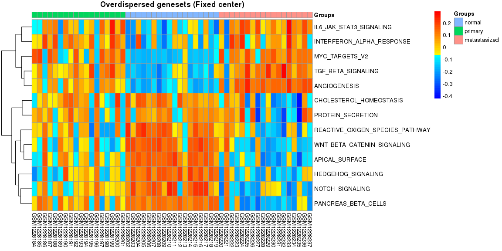<!-- --><!-- --><!-- -->

```
## $mean
##                           normal     primary metastasized
## HYPOXIA               -1.7227031  0.15417853    1.5464372
## G2M_CHECKPOINT        -2.2639684  0.51327439    1.5573424
## APOPTOSIS              0.8575483  0.50467949   -0.5414924
## XENOBIOTIC_METABOLISM -1.5758872 -2.61584692    4.4896573
## FATTY_ACID_METABOLISM  0.2834293 -2.34820856    2.7682964
## ANGIOGENESIS          -1.3139696  0.31685068    1.2147939
## ALLOGRAFT_REJECTION    3.5485838  0.04743724   -3.3309287
## SPERMATOGENESIS       -1.5001353  0.13677628    0.9645063
## PANCREAS_BETA_CELLS    5.0682688  0.05012884   -5.0863175
## 
## $sd
##                         normal  primary metastasized
## HYPOXIA               4.062518 4.352066     4.403395
## G2M_CHECKPOINT        2.091924 3.059842     1.990182
## APOPTOSIS             2.485442 2.895852     3.471136
## XENOBIOTIC_METABOLISM 3.683558 3.520520     3.611620
## FATTY_ACID_METABOLISM 2.752009 3.776029     2.187860
## ANGIOGENESIS          3.675184 2.710359     1.301119
## ALLOGRAFT_REJECTION   2.966484 3.968890     3.788113
## SPERMATOGENESIS       1.321116 2.900080     3.669915
## PANCREAS_BETA_CELLS   2.020872 5.135242     4.782154
```

We can also look at underdispersed datasets. In this case we will also look at the expression level and select only the genesets that are significantly overexpressed (`MedType = "Over"`).


```r
Plot.Genesets(RomaData = Data.FC,
              Selected = SelectGeneSets(RomaData = Data.FC, VarThr = 1e-3,
                                        VarMode = "Wil", VarType = "Under",
                                        MedThr = 1e-3, MedMode = "Wil", MedType = "Over"),
              GenesetMargin = 20, SampleMargin = 14, cluster_cols = FALSE,
              GroupInfo = Type, AggByGroupsFL = c("mean", "sd"),
              HMTite = "Underdispersed genesets (Fixed center)")
```

```
## [1] "Using genestes underdispersed according to Wilcoxon test. VarThr = 0.001"
## [1] "Using genestes overdispersed according to Wilcoxon test. MedThr = 0.001"
## [1] "37 geneset selected"
```

<!-- --><!-- --><!-- --><!-- --><!-- -->

```
## $mean
##                                       normal      primary metastasized
## TNFA_SIGNALING_VIA_NFKB           -2.5593707  0.845669896    1.4908937
## CHOLESTEROL_HOMEOSTASIS            0.8161787  0.165860763   -0.9486986
## MITOTIC_SPINDLE                    1.8369141 -0.543501018   -1.2963150
## WNT_BETA_CATENIN_SIGNALING         1.2084913 -0.346395520   -0.8521630
## TGF_BETA_SIGNALING                -1.1391626  0.261203729    0.8167847
## IL6_JAK_STAT3_SIGNALING           -1.1086574  0.243475041    0.8622447
## DNA_REPAIR                         1.3492511 -0.309196067   -0.9460842
## APOPTOSIS                          2.0449508 -0.876790667   -1.1427066
## NOTCH_SIGNALING                    0.8715475 -0.008946774   -0.8804089
## ADIPOGENESIS                       2.0687741 -0.408497069   -1.5904857
## ESTROGEN_RESPONSE_EARLY            2.8518705 -0.480570554   -2.2518128
## ESTROGEN_RESPONSE_LATE             2.3780726 -0.160411013   -2.1310375
## ANDROGEN_RESPONSE                  1.6233435 -0.517895874   -1.0425809
## MYOGENESIS                         2.1129829 -0.295732235   -1.6738751
## PROTEIN_SECRETION                  0.5179147  0.060462036   -0.4914959
## INTERFERON_ALPHA_RESPONSE         -0.7945012  0.511376425    0.2889446
## INTERFERON_GAMMA_RESPONSE          2.0862492 -0.598462258   -1.4942663
## APICAL_JUNCTION                   -2.5615069  0.655541460    1.9875812
## HEDGEHOG_SIGNALING                 1.2542502 -0.312216278   -0.9136982
## COMPLEMENT                         1.7624764  0.782920894   -2.5240688
## UNFOLDED_PROTEIN_RESPONSE         -1.3211219  0.342755585    0.7519303
## PI3K_AKT_MTOR_SIGNALING            1.5242679 -0.456079907   -0.9896688
## MTORC1_SIGNALING                  -2.1415287  0.563804208    1.4659569
## EPITHELIAL_MESENCHYMAL_TRANSITION -2.8283970  0.950982085    1.8162934
## INFLAMMATORY_RESPONSE              2.7409585 -0.811145378   -1.8917470
## FATTY_ACID_METABOLISM              2.0988980 -0.462021615   -1.6093971
## OXIDATIVE_PHOSPHORYLATION          0.4916158 -0.439450262   -0.2375800
## GLYCOLYSIS                        -2.4642766  0.585644277    1.7226443
## REACTIVE_OXIGEN_SPECIES_PATHWAY    0.7926668 -0.229489848   -0.5314940
## P53_PATHWAY                        1.9742941 -0.358692494   -1.4524081
## UV_RESPONSE_UP                     2.2015407 -0.406887495   -1.8128118
## UV_RESPONSE_DN                     1.0127222 -0.440496292   -0.6389679
## COAGULATION                       -2.2491672  0.087088793    2.0852855
## IL2_STAT5_SIGNALING                2.4846443 -0.363085316   -2.1493042
## PEROXISOME                         1.6511650 -0.331608763   -1.2515853
## ALLOGRAFT_REJECTION                1.9625595 -0.990654038   -0.9321459
## SPERMATOGENESIS                    1.6782542 -0.251544464   -1.3902104
## 
## $sd
##                                      normal   primary metastasized
## TNFA_SIGNALING_VIA_NFKB           1.7676007 1.7042746    1.8318738
## CHOLESTEROL_HOMEOSTASIS           0.6812984 1.0796037    1.4435498
## MITOTIC_SPINDLE                   1.5058026 1.6692610    1.1229801
## WNT_BETA_CATENIN_SIGNALING        0.6468899 0.9496314    0.8325720
## TGF_BETA_SIGNALING                0.6362730 0.8989359    0.9020647
## IL6_JAK_STAT3_SIGNALING           1.1230670 1.2831298    1.2309777
## DNA_REPAIR                        1.0017823 1.5922205    1.6978312
## APOPTOSIS                         1.0883695 1.4593291    1.1347241
## NOTCH_SIGNALING                   0.7083502 0.5420756    0.7882505
## ADIPOGENESIS                      0.7527168 1.6626829    1.7930692
## ESTROGEN_RESPONSE_EARLY           1.0215702 1.9860662    1.4089767
## ESTROGEN_RESPONSE_LATE            0.7629246 1.9294410    1.6295316
## ANDROGEN_RESPONSE                 0.7200877 1.2943427    1.0624642
## MYOGENESIS                        0.7889693 2.0471757    1.5617360
## PROTEIN_SECRETION                 0.7716430 1.0053624    1.8396298
## INTERFERON_ALPHA_RESPONSE         1.3440179 1.1828566    1.5305061
## INTERFERON_GAMMA_RESPONSE         1.4651558 1.5753329    1.6905189
## APICAL_JUNCTION                   0.6341234 3.2081708    3.2435113
## HEDGEHOG_SIGNALING                0.5848241 1.1367174    0.9695735
## COMPLEMENT                        0.8119910 2.0080833    1.4881147
## UNFOLDED_PROTEIN_RESPONSE         0.8239663 1.4840631    1.4327442
## PI3K_AKT_MTOR_SIGNALING           0.5855812 1.2964303    1.2155924
## MTORC1_SIGNALING                  1.0448133 1.9008288    1.4446507
## EPITHELIAL_MESENCHYMAL_TRANSITION 1.5123241 1.6449322    1.5705478
## INFLAMMATORY_RESPONSE             1.1470519 1.3296114    1.4290560
## FATTY_ACID_METABOLISM             0.7206780 1.3259349    1.1174563
## OXIDATIVE_PHOSPHORYLATION         1.2380316 1.9451769    2.4507221
## GLYCOLYSIS                        1.0020349 1.9668707    1.3733519
## REACTIVE_OXIGEN_SPECIES_PATHWAY   0.6889780 0.8690660    0.8718375
## P53_PATHWAY                       0.8979059 1.8424579    1.7211884
## UV_RESPONSE_UP                    0.7664452 1.5579009    1.3125696
## UV_RESPONSE_DN                    1.2362687 1.2691199    1.7633612
## COAGULATION                       1.0630592 1.4008891    1.3206969
## IL2_STAT5_SIGNALING               0.9464974 1.6678710    1.4764454
## PEROXISOME                        0.9235589 1.2022541    0.9036386
## ALLOGRAFT_REJECTION               1.9588924 2.1667754    2.2049177
## SPERMATOGENESIS                   0.6203504 1.5238999    1.8569205
```

and without the fixed center


```r
Plot.Genesets(RomaData = Data.NFC,
              Selected = SelectGeneSets(RomaData = Data.NFC, VarThr = 1e-3,
                                        VarMode = "Wil", VarType = "Under",
                                        MedThr = 1e-3, MedMode = "Wil", MedType = "Over"),
              GenesetMargin = 20, SampleMargin = 14, cluster_cols = FALSE,
              GroupInfo = Type, AggByGroupsFL = c("mean", "sd"),
              HMTite = "Underdispersed genesets (Non fixed center)")
```

```
## [1] "Using genestes underdispersed according to Wilcoxon test. VarThr = 0.001"
## [1] "Using genestes overdispersed according to Wilcoxon test. MedThr = 0.001"
## [1] "36 geneset selected"
```

<!-- -->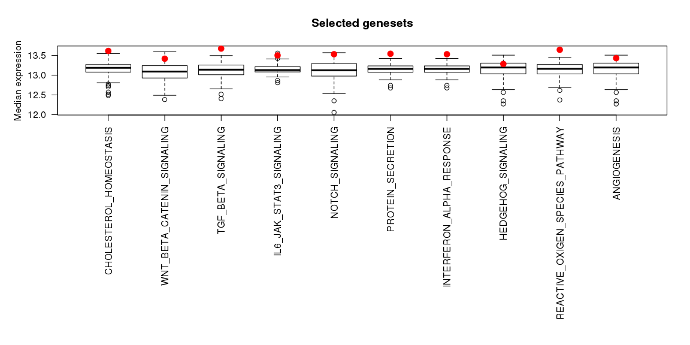<!-- --><!-- --><!-- --><!-- -->

```
## $mean
##                                       normal      primary metastasized
## TNFA_SIGNALING_VIA_NFKB           -2.5813156  0.944543230    1.5424605
## CHOLESTEROL_HOMEOSTASIS           -1.1653290  0.171733206    0.9872027
## MITOTIC_SPINDLE                    1.6674649 -0.460486968   -1.1856449
## WNT_BETA_CATENIN_SIGNALING         1.1946123 -0.324234256   -0.8741770
## TGF_BETA_SIGNALING                -1.0489698  0.298833625    0.7145795
## IL6_JAK_STAT3_SIGNALING           -0.1055840 -0.019071384    0.1758660
## DNA_REPAIR                        -1.4600560  0.402550166    0.9681193
## NOTCH_SIGNALING                    0.8625778 -0.001216404   -0.8765064
## ADIPOGENESIS                       2.0424398 -0.463952984   -1.4638665
## ESTROGEN_RESPONSE_EARLY            2.8181561 -0.513655428   -2.1762065
## ESTROGEN_RESPONSE_LATE             2.4045411 -0.271978674   -2.0547465
## ANDROGEN_RESPONSE                  1.5804040 -0.647089301   -0.8875148
## MYOGENESIS                         2.0213666 -0.161042730   -1.6204906
## PROTEIN_SECRETION                  1.0063621 -0.138959234   -0.8435979
## INTERFERON_ALPHA_RESPONSE         -0.9954784  0.609859518    0.3993085
## INTERFERON_GAMMA_RESPONSE          2.1571016 -0.505705630   -1.6130575
## APICAL_JUNCTION                    1.9720170 -0.274455291   -1.6978137
## HEDGEHOG_SIGNALING                 1.2436993 -0.247952556   -0.9394445
## COMPLEMENT                         1.8903225  0.648417363   -2.5403592
## UNFOLDED_PROTEIN_RESPONSE         -1.3655264  0.571939105    0.6828631
## PI3K_AKT_MTOR_SIGNALING            1.4407179 -0.330212386   -0.9586380
## MTORC1_SIGNALING                  -2.0616067  0.612974610    1.3154887
## MYC_TARGETS_V1                    -1.9419411  0.392518962    1.2629408
## EPITHELIAL_MESENCHYMAL_TRANSITION -2.7023440  1.340548205    1.3523734
## INFLAMMATORY_RESPONSE             -2.8526161  1.540162787    1.1137479
## OXIDATIVE_PHOSPHORYLATION          1.6304084 -0.594582973   -1.0113016
## GLYCOLYSIS                        -2.3335164  0.613581221    1.6139040
## REACTIVE_OXIGEN_SPECIES_PATHWAY    0.8463745 -0.243103399   -0.5679293
## P53_PATHWAY                       -1.9388955  0.477112353    1.3964365
## UV_RESPONSE_UP                     2.1246632 -0.303564297   -1.8524395
## UV_RESPONSE_DN                     1.9808575 -0.727659392   -1.2317840
## HEME_METABOLISM                    1.9875347 -0.449842292   -1.4507921
## COAGULATION                       -2.2437088 -0.285972997    2.6029113
## IL2_STAT5_SIGNALING                2.5391112 -0.345655918   -2.1515639
## PEROXISOME                        -1.5797223  0.339740436    1.1998355
## KRAS_SIGNALING_UP                  2.7716760 -0.292085163   -2.3533708
## 
## $sd
##                                      normal   primary metastasized
## TNFA_SIGNALING_VIA_NFKB           1.7038137 1.6616433    2.1637802
## CHOLESTEROL_HOMEOSTASIS           0.5865260 0.8286515    0.9123747
## MITOTIC_SPINDLE                   1.5501667 1.5792825    0.9440067
## WNT_BETA_CATENIN_SIGNALING        0.6511019 0.9250178    0.8408509
## TGF_BETA_SIGNALING                0.6152485 0.7847785    0.7586851
## IL6_JAK_STAT3_SIGNALING           1.3222094 1.2614603    1.9644937
## DNA_REPAIR                        0.8804906 1.1529553    0.8213868
## NOTCH_SIGNALING                   0.6876193 0.5383196    0.7508996
## ADIPOGENESIS                      0.7699157 1.4149162    1.1612196
## ESTROGEN_RESPONSE_EARLY           1.0621179 2.0167200    1.4357570
## ESTROGEN_RESPONSE_LATE            0.8164836 1.8492316    1.5143510
## ANDROGEN_RESPONSE                 0.7050807 1.3815592    1.1758301
## MYOGENESIS                        0.8596015 2.2423919    1.8227069
## PROTEIN_SECRETION                 0.8677836 0.8779161    0.7704532
## INTERFERON_ALPHA_RESPONSE         1.3023227 1.0680509    1.4044451
## INTERFERON_GAMMA_RESPONSE         1.4611184 1.6976057    2.0740752
## APICAL_JUNCTION                   0.7957557 2.8141910    2.6528434
## HEDGEHOG_SIGNALING                0.5955856 1.1155464    1.0536977
## COMPLEMENT                        0.8801078 1.9142378    1.4975069
## UNFOLDED_PROTEIN_RESPONSE         0.6783487 1.1056225    0.6557046
## PI3K_AKT_MTOR_SIGNALING           0.6574987 1.1696127    1.0494688
## MTORC1_SIGNALING                  1.0310336 1.5179881    1.0306346
## MYC_TARGETS_V1                    0.9613497 1.8637840    1.2019971
## EPITHELIAL_MESENCHYMAL_TRANSITION 1.5972005 1.8410956    1.9427088
## INFLAMMATORY_RESPONSE             3.2824685 1.0159682    2.8754415
## OXIDATIVE_PHOSPHORYLATION         0.8162386 1.3304540    0.7565895
## GLYCOLYSIS                        1.0421022 1.8508546    1.2384813
## REACTIVE_OXIGEN_SPECIES_PATHWAY   0.5931143 0.7912802    0.6655290
## P53_PATHWAY                       0.8692115 1.4663357    1.0999978
## UV_RESPONSE_UP                    0.7195897 1.4824667    1.2558912
## UV_RESPONSE_DN                    1.0125230 1.3868333    1.1282736
## HEME_METABOLISM                   0.9291641 1.2739010    1.4827270
## COAGULATION                       0.8895806 1.2248333    1.5919707
## IL2_STAT5_SIGNALING               0.9396558 1.8655322    1.6143597
## PEROXISOME                        0.9400333 1.1583586    0.9010700
## KRAS_SIGNALING_UP                 0.9580692 2.3330731    1.8356006
```

### Statistical comparison across samples

Visual inspection already stresses the difference between the groups. It is possible to quantify theses differnces performing statistical testing:


```r
CompareAcrossSamples(RomaData = Data.FC,
                     Selected = SelectGeneSets(RomaData = Data.FC, VarThr = 1e-3,
                                               VarMode = "Wil", VarType = "Over"),
                     Groups = Type)
```

```
## [1] "Using genestes overdispersed according to Wilcoxon test. VarThr = 0.001"
## [1] "7 geneset selected"
## [1] "Performing Type III AOV (R default)"
##              Df Sum Sq Mean Sq F value Pr(>F)
## Group         2     30   15.01   0.864  0.422
## Residuals   375   6511   17.36
```

<!-- --><!-- -->

```
## [1] "Performing Type III AOV (R default)"
##                Df Sum Sq Mean Sq F value Pr(>F)    
## Group           2     30   15.00   1.306  0.272    
## Group:GeneSet  18   2410  133.90  11.658 <2e-16 ***
## Residuals     357   4100   11.49                   
## ---
## Signif. codes:  0 '***' 0.001 '**' 0.01 '*' 0.05 '.' 0.1 ' ' 1
```

<!-- -->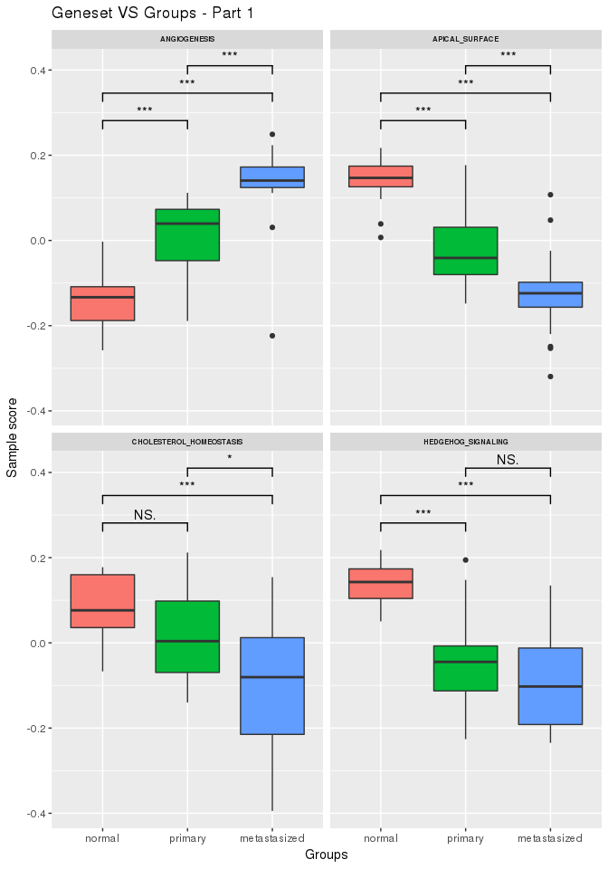<!-- -->

```
## [1] "A significant difference is observed across groups and metagenes"
## [1] "Calculating Tukey Honest Significant Differences"
## [1] "54 significant differences found"
```

<!-- --><!-- --><!-- -->


```r
CompareAcrossSamples(RomaData = Data.NFC,
                     Selected = SelectGeneSets(RomaData = Data.FC, VarThr = 1e-3,
                                               VarMode = "Wil", VarType = "Over"),
                     Groups = Type)
```

```
## [1] "Using genestes overdispersed according to Wilcoxon test. VarThr = 0.001"
## [1] "7 geneset selected"
## [1] "Performing Type III AOV (R default)"
##              Df Sum Sq Mean Sq F value Pr(>F)
## Group         2     36   18.02   1.228  0.294
## Residuals   375   5503   14.67
```

<!-- --><!-- -->

```
## [1] "Performing Type III AOV (R default)"
##                Df Sum Sq Mean Sq F value Pr(>F)    
## Group           2     36   18.02   1.875  0.155    
## Group:GeneSet  18   2072  115.09  11.975 <2e-16 ***
## Residuals     357   3431    9.61                   
## ---
## Signif. codes:  0 '***' 0.001 '**' 0.01 '*' 0.05 '.' 0.1 ' ' 1
```

<!-- --><!-- -->

```
## [1] "A significant difference is observed across groups and metagenes"
## [1] "Calculating Tukey Honest Significant Differences"
## [1] "58 significant differences found"
```

<!-- --><!-- --><!-- --><!-- -->


### Gene weights

We can also explore the gene weigths with the fixed center


```r
PlotGeneWeight(RomaData = Data.FC, PlotGenes = 30,
               ExpressionMatrix = MatData, LogExpression = FALSE,
               Selected = SelectGeneSets(RomaData = Data.FC, VarThr = 1e-3,
                                         VarMode = "Wil", VarType = "Over"),
               PlotWeigthSign = TRUE)
```

```
## [1] "Using genestes overdispersed according to Wilcoxon test. VarThr = 0.001"
## [1] "7 geneset selected"
```

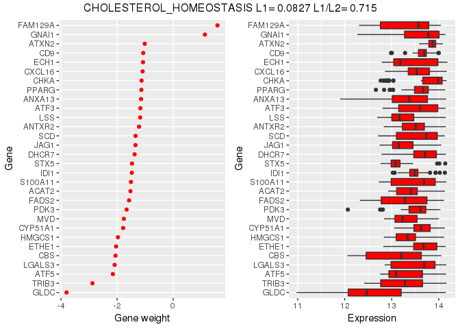<!-- --><!-- --><!-- -->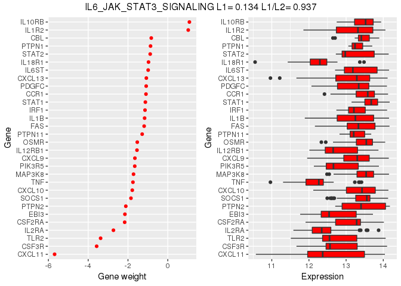<!-- --><!-- --><!-- --><!-- -->

and without the fixed center


```r
PlotGeneWeight(RomaData = Data.NFC, PlotGenes = 30,
               ExpressionMatrix = MatData, LogExpression = FALSE,
               Selected = SelectGeneSets(RomaData = Data.NFC, VarThr = 1e-3,
                                         VarMode = "Wil", VarType = "Over"),
               PlotWeigthSign = TRUE)
```

```
## [1] "Using genestes overdispersed according to Wilcoxon test. VarThr = 0.001"
## [1] "9 geneset selected"
```

<!-- --><!-- -->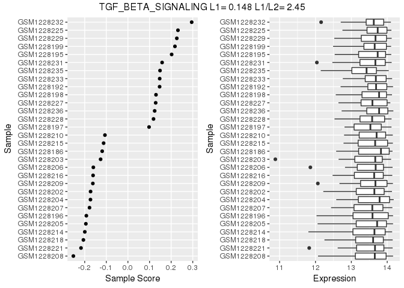<!-- --><!-- --><!-- --><!-- --><!-- --><!-- --><!-- -->

### Sample projections

Moreover, we can look at the projections of the samples with the fixed center


```r
PlotSampleProjections(RomaData = Data.FC, PlotSamples = 30,
                      ExpressionMatrix = MatData, LogExpression = FALSE,
                      Selected = SelectGeneSets(RomaData = Data.FC, VarThr = 1e-3,
                                                VarMode = "Wil", VarType = "Over"),
                      PlotPCProj = "none")
```

```
## [1] "Using genestes overdispersed according to Wilcoxon test. VarThr = 0.001"
## [1] "7 geneset selected"
```

<!-- --><!-- --><!-- --><!-- -->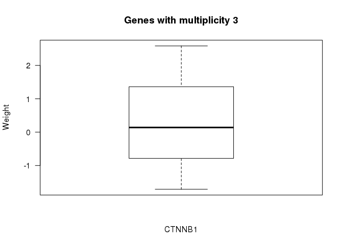<!-- -->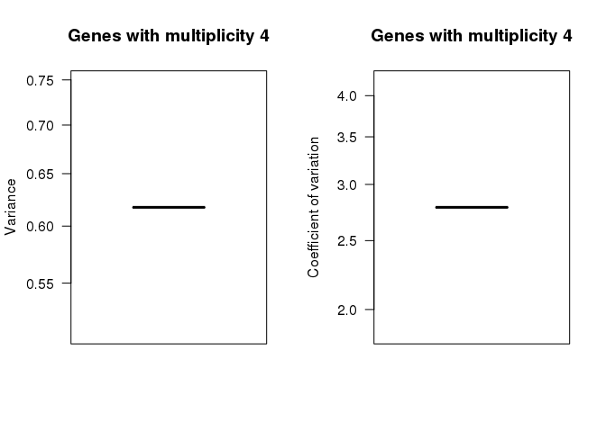<!-- --><!-- -->

and without the fixed center


```r
PlotSampleProjections(RomaData = Data.NFC, PlotSamples = 30,
                      ExpressionMatrix = MatData, LogExpression = FALSE,
                      Selected = SelectGeneSets(RomaData = Data.NFC, VarThr = 1e-3,
                                                VarMode = "Wil", VarType = "Over"),
                      PlotPCProj = "none")
```

```
## [1] "Using genestes overdispersed according to Wilcoxon test. VarThr = 0.001"
## [1] "9 geneset selected"
```

<!-- --><!-- --><!-- --><!-- --><!-- --><!-- --><!-- --><!-- --><!-- -->

### Recurrent genes

Finally, we can look at genes which appear across different genesests and explore thier weithgs


```r
PlotRecurringGenes(RomaData = Data.NFC,
                   Selected = SelectGeneSets(RomaData = Data.NFC, VarThr = 1e-3,
                                             VarMode = "Wil", VarType = "Over"),
                   GenesByGroup = 25, MinMult = 3)
```

```
## [1] "Using genestes overdispersed according to Wilcoxon test. VarThr = 0.001"
## [1] "9 geneset selected"
```

<!-- -->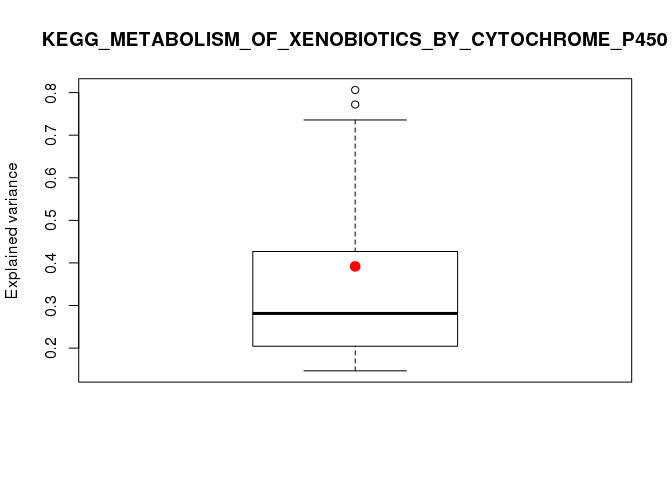<!-- --><!-- --><!-- --><!-- -->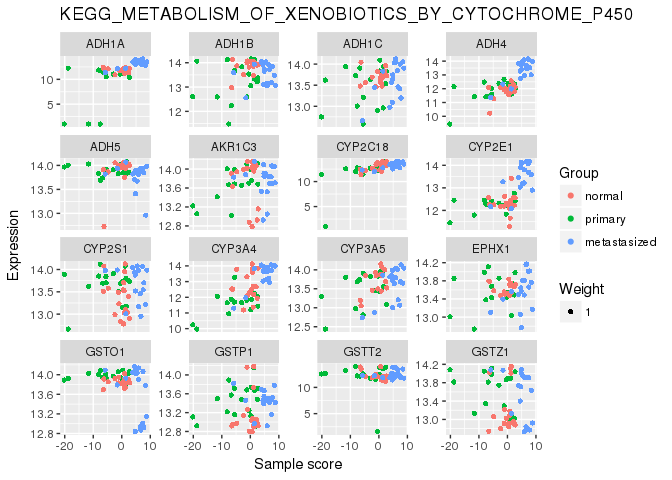<!-- -->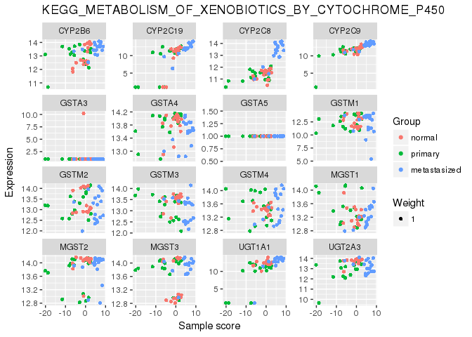<!-- -->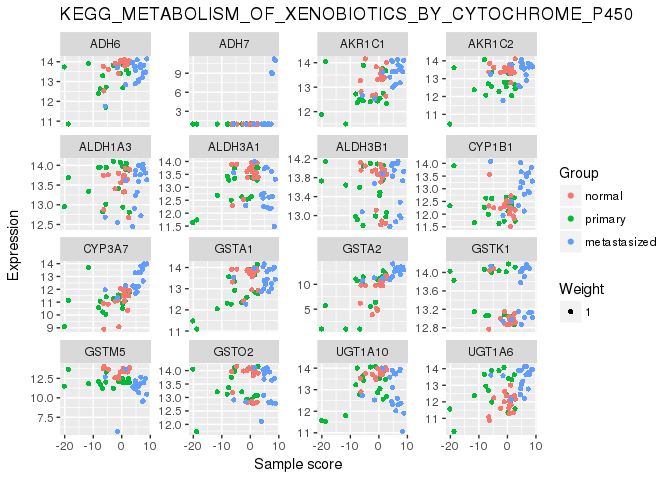<!-- --><!-- --><!-- -->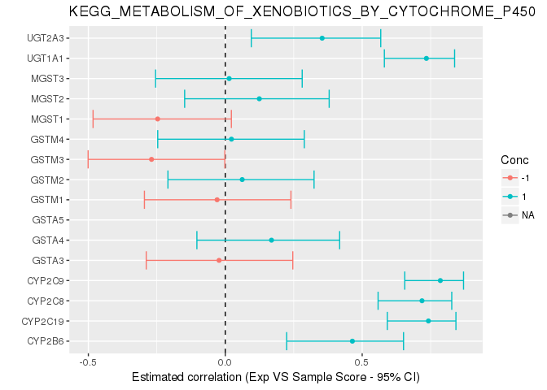<!-- -->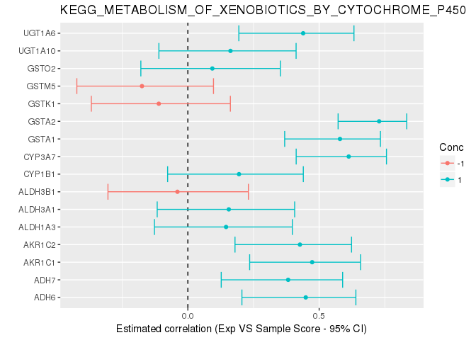<!-- --><!-- --><!-- --><!-- --><!-- --><!-- --><!-- --><!-- --><!-- --><!-- --><!-- --><!-- --><!-- --><!-- --><!-- --><!-- --><!-- --><!-- --><!-- --><!-- --><!-- --><!-- --><!-- --><!-- --><!-- --><!-- --><!-- --><!-- -->


### Looking at the details 

By default, rRoma will perform the appropiate anaysis without showing all the details to the users. However, it is possible to obtain additioanl graphical and textual information. This will results in a large amount of inromation being derived an plotted. Hence, it is not advisable to do that for large analysis. To show an example of the extended information that can be produced, we will first obtain a smaller module list.


```r
RedGMT <- SelectFromMSIGdb(SearchString = c("xenobiotic", "keg"), Mode = "ALL")
```

```
## [1] "Searching in MsigDB v6.0"
## [1] "The following genesets have been selected:"
## [1] "KEGG_METABOLISM_OF_XENOBIOTICS_BY_CYTOCHROME_P450 (70 genes)"
```

Wen perfoming ROMA we will now set `PlotData = TRUE` (to produce diagnostic plots), `MoreInfo = TRUE` (to print additional diagnostic information), and `FullSampleInfo = TRUE` (to compute and save additional information on the samples). Note that rRoma will ask to confim cetain choiches if R is run interactivelly.


```r
tictoc::tic()
RedData.NFC <- rRoma.R(ExpressionMatrix = MatData, ModuleList = RedGMT, FixedCenter = FALSE,
                    UseParallel = TRUE, nCores = 8, ClusType = "FORK",
                    PCSignMode="CorrelateAllWeightsByGene", 
                    PlotData = TRUE, MoreInfo = TRUE, FullSampleInfo = TRUE,
                    Grouping = Type, GroupPCSign = FALSE)
```

```
## [1] "Centering gene expression over samples"
## [1] "Using local center (NOT centering over genes)"
## [1] "All the genesets will be used"
## [1] "2017-04-14 09:11:38 CEST"
## [1] "[1/1] Working on KEGG_METABOLISM_OF_XENOBIOTICS_BY_CYTOCHROME_P450 - http://www.broadinstitute.org/gsea/msigdb/cards/KEGG_METABOLISM_OF_XENOBIOTICS_BY_CYTOCHROME_P450"
## [1] "70 genes available for analysis"
## [1] "The following genes will be used:"
##  [1] "CYP2F1"  "CYP2E1"  "AKR1C4"  "EPHX1"   "CYP3A5"  "UGT2B28" "CYP3A4" 
##  [8] "GSTP1"   "GSTT2"   "GSTT1"   "AKR1C3"  "GSTZ1"   "CYP2C18" "ADH1B"  
## [15] "CYP2S1"  "ADH1C"   "ADH4"    "ADH5"    "GSTO1"   "ADH1A"   "GSTA5"  
## [22] "MGST2"   "MGST1"   "MGST3"   "GSTA3"   "GSTM1"   "UGT2B11" "CYP2C9" 
## [29] "GSTA4"   "CYP2C19" "GSTM4"   "CYP2C8"  "GSTM3"   "CYP2B6"  "GSTM2"  
## [36] "UGT2A3"  "UGT1A4"  "UGT1A1"  "CYP3A7"  "UGT1A3"  "GSTM5"   "UGT1A10"
## [43] "UGT1A8"  "UGT1A7"  "GSTA1"   "UGT1A6"  "GSTA2"   "ALDH3A1" "UGT1A5" 
## [50] "GSTK1"   "AKR1C2"  "AKR1C1"  "CYP1A1"  "ADH7"    "CYP1A2"  "CYP1B1" 
## [57] "ADH6"    "UGT2A1"  "ALDH1A3" "ALDH3B1" "ALDH3B2" "CYP3A43" "UGT1A9" 
## [64] "DHDH"    "GSTO2"   "UGT2B10" "UGT2B7"  "UGT2B4"  "UGT2B17" "UGT2B15"
## [1] "Detecting outliers using leave one out and median-absolute-deviations away from median (scater package)"
```

<!-- -->

```
## [1] "19 gene(s) will be filtered:"
##  [1] "CYP2F1"  "AKR1C4"  "UGT2B28" "GSTT1"   "UGT2B11" "UGT1A4"  "UGT1A3" 
##  [8] "UGT1A8"  "UGT1A7"  "UGT1A5"  "CYP1A1"  "CYP1A2"  "UGT2A1"  "ALDH3B2"
## [15] "CYP3A43" "UGT1A9"  "DHDH"    "UGT2B4"  "UGT2B17"
## [1] "Not using weigths for PCA computation"
## [1] "Pre-filter data"
## [1] "L1 = 0.324847621722281 L1/L2 = 3.36077904254818"
## [1] "Median expression (uncentered): 12.7811547706959"
## [1] "Median expression (centered/weighted): 0.10923220260671"
## [1] "Post-filter data"
## [1] "L1 = 0.391959147712557 L1/L2 = 3.06919422461758"
## [1] "Median expression (uncentered): 13.2177305375661"
## [1] "Median expression (centered/weighted): 0.0819972157791584"
## [1] "Previous sample size: 0"
## [1] "Next sample size: 70"
## [1] "Computing samples"
##    user  system elapsed 
##   0.103   0.194   9.005
```

<!-- --><!-- --><!-- -->

```
## [1] "Missing gene weights will be replaced by 1"
## [1] "Orienting PC by correlating gene expression and PC projections"
## [1] "Not using groups"
## [1] "Computing correlations"
## [1] "Correcting using weights"
## [1] "Missing gene weights will be replaced by 1"
## [1] "Orienting PC by correlating gene expression and PC projections"
## [1] "Not using groups"
## [1] "Computing correlations"
## [1] "Correcting using weights"
## [1] "Missing gene weights will be replaced by 1"
## [1] "Orienting PC by correlating gene expression and PC projections"
## [1] "Not using groups"
## [1] "Computing correlations"
## [1] "Correcting using weights"
```

<!-- -->

```
## [1] "Plotting expression VS projections"
```

<!-- --><!-- --><!-- -->

```
## [1] "Plotting correlations of expression VS projections"
```

```
## Warning in cor(x, y): l'cart type est nulle
```

<!-- --><!-- -->

```
## Warning: Removed 1 rows containing missing values (geom_errorbar).
```

```
## Warning: Removed 1 rows containing missing values (geom_point).
```

<!-- --><!-- --><!-- -->

```
## [1] "Plotting expression VS PC weigths"
```

<!-- --><!-- --><!-- -->

```
## [1] "Plotting correlation of expression VS PC weigths"
```

<!-- --><!-- --><!-- -->

```r
tictoc::toc()
```

```
## 26.033 sec elapsed
```


```r
PlotSampleProjections(RomaData = RedData.NFC, PlotSamples = 30,
                      ExpressionMatrix = MatData, LogExpression = FALSE,
                      Selected = NULL,
                      PlotPCProj = c('Points', 'Density',  'Bins'))
```

```
## [1] "1 geneset selected"
```

<!-- -->

```
## Warning: Removed 18 rows containing missing values (geom_point).
```

<!-- -->

```
## Warning: Removed 18 rows containing non-finite values (stat_density2d).
```

<!-- -->

```
## Warning: Removed 18 rows containing non-finite values (stat_bin2d).
```

<!-- -->
```


