# rROMA
Luca Albergante (luca.albergante@gmail.com)  
`r Sys.Date()`  

This package provides an R implementation of [ROMA](http://journal.frontiersin.org/article/10.3389/fgene.2016.00018/full). The package is under active development and is currently being tested.

A Java implementation developed by Andrei Zynovyev and is also [available](https://github.com/sysbio-curie/Roma).

## Intalling rROMA

The rRoma package relies on the `scater` package, which is available only on BioConductor. This package can be installed with the following command


```r
source("https://bioconductor.org/biocLite.R")
biocLite("scater")
```

rRoma can then be installed using `devtools`


```r
if(!require("devtools")){
  install.packages("devtools")
}
devtools::install_github("Albluca/rROMA")
```

The packages `GEOquery`, `tictoc`, and `readr` are not required to run rROMA, but are used in the following example and need to be installed to reproduce the analysis 


```r
if(!require("GEOquery")){
  source("https://bioconductor.org/biocLite.R")
  biocLite("GEOquery")
}
```

```
## Loading required package: GEOquery
```

```
## Loading required package: Biobase
```

```
## Loading required package: BiocGenerics
```

```
## Loading required package: parallel
```

```
## 
## Attaching package: 'BiocGenerics'
```

```
## The following objects are masked from 'package:parallel':
## 
##     clusterApply, clusterApplyLB, clusterCall, clusterEvalQ,
##     clusterExport, clusterMap, parApply, parCapply, parLapply,
##     parLapplyLB, parRapply, parSapply, parSapplyLB
```

```
## The following objects are masked from 'package:stats':
## 
##     IQR, mad, xtabs
```

```
## The following objects are masked from 'package:base':
## 
##     anyDuplicated, append, as.data.frame, cbind, colnames,
##     do.call, duplicated, eval, evalq, Filter, Find, get, grep,
##     grepl, intersect, is.unsorted, lapply, lengths, Map, mapply,
##     match, mget, order, paste, pmax, pmax.int, pmin, pmin.int,
##     Position, rank, rbind, Reduce, rownames, sapply, setdiff,
##     sort, table, tapply, union, unique, unsplit, which, which.max,
##     which.min
```

```
## Welcome to Bioconductor
## 
##     Vignettes contain introductory material; view with
##     'browseVignettes()'. To cite Bioconductor, see
##     'citation("Biobase")', and for packages 'citation("pkgname")'.
```

```
## Setting options('download.file.method.GEOquery'='auto')
```

```
## Setting options('GEOquery.inmemory.gpl'=FALSE)
```

```r
if(!require("readr")){
  install.packages("readr")
}
```

```
## Loading required package: readr
```

```r
if(!require("tictoc")){
  install.packages("tictoc")
}
```

```
## Loading required package: tictoc
```

## Using rROMA

The package can be loaded with the usual syntax, i.e., by typing


```r
library(rRoma)
```

rRoma requires a gene expression matrix - with column names indicating samples and row names indicating gene names - and a module file containing information on the genesets that need to be evaluated. The module file can be loaded from a GMT file. Functions to automate the generation of then GMT file are also available.

Various functions are then available to explore the analysis, including plotting and statistical cross sample analysis.

## An example

To show a concrete example of rROMA we will use a dataset available on GEO. The output of the analysis is not reported due to limitation in the markdown files used by GitHub. Let us begin by getting the description of the dataset


```r
library(GEOquery)
gse <- getGEO("GSE50760", GSEMatrix = TRUE)
```

```
## https://ftp.ncbi.nlm.nih.gov/geo/series/GSE50nnn/GSE50760/matrix/
```

```
## OK
```

```
## Found 1 file(s)
```

```
## GSE50760_series_matrix.txt.gz
```

```
## File stored at:
```

```
## /var/folders/0d/46tymjcj0qxbtqgvxp1623400000gn/T//RtmpVCDhTg/GPL11154.soft
```

Then we get the actual expression expression files


```r
filePaths = getGEOSuppFiles("GSE50760")
```

```
## https://ftp.ncbi.nlm.nih.gov/geo/series/GSE50nnn/GSE50760/suppl/
```

```
## OK
```

Now we can construct the expression matrix. Note that the code below is designed to work on a Unix-like environment (e.g. MacOS). The execution on a Windows environment may require replacing `"/"` with `"\"`.


```r
library(readr)
Content <- untar(row.names(filePaths)[1], list = TRUE)
untar(row.names(filePaths)[1], list = FALSE)

MatData <- NULL

for(i in 1:length(Content)){
  Exp <- read_delim(Content[i], "\t", escape_double = FALSE, trim_ws = TRUE)
  
  if(is.null(MatData)){
    MatData <- cbind(unlist(Exp[,1]), unlist(Exp[,2]))
  } else {
    if(any(MatData[,1] != unlist(Exp[,1]))){
      stop("Incompatible samples")
    }
    MatData <- cbind(MatData, unlist(Exp[,2]))
  }
  
  file.remove(Content[i])
  
}
```

```
## Parsed with column specification:
## cols(
##   genes = col_character(),
##   AMC_2.1_FPKM = col_double()
## )
```

```
## Parsed with column specification:
## cols(
##   genes = col_character(),
##   AMC_3.1_FPKM = col_double()
## )
```

```
## Parsed with column specification:
## cols(
##   genes = col_character(),
##   AMC_5.1_FPKM = col_double()
## )
```

```
## Parsed with column specification:
## cols(
##   genes = col_character(),
##   AMC_6.1_FPKM = col_double()
## )
```

```
## Parsed with column specification:
## cols(
##   genes = col_character(),
##   AMC_7.1_FPKM = col_double()
## )
```

```
## Parsed with column specification:
## cols(
##   genes = col_character(),
##   AMC_8.1_FPKM = col_double()
## )
```

```
## Parsed with column specification:
## cols(
##   genes = col_character(),
##   AMC_9.1_FPKM = col_double()
## )
```

```
## Parsed with column specification:
## cols(
##   genes = col_character(),
##   AMC_10.1_FPKM = col_double()
## )
```

```
## Parsed with column specification:
## cols(
##   genes = col_character(),
##   AMC_12.1_FPKM = col_double()
## )
```

```
## Parsed with column specification:
## cols(
##   genes = col_character(),
##   AMC_13.1_FPKM = col_double()
## )
```

```
## Parsed with column specification:
## cols(
##   genes = col_character(),
##   AMC_17.1_FPKM = col_double()
## )
```

```
## Parsed with column specification:
## cols(
##   genes = col_character(),
##   AMC_18.1_FPKM = col_double()
## )
```

```
## Parsed with column specification:
## cols(
##   genes = col_character(),
##   AMC_19.1_FPKM = col_double()
## )
```

```
## Parsed with column specification:
## cols(
##   genes = col_character(),
##   AMC_20.1_FPKM = col_double()
## )
```

```
## Parsed with column specification:
## cols(
##   genes = col_character(),
##   AMC_21.1_FPKM = col_double()
## )
```

```
## Parsed with column specification:
## cols(
##   genes = col_character(),
##   AMC_22.1_FPKM = col_double()
## )
```

```
## Parsed with column specification:
## cols(
##   genes = col_character(),
##   AMC_23.1_FPKM = col_double()
## )
```

```
## Parsed with column specification:
## cols(
##   genes = col_character(),
##   AMC_24.1_FPKM = col_double()
## )
```

```
## Parsed with column specification:
## cols(
##   genes = col_character(),
##   AMC_2.2_FPKM = col_double()
## )
```

```
## Parsed with column specification:
## cols(
##   genes = col_character(),
##   AMC_3.2_FPKM = col_double()
## )
```

```
## Parsed with column specification:
## cols(
##   genes = col_character(),
##   AMC_5.2_FPKM = col_double()
## )
```

```
## Parsed with column specification:
## cols(
##   genes = col_character(),
##   AMC_6.2_FPKM = col_double()
## )
```

```
## Parsed with column specification:
## cols(
##   genes = col_character(),
##   AMC_7.2_FPKM = col_double()
## )
```

```
## Parsed with column specification:
## cols(
##   genes = col_character(),
##   AMC_8.2_FPKM = col_double()
## )
```

```
## Parsed with column specification:
## cols(
##   genes = col_character(),
##   AMC_9.2_FPKM = col_double()
## )
```

```
## Parsed with column specification:
## cols(
##   genes = col_character(),
##   AMC_10.2_FPKM = col_double()
## )
```

```
## Parsed with column specification:
## cols(
##   genes = col_character(),
##   AMC_12.2_FPKM = col_double()
## )
```

```
## Parsed with column specification:
## cols(
##   genes = col_character(),
##   AMC_13.2_FPKM = col_double()
## )
```

```
## Parsed with column specification:
## cols(
##   genes = col_character(),
##   AMC_17.2_FPKM = col_double()
## )
```

```
## Parsed with column specification:
## cols(
##   genes = col_character(),
##   AMC_18.2_FPKM = col_double()
## )
```

```
## Parsed with column specification:
## cols(
##   genes = col_character(),
##   AMC_19.2_FPKM = col_double()
## )
```

```
## Parsed with column specification:
## cols(
##   genes = col_character(),
##   AMC_20.2_FPKM = col_double()
## )
```

```
## Parsed with column specification:
## cols(
##   genes = col_character(),
##   AMC_21.2_FPKM = col_double()
## )
```

```
## Parsed with column specification:
## cols(
##   genes = col_character(),
##   AMC_22.2_FPKM = col_double()
## )
```

```
## Parsed with column specification:
## cols(
##   genes = col_character(),
##   AMC_23.2_FPKM = col_double()
## )
```

```
## Parsed with column specification:
## cols(
##   genes = col_character(),
##   AMC_24.2_FPKM = col_double()
## )
```

```
## Parsed with column specification:
## cols(
##   genes = col_character(),
##   AMC_2.3_FPKM = col_double()
## )
```

```
## Parsed with column specification:
## cols(
##   genes = col_character(),
##   AMC_3.3_FPKM = col_double()
## )
```

```
## Parsed with column specification:
## cols(
##   genes = col_character(),
##   AMC_5.3_FPKM = col_double()
## )
```

```
## Parsed with column specification:
## cols(
##   genes = col_character(),
##   AMC_6.3_FPKM = col_double()
## )
```

```
## Parsed with column specification:
## cols(
##   genes = col_character(),
##   AMC_7.3_FPKM = col_double()
## )
```

```
## Parsed with column specification:
## cols(
##   genes = col_character(),
##   AMC_8.3_FPKM = col_double()
## )
```

```
## Parsed with column specification:
## cols(
##   genes = col_character(),
##   AMC_9.3_FPKM = col_double()
## )
```

```
## Parsed with column specification:
## cols(
##   genes = col_character(),
##   AMC_10.3_FPKM = col_double()
## )
```

```
## Parsed with column specification:
## cols(
##   genes = col_character(),
##   AMC_12.3_FPKM = col_double()
## )
```

```
## Parsed with column specification:
## cols(
##   genes = col_character(),
##   AMC_13.3_FPKM = col_double()
## )
```

```
## Parsed with column specification:
## cols(
##   genes = col_character(),
##   AMC_17.3_FPKM = col_double()
## )
```

```
## Parsed with column specification:
## cols(
##   genes = col_character(),
##   AMC_18.3_FPKM = col_double()
## )
```

```
## Parsed with column specification:
## cols(
##   genes = col_character(),
##   AMC_19.3_FPKM = col_double()
## )
```

```
## Parsed with column specification:
## cols(
##   genes = col_character(),
##   AMC_20.3_FPKM = col_double()
## )
```

```
## Parsed with column specification:
## cols(
##   genes = col_character(),
##   AMC_21.3_FPKM = col_double()
## )
```

```
## Parsed with column specification:
## cols(
##   genes = col_character(),
##   AMC_22.3_FPKM = col_double()
## )
```

```
## Parsed with column specification:
## cols(
##   genes = col_character(),
##   AMC_23.3_FPKM = col_double()
## )
```

```
## Parsed with column specification:
## cols(
##   genes = col_character(),
##   AMC_24.3_FPKM = col_double()
## )
```

```r
SplitPath <- unlist(strsplit(rownames(filePaths)[1], "/"))
SplitPath <- SplitPath[-length(SplitPath)]
unlink(x = paste(SplitPath, collapse = "/"), recursive = TRUE)

Genes <- MatData[,1]
MatData <- data.matrix(data.frame(MatData[,-1]))
rownames(MatData) <- Genes
colnames(MatData) <- unlist(lapply(strsplit(Content, "_"), "[[", 1))
```

And look at the different groups of cells present


```r
Type <- as.character(gse$GSE50760_series_matrix.txt.gz[[1]])
Type <- unlist(lapply(strsplit(Type, " "), "[[", 1))
names(Type) = as.character(gse$GSE50760_series_matrix.txt.gz[[2]])

table(Type)
```

```
## Type
## metastasized       normal      primary 
##           18           18           18
```

For convenience, we will transform `Type` into a factor:


```r
Type <- as.factor(Type)
```

At this point we can create the metagene files. We will extract all the "HALLPARK" geneset from MSig.


```r
AllHall <- SelectFromMSIGdb("HALLMARK")
```

```
## [1] "Searching in MsigDB v6.0"
```

```r
AllHall <- lapply(AllHall, function(x){
  x$Name <- sub("HALLMARK_", "", x$Name)
  x
})
```

To reduce potential problmes we will remove genes with a duplicated name


```r
if(any(duplicated(rownames(MatData)))){
  MatData <- MatData[!(rownames(MatData) %in% rownames(MatData)[duplicated(rownames(MatData))]), ]
}
```

And now we are ready to perform ROMA without fixed center


```r
tictoc::tic()
Data.NFC <- rRoma.R(ExpressionMatrix = MatData, centerData = TRUE, ExpFilter = FALSE,
                      ApproxSamples = 5, ModuleList = AllHall, MinGenes = 10,
                      MaxGenes = 200, nSamples = 100, UseWeigths = FALSE,
                      DefaultWeight = 1, FixedCenter = FALSE,
                      GeneOutDetection = 'L1OutExpOut', GeneOutThr = 5,
                      GeneSelMode = "All", SampleFilter = TRUE, MoreInfo = FALSE,
                      PlotData = FALSE, PCSignMode = "CorrelateAllWeightsByGene", OutGeneNumber = 5,
                      Ncomp = 100, OutGeneSpace = 5, PCADims = 2, PCSignThr = NULL,
                      UseParallel = TRUE, nCores = 3, ClusType = "FORK", FullSampleInfo = FALSE)
```

```
## [1] "Centering gene expression over samples"
## [1] "Using local center (NOT centering over genes)"
## [1] "All the genesets will be used"
## [1] "2017-04-12 16:59:47 CEST"
## [1] "[1/50] Working on NOTCH_SIGNALING - http://www.broadinstitute.org/gsea/msigdb/cards/HALLMARK_NOTCH_SIGNALING"
## [1] "32 genes available for analysis"
## [1] "Detecting outliers using leave one out and median-absolute-deviations away from median (scater package)"
## [1] "1 genes will be filtered:"
## [1] "KAT2A"
## [1] "Not using weigths for PCA computation"
## [1] "Pre-filter data"
## [1] "L1 = 0.218112782355521 L1/L2 = 2.14223137940078"
## [1] "Median expression (uncentered): 11705.5"
## [1] "Median expression (centered/weighted): -55.4722222222217"
## [1] "Post-filter data"
## [1] "L1 = 0.200047778345952 L1/L2 = 1.87427068873295"
## [1] "Median expression (uncentered): 11760.5"
## [1] "Median expression (centered/weighted): -8.19444444444434"
## [1] "Previous sample size: 0"
## [1] "Next sample size: 32"
## [1] "Computing samples"
##    user  system elapsed 
##   0.047   0.027   6.832 
## [1] "Missing gene weights will be replaced by 1"
## [1] "Orienting PC by correlating gene expression and PC projections"
## [1] "Not using groups"
## [1] "Computing correlations"
## [1] "Correcting using weights"
## [1] "Missing gene weights will be replaced by 1"
## [1] "Orienting PC by correlating gene expression and PC projections"
## [1] "Not using groups"
## [1] "Computing correlations"
## [1] "Correcting using weights"
## [1] "Missing gene weights will be replaced by 1"
## [1] "Orienting PC by correlating gene expression and PC projections"
## [1] "Not using groups"
## [1] "Computing correlations"
## [1] "Correcting using weights"
## [1] "2017-04-12 16:59:57 CEST"
## [1] "[2/50] Working on HEDGEHOG_SIGNALING - http://www.broadinstitute.org/gsea/msigdb/cards/HALLMARK_HEDGEHOG_SIGNALING"
## [1] "36 genes available for analysis"
## [1] "Detecting outliers using leave one out and median-absolute-deviations away from median (scater package)"
## [1] "2 genes will be filtered:"
## [1] "SHH"  "SCG2"
## [1] "Not using weigths for PCA computation"
## [1] "Pre-filter data"
## [1] "L1 = 0.238951393021584 L1/L2 = 2.20609876528576"
## [1] "Median expression (uncentered): 9107"
## [1] "Median expression (centered/weighted): -230.555555555556"
## [1] "Post-filter data"
## [1] "L1 = 0.19044828278847 L1/L2 = 1.59121559698214"
## [1] "Median expression (uncentered): 9113"
## [1] "Median expression (centered/weighted): -230.555555555556"
## [1] "Previous sample size: 32"
## [1] "Next sample size: 36"
## [1] "Computing samples"
##    user  system elapsed 
##   0.049   0.028   2.672 
## [1] "Missing gene weights will be replaced by 1"
## [1] "Orienting PC by correlating gene expression and PC projections"
## [1] "Not using groups"
## [1] "Computing correlations"
## [1] "Correcting using weights"
## [1] "Missing gene weights will be replaced by 1"
## [1] "Orienting PC by correlating gene expression and PC projections"
## [1] "Not using groups"
## [1] "Computing correlations"
## [1] "Correcting using weights"
## [1] "Missing gene weights will be replaced by 1"
## [1] "Orienting PC by correlating gene expression and PC projections"
## [1] "Not using groups"
## [1] "Computing correlations"
## [1] "Correcting using weights"
## [1] "2017-04-12 17:00:00 CEST"
## [1] "[3/50] Working on ANGIOGENESIS - http://www.broadinstitute.org/gsea/msigdb/cards/HALLMARK_ANGIOGENESIS"
## [1] "36 genes available for analysis"
## [1] "Detecting outliers using leave one out and median-absolute-deviations away from median (scater package)"
## [1] "2 genes will be filtered:"
## [1] "SERPINA5" "OLR1"    
## [1] "Not using weigths for PCA computation"
## [1] "Pre-filter data"
## [1] "L1 = 0.241722268030935 L1/L2 = 2.07659291489548"
## [1] "Median expression (uncentered): 9486.5"
## [1] "Median expression (centered/weighted): -524.962962962964"
## [1] "Post-filter data"
## [1] "L1 = 0.198532563319471 L1/L2 = 1.72706137414067"
## [1] "Median expression (uncentered): 9719.5"
## [1] "Median expression (centered/weighted): -463.740740740741"
## [1] "Previous sample size: 36"
## [1] "Next sample size: 36"
## [1] "Reusing previous sampling (Same metagene size)"
## [1] "Missing gene weights will be replaced by 1"
## [1] "Orienting PC by correlating gene expression and PC projections"
## [1] "Not using groups"
## [1] "Computing correlations"
## [1] "Correcting using weights"
## [1] "Missing gene weights will be replaced by 1"
## [1] "Orienting PC by correlating gene expression and PC projections"
## [1] "Not using groups"
## [1] "Computing correlations"
## [1] "Correcting using weights"
## [1] "Missing gene weights will be replaced by 1"
## [1] "Orienting PC by correlating gene expression and PC projections"
## [1] "Not using groups"
## [1] "Computing correlations"
## [1] "Correcting using weights"
## [1] "2017-04-12 17:00:00 CEST"
## [1] "[4/50] Working on PANCREAS_BETA_CELLS - http://www.broadinstitute.org/gsea/msigdb/cards/HALLMARK_PANCREAS_BETA_CELLS"
## [1] "40 genes available for analysis"
## [1] "Detecting outliers using leave one out and median-absolute-deviations away from median (scater package)"
## [1] "3 genes will be filtered:"
## [1] "SYT13" "SCGN"  "SST"  
## [1] "Not using weigths for PCA computation"
## [1] "Pre-filter data"
## [1] "L1 = 0.432865048299536 L1/L2 = 5.11128199148605"
## [1] "Median expression (uncentered): 5991.5"
## [1] "Median expression (centered/weighted): -116.222222222222"
## [1] "Post-filter data"
## [1] "L1 = 0.393073511213135 L1/L2 = 3.93665656795046"
## [1] "Median expression (uncentered): 5600"
## [1] "Median expression (centered/weighted): -106.592592592593"
## [1] "Previous sample size: 36"
## [1] "Next sample size: 40"
## [1] "Computing samples"
##    user  system elapsed 
##   0.052   0.028   3.002 
## [1] "Missing gene weights will be replaced by 1"
## [1] "Orienting PC by correlating gene expression and PC projections"
## [1] "Not using groups"
## [1] "Computing correlations"
## [1] "Correcting using weights"
## [1] "Missing gene weights will be replaced by 1"
## [1] "Orienting PC by correlating gene expression and PC projections"
## [1] "Not using groups"
## [1] "Computing correlations"
## [1] "Correcting using weights"
## [1] "Missing gene weights will be replaced by 1"
## [1] "Orienting PC by correlating gene expression and PC projections"
## [1] "Not using groups"
## [1] "Computing correlations"
## [1] "Correcting using weights"
## [1] "2017-04-12 17:00:03 CEST"
## [1] "[5/50] Working on WNT_BETA_CATENIN_SIGNALING - http://www.broadinstitute.org/gsea/msigdb/cards/HALLMARK_WNT_BETA_CATENIN_SIGNALING"
## [1] "42 genes available for analysis"
## [1] "Detecting outliers using leave one out and median-absolute-deviations away from median (scater package)"
## [1] "0 genes will be filtered:"
## [1] "Not using weigths for PCA computation"
## [1] "Pre-filter data"
## [1] "L1 = 0.204800119038035 L1/L2 = 2.05763805284028"
## [1] "Median expression (uncentered): 10239"
## [1] "Median expression (centered/weighted): -323.583333333333"
## [1] "Post-filter data"
## [1] "L1 = 0.204800119038035 L1/L2 = 2.05763805284033"
## [1] "Median expression (uncentered): 10239"
## [1] "Median expression (centered/weighted): -323.583333333333"
## [1] "Previous sample size: 40"
## [1] "Next sample size: 42"
## [1] "Reusing previous sampling (Comparable metagene size)"
## [1] "Missing gene weights will be replaced by 1"
## [1] "Orienting PC by correlating gene expression and PC projections"
## [1] "Not using groups"
## [1] "Computing correlations"
## [1] "Correcting using weights"
## [1] "Missing gene weights will be replaced by 1"
## [1] "Orienting PC by correlating gene expression and PC projections"
## [1] "Not using groups"
## [1] "Computing correlations"
## [1] "Correcting using weights"
## [1] "Missing gene weights will be replaced by 1"
## [1] "Orienting PC by correlating gene expression and PC projections"
## [1] "Not using groups"
## [1] "Computing correlations"
## [1] "Correcting using weights"
## [1] "2017-04-12 17:00:03 CEST"
## [1] "[6/50] Working on APICAL_SURFACE - http://www.broadinstitute.org/gsea/msigdb/cards/HALLMARK_APICAL_SURFACE"
## [1] "44 genes available for analysis"
## [1] "Detecting outliers using leave one out and median-absolute-deviations away from median (scater package)"
## [1] "0 genes will be filtered:"
## [1] "Not using weigths for PCA computation"
## [1] "Pre-filter data"
## [1] "L1 = 0.274912143216074 L1/L2 = 3.11817850117445"
## [1] "Median expression (uncentered): 8648"
## [1] "Median expression (centered/weighted): -75.9444444444444"
## [1] "Post-filter data"
## [1] "L1 = 0.274912143216074 L1/L2 = 3.11817850097864"
## [1] "Median expression (uncentered): 8648"
## [1] "Median expression (centered/weighted): -75.9444444444444"
## [1] "Previous sample size: 40"
## [1] "Next sample size: 44"
## [1] "Computing samples"
##    user  system elapsed 
##   0.057   0.031   3.583 
## [1] "Missing gene weights will be replaced by 1"
## [1] "Orienting PC by correlating gene expression and PC projections"
## [1] "Not using groups"
## [1] "Computing correlations"
## [1] "Correcting using weights"
## [1] "Missing gene weights will be replaced by 1"
## [1] "Orienting PC by correlating gene expression and PC projections"
## [1] "Not using groups"
## [1] "Computing correlations"
## [1] "Correcting using weights"
## [1] "Missing gene weights will be replaced by 1"
## [1] "Orienting PC by correlating gene expression and PC projections"
## [1] "Not using groups"
## [1] "Computing correlations"
## [1] "Correcting using weights"
## [1] "2017-04-12 17:00:07 CEST"
## [1] "[7/50] Working on REACTIVE_OXIGEN_SPECIES_PATHWAY - http://www.broadinstitute.org/gsea/msigdb/cards/HALLMARK_REACTIVE_OXIGEN_SPECIES_PATHWAY"
## [1] "48 genes available for analysis"
## [1] "Detecting outliers using leave one out and median-absolute-deviations away from median (scater package)"
## [1] "0 genes will be filtered:"
## [1] "Not using weigths for PCA computation"
## [1] "Pre-filter data"
## [1] "L1 = 0.181146251389831 L1/L2 = 1.73973885217875"
## [1] "Median expression (uncentered): 12683.5"
## [1] "Median expression (centered/weighted): 25.75"
## [1] "Post-filter data"
## [1] "L1 = 0.181146251389831 L1/L2 = 1.73973885217861"
## [1] "Median expression (uncentered): 12683.5"
## [1] "Median expression (centered/weighted): 25.75"
## [1] "Previous sample size: 44"
## [1] "Next sample size: 48"
## [1] "Computing samples"
##    user  system elapsed 
##   0.059   0.030   4.130 
## [1] "Missing gene weights will be replaced by 1"
## [1] "Orienting PC by correlating gene expression and PC projections"
## [1] "Not using groups"
## [1] "Computing correlations"
## [1] "Correcting using weights"
## [1] "Missing gene weights will be replaced by 1"
## [1] "Orienting PC by correlating gene expression and PC projections"
## [1] "Not using groups"
## [1] "Computing correlations"
## [1] "Correcting using weights"
## [1] "Missing gene weights will be replaced by 1"
## [1] "Orienting PC by correlating gene expression and PC projections"
## [1] "Not using groups"
## [1] "Computing correlations"
## [1] "Correcting using weights"
## [1] "2017-04-12 17:00:11 CEST"
## [1] "[8/50] Working on TGF_BETA_SIGNALING - http://www.broadinstitute.org/gsea/msigdb/cards/HALLMARK_TGF_BETA_SIGNALING"
## [1] "54 genes available for analysis"
## [1] "Detecting outliers using leave one out and median-absolute-deviations away from median (scater package)"
## [1] "0 genes will be filtered:"
## [1] "Not using weigths for PCA computation"
## [1] "Pre-filter data"
## [1] "L1 = 0.165381028156573 L1/L2 = 2.00084563303275"
## [1] "Median expression (uncentered): 12778"
## [1] "Median expression (centered/weighted): 111.148148148148"
## [1] "Post-filter data"
## [1] "L1 = 0.165381028156573 L1/L2 = 2.0008456330748"
## [1] "Median expression (uncentered): 12778"
## [1] "Median expression (centered/weighted): 111.148148148148"
## [1] "Previous sample size: 48"
## [1] "Next sample size: 54"
## [1] "Computing samples"
##    user  system elapsed 
##   0.059   0.030   4.456 
## [1] "Missing gene weights will be replaced by 1"
## [1] "Orienting PC by correlating gene expression and PC projections"
## [1] "Not using groups"
## [1] "Computing correlations"
## [1] "Correcting using weights"
## [1] "Missing gene weights will be replaced by 1"
## [1] "Orienting PC by correlating gene expression and PC projections"
## [1] "Not using groups"
## [1] "Computing correlations"
## [1] "Correcting using weights"
## [1] "Missing gene weights will be replaced by 1"
## [1] "Orienting PC by correlating gene expression and PC projections"
## [1] "Not using groups"
## [1] "Computing correlations"
## [1] "Correcting using weights"
## [1] "2017-04-12 17:00:15 CEST"
## [1] "[9/50] Working on MYC_TARGETS_V2 - http://www.broadinstitute.org/gsea/msigdb/cards/HALLMARK_MYC_TARGETS_V2"
## [1] "58 genes available for analysis"
## [1] "Detecting outliers using leave one out and median-absolute-deviations away from median (scater package)"
## [1] "0 genes will be filtered:"
## [1] "Not using weigths for PCA computation"
## [1] "Pre-filter data"
## [1] "L1 = 0.304531039739229 L1/L2 = 3.3022126460369"
## [1] "Median expression (uncentered): 11774.5"
## [1] "Median expression (centered/weighted): 72.2037037037035"
## [1] "Post-filter data"
## [1] "L1 = 0.304531039739229 L1/L2 = 3.30221264603692"
## [1] "Median expression (uncentered): 11774.5"
## [1] "Median expression (centered/weighted): 72.2037037037035"
## [1] "Previous sample size: 54"
## [1] "Next sample size: 58"
## [1] "Computing samples"
##    user  system elapsed 
##   0.061   0.030   5.368 
## [1] "Missing gene weights will be replaced by 1"
## [1] "Orienting PC by correlating gene expression and PC projections"
## [1] "Not using groups"
## [1] "Computing correlations"
## [1] "Correcting using weights"
## [1] "Missing gene weights will be replaced by 1"
## [1] "Orienting PC by correlating gene expression and PC projections"
## [1] "Not using groups"
## [1] "Computing correlations"
## [1] "Correcting using weights"
## [1] "Missing gene weights will be replaced by 1"
## [1] "Orienting PC by correlating gene expression and PC projections"
## [1] "Not using groups"
## [1] "Computing correlations"
## [1] "Correcting using weights"
## [1] "2017-04-12 17:00:21 CEST"
## [1] "[10/50] Working on CHOLESTEROL_HOMEOSTASIS - http://www.broadinstitute.org/gsea/msigdb/cards/HALLMARK_CHOLESTEROL_HOMEOSTASIS"
## [1] "74 genes available for analysis"
## [1] "Detecting outliers using leave one out and median-absolute-deviations away from median (scater package)"
## [1] "2 genes will be filtered:"
## [1] "ADH4"   "CTNNB1"
## [1] "Not using weigths for PCA computation"
## [1] "Pre-filter data"
## [1] "L1 = 0.141170520941401 L1/L2 = 1.77967329977645"
## [1] "Median expression (uncentered): 12220"
## [1] "Median expression (centered/weighted): 55.75"
## [1] "Post-filter data"
## [1] "L1 = 0.125574406969829 L1/L2 = 1.5376947832314"
## [1] "Median expression (uncentered): 12324.5"
## [1] "Median expression (centered/weighted): 69.6296296296296"
## [1] "Previous sample size: 58"
## [1] "Next sample size: 74"
## [1] "Computing samples"
##    user  system elapsed 
##   0.063   0.030   7.336 
## [1] "Missing gene weights will be replaced by 1"
## [1] "Orienting PC by correlating gene expression and PC projections"
## [1] "Not using groups"
## [1] "Computing correlations"
## [1] "Correcting using weights"
## [1] "Missing gene weights will be replaced by 1"
## [1] "Orienting PC by correlating gene expression and PC projections"
## [1] "Not using groups"
## [1] "Computing correlations"
## [1] "Correcting using weights"
## [1] "Missing gene weights will be replaced by 1"
## [1] "Orienting PC by correlating gene expression and PC projections"
## [1] "Not using groups"
## [1] "Computing correlations"
## [1] "Correcting using weights"
## [1] "2017-04-12 17:00:29 CEST"
## [1] "[11/50] Working on IL6_JAK_STAT3_SIGNALING - http://www.broadinstitute.org/gsea/msigdb/cards/HALLMARK_IL6_JAK_STAT3_SIGNALING"
## [1] "87 genes available for analysis"
## [1] "Detecting outliers using leave one out and median-absolute-deviations away from median (scater package)"
## [1] "1 genes will be filtered:"
## [1] "CNTFR"
## [1] "Not using weigths for PCA computation"
## [1] "Pre-filter data"
## [1] "L1 = 0.140526203004054 L1/L2 = 1.0802523311964"
## [1] "Median expression (uncentered): 11083"
## [1] "Median expression (centered/weighted): -62.8333333333333"
## [1] "Post-filter data"
## [1] "L1 = 0.133721296466459 L1/L2 = 1.00687921369759"
## [1] "Median expression (uncentered): 11113.5"
## [1] "Median expression (centered/weighted): -62.8333333333333"
## [1] "Previous sample size: 74"
## [1] "Next sample size: 87"
## [1] "Computing samples"
##    user  system elapsed 
##   0.070   0.032   9.432 
## [1] "Missing gene weights will be replaced by 1"
## [1] "Orienting PC by correlating gene expression and PC projections"
## [1] "Not using groups"
## [1] "Computing correlations"
## [1] "Correcting using weights"
## [1] "Missing gene weights will be replaced by 1"
## [1] "Orienting PC by correlating gene expression and PC projections"
## [1] "Not using groups"
## [1] "Computing correlations"
## [1] "Correcting using weights"
## [1] "Missing gene weights will be replaced by 1"
## [1] "Orienting PC by correlating gene expression and PC projections"
## [1] "Not using groups"
## [1] "Computing correlations"
## [1] "Correcting using weights"
## [1] "2017-04-12 17:00:38 CEST"
## [1] "[12/50] Working on PROTEIN_SECRETION - http://www.broadinstitute.org/gsea/msigdb/cards/HALLMARK_PROTEIN_SECRETION"
## [1] "96 genes available for analysis"
## [1] "Detecting outliers using leave one out and median-absolute-deviations away from median (scater package)"
## [1] "2 genes will be filtered:"
## [1] "COG2" "SSPN"
## [1] "Not using weigths for PCA computation"
## [1] "Pre-filter data"
## [1] "L1 = 0.134342256557168 L1/L2 = 1.50640841910325"
## [1] "Median expression (uncentered): 11815.5"
## [1] "Median expression (centered/weighted): -85.4074074074069"
## [1] "Post-filter data"
## [1] "L1 = 0.120722324899839 L1/L2 = 1.36322507276574"
## [1] "Median expression (uncentered): 11813"
## [1] "Median expression (centered/weighted): -87.240740740741"
## [1] "Previous sample size: 87"
## [1] "Next sample size: 96"
## [1] "Computing samples"
##    user  system elapsed 
##   0.077   0.034  11.907 
## [1] "Missing gene weights will be replaced by 1"
## [1] "Orienting PC by correlating gene expression and PC projections"
## [1] "Not using groups"
## [1] "Computing correlations"
## [1] "Correcting using weights"
## [1] "Missing gene weights will be replaced by 1"
## [1] "Orienting PC by correlating gene expression and PC projections"
## [1] "Not using groups"
## [1] "Computing correlations"
## [1] "Correcting using weights"
## [1] "Missing gene weights will be replaced by 1"
## [1] "Orienting PC by correlating gene expression and PC projections"
## [1] "Not using groups"
## [1] "Computing correlations"
## [1] "Correcting using weights"
## [1] "2017-04-12 17:00:50 CEST"
## [1] "[13/50] Working on INTERFERON_ALPHA_RESPONSE - http://www.broadinstitute.org/gsea/msigdb/cards/HALLMARK_INTERFERON_ALPHA_RESPONSE"
## [1] "97 genes available for analysis"
## [1] "Detecting outliers using leave one out and median-absolute-deviations away from median (scater package)"
## [1] "2 genes will be filtered:"
## [1] "SAMD9L" "IL7"   
## [1] "Not using weigths for PCA computation"
## [1] "Pre-filter data"
## [1] "L1 = 0.124076927298751 L1/L2 = 1.26105293109549"
## [1] "Median expression (uncentered): 11800.5"
## [1] "Median expression (centered/weighted): 73.333333333333"
## [1] "Post-filter data"
## [1] "L1 = 0.110491733289259 L1/L2 = 1.09630025994044"
## [1] "Median expression (uncentered): 11805"
## [1] "Median expression (centered/weighted): 48.3148148148157"
## [1] "Previous sample size: 96"
## [1] "Next sample size: 97"
## [1] "Reusing previous sampling (Comparable metagene size)"
## [1] "Missing gene weights will be replaced by 1"
## [1] "Orienting PC by correlating gene expression and PC projections"
## [1] "Not using groups"
## [1] "Computing correlations"
## [1] "Correcting using weights"
## [1] "Missing gene weights will be replaced by 1"
## [1] "Orienting PC by correlating gene expression and PC projections"
## [1] "Not using groups"
## [1] "Computing correlations"
## [1] "Correcting using weights"
## [1] "Missing gene weights will be replaced by 1"
## [1] "Orienting PC by correlating gene expression and PC projections"
## [1] "Not using groups"
## [1] "Computing correlations"
## [1] "Correcting using weights"
## [1] "2017-04-12 17:00:51 CEST"
## [1] "[14/50] Working on ANDROGEN_RESPONSE - http://www.broadinstitute.org/gsea/msigdb/cards/HALLMARK_ANDROGEN_RESPONSE"
## [1] "101 genes available for analysis"
## [1] "Detecting outliers using leave one out and median-absolute-deviations away from median (scater package)"
## [1] "3 genes will be filtered:"
## [1] "TARP"   "KRT8"   "PTPN21"
## [1] "Not using weigths for PCA computation"
## [1] "Pre-filter data"
## [1] "L1 = 0.173331867964937 L1/L2 = 2.05229451754152"
## [1] "Median expression (uncentered): 11686.5"
## [1] "Median expression (centered/weighted): -13.4629629629631"
## [1] "Post-filter data"
## [1] "L1 = 0.148682861472385 L1/L2 = 1.6979588768767"
## [1] "Median expression (uncentered): 11701.5"
## [1] "Median expression (centered/weighted): -6.02777777777781"
## [1] "Previous sample size: 96"
## [1] "Next sample size: 101"
## [1] "Reusing previous sampling (Comparable metagene size)"
## [1] "Missing gene weights will be replaced by 1"
## [1] "Orienting PC by correlating gene expression and PC projections"
## [1] "Not using groups"
## [1] "Computing correlations"
## [1] "Correcting using weights"
## [1] "Missing gene weights will be replaced by 1"
## [1] "Orienting PC by correlating gene expression and PC projections"
## [1] "Not using groups"
## [1] "Computing correlations"
## [1] "Correcting using weights"
## [1] "Missing gene weights will be replaced by 1"
## [1] "Orienting PC by correlating gene expression and PC projections"
## [1] "Not using groups"
## [1] "Computing correlations"
## [1] "Correcting using weights"
## [1] "2017-04-12 17:00:51 CEST"
## [1] "[15/50] Working on PEROXISOME - http://www.broadinstitute.org/gsea/msigdb/cards/HALLMARK_PEROXISOME"
## [1] "103 genes available for analysis"
## [1] "Detecting outliers using leave one out and median-absolute-deviations away from median (scater package)"
## [1] "2 genes will be filtered:"
## [1] "FABP6" "CEL"  
## [1] "Not using weigths for PCA computation"
## [1] "Pre-filter data"
## [1] "L1 = 0.177410220658441 L1/L2 = 2.33195718444532"
## [1] "Median expression (uncentered): 11493"
## [1] "Median expression (centered/weighted): 9.24074074074088"
## [1] "Post-filter data"
## [1] "L1 = 0.159595634840205 L1/L2 = 2.04648139430166"
## [1] "Median expression (uncentered): 11537.5"
## [1] "Median expression (centered/weighted): 21.1481481481478"
## [1] "Previous sample size: 96"
## [1] "Next sample size: 103"
## [1] "Computing samples"
##    user  system elapsed 
##   0.093   0.037  14.731 
## [1] "Missing gene weights will be replaced by 1"
## [1] "Orienting PC by correlating gene expression and PC projections"
## [1] "Not using groups"
## [1] "Computing correlations"
## [1] "Correcting using weights"
## [1] "Missing gene weights will be replaced by 1"
## [1] "Orienting PC by correlating gene expression and PC projections"
## [1] "Not using groups"
## [1] "Computing correlations"
## [1] "Correcting using weights"
## [1] "Missing gene weights will be replaced by 1"
## [1] "Orienting PC by correlating gene expression and PC projections"
## [1] "Not using groups"
## [1] "Computing correlations"
## [1] "Correcting using weights"
## [1] "2017-04-12 17:01:06 CEST"
## [1] "[16/50] Working on PI3K_AKT_MTOR_SIGNALING - http://www.broadinstitute.org/gsea/msigdb/cards/HALLMARK_PI3K_AKT_MTOR_SIGNALING"
## [1] "105 genes available for analysis"
## [1] "Detecting outliers using leave one out and median-absolute-deviations away from median (scater package)"
## [1] "4 genes will be filtered:"
## [1] "PLCG1" "CDK2"  "PRKCB" "PITX2"
## [1] "Not using weigths for PCA computation"
## [1] "Pre-filter data"
## [1] "L1 = 0.181268760922922 L1/L2 = 2.28063761954279"
## [1] "Median expression (uncentered): 11434"
## [1] "Median expression (centered/weighted): -27.037037037037"
## [1] "Post-filter data"
## [1] "L1 = 0.149686406557347 L1/L2 = 1.74996481657705"
## [1] "Median expression (uncentered): 11462.5"
## [1] "Median expression (centered/weighted): -27.037037037037"
## [1] "Previous sample size: 103"
## [1] "Next sample size: 105"
## [1] "Reusing previous sampling (Comparable metagene size)"
## [1] "Missing gene weights will be replaced by 1"
## [1] "Orienting PC by correlating gene expression and PC projections"
## [1] "Not using groups"
## [1] "Computing correlations"
## [1] "Correcting using weights"
## [1] "Missing gene weights will be replaced by 1"
## [1] "Orienting PC by correlating gene expression and PC projections"
## [1] "Not using groups"
## [1] "Computing correlations"
## [1] "Correcting using weights"
## [1] "Missing gene weights will be replaced by 1"
## [1] "Orienting PC by correlating gene expression and PC projections"
## [1] "Not using groups"
## [1] "Computing correlations"
## [1] "Correcting using weights"
## [1] "2017-04-12 17:01:07 CEST"
## [1] "[17/50] Working on UNFOLDED_PROTEIN_RESPONSE - http://www.broadinstitute.org/gsea/msigdb/cards/HALLMARK_UNFOLDED_PROTEIN_RESPONSE"
## [1] "112 genes available for analysis"
## [1] "Detecting outliers using leave one out and median-absolute-deviations away from median (scater package)"
## [1] "2 genes will be filtered:"
## [1] "NOP14" "STC2" 
## [1] "Not using weigths for PCA computation"
## [1] "Pre-filter data"
## [1] "L1 = 0.21406859847449 L1/L2 = 3.34151977510639"
## [1] "Median expression (uncentered): 12035"
## [1] "Median expression (centered/weighted): 5.38888888888869"
## [1] "Post-filter data"
## [1] "L1 = 0.187841032620879 L1/L2 = 2.85900544694751"
## [1] "Median expression (uncentered): 12041"
## [1] "Median expression (centered/weighted): 5.38888888888869"
## [1] "Previous sample size: 103"
## [1] "Next sample size: 112"
## [1] "Computing samples"
##    user  system elapsed 
##   0.096   0.037  21.404 
## [1] "Missing gene weights will be replaced by 1"
## [1] "Orienting PC by correlating gene expression and PC projections"
## [1] "Not using groups"
## [1] "Computing correlations"
## [1] "Correcting using weights"
## [1] "Missing gene weights will be replaced by 1"
## [1] "Orienting PC by correlating gene expression and PC projections"
## [1] "Not using groups"
## [1] "Computing correlations"
## [1] "Correcting using weights"
## [1] "Missing gene weights will be replaced by 1"
## [1] "Orienting PC by correlating gene expression and PC projections"
## [1] "Not using groups"
## [1] "Computing correlations"
## [1] "Correcting using weights"
## [1] "2017-04-12 17:01:29 CEST"
## [1] "[18/50] Working on BILE_ACID_METABOLISM - http://www.broadinstitute.org/gsea/msigdb/cards/HALLMARK_BILE_ACID_METABOLISM"
## [1] "112 genes available for analysis"
## [1] "Detecting outliers using leave one out and median-absolute-deviations away from median (scater package)"
## [1] "11 genes will be filtered:"
##  [1] "AKR1D1"  "CYP8B1"  "SLC27A5" "AGXT"    "PIPOX"   "HAO1"    "AQP9"   
##  [8] "ALDH8A1" "GNMT"    "DIO1"    "GC"     
## [1] "Not using weigths for PCA computation"
## [1] "Pre-filter data"
## [1] "L1 = 0.274715196168859 L1/L2 = 2.5176151480751"
## [1] "Median expression (uncentered): 10112.5"
## [1] "Median expression (centered/weighted): -149.046296296296"
## [1] "Post-filter data"
## [1] "L1 = 0.169762551957633 L1/L2 = 1.47194143071892"
## [1] "Median expression (uncentered): 10745.5"
## [1] "Median expression (centered/weighted): -36.9537037037039"
## [1] "Previous sample size: 112"
## [1] "Next sample size: 112"
## [1] "Reusing previous sampling (Same metagene size)"
## [1] "Missing gene weights will be replaced by 1"
## [1] "Orienting PC by correlating gene expression and PC projections"
## [1] "Not using groups"
## [1] "Computing correlations"
## [1] "Correcting using weights"
## [1] "Missing gene weights will be replaced by 1"
## [1] "Orienting PC by correlating gene expression and PC projections"
## [1] "Not using groups"
## [1] "Computing correlations"
## [1] "Correcting using weights"
## [1] "Missing gene weights will be replaced by 1"
## [1] "Orienting PC by correlating gene expression and PC projections"
## [1] "Not using groups"
## [1] "Computing correlations"
## [1] "Correcting using weights"
## [1] "2017-04-12 17:01:29 CEST"
## [1] "[19/50] Working on SPERMATOGENESIS - http://www.broadinstitute.org/gsea/msigdb/cards/HALLMARK_SPERMATOGENESIS"
## [1] "133 genes available for analysis"
## [1] "Detecting outliers using leave one out and median-absolute-deviations away from median (scater package)"
## [1] "17 genes will be filtered:"
##  [1] "PHF7"    "YBX2"    "CSNK2A2" "MLF1"    "CLPB"    "RPL39L"  "CHFR"   
##  [8] "NEK2"    "DBF4"    "TTK"     "NCAPH"   "SCG5"    "TLE4"    "STRBP"  
## [15] "MEP1B"   "GFI1"    "IP6K1"  
## [1] "Not using weigths for PCA computation"
## [1] "Pre-filter data"
## [1] "L1 = 0.200177635712892 L1/L2 = 2.47889329777171"
## [1] "Median expression (uncentered): 5053"
## [1] "Median expression (centered/weighted): -14.3703703703704"
## [1] "Post-filter data"
## [1] "L1 = 0.159071132641927 L1/L2 = 1.79944760493907"
## [1] "Median expression (uncentered): 3985"
## [1] "Median expression (centered/weighted): -14.3703703703704"
## [1] "Previous sample size: 112"
## [1] "Next sample size: 133"
## [1] "Computing samples"
##    user  system elapsed 
##   0.109   0.040  26.114 
## [1] "Missing gene weights will be replaced by 1"
## [1] "Orienting PC by correlating gene expression and PC projections"
## [1] "Not using groups"
## [1] "Computing correlations"
## [1] "Correcting using weights"
## [1] "Missing gene weights will be replaced by 1"
## [1] "Orienting PC by correlating gene expression and PC projections"
## [1] "Not using groups"
## [1] "Computing correlations"
## [1] "Correcting using weights"
## [1] "Missing gene weights will be replaced by 1"
## [1] "Orienting PC by correlating gene expression and PC projections"
## [1] "Not using groups"
## [1] "Computing correlations"
## [1] "Correcting using weights"
## [1] "2017-04-12 17:01:56 CEST"
## [1] "[20/50] Working on COAGULATION - http://www.broadinstitute.org/gsea/msigdb/cards/HALLMARK_COAGULATION"
## [1] "137 genes available for analysis"
## [1] "Detecting outliers using leave one out and median-absolute-deviations away from median (scater package)"
## [1] "18 genes will be filtered:"
##  [1] "F2"       "PLG"      "F9"       "PROZ"     "F11"      "MBL2"    
##  [7] "F13B"     "MASP2"    "C8A"      "C8B"      "C9"       "SERPINC1"
## [13] "ITIH1"    "KLKB1"    "TF"       "HRG"      "CPN1"     "CPB2"    
## [1] "Not using weigths for PCA computation"
## [1] "Pre-filter data"
## [1] "L1 = 0.323430575157779 L1/L2 = 3.16191642872064"
## [1] "Median expression (uncentered): 10678"
## [1] "Median expression (centered/weighted): -461.537037037037"
## [1] "Post-filter data"
## [1] "L1 = 0.192217204020216 L1/L2 = 1.89573704417201"
## [1] "Median expression (uncentered): 11361"
## [1] "Median expression (centered/weighted): -212.768518518519"
## [1] "Previous sample size: 133"
## [1] "Next sample size: 137"
## [1] "Reusing previous sampling (Comparable metagene size)"
## [1] "Missing gene weights will be replaced by 1"
## [1] "Orienting PC by correlating gene expression and PC projections"
## [1] "Not using groups"
## [1] "Computing correlations"
## [1] "Correcting using weights"
## [1] "Missing gene weights will be replaced by 1"
## [1] "Orienting PC by correlating gene expression and PC projections"
## [1] "Not using groups"
## [1] "Computing correlations"
## [1] "Correcting using weights"
## [1] "Missing gene weights will be replaced by 1"
## [1] "Orienting PC by correlating gene expression and PC projections"
## [1] "Not using groups"
## [1] "Computing correlations"
## [1] "Correcting using weights"
## [1] "2017-04-12 17:01:56 CEST"
## [1] "[21/50] Working on UV_RESPONSE_DN - http://www.broadinstitute.org/gsea/msigdb/cards/HALLMARK_UV_RESPONSE_DN"
## [1] "144 genes available for analysis"
## [1] "Detecting outliers using leave one out and median-absolute-deviations away from median (scater package)"
## [1] "5 genes will be filtered:"
## [1] "LPAR1"   "PTPN21"  "PRKAR2B" "KCNMA1"  "KIT"    
## [1] "Not using weigths for PCA computation"
## [1] "Pre-filter data"
## [1] "L1 = 0.179342830009261 L1/L2 = 2.49233698976675"
## [1] "Median expression (uncentered): 11625.5"
## [1] "Median expression (centered/weighted): 39.8240740740741"
## [1] "Post-filter data"
## [1] "L1 = 0.136384678924822 L1/L2 = 1.77642311915537"
## [1] "Median expression (uncentered): 11625.5"
## [1] "Median expression (centered/weighted): 38.4537037037035"
## [1] "Previous sample size: 133"
## [1] "Next sample size: 144"
## [1] "Computing samples"
##    user  system elapsed 
##   0.119   0.045  26.587 
## [1] "Missing gene weights will be replaced by 1"
## [1] "Orienting PC by correlating gene expression and PC projections"
## [1] "Not using groups"
## [1] "Computing correlations"
## [1] "Correcting using weights"
## [1] "Missing gene weights will be replaced by 1"
## [1] "Orienting PC by correlating gene expression and PC projections"
## [1] "Not using groups"
## [1] "Computing correlations"
## [1] "Correcting using weights"
## [1] "Missing gene weights will be replaced by 1"
## [1] "Orienting PC by correlating gene expression and PC projections"
## [1] "Not using groups"
## [1] "Computing correlations"
## [1] "Correcting using weights"
## [1] "2017-04-12 17:02:24 CEST"
## [1] "[22/50] Working on DNA_REPAIR - http://www.broadinstitute.org/gsea/msigdb/cards/HALLMARK_DNA_REPAIR"
## [1] "149 genes available for analysis"
## [1] "Detecting outliers using leave one out and median-absolute-deviations away from median (scater package)"
## [1] "7 genes will be filtered:"
## [1] "POLR2D" "RFC2"   "RPA3"   "TH1L"   "USP11"  "FEN1"   "CCNO"  
## [1] "Not using weigths for PCA computation"
## [1] "Pre-filter data"
## [1] "L1 = 0.182895432381036 L1/L2 = 2.54676704245772"
## [1] "Median expression (uncentered): 12151.5"
## [1] "Median expression (centered/weighted): 2.87037037037044"
## [1] "Post-filter data"
## [1] "L1 = 0.142135649623414 L1/L2 = 1.81503583223052"
## [1] "Median expression (uncentered): 12162.5"
## [1] "Median expression (centered/weighted): 3.75"
## [1] "Previous sample size: 144"
## [1] "Next sample size: 149"
## [1] "Reusing previous sampling (Comparable metagene size)"
## [1] "Missing gene weights will be replaced by 1"
## [1] "Orienting PC by correlating gene expression and PC projections"
## [1] "Not using groups"
## [1] "Computing correlations"
## [1] "Correcting using weights"
## [1] "Missing gene weights will be replaced by 1"
## [1] "Orienting PC by correlating gene expression and PC projections"
## [1] "Not using groups"
## [1] "Computing correlations"
## [1] "Correcting using weights"
## [1] "Missing gene weights will be replaced by 1"
## [1] "Orienting PC by correlating gene expression and PC projections"
## [1] "Not using groups"
## [1] "Computing correlations"
## [1] "Correcting using weights"
## [1] "2017-04-12 17:02:24 CEST"
## [1] "[23/50] Working on FATTY_ACID_METABOLISM - http://www.broadinstitute.org/gsea/msigdb/cards/HALLMARK_FATTY_ACID_METABOLISM"
## [1] "158 genes available for analysis"
## [1] "Detecting outliers using leave one out and median-absolute-deviations away from median (scater package)"
## [1] "5 genes will be filtered:"
## [1] "CYP4A11" "HAO2"    "RDH16"   "TDO2"    "CPOX"   
## [1] "Not using weigths for PCA computation"
## [1] "Pre-filter data"
## [1] "L1 = 0.180473177147369 L1/L2 = 2.33251497309967"
## [1] "Median expression (uncentered): 11697"
## [1] "Median expression (centered/weighted): -61.1111111111113"
## [1] "Post-filter data"
## [1] "L1 = 0.159735964178936 L1/L2 = 2.39116233571903"
## [1] "Median expression (uncentered): 11778"
## [1] "Median expression (centered/weighted): -27.8611111111113"
## [1] "Previous sample size: 144"
## [1] "Next sample size: 158"
## [1] "Computing samples"
##    user  system elapsed 
##   0.128   0.041  30.009 
## [1] "Missing gene weights will be replaced by 1"
## [1] "Orienting PC by correlating gene expression and PC projections"
## [1] "Not using groups"
## [1] "Computing correlations"
## [1] "Correcting using weights"
## [1] "Missing gene weights will be replaced by 1"
## [1] "Orienting PC by correlating gene expression and PC projections"
## [1] "Not using groups"
## [1] "Computing correlations"
## [1] "Correcting using weights"
## [1] "Missing gene weights will be replaced by 1"
## [1] "Orienting PC by correlating gene expression and PC projections"
## [1] "Not using groups"
## [1] "Computing correlations"
## [1] "Correcting using weights"
## [1] "2017-04-12 17:02:55 CEST"
## [1] "[24/50] Working on UV_RESPONSE_UP - http://www.broadinstitute.org/gsea/msigdb/cards/HALLMARK_UV_RESPONSE_UP"
## [1] "158 genes available for analysis"
## [1] "Detecting outliers using leave one out and median-absolute-deviations away from median (scater package)"
## [1] "3 genes will be filtered:"
## [1] "ATP6V1C1" "NUPL1"    "CDK2"    
## [1] "Not using weigths for PCA computation"
## [1] "Pre-filter data"
## [1] "L1 = 0.181058788062094 L1/L2 = 2.90008533189139"
## [1] "Median expression (uncentered): 11631"
## [1] "Median expression (centered/weighted): -11.9907407407409"
## [1] "Post-filter data"
## [1] "L1 = 0.165656289260666 L1/L2 = 2.57870576074635"
## [1] "Median expression (uncentered): 11625"
## [1] "Median expression (centered/weighted): -13.8333333333334"
## [1] "Previous sample size: 158"
## [1] "Next sample size: 158"
## [1] "Reusing previous sampling (Same metagene size)"
## [1] "Missing gene weights will be replaced by 1"
## [1] "Orienting PC by correlating gene expression and PC projections"
## [1] "Not using groups"
## [1] "Computing correlations"
## [1] "Correcting using weights"
## [1] "Missing gene weights will be replaced by 1"
## [1] "Orienting PC by correlating gene expression and PC projections"
## [1] "Not using groups"
## [1] "Computing correlations"
## [1] "Correcting using weights"
## [1] "Missing gene weights will be replaced by 1"
## [1] "Orienting PC by correlating gene expression and PC projections"
## [1] "Not using groups"
## [1] "Computing correlations"
## [1] "Correcting using weights"
## [1] "2017-04-12 17:02:56 CEST"
## [1] "[25/50] Working on APOPTOSIS - http://www.broadinstitute.org/gsea/msigdb/cards/HALLMARK_APOPTOSIS"
## [1] "161 genes available for analysis"
## [1] "Detecting outliers using leave one out and median-absolute-deviations away from median (scater package)"
## [1] "1 genes will be filtered:"
## [1] "CDK2"
## [1] "Not using weigths for PCA computation"
## [1] "Pre-filter data"
## [1] "L1 = 0.168611837463739 L1/L2 = 2.81382680332351"
## [1] "Median expression (uncentered): 11603.5"
## [1] "Median expression (centered/weighted): -98.8703703703704"
## [1] "Post-filter data"
## [1] "L1 = 0.164031679111937 L1/L2 = 2.71011909845197"
## [1] "Median expression (uncentered): 11606.5"
## [1] "Median expression (centered/weighted): -96.3425925925922"
## [1] "Previous sample size: 158"
## [1] "Next sample size: 161"
## [1] "Reusing previous sampling (Comparable metagene size)"
## [1] "Missing gene weights will be replaced by 1"
## [1] "Orienting PC by correlating gene expression and PC projections"
## [1] "Not using groups"
## [1] "Computing correlations"
## [1] "Correcting using weights"
## [1] "Missing gene weights will be replaced by 1"
## [1] "Orienting PC by correlating gene expression and PC projections"
## [1] "Not using groups"
## [1] "Computing correlations"
## [1] "Correcting using weights"
## [1] "Missing gene weights will be replaced by 1"
## [1] "Orienting PC by correlating gene expression and PC projections"
## [1] "Not using groups"
## [1] "Computing correlations"
## [1] "Correcting using weights"
## [1] "2017-04-12 17:02:57 CEST"
## [1] "[26/50] Working on ADIPOGENESIS - http://www.broadinstitute.org/gsea/msigdb/cards/HALLMARK_ADIPOGENESIS"
## [1] "197 genes available for analysis"
## [1] "Detecting outliers using leave one out and median-absolute-deviations away from median (scater package)"
## [1] "4 genes will be filtered:"
## [1] "FABP4" "SSPN"  "ITIH5" "SNCG" 
## [1] "Not using weigths for PCA computation"
## [1] "Pre-filter data"
## [1] "L1 = 0.177918510194237 L1/L2 = 2.91107986716666"
## [1] "Median expression (uncentered): 11826.5"
## [1] "Median expression (centered/weighted): -52.1111111111113"
## [1] "Post-filter data"
## [1] "L1 = 0.160074308769207 L1/L2 = 2.65037577827351"
## [1] "Median expression (uncentered): 11837.5"
## [1] "Median expression (centered/weighted): -57.8703703703704"
## [1] "Previous sample size: 158"
## [1] "Next sample size: 197"
## [1] "Computing samples"
##    user  system elapsed 
##   0.146   0.042  44.794 
## [1] "Missing gene weights will be replaced by 1"
## [1] "Orienting PC by correlating gene expression and PC projections"
## [1] "Not using groups"
## [1] "Computing correlations"
## [1] "Correcting using weights"
## [1] "Missing gene weights will be replaced by 1"
## [1] "Orienting PC by correlating gene expression and PC projections"
## [1] "Not using groups"
## [1] "Computing correlations"
## [1] "Correcting using weights"
## [1] "Missing gene weights will be replaced by 1"
## [1] "Orienting PC by correlating gene expression and PC projections"
## [1] "Not using groups"
## [1] "Computing correlations"
## [1] "Correcting using weights"
## [1] "2017-04-12 17:03:43 CEST"
## [1] "[27/50] Working on COMPLEMENT - http://www.broadinstitute.org/gsea/msigdb/cards/HALLMARK_COMPLEMENT"
## [1] "198 genes available for analysis"
## [1] "Detecting outliers using leave one out and median-absolute-deviations away from median (scater package)"
## [1] "10 genes will be filtered:"
##  [1] "F5"       "F7"       "PLG"      "KLKB1"    "F2"       "OLR1"    
##  [7] "C9"       "SERPINC1" "APOA4"    "ITIH1"   
## [1] "Not using weigths for PCA computation"
## [1] "Pre-filter data"
## [1] "L1 = 0.177212990024261 L1/L2 = 2.0653273934645"
## [1] "Median expression (uncentered): 11150"
## [1] "Median expression (centered/weighted): -63.2500000000005"
## [1] "Post-filter data"
## [1] "L1 = 0.136783170017269 L1/L2 = 1.55119273727985"
## [1] "Median expression (uncentered): 11345"
## [1] "Median expression (centered/weighted): 8.36111111111131"
## [1] "Previous sample size: 197"
## [1] "Next sample size: 198"
## [1] "Reusing previous sampling (Comparable metagene size)"
## [1] "Missing gene weights will be replaced by 1"
## [1] "Orienting PC by correlating gene expression and PC projections"
## [1] "Not using groups"
## [1] "Computing correlations"
## [1] "Correcting using weights"
## [1] "Missing gene weights will be replaced by 1"
## [1] "Orienting PC by correlating gene expression and PC projections"
## [1] "Not using groups"
## [1] "Computing correlations"
## [1] "Correcting using weights"
## [1] "Missing gene weights will be replaced by 1"
## [1] "Orienting PC by correlating gene expression and PC projections"
## [1] "Not using groups"
## [1] "Computing correlations"
## [1] "Correcting using weights"
## [1] "2017-04-12 17:03:44 CEST"
## [1] "[28/50] Working on HEME_METABOLISM - http://www.broadinstitute.org/gsea/msigdb/cards/HALLMARK_HEME_METABOLISM"
## [1] "198 genes available for analysis"
## [1] "Detecting outliers using leave one out and median-absolute-deviations away from median (scater package)"
## [1] "8 genes will be filtered:"
## [1] "CPOX"     "TRAK2"    "KAT2B"    "HDGF"     "SLC30A10" "DARC"    
## [7] "CDR2"     "ABCG2"   
## [1] "Not using weigths for PCA computation"
## [1] "Pre-filter data"
## [1] "L1 = 0.197947362207264 L1/L2 = 3.11930749203142"
## [1] "Median expression (uncentered): 10907.5"
## [1] "Median expression (centered/weighted): -54.75"
## [1] "Post-filter data"
## [1] "L1 = 0.157900910332656 L1/L2 = 2.44265373607207"
## [1] "Median expression (uncentered): 10909.5"
## [1] "Median expression (centered/weighted): -53.8148148148146"
## [1] "Previous sample size: 197"
## [1] "Next sample size: 198"
## [1] "Reusing previous sampling (Comparable metagene size)"
## [1] "Missing gene weights will be replaced by 1"
## [1] "Orienting PC by correlating gene expression and PC projections"
## [1] "Not using groups"
## [1] "Computing correlations"
## [1] "Correcting using weights"
## [1] "Missing gene weights will be replaced by 1"
## [1] "Orienting PC by correlating gene expression and PC projections"
## [1] "Not using groups"
## [1] "Computing correlations"
## [1] "Correcting using weights"
## [1] "Missing gene weights will be replaced by 1"
## [1] "Orienting PC by correlating gene expression and PC projections"
## [1] "Not using groups"
## [1] "Computing correlations"
## [1] "Correcting using weights"
## [1] "2017-04-12 17:03:45 CEST"
## [1] "[29/50] Working on MITOTIC_SPINDLE - http://www.broadinstitute.org/gsea/msigdb/cards/HALLMARK_MITOTIC_SPINDLE"
## [1] "199 genes available for analysis"
## [1] "Detecting outliers using leave one out and median-absolute-deviations away from median (scater package)"
## [1] "10 genes will be filtered:"
##  [1] "KIF23"  "CKAP5"  "TTK"    "KIF4A"  "ESPL1"  "CENPF"  "KIF20B"
##  [8] "DLGAP5" "SMC1A"  "SMC4"  
## [1] "Not using weigths for PCA computation"
## [1] "Pre-filter data"
## [1] "L1 = 0.196428373056914 L1/L2 = 1.95848782996468"
## [1] "Median expression (uncentered): 11343.5"
## [1] "Median expression (centered/weighted): -68.2870370370365"
## [1] "Post-filter data"
## [1] "L1 = 0.15738206537971 L1/L2 = 1.69734730299492"
## [1] "Median expression (uncentered): 11373.5"
## [1] "Median expression (centered/weighted): -74.7592592592591"
## [1] "Previous sample size: 197"
## [1] "Next sample size: 199"
## [1] "Reusing previous sampling (Comparable metagene size)"
## [1] "Missing gene weights will be replaced by 1"
## [1] "Orienting PC by correlating gene expression and PC projections"
## [1] "Not using groups"
## [1] "Computing correlations"
## [1] "Correcting using weights"
## [1] "Missing gene weights will be replaced by 1"
## [1] "Orienting PC by correlating gene expression and PC projections"
## [1] "Not using groups"
## [1] "Computing correlations"
## [1] "Correcting using weights"
## [1] "Missing gene weights will be replaced by 1"
## [1] "Orienting PC by correlating gene expression and PC projections"
## [1] "Not using groups"
## [1] "Computing correlations"
## [1] "Correcting using weights"
## [1] "2017-04-12 17:03:47 CEST"
## [1] "[30/50] Working on INTERFERON_GAMMA_RESPONSE - http://www.broadinstitute.org/gsea/msigdb/cards/HALLMARK_INTERFERON_GAMMA_RESPONSE"
## [1] "199 genes available for analysis"
## [1] "Detecting outliers using leave one out and median-absolute-deviations away from median (scater package)"
## [1] "7 genes will be filtered:"
## [1] "CASP7"  "KLRK1"  "IL7"    "SSPN"   "NUP93"  "IRF4"   "P2RY14"
## [1] "Not using weigths for PCA computation"
## [1] "Pre-filter data"
## [1] "L1 = 0.150157131609852 L1/L2 = 1.51633570468931"
## [1] "Median expression (uncentered): 11584.5"
## [1] "Median expression (centered/weighted): 52.0185185185182"
## [1] "Post-filter data"
## [1] "L1 = 0.11987858402575 L1/L2 = 1.15502490917538"
## [1] "Median expression (uncentered): 11603.5"
## [1] "Median expression (centered/weighted): 52.0185185185182"
## [1] "Previous sample size: 197"
## [1] "Next sample size: 199"
## [1] "Reusing previous sampling (Comparable metagene size)"
## [1] "Missing gene weights will be replaced by 1"
## [1] "Orienting PC by correlating gene expression and PC projections"
## [1] "Not using groups"
## [1] "Computing correlations"
## [1] "Correcting using weights"
## [1] "Missing gene weights will be replaced by 1"
## [1] "Orienting PC by correlating gene expression and PC projections"
## [1] "Not using groups"
## [1] "Computing correlations"
## [1] "Correcting using weights"
## [1] "Missing gene weights will be replaced by 1"
## [1] "Orienting PC by correlating gene expression and PC projections"
## [1] "Not using groups"
## [1] "Computing correlations"
## [1] "Correcting using weights"
## [1] "2017-04-12 17:03:48 CEST"
## [1] "[31/50] Working on E2F_TARGETS - http://www.broadinstitute.org/gsea/msigdb/cards/HALLMARK_E2F_TARGETS"
## [1] "199 genes available for analysis"
## [1] "Detecting outliers using leave one out and median-absolute-deviations away from median (scater package)"
## [1] "1 genes will be filtered:"
## [1] "DSCC1"
## [1] "Not using weigths for PCA computation"
## [1] "Pre-filter data"
## [1] "L1 = 0.314770741889393 L1/L2 = 3.60291709370035"
## [1] "Median expression (uncentered): 12250.5"
## [1] "Median expression (centered/weighted): 26.4166666666661"
## [1] "Post-filter data"
## [1] "L1 = 0.308534543835881 L1/L2 = 3.49096292351753"
## [1] "Median expression (uncentered): 12255.5"
## [1] "Median expression (centered/weighted): 27.0925925925922"
## [1] "Previous sample size: 197"
## [1] "Next sample size: 199"
## [1] "Reusing previous sampling (Comparable metagene size)"
## [1] "Missing gene weights will be replaced by 1"
## [1] "Orienting PC by correlating gene expression and PC projections"
## [1] "Not using groups"
## [1] "Computing correlations"
## [1] "Correcting using weights"
## [1] "Missing gene weights will be replaced by 1"
## [1] "Orienting PC by correlating gene expression and PC projections"
## [1] "Not using groups"
## [1] "Computing correlations"
## [1] "Correcting using weights"
## [1] "Missing gene weights will be replaced by 1"
## [1] "Orienting PC by correlating gene expression and PC projections"
## [1] "Not using groups"
## [1] "Computing correlations"
## [1] "Correcting using weights"
## [1] "2017-04-12 17:03:49 CEST"
## [1] "[32/50] Working on MYC_TARGETS_V1 - http://www.broadinstitute.org/gsea/msigdb/cards/HALLMARK_MYC_TARGETS_V1"
## [1] "199 genes available for analysis"
## [1] "Detecting outliers using leave one out and median-absolute-deviations away from median (scater package)"
## [1] "1 genes will be filtered:"
## [1] "SSBP1"
## [1] "Not using weigths for PCA computation"
## [1] "Pre-filter data"
## [1] "L1 = 0.270877044420821 L1/L2 = 4.25325830465217"
## [1] "Median expression (uncentered): 13016"
## [1] "Median expression (centered/weighted): -15.1388888888896"
## [1] "Post-filter data"
## [1] "L1 = 0.265540480253548 L1/L2 = 4.12059732705815"
## [1] "Median expression (uncentered): 13016"
## [1] "Median expression (centered/weighted): -15.1388888888896"
## [1] "Previous sample size: 197"
## [1] "Next sample size: 199"
## [1] "Reusing previous sampling (Comparable metagene size)"
## [1] "Missing gene weights will be replaced by 1"
## [1] "Orienting PC by correlating gene expression and PC projections"
## [1] "Not using groups"
## [1] "Computing correlations"
## [1] "Correcting using weights"
## [1] "Missing gene weights will be replaced by 1"
## [1] "Orienting PC by correlating gene expression and PC projections"
## [1] "Not using groups"
## [1] "Computing correlations"
## [1] "Correcting using weights"
## [1] "Missing gene weights will be replaced by 1"
## [1] "Orienting PC by correlating gene expression and PC projections"
## [1] "Not using groups"
## [1] "Computing correlations"
## [1] "Correcting using weights"
## [1] "2017-04-12 17:03:50 CEST"
## [1] "[33/50] Working on INFLAMMATORY_RESPONSE - http://www.broadinstitute.org/gsea/msigdb/cards/HALLMARK_INFLAMMATORY_RESPONSE"
## [1] "199 genes available for analysis"
## [1] "Detecting outliers using leave one out and median-absolute-deviations away from median (scater package)"
## [1] "6 genes will be filtered:"
## [1] "AQP9"   "INHBA"  "BDKRB1" "OLR1"   "PTGER2" "LPAR1" 
## [1] "Not using weigths for PCA computation"
## [1] "Pre-filter data"
## [1] "L1 = 0.208197161544327 L1/L2 = 2.13866407915465"
## [1] "Median expression (uncentered): 9834.5"
## [1] "Median expression (centered/weighted): -114.222222222222"
## [1] "Post-filter data"
## [1] "L1 = 0.180442998473296 L1/L2 = 1.77189580487971"
## [1] "Median expression (uncentered): 9893"
## [1] "Median expression (centered/weighted): -103.62037037037"
## [1] "Previous sample size: 197"
## [1] "Next sample size: 199"
## [1] "Reusing previous sampling (Comparable metagene size)"
## [1] "Missing gene weights will be replaced by 1"
## [1] "Orienting PC by correlating gene expression and PC projections"
## [1] "Not using groups"
## [1] "Computing correlations"
## [1] "Correcting using weights"
## [1] "Missing gene weights will be replaced by 1"
## [1] "Orienting PC by correlating gene expression and PC projections"
## [1] "Not using groups"
## [1] "Computing correlations"
## [1] "Correcting using weights"
## [1] "Missing gene weights will be replaced by 1"
## [1] "Orienting PC by correlating gene expression and PC projections"
## [1] "Not using groups"
## [1] "Computing correlations"
## [1] "Correcting using weights"
## [1] "2017-04-12 17:03:51 CEST"
## [1] "[34/50] Working on XENOBIOTIC_METABOLISM - http://www.broadinstitute.org/gsea/msigdb/cards/HALLMARK_XENOBIOTIC_METABOLISM"
## [1] "199 genes available for analysis"
## [1] "Detecting outliers using leave one out and median-absolute-deviations away from median (scater package)"
## [1] "18 genes will be filtered:"
##  [1] "CYP1A2"  "FMO3"    "SLC22A1" "ARG1"    "UPB1"    "HGFAC"   "F11"    
##  [8] "GNMT"    "GCKR"    "PLG"     "VTN"     "HRG"     "IGFBP1"  "TAT"    
## [15] "MBL2"    "ANGPTL3" "CYP2E1"  "ITIH1"  
## [1] "Not using weigths for PCA computation"
## [1] "Pre-filter data"
## [1] "L1 = 0.292807440948799 L1/L2 = 3.70273205264898"
## [1] "Median expression (uncentered): 11196"
## [1] "Median expression (centered/weighted): -146.101851851852"
## [1] "Post-filter data"
## [1] "L1 = 0.170060422811155 L1/L2 = 1.92535385283345"
## [1] "Median expression (uncentered): 11514"
## [1] "Median expression (centered/weighted): -50.0648148148151"
## [1] "Previous sample size: 197"
## [1] "Next sample size: 199"
## [1] "Reusing previous sampling (Comparable metagene size)"
## [1] "Missing gene weights will be replaced by 1"
## [1] "Orienting PC by correlating gene expression and PC projections"
## [1] "Not using groups"
## [1] "Computing correlations"
## [1] "Correcting using weights"
## [1] "Missing gene weights will be replaced by 1"
## [1] "Orienting PC by correlating gene expression and PC projections"
## [1] "Not using groups"
## [1] "Computing correlations"
## [1] "Correcting using weights"
## [1] "Missing gene weights will be replaced by 1"
## [1] "Orienting PC by correlating gene expression and PC projections"
## [1] "Not using groups"
## [1] "Computing correlations"
## [1] "Correcting using weights"
## [1] "2017-04-12 17:03:52 CEST"
## [1] "[35/50] Working on GLYCOLYSIS - http://www.broadinstitute.org/gsea/msigdb/cards/HALLMARK_GLYCOLYSIS"
## [1] "199 genes available for analysis"
## [1] "Detecting outliers using leave one out and median-absolute-deviations away from median (scater package)"
## [1] "7 genes will be filtered:"
## [1] "PRPS1"  "NANP"   "STC2"   "MET"    "STC1"   "KIF20A" "CAPN5" 
## [1] "Not using weigths for PCA computation"
## [1] "Pre-filter data"
## [1] "L1 = 0.187881288445727 L1/L2 = 2.98541775505528"
## [1] "Median expression (uncentered): 11560.5"
## [1] "Median expression (centered/weighted): -71.1759259259254"
## [1] "Post-filter data"
## [1] "L1 = 0.155959047132592 L1/L2 = 2.41909861887286"
## [1] "Median expression (uncentered): 11576.5"
## [1] "Median expression (centered/weighted): -63.5000000000002"
## [1] "Previous sample size: 197"
## [1] "Next sample size: 199"
## [1] "Reusing previous sampling (Comparable metagene size)"
## [1] "Missing gene weights will be replaced by 1"
## [1] "Orienting PC by correlating gene expression and PC projections"
## [1] "Not using groups"
## [1] "Computing correlations"
## [1] "Correcting using weights"
## [1] "Missing gene weights will be replaced by 1"
## [1] "Orienting PC by correlating gene expression and PC projections"
## [1] "Not using groups"
## [1] "Computing correlations"
## [1] "Correcting using weights"
## [1] "Missing gene weights will be replaced by 1"
## [1] "Orienting PC by correlating gene expression and PC projections"
## [1] "Not using groups"
## [1] "Computing correlations"
## [1] "Correcting using weights"
## [1] "2017-04-12 17:03:53 CEST"
## [1] "[36/50] Working on KRAS_SIGNALING_DN - http://www.broadinstitute.org/gsea/msigdb/cards/HALLMARK_KRAS_SIGNALING_DN"
## [1] "199 genes available for analysis"
## [1] "Detecting outliers using leave one out and median-absolute-deviations away from median (scater package)"
## [1] "15 genes will be filtered:"
##  [1] "SPTBN2"    "SIDT1"     "CLDN8"     "THRB"      "SERPINA10"
##  [6] "PRODH"     "EDN2"      "INSL5"     "UGT2B17"   "SLC6A14"  
## [11] "GP2"       "SLC38A3"   "ITIH3"     "CNTFR"     "SPHK2"    
## [1] "Not using weigths for PCA computation"
## [1] "Pre-filter data"
## [1] "L1 = 0.229182701054158 L1/L2 = 2.88938438925108"
## [1] "Median expression (uncentered): 3568"
## [1] "Median expression (centered/weighted): -136.481481481481"
## [1] "Post-filter data"
## [1] "L1 = 0.175487049850585 L1/L2 = 2.03391006868511"
## [1] "Median expression (uncentered): 3335"
## [1] "Median expression (centered/weighted): -105.157407407408"
## [1] "Previous sample size: 197"
## [1] "Next sample size: 199"
## [1] "Reusing previous sampling (Comparable metagene size)"
## [1] "Missing gene weights will be replaced by 1"
## [1] "Orienting PC by correlating gene expression and PC projections"
## [1] "Not using groups"
## [1] "Computing correlations"
## [1] "Correcting using weights"
## [1] "Missing gene weights will be replaced by 1"
## [1] "Orienting PC by correlating gene expression and PC projections"
## [1] "Not using groups"
## [1] "Computing correlations"
## [1] "Correcting using weights"
## [1] "Missing gene weights will be replaced by 1"
## [1] "Orienting PC by correlating gene expression and PC projections"
## [1] "Not using groups"
## [1] "Computing correlations"
## [1] "Correcting using weights"
## [1] "2017-04-12 17:03:55 CEST"
## [1] "[37/50] Working on TNFA_SIGNALING_VIA_NFKB - http://www.broadinstitute.org/gsea/msigdb/cards/HALLMARK_TNFA_SIGNALING_VIA_NFKB"
## [1] "200 genes available for analysis"
## [1] "Detecting outliers using leave one out and median-absolute-deviations away from median (scater package)"
## [1] "7 genes will be filtered:"
## [1] "FOSL1"    "SERPINE1" "TNFAIP6"  "INHBA"    "OLR1"     "FJX1"    
## [7] "DUSP4"   
## [1] "Not using weigths for PCA computation"
## [1] "Pre-filter data"
## [1] "L1 = 0.162947244753867 L1/L2 = 2.56758093294394"
## [1] "Median expression (uncentered): 11567.5"
## [1] "Median expression (centered/weighted): -10.064814814815"
## [1] "Post-filter data"
## [1] "L1 = 0.131221002110508 L1/L2 = 1.95834317443366"
## [1] "Median expression (uncentered): 11665.5"
## [1] "Median expression (centered/weighted): 23.5925925925922"
## [1] "Previous sample size: 197"
## [1] "Next sample size: 200"
## [1] "Reusing previous sampling (Comparable metagene size)"
## [1] "Missing gene weights will be replaced by 1"
## [1] "Orienting PC by correlating gene expression and PC projections"
## [1] "Not using groups"
## [1] "Computing correlations"
## [1] "Correcting using weights"
## [1] "Missing gene weights will be replaced by 1"
## [1] "Orienting PC by correlating gene expression and PC projections"
## [1] "Not using groups"
## [1] "Computing correlations"
## [1] "Correcting using weights"
## [1] "Missing gene weights will be replaced by 1"
## [1] "Orienting PC by correlating gene expression and PC projections"
## [1] "Not using groups"
## [1] "Computing correlations"
## [1] "Correcting using weights"
## [1] "2017-04-12 17:03:56 CEST"
## [1] "[38/50] Working on HYPOXIA - http://www.broadinstitute.org/gsea/msigdb/cards/HALLMARK_HYPOXIA"
## [1] "200 genes available for analysis"
## [1] "Detecting outliers using leave one out and median-absolute-deviations away from median (scater package)"
## [1] "11 genes will be filtered:"
##  [1] "SERPINE1" "STC1"     "STC2"     "WISP2"    "EDN2"     "KLF7"    
##  [7] "B4GALNT2" "PPARGC1A" "BCL2"     "GCNT2"    "SRPX"    
## [1] "Not using weigths for PCA computation"
## [1] "Pre-filter data"
## [1] "L1 = 0.191690372496674 L1/L2 = 3.23228285595165"
## [1] "Median expression (uncentered): 11261"
## [1] "Median expression (centered/weighted): -120.083333333333"
## [1] "Post-filter data"
## [1] "L1 = 0.141630057600327 L1/L2 = 2.35025967160801"
## [1] "Median expression (uncentered): 11331.5"
## [1] "Median expression (centered/weighted): -105.416666666667"
## [1] "Previous sample size: 197"
## [1] "Next sample size: 200"
## [1] "Reusing previous sampling (Comparable metagene size)"
## [1] "Missing gene weights will be replaced by 1"
## [1] "Orienting PC by correlating gene expression and PC projections"
## [1] "Not using groups"
## [1] "Computing correlations"
## [1] "Correcting using weights"
## [1] "Missing gene weights will be replaced by 1"
## [1] "Orienting PC by correlating gene expression and PC projections"
## [1] "Not using groups"
## [1] "Computing correlations"
## [1] "Correcting using weights"
## [1] "Missing gene weights will be replaced by 1"
## [1] "Orienting PC by correlating gene expression and PC projections"
## [1] "Not using groups"
## [1] "Computing correlations"
## [1] "Correcting using weights"
## [1] "2017-04-12 17:03:57 CEST"
## [1] "[39/50] Working on G2M_CHECKPOINT - http://www.broadinstitute.org/gsea/msigdb/cards/HALLMARK_G2M_CHECKPOINT"
## [1] "200 genes available for analysis"
## [1] "Detecting outliers using leave one out and median-absolute-deviations away from median (scater package)"
## [1] "2 genes will be filtered:"
## [1] "KIF4A" "ORC6" 
## [1] "Not using weigths for PCA computation"
## [1] "Pre-filter data"
## [1] "L1 = 0.29123648386556 L1/L2 = 3.21606861912669"
## [1] "Median expression (uncentered): 11853"
## [1] "Median expression (centered/weighted): -69.8240740740739"
## [1] "Post-filter data"
## [1] "L1 = 0.277594300097032 L1/L2 = 3.00008230311599"
## [1] "Median expression (uncentered): 11853.5"
## [1] "Median expression (centered/weighted): -69.8240740740739"
## [1] "Previous sample size: 197"
## [1] "Next sample size: 200"
## [1] "Reusing previous sampling (Comparable metagene size)"
## [1] "Missing gene weights will be replaced by 1"
## [1] "Orienting PC by correlating gene expression and PC projections"
## [1] "Not using groups"
## [1] "Computing correlations"
## [1] "Correcting using weights"
## [1] "Missing gene weights will be replaced by 1"
## [1] "Orienting PC by correlating gene expression and PC projections"
## [1] "Not using groups"
## [1] "Computing correlations"
## [1] "Correcting using weights"
## [1] "Missing gene weights will be replaced by 1"
## [1] "Orienting PC by correlating gene expression and PC projections"
## [1] "Not using groups"
## [1] "Computing correlations"
## [1] "Correcting using weights"
## [1] "2017-04-12 17:03:58 CEST"
## [1] "[40/50] Working on ESTROGEN_RESPONSE_EARLY - http://www.broadinstitute.org/gsea/msigdb/cards/HALLMARK_ESTROGEN_RESPONSE_EARLY"
## [1] "200 genes available for analysis"
## [1] "Detecting outliers using leave one out and median-absolute-deviations away from median (scater package)"
## [1] "8 genes will be filtered:"
## [1] "STC2"    "BCL2"    "TMPRSS3" "CBFA2T3" "SNX24"   "SEC14L2" "INHBB"  
## [8] "CALB2"  
## [1] "Not using weigths for PCA computation"
## [1] "Pre-filter data"
## [1] "L1 = 0.18885529897132 L1/L2 = 3.04646834746053"
## [1] "Median expression (uncentered): 10966"
## [1] "Median expression (centered/weighted): -92.0462962962965"
## [1] "Post-filter data"
## [1] "L1 = 0.153579523138073 L1/L2 = 2.34861459501229"
## [1] "Median expression (uncentered): 11058"
## [1] "Median expression (centered/weighted): -73.7962962962965"
## [1] "Previous sample size: 197"
## [1] "Next sample size: 200"
## [1] "Reusing previous sampling (Comparable metagene size)"
## [1] "Missing gene weights will be replaced by 1"
## [1] "Orienting PC by correlating gene expression and PC projections"
## [1] "Not using groups"
## [1] "Computing correlations"
## [1] "Correcting using weights"
## [1] "Missing gene weights will be replaced by 1"
## [1] "Orienting PC by correlating gene expression and PC projections"
## [1] "Not using groups"
## [1] "Computing correlations"
## [1] "Correcting using weights"
## [1] "Missing gene weights will be replaced by 1"
## [1] "Orienting PC by correlating gene expression and PC projections"
## [1] "Not using groups"
## [1] "Computing correlations"
## [1] "Correcting using weights"
## [1] "2017-04-12 17:03:59 CEST"
## [1] "[41/50] Working on ESTROGEN_RESPONSE_LATE - http://www.broadinstitute.org/gsea/msigdb/cards/HALLMARK_ESTROGEN_RESPONSE_LATE"
## [1] "200 genes available for analysis"
## [1] "Detecting outliers using leave one out and median-absolute-deviations away from median (scater package)"
## [1] "5 genes will be filtered:"
## [1] "TMPRSS3" "BCL2"    "GLA"     "KIF20A"  "PRKAR2B"
## [1] "Not using weigths for PCA computation"
## [1] "Pre-filter data"
## [1] "L1 = 0.166672550253525 L1/L2 = 2.60902758651494"
## [1] "Median expression (uncentered): 11141"
## [1] "Median expression (centered/weighted): -79.1574074074074"
## [1] "Post-filter data"
## [1] "L1 = 0.142966094069391 L1/L2 = 2.17672421165461"
## [1] "Median expression (uncentered): 11163.5"
## [1] "Median expression (centered/weighted): -68.8703703703704"
## [1] "Previous sample size: 197"
## [1] "Next sample size: 200"
## [1] "Reusing previous sampling (Comparable metagene size)"
## [1] "Missing gene weights will be replaced by 1"
## [1] "Orienting PC by correlating gene expression and PC projections"
## [1] "Not using groups"
## [1] "Computing correlations"
## [1] "Correcting using weights"
## [1] "Missing gene weights will be replaced by 1"
## [1] "Orienting PC by correlating gene expression and PC projections"
## [1] "Not using groups"
## [1] "Computing correlations"
## [1] "Correcting using weights"
## [1] "Missing gene weights will be replaced by 1"
## [1] "Orienting PC by correlating gene expression and PC projections"
## [1] "Not using groups"
## [1] "Computing correlations"
## [1] "Correcting using weights"
## [1] "2017-04-12 17:04:00 CEST"
## [1] "[42/50] Working on MYOGENESIS - http://www.broadinstitute.org/gsea/msigdb/cards/HALLMARK_MYOGENESIS"
## [1] "200 genes available for analysis"
## [1] "Detecting outliers using leave one out and median-absolute-deviations away from median (scater package)"
## [1] "5 genes will be filtered:"
## [1] "SSPN"   "MB"     "FKBP1B" "NCAM1"  "STC2"  
## [1] "Not using weigths for PCA computation"
## [1] "Pre-filter data"
## [1] "L1 = 0.170391952737528 L1/L2 = 2.02573672557226"
## [1] "Median expression (uncentered): 8679.5"
## [1] "Median expression (centered/weighted): -135.5"
## [1] "Post-filter data"
## [1] "L1 = 0.140927605566373 L1/L2 = 1.61512015877728"
## [1] "Median expression (uncentered): 8677"
## [1] "Median expression (centered/weighted): -135.5"
## [1] "Previous sample size: 197"
## [1] "Next sample size: 200"
## [1] "Reusing previous sampling (Comparable metagene size)"
## [1] "Missing gene weights will be replaced by 1"
## [1] "Orienting PC by correlating gene expression and PC projections"
## [1] "Not using groups"
## [1] "Computing correlations"
## [1] "Correcting using weights"
## [1] "Missing gene weights will be replaced by 1"
## [1] "Orienting PC by correlating gene expression and PC projections"
## [1] "Not using groups"
## [1] "Computing correlations"
## [1] "Correcting using weights"
## [1] "Missing gene weights will be replaced by 1"
## [1] "Orienting PC by correlating gene expression and PC projections"
## [1] "Not using groups"
## [1] "Computing correlations"
## [1] "Correcting using weights"
## [1] "2017-04-12 17:04:01 CEST"
## [1] "[43/50] Working on APICAL_JUNCTION - http://www.broadinstitute.org/gsea/msigdb/cards/HALLMARK_APICAL_JUNCTION"
## [1] "200 genes available for analysis"
## [1] "Detecting outliers using leave one out and median-absolute-deviations away from median (scater package)"
## [1] "11 genes will be filtered:"
##  [1] "CDH3"      "CLDN14"    "CADM3"     "CLDN8"     "CALB2"    
##  [6] "VWF"       "CD209"     "NEGR1"     "PLCG1"     "TNFRSF11B"
## [11] "MADCAM1"  
## [1] "Not using weigths for PCA computation"
## [1] "Pre-filter data"
## [1] "L1 = 0.1815744362019 L1/L2 = 2.30365652944632"
## [1] "Median expression (uncentered): 10017"
## [1] "Median expression (centered/weighted): -158.259259259259"
## [1] "Post-filter data"
## [1] "L1 = 0.112145048962866 L1/L2 = 1.32105598046421"
## [1] "Median expression (uncentered): 10172.5"
## [1] "Median expression (centered/weighted): -158.259259259259"
## [1] "Previous sample size: 197"
## [1] "Next sample size: 200"
## [1] "Reusing previous sampling (Comparable metagene size)"
## [1] "Missing gene weights will be replaced by 1"
## [1] "Orienting PC by correlating gene expression and PC projections"
## [1] "Not using groups"
## [1] "Computing correlations"
## [1] "Correcting using weights"
## [1] "Missing gene weights will be replaced by 1"
## [1] "Orienting PC by correlating gene expression and PC projections"
## [1] "Not using groups"
## [1] "Computing correlations"
## [1] "Correcting using weights"
## [1] "Missing gene weights will be replaced by 1"
## [1] "Orienting PC by correlating gene expression and PC projections"
## [1] "Not using groups"
## [1] "Computing correlations"
## [1] "Correcting using weights"
## [1] "2017-04-12 17:04:03 CEST"
## [1] "[44/50] Working on MTORC1_SIGNALING - http://www.broadinstitute.org/gsea/msigdb/cards/HALLMARK_MTORC1_SIGNALING"
## [1] "200 genes available for analysis"
## [1] "Detecting outliers using leave one out and median-absolute-deviations away from median (scater package)"
## [1] "2 genes will be filtered:"
## [1] "CCNF" "STC1"
## [1] "Not using weigths for PCA computation"
## [1] "Pre-filter data"
## [1] "L1 = 0.199641032825659 L1/L2 = 3.21354057387552"
## [1] "Median expression (uncentered): 12131.5"
## [1] "Median expression (centered/weighted): -36.3888888888887"
## [1] "Post-filter data"
## [1] "L1 = 0.189787893035265 L1/L2 = 2.99300701206726"
## [1] "Median expression (uncentered): 12139"
## [1] "Median expression (centered/weighted): -36.0277777777774"
## [1] "Previous sample size: 197"
## [1] "Next sample size: 200"
## [1] "Reusing previous sampling (Comparable metagene size)"
## [1] "Missing gene weights will be replaced by 1"
## [1] "Orienting PC by correlating gene expression and PC projections"
## [1] "Not using groups"
## [1] "Computing correlations"
## [1] "Correcting using weights"
## [1] "Missing gene weights will be replaced by 1"
## [1] "Orienting PC by correlating gene expression and PC projections"
## [1] "Not using groups"
## [1] "Computing correlations"
## [1] "Correcting using weights"
## [1] "Missing gene weights will be replaced by 1"
## [1] "Orienting PC by correlating gene expression and PC projections"
## [1] "Not using groups"
## [1] "Computing correlations"
## [1] "Correcting using weights"
## [1] "2017-04-12 17:04:04 CEST"
## [1] "[45/50] Working on EPITHELIAL_MESENCHYMAL_TRANSITION - http://www.broadinstitute.org/gsea/msigdb/cards/HALLMARK_EPITHELIAL_MESENCHYMAL_TRANSITION"
## [1] "200 genes available for analysis"
## [1] "Detecting outliers using leave one out and median-absolute-deviations away from median (scater package)"
## [1] "9 genes will be filtered:"
## [1] "COL11A1" "FAP"     "COMP"    "INHBA"   "SFRP1"   "SFRP4"   "CTHRC1" 
## [8] "NTM"     "ADAM12" 
## [1] "Not using weigths for PCA computation"
## [1] "Pre-filter data"
## [1] "L1 = 0.19273799475978 L1/L2 = 2.07219714898495"
## [1] "Median expression (uncentered): 11054"
## [1] "Median expression (centered/weighted): -154.425925925926"
## [1] "Post-filter data"
## [1] "L1 = 0.150751853079105 L1/L2 = 1.61536542512385"
## [1] "Median expression (uncentered): 11179.5"
## [1] "Median expression (centered/weighted): -108.175925925926"
## [1] "Previous sample size: 197"
## [1] "Next sample size: 200"
## [1] "Reusing previous sampling (Comparable metagene size)"
## [1] "Missing gene weights will be replaced by 1"
## [1] "Orienting PC by correlating gene expression and PC projections"
## [1] "Not using groups"
## [1] "Computing correlations"
## [1] "Correcting using weights"
## [1] "Missing gene weights will be replaced by 1"
## [1] "Orienting PC by correlating gene expression and PC projections"
## [1] "Not using groups"
## [1] "Computing correlations"
## [1] "Correcting using weights"
## [1] "Missing gene weights will be replaced by 1"
## [1] "Orienting PC by correlating gene expression and PC projections"
## [1] "Not using groups"
## [1] "Computing correlations"
## [1] "Correcting using weights"
## [1] "2017-04-12 17:04:05 CEST"
## [1] "[46/50] Working on OXIDATIVE_PHOSPHORYLATION - http://www.broadinstitute.org/gsea/msigdb/cards/HALLMARK_OXIDATIVE_PHOSPHORYLATION"
## [1] "200 genes available for analysis"
## [1] "Detecting outliers using leave one out and median-absolute-deviations away from median (scater package)"
## [1] "5 genes will be filtered:"
## [1] "ATP5G3"   "UQCRFS1"  "ATP5F1"   "ATP6V1C1" "CASP7"   
## [1] "Not using weigths for PCA computation"
## [1] "Pre-filter data"
## [1] "L1 = 0.158068767530276 L1/L2 = 1.66766951720479"
## [1] "Median expression (uncentered): 13283.5"
## [1] "Median expression (centered/weighted): 115.425925925926"
## [1] "Post-filter data"
## [1] "L1 = 0.139926508978587 L1/L2 = 1.44952597397256"
## [1] "Median expression (uncentered): 13279.5"
## [1] "Median expression (centered/weighted): 113.462962962964"
## [1] "Previous sample size: 197"
## [1] "Next sample size: 200"
## [1] "Reusing previous sampling (Comparable metagene size)"
## [1] "Missing gene weights will be replaced by 1"
## [1] "Orienting PC by correlating gene expression and PC projections"
## [1] "Not using groups"
## [1] "Computing correlations"
## [1] "Correcting using weights"
## [1] "Missing gene weights will be replaced by 1"
## [1] "Orienting PC by correlating gene expression and PC projections"
## [1] "Not using groups"
## [1] "Computing correlations"
## [1] "Correcting using weights"
## [1] "Missing gene weights will be replaced by 1"
## [1] "Orienting PC by correlating gene expression and PC projections"
## [1] "Not using groups"
## [1] "Computing correlations"
## [1] "Correcting using weights"
## [1] "2017-04-12 17:04:06 CEST"
## [1] "[47/50] Working on P53_PATHWAY - http://www.broadinstitute.org/gsea/msigdb/cards/HALLMARK_P53_PATHWAY"
## [1] "200 genes available for analysis"
## [1] "Detecting outliers using leave one out and median-absolute-deviations away from median (scater package)"
## [1] "7 genes will be filtered:"
## [1] "RGS16"   "PVT1"    "INHBB"   "FAM162A" "F2R"     "KRT17"   "LRMP"   
## [1] "Not using weigths for PCA computation"
## [1] "Pre-filter data"
## [1] "L1 = 0.140988346868851 L1/L2 = 2.35116007386196"
## [1] "Median expression (uncentered): 11796"
## [1] "Median expression (centered/weighted): -68.0555555555554"
## [1] "Post-filter data"
## [1] "L1 = 0.112113719564432 L1/L2 = 1.86433721039821"
## [1] "Median expression (uncentered): 11851"
## [1] "Median expression (centered/weighted): -57.8611111111113"
## [1] "Previous sample size: 197"
## [1] "Next sample size: 200"
## [1] "Reusing previous sampling (Comparable metagene size)"
## [1] "Missing gene weights will be replaced by 1"
## [1] "Orienting PC by correlating gene expression and PC projections"
## [1] "Not using groups"
## [1] "Computing correlations"
## [1] "Correcting using weights"
## [1] "Missing gene weights will be replaced by 1"
## [1] "Orienting PC by correlating gene expression and PC projections"
## [1] "Not using groups"
## [1] "Computing correlations"
## [1] "Correcting using weights"
## [1] "Missing gene weights will be replaced by 1"
## [1] "Orienting PC by correlating gene expression and PC projections"
## [1] "Not using groups"
## [1] "Computing correlations"
## [1] "Correcting using weights"
## [1] "2017-04-12 17:04:07 CEST"
## [1] "[48/50] Working on IL2_STAT5_SIGNALING - http://www.broadinstitute.org/gsea/msigdb/cards/HALLMARK_IL2_STAT5_SIGNALING"
## [1] "200 genes available for analysis"
## [1] "Detecting outliers using leave one out and median-absolute-deviations away from median (scater package)"
## [1] "7 genes will be filtered:"
## [1] "PTGER2" "ITIH5"  "IRF4"   "RGS16"  "BCL2"   "PUS1"   "ETV4"  
## [1] "Not using weigths for PCA computation"
## [1] "Pre-filter data"
## [1] "L1 = 0.172935331778029 L1/L2 = 2.33246263348887"
## [1] "Median expression (uncentered): 10871"
## [1] "Median expression (centered/weighted): -67.0277777777774"
## [1] "Post-filter data"
## [1] "L1 = 0.135278822840657 L1/L2 = 1.75223898580731"
## [1] "Median expression (uncentered): 10890.5"
## [1] "Median expression (centered/weighted): -66.7129629629626"
## [1] "Previous sample size: 197"
## [1] "Next sample size: 200"
## [1] "Reusing previous sampling (Comparable metagene size)"
## [1] "Missing gene weights will be replaced by 1"
## [1] "Orienting PC by correlating gene expression and PC projections"
## [1] "Not using groups"
## [1] "Computing correlations"
## [1] "Correcting using weights"
## [1] "Missing gene weights will be replaced by 1"
## [1] "Orienting PC by correlating gene expression and PC projections"
## [1] "Not using groups"
## [1] "Computing correlations"
## [1] "Correcting using weights"
## [1] "Missing gene weights will be replaced by 1"
## [1] "Orienting PC by correlating gene expression and PC projections"
## [1] "Not using groups"
## [1] "Computing correlations"
## [1] "Correcting using weights"
## [1] "2017-04-12 17:04:09 CEST"
## [1] "[49/50] Working on ALLOGRAFT_REJECTION - http://www.broadinstitute.org/gsea/msigdb/cards/HALLMARK_ALLOGRAFT_REJECTION"
## [1] "200 genes available for analysis"
## [1] "Detecting outliers using leave one out and median-absolute-deviations away from median (scater package)"
## [1] "4 genes will be filtered:"
## [1] "CD3G"   "IRF4"   "IL16"   "MAP4K1"
## [1] "Not using weigths for PCA computation"
## [1] "Pre-filter data"
## [1] "L1 = 0.214531688750509 L1/L2 = 1.95393045001771"
## [1] "Median expression (uncentered): 10220"
## [1] "Median expression (centered/weighted): -36.8703703703704"
## [1] "Post-filter data"
## [1] "L1 = 0.192062488245483 L1/L2 = 1.6893674890151"
## [1] "Median expression (uncentered): 10251"
## [1] "Median expression (centered/weighted): -36.8703703703704"
## [1] "Previous sample size: 197"
## [1] "Next sample size: 200"
## [1] "Reusing previous sampling (Comparable metagene size)"
## [1] "Missing gene weights will be replaced by 1"
## [1] "Orienting PC by correlating gene expression and PC projections"
## [1] "Not using groups"
## [1] "Computing correlations"
## [1] "Correcting using weights"
## [1] "Missing gene weights will be replaced by 1"
## [1] "Orienting PC by correlating gene expression and PC projections"
## [1] "Not using groups"
## [1] "Computing correlations"
## [1] "Correcting using weights"
## [1] "Missing gene weights will be replaced by 1"
## [1] "Orienting PC by correlating gene expression and PC projections"
## [1] "Not using groups"
## [1] "Computing correlations"
## [1] "Correcting using weights"
## [1] "2017-04-12 17:04:10 CEST"
## [1] "[50/50] Working on KRAS_SIGNALING_UP - http://www.broadinstitute.org/gsea/msigdb/cards/HALLMARK_KRAS_SIGNALING_UP"
## [1] "200 genes available for analysis"
## [1] "Detecting outliers using leave one out and median-absolute-deviations away from median (scater package)"
## [1] "10 genes will be filtered:"
##  [1] "INHBA"   "PRKG2"   "ITGBL1"  "NR0B2"   "TMEM100" "CBX8"    "HDAC9"  
##  [8] "ARG1"    "RGS16"   "TPH1"   
## [1] "Not using weigths for PCA computation"
## [1] "Pre-filter data"
## [1] "L1 = 0.174118776052847 L1/L2 = 2.11418211046724"
## [1] "Median expression (uncentered): 10763"
## [1] "Median expression (centered/weighted): -75.1759259259261"
## [1] "Post-filter data"
## [1] "L1 = 0.127941965247088 L1/L2 = 1.48391546665596"
## [1] "Median expression (uncentered): 10880.5"
## [1] "Median expression (centered/weighted): -50.7962962962956"
## [1] "Previous sample size: 197"
## [1] "Next sample size: 200"
## [1] "Reusing previous sampling (Comparable metagene size)"
## [1] "Missing gene weights will be replaced by 1"
## [1] "Orienting PC by correlating gene expression and PC projections"
## [1] "Not using groups"
## [1] "Computing correlations"
## [1] "Correcting using weights"
## [1] "Missing gene weights will be replaced by 1"
## [1] "Orienting PC by correlating gene expression and PC projections"
## [1] "Not using groups"
## [1] "Computing correlations"
## [1] "Correcting using weights"
## [1] "Missing gene weights will be replaced by 1"
## [1] "Orienting PC by correlating gene expression and PC projections"
## [1] "Not using groups"
## [1] "Computing correlations"
## [1] "Correcting using weights"
```

```r
tictoc::toc()
```

```
## 264.597 sec elapsed
```

and with fixed center


```r
tictoc::tic()
Data.FC <- rRoma.R(ExpressionMatrix = MatData, centerData = TRUE, ExpFilter = FALSE,
                      ApproxSamples = 5, ModuleList = AllHall, MinGenes = 10,
                      MaxGenes = 200, nSamples = 100, UseWeigths = FALSE,
                      DefaultWeight = 1, FixedCenter = TRUE,
                      GeneOutDetection = 'L1OutExpOut', GeneOutThr = 5,
                      GeneSelMode = "All", SampleFilter = TRUE, MoreInfo = FALSE,
                      PlotData = FALSE, PCSignMode = "CorrelateAllWeightsByGene", OutGeneNumber = 5,
                      Ncomp = 100, OutGeneSpace = 5, PCADims = 2, PCSignThr = NULL,
                      UseParallel = TRUE, nCores = 3, ClusType = "FORK", FullSampleInfo = FALSE)
```

```
## [1] "Centering gene expression over samples"
## [1] "Using global center (centering over genes)"
## [1] "All the genesets will be used"
## [1] "2017-04-12 17:04:12 CEST"
## [1] "[1/50] Working on NOTCH_SIGNALING - http://www.broadinstitute.org/gsea/msigdb/cards/HALLMARK_NOTCH_SIGNALING"
## [1] "32 genes available for analysis"
## [1] "Detecting outliers using leave one out and median-absolute-deviations away from median (scater package)"
## [1] "1 genes will be filtered:"
## [1] "KAT2A"
## [1] "Not using weigths for PCA computation"
## [1] "Pre-filter data"
## [1] "L1 = 0.219873583030237 L1/L2 = 2.15379598282959"
## [1] "Median expression (uncentered): 11705.5"
## [1] "Median expression (centered/weighted): -45.7034326356486"
## [1] "Post-filter data"
## [1] "L1 = 0.201513622653755 L1/L2 = 1.88344421672319"
## [1] "Median expression (uncentered): 11760.5"
## [1] "Median expression (centered/weighted): -8.17293550944277"
## [1] "Previous sample size: 0"
## [1] "Next sample size: 32"
## [1] "Computing samples"
##    user  system elapsed 
##   0.052   0.032   2.276 
## [1] "Missing gene weights will be replaced by 1"
## [1] "Orienting PC by correlating gene expression and PC projections"
## [1] "Not using groups"
## [1] "Computing correlations"
## [1] "Correcting using weights"
## [1] "Missing gene weights will be replaced by 1"
## [1] "Orienting PC by correlating gene expression and PC projections"
## [1] "Not using groups"
## [1] "Computing correlations"
## [1] "Correcting using weights"
## [1] "Missing gene weights will be replaced by 1"
## [1] "Orienting PC by correlating gene expression and PC projections"
## [1] "Not using groups"
## [1] "Computing correlations"
## [1] "Correcting using weights"
## [1] "2017-04-12 17:04:14 CEST"
## [1] "[2/50] Working on HEDGEHOG_SIGNALING - http://www.broadinstitute.org/gsea/msigdb/cards/HALLMARK_HEDGEHOG_SIGNALING"
## [1] "36 genes available for analysis"
## [1] "Detecting outliers using leave one out and median-absolute-deviations away from median (scater package)"
## [1] "2 genes will be filtered:"
## [1] "SHH"  "SCG2"
## [1] "Not using weigths for PCA computation"
## [1] "Pre-filter data"
## [1] "L1 = 0.239271254081106 L1/L2 = 2.16614792723155"
## [1] "Median expression (uncentered): 9107"
## [1] "Median expression (centered/weighted): -200.467419432112"
## [1] "Post-filter data"
## [1] "L1 = 0.190274732841106 L1/L2 = 1.55771442361621"
## [1] "Median expression (uncentered): 9113"
## [1] "Median expression (centered/weighted): -204.349485128293"
## [1] "Previous sample size: 32"
## [1] "Next sample size: 36"
## [1] "Computing samples"
##    user  system elapsed 
##   0.051   0.029   3.023 
## [1] "Missing gene weights will be replaced by 1"
## [1] "Orienting PC by correlating gene expression and PC projections"
## [1] "Not using groups"
## [1] "Computing correlations"
## [1] "Correcting using weights"
## [1] "Missing gene weights will be replaced by 1"
## [1] "Orienting PC by correlating gene expression and PC projections"
## [1] "Not using groups"
## [1] "Computing correlations"
## [1] "Correcting using weights"
## [1] "Missing gene weights will be replaced by 1"
## [1] "Orienting PC by correlating gene expression and PC projections"
## [1] "Not using groups"
## [1] "Computing correlations"
## [1] "Correcting using weights"
## [1] "2017-04-12 17:04:17 CEST"
## [1] "[3/50] Working on ANGIOGENESIS - http://www.broadinstitute.org/gsea/msigdb/cards/HALLMARK_ANGIOGENESIS"
## [1] "36 genes available for analysis"
## [1] "Detecting outliers using leave one out and median-absolute-deviations away from median (scater package)"
## [1] "3 genes will be filtered:"
## [1] "SERPINA5" "OLR1"     "CXCL6"   
## [1] "Not using weigths for PCA computation"
## [1] "Pre-filter data"
## [1] "L1 = 0.244504105025021 L1/L2 = 2.11962339901147"
## [1] "Median expression (uncentered): 9486.5"
## [1] "Median expression (centered/weighted): -512.604901761469"
## [1] "Post-filter data"
## [1] "L1 = 0.183160892956892 L1/L2 = 1.58144087570602"
## [1] "Median expression (uncentered): 9866"
## [1] "Median expression (centered/weighted): -373.98062533194"
## [1] "Previous sample size: 36"
## [1] "Next sample size: 36"
## [1] "Reusing previous sampling (Same metagene size)"
## [1] "Missing gene weights will be replaced by 1"
## [1] "Orienting PC by correlating gene expression and PC projections"
## [1] "Not using groups"
## [1] "Computing correlations"
## [1] "Correcting using weights"
## [1] "Missing gene weights will be replaced by 1"
## [1] "Orienting PC by correlating gene expression and PC projections"
## [1] "Not using groups"
## [1] "Computing correlations"
## [1] "Correcting using weights"
## [1] "Missing gene weights will be replaced by 1"
## [1] "Orienting PC by correlating gene expression and PC projections"
## [1] "Not using groups"
## [1] "Computing correlations"
## [1] "Correcting using weights"
## [1] "2017-04-12 17:04:17 CEST"
## [1] "[4/50] Working on PANCREAS_BETA_CELLS - http://www.broadinstitute.org/gsea/msigdb/cards/HALLMARK_PANCREAS_BETA_CELLS"
## [1] "40 genes available for analysis"
## [1] "Detecting outliers using leave one out and median-absolute-deviations away from median (scater package)"
## [1] "1 genes will be filtered:"
## [1] "SST"
## [1] "Not using weigths for PCA computation"
## [1] "Pre-filter data"
## [1] "L1 = 0.430420018591429 L1/L2 = 5.28806444854772"
## [1] "Median expression (uncentered): 5991.5"
## [1] "Median expression (centered/weighted): -79.1841848337423"
## [1] "Post-filter data"
## [1] "L1 = 0.392559749618496 L1/L2 = 4.34872487569371"
## [1] "Median expression (uncentered): 5945"
## [1] "Median expression (centered/weighted): -76.0745953284883"
## [1] "Previous sample size: 36"
## [1] "Next sample size: 40"
## [1] "Computing samples"
##    user  system elapsed 
##   0.054   0.029   2.869 
## [1] "Missing gene weights will be replaced by 1"
## [1] "Orienting PC by correlating gene expression and PC projections"
## [1] "Not using groups"
## [1] "Computing correlations"
## [1] "Correcting using weights"
## [1] "Missing gene weights will be replaced by 1"
## [1] "Orienting PC by correlating gene expression and PC projections"
## [1] "Not using groups"
## [1] "Computing correlations"
## [1] "Correcting using weights"
## [1] "Missing gene weights will be replaced by 1"
## [1] "Orienting PC by correlating gene expression and PC projections"
## [1] "Not using groups"
## [1] "Computing correlations"
## [1] "Correcting using weights"
## [1] "2017-04-12 17:04:20 CEST"
## [1] "[5/50] Working on WNT_BETA_CATENIN_SIGNALING - http://www.broadinstitute.org/gsea/msigdb/cards/HALLMARK_WNT_BETA_CATENIN_SIGNALING"
## [1] "42 genes available for analysis"
## [1] "Detecting outliers using leave one out and median-absolute-deviations away from median (scater package)"
## [1] "0 genes will be filtered:"
## [1] "Not using weigths for PCA computation"
## [1] "Pre-filter data"
## [1] "L1 = 0.206342499798179 L1/L2 = 2.06388978657662"
## [1] "Median expression (uncentered): 10239"
## [1] "Median expression (centered/weighted): -316.587859145474"
## [1] "Post-filter data"
## [1] "L1 = 0.206342499798179 L1/L2 = 2.06388978657417"
## [1] "Median expression (uncentered): 10239"
## [1] "Median expression (centered/weighted): -316.587859145474"
## [1] "Previous sample size: 40"
## [1] "Next sample size: 42"
## [1] "Reusing previous sampling (Comparable metagene size)"
## [1] "Missing gene weights will be replaced by 1"
## [1] "Orienting PC by correlating gene expression and PC projections"
## [1] "Not using groups"
## [1] "Computing correlations"
## [1] "Correcting using weights"
## [1] "Missing gene weights will be replaced by 1"
## [1] "Orienting PC by correlating gene expression and PC projections"
## [1] "Not using groups"
## [1] "Computing correlations"
## [1] "Correcting using weights"
## [1] "Missing gene weights will be replaced by 1"
## [1] "Orienting PC by correlating gene expression and PC projections"
## [1] "Not using groups"
## [1] "Computing correlations"
## [1] "Correcting using weights"
## [1] "2017-04-12 17:04:20 CEST"
## [1] "[6/50] Working on APICAL_SURFACE - http://www.broadinstitute.org/gsea/msigdb/cards/HALLMARK_APICAL_SURFACE"
## [1] "44 genes available for analysis"
## [1] "Detecting outliers using leave one out and median-absolute-deviations away from median (scater package)"
## [1] "0 genes will be filtered:"
## [1] "Not using weigths for PCA computation"
## [1] "Pre-filter data"
## [1] "L1 = 0.273281977716708 L1/L2 = 3.1246539829877"
## [1] "Median expression (uncentered): 8648"
## [1] "Median expression (centered/weighted): -92.46104933281"
## [1] "Post-filter data"
## [1] "L1 = 0.273281977716708 L1/L2 = 3.12465398298766"
## [1] "Median expression (uncentered): 8648"
## [1] "Median expression (centered/weighted): -92.46104933281"
## [1] "Previous sample size: 40"
## [1] "Next sample size: 44"
## [1] "Computing samples"
##    user  system elapsed 
##   0.059   0.032   3.207 
## [1] "Missing gene weights will be replaced by 1"
## [1] "Orienting PC by correlating gene expression and PC projections"
## [1] "Not using groups"
## [1] "Computing correlations"
## [1] "Correcting using weights"
## [1] "Missing gene weights will be replaced by 1"
## [1] "Orienting PC by correlating gene expression and PC projections"
## [1] "Not using groups"
## [1] "Computing correlations"
## [1] "Correcting using weights"
## [1] "Missing gene weights will be replaced by 1"
## [1] "Orienting PC by correlating gene expression and PC projections"
## [1] "Not using groups"
## [1] "Computing correlations"
## [1] "Correcting using weights"
## [1] "2017-04-12 17:04:24 CEST"
## [1] "[7/50] Working on REACTIVE_OXIGEN_SPECIES_PATHWAY - http://www.broadinstitute.org/gsea/msigdb/cards/HALLMARK_REACTIVE_OXIGEN_SPECIES_PATHWAY"
## [1] "48 genes available for analysis"
## [1] "Detecting outliers using leave one out and median-absolute-deviations away from median (scater package)"
## [1] "0 genes will be filtered:"
## [1] "Not using weigths for PCA computation"
## [1] "Pre-filter data"
## [1] "L1 = 0.180597673563344 L1/L2 = 1.72744465247556"
## [1] "Median expression (uncentered): 12683.5"
## [1] "Median expression (centered/weighted): 3.62421339044671"
## [1] "Post-filter data"
## [1] "L1 = 0.180597673563344 L1/L2 = 1.72744465258943"
## [1] "Median expression (uncentered): 12683.5"
## [1] "Median expression (centered/weighted): 3.62421339044671"
## [1] "Previous sample size: 44"
## [1] "Next sample size: 48"
## [1] "Computing samples"
##    user  system elapsed 
##   0.056   0.029   3.822 
## [1] "Missing gene weights will be replaced by 1"
## [1] "Orienting PC by correlating gene expression and PC projections"
## [1] "Not using groups"
## [1] "Computing correlations"
## [1] "Correcting using weights"
## [1] "Missing gene weights will be replaced by 1"
## [1] "Orienting PC by correlating gene expression and PC projections"
## [1] "Not using groups"
## [1] "Computing correlations"
## [1] "Correcting using weights"
## [1] "Missing gene weights will be replaced by 1"
## [1] "Orienting PC by correlating gene expression and PC projections"
## [1] "Not using groups"
## [1] "Computing correlations"
## [1] "Correcting using weights"
## [1] "2017-04-12 17:04:28 CEST"
## [1] "[8/50] Working on TGF_BETA_SIGNALING - http://www.broadinstitute.org/gsea/msigdb/cards/HALLMARK_TGF_BETA_SIGNALING"
## [1] "54 genes available for analysis"
## [1] "Detecting outliers using leave one out and median-absolute-deviations away from median (scater package)"
## [1] "0 genes will be filtered:"
## [1] "Not using weigths for PCA computation"
## [1] "Pre-filter data"
## [1] "L1 = 0.166735511876116 L1/L2 = 2.09284175767575"
## [1] "Median expression (uncentered): 12778"
## [1] "Median expression (centered/weighted): 102.305946791863"
## [1] "Post-filter data"
## [1] "L1 = 0.166735511876116 L1/L2 = 2.09284175767575"
## [1] "Median expression (uncentered): 12778"
## [1] "Median expression (centered/weighted): 102.305946791863"
## [1] "Previous sample size: 48"
## [1] "Next sample size: 54"
## [1] "Computing samples"
##    user  system elapsed 
##   0.063   0.031   4.786 
## [1] "Missing gene weights will be replaced by 1"
## [1] "Orienting PC by correlating gene expression and PC projections"
## [1] "Not using groups"
## [1] "Computing correlations"
## [1] "Correcting using weights"
## [1] "Missing gene weights will be replaced by 1"
## [1] "Orienting PC by correlating gene expression and PC projections"
## [1] "Not using groups"
## [1] "Computing correlations"
## [1] "Correcting using weights"
## [1] "Missing gene weights will be replaced by 1"
## [1] "Orienting PC by correlating gene expression and PC projections"
## [1] "Not using groups"
## [1] "Computing correlations"
## [1] "Correcting using weights"
## [1] "2017-04-12 17:04:32 CEST"
## [1] "[9/50] Working on MYC_TARGETS_V2 - http://www.broadinstitute.org/gsea/msigdb/cards/HALLMARK_MYC_TARGETS_V2"
## [1] "58 genes available for analysis"
## [1] "Detecting outliers using leave one out and median-absolute-deviations away from median (scater package)"
## [1] "0 genes will be filtered:"
## [1] "Not using weigths for PCA computation"
## [1] "Pre-filter data"
## [1] "L1 = 0.304155841973937 L1/L2 = 3.2569719236636"
## [1] "Median expression (uncentered): 11774.5"
## [1] "Median expression (centered/weighted): 21.4906016607644"
## [1] "Post-filter data"
## [1] "L1 = 0.304155841973936 L1/L2 = 3.25697192366359"
## [1] "Median expression (uncentered): 11774.5"
## [1] "Median expression (centered/weighted): 21.4906016607644"
## [1] "Previous sample size: 54"
## [1] "Next sample size: 58"
## [1] "Computing samples"
##    user  system elapsed 
##   0.056   0.027   4.838 
## [1] "Missing gene weights will be replaced by 1"
## [1] "Orienting PC by correlating gene expression and PC projections"
## [1] "Not using groups"
## [1] "Computing correlations"
## [1] "Correcting using weights"
## [1] "Missing gene weights will be replaced by 1"
## [1] "Orienting PC by correlating gene expression and PC projections"
## [1] "Not using groups"
## [1] "Computing correlations"
## [1] "Correcting using weights"
## [1] "Missing gene weights will be replaced by 1"
## [1] "Orienting PC by correlating gene expression and PC projections"
## [1] "Not using groups"
## [1] "Computing correlations"
## [1] "Correcting using weights"
## [1] "2017-04-12 17:04:37 CEST"
## [1] "[10/50] Working on CHOLESTEROL_HOMEOSTASIS - http://www.broadinstitute.org/gsea/msigdb/cards/HALLMARK_CHOLESTEROL_HOMEOSTASIS"
## [1] "74 genes available for analysis"
## [1] "Detecting outliers using leave one out and median-absolute-deviations away from median (scater package)"
## [1] "2 genes will be filtered:"
## [1] "ADH4"   "CTNNB1"
## [1] "Not using weigths for PCA computation"
## [1] "Pre-filter data"
## [1] "L1 = 0.142226698768382 L1/L2 = 1.79472884000323"
## [1] "Median expression (uncentered): 12220"
## [1] "Median expression (centered/weighted): 14.1773289395088"
## [1] "Post-filter data"
## [1] "L1 = 0.126587040965931 L1/L2 = 1.57615541064143"
## [1] "Median expression (uncentered): 12324.5"
## [1] "Median expression (centered/weighted): 34.2818997457949"
## [1] "Previous sample size: 58"
## [1] "Next sample size: 74"
## [1] "Computing samples"
##    user  system elapsed 
##   0.059   0.031   7.329 
## [1] "Missing gene weights will be replaced by 1"
## [1] "Orienting PC by correlating gene expression and PC projections"
## [1] "Not using groups"
## [1] "Computing correlations"
## [1] "Correcting using weights"
## [1] "Missing gene weights will be replaced by 1"
## [1] "Orienting PC by correlating gene expression and PC projections"
## [1] "Not using groups"
## [1] "Computing correlations"
## [1] "Correcting using weights"
## [1] "Missing gene weights will be replaced by 1"
## [1] "Orienting PC by correlating gene expression and PC projections"
## [1] "Not using groups"
## [1] "Computing correlations"
## [1] "Correcting using weights"
## [1] "2017-04-12 17:04:45 CEST"
## [1] "[11/50] Working on IL6_JAK_STAT3_SIGNALING - http://www.broadinstitute.org/gsea/msigdb/cards/HALLMARK_IL6_JAK_STAT3_SIGNALING"
## [1] "87 genes available for analysis"
## [1] "Detecting outliers using leave one out and median-absolute-deviations away from median (scater package)"
## [1] "1 genes will be filtered:"
## [1] "CNTFR"
## [1] "Not using weigths for PCA computation"
## [1] "Pre-filter data"
## [1] "L1 = 0.143671123695292 L1/L2 = 1.16662206105578"
## [1] "Median expression (uncentered): 11083"
## [1] "Median expression (centered/weighted): -131.760068129489"
## [1] "Post-filter data"
## [1] "L1 = 0.136215993605291 L1/L2 = 1.07921852527621"
## [1] "Median expression (uncentered): 11113.5"
## [1] "Median expression (centered/weighted): -113.774950868914"
## [1] "Previous sample size: 74"
## [1] "Next sample size: 87"
## [1] "Computing samples"
##    user  system elapsed 
##   0.068   0.033  10.341 
## [1] "Missing gene weights will be replaced by 1"
## [1] "Orienting PC by correlating gene expression and PC projections"
## [1] "Not using groups"
## [1] "Computing correlations"
## [1] "Correcting using weights"
## [1] "Missing gene weights will be replaced by 1"
## [1] "Orienting PC by correlating gene expression and PC projections"
## [1] "Not using groups"
## [1] "Computing correlations"
## [1] "Correcting using weights"
## [1] "Missing gene weights will be replaced by 1"
## [1] "Orienting PC by correlating gene expression and PC projections"
## [1] "Not using groups"
## [1] "Computing correlations"
## [1] "Correcting using weights"
## [1] "2017-04-12 17:04:56 CEST"
## [1] "[12/50] Working on PROTEIN_SECRETION - http://www.broadinstitute.org/gsea/msigdb/cards/HALLMARK_PROTEIN_SECRETION"
## [1] "96 genes available for analysis"
## [1] "Detecting outliers using leave one out and median-absolute-deviations away from median (scater package)"
## [1] "3 genes will be filtered:"
## [1] "AP2M1" "COG2"  "SSPN" 
## [1] "Not using weigths for PCA computation"
## [1] "Pre-filter data"
## [1] "L1 = 0.135059732346016 L1/L2 = 1.5288505544395"
## [1] "Median expression (uncentered): 11815.5"
## [1] "Median expression (centered/weighted): -87.5981065423534"
## [1] "Post-filter data"
## [1] "L1 = 0.125793544881306 L1/L2 = 1.37910200918196"
## [1] "Median expression (uncentered): 11817"
## [1] "Median expression (centered/weighted): -87.458848480837"
## [1] "Previous sample size: 87"
## [1] "Next sample size: 96"
## [1] "Computing samples"
##    user  system elapsed 
##   0.080   0.036  11.639 
## [1] "Missing gene weights will be replaced by 1"
## [1] "Orienting PC by correlating gene expression and PC projections"
## [1] "Not using groups"
## [1] "Computing correlations"
## [1] "Correcting using weights"
## [1] "Missing gene weights will be replaced by 1"
## [1] "Orienting PC by correlating gene expression and PC projections"
## [1] "Not using groups"
## [1] "Computing correlations"
## [1] "Correcting using weights"
## [1] "Missing gene weights will be replaced by 1"
## [1] "Orienting PC by correlating gene expression and PC projections"
## [1] "Not using groups"
## [1] "Computing correlations"
## [1] "Correcting using weights"
## [1] "2017-04-12 17:05:08 CEST"
## [1] "[13/50] Working on INTERFERON_ALPHA_RESPONSE - http://www.broadinstitute.org/gsea/msigdb/cards/HALLMARK_INTERFERON_ALPHA_RESPONSE"
## [1] "97 genes available for analysis"
## [1] "Detecting outliers using leave one out and median-absolute-deviations away from median (scater package)"
## [1] "3 genes will be filtered:"
## [1] "SAMD9"  "SAMD9L" "IL7"   
## [1] "Not using weigths for PCA computation"
## [1] "Pre-filter data"
## [1] "L1 = 0.121907072531461 L1/L2 = 1.23105576668246"
## [1] "Median expression (uncentered): 11800.5"
## [1] "Median expression (centered/weighted): 35.0470393694825"
## [1] "Post-filter data"
## [1] "L1 = 0.105947937009135 L1/L2 = 1.08815481838268"
## [1] "Median expression (uncentered): 11815.5"
## [1] "Median expression (centered/weighted): 21.2983509763969"
## [1] "Previous sample size: 96"
## [1] "Next sample size: 97"
## [1] "Reusing previous sampling (Comparable metagene size)"
## [1] "Missing gene weights will be replaced by 1"
## [1] "Orienting PC by correlating gene expression and PC projections"
## [1] "Not using groups"
## [1] "Computing correlations"
## [1] "Correcting using weights"
## [1] "Missing gene weights will be replaced by 1"
## [1] "Orienting PC by correlating gene expression and PC projections"
## [1] "Not using groups"
## [1] "Computing correlations"
## [1] "Correcting using weights"
## [1] "Missing gene weights will be replaced by 1"
## [1] "Orienting PC by correlating gene expression and PC projections"
## [1] "Not using groups"
## [1] "Computing correlations"
## [1] "Correcting using weights"
## [1] "2017-04-12 17:05:08 CEST"
## [1] "[14/50] Working on ANDROGEN_RESPONSE - http://www.broadinstitute.org/gsea/msigdb/cards/HALLMARK_ANDROGEN_RESPONSE"
## [1] "101 genes available for analysis"
## [1] "Detecting outliers using leave one out and median-absolute-deviations away from median (scater package)"
## [1] "3 genes will be filtered:"
## [1] "TARP"   "KRT8"   "PTPN21"
## [1] "Not using weigths for PCA computation"
## [1] "Pre-filter data"
## [1] "L1 = 0.174321285489668 L1/L2 = 2.13824063306666"
## [1] "Median expression (uncentered): 11686.5"
## [1] "Median expression (centered/weighted): -31.5228422116006"
## [1] "Post-filter data"
## [1] "L1 = 0.149993900956018 L1/L2 = 1.78205139090265"
## [1] "Median expression (uncentered): 11701.5"
## [1] "Median expression (centered/weighted): -17.9614646027667"
## [1] "Previous sample size: 96"
## [1] "Next sample size: 101"
## [1] "Reusing previous sampling (Comparable metagene size)"
## [1] "Missing gene weights will be replaced by 1"
## [1] "Orienting PC by correlating gene expression and PC projections"
## [1] "Not using groups"
## [1] "Computing correlations"
## [1] "Correcting using weights"
## [1] "Missing gene weights will be replaced by 1"
## [1] "Orienting PC by correlating gene expression and PC projections"
## [1] "Not using groups"
## [1] "Computing correlations"
## [1] "Correcting using weights"
## [1] "Missing gene weights will be replaced by 1"
## [1] "Orienting PC by correlating gene expression and PC projections"
## [1] "Not using groups"
## [1] "Computing correlations"
## [1] "Correcting using weights"
## [1] "2017-04-12 17:05:08 CEST"
## [1] "[15/50] Working on PEROXISOME - http://www.broadinstitute.org/gsea/msigdb/cards/HALLMARK_PEROXISOME"
## [1] "103 genes available for analysis"
## [1] "Detecting outliers using leave one out and median-absolute-deviations away from median (scater package)"
## [1] "1 genes will be filtered:"
## [1] "FABP6"
## [1] "Not using weigths for PCA computation"
## [1] "Pre-filter data"
## [1] "L1 = 0.179766663361789 L1/L2 = 2.34479966350732"
## [1] "Median expression (uncentered): 11493"
## [1] "Median expression (centered/weighted): 32.328654257423"
## [1] "Post-filter data"
## [1] "L1 = 0.167219138445514 L1/L2 = 2.20334916009573"
## [1] "Median expression (uncentered): 11515"
## [1] "Median expression (centered/weighted): 33.7702319995833"
## [1] "Previous sample size: 96"
## [1] "Next sample size: 103"
## [1] "Computing samples"
##    user  system elapsed 
##   0.088   0.036  12.755 
## [1] "Missing gene weights will be replaced by 1"
## [1] "Orienting PC by correlating gene expression and PC projections"
## [1] "Not using groups"
## [1] "Computing correlations"
## [1] "Correcting using weights"
## [1] "Missing gene weights will be replaced by 1"
## [1] "Orienting PC by correlating gene expression and PC projections"
## [1] "Not using groups"
## [1] "Computing correlations"
## [1] "Correcting using weights"
## [1] "Missing gene weights will be replaced by 1"
## [1] "Orienting PC by correlating gene expression and PC projections"
## [1] "Not using groups"
## [1] "Computing correlations"
## [1] "Correcting using weights"
## [1] "2017-04-12 17:05:21 CEST"
## [1] "[16/50] Working on PI3K_AKT_MTOR_SIGNALING - http://www.broadinstitute.org/gsea/msigdb/cards/HALLMARK_PI3K_AKT_MTOR_SIGNALING"
## [1] "105 genes available for analysis"
## [1] "Detecting outliers using leave one out and median-absolute-deviations away from median (scater package)"
## [1] "4 genes will be filtered:"
## [1] "PLCG1" "CDK2"  "PRKCB" "PITX2"
## [1] "Not using weigths for PCA computation"
## [1] "Pre-filter data"
## [1] "L1 = 0.181325962399155 L1/L2 = 2.26333139379507"
## [1] "Median expression (uncentered): 11434"
## [1] "Median expression (centered/weighted): -61.7983387625736"
## [1] "Post-filter data"
## [1] "L1 = 0.1499581552872 L1/L2 = 1.73972257891651"
## [1] "Median expression (uncentered): 11462.5"
## [1] "Median expression (centered/weighted): -61.2427832070188"
## [1] "Previous sample size: 103"
## [1] "Next sample size: 105"
## [1] "Reusing previous sampling (Comparable metagene size)"
## [1] "Missing gene weights will be replaced by 1"
## [1] "Orienting PC by correlating gene expression and PC projections"
## [1] "Not using groups"
## [1] "Computing correlations"
## [1] "Correcting using weights"
## [1] "Missing gene weights will be replaced by 1"
## [1] "Orienting PC by correlating gene expression and PC projections"
## [1] "Not using groups"
## [1] "Computing correlations"
## [1] "Correcting using weights"
## [1] "Missing gene weights will be replaced by 1"
## [1] "Orienting PC by correlating gene expression and PC projections"
## [1] "Not using groups"
## [1] "Computing correlations"
## [1] "Correcting using weights"
## [1] "2017-04-12 17:05:22 CEST"
## [1] "[17/50] Working on UNFOLDED_PROTEIN_RESPONSE - http://www.broadinstitute.org/gsea/msigdb/cards/HALLMARK_UNFOLDED_PROTEIN_RESPONSE"
## [1] "112 genes available for analysis"
## [1] "Detecting outliers using leave one out and median-absolute-deviations away from median (scater package)"
## [1] "2 genes will be filtered:"
## [1] "NOP14" "STC2" 
## [1] "Not using weigths for PCA computation"
## [1] "Pre-filter data"
## [1] "L1 = 0.216438543324013 L1/L2 = 3.38960853382172"
## [1] "Median expression (uncentered): 12035"
## [1] "Median expression (centered/weighted): -19.5499907805344"
## [1] "Post-filter data"
## [1] "L1 = 0.19032319750964 L1/L2 = 2.90373633940444"
## [1] "Median expression (uncentered): 12041"
## [1] "Median expression (centered/weighted): -19.5499907805344"
## [1] "Previous sample size: 103"
## [1] "Next sample size: 112"
## [1] "Computing samples"
##    user  system elapsed 
##   0.107   0.043  15.903 
## [1] "Missing gene weights will be replaced by 1"
## [1] "Orienting PC by correlating gene expression and PC projections"
## [1] "Not using groups"
## [1] "Computing correlations"
## [1] "Correcting using weights"
## [1] "Missing gene weights will be replaced by 1"
## [1] "Orienting PC by correlating gene expression and PC projections"
## [1] "Not using groups"
## [1] "Computing correlations"
## [1] "Correcting using weights"
## [1] "Missing gene weights will be replaced by 1"
## [1] "Orienting PC by correlating gene expression and PC projections"
## [1] "Not using groups"
## [1] "Computing correlations"
## [1] "Correcting using weights"
## [1] "2017-04-12 17:05:38 CEST"
## [1] "[18/50] Working on BILE_ACID_METABOLISM - http://www.broadinstitute.org/gsea/msigdb/cards/HALLMARK_BILE_ACID_METABOLISM"
## [1] "112 genes available for analysis"
## [1] "Detecting outliers using leave one out and median-absolute-deviations away from median (scater package)"
## [1] "10 genes will be filtered:"
##  [1] "AKR1D1"  "CYP8B1"  "SLC27A5" "AGXT"    "HAO1"    "AQP9"    "ALDH8A1"
##  [8] "GNMT"    "DIO1"    "GC"     
## [1] "Not using weigths for PCA computation"
## [1] "Pre-filter data"
## [1] "L1 = 0.278178767046406 L1/L2 = 2.57413569734681"
## [1] "Median expression (uncentered): 10112.5"
## [1] "Median expression (centered/weighted): -170.54844829298"
## [1] "Post-filter data"
## [1] "L1 = 0.178171996083482 L1/L2 = 1.56755491779576"
## [1] "Median expression (uncentered): 10704"
## [1] "Median expression (centered/weighted): -59.0177301359914"
## [1] "Previous sample size: 112"
## [1] "Next sample size: 112"
## [1] "Reusing previous sampling (Same metagene size)"
## [1] "Missing gene weights will be replaced by 1"
## [1] "Orienting PC by correlating gene expression and PC projections"
## [1] "Not using groups"
## [1] "Computing correlations"
## [1] "Correcting using weights"
## [1] "Missing gene weights will be replaced by 1"
## [1] "Orienting PC by correlating gene expression and PC projections"
## [1] "Not using groups"
## [1] "Computing correlations"
## [1] "Correcting using weights"
## [1] "Missing gene weights will be replaced by 1"
## [1] "Orienting PC by correlating gene expression and PC projections"
## [1] "Not using groups"
## [1] "Computing correlations"
## [1] "Correcting using weights"
## [1] "2017-04-12 17:05:38 CEST"
## [1] "[19/50] Working on SPERMATOGENESIS - http://www.broadinstitute.org/gsea/msigdb/cards/HALLMARK_SPERMATOGENESIS"
## [1] "133 genes available for analysis"
## [1] "Detecting outliers using leave one out and median-absolute-deviations away from median (scater package)"
## [1] "24 genes will be filtered:"
##  [1] "PHF7"    "YBX2"    "CSNK2A2" "MLF1"    "HSPA2"   "CLPB"    "RPL39L" 
##  [8] "CHFR"    "EZH2"    "NEK2"    "GMCL1"   "MTNR1A"  "DBF4"    "PRKAR2A"
## [15] "TTK"     "NCAPH"   "PEBP1"   "SCG5"    "TLE4"    "ACE"     "STRBP"  
## [22] "MEP1B"   "GFI1"    "IP6K1"  
## [1] "Not using weigths for PCA computation"
## [1] "Pre-filter data"
## [1] "L1 = 0.200765061265881 L1/L2 = 2.48280221884442"
## [1] "Median expression (uncentered): 5053"
## [1] "Median expression (centered/weighted): -81.1491374677517"
## [1] "Post-filter data"
## [1] "L1 = 0.175609850893134 L1/L2 = 1.80485695855858"
## [1] "Median expression (uncentered): 3502"
## [1] "Median expression (centered/weighted): -85.8884306735568"
## [1] "Previous sample size: 112"
## [1] "Next sample size: 133"
## [1] "Computing samples"
##    user  system elapsed 
##   0.101   0.040  20.621 
## [1] "Missing gene weights will be replaced by 1"
## [1] "Orienting PC by correlating gene expression and PC projections"
## [1] "Not using groups"
## [1] "Computing correlations"
## [1] "Correcting using weights"
## [1] "Missing gene weights will be replaced by 1"
## [1] "Orienting PC by correlating gene expression and PC projections"
## [1] "Not using groups"
## [1] "Computing correlations"
## [1] "Correcting using weights"
## [1] "Missing gene weights will be replaced by 1"
## [1] "Orienting PC by correlating gene expression and PC projections"
## [1] "Not using groups"
## [1] "Computing correlations"
## [1] "Correcting using weights"
## [1] "2017-04-12 17:05:59 CEST"
## [1] "[20/50] Working on COAGULATION - http://www.broadinstitute.org/gsea/msigdb/cards/HALLMARK_COAGULATION"
## [1] "137 genes available for analysis"
## [1] "Detecting outliers using leave one out and median-absolute-deviations away from median (scater package)"
## [1] "18 genes will be filtered:"
##  [1] "F2"       "PLG"      "F9"       "PROZ"     "F11"      "MBL2"    
##  [7] "F13B"     "MASP2"    "C8A"      "C8B"      "C9"       "SERPINC1"
## [13] "ITIH1"    "KLKB1"    "TF"       "HRG"      "CPN1"     "CPB2"    
## [1] "Not using weigths for PCA computation"
## [1] "Pre-filter data"
## [1] "L1 = 0.327017538414526 L1/L2 = 3.18375816575241"
## [1] "Median expression (uncentered): 10678"
## [1] "Median expression (centered/weighted): -458.614802837389"
## [1] "Post-filter data"
## [1] "L1 = 0.194495485836815 L1/L2 = 1.90200076688214"
## [1] "Median expression (uncentered): 11361"
## [1] "Median expression (centered/weighted): -210.00950589967"
## [1] "Previous sample size: 133"
## [1] "Next sample size: 137"
## [1] "Reusing previous sampling (Comparable metagene size)"
## [1] "Missing gene weights will be replaced by 1"
## [1] "Orienting PC by correlating gene expression and PC projections"
## [1] "Not using groups"
## [1] "Computing correlations"
## [1] "Correcting using weights"
## [1] "Missing gene weights will be replaced by 1"
## [1] "Orienting PC by correlating gene expression and PC projections"
## [1] "Not using groups"
## [1] "Computing correlations"
## [1] "Correcting using weights"
## [1] "Missing gene weights will be replaced by 1"
## [1] "Orienting PC by correlating gene expression and PC projections"
## [1] "Not using groups"
## [1] "Computing correlations"
## [1] "Correcting using weights"
## [1] "2017-04-12 17:06:00 CEST"
## [1] "[21/50] Working on UV_RESPONSE_DN - http://www.broadinstitute.org/gsea/msigdb/cards/HALLMARK_UV_RESPONSE_DN"
## [1] "144 genes available for analysis"
## [1] "Detecting outliers using leave one out and median-absolute-deviations away from median (scater package)"
## [1] "8 genes will be filtered:"
## [1] "LPAR1"    "PTPN21"   "PRKAR2B"  "SERPINE1" "COL11A1"  "KCNMA1"  
## [7] "ATP2B1"   "KIT"     
## [1] "Not using weigths for PCA computation"
## [1] "Pre-filter data"
## [1] "L1 = 0.176647223034185 L1/L2 = 2.5992161383515"
## [1] "Median expression (uncentered): 11625.5"
## [1] "Median expression (centered/weighted): 28.9858335421495"
## [1] "Post-filter data"
## [1] "L1 = 0.122226785525289 L1/L2 = 1.78064559492199"
## [1] "Median expression (uncentered): 11672"
## [1] "Median expression (centered/weighted): 36.0876385086841"
## [1] "Previous sample size: 133"
## [1] "Next sample size: 144"
## [1] "Computing samples"
##    user  system elapsed 
##   0.120   0.041  23.730 
## [1] "Missing gene weights will be replaced by 1"
## [1] "Orienting PC by correlating gene expression and PC projections"
## [1] "Not using groups"
## [1] "Computing correlations"
## [1] "Correcting using weights"
## [1] "Missing gene weights will be replaced by 1"
## [1] "Orienting PC by correlating gene expression and PC projections"
## [1] "Not using groups"
## [1] "Computing correlations"
## [1] "Correcting using weights"
## [1] "Missing gene weights will be replaced by 1"
## [1] "Orienting PC by correlating gene expression and PC projections"
## [1] "Not using groups"
## [1] "Computing correlations"
## [1] "Correcting using weights"
## [1] "2017-04-12 17:06:24 CEST"
## [1] "[22/50] Working on DNA_REPAIR - http://www.broadinstitute.org/gsea/msigdb/cards/HALLMARK_DNA_REPAIR"
## [1] "149 genes available for analysis"
## [1] "Detecting outliers using leave one out and median-absolute-deviations away from median (scater package)"
## [1] "5 genes will be filtered:"
## [1] "POLR2D" "RPA3"   "TH1L"   "FEN1"   "CCNO"  
## [1] "Not using weigths for PCA computation"
## [1] "Pre-filter data"
## [1] "L1 = 0.183076479671747 L1/L2 = 2.55349898167826"
## [1] "Median expression (uncentered): 12151.5"
## [1] "Median expression (centered/weighted): 2.4959264932773"
## [1] "Post-filter data"
## [1] "L1 = 0.152095239472454 L1/L2 = 2.00236126105211"
## [1] "Median expression (uncentered): 12176.5"
## [1] "Median expression (centered/weighted): 10.1965109443735"
## [1] "Previous sample size: 144"
## [1] "Next sample size: 149"
## [1] "Reusing previous sampling (Comparable metagene size)"
## [1] "Missing gene weights will be replaced by 1"
## [1] "Orienting PC by correlating gene expression and PC projections"
## [1] "Not using groups"
## [1] "Computing correlations"
## [1] "Correcting using weights"
## [1] "Missing gene weights will be replaced by 1"
## [1] "Orienting PC by correlating gene expression and PC projections"
## [1] "Not using groups"
## [1] "Computing correlations"
## [1] "Correcting using weights"
## [1] "Missing gene weights will be replaced by 1"
## [1] "Orienting PC by correlating gene expression and PC projections"
## [1] "Not using groups"
## [1] "Computing correlations"
## [1] "Correcting using weights"
## [1] "2017-04-12 17:06:25 CEST"
## [1] "[23/50] Working on FATTY_ACID_METABOLISM - http://www.broadinstitute.org/gsea/msigdb/cards/HALLMARK_FATTY_ACID_METABOLISM"
## [1] "158 genes available for analysis"
## [1] "Detecting outliers using leave one out and median-absolute-deviations away from median (scater package)"
## [1] "6 genes will be filtered:"
## [1] "CYP4A11" "HAO2"    "RDH16"   "TDO2"    "CPOX"    "CEL"    
## [1] "Not using weigths for PCA computation"
## [1] "Pre-filter data"
## [1] "L1 = 0.181951901839269 L1/L2 = 2.358157876526"
## [1] "Median expression (uncentered): 11697"
## [1] "Median expression (centered/weighted): -35.4986178681129"
## [1] "Post-filter data"
## [1] "L1 = 0.155577662020637 L1/L2 = 2.32374119261239"
## [1] "Median expression (uncentered): 11791"
## [1] "Median expression (centered/weighted): -3.92710357478927"
## [1] "Previous sample size: 144"
## [1] "Next sample size: 158"
## [1] "Computing samples"
##    user  system elapsed 
##   0.127   0.047  28.772 
## [1] "Missing gene weights will be replaced by 1"
## [1] "Orienting PC by correlating gene expression and PC projections"
## [1] "Not using groups"
## [1] "Computing correlations"
## [1] "Correcting using weights"
## [1] "Missing gene weights will be replaced by 1"
## [1] "Orienting PC by correlating gene expression and PC projections"
## [1] "Not using groups"
## [1] "Computing correlations"
## [1] "Correcting using weights"
## [1] "Missing gene weights will be replaced by 1"
## [1] "Orienting PC by correlating gene expression and PC projections"
## [1] "Not using groups"
## [1] "Computing correlations"
## [1] "Correcting using weights"
## [1] "2017-04-12 17:06:55 CEST"
## [1] "[24/50] Working on UV_RESPONSE_UP - http://www.broadinstitute.org/gsea/msigdb/cards/HALLMARK_UV_RESPONSE_UP"
## [1] "158 genes available for analysis"
## [1] "Detecting outliers using leave one out and median-absolute-deviations away from median (scater package)"
## [1] "2 genes will be filtered:"
## [1] "ATP6V1C1" "CDK2"    
## [1] "Not using weigths for PCA computation"
## [1] "Pre-filter data"
## [1] "L1 = 0.181524247141475 L1/L2 = 2.9234195566563"
## [1] "Median expression (uncentered): 11631"
## [1] "Median expression (centered/weighted): 0.24630827372274"
## [1] "Post-filter data"
## [1] "L1 = 0.170744520793088 L1/L2 = 2.70519300595409"
## [1] "Median expression (uncentered): 11631"
## [1] "Median expression (centered/weighted): 0.506126216851563"
## [1] "Previous sample size: 158"
## [1] "Next sample size: 158"
## [1] "Reusing previous sampling (Same metagene size)"
## [1] "Missing gene weights will be replaced by 1"
## [1] "Orienting PC by correlating gene expression and PC projections"
## [1] "Not using groups"
## [1] "Computing correlations"
## [1] "Correcting using weights"
## [1] "Missing gene weights will be replaced by 1"
## [1] "Orienting PC by correlating gene expression and PC projections"
## [1] "Not using groups"
## [1] "Computing correlations"
## [1] "Correcting using weights"
## [1] "Missing gene weights will be replaced by 1"
## [1] "Orienting PC by correlating gene expression and PC projections"
## [1] "Not using groups"
## [1] "Computing correlations"
## [1] "Correcting using weights"
## [1] "2017-04-12 17:06:55 CEST"
## [1] "[25/50] Working on APOPTOSIS - http://www.broadinstitute.org/gsea/msigdb/cards/HALLMARK_APOPTOSIS"
## [1] "161 genes available for analysis"
## [1] "Detecting outliers using leave one out and median-absolute-deviations away from median (scater package)"
## [1] "1 genes will be filtered:"
## [1] "CDK2"
## [1] "Not using weigths for PCA computation"
## [1] "Pre-filter data"
## [1] "L1 = 0.169061406332043 L1/L2 = 2.83852024069534"
## [1] "Median expression (uncentered): 11603.5"
## [1] "Median expression (centered/weighted): -86.0462628067838"
## [1] "Post-filter data"
## [1] "L1 = 0.164561818338132 L1/L2 = 2.73576690045154"
## [1] "Median expression (uncentered): 11606.5"
## [1] "Median expression (centered/weighted): -84.7716208293737"
## [1] "Previous sample size: 158"
## [1] "Next sample size: 161"
## [1] "Reusing previous sampling (Comparable metagene size)"
## [1] "Missing gene weights will be replaced by 1"
## [1] "Orienting PC by correlating gene expression and PC projections"
## [1] "Not using groups"
## [1] "Computing correlations"
## [1] "Correcting using weights"
## [1] "Missing gene weights will be replaced by 1"
## [1] "Orienting PC by correlating gene expression and PC projections"
## [1] "Not using groups"
## [1] "Computing correlations"
## [1] "Correcting using weights"
## [1] "Missing gene weights will be replaced by 1"
## [1] "Orienting PC by correlating gene expression and PC projections"
## [1] "Not using groups"
## [1] "Computing correlations"
## [1] "Correcting using weights"
## [1] "2017-04-12 17:06:56 CEST"
## [1] "[26/50] Working on ADIPOGENESIS - http://www.broadinstitute.org/gsea/msigdb/cards/HALLMARK_ADIPOGENESIS"
## [1] "197 genes available for analysis"
## [1] "Detecting outliers using leave one out and median-absolute-deviations away from median (scater package)"
## [1] "6 genes will be filtered:"
## [1] "FABP4"  "TST"    "SSPN"   "ITIH5"  "SNCG"   "DHRS7B"
## [1] "Not using weigths for PCA computation"
## [1] "Pre-filter data"
## [1] "L1 = 0.177454475935189 L1/L2 = 2.96983715731035"
## [1] "Median expression (uncentered): 11826.5"
## [1] "Median expression (centered/weighted): -74.2289358845251"
## [1] "Post-filter data"
## [1] "L1 = 0.153805699959167 L1/L2 = 2.56348962548956"
## [1] "Median expression (uncentered): 11837.5"
## [1] "Median expression (centered/weighted): -77.9602546463738"
## [1] "Previous sample size: 158"
## [1] "Next sample size: 197"
## [1] "Computing samples"
##    user  system elapsed 
##   0.156   0.048  50.624 
## [1] "Missing gene weights will be replaced by 1"
## [1] "Orienting PC by correlating gene expression and PC projections"
## [1] "Not using groups"
## [1] "Computing correlations"
## [1] "Correcting using weights"
## [1] "Missing gene weights will be replaced by 1"
## [1] "Orienting PC by correlating gene expression and PC projections"
## [1] "Not using groups"
## [1] "Computing correlations"
## [1] "Correcting using weights"
## [1] "Missing gene weights will be replaced by 1"
## [1] "Orienting PC by correlating gene expression and PC projections"
## [1] "Not using groups"
## [1] "Computing correlations"
## [1] "Correcting using weights"
## [1] "2017-04-12 17:07:48 CEST"
## [1] "[27/50] Working on COMPLEMENT - http://www.broadinstitute.org/gsea/msigdb/cards/HALLMARK_COMPLEMENT"
## [1] "198 genes available for analysis"
## [1] "Detecting outliers using leave one out and median-absolute-deviations away from median (scater package)"
## [1] "10 genes will be filtered:"
##  [1] "F5"       "F7"       "PLG"      "KLKB1"    "F2"       "OLR1"    
##  [7] "C9"       "SERPINC1" "APOA4"    "ITIH1"   
## [1] "Not using weigths for PCA computation"
## [1] "Pre-filter data"
## [1] "L1 = 0.179598713022695 L1/L2 = 2.17032037158722"
## [1] "Median expression (uncentered): 11150"
## [1] "Median expression (centered/weighted): -77.305672965847"
## [1] "Post-filter data"
## [1] "L1 = 0.137315612334335 L1/L2 = 1.59736808136481"
## [1] "Median expression (uncentered): 11345"
## [1] "Median expression (centered/weighted): -11.7012487254288"
## [1] "Previous sample size: 197"
## [1] "Next sample size: 198"
## [1] "Reusing previous sampling (Comparable metagene size)"
## [1] "Missing gene weights will be replaced by 1"
## [1] "Orienting PC by correlating gene expression and PC projections"
## [1] "Not using groups"
## [1] "Computing correlations"
## [1] "Correcting using weights"
## [1] "Missing gene weights will be replaced by 1"
## [1] "Orienting PC by correlating gene expression and PC projections"
## [1] "Not using groups"
## [1] "Computing correlations"
## [1] "Correcting using weights"
## [1] "Missing gene weights will be replaced by 1"
## [1] "Orienting PC by correlating gene expression and PC projections"
## [1] "Not using groups"
## [1] "Computing correlations"
## [1] "Correcting using weights"
## [1] "2017-04-12 17:07:49 CEST"
## [1] "[28/50] Working on HEME_METABOLISM - http://www.broadinstitute.org/gsea/msigdb/cards/HALLMARK_HEME_METABOLISM"
## [1] "198 genes available for analysis"
## [1] "Detecting outliers using leave one out and median-absolute-deviations away from median (scater package)"
## [1] "8 genes will be filtered:"
## [1] "CPOX"     "TRAK2"    "KAT2B"    "HDGF"     "SLC30A10" "DARC"    
## [7] "CDR2"     "ABCG2"   
## [1] "Not using weigths for PCA computation"
## [1] "Pre-filter data"
## [1] "L1 = 0.196545460351494 L1/L2 = 3.06788980441999"
## [1] "Median expression (uncentered): 10907.5"
## [1] "Median expression (centered/weighted): -70.5332188385992"
## [1] "Post-filter data"
## [1] "L1 = 0.157168028300374 L1/L2 = 2.40801736088955"
## [1] "Median expression (uncentered): 10909.5"
## [1] "Median expression (centered/weighted): -70.2790838687719"
## [1] "Previous sample size: 197"
## [1] "Next sample size: 198"
## [1] "Reusing previous sampling (Comparable metagene size)"
## [1] "Missing gene weights will be replaced by 1"
## [1] "Orienting PC by correlating gene expression and PC projections"
## [1] "Not using groups"
## [1] "Computing correlations"
## [1] "Correcting using weights"
## [1] "Missing gene weights will be replaced by 1"
## [1] "Orienting PC by correlating gene expression and PC projections"
## [1] "Not using groups"
## [1] "Computing correlations"
## [1] "Correcting using weights"
## [1] "Missing gene weights will be replaced by 1"
## [1] "Orienting PC by correlating gene expression and PC projections"
## [1] "Not using groups"
## [1] "Computing correlations"
## [1] "Correcting using weights"
## [1] "2017-04-12 17:07:50 CEST"
## [1] "[29/50] Working on MITOTIC_SPINDLE - http://www.broadinstitute.org/gsea/msigdb/cards/HALLMARK_MITOTIC_SPINDLE"
## [1] "199 genes available for analysis"
## [1] "Detecting outliers using leave one out and median-absolute-deviations away from median (scater package)"
## [1] "10 genes will be filtered:"
##  [1] "KIF23"  "CKAP5"  "TTK"    "KIF4A"  "ESPL1"  "CENPF"  "KIF20B"
##  [8] "DLGAP5" "SMC1A"  "SMC4"  
## [1] "Not using weigths for PCA computation"
## [1] "Pre-filter data"
## [1] "L1 = 0.19866788891322 L1/L2 = 1.97680360189143"
## [1] "Median expression (uncentered): 11343.5"
## [1] "Median expression (centered/weighted): -73.300051849645"
## [1] "Post-filter data"
## [1] "L1 = 0.158828619206203 L1/L2 = 1.69663433273335"
## [1] "Median expression (uncentered): 11373.5"
## [1] "Median expression (centered/weighted): -82.3400087781925"
## [1] "Previous sample size: 197"
## [1] "Next sample size: 199"
## [1] "Reusing previous sampling (Comparable metagene size)"
## [1] "Missing gene weights will be replaced by 1"
## [1] "Orienting PC by correlating gene expression and PC projections"
## [1] "Not using groups"
## [1] "Computing correlations"
## [1] "Correcting using weights"
## [1] "Missing gene weights will be replaced by 1"
## [1] "Orienting PC by correlating gene expression and PC projections"
## [1] "Not using groups"
## [1] "Computing correlations"
## [1] "Correcting using weights"
## [1] "Missing gene weights will be replaced by 1"
## [1] "Orienting PC by correlating gene expression and PC projections"
## [1] "Not using groups"
## [1] "Computing correlations"
## [1] "Correcting using weights"
## [1] "2017-04-12 17:07:52 CEST"
## [1] "[30/50] Working on INTERFERON_GAMMA_RESPONSE - http://www.broadinstitute.org/gsea/msigdb/cards/HALLMARK_INTERFERON_GAMMA_RESPONSE"
## [1] "199 genes available for analysis"
## [1] "Detecting outliers using leave one out and median-absolute-deviations away from median (scater package)"
## [1] "6 genes will be filtered:"
## [1] "CASP7"  "KLRK1"  "IL7"    "SSPN"   "IRF4"   "P2RY14"
## [1] "Not using weigths for PCA computation"
## [1] "Pre-filter data"
## [1] "L1 = 0.148517814991739 L1/L2 = 1.51984882298382"
## [1] "Median expression (uncentered): 11584.5"
## [1] "Median expression (centered/weighted): 34.1945496409138"
## [1] "Post-filter data"
## [1] "L1 = 0.122281794347528 L1/L2 = 1.21060841552034"
## [1] "Median expression (uncentered): 11605"
## [1] "Median expression (centered/weighted): 36.8563961817225"
## [1] "Previous sample size: 197"
## [1] "Next sample size: 199"
## [1] "Reusing previous sampling (Comparable metagene size)"
## [1] "Missing gene weights will be replaced by 1"
## [1] "Orienting PC by correlating gene expression and PC projections"
## [1] "Not using groups"
## [1] "Computing correlations"
## [1] "Correcting using weights"
## [1] "Missing gene weights will be replaced by 1"
## [1] "Orienting PC by correlating gene expression and PC projections"
## [1] "Not using groups"
## [1] "Computing correlations"
## [1] "Correcting using weights"
## [1] "Missing gene weights will be replaced by 1"
## [1] "Orienting PC by correlating gene expression and PC projections"
## [1] "Not using groups"
## [1] "Computing correlations"
## [1] "Correcting using weights"
## [1] "2017-04-12 17:07:53 CEST"
## [1] "[31/50] Working on E2F_TARGETS - http://www.broadinstitute.org/gsea/msigdb/cards/HALLMARK_E2F_TARGETS"
## [1] "199 genes available for analysis"
## [1] "Detecting outliers using leave one out and median-absolute-deviations away from median (scater package)"
## [1] "1 genes will be filtered:"
## [1] "DSCC1"
## [1] "Not using weigths for PCA computation"
## [1] "Pre-filter data"
## [1] "L1 = 0.318751903524161 L1/L2 = 3.85699915669839"
## [1] "Median expression (uncentered): 12250.5"
## [1] "Median expression (centered/weighted): -3.58416544922453"
## [1] "Post-filter data"
## [1] "L1 = 0.312445758063376 L1/L2 = 3.73637016863589"
## [1] "Median expression (uncentered): 12255.5"
## [1] "Median expression (centered/weighted): -2.54568560518338"
## [1] "Previous sample size: 197"
## [1] "Next sample size: 199"
## [1] "Reusing previous sampling (Comparable metagene size)"
## [1] "Missing gene weights will be replaced by 1"
## [1] "Orienting PC by correlating gene expression and PC projections"
## [1] "Not using groups"
## [1] "Computing correlations"
## [1] "Correcting using weights"
## [1] "Missing gene weights will be replaced by 1"
## [1] "Orienting PC by correlating gene expression and PC projections"
## [1] "Not using groups"
## [1] "Computing correlations"
## [1] "Correcting using weights"
## [1] "Missing gene weights will be replaced by 1"
## [1] "Orienting PC by correlating gene expression and PC projections"
## [1] "Not using groups"
## [1] "Computing correlations"
## [1] "Correcting using weights"
## [1] "2017-04-12 17:07:54 CEST"
## [1] "[32/50] Working on MYC_TARGETS_V1 - http://www.broadinstitute.org/gsea/msigdb/cards/HALLMARK_MYC_TARGETS_V1"
## [1] "199 genes available for analysis"
## [1] "Detecting outliers using leave one out and median-absolute-deviations away from median (scater package)"
## [1] "1 genes will be filtered:"
## [1] "SSBP1"
## [1] "Not using weigths for PCA computation"
## [1] "Pre-filter data"
## [1] "L1 = 0.272828197451803 L1/L2 = 4.36026496708887"
## [1] "Median expression (uncentered): 13016"
## [1] "Median expression (centered/weighted): -56.2753472271473"
## [1] "Post-filter data"
## [1] "L1 = 0.267656673275935 L1/L2 = 4.22932906856006"
## [1] "Median expression (uncentered): 13016"
## [1] "Median expression (centered/weighted): -56.2753472271473"
## [1] "Previous sample size: 197"
## [1] "Next sample size: 199"
## [1] "Reusing previous sampling (Comparable metagene size)"
## [1] "Missing gene weights will be replaced by 1"
## [1] "Orienting PC by correlating gene expression and PC projections"
## [1] "Not using groups"
## [1] "Computing correlations"
## [1] "Correcting using weights"
## [1] "Missing gene weights will be replaced by 1"
## [1] "Orienting PC by correlating gene expression and PC projections"
## [1] "Not using groups"
## [1] "Computing correlations"
## [1] "Correcting using weights"
## [1] "Missing gene weights will be replaced by 1"
## [1] "Orienting PC by correlating gene expression and PC projections"
## [1] "Not using groups"
## [1] "Computing correlations"
## [1] "Correcting using weights"
## [1] "2017-04-12 17:07:55 CEST"
## [1] "[33/50] Working on INFLAMMATORY_RESPONSE - http://www.broadinstitute.org/gsea/msigdb/cards/HALLMARK_INFLAMMATORY_RESPONSE"
## [1] "199 genes available for analysis"
## [1] "Detecting outliers using leave one out and median-absolute-deviations away from median (scater package)"
## [1] "7 genes will be filtered:"
## [1] "AQP9"   "INHBA"  "BDKRB1" "OLR1"   "PTGER2" "LPAR1"  "RGS16" 
## [1] "Not using weigths for PCA computation"
## [1] "Pre-filter data"
## [1] "L1 = 0.211647249996983 L1/L2 = 2.34840675368723"
## [1] "Median expression (uncentered): 9834.5"
## [1] "Median expression (centered/weighted): -111.924556401855"
## [1] "Post-filter data"
## [1] "L1 = 0.17992195079983 L1/L2 = 1.88435863441375"
## [1] "Median expression (uncentered): 9893"
## [1] "Median expression (centered/weighted): -105.270277308925"
## [1] "Previous sample size: 197"
## [1] "Next sample size: 199"
## [1] "Reusing previous sampling (Comparable metagene size)"
## [1] "Missing gene weights will be replaced by 1"
## [1] "Orienting PC by correlating gene expression and PC projections"
## [1] "Not using groups"
## [1] "Computing correlations"
## [1] "Correcting using weights"
## [1] "Missing gene weights will be replaced by 1"
## [1] "Orienting PC by correlating gene expression and PC projections"
## [1] "Not using groups"
## [1] "Computing correlations"
## [1] "Correcting using weights"
## [1] "Missing gene weights will be replaced by 1"
## [1] "Orienting PC by correlating gene expression and PC projections"
## [1] "Not using groups"
## [1] "Computing correlations"
## [1] "Correcting using weights"
## [1] "2017-04-12 17:07:56 CEST"
## [1] "[34/50] Working on XENOBIOTIC_METABOLISM - http://www.broadinstitute.org/gsea/msigdb/cards/HALLMARK_XENOBIOTIC_METABOLISM"
## [1] "199 genes available for analysis"
## [1] "Detecting outliers using leave one out and median-absolute-deviations away from median (scater package)"
## [1] "18 genes will be filtered:"
##  [1] "CYP1A2"  "FMO3"    "SLC22A1" "ARG1"    "UPB1"    "HGFAC"   "F11"    
##  [8] "GNMT"    "GCKR"    "PLG"     "VTN"     "HRG"     "IGFBP1"  "TAT"    
## [15] "MBL2"    "ANGPTL3" "CYP2E1"  "ITIH1"  
## [1] "Not using weigths for PCA computation"
## [1] "Pre-filter data"
## [1] "L1 = 0.295671948510834 L1/L2 = 3.81772303093792"
## [1] "Median expression (uncentered): 11196"
## [1] "Median expression (centered/weighted): -191.347800014814"
## [1] "Post-filter data"
## [1] "L1 = 0.171892500007753 L1/L2 = 1.98953433588045"
## [1] "Median expression (uncentered): 11514"
## [1] "Median expression (centered/weighted): -84.4602680421796"
## [1] "Previous sample size: 197"
## [1] "Next sample size: 199"
## [1] "Reusing previous sampling (Comparable metagene size)"
## [1] "Missing gene weights will be replaced by 1"
## [1] "Orienting PC by correlating gene expression and PC projections"
## [1] "Not using groups"
## [1] "Computing correlations"
## [1] "Correcting using weights"
## [1] "Missing gene weights will be replaced by 1"
## [1] "Orienting PC by correlating gene expression and PC projections"
## [1] "Not using groups"
## [1] "Computing correlations"
## [1] "Correcting using weights"
## [1] "Missing gene weights will be replaced by 1"
## [1] "Orienting PC by correlating gene expression and PC projections"
## [1] "Not using groups"
## [1] "Computing correlations"
## [1] "Correcting using weights"
## [1] "2017-04-12 17:07:58 CEST"
## [1] "[35/50] Working on GLYCOLYSIS - http://www.broadinstitute.org/gsea/msigdb/cards/HALLMARK_GLYCOLYSIS"
## [1] "199 genes available for analysis"
## [1] "Detecting outliers using leave one out and median-absolute-deviations away from median (scater package)"
## [1] "6 genes will be filtered:"
## [1] "PRPS1"  "NANP"   "STC2"   "STC1"   "KIF20A" "CAPN5" 
## [1] "Not using weigths for PCA computation"
## [1] "Pre-filter data"
## [1] "L1 = 0.189690836732643 L1/L2 = 2.9797940652477"
## [1] "Median expression (uncentered): 11560.5"
## [1] "Median expression (centered/weighted): -69.0481878627703"
## [1] "Post-filter data"
## [1] "L1 = 0.159988592387447 L1/L2 = 2.46683012829779"
## [1] "Median expression (uncentered): 11580"
## [1] "Median expression (centered/weighted): -60.7293322427572"
## [1] "Previous sample size: 197"
## [1] "Next sample size: 199"
## [1] "Reusing previous sampling (Comparable metagene size)"
## [1] "Missing gene weights will be replaced by 1"
## [1] "Orienting PC by correlating gene expression and PC projections"
## [1] "Not using groups"
## [1] "Computing correlations"
## [1] "Correcting using weights"
## [1] "Missing gene weights will be replaced by 1"
## [1] "Orienting PC by correlating gene expression and PC projections"
## [1] "Not using groups"
## [1] "Computing correlations"
## [1] "Correcting using weights"
## [1] "Missing gene weights will be replaced by 1"
## [1] "Orienting PC by correlating gene expression and PC projections"
## [1] "Not using groups"
## [1] "Computing correlations"
## [1] "Correcting using weights"
## [1] "2017-04-12 17:07:59 CEST"
## [1] "[36/50] Working on KRAS_SIGNALING_DN - http://www.broadinstitute.org/gsea/msigdb/cards/HALLMARK_KRAS_SIGNALING_DN"
## [1] "199 genes available for analysis"
## [1] "Detecting outliers using leave one out and median-absolute-deviations away from median (scater package)"
## [1] "17 genes will be filtered:"
##  [1] "SPTBN2"    "SIDT1"     "CLDN8"     "THRB"      "SERPINA10"
##  [6] "PRODH"     "EDN2"      "C5"        "INSL5"     "UGT2B17"  
## [11] "SLC6A14"   "YBX2"      "GP2"       "SLC38A3"   "ITIH3"    
## [16] "CNTFR"     "SPHK2"    
## [1] "Not using weigths for PCA computation"
## [1] "Pre-filter data"
## [1] "L1 = 0.230838322553322 L1/L2 = 2.87834267664933"
## [1] "Median expression (uncentered): 3568"
## [1] "Median expression (centered/weighted): -167.054329445398"
## [1] "Post-filter data"
## [1] "L1 = 0.178452498408558 L1/L2 = 2.08567891422926"
## [1] "Median expression (uncentered): 3251.5"
## [1] "Median expression (centered/weighted): -153.113282807509"
## [1] "Previous sample size: 197"
## [1] "Next sample size: 199"
## [1] "Reusing previous sampling (Comparable metagene size)"
## [1] "Missing gene weights will be replaced by 1"
## [1] "Orienting PC by correlating gene expression and PC projections"
## [1] "Not using groups"
## [1] "Computing correlations"
## [1] "Correcting using weights"
## [1] "Missing gene weights will be replaced by 1"
## [1] "Orienting PC by correlating gene expression and PC projections"
## [1] "Not using groups"
## [1] "Computing correlations"
## [1] "Correcting using weights"
## [1] "Missing gene weights will be replaced by 1"
## [1] "Orienting PC by correlating gene expression and PC projections"
## [1] "Not using groups"
## [1] "Computing correlations"
## [1] "Correcting using weights"
## [1] "2017-04-12 17:08:01 CEST"
## [1] "[37/50] Working on TNFA_SIGNALING_VIA_NFKB - http://www.broadinstitute.org/gsea/msigdb/cards/HALLMARK_TNFA_SIGNALING_VIA_NFKB"
## [1] "200 genes available for analysis"
## [1] "Detecting outliers using leave one out and median-absolute-deviations away from median (scater package)"
## [1] "7 genes will be filtered:"
## [1] "FOSL1"    "SERPINE1" "TNFAIP6"  "INHBA"    "OLR1"     "FJX1"    
## [7] "DUSP4"   
## [1] "Not using weigths for PCA computation"
## [1] "Pre-filter data"
## [1] "L1 = 0.163683557948457 L1/L2 = 2.64533245268025"
## [1] "Median expression (uncentered): 11567.5"
## [1] "Median expression (centered/weighted): -18.1664176622905"
## [1] "Post-filter data"
## [1] "L1 = 0.131939936531859 L1/L2 = 2.0213883891778"
## [1] "Median expression (uncentered): 11665.5"
## [1] "Median expression (centered/weighted): 8.08740881002724"
## [1] "Previous sample size: 197"
## [1] "Next sample size: 200"
## [1] "Reusing previous sampling (Comparable metagene size)"
## [1] "Missing gene weights will be replaced by 1"
## [1] "Orienting PC by correlating gene expression and PC projections"
## [1] "Not using groups"
## [1] "Computing correlations"
## [1] "Correcting using weights"
## [1] "Missing gene weights will be replaced by 1"
## [1] "Orienting PC by correlating gene expression and PC projections"
## [1] "Not using groups"
## [1] "Computing correlations"
## [1] "Correcting using weights"
## [1] "Missing gene weights will be replaced by 1"
## [1] "Orienting PC by correlating gene expression and PC projections"
## [1] "Not using groups"
## [1] "Computing correlations"
## [1] "Correcting using weights"
## [1] "2017-04-12 17:08:02 CEST"
## [1] "[38/50] Working on HYPOXIA - http://www.broadinstitute.org/gsea/msigdb/cards/HALLMARK_HYPOXIA"
## [1] "200 genes available for analysis"
## [1] "Detecting outliers using leave one out and median-absolute-deviations away from median (scater package)"
## [1] "9 genes will be filtered:"
## [1] "SERPINE1" "STC1"     "STC2"     "KLF7"     "B4GALNT2" "PPARGC1A"
## [7] "BCL2"     "GCNT2"    "SRPX"    
## [1] "Not using weigths for PCA computation"
## [1] "Pre-filter data"
## [1] "L1 = 0.192927521891941 L1/L2 = 3.35554931122151"
## [1] "Median expression (uncentered): 11261"
## [1] "Median expression (centered/weighted): -150.480244733479"
## [1] "Post-filter data"
## [1] "L1 = 0.147398896812481 L1/L2 = 2.49260765987737"
## [1] "Median expression (uncentered): 11309"
## [1] "Median expression (centered/weighted): -147.128496896113"
## [1] "Previous sample size: 197"
## [1] "Next sample size: 200"
## [1] "Reusing previous sampling (Comparable metagene size)"
## [1] "Missing gene weights will be replaced by 1"
## [1] "Orienting PC by correlating gene expression and PC projections"
## [1] "Not using groups"
## [1] "Computing correlations"
## [1] "Correcting using weights"
## [1] "Missing gene weights will be replaced by 1"
## [1] "Orienting PC by correlating gene expression and PC projections"
## [1] "Not using groups"
## [1] "Computing correlations"
## [1] "Correcting using weights"
## [1] "Missing gene weights will be replaced by 1"
## [1] "Orienting PC by correlating gene expression and PC projections"
## [1] "Not using groups"
## [1] "Computing correlations"
## [1] "Correcting using weights"
## [1] "2017-04-12 17:08:03 CEST"
## [1] "[39/50] Working on G2M_CHECKPOINT - http://www.broadinstitute.org/gsea/msigdb/cards/HALLMARK_G2M_CHECKPOINT"
## [1] "200 genes available for analysis"
## [1] "Detecting outliers using leave one out and median-absolute-deviations away from median (scater package)"
## [1] "2 genes will be filtered:"
## [1] "KIF4A" "ORC6" 
## [1] "Not using weigths for PCA computation"
## [1] "Pre-filter data"
## [1] "L1 = 0.295014363478126 L1/L2 = 3.45004940867449"
## [1] "Median expression (uncentered): 11853"
## [1] "Median expression (centered/weighted): -110.500442061568"
## [1] "Post-filter data"
## [1] "L1 = 0.281376871158405 L1/L2 = 3.22150500710613"
## [1] "Median expression (uncentered): 11853.5"
## [1] "Median expression (centered/weighted): -110.500442061568"
## [1] "Previous sample size: 197"
## [1] "Next sample size: 200"
## [1] "Reusing previous sampling (Comparable metagene size)"
## [1] "Missing gene weights will be replaced by 1"
## [1] "Orienting PC by correlating gene expression and PC projections"
## [1] "Not using groups"
## [1] "Computing correlations"
## [1] "Correcting using weights"
## [1] "Missing gene weights will be replaced by 1"
## [1] "Orienting PC by correlating gene expression and PC projections"
## [1] "Not using groups"
## [1] "Computing correlations"
## [1] "Correcting using weights"
## [1] "Missing gene weights will be replaced by 1"
## [1] "Orienting PC by correlating gene expression and PC projections"
## [1] "Not using groups"
## [1] "Computing correlations"
## [1] "Correcting using weights"
## [1] "2017-04-12 17:08:05 CEST"
## [1] "[40/50] Working on ESTROGEN_RESPONSE_EARLY - http://www.broadinstitute.org/gsea/msigdb/cards/HALLMARK_ESTROGEN_RESPONSE_EARLY"
## [1] "200 genes available for analysis"
## [1] "Detecting outliers using leave one out and median-absolute-deviations away from median (scater package)"
## [1] "8 genes will be filtered:"
## [1] "STC2"    "BCL2"    "TMPRSS3" "CBFA2T3" "SNX24"   "SEC14L2" "INHBB"  
## [8] "CALB2"  
## [1] "Not using weigths for PCA computation"
## [1] "Pre-filter data"
## [1] "L1 = 0.190074288220779 L1/L2 = 3.074596311535"
## [1] "Median expression (uncentered): 10966"
## [1] "Median expression (centered/weighted): -108.380539362391"
## [1] "Post-filter data"
## [1] "L1 = 0.154556005199807 L1/L2 = 2.37710786825814"
## [1] "Median expression (uncentered): 11058"
## [1] "Median expression (centered/weighted): -90.4791624312284"
## [1] "Previous sample size: 197"
## [1] "Next sample size: 200"
## [1] "Reusing previous sampling (Comparable metagene size)"
## [1] "Missing gene weights will be replaced by 1"
## [1] "Orienting PC by correlating gene expression and PC projections"
## [1] "Not using groups"
## [1] "Computing correlations"
## [1] "Correcting using weights"
## [1] "Missing gene weights will be replaced by 1"
## [1] "Orienting PC by correlating gene expression and PC projections"
## [1] "Not using groups"
## [1] "Computing correlations"
## [1] "Correcting using weights"
## [1] "Missing gene weights will be replaced by 1"
## [1] "Orienting PC by correlating gene expression and PC projections"
## [1] "Not using groups"
## [1] "Computing correlations"
## [1] "Correcting using weights"
## [1] "2017-04-12 17:08:06 CEST"
## [1] "[41/50] Working on ESTROGEN_RESPONSE_LATE - http://www.broadinstitute.org/gsea/msigdb/cards/HALLMARK_ESTROGEN_RESPONSE_LATE"
## [1] "200 genes available for analysis"
## [1] "Detecting outliers using leave one out and median-absolute-deviations away from median (scater package)"
## [1] "4 genes will be filtered:"
## [1] "TMPRSS3" "BCL2"    "KIF20A"  "PRKAR2B"
## [1] "Not using weigths for PCA computation"
## [1] "Pre-filter data"
## [1] "L1 = 0.167764884802528 L1/L2 = 2.683421747033"
## [1] "Median expression (uncentered): 11141"
## [1] "Median expression (centered/weighted): -101.225483312767"
## [1] "Post-filter data"
## [1] "L1 = 0.146908184454418 L1/L2 = 2.3077159440854"
## [1] "Median expression (uncentered): 11164.5"
## [1] "Median expression (centered/weighted): -95.0766870440504"
## [1] "Previous sample size: 197"
## [1] "Next sample size: 200"
## [1] "Reusing previous sampling (Comparable metagene size)"
## [1] "Missing gene weights will be replaced by 1"
## [1] "Orienting PC by correlating gene expression and PC projections"
## [1] "Not using groups"
## [1] "Computing correlations"
## [1] "Correcting using weights"
## [1] "Missing gene weights will be replaced by 1"
## [1] "Orienting PC by correlating gene expression and PC projections"
## [1] "Not using groups"
## [1] "Computing correlations"
## [1] "Correcting using weights"
## [1] "Missing gene weights will be replaced by 1"
## [1] "Orienting PC by correlating gene expression and PC projections"
## [1] "Not using groups"
## [1] "Computing correlations"
## [1] "Correcting using weights"
## [1] "2017-04-12 17:08:07 CEST"
## [1] "[42/50] Working on MYOGENESIS - http://www.broadinstitute.org/gsea/msigdb/cards/HALLMARK_MYOGENESIS"
## [1] "200 genes available for analysis"
## [1] "Detecting outliers using leave one out and median-absolute-deviations away from median (scater package)"
## [1] "6 genes will be filtered:"
## [1] "SSPN"   "MB"     "BDKRB2" "FKBP1B" "NCAM1"  "STC2"  
## [1] "Not using weigths for PCA computation"
## [1] "Pre-filter data"
## [1] "L1 = 0.169729361569857 L1/L2 = 2.09076220021458"
## [1] "Median expression (uncentered): 8679.5"
## [1] "Median expression (centered/weighted): -152.101008310127"
## [1] "Post-filter data"
## [1] "L1 = 0.137069796038296 L1/L2 = 1.61670492631858"
## [1] "Median expression (uncentered): 8667.5"
## [1] "Median expression (centered/weighted): -151.416561470198"
## [1] "Previous sample size: 197"
## [1] "Next sample size: 200"
## [1] "Reusing previous sampling (Comparable metagene size)"
## [1] "Missing gene weights will be replaced by 1"
## [1] "Orienting PC by correlating gene expression and PC projections"
## [1] "Not using groups"
## [1] "Computing correlations"
## [1] "Correcting using weights"
## [1] "Missing gene weights will be replaced by 1"
## [1] "Orienting PC by correlating gene expression and PC projections"
## [1] "Not using groups"
## [1] "Computing correlations"
## [1] "Correcting using weights"
## [1] "Missing gene weights will be replaced by 1"
## [1] "Orienting PC by correlating gene expression and PC projections"
## [1] "Not using groups"
## [1] "Computing correlations"
## [1] "Correcting using weights"
## [1] "2017-04-12 17:08:08 CEST"
## [1] "[43/50] Working on APICAL_JUNCTION - http://www.broadinstitute.org/gsea/msigdb/cards/HALLMARK_APICAL_JUNCTION"
## [1] "200 genes available for analysis"
## [1] "Detecting outliers using leave one out and median-absolute-deviations away from median (scater package)"
## [1] "11 genes will be filtered:"
##  [1] "CDH3"      "CLDN14"    "CADM3"     "CLDN8"     "CALB2"    
##  [6] "VWF"       "CD209"     "NEGR1"     "PLCG1"     "TNFRSF11B"
## [11] "MADCAM1"  
## [1] "Not using weigths for PCA computation"
## [1] "Pre-filter data"
## [1] "L1 = 0.181029321885175 L1/L2 = 2.32990698593197"
## [1] "Median expression (uncentered): 10017"
## [1] "Median expression (centered/weighted): -184.266254233468"
## [1] "Post-filter data"
## [1] "L1 = 0.112682745003074 L1/L2 = 1.35978256994535"
## [1] "Median expression (uncentered): 10172.5"
## [1] "Median expression (centered/weighted): -176.042293314548"
## [1] "Previous sample size: 197"
## [1] "Next sample size: 200"
## [1] "Reusing previous sampling (Comparable metagene size)"
## [1] "Missing gene weights will be replaced by 1"
## [1] "Orienting PC by correlating gene expression and PC projections"
## [1] "Not using groups"
## [1] "Computing correlations"
## [1] "Correcting using weights"
## [1] "Missing gene weights will be replaced by 1"
## [1] "Orienting PC by correlating gene expression and PC projections"
## [1] "Not using groups"
## [1] "Computing correlations"
## [1] "Correcting using weights"
## [1] "Missing gene weights will be replaced by 1"
## [1] "Orienting PC by correlating gene expression and PC projections"
## [1] "Not using groups"
## [1] "Computing correlations"
## [1] "Correcting using weights"
## [1] "2017-04-12 17:08:09 CEST"
## [1] "[44/50] Working on MTORC1_SIGNALING - http://www.broadinstitute.org/gsea/msigdb/cards/HALLMARK_MTORC1_SIGNALING"
## [1] "200 genes available for analysis"
## [1] "Detecting outliers using leave one out and median-absolute-deviations away from median (scater package)"
## [1] "2 genes will be filtered:"
## [1] "CCNF" "STC1"
## [1] "Not using weigths for PCA computation"
## [1] "Pre-filter data"
## [1] "L1 = 0.201001123527623 L1/L2 = 3.16363966507818"
## [1] "Median expression (uncentered): 12131.5"
## [1] "Median expression (centered/weighted): -46.6012734682691"
## [1] "Post-filter data"
## [1] "L1 = 0.190889836109695 L1/L2 = 2.94378220627342"
## [1] "Median expression (uncentered): 12139"
## [1] "Median expression (centered/weighted): -46.4432833433415"
## [1] "Previous sample size: 197"
## [1] "Next sample size: 200"
## [1] "Reusing previous sampling (Comparable metagene size)"
## [1] "Missing gene weights will be replaced by 1"
## [1] "Orienting PC by correlating gene expression and PC projections"
## [1] "Not using groups"
## [1] "Computing correlations"
## [1] "Correcting using weights"
## [1] "Missing gene weights will be replaced by 1"
## [1] "Orienting PC by correlating gene expression and PC projections"
## [1] "Not using groups"
## [1] "Computing correlations"
## [1] "Correcting using weights"
## [1] "Missing gene weights will be replaced by 1"
## [1] "Orienting PC by correlating gene expression and PC projections"
## [1] "Not using groups"
## [1] "Computing correlations"
## [1] "Correcting using weights"
## [1] "2017-04-12 17:08:10 CEST"
## [1] "[45/50] Working on EPITHELIAL_MESENCHYMAL_TRANSITION - http://www.broadinstitute.org/gsea/msigdb/cards/HALLMARK_EPITHELIAL_MESENCHYMAL_TRANSITION"
## [1] "200 genes available for analysis"
## [1] "Detecting outliers using leave one out and median-absolute-deviations away from median (scater package)"
## [1] "8 genes will be filtered:"
## [1] "COL11A1" "FAP"     "COMP"    "INHBA"   "SFRP1"   "SFRP4"   "CTHRC1" 
## [8] "ADAM12" 
## [1] "Not using weigths for PCA computation"
## [1] "Pre-filter data"
## [1] "L1 = 0.194156945307458 L1/L2 = 2.17395732455097"
## [1] "Median expression (uncentered): 11054"
## [1] "Median expression (centered/weighted): -170.129475183877"
## [1] "Post-filter data"
## [1] "L1 = 0.154891473141009 L1/L2 = 1.69277282057833"
## [1] "Median expression (uncentered): 11167"
## [1] "Median expression (centered/weighted): -130.79419118493"
## [1] "Previous sample size: 197"
## [1] "Next sample size: 200"
## [1] "Reusing previous sampling (Comparable metagene size)"
## [1] "Missing gene weights will be replaced by 1"
## [1] "Orienting PC by correlating gene expression and PC projections"
## [1] "Not using groups"
## [1] "Computing correlations"
## [1] "Correcting using weights"
## [1] "Missing gene weights will be replaced by 1"
## [1] "Orienting PC by correlating gene expression and PC projections"
## [1] "Not using groups"
## [1] "Computing correlations"
## [1] "Correcting using weights"
## [1] "Missing gene weights will be replaced by 1"
## [1] "Orienting PC by correlating gene expression and PC projections"
## [1] "Not using groups"
## [1] "Computing correlations"
## [1] "Correcting using weights"
## [1] "2017-04-12 17:08:11 CEST"
## [1] "[46/50] Working on OXIDATIVE_PHOSPHORYLATION - http://www.broadinstitute.org/gsea/msigdb/cards/HALLMARK_OXIDATIVE_PHOSPHORYLATION"
## [1] "200 genes available for analysis"
## [1] "Detecting outliers using leave one out and median-absolute-deviations away from median (scater package)"
## [1] "5 genes will be filtered:"
## [1] "ATP5G3"   "UQCRFS1"  "ATP5F1"   "ATP6V1C1" "CASP7"   
## [1] "Not using weigths for PCA computation"
## [1] "Pre-filter data"
## [1] "L1 = 0.15837091153834 L1/L2 = 1.69247206506322"
## [1] "Median expression (uncentered): 13283.5"
## [1] "Median expression (centered/weighted): 113.776607614806"
## [1] "Post-filter data"
## [1] "L1 = 0.138943620993485 L1/L2 = 1.44077434888217"
## [1] "Median expression (uncentered): 13279.5"
## [1] "Median expression (centered/weighted): 111.364575896692"
## [1] "Previous sample size: 197"
## [1] "Next sample size: 200"
## [1] "Reusing previous sampling (Comparable metagene size)"
## [1] "Missing gene weights will be replaced by 1"
## [1] "Orienting PC by correlating gene expression and PC projections"
## [1] "Not using groups"
## [1] "Computing correlations"
## [1] "Correcting using weights"
## [1] "Missing gene weights will be replaced by 1"
## [1] "Orienting PC by correlating gene expression and PC projections"
## [1] "Not using groups"
## [1] "Computing correlations"
## [1] "Correcting using weights"
## [1] "Missing gene weights will be replaced by 1"
## [1] "Orienting PC by correlating gene expression and PC projections"
## [1] "Not using groups"
## [1] "Computing correlations"
## [1] "Correcting using weights"
## [1] "2017-04-12 17:08:12 CEST"
## [1] "[47/50] Working on P53_PATHWAY - http://www.broadinstitute.org/gsea/msigdb/cards/HALLMARK_P53_PATHWAY"
## [1] "200 genes available for analysis"
## [1] "Detecting outliers using leave one out and median-absolute-deviations away from median (scater package)"
## [1] "7 genes will be filtered:"
## [1] "RGS16"   "PVT1"    "INHBB"   "FAM162A" "F2R"     "KRT17"   "LRMP"   
## [1] "Not using weigths for PCA computation"
## [1] "Pre-filter data"
## [1] "L1 = 0.142232441521843 L1/L2 = 2.39776868243571"
## [1] "Median expression (uncentered): 11796"
## [1] "Median expression (centered/weighted): -72.3813651743748"
## [1] "Post-filter data"
## [1] "L1 = 0.11290632294424 L1/L2 = 1.89083562052079"
## [1] "Median expression (uncentered): 11851"
## [1] "Median expression (centered/weighted): -65.1271001864385"
## [1] "Previous sample size: 197"
## [1] "Next sample size: 200"
## [1] "Reusing previous sampling (Comparable metagene size)"
## [1] "Missing gene weights will be replaced by 1"
## [1] "Orienting PC by correlating gene expression and PC projections"
## [1] "Not using groups"
## [1] "Computing correlations"
## [1] "Correcting using weights"
## [1] "Missing gene weights will be replaced by 1"
## [1] "Orienting PC by correlating gene expression and PC projections"
## [1] "Not using groups"
## [1] "Computing correlations"
## [1] "Correcting using weights"
## [1] "Missing gene weights will be replaced by 1"
## [1] "Orienting PC by correlating gene expression and PC projections"
## [1] "Not using groups"
## [1] "Computing correlations"
## [1] "Correcting using weights"
## [1] "2017-04-12 17:08:14 CEST"
## [1] "[48/50] Working on IL2_STAT5_SIGNALING - http://www.broadinstitute.org/gsea/msigdb/cards/HALLMARK_IL2_STAT5_SIGNALING"
## [1] "200 genes available for analysis"
## [1] "Detecting outliers using leave one out and median-absolute-deviations away from median (scater package)"
## [1] "7 genes will be filtered:"
## [1] "PTGER2" "ITIH5"  "IRF4"   "RGS16"  "BCL2"   "PUS1"   "ETV4"  
## [1] "Not using weigths for PCA computation"
## [1] "Pre-filter data"
## [1] "L1 = 0.173697206752815 L1/L2 = 2.46039429101391"
## [1] "Median expression (uncentered): 10871"
## [1] "Median expression (centered/weighted): -88.6811558058203"
## [1] "Post-filter data"
## [1] "L1 = 0.136442288901935 L1/L2 = 1.85969322688518"
## [1] "Median expression (uncentered): 10890.5"
## [1] "Median expression (centered/weighted): -88.242237130965"
## [1] "Previous sample size: 197"
## [1] "Next sample size: 200"
## [1] "Reusing previous sampling (Comparable metagene size)"
## [1] "Missing gene weights will be replaced by 1"
## [1] "Orienting PC by correlating gene expression and PC projections"
## [1] "Not using groups"
## [1] "Computing correlations"
## [1] "Correcting using weights"
## [1] "Missing gene weights will be replaced by 1"
## [1] "Orienting PC by correlating gene expression and PC projections"
## [1] "Not using groups"
## [1] "Computing correlations"
## [1] "Correcting using weights"
## [1] "Missing gene weights will be replaced by 1"
## [1] "Orienting PC by correlating gene expression and PC projections"
## [1] "Not using groups"
## [1] "Computing correlations"
## [1] "Correcting using weights"
## [1] "2017-04-12 17:08:15 CEST"
## [1] "[49/50] Working on ALLOGRAFT_REJECTION - http://www.broadinstitute.org/gsea/msigdb/cards/HALLMARK_ALLOGRAFT_REJECTION"
## [1] "200 genes available for analysis"
## [1] "Detecting outliers using leave one out and median-absolute-deviations away from median (scater package)"
## [1] "3 genes will be filtered:"
## [1] "IRF4"   "IL16"   "MAP4K1"
## [1] "Not using weigths for PCA computation"
## [1] "Pre-filter data"
## [1] "L1 = 0.21235767353146 L1/L2 = 1.95760094162477"
## [1] "Median expression (uncentered): 10220"
## [1] "Median expression (centered/weighted): -86.2337378866463"
## [1] "Post-filter data"
## [1] "L1 = 0.193770338766319 L1/L2 = 1.73798636605109"
## [1] "Median expression (uncentered): 10243.5"
## [1] "Median expression (centered/weighted): -85.1116319715315"
## [1] "Previous sample size: 197"
## [1] "Next sample size: 200"
## [1] "Reusing previous sampling (Comparable metagene size)"
## [1] "Missing gene weights will be replaced by 1"
## [1] "Orienting PC by correlating gene expression and PC projections"
## [1] "Not using groups"
## [1] "Computing correlations"
## [1] "Correcting using weights"
## [1] "Missing gene weights will be replaced by 1"
## [1] "Orienting PC by correlating gene expression and PC projections"
## [1] "Not using groups"
## [1] "Computing correlations"
## [1] "Correcting using weights"
## [1] "Missing gene weights will be replaced by 1"
## [1] "Orienting PC by correlating gene expression and PC projections"
## [1] "Not using groups"
## [1] "Computing correlations"
## [1] "Correcting using weights"
## [1] "2017-04-12 17:08:16 CEST"
## [1] "[50/50] Working on KRAS_SIGNALING_UP - http://www.broadinstitute.org/gsea/msigdb/cards/HALLMARK_KRAS_SIGNALING_UP"
## [1] "200 genes available for analysis"
## [1] "Detecting outliers using leave one out and median-absolute-deviations away from median (scater package)"
## [1] "10 genes will be filtered:"
##  [1] "INHBA"   "PRKG2"   "ITGBL1"  "NR0B2"   "TMEM100" "CBX8"    "HDAC9"  
##  [8] "ARG1"    "RGS16"   "TPH1"   
## [1] "Not using weigths for PCA computation"
## [1] "Pre-filter data"
## [1] "L1 = 0.176272116490085 L1/L2 = 2.18494512858741"
## [1] "Median expression (uncentered): 10763"
## [1] "Median expression (centered/weighted): -56.9704583098913"
## [1] "Post-filter data"
## [1] "L1 = 0.129180793012456 L1/L2 = 1.5341744194258"
## [1] "Median expression (uncentered): 10880.5"
## [1] "Median expression (centered/weighted): -32.5770341529995"
## [1] "Previous sample size: 197"
## [1] "Next sample size: 200"
## [1] "Reusing previous sampling (Comparable metagene size)"
## [1] "Missing gene weights will be replaced by 1"
## [1] "Orienting PC by correlating gene expression and PC projections"
## [1] "Not using groups"
## [1] "Computing correlations"
## [1] "Correcting using weights"
## [1] "Missing gene weights will be replaced by 1"
## [1] "Orienting PC by correlating gene expression and PC projections"
## [1] "Not using groups"
## [1] "Computing correlations"
## [1] "Correcting using weights"
## [1] "Missing gene weights will be replaced by 1"
## [1] "Orienting PC by correlating gene expression and PC projections"
## [1] "Not using groups"
## [1] "Computing correlations"
## [1] "Correcting using weights"
```

```r
tictoc::toc()
```

```
## 245.652 sec elapsed
```

Let us have a look at the overdispersed genesets for using the fixed center


```r
Plot.Genesets(RomaData = Data.FC,
              Selected = SelectGeneSets(RomaData = Data.FC, VarThr = 1e-3,
                                        VarMode = "Wil", VarType = "Over"),
              GenesetMargin = 20, SampleMargin = 14, cluster_cols = FALSE,
              GroupInfo = Type, AggByGroupsFL = c("mean", "sd"))
```

```
## [1] "Using genestes overdispersed according to Wilcoxon test. VarThr = 0.001"
## [1] "17 geneset selected"
```

<!-- --><!-- --><!-- --><!-- --><!-- -->

```
## $mean
##                           metastasized     normal    primary
## G2M_CHECKPOINT               13785.508 -20413.033  6627.5255
## APICAL_SURFACE               -7738.800  10460.695 -2721.8952
## UNFOLDED_PROTEIN_RESPONSE     7841.244 -13529.012  5687.7681
## MTORC1_SIGNALING             12642.476 -19845.281  7202.8049
## E2F_TARGETS                  15313.568 -23590.607  8277.0388
## MYC_TARGETS_V1               14284.996 -20718.122  6433.1259
## MYC_TARGETS_V2               -9619.450  14217.635 -4598.1853
## INFLAMMATORY_RESPONSE        15156.503 -20641.783  5485.2797
## XENOBIOTIC_METABOLISM        19898.967 -16185.878 -3713.0887
## GLYCOLYSIS                   12925.198 -17151.324  4226.1260
## UV_RESPONSE_UP               11039.279 -16000.278  4960.9984
## COAGULATION                  14924.172 -17410.229  2486.0570
## BILE_ACID_METABOLISM         13434.440 -14181.731   747.2908
## ALLOGRAFT_REJECTION         -12137.469  19544.946 -7407.4772
## SPERMATOGENESIS              -5371.171   8774.957 -3403.7868
## KRAS_SIGNALING_DN            -9934.822  14541.299 -4606.4770
## PANCREAS_BETA_CELLS         -12253.241  11697.670   555.5707
## 
## $sd
##                           metastasized    normal   primary
## G2M_CHECKPOINT               15909.912  9773.904 22324.754
## APICAL_SURFACE                5904.758  4390.819  7660.033
## UNFOLDED_PROTEIN_RESPONSE     7440.740  6223.996 10487.014
## MTORC1_SIGNALING             10031.331  9909.728 14171.153
## E2F_TARGETS                  17112.423  9106.418 24628.968
## MYC_TARGETS_V1               13465.119  6802.267 19603.864
## MYC_TARGETS_V2                8285.078  4539.072 12935.870
## INFLAMMATORY_RESPONSE        12384.577  8269.455 11295.247
## XENOBIOTIC_METABOLISM        12799.583  4685.762  8508.973
## GLYCOLYSIS                    9263.295  8919.712 13296.602
## UV_RESPONSE_UP                8972.849  6247.225 11824.666
## COAGULATION                  10792.014  7608.917 10649.475
## BILE_ACID_METABOLISM          9319.491  5307.929  7890.818
## ALLOGRAFT_REJECTION          13348.797 11897.710 14445.890
## SPERMATOGENESIS               7077.844  4729.878  8491.171
## KRAS_SIGNALING_DN             8842.913  4112.040 10589.546
## PANCREAS_BETA_CELLS           9014.235  2889.552  8421.746
```

and without the fixed center


```r
Plot.Genesets(RomaData = Data.NFC,
              Selected = SelectGeneSets(RomaData = Data.NFC, VarThr = 1e-3,
                                        VarMode = "Wil", VarType = "Over"),
              GenesetMargin = 20, SampleMargin = 14, cluster_cols = FALSE,
              GroupInfo = Type, AggByGroupsFL = c("mean", "sd"))
```

```
## [1] "Using genestes overdispersed according to Wilcoxon test. VarThr = 0.001"
## [1] "19 geneset selected"
```

<!-- --><!-- --><!-- --><!-- --><!-- -->

```
## $mean
##                           metastasized    normal    primary
## MITOTIC_SPINDLE             -10666.424  15928.28 -5261.8522
## G2M_CHECKPOINT               13541.345 -20235.22  6693.8759
## APOPTOSIS                   -10912.399  17269.83 -6357.4289
## ADIPOGENESIS                -11172.030  18261.72 -7089.6911
## APICAL_SURFACE               -7815.792  10497.93 -2682.1354
## UNFOLDED_PROTEIN_RESPONSE     7739.371 -13496.03  5756.6633
## MTORC1_SIGNALING             12636.750 -19838.35  7201.6031
## E2F_TARGETS                  15185.880 -23508.01  8322.1279
## MYC_TARGETS_V1               14299.203 -20698.31  6399.1030
## MYC_TARGETS_V2               -9695.481  14256.39 -4560.9110
## INFLAMMATORY_RESPONSE        15248.574 -20898.06  5649.4812
## XENOBIOTIC_METABOLISM        19761.148 -16125.42 -3635.7255
## GLYCOLYSIS                   12720.973 -16929.61  4208.6338
## UV_RESPONSE_UP               10614.442 -15776.05  5161.6051
## HEME_METABOLISM             -11270.751  16569.54 -5298.7921
## COAGULATION                  14707.638 -17285.26  2577.6254
## ALLOGRAFT_REJECTION         -11914.849  19095.95 -7181.1049
## KRAS_SIGNALING_DN           -10873.553  14855.54 -3981.9853
## PANCREAS_BETA_CELLS         -11720.248  10850.21   870.0343
## 
## $sd
##                           metastasized    normal   primary
## MITOTIC_SPINDLE               8154.292 10046.119 13710.795
## G2M_CHECKPOINT               16062.735  9892.127 22163.554
## APOPTOSIS                    10215.670  9030.688 12032.194
## ADIPOGENESIS                  9597.807  6504.970 11873.657
## APICAL_SURFACE                6020.690  4323.165  7774.129
## UNFOLDED_PROTEIN_RESPONSE     7349.409  6292.189 10330.097
## MTORC1_SIGNALING             10017.066  9943.920 14142.332
## E2F_TARGETS                  17102.660  9146.348 24519.272
## MYC_TARGETS_V1               13466.089  6834.957 19576.709
## MYC_TARGETS_V2                8308.325  4530.718 13015.588
## INFLAMMATORY_RESPONSE        12532.583  8453.253 11458.803
## XENOBIOTIC_METABOLISM        12918.439  4667.232  8494.077
## GLYCOLYSIS                    9096.323  9108.451 13028.355
## UV_RESPONSE_UP                8651.344  6322.760 11586.756
## HEME_METABOLISM               9717.573  8027.408 10424.115
## COAGULATION                  11071.468  7675.294 10687.153
## ALLOGRAFT_REJECTION          13837.436 11983.868 14734.158
## KRAS_SIGNALING_DN             8681.709  3940.863 10440.061
## PANCREAS_BETA_CELLS           8272.596  3565.561  7825.787
```

Now we can look at the underdispersed geneset with fixed center


```r
Plot.Genesets(RomaData = Data.FC,
              Selected = SelectGeneSets(RomaData = Data.FC, VarThr = 1e-3,
                                        VarMode = "Wil", VarType = "Under",
                                        MedThr = 1e-3, MedMode = "Wil", MedType = "Over"),
              GenesetMargin = 20, SampleMargin = 14, cluster_cols = FALSE,
              GroupInfo = Type, AggByGroupsFL = c("mean", "sd"))
```

```
## [1] "Using genestes underdispersed according to Wilcoxon test. VarThr = 0.001"
## [1] "Using genestes overdispersed according to Wilcoxon test. MedThr = 0.001"
## [1] "24 geneset selected"
```

<!-- --><!-- --><!-- -->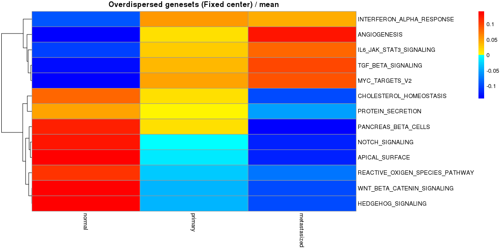<!-- --><!-- -->

```
## $mean
##                                 metastasized     normal    primary
## TNFA_SIGNALING_VIA_NFKB            11065.927 -16208.882  5142.9560
## CHOLESTEROL_HOMEOSTASIS             7594.891  -9203.928  1609.0371
## WNT_BETA_CATENIN_SIGNALING         -6579.438  10023.457 -3444.0190
## TGF_BETA_SIGNALING                  6637.445  -9730.455  3093.0099
## IL6_JAK_STAT3_SIGNALING             8267.370 -11262.818  2995.4479
## DNA_REPAIR                          8655.890 -13250.936  4595.0460
## NOTCH_SIGNALING                     4658.829  -7989.595  3330.7661
## ANDROGEN_RESPONSE                  -9448.004  11952.938 -2504.9343
## MYOGENESIS                        -12475.646  16333.113 -3857.4666
## PROTEIN_SECRETION                  -5660.868   7251.382 -1590.5140
## INTERFERON_ALPHA_RESPONSE          -2267.376   1722.863   544.5122
## INTERFERON_GAMMA_RESPONSE         -10986.264  16722.658 -5736.3934
## APICAL_JUNCTION                   -10438.417  13512.080 -3073.6639
## HEDGEHOG_SIGNALING                 -7120.953   9550.341 -2429.3877
## COMPLEMENT                        -11412.056  16489.967 -5077.9111
## PI3K_AKT_MTOR_SIGNALING            -7307.419  11502.897 -4195.4781
## FATTY_ACID_METABOLISM             -12042.330  16760.797 -4718.4671
## OXIDATIVE_PHOSPHORYLATION          -8906.093  14724.969 -5818.8766
## REACTIVE_OXIGEN_SPECIES_PATHWAY    -5656.241   7928.593 -2272.3521
## P53_PATHWAY                         8614.367 -13830.666  5216.2996
## UV_RESPONSE_DN                     -8595.896  11636.536 -3040.6400
## ANGIOGENESIS                        6635.519  -7767.302  1131.7832
## IL2_STAT5_SIGNALING               -12514.763  15978.986 -3464.2230
## KRAS_SIGNALING_UP                 -14066.112  17360.331 -3294.2198
## 
## $sd
##                                 metastasized   normal   primary
## TNFA_SIGNALING_VIA_NFKB            13563.813 8266.945 11122.153
## CHOLESTEROL_HOMEOSTASIS             7778.269 6434.568  6427.924
## WNT_BETA_CATENIN_SIGNALING          6908.742 5272.883  6865.613
## TGF_BETA_SIGNALING                  6770.590 4606.674  7631.761
## IL6_JAK_STAT3_SIGNALING             6890.916 5592.974  6203.598
## DNA_REPAIR                          7926.856 7438.795  9846.976
## NOTCH_SIGNALING                     4609.071 5891.419  6586.098
## ANDROGEN_RESPONSE                   6317.898 5292.988  8336.334
## MYOGENESIS                          8898.440 5377.540 11551.169
## PROTEIN_SECRETION                   6821.272 7319.716  7792.509
## INTERFERON_ALPHA_RESPONSE          12748.990 8973.108  9712.751
## INTERFERON_GAMMA_RESPONSE           9647.228 9665.503 10923.640
## APICAL_JUNCTION                     7081.723 8013.011 10020.587
## HEDGEHOG_SIGNALING                  5706.727 3039.034  5721.747
## COMPLEMENT                         10063.203 9565.963  9713.688
## PI3K_AKT_MTOR_SIGNALING             6785.617 6017.923  7994.513
## FATTY_ACID_METABOLISM               9639.507 6317.881 10036.722
## OXIDATIVE_PHOSPHORYLATION           7584.350 7337.690 12358.733
## REACTIVE_OXIGEN_SPECIES_PATHWAY     5708.250 5383.546  7106.662
## P53_PATHWAY                         8047.851 7175.915 12191.925
## UV_RESPONSE_DN                      6985.977 9729.787  7769.214
## ANGIOGENESIS                        7117.224 3456.384  5790.110
## IL2_STAT5_SIGNALING                 9648.339 6511.449 10954.314
## KRAS_SIGNALING_UP                   9533.261 6236.828 10318.642
```

and without the fixed center


```r
Plot.Genesets(RomaData = Data.NFC,
              Selected = SelectGeneSets(RomaData = Data.NFC, VarThr = 1e-3,
                                        VarMode = "Wil", VarType = "Under",
                                        MedThr = 1e-3, MedMode = "Wil", MedType = "Over"),
              GenesetMargin = 20, SampleMargin = 14, cluster_cols = FALSE,
              GroupInfo = Type, AggByGroupsFL = c("mean", "sd"))
```

```
## [1] "Using genestes underdispersed according to Wilcoxon test. VarThr = 0.001"
## [1] "Using genestes overdispersed according to Wilcoxon test. MedThr = 0.001"
## [1] "26 geneset selected"
```

<!-- --><!-- --><!-- --><!-- --><!-- -->

```
## $mean
##                                 metastasized     normal    primary
## TNFA_SIGNALING_VIA_NFKB            10870.207 -16026.072  5155.8643
## HYPOXIA                            13703.807 -16857.090  3153.2825
## CHOLESTEROL_HOMEOSTASIS             7555.301  -9179.659  1624.3584
## WNT_BETA_CATENIN_SIGNALING         -6656.161  10038.805 -3382.6441
## TGF_BETA_SIGNALING                  6588.444  -9698.415  3109.9706
## IL6_JAK_STAT3_SIGNALING            -1394.279   4983.483 -3589.2043
## DNA_REPAIR                          8131.778 -12638.329  4506.5510
## NOTCH_SIGNALING                     4604.888  -7957.892  3353.0040
## ESTROGEN_RESPONSE_LATE            -13170.979  18359.073 -5188.0939
## ANDROGEN_RESPONSE                  -9391.822  11914.696 -2522.8736
## MYOGENESIS                        -13226.629  16531.320 -3304.6912
## PROTEIN_SECRETION                  -5723.915   7303.488 -1579.5732
## INTERFERON_ALPHA_RESPONSE          -5910.988   8392.363 -2481.3750
## INTERFERON_GAMMA_RESPONSE         -10585.848  15937.151 -5351.3024
## APICAL_JUNCTION                   -10686.702  13617.306 -2930.6034
## HEDGEHOG_SIGNALING                 -7198.371   9578.529 -2380.1577
## COMPLEMENT                        -11405.921  16531.566 -5125.6448
## PI3K_AKT_MTOR_SIGNALING            -7409.568  11535.540 -4125.9721
## OXIDATIVE_PHOSPHORYLATION          -9376.932  15001.316 -5624.3838
## REACTIVE_OXIGEN_SPECIES_PATHWAY    -5697.635   7925.462 -2227.8271
## P53_PATHWAY                         8585.461 -13788.134  5202.6736
## UV_RESPONSE_DN                     -9667.912  13499.907 -3831.9944
## ANGIOGENESIS                        8030.614  -8591.425   560.8117
## IL2_STAT5_SIGNALING               -12630.765  16044.103 -3413.3386
## PEROXISOME                        -11666.161  13124.131 -1457.9704
## KRAS_SIGNALING_UP                 -14166.979  17388.466 -3221.4867
## 
## $sd
##                                 metastasized   normal   primary
## TNFA_SIGNALING_VIA_NFKB            14015.604 8341.323 11062.238
## HYPOXIA                            10918.219 9116.951 10635.324
## CHOLESTEROL_HOMEOSTASIS             7818.803 6440.219  6436.654
## WNT_BETA_CATENIN_SIGNALING          6881.802 5271.283  6888.433
## TGF_BETA_SIGNALING                  6825.701 4608.793  7654.583
## IL6_JAK_STAT3_SIGNALING            12414.985 8101.420  8390.342
## DNA_REPAIR                          7989.435 6945.050  9143.200
## NOTCH_SIGNALING                     4676.330 5915.346  6586.677
## ESTROGEN_RESPONSE_LATE             10117.333 8295.334 13440.823
## ANDROGEN_RESPONSE                   6291.625 5343.384  8472.418
## MYOGENESIS                          9477.304 4935.483 11824.482
## PROTEIN_SECRETION                   6854.114 7285.430  7778.602
## INTERFERON_ALPHA_RESPONSE          11503.481 5512.454  9483.840
## INTERFERON_GAMMA_RESPONSE          10709.374 9743.894 11180.490
## APICAL_JUNCTION                     7232.975 7607.489 10010.941
## HEDGEHOG_SIGNALING                  5782.363 3048.111  5786.108
## COMPLEMENT                          9959.564 9581.479 10004.276
## PI3K_AKT_MTOR_SIGNALING             6790.219 5984.390  8081.306
## OXIDATIVE_PHOSPHORYLATION           7521.892 7271.447 12166.338
## REACTIVE_OXIGEN_SPECIES_PATHWAY     5833.089 5314.996  7220.380
## P53_PATHWAY                         8062.922 7231.575 12168.643
## UV_RESPONSE_DN                      7751.143 8702.268  8691.015
## ANGIOGENESIS                        7704.815 2832.390  5358.790
## IL2_STAT5_SIGNALING                 9453.748 6496.228 11064.114
## PEROXISOME                          8344.533 5334.308  8491.908
## KRAS_SIGNALING_UP                   9372.167 6180.617 10518.605
```


We can also explore the gene weigths with the fixed center


```r
PlotGeneWeight(RomaData = Data.FC, PlotGenes = 30,
               ExpressionMatrix = MatData, LogExpression = FALSE,
               Selected = SelectGeneSets(RomaData = Data.FC, VarThr = 1e-3,
                                         VarMode = "Wil", VarType = "Over"),
               PlotWeigthSign = TRUE)
```

```
## [1] "Using genestes overdispersed according to Wilcoxon test. VarThr = 0.001"
## [1] "17 geneset selected"
```

<!-- --><!-- --><!-- --><!-- --><!-- --><!-- --><!-- --><!-- --><!-- --><!-- --><!-- --><!-- --><!-- --><!-- --><!-- --><!-- --><!-- -->

and without the fixed center


```r
PlotGeneWeight(RomaData = Data.NFC, PlotGenes = 30,
               ExpressionMatrix = MatData, LogExpression = FALSE,
               Selected = SelectGeneSets(RomaData = Data.NFC, VarThr = 1e-3,
                                         VarMode = "Wil", VarType = "Over"),
               PlotWeigthSign = TRUE)
```

```
## [1] "Using genestes overdispersed according to Wilcoxon test. VarThr = 0.001"
## [1] "19 geneset selected"
```

<!-- --><!-- --><!-- --><!-- --><!-- -->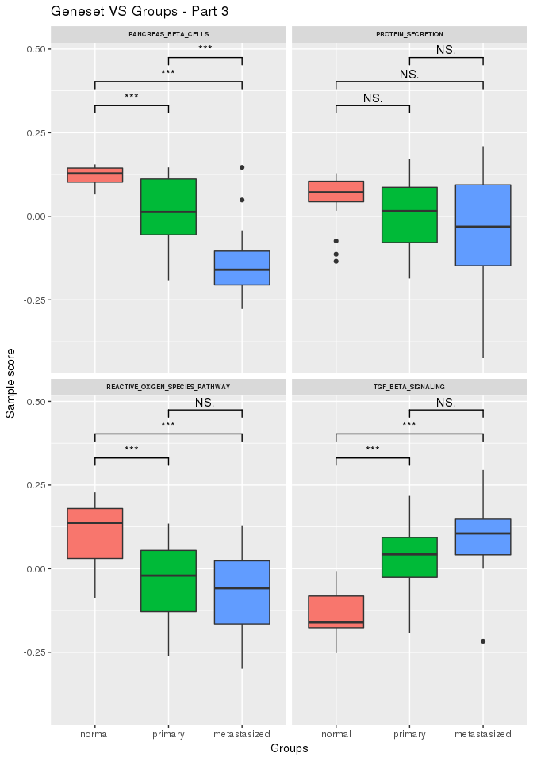<!-- --><!-- --><!-- --><!-- --><!-- --><!-- --><!-- --><!-- -->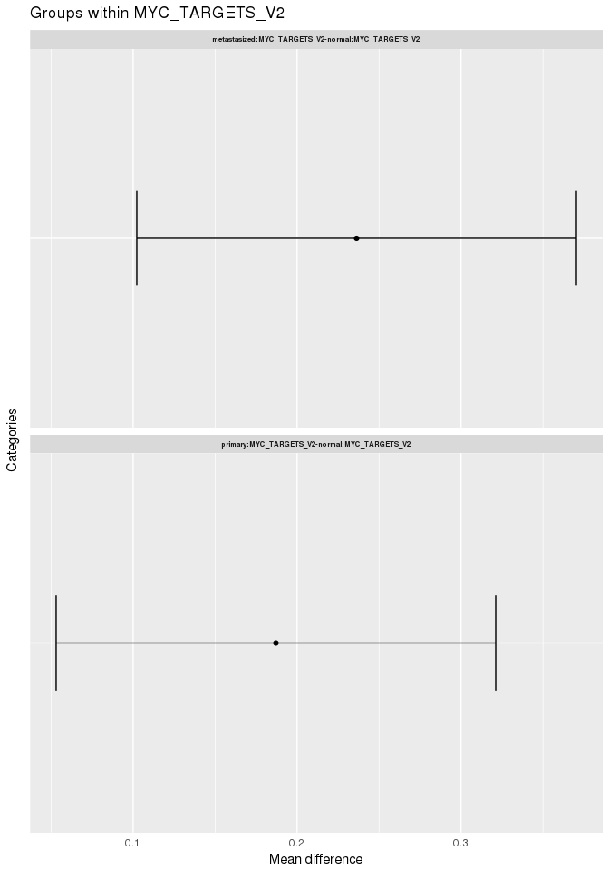<!-- --><!-- -->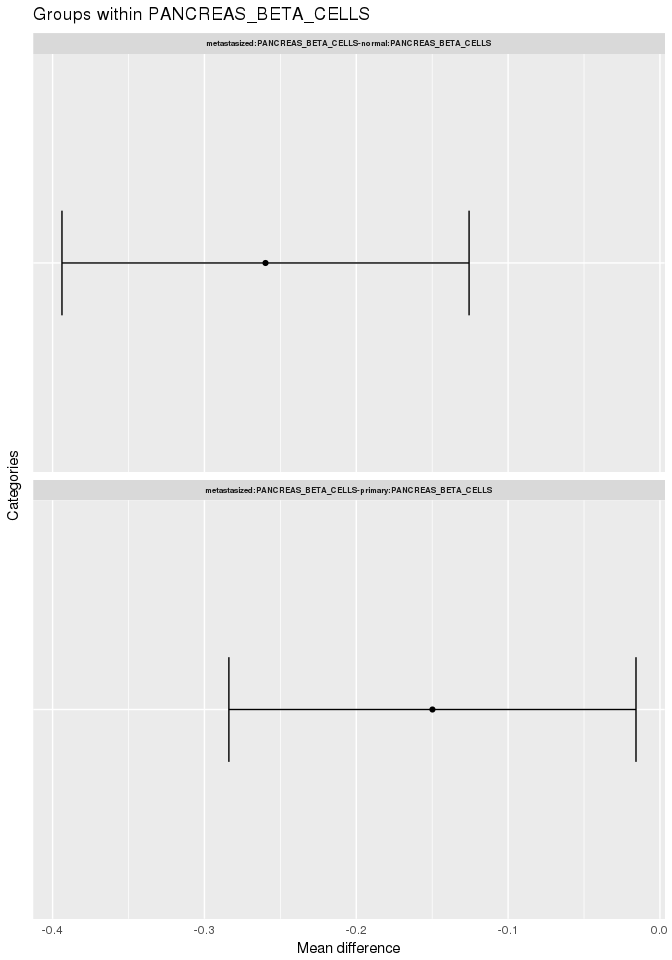<!-- -->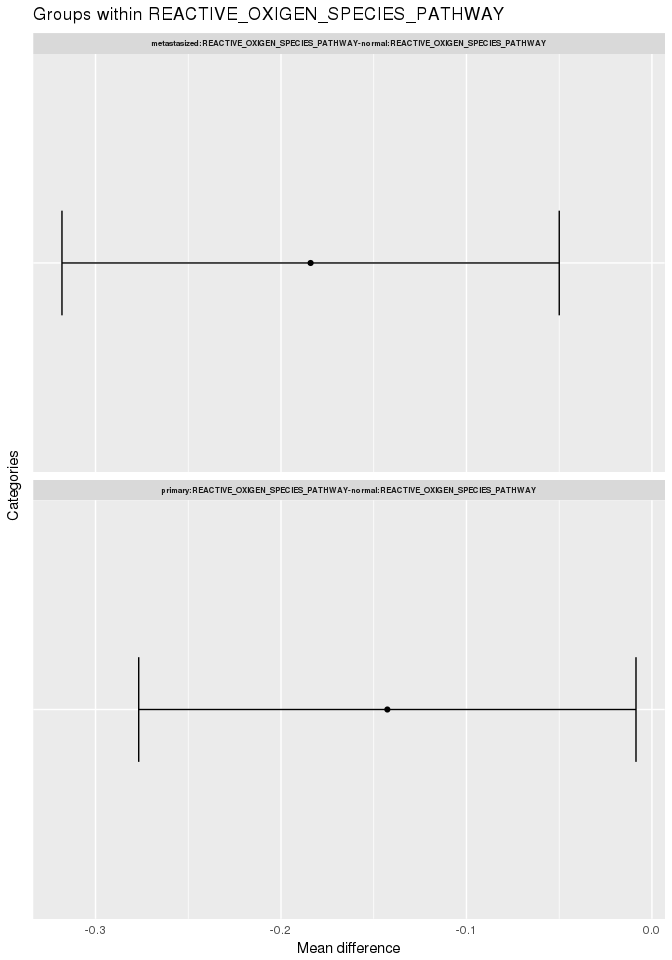<!-- --><!-- --><!-- -->

Moreover, we can look at the projections of the samples with the fixed center


```r
PlotSampleProjections(RomaData = Data.FC, PlotSamples = 30,
                      ExpressionMatrix = MatData, LogExpression = FALSE,
                      Selected = SelectGeneSets(RomaData = Data.FC, VarThr = 1e-6,
                                                VarMode = "Wil", VarType = "Over"),
                      PlotPCProj = "none")
```

```
## [1] "Using genestes overdispersed according to Wilcoxon test. VarThr = 1e-06"
## [1] "15 geneset selected"
```

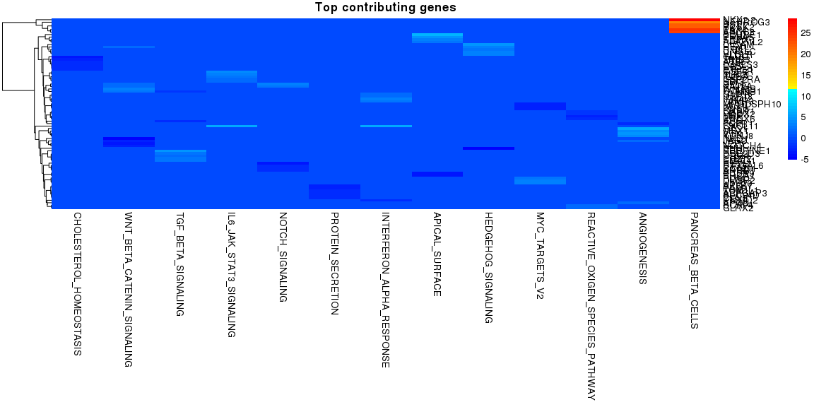<!-- -->

```
## NULL
```

and without the fixed center


```r
PlotSampleProjections(RomaData = Data.NFC, PlotSamples = 30,
                      ExpressionMatrix = MatData, LogExpression = FALSE,
                      Selected = SelectGeneSets(RomaData = Data.NFC, VarThr = 1e-6,
                                                VarMode = "Wil", VarType = "Over"),
                      PlotPCProj = "none")
```

```
## [1] "Using genestes overdispersed according to Wilcoxon test. VarThr = 1e-06"
## [1] "14 geneset selected"
```

<!-- -->

```
## NULL
```


Additionaly, we can compare across samples


```r
CompareAcrossSamples(RomaData = Data.FC,
                     Selected = SelectGeneSets(RomaData = Data.FC, VarThr = 1e-3,
                                               VarMode = "Wil", VarType = "Over"),
                     Groups = Type)
```

```
## [1] "Using genestes overdispersed according to Wilcoxon test. VarThr = 0.001"
## [1] "17 geneset selected"
## [1] "Performing Type III AOV (R default)"
##              Df    Sum Sq   Mean Sq F value Pr(>F)    
## Group         2 2.548e+10 1.274e+10    52.2 <2e-16 ***
## Residuals   915 2.233e+11 2.441e+08                   
## ---
## Signif. codes:  0 '***' 0.001 '**' 0.01 '*' 0.05 '.' 0.1 ' ' 1
```

<!-- --><!-- -->

```
## [1] "A significant difference is observed across groups"
## [1] "Calculating Tukey Honest Significant Differences"
## [1] "3 significant differences found"
```

<!-- -->

```
## [1] "Performing Type III AOV (R default)"
##                Df    Sum Sq   Mean Sq F value Pr(>F)    
## Group           2 2.548e+10 1.274e+10  106.00 <2e-16 ***
## Group:GeneSet  48 1.191e+11 2.482e+09   20.65 <2e-16 ***
## Residuals     867 1.042e+11 1.202e+08                   
## ---
## Signif. codes:  0 '***' 0.001 '**' 0.01 '*' 0.05 '.' 0.1 ' ' 1
```

<!-- -->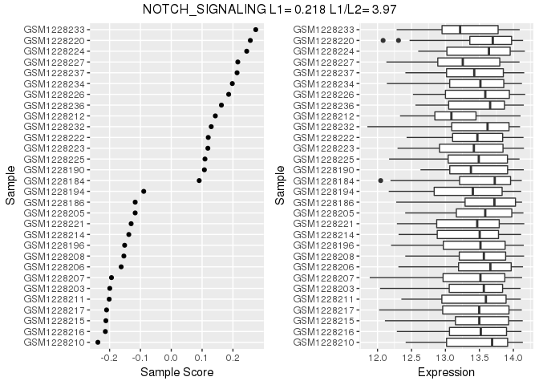<!-- --><!-- -->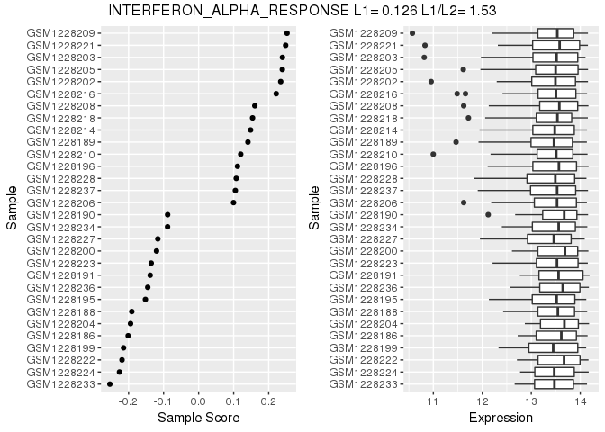<!-- --><!-- -->

```
## [1] "A significant difference is observed across groups and metagenes"
## [1] "Calculating Tukey Honest Significant Differences"
## [1] "567 significant differences found"
```

<!-- --><!-- --><!-- -->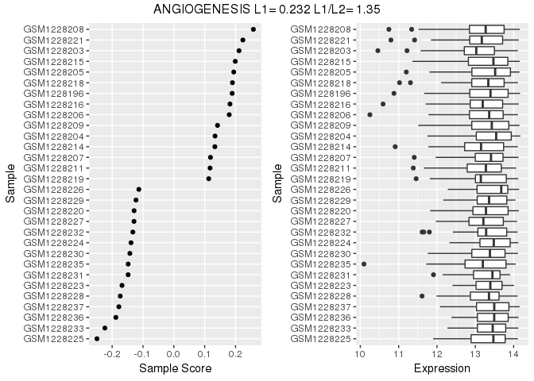<!-- -->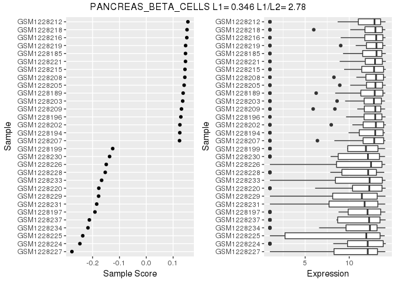<!-- --><!-- --><!-- --><!-- --><!-- --><!-- --><!-- --><!-- --><!-- --><!-- --><!-- --><!-- -->

Finally, we can look at genes which appear across different genesests and explore thier weithgs


```r
PlotRecurringGenes(RomaData = Data.NFC,
                   Selected = SelectGeneSets(RomaData = Data.NFC, VarThr = 1e-3,
                                             VarMode = "Wil", VarType = "Over"),
                   GenesByGroup = 25, MinMult = 3)
```

```
## [1] "Using genestes overdispersed according to Wilcoxon test. VarThr = 0.001"
## [1] "19 geneset selected"
```

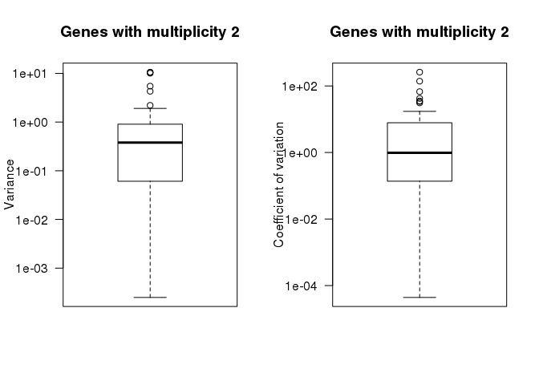<!-- -->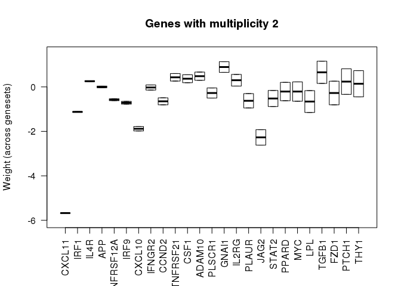<!-- -->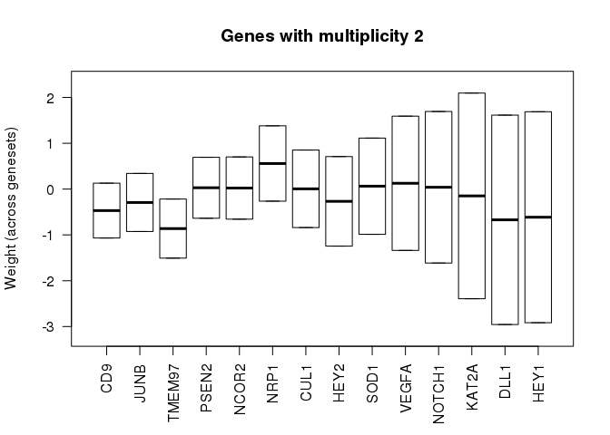<!-- --><!-- --><!-- --><!-- --><!-- --><!-- --><!-- --><!-- --><!-- --><!-- --><!-- --><!-- --><!-- --><!-- --><!-- --><!-- --><!-- --><!-- --><!-- --><!-- --><!-- --><!-- --><!-- --><!-- --><!-- --><!-- --><!-- --><!-- --><!-- --><!-- --><!-- --><!-- --><!-- --><!-- --><!-- --><!-- -->
