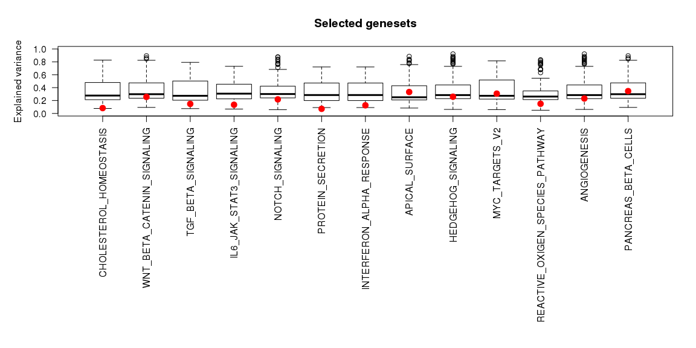
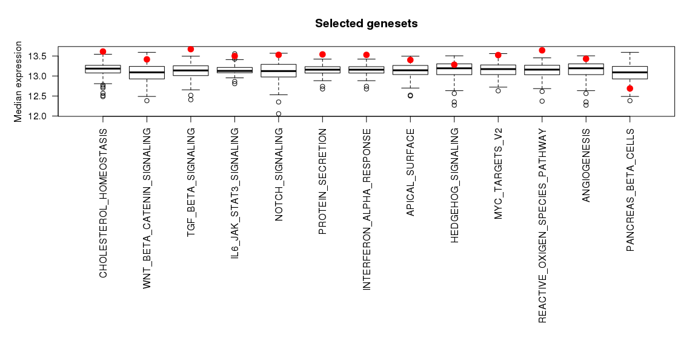
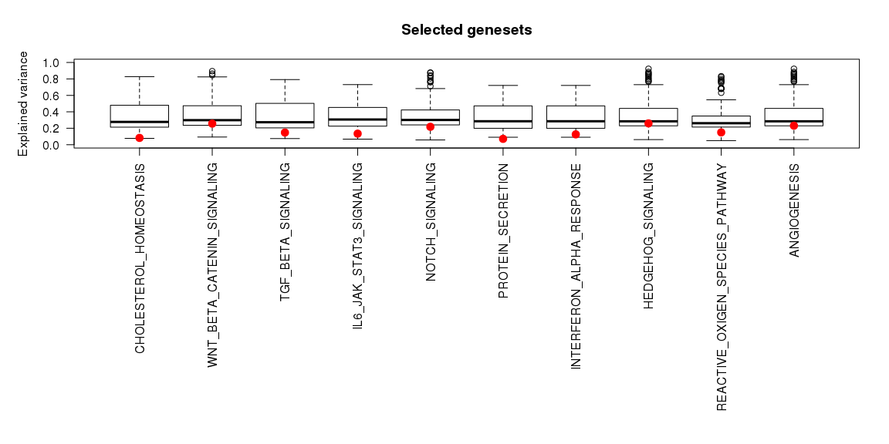
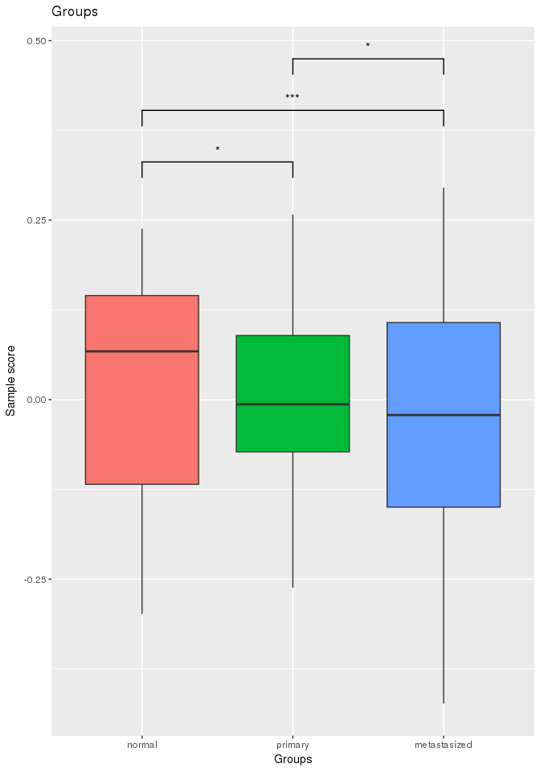
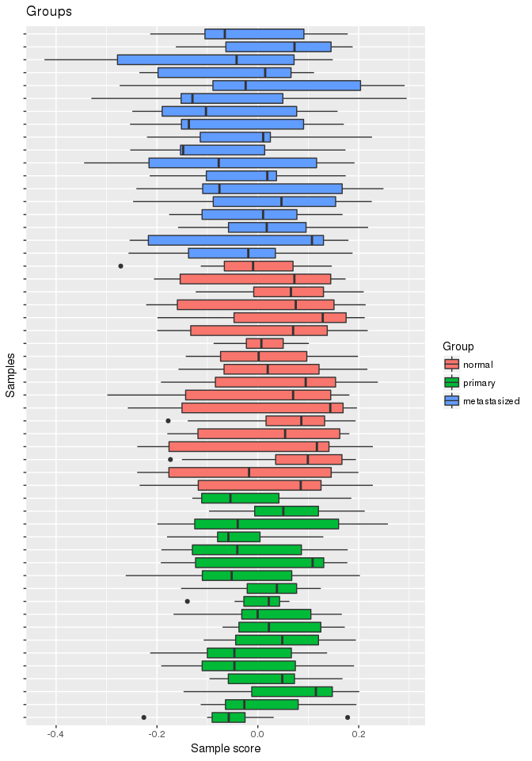
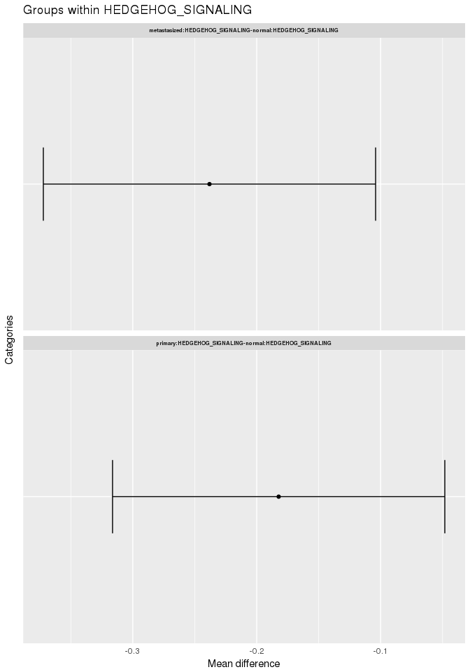
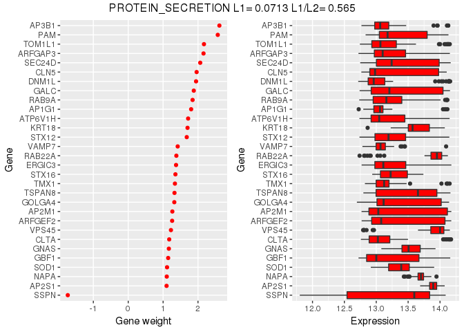
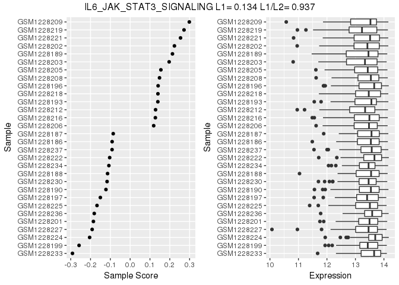
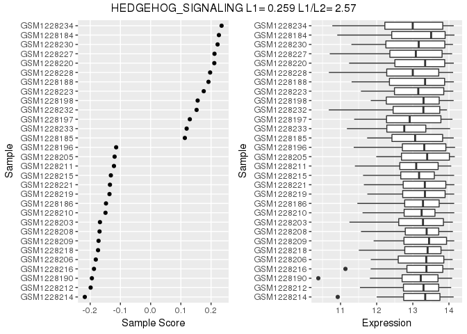
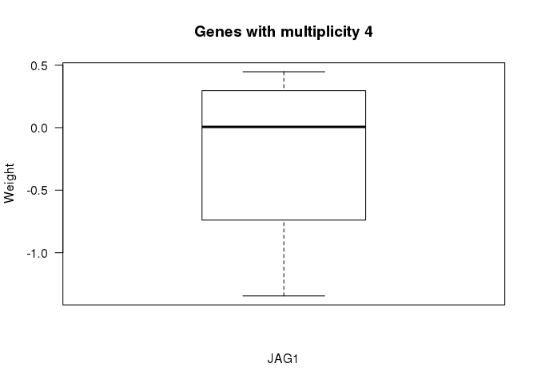

# rROMA
Luca Albergante (luca.albergante@gmail.com)  
`r Sys.Date()`  

This package provides an R implementation of [ROMA](http://journal.frontiersin.org/article/10.3389/fgene.2016.00018/full). The package is under active development and is currently being tested.

A Java implementation developed by Andrei Zynovyev and is also [available](https://github.com/sysbio-curie/Roma).

## Intalling rROMA

The rRoma package relies on the `scater` package, which is available only on BioConductor. This package can be installed with the following command


```r
source("https://bioconductor.org/biocLite.R")
biocLite("scater")
```

rRoma can then be installed using `devtools`


```r
if(!require("devtools")){
  install.packages("devtools")
}
devtools::install_github("Albluca/rROMA")
```

The packages `GEOquery`, `tictoc`, and `readr` are not required to run rROMA, but are used in the following example and need to be installed to reproduce the analysis 


```r
if(!require("GEOquery")){
  source("https://bioconductor.org/biocLite.R")
  biocLite("GEOquery")
}
```

```
## Loading required package: GEOquery
```

```
## Loading required package: Biobase
```

```
## Loading required package: BiocGenerics
```

```
## Loading required package: parallel
```

```
## 
## Attaching package: 'BiocGenerics'
```

```
## The following objects are masked from 'package:parallel':
## 
##     clusterApply, clusterApplyLB, clusterCall, clusterEvalQ,
##     clusterExport, clusterMap, parApply, parCapply, parLapply,
##     parLapplyLB, parRapply, parSapply, parSapplyLB
```

```
## The following objects are masked from 'package:stats':
## 
##     IQR, mad, xtabs
```

```
## The following objects are masked from 'package:base':
## 
##     anyDuplicated, append, as.data.frame, cbind, colnames,
##     do.call, duplicated, eval, evalq, Filter, Find, get, grep,
##     grepl, intersect, is.unsorted, lapply, lengths, Map, mapply,
##     match, mget, order, paste, pmax, pmax.int, pmin, pmin.int,
##     Position, rank, rbind, Reduce, rownames, sapply, setdiff,
##     sort, table, tapply, union, unique, unsplit, which, which.max,
##     which.min
```

```
## Welcome to Bioconductor
## 
##     Vignettes contain introductory material; view with
##     'browseVignettes()'. To cite Bioconductor, see
##     'citation("Biobase")', and for packages 'citation("pkgname")'.
```

```
## Setting options('download.file.method.GEOquery'='auto')
```

```
## Setting options('GEOquery.inmemory.gpl'=FALSE)
```

```r
if(!require("readr")){
  install.packages("readr")
}
```

```
## Loading required package: readr
```

```r
if(!require("tictoc")){
  install.packages("tictoc")
}
```

```
## Loading required package: tictoc
```

## Using rROMA

The package can be loaded with the usual syntax, i.e., by typing


```r
library(rRoma)
```

rRoma requires a gene expression matrix - with column names indicating samples and row names indicating gene names - and a module file containing information on the genesets that need to be evaluated. The module file can be loaded from a GMT file. Functions to automate the generation of then GMT file are also available.

Various functions are then available to explore the analysis, including plotting and statistical cross sample analysis.

## An example

To show a concrete example of rROMA we will use a dataset available on GEO. The output of the analysis is not reported due to limitation in the markdown files used by GitHub. Let us begin by getting the description of the dataset


```r
library(GEOquery)
gse <- getGEO("GSE50760", GSEMatrix = TRUE)
```

```
## https://ftp.ncbi.nlm.nih.gov/geo/series/GSE50nnn/GSE50760/matrix/
```

```
## OK
```

```
## Found 1 file(s)
```

```
## GSE50760_series_matrix.txt.gz
```

```
## File stored at:
```

```
## /var/folders/0d/46tymjcj0qxbtqgvxp1623400000gn/T//RtmpIVKgma/GPL11154.soft
```

Then we get the actual expression expression files


```r
filePaths = getGEOSuppFiles("GSE50760")
```

```
## https://ftp.ncbi.nlm.nih.gov/geo/series/GSE50nnn/GSE50760/suppl/
```

```
## OK
```

Now we can construct the expression matrix. Note that the code below is designed to work on a Unix-like environment (e.g. MacOS).


```r
library(readr)
Content <- untar(row.names(filePaths)[1], list = TRUE)
untar(row.names(filePaths)[1], list = FALSE)

MatData <- NULL

for(i in 1:length(Content)){
  Exp <- read_delim(Content[i], "\t", escape_double = FALSE, trim_ws = TRUE)
  
  if(is.null(MatData)){
    MatData <- cbind(unlist(Exp[,1]), unlist(Exp[,2]))
  } else {
    if(any(MatData[,1] != unlist(Exp[,1]))){
      stop("Incompatible samples")
    }
    MatData <- cbind(MatData, unlist(Exp[,2]))
  }
  
  file.remove(Content[i])
  
}
```

```
## Parsed with column specification:
## cols(
##   genes = col_character(),
##   AMC_2.1_FPKM = col_double()
## )
```

```
## Parsed with column specification:
## cols(
##   genes = col_character(),
##   AMC_3.1_FPKM = col_double()
## )
```

```
## Parsed with column specification:
## cols(
##   genes = col_character(),
##   AMC_5.1_FPKM = col_double()
## )
```

```
## Parsed with column specification:
## cols(
##   genes = col_character(),
##   AMC_6.1_FPKM = col_double()
## )
```

```
## Parsed with column specification:
## cols(
##   genes = col_character(),
##   AMC_7.1_FPKM = col_double()
## )
```

```
## Parsed with column specification:
## cols(
##   genes = col_character(),
##   AMC_8.1_FPKM = col_double()
## )
```

```
## Parsed with column specification:
## cols(
##   genes = col_character(),
##   AMC_9.1_FPKM = col_double()
## )
```

```
## Parsed with column specification:
## cols(
##   genes = col_character(),
##   AMC_10.1_FPKM = col_double()
## )
```

```
## Parsed with column specification:
## cols(
##   genes = col_character(),
##   AMC_12.1_FPKM = col_double()
## )
```

```
## Parsed with column specification:
## cols(
##   genes = col_character(),
##   AMC_13.1_FPKM = col_double()
## )
```

```
## Parsed with column specification:
## cols(
##   genes = col_character(),
##   AMC_17.1_FPKM = col_double()
## )
```

```
## Parsed with column specification:
## cols(
##   genes = col_character(),
##   AMC_18.1_FPKM = col_double()
## )
```

```
## Parsed with column specification:
## cols(
##   genes = col_character(),
##   AMC_19.1_FPKM = col_double()
## )
```

```
## Parsed with column specification:
## cols(
##   genes = col_character(),
##   AMC_20.1_FPKM = col_double()
## )
```

```
## Parsed with column specification:
## cols(
##   genes = col_character(),
##   AMC_21.1_FPKM = col_double()
## )
```

```
## Parsed with column specification:
## cols(
##   genes = col_character(),
##   AMC_22.1_FPKM = col_double()
## )
```

```
## Parsed with column specification:
## cols(
##   genes = col_character(),
##   AMC_23.1_FPKM = col_double()
## )
```

```
## Parsed with column specification:
## cols(
##   genes = col_character(),
##   AMC_24.1_FPKM = col_double()
## )
```

```
## Parsed with column specification:
## cols(
##   genes = col_character(),
##   AMC_2.2_FPKM = col_double()
## )
```

```
## Parsed with column specification:
## cols(
##   genes = col_character(),
##   AMC_3.2_FPKM = col_double()
## )
```

```
## Parsed with column specification:
## cols(
##   genes = col_character(),
##   AMC_5.2_FPKM = col_double()
## )
```

```
## Parsed with column specification:
## cols(
##   genes = col_character(),
##   AMC_6.2_FPKM = col_double()
## )
```

```
## Parsed with column specification:
## cols(
##   genes = col_character(),
##   AMC_7.2_FPKM = col_double()
## )
```

```
## Parsed with column specification:
## cols(
##   genes = col_character(),
##   AMC_8.2_FPKM = col_double()
## )
```

```
## Parsed with column specification:
## cols(
##   genes = col_character(),
##   AMC_9.2_FPKM = col_double()
## )
```

```
## Parsed with column specification:
## cols(
##   genes = col_character(),
##   AMC_10.2_FPKM = col_double()
## )
```

```
## Parsed with column specification:
## cols(
##   genes = col_character(),
##   AMC_12.2_FPKM = col_double()
## )
```

```
## Parsed with column specification:
## cols(
##   genes = col_character(),
##   AMC_13.2_FPKM = col_double()
## )
```

```
## Parsed with column specification:
## cols(
##   genes = col_character(),
##   AMC_17.2_FPKM = col_double()
## )
```

```
## Parsed with column specification:
## cols(
##   genes = col_character(),
##   AMC_18.2_FPKM = col_double()
## )
```

```
## Parsed with column specification:
## cols(
##   genes = col_character(),
##   AMC_19.2_FPKM = col_double()
## )
```

```
## Parsed with column specification:
## cols(
##   genes = col_character(),
##   AMC_20.2_FPKM = col_double()
## )
```

```
## Parsed with column specification:
## cols(
##   genes = col_character(),
##   AMC_21.2_FPKM = col_double()
## )
```

```
## Parsed with column specification:
## cols(
##   genes = col_character(),
##   AMC_22.2_FPKM = col_double()
## )
```

```
## Parsed with column specification:
## cols(
##   genes = col_character(),
##   AMC_23.2_FPKM = col_double()
## )
```

```
## Parsed with column specification:
## cols(
##   genes = col_character(),
##   AMC_24.2_FPKM = col_double()
## )
```

```
## Parsed with column specification:
## cols(
##   genes = col_character(),
##   AMC_2.3_FPKM = col_double()
## )
```

```
## Parsed with column specification:
## cols(
##   genes = col_character(),
##   AMC_3.3_FPKM = col_double()
## )
```

```
## Parsed with column specification:
## cols(
##   genes = col_character(),
##   AMC_5.3_FPKM = col_double()
## )
```

```
## Parsed with column specification:
## cols(
##   genes = col_character(),
##   AMC_6.3_FPKM = col_double()
## )
```

```
## Parsed with column specification:
## cols(
##   genes = col_character(),
##   AMC_7.3_FPKM = col_double()
## )
```

```
## Parsed with column specification:
## cols(
##   genes = col_character(),
##   AMC_8.3_FPKM = col_double()
## )
```

```
## Parsed with column specification:
## cols(
##   genes = col_character(),
##   AMC_9.3_FPKM = col_double()
## )
```

```
## Parsed with column specification:
## cols(
##   genes = col_character(),
##   AMC_10.3_FPKM = col_double()
## )
```

```
## Parsed with column specification:
## cols(
##   genes = col_character(),
##   AMC_12.3_FPKM = col_double()
## )
```

```
## Parsed with column specification:
## cols(
##   genes = col_character(),
##   AMC_13.3_FPKM = col_double()
## )
```

```
## Parsed with column specification:
## cols(
##   genes = col_character(),
##   AMC_17.3_FPKM = col_double()
## )
```

```
## Parsed with column specification:
## cols(
##   genes = col_character(),
##   AMC_18.3_FPKM = col_double()
## )
```

```
## Parsed with column specification:
## cols(
##   genes = col_character(),
##   AMC_19.3_FPKM = col_double()
## )
```

```
## Parsed with column specification:
## cols(
##   genes = col_character(),
##   AMC_20.3_FPKM = col_double()
## )
```

```
## Parsed with column specification:
## cols(
##   genes = col_character(),
##   AMC_21.3_FPKM = col_double()
## )
```

```
## Parsed with column specification:
## cols(
##   genes = col_character(),
##   AMC_22.3_FPKM = col_double()
## )
```

```
## Parsed with column specification:
## cols(
##   genes = col_character(),
##   AMC_23.3_FPKM = col_double()
## )
```

```
## Parsed with column specification:
## cols(
##   genes = col_character(),
##   AMC_24.3_FPKM = col_double()
## )
```

```r
SplitPath <- unlist(strsplit(rownames(filePaths)[1], "/"))
SplitPath <- SplitPath[-length(SplitPath)]
unlink(x = paste(SplitPath, collapse = "/"), recursive = TRUE)

Genes <- MatData[,1]
MatData <- data.matrix(data.frame(MatData[,-1]))
rownames(MatData) <- Genes
colnames(MatData) <- unlist(lapply(strsplit(Content, "_"), "[[", 1))
```

And look at the different groups of cells present


```r
Type <- as.character(gse$GSE50760_series_matrix.txt.gz[[1]])
Type <- unlist(lapply(strsplit(Type, " "), "[[", 1))
names(Type) = as.character(gse$GSE50760_series_matrix.txt.gz[[2]])

table(Type)
```

```
## Type
## metastasized       normal      primary 
##           18           18           18
```

For convenience, we will transform `Type` into a factor:


```r
Type <- as.factor(Type)
```

At this point we can create the metagene files. We will extract all the "HALLPARK" geneset from MSig.


```r
AllHall <- SelectFromMSIGdb("HALLMARK")
```

```
## [1] "Searching in MsigDB v6.0"
```

```r
AllHall <- lapply(AllHall, function(x){
  x$Name <- sub("HALLMARK_", "", x$Name)
  x
})
```

To reduce potential problmes we will remove genes with a duplicated name


```r
if(any(duplicated(rownames(MatData)))){
  MatData <- MatData[!(rownames(MatData) %in% rownames(MatData)[duplicated(rownames(MatData))]), ]
}
```

And now we are ready to perform ROMA without fixed center


```r
tictoc::tic()
Data.NFC <- rRoma.R(ExpressionMatrix = MatData, centerData = TRUE, ExpFilter = FALSE,
                      ApproxSamples = 5, ModuleList = AllHall, MinGenes = 10,
                      MaxGenes = 200, nSamples = 100, UseWeigths = FALSE,
                      DefaultWeight = 1, FixedCenter = FALSE,
                      GeneOutDetection = 'L1OutExpOut', GeneOutThr = 5,
                      GeneSelMode = "All", SampleFilter = TRUE, MoreInfo = FALSE,
                      PlotData = FALSE, PCSignMode = "CorrelateAllWeightsByGene", OutGeneNumber = 5,
                      Ncomp = 100, OutGeneSpace = 5, PCADims = 2, PCSignThr = NULL,
                      UseParallel = TRUE, nCores = 3, ClusType = "FORK", FullSampleInfo = FALSE)
```

```
## [1] "Centering gene expression over samples"
## [1] "Using local center (NOT centering over genes)"
## [1] "All the genesets will be used"
## [1] "2017-04-12 14:14:13 CEST"
## [1] "[1/50] Working on NOTCH_SIGNALING - http://www.broadinstitute.org/gsea/msigdb/cards/HALLMARK_NOTCH_SIGNALING"
## [1] "32 genes available for analysis"
## [1] "Detecting outliers using leave one out and median-absolute-deviations away from median (scater package)"
## [1] "0 genes will be filtered:"
## [1] "Not using weigths for PCA computation"
## [1] "Pre-filter data"
## [1] "L1 = 0.218112782355522 L1/L2 = 2.1422313795589"
## [1] "Median expression (uncentered): 11705.5"
## [1] "Median expression (centered/weighted): -55.4722222222217"
## [1] "Post-filter data"
## [1] "L1 = 0.218112782355521 L1/L2 = 2.14223137957909"
## [1] "Median expression (uncentered): 11705.5"
## [1] "Median expression (centered/weighted): -55.4722222222217"
## [1] "Previous sample size: 0"
## [1] "Next sample size: 32"
## [1] "Computing samples"
##    user  system elapsed 
##   0.039   0.023   5.579 
## [1] "Missing gene weights will be replaced by 1"
## [1] "Orienting PC by correlating gene expression and PC projections"
## [1] "Not using groups"
## [1] "Computing correlations"
## [1] "Correcting using weights"
## [1] "Missing gene weights will be replaced by 1"
## [1] "Orienting PC by correlating gene expression and PC projections"
## [1] "Not using groups"
## [1] "Computing correlations"
## [1] "Correcting using weights"
## [1] "Missing gene weights will be replaced by 1"
## [1] "Orienting PC by correlating gene expression and PC projections"
## [1] "Not using groups"
## [1] "Computing correlations"
## [1] "Correcting using weights"
## [1] "2017-04-12 14:14:22 CEST"
## [1] "[2/50] Working on HEDGEHOG_SIGNALING - http://www.broadinstitute.org/gsea/msigdb/cards/HALLMARK_HEDGEHOG_SIGNALING"
## [1] "36 genes available for analysis"
## [1] "Detecting outliers using leave one out and median-absolute-deviations away from median (scater package)"
## [1] "0 genes will be filtered:"
## [1] "Not using weigths for PCA computation"
## [1] "Pre-filter data"
## [1] "L1 = 0.238951393021584 L1/L2 = 2.20609876529115"
## [1] "Median expression (uncentered): 9107"
## [1] "Median expression (centered/weighted): -230.555555555556"
## [1] "Post-filter data"
## [1] "L1 = 0.238951393021585 L1/L2 = 2.20609876528669"
## [1] "Median expression (uncentered): 9107"
## [1] "Median expression (centered/weighted): -230.555555555556"
## [1] "Previous sample size: 32"
## [1] "Next sample size: 36"
## [1] "Computing samples"
##    user  system elapsed 
##   0.039   0.023   2.263 
## [1] "Missing gene weights will be replaced by 1"
## [1] "Orienting PC by correlating gene expression and PC projections"
## [1] "Not using groups"
## [1] "Computing correlations"
## [1] "Correcting using weights"
## [1] "Missing gene weights will be replaced by 1"
## [1] "Orienting PC by correlating gene expression and PC projections"
## [1] "Not using groups"
## [1] "Computing correlations"
## [1] "Correcting using weights"
## [1] "Missing gene weights will be replaced by 1"
## [1] "Orienting PC by correlating gene expression and PC projections"
## [1] "Not using groups"
## [1] "Computing correlations"
## [1] "Correcting using weights"
## [1] "2017-04-12 14:14:24 CEST"
## [1] "[3/50] Working on ANGIOGENESIS - http://www.broadinstitute.org/gsea/msigdb/cards/HALLMARK_ANGIOGENESIS"
## [1] "36 genes available for analysis"
## [1] "Detecting outliers using leave one out and median-absolute-deviations away from median (scater package)"
## [1] "0 genes will be filtered:"
## [1] "Not using weigths for PCA computation"
## [1] "Pre-filter data"
## [1] "L1 = 0.241722268030934 L1/L2 = 2.07659291489547"
## [1] "Median expression (uncentered): 9486.5"
## [1] "Median expression (centered/weighted): -524.962962962964"
## [1] "Post-filter data"
## [1] "L1 = 0.241722268030935 L1/L2 = 2.07659291489547"
## [1] "Median expression (uncentered): 9486.5"
## [1] "Median expression (centered/weighted): -524.962962962964"
## [1] "Previous sample size: 36"
## [1] "Next sample size: 36"
## [1] "Reusing previous sampling (Same metagene size)"
## [1] "Missing gene weights will be replaced by 1"
## [1] "Orienting PC by correlating gene expression and PC projections"
## [1] "Not using groups"
## [1] "Computing correlations"
## [1] "Correcting using weights"
## [1] "Missing gene weights will be replaced by 1"
## [1] "Orienting PC by correlating gene expression and PC projections"
## [1] "Not using groups"
## [1] "Computing correlations"
## [1] "Correcting using weights"
## [1] "Missing gene weights will be replaced by 1"
## [1] "Orienting PC by correlating gene expression and PC projections"
## [1] "Not using groups"
## [1] "Computing correlations"
## [1] "Correcting using weights"
## [1] "2017-04-12 14:14:24 CEST"
## [1] "[4/50] Working on PANCREAS_BETA_CELLS - http://www.broadinstitute.org/gsea/msigdb/cards/HALLMARK_PANCREAS_BETA_CELLS"
## [1] "40 genes available for analysis"
## [1] "Detecting outliers using leave one out and median-absolute-deviations away from median (scater package)"
## [1] "0 genes will be filtered:"
## [1] "Not using weigths for PCA computation"
## [1] "Pre-filter data"
## [1] "L1 = 0.432865048299535 L1/L2 = 5.11128199174833"
## [1] "Median expression (uncentered): 5991.5"
## [1] "Median expression (centered/weighted): -116.222222222222"
## [1] "Post-filter data"
## [1] "L1 = 0.432865048299535 L1/L2 = 5.11128199148282"
## [1] "Median expression (uncentered): 5991.5"
## [1] "Median expression (centered/weighted): -116.222222222222"
## [1] "Previous sample size: 36"
## [1] "Next sample size: 40"
## [1] "Computing samples"
##    user  system elapsed 
##   0.044   0.026   2.661 
## [1] "Missing gene weights will be replaced by 1"
## [1] "Orienting PC by correlating gene expression and PC projections"
## [1] "Not using groups"
## [1] "Computing correlations"
## [1] "Correcting using weights"
## [1] "Missing gene weights will be replaced by 1"
## [1] "Orienting PC by correlating gene expression and PC projections"
## [1] "Not using groups"
## [1] "Computing correlations"
## [1] "Correcting using weights"
## [1] "Missing gene weights will be replaced by 1"
## [1] "Orienting PC by correlating gene expression and PC projections"
## [1] "Not using groups"
## [1] "Computing correlations"
## [1] "Correcting using weights"
## [1] "2017-04-12 14:14:27 CEST"
## [1] "[5/50] Working on WNT_BETA_CATENIN_SIGNALING - http://www.broadinstitute.org/gsea/msigdb/cards/HALLMARK_WNT_BETA_CATENIN_SIGNALING"
## [1] "42 genes available for analysis"
## [1] "Detecting outliers using leave one out and median-absolute-deviations away from median (scater package)"
## [1] "0 genes will be filtered:"
## [1] "Not using weigths for PCA computation"
## [1] "Pre-filter data"
## [1] "L1 = 0.204800119038035 L1/L2 = 2.05763805284024"
## [1] "Median expression (uncentered): 10239"
## [1] "Median expression (centered/weighted): -323.583333333333"
## [1] "Post-filter data"
## [1] "L1 = 0.204800119038035 L1/L2 = 2.05763805327125"
## [1] "Median expression (uncentered): 10239"
## [1] "Median expression (centered/weighted): -323.583333333333"
## [1] "Previous sample size: 40"
## [1] "Next sample size: 42"
## [1] "Reusing previous sampling (Comparable metagene size)"
## [1] "Missing gene weights will be replaced by 1"
## [1] "Orienting PC by correlating gene expression and PC projections"
## [1] "Not using groups"
## [1] "Computing correlations"
## [1] "Correcting using weights"
## [1] "Missing gene weights will be replaced by 1"
## [1] "Orienting PC by correlating gene expression and PC projections"
## [1] "Not using groups"
## [1] "Computing correlations"
## [1] "Correcting using weights"
## [1] "Missing gene weights will be replaced by 1"
## [1] "Orienting PC by correlating gene expression and PC projections"
## [1] "Not using groups"
## [1] "Computing correlations"
## [1] "Correcting using weights"
## [1] "2017-04-12 14:14:27 CEST"
## [1] "[6/50] Working on APICAL_SURFACE - http://www.broadinstitute.org/gsea/msigdb/cards/HALLMARK_APICAL_SURFACE"
## [1] "44 genes available for analysis"
## [1] "Detecting outliers using leave one out and median-absolute-deviations away from median (scater package)"
## [1] "0 genes will be filtered:"
## [1] "Not using weigths for PCA computation"
## [1] "Pre-filter data"
## [1] "L1 = 0.274912143216074 L1/L2 = 3.11817850105261"
## [1] "Median expression (uncentered): 8648"
## [1] "Median expression (centered/weighted): -75.9444444444444"
## [1] "Post-filter data"
## [1] "L1 = 0.274912143216075 L1/L2 = 3.11817850097863"
## [1] "Median expression (uncentered): 8648"
## [1] "Median expression (centered/weighted): -75.9444444444444"
## [1] "Previous sample size: 40"
## [1] "Next sample size: 44"
## [1] "Computing samples"
##    user  system elapsed 
##   0.044   0.025   3.071 
## [1] "Missing gene weights will be replaced by 1"
## [1] "Orienting PC by correlating gene expression and PC projections"
## [1] "Not using groups"
## [1] "Computing correlations"
## [1] "Correcting using weights"
## [1] "Missing gene weights will be replaced by 1"
## [1] "Orienting PC by correlating gene expression and PC projections"
## [1] "Not using groups"
## [1] "Computing correlations"
## [1] "Correcting using weights"
## [1] "Missing gene weights will be replaced by 1"
## [1] "Orienting PC by correlating gene expression and PC projections"
## [1] "Not using groups"
## [1] "Computing correlations"
## [1] "Correcting using weights"
## [1] "2017-04-12 14:14:30 CEST"
## [1] "[7/50] Working on REACTIVE_OXIGEN_SPECIES_PATHWAY - http://www.broadinstitute.org/gsea/msigdb/cards/HALLMARK_REACTIVE_OXIGEN_SPECIES_PATHWAY"
## [1] "48 genes available for analysis"
## [1] "Detecting outliers using leave one out and median-absolute-deviations away from median (scater package)"
## [1] "0 genes will be filtered:"
## [1] "Not using weigths for PCA computation"
## [1] "Pre-filter data"
## [1] "L1 = 0.181146251389831 L1/L2 = 1.73973885217876"
## [1] "Median expression (uncentered): 12683.5"
## [1] "Median expression (centered/weighted): 25.75"
## [1] "Post-filter data"
## [1] "L1 = 0.181146251389831 L1/L2 = 1.73973885223556"
## [1] "Median expression (uncentered): 12683.5"
## [1] "Median expression (centered/weighted): 25.75"
## [1] "Previous sample size: 44"
## [1] "Next sample size: 48"
## [1] "Computing samples"
##    user  system elapsed 
##   0.048   0.026   3.964 
## [1] "Missing gene weights will be replaced by 1"
## [1] "Orienting PC by correlating gene expression and PC projections"
## [1] "Not using groups"
## [1] "Computing correlations"
## [1] "Correcting using weights"
## [1] "Missing gene weights will be replaced by 1"
## [1] "Orienting PC by correlating gene expression and PC projections"
## [1] "Not using groups"
## [1] "Computing correlations"
## [1] "Correcting using weights"
## [1] "Missing gene weights will be replaced by 1"
## [1] "Orienting PC by correlating gene expression and PC projections"
## [1] "Not using groups"
## [1] "Computing correlations"
## [1] "Correcting using weights"
## [1] "2017-04-12 14:14:34 CEST"
## [1] "[8/50] Working on TGF_BETA_SIGNALING - http://www.broadinstitute.org/gsea/msigdb/cards/HALLMARK_TGF_BETA_SIGNALING"
## [1] "54 genes available for analysis"
## [1] "Detecting outliers using leave one out and median-absolute-deviations away from median (scater package)"
## [1] "0 genes will be filtered:"
## [1] "Not using weigths for PCA computation"
## [1] "Pre-filter data"
## [1] "L1 = 0.165381028156574 L1/L2 = 2.00084563307818"
## [1] "Median expression (uncentered): 12778"
## [1] "Median expression (centered/weighted): 111.148148148148"
## [1] "Post-filter data"
## [1] "L1 = 0.165381028156573 L1/L2 = 2.00084563303226"
## [1] "Median expression (uncentered): 12778"
## [1] "Median expression (centered/weighted): 111.148148148148"
## [1] "Previous sample size: 48"
## [1] "Next sample size: 54"
## [1] "Computing samples"
##    user  system elapsed 
##   0.060   0.031   4.801 
## [1] "Missing gene weights will be replaced by 1"
## [1] "Orienting PC by correlating gene expression and PC projections"
## [1] "Not using groups"
## [1] "Computing correlations"
## [1] "Correcting using weights"
## [1] "Missing gene weights will be replaced by 1"
## [1] "Orienting PC by correlating gene expression and PC projections"
## [1] "Not using groups"
## [1] "Computing correlations"
## [1] "Correcting using weights"
## [1] "Missing gene weights will be replaced by 1"
## [1] "Orienting PC by correlating gene expression and PC projections"
## [1] "Not using groups"
## [1] "Computing correlations"
## [1] "Correcting using weights"
## [1] "2017-04-12 14:14:39 CEST"
## [1] "[9/50] Working on MYC_TARGETS_V2 - http://www.broadinstitute.org/gsea/msigdb/cards/HALLMARK_MYC_TARGETS_V2"
## [1] "58 genes available for analysis"
## [1] "Detecting outliers using leave one out and median-absolute-deviations away from median (scater package)"
## [1] "0 genes will be filtered:"
## [1] "Not using weigths for PCA computation"
## [1] "Pre-filter data"
## [1] "L1 = 0.30453103973923 L1/L2 = 3.30221264603691"
## [1] "Median expression (uncentered): 11774.5"
## [1] "Median expression (centered/weighted): 72.2037037037035"
## [1] "Post-filter data"
## [1] "L1 = 0.304531039739229 L1/L2 = 3.3022126460369"
## [1] "Median expression (uncentered): 11774.5"
## [1] "Median expression (centered/weighted): 72.2037037037035"
## [1] "Previous sample size: 54"
## [1] "Next sample size: 58"
## [1] "Computing samples"
##    user  system elapsed 
##   0.064   0.032   5.759 
## [1] "Missing gene weights will be replaced by 1"
## [1] "Orienting PC by correlating gene expression and PC projections"
## [1] "Not using groups"
## [1] "Computing correlations"
## [1] "Correcting using weights"
## [1] "Missing gene weights will be replaced by 1"
## [1] "Orienting PC by correlating gene expression and PC projections"
## [1] "Not using groups"
## [1] "Computing correlations"
## [1] "Correcting using weights"
## [1] "Missing gene weights will be replaced by 1"
## [1] "Orienting PC by correlating gene expression and PC projections"
## [1] "Not using groups"
## [1] "Computing correlations"
## [1] "Correcting using weights"
## [1] "2017-04-12 14:14:45 CEST"
## [1] "[10/50] Working on CHOLESTEROL_HOMEOSTASIS - http://www.broadinstitute.org/gsea/msigdb/cards/HALLMARK_CHOLESTEROL_HOMEOSTASIS"
## [1] "74 genes available for analysis"
## [1] "Detecting outliers using leave one out and median-absolute-deviations away from median (scater package)"
## [1] "0 genes will be filtered:"
## [1] "Not using weigths for PCA computation"
## [1] "Pre-filter data"
## [1] "L1 = 0.141170520941401 L1/L2 = 1.77967329976014"
## [1] "Median expression (uncentered): 12220"
## [1] "Median expression (centered/weighted): 55.75"
## [1] "Post-filter data"
## [1] "L1 = 0.141170520941401 L1/L2 = 1.77967329980337"
## [1] "Median expression (uncentered): 12220"
## [1] "Median expression (centered/weighted): 55.75"
## [1] "Previous sample size: 58"
## [1] "Next sample size: 74"
## [1] "Computing samples"
##    user  system elapsed 
##   0.064   0.031   7.348 
## [1] "Missing gene weights will be replaced by 1"
## [1] "Orienting PC by correlating gene expression and PC projections"
## [1] "Not using groups"
## [1] "Computing correlations"
## [1] "Correcting using weights"
## [1] "Missing gene weights will be replaced by 1"
## [1] "Orienting PC by correlating gene expression and PC projections"
## [1] "Not using groups"
## [1] "Computing correlations"
## [1] "Correcting using weights"
## [1] "Missing gene weights will be replaced by 1"
## [1] "Orienting PC by correlating gene expression and PC projections"
## [1] "Not using groups"
## [1] "Computing correlations"
## [1] "Correcting using weights"
## [1] "2017-04-12 14:14:53 CEST"
## [1] "[11/50] Working on IL6_JAK_STAT3_SIGNALING - http://www.broadinstitute.org/gsea/msigdb/cards/HALLMARK_IL6_JAK_STAT3_SIGNALING"
## [1] "87 genes available for analysis"
## [1] "Detecting outliers using leave one out and median-absolute-deviations away from median (scater package)"
## [1] "0 genes will be filtered:"
## [1] "Not using weigths for PCA computation"
## [1] "Pre-filter data"
## [1] "L1 = 0.140526203004054 L1/L2 = 1.0802523311964"
## [1] "Median expression (uncentered): 11083"
## [1] "Median expression (centered/weighted): -62.8333333333333"
## [1] "Post-filter data"
## [1] "L1 = 0.140526203004054 L1/L2 = 1.0802523311964"
## [1] "Median expression (uncentered): 11083"
## [1] "Median expression (centered/weighted): -62.8333333333333"
## [1] "Previous sample size: 74"
## [1] "Next sample size: 87"
## [1] "Computing samples"
##    user  system elapsed 
##   0.073   0.035  10.704 
## [1] "Missing gene weights will be replaced by 1"
## [1] "Orienting PC by correlating gene expression and PC projections"
## [1] "Not using groups"
## [1] "Computing correlations"
## [1] "Correcting using weights"
## [1] "Missing gene weights will be replaced by 1"
## [1] "Orienting PC by correlating gene expression and PC projections"
## [1] "Not using groups"
## [1] "Computing correlations"
## [1] "Correcting using weights"
## [1] "Missing gene weights will be replaced by 1"
## [1] "Orienting PC by correlating gene expression and PC projections"
## [1] "Not using groups"
## [1] "Computing correlations"
## [1] "Correcting using weights"
## [1] "2017-04-12 14:15:04 CEST"
## [1] "[12/50] Working on PROTEIN_SECRETION - http://www.broadinstitute.org/gsea/msigdb/cards/HALLMARK_PROTEIN_SECRETION"
## [1] "96 genes available for analysis"
## [1] "Detecting outliers using leave one out and median-absolute-deviations away from median (scater package)"
## [1] "0 genes will be filtered:"
## [1] "Not using weigths for PCA computation"
## [1] "Pre-filter data"
## [1] "L1 = 0.134342256557168 L1/L2 = 1.50640841899283"
## [1] "Median expression (uncentered): 11815.5"
## [1] "Median expression (centered/weighted): -85.4074074074069"
## [1] "Post-filter data"
## [1] "L1 = 0.134342256557168 L1/L2 = 1.50640841900439"
## [1] "Median expression (uncentered): 11815.5"
## [1] "Median expression (centered/weighted): -85.4074074074069"
## [1] "Previous sample size: 87"
## [1] "Next sample size: 96"
## [1] "Computing samples"
##    user  system elapsed 
##   0.074   0.034  12.659 
## [1] "Missing gene weights will be replaced by 1"
## [1] "Orienting PC by correlating gene expression and PC projections"
## [1] "Not using groups"
## [1] "Computing correlations"
## [1] "Correcting using weights"
## [1] "Missing gene weights will be replaced by 1"
## [1] "Orienting PC by correlating gene expression and PC projections"
## [1] "Not using groups"
## [1] "Computing correlations"
## [1] "Correcting using weights"
## [1] "Missing gene weights will be replaced by 1"
## [1] "Orienting PC by correlating gene expression and PC projections"
## [1] "Not using groups"
## [1] "Computing correlations"
## [1] "Correcting using weights"
## [1] "2017-04-12 14:15:17 CEST"
## [1] "[13/50] Working on INTERFERON_ALPHA_RESPONSE - http://www.broadinstitute.org/gsea/msigdb/cards/HALLMARK_INTERFERON_ALPHA_RESPONSE"
## [1] "97 genes available for analysis"
## [1] "Detecting outliers using leave one out and median-absolute-deviations away from median (scater package)"
## [1] "0 genes will be filtered:"
## [1] "Not using weigths for PCA computation"
## [1] "Pre-filter data"
## [1] "L1 = 0.124076927298751 L1/L2 = 1.26105293109549"
## [1] "Median expression (uncentered): 11800.5"
## [1] "Median expression (centered/weighted): 73.333333333333"
## [1] "Post-filter data"
## [1] "L1 = 0.124076927298751 L1/L2 = 1.26105293109548"
## [1] "Median expression (uncentered): 11800.5"
## [1] "Median expression (centered/weighted): 73.333333333333"
## [1] "Previous sample size: 96"
## [1] "Next sample size: 97"
## [1] "Reusing previous sampling (Comparable metagene size)"
## [1] "Missing gene weights will be replaced by 1"
## [1] "Orienting PC by correlating gene expression and PC projections"
## [1] "Not using groups"
## [1] "Computing correlations"
## [1] "Correcting using weights"
## [1] "Missing gene weights will be replaced by 1"
## [1] "Orienting PC by correlating gene expression and PC projections"
## [1] "Not using groups"
## [1] "Computing correlations"
## [1] "Correcting using weights"
## [1] "Missing gene weights will be replaced by 1"
## [1] "Orienting PC by correlating gene expression and PC projections"
## [1] "Not using groups"
## [1] "Computing correlations"
## [1] "Correcting using weights"
## [1] "2017-04-12 14:15:17 CEST"
## [1] "[14/50] Working on ANDROGEN_RESPONSE - http://www.broadinstitute.org/gsea/msigdb/cards/HALLMARK_ANDROGEN_RESPONSE"
## [1] "101 genes available for analysis"
## [1] "Detecting outliers using leave one out and median-absolute-deviations away from median (scater package)"
## [1] "0 genes will be filtered:"
## [1] "Not using weigths for PCA computation"
## [1] "Pre-filter data"
## [1] "L1 = 0.173331867964937 L1/L2 = 2.05229451754165"
## [1] "Median expression (uncentered): 11686.5"
## [1] "Median expression (centered/weighted): -13.4629629629631"
## [1] "Post-filter data"
## [1] "L1 = 0.173331867964937 L1/L2 = 2.05229451754301"
## [1] "Median expression (uncentered): 11686.5"
## [1] "Median expression (centered/weighted): -13.4629629629631"
## [1] "Previous sample size: 96"
## [1] "Next sample size: 101"
## [1] "Reusing previous sampling (Comparable metagene size)"
## [1] "Missing gene weights will be replaced by 1"
## [1] "Orienting PC by correlating gene expression and PC projections"
## [1] "Not using groups"
## [1] "Computing correlations"
## [1] "Correcting using weights"
## [1] "Missing gene weights will be replaced by 1"
## [1] "Orienting PC by correlating gene expression and PC projections"
## [1] "Not using groups"
## [1] "Computing correlations"
## [1] "Correcting using weights"
## [1] "Missing gene weights will be replaced by 1"
## [1] "Orienting PC by correlating gene expression and PC projections"
## [1] "Not using groups"
## [1] "Computing correlations"
## [1] "Correcting using weights"
## [1] "2017-04-12 14:15:18 CEST"
## [1] "[15/50] Working on PEROXISOME - http://www.broadinstitute.org/gsea/msigdb/cards/HALLMARK_PEROXISOME"
## [1] "103 genes available for analysis"
## [1] "Detecting outliers using leave one out and median-absolute-deviations away from median (scater package)"
## [1] "0 genes will be filtered:"
## [1] "Not using weigths for PCA computation"
## [1] "Pre-filter data"
## [1] "L1 = 0.177410220658441 L1/L2 = 2.33195718440476"
## [1] "Median expression (uncentered): 11493"
## [1] "Median expression (centered/weighted): 9.24074074074088"
## [1] "Post-filter data"
## [1] "L1 = 0.177410220658442 L1/L2 = 2.33195718488254"
## [1] "Median expression (uncentered): 11493"
## [1] "Median expression (centered/weighted): 9.24074074074088"
## [1] "Previous sample size: 96"
## [1] "Next sample size: 103"
## [1] "Computing samples"
##    user  system elapsed 
##   0.097   0.040  13.645 
## [1] "Missing gene weights will be replaced by 1"
## [1] "Orienting PC by correlating gene expression and PC projections"
## [1] "Not using groups"
## [1] "Computing correlations"
## [1] "Correcting using weights"
## [1] "Missing gene weights will be replaced by 1"
## [1] "Orienting PC by correlating gene expression and PC projections"
## [1] "Not using groups"
## [1] "Computing correlations"
## [1] "Correcting using weights"
## [1] "Missing gene weights will be replaced by 1"
## [1] "Orienting PC by correlating gene expression and PC projections"
## [1] "Not using groups"
## [1] "Computing correlations"
## [1] "Correcting using weights"
## [1] "2017-04-12 14:15:32 CEST"
## [1] "[16/50] Working on PI3K_AKT_MTOR_SIGNALING - http://www.broadinstitute.org/gsea/msigdb/cards/HALLMARK_PI3K_AKT_MTOR_SIGNALING"
## [1] "105 genes available for analysis"
## [1] "Detecting outliers using leave one out and median-absolute-deviations away from median (scater package)"
## [1] "0 genes will be filtered:"
## [1] "Not using weigths for PCA computation"
## [1] "Pre-filter data"
## [1] "L1 = 0.181268760922922 L1/L2 = 2.28063761968436"
## [1] "Median expression (uncentered): 11434"
## [1] "Median expression (centered/weighted): -27.037037037037"
## [1] "Post-filter data"
## [1] "L1 = 0.181268760922922 L1/L2 = 2.28063761954353"
## [1] "Median expression (uncentered): 11434"
## [1] "Median expression (centered/weighted): -27.037037037037"
## [1] "Previous sample size: 103"
## [1] "Next sample size: 105"
## [1] "Reusing previous sampling (Comparable metagene size)"
## [1] "Missing gene weights will be replaced by 1"
## [1] "Orienting PC by correlating gene expression and PC projections"
## [1] "Not using groups"
## [1] "Computing correlations"
## [1] "Correcting using weights"
## [1] "Missing gene weights will be replaced by 1"
## [1] "Orienting PC by correlating gene expression and PC projections"
## [1] "Not using groups"
## [1] "Computing correlations"
## [1] "Correcting using weights"
## [1] "Missing gene weights will be replaced by 1"
## [1] "Orienting PC by correlating gene expression and PC projections"
## [1] "Not using groups"
## [1] "Computing correlations"
## [1] "Correcting using weights"
## [1] "2017-04-12 14:15:32 CEST"
## [1] "[17/50] Working on UNFOLDED_PROTEIN_RESPONSE - http://www.broadinstitute.org/gsea/msigdb/cards/HALLMARK_UNFOLDED_PROTEIN_RESPONSE"
## [1] "112 genes available for analysis"
## [1] "Detecting outliers using leave one out and median-absolute-deviations away from median (scater package)"
## [1] "0 genes will be filtered:"
## [1] "Not using weigths for PCA computation"
## [1] "Pre-filter data"
## [1] "L1 = 0.21406859847449 L1/L2 = 3.34151977510439"
## [1] "Median expression (uncentered): 12035"
## [1] "Median expression (centered/weighted): 5.38888888888869"
## [1] "Post-filter data"
## [1] "L1 = 0.21406859847449 L1/L2 = 3.3415197758625"
## [1] "Median expression (uncentered): 12035"
## [1] "Median expression (centered/weighted): 5.38888888888869"
## [1] "Previous sample size: 103"
## [1] "Next sample size: 112"
## [1] "Computing samples"
##    user  system elapsed 
##   0.094   0.035  15.134 
## [1] "Missing gene weights will be replaced by 1"
## [1] "Orienting PC by correlating gene expression and PC projections"
## [1] "Not using groups"
## [1] "Computing correlations"
## [1] "Correcting using weights"
## [1] "Missing gene weights will be replaced by 1"
## [1] "Orienting PC by correlating gene expression and PC projections"
## [1] "Not using groups"
## [1] "Computing correlations"
## [1] "Correcting using weights"
## [1] "Missing gene weights will be replaced by 1"
## [1] "Orienting PC by correlating gene expression and PC projections"
## [1] "Not using groups"
## [1] "Computing correlations"
## [1] "Correcting using weights"
## [1] "2017-04-12 14:15:47 CEST"
## [1] "[18/50] Working on BILE_ACID_METABOLISM - http://www.broadinstitute.org/gsea/msigdb/cards/HALLMARK_BILE_ACID_METABOLISM"
## [1] "112 genes available for analysis"
## [1] "Detecting outliers using leave one out and median-absolute-deviations away from median (scater package)"
## [1] "0 genes will be filtered:"
## [1] "Not using weigths for PCA computation"
## [1] "Pre-filter data"
## [1] "L1 = 0.27471519616886 L1/L2 = 2.51761514812889"
## [1] "Median expression (uncentered): 10112.5"
## [1] "Median expression (centered/weighted): -149.046296296296"
## [1] "Post-filter data"
## [1] "L1 = 0.274715196168859 L1/L2 = 2.5176151480751"
## [1] "Median expression (uncentered): 10112.5"
## [1] "Median expression (centered/weighted): -149.046296296296"
## [1] "Previous sample size: 112"
## [1] "Next sample size: 112"
## [1] "Reusing previous sampling (Same metagene size)"
## [1] "Missing gene weights will be replaced by 1"
## [1] "Orienting PC by correlating gene expression and PC projections"
## [1] "Not using groups"
## [1] "Computing correlations"
## [1] "Correcting using weights"
## [1] "Missing gene weights will be replaced by 1"
## [1] "Orienting PC by correlating gene expression and PC projections"
## [1] "Not using groups"
## [1] "Computing correlations"
## [1] "Correcting using weights"
## [1] "Missing gene weights will be replaced by 1"
## [1] "Orienting PC by correlating gene expression and PC projections"
## [1] "Not using groups"
## [1] "Computing correlations"
## [1] "Correcting using weights"
## [1] "2017-04-12 14:15:48 CEST"
## [1] "[19/50] Working on SPERMATOGENESIS - http://www.broadinstitute.org/gsea/msigdb/cards/HALLMARK_SPERMATOGENESIS"
## [1] "133 genes available for analysis"
## [1] "Detecting outliers using leave one out and median-absolute-deviations away from median (scater package)"
## [1] "0 genes will be filtered:"
## [1] "Not using weigths for PCA computation"
## [1] "Pre-filter data"
## [1] "L1 = 0.200177635712892 L1/L2 = 2.47889329777249"
## [1] "Median expression (uncentered): 5053"
## [1] "Median expression (centered/weighted): -14.3703703703704"
## [1] "Post-filter data"
## [1] "L1 = 0.200177635712892 L1/L2 = 2.47889329777177"
## [1] "Median expression (uncentered): 5053"
## [1] "Median expression (centered/weighted): -14.3703703703704"
## [1] "Previous sample size: 112"
## [1] "Next sample size: 133"
## [1] "Computing samples"
##    user  system elapsed 
##   0.104   0.038  20.479 
## [1] "Missing gene weights will be replaced by 1"
## [1] "Orienting PC by correlating gene expression and PC projections"
## [1] "Not using groups"
## [1] "Computing correlations"
## [1] "Correcting using weights"
## [1] "Missing gene weights will be replaced by 1"
## [1] "Orienting PC by correlating gene expression and PC projections"
## [1] "Not using groups"
## [1] "Computing correlations"
## [1] "Correcting using weights"
## [1] "Missing gene weights will be replaced by 1"
## [1] "Orienting PC by correlating gene expression and PC projections"
## [1] "Not using groups"
## [1] "Computing correlations"
## [1] "Correcting using weights"
## [1] "2017-04-12 14:16:09 CEST"
## [1] "[20/50] Working on COAGULATION - http://www.broadinstitute.org/gsea/msigdb/cards/HALLMARK_COAGULATION"
## [1] "137 genes available for analysis"
## [1] "Detecting outliers using leave one out and median-absolute-deviations away from median (scater package)"
## [1] "0 genes will be filtered:"
## [1] "Not using weigths for PCA computation"
## [1] "Pre-filter data"
## [1] "L1 = 0.323430575157779 L1/L2 = 3.16191642782141"
## [1] "Median expression (uncentered): 10678"
## [1] "Median expression (centered/weighted): -461.537037037037"
## [1] "Post-filter data"
## [1] "L1 = 0.323430575157779 L1/L2 = 3.16191642847811"
## [1] "Median expression (uncentered): 10678"
## [1] "Median expression (centered/weighted): -461.537037037037"
## [1] "Previous sample size: 133"
## [1] "Next sample size: 137"
## [1] "Reusing previous sampling (Comparable metagene size)"
## [1] "Missing gene weights will be replaced by 1"
## [1] "Orienting PC by correlating gene expression and PC projections"
## [1] "Not using groups"
## [1] "Computing correlations"
## [1] "Correcting using weights"
## [1] "Missing gene weights will be replaced by 1"
## [1] "Orienting PC by correlating gene expression and PC projections"
## [1] "Not using groups"
## [1] "Computing correlations"
## [1] "Correcting using weights"
## [1] "Missing gene weights will be replaced by 1"
## [1] "Orienting PC by correlating gene expression and PC projections"
## [1] "Not using groups"
## [1] "Computing correlations"
## [1] "Correcting using weights"
## [1] "2017-04-12 14:16:09 CEST"
## [1] "[21/50] Working on UV_RESPONSE_DN - http://www.broadinstitute.org/gsea/msigdb/cards/HALLMARK_UV_RESPONSE_DN"
## [1] "144 genes available for analysis"
## [1] "Detecting outliers using leave one out and median-absolute-deviations away from median (scater package)"
## [1] "0 genes will be filtered:"
## [1] "Not using weigths for PCA computation"
## [1] "Pre-filter data"
## [1] "L1 = 0.179342830009261 L1/L2 = 2.49233698976516"
## [1] "Median expression (uncentered): 11625.5"
## [1] "Median expression (centered/weighted): 39.8240740740741"
## [1] "Post-filter data"
## [1] "L1 = 0.179342830009261 L1/L2 = 2.49233698976912"
## [1] "Median expression (uncentered): 11625.5"
## [1] "Median expression (centered/weighted): 39.8240740740741"
## [1] "Previous sample size: 133"
## [1] "Next sample size: 144"
## [1] "Computing samples"
##    user  system elapsed 
##   0.104   0.041  24.949 
## [1] "Missing gene weights will be replaced by 1"
## [1] "Orienting PC by correlating gene expression and PC projections"
## [1] "Not using groups"
## [1] "Computing correlations"
## [1] "Correcting using weights"
## [1] "Missing gene weights will be replaced by 1"
## [1] "Orienting PC by correlating gene expression and PC projections"
## [1] "Not using groups"
## [1] "Computing correlations"
## [1] "Correcting using weights"
## [1] "Missing gene weights will be replaced by 1"
## [1] "Orienting PC by correlating gene expression and PC projections"
## [1] "Not using groups"
## [1] "Computing correlations"
## [1] "Correcting using weights"
## [1] "2017-04-12 14:16:35 CEST"
## [1] "[22/50] Working on DNA_REPAIR - http://www.broadinstitute.org/gsea/msigdb/cards/HALLMARK_DNA_REPAIR"
## [1] "149 genes available for analysis"
## [1] "Detecting outliers using leave one out and median-absolute-deviations away from median (scater package)"
## [1] "0 genes will be filtered:"
## [1] "Not using weigths for PCA computation"
## [1] "Pre-filter data"
## [1] "L1 = 0.182895432381036 L1/L2 = 2.54676704173644"
## [1] "Median expression (uncentered): 12151.5"
## [1] "Median expression (centered/weighted): 2.87037037037044"
## [1] "Post-filter data"
## [1] "L1 = 0.182895432381035 L1/L2 = 2.54676704173987"
## [1] "Median expression (uncentered): 12151.5"
## [1] "Median expression (centered/weighted): 2.87037037037044"
## [1] "Previous sample size: 144"
## [1] "Next sample size: 149"
## [1] "Reusing previous sampling (Comparable metagene size)"
## [1] "Missing gene weights will be replaced by 1"
## [1] "Orienting PC by correlating gene expression and PC projections"
## [1] "Not using groups"
## [1] "Computing correlations"
## [1] "Correcting using weights"
## [1] "Missing gene weights will be replaced by 1"
## [1] "Orienting PC by correlating gene expression and PC projections"
## [1] "Not using groups"
## [1] "Computing correlations"
## [1] "Correcting using weights"
## [1] "Missing gene weights will be replaced by 1"
## [1] "Orienting PC by correlating gene expression and PC projections"
## [1] "Not using groups"
## [1] "Computing correlations"
## [1] "Correcting using weights"
## [1] "2017-04-12 14:16:36 CEST"
## [1] "[23/50] Working on FATTY_ACID_METABOLISM - http://www.broadinstitute.org/gsea/msigdb/cards/HALLMARK_FATTY_ACID_METABOLISM"
## [1] "158 genes available for analysis"
## [1] "Detecting outliers using leave one out and median-absolute-deviations away from median (scater package)"
## [1] "0 genes will be filtered:"
## [1] "Not using weigths for PCA computation"
## [1] "Pre-filter data"
## [1] "L1 = 0.18047317714737 L1/L2 = 2.33251497309968"
## [1] "Median expression (uncentered): 11697"
## [1] "Median expression (centered/weighted): -61.1111111111113"
## [1] "Post-filter data"
## [1] "L1 = 0.180473177147369 L1/L2 = 2.33251497310069"
## [1] "Median expression (uncentered): 11697"
## [1] "Median expression (centered/weighted): -61.1111111111113"
## [1] "Previous sample size: 144"
## [1] "Next sample size: 158"
## [1] "Computing samples"
##    user  system elapsed 
##   0.147   0.046  28.690 
## [1] "Missing gene weights will be replaced by 1"
## [1] "Orienting PC by correlating gene expression and PC projections"
## [1] "Not using groups"
## [1] "Computing correlations"
## [1] "Correcting using weights"
## [1] "Missing gene weights will be replaced by 1"
## [1] "Orienting PC by correlating gene expression and PC projections"
## [1] "Not using groups"
## [1] "Computing correlations"
## [1] "Correcting using weights"
## [1] "Missing gene weights will be replaced by 1"
## [1] "Orienting PC by correlating gene expression and PC projections"
## [1] "Not using groups"
## [1] "Computing correlations"
## [1] "Correcting using weights"
## [1] "2017-04-12 14:17:05 CEST"
## [1] "[24/50] Working on UV_RESPONSE_UP - http://www.broadinstitute.org/gsea/msigdb/cards/HALLMARK_UV_RESPONSE_UP"
## [1] "158 genes available for analysis"
## [1] "Detecting outliers using leave one out and median-absolute-deviations away from median (scater package)"
## [1] "0 genes will be filtered:"
## [1] "Not using weigths for PCA computation"
## [1] "Pre-filter data"
## [1] "L1 = 0.181058788062094 L1/L2 = 2.9000853318912"
## [1] "Median expression (uncentered): 11631"
## [1] "Median expression (centered/weighted): -11.9907407407409"
## [1] "Post-filter data"
## [1] "L1 = 0.181058788062094 L1/L2 = 2.90008533189121"
## [1] "Median expression (uncentered): 11631"
## [1] "Median expression (centered/weighted): -11.9907407407409"
## [1] "Previous sample size: 158"
## [1] "Next sample size: 158"
## [1] "Reusing previous sampling (Same metagene size)"
## [1] "Missing gene weights will be replaced by 1"
## [1] "Orienting PC by correlating gene expression and PC projections"
## [1] "Not using groups"
## [1] "Computing correlations"
## [1] "Correcting using weights"
## [1] "Missing gene weights will be replaced by 1"
## [1] "Orienting PC by correlating gene expression and PC projections"
## [1] "Not using groups"
## [1] "Computing correlations"
## [1] "Correcting using weights"
## [1] "Missing gene weights will be replaced by 1"
## [1] "Orienting PC by correlating gene expression and PC projections"
## [1] "Not using groups"
## [1] "Computing correlations"
## [1] "Correcting using weights"
## [1] "2017-04-12 14:17:06 CEST"
## [1] "[25/50] Working on APOPTOSIS - http://www.broadinstitute.org/gsea/msigdb/cards/HALLMARK_APOPTOSIS"
## [1] "161 genes available for analysis"
## [1] "Detecting outliers using leave one out and median-absolute-deviations away from median (scater package)"
## [1] "0 genes will be filtered:"
## [1] "Not using weigths for PCA computation"
## [1] "Pre-filter data"
## [1] "L1 = 0.168611837463739 L1/L2 = 2.81382680332049"
## [1] "Median expression (uncentered): 11603.5"
## [1] "Median expression (centered/weighted): -98.8703703703704"
## [1] "Post-filter data"
## [1] "L1 = 0.168611837463739 L1/L2 = 2.81382680332048"
## [1] "Median expression (uncentered): 11603.5"
## [1] "Median expression (centered/weighted): -98.8703703703704"
## [1] "Previous sample size: 158"
## [1] "Next sample size: 161"
## [1] "Reusing previous sampling (Comparable metagene size)"
## [1] "Missing gene weights will be replaced by 1"
## [1] "Orienting PC by correlating gene expression and PC projections"
## [1] "Not using groups"
## [1] "Computing correlations"
## [1] "Correcting using weights"
## [1] "Missing gene weights will be replaced by 1"
## [1] "Orienting PC by correlating gene expression and PC projections"
## [1] "Not using groups"
## [1] "Computing correlations"
## [1] "Correcting using weights"
## [1] "Missing gene weights will be replaced by 1"
## [1] "Orienting PC by correlating gene expression and PC projections"
## [1] "Not using groups"
## [1] "Computing correlations"
## [1] "Correcting using weights"
## [1] "2017-04-12 14:17:07 CEST"
## [1] "[26/50] Working on ADIPOGENESIS - http://www.broadinstitute.org/gsea/msigdb/cards/HALLMARK_ADIPOGENESIS"
## [1] "197 genes available for analysis"
## [1] "Detecting outliers using leave one out and median-absolute-deviations away from median (scater package)"
## [1] "0 genes will be filtered:"
## [1] "Not using weigths for PCA computation"
## [1] "Pre-filter data"
## [1] "L1 = 0.177918510194236 L1/L2 = 2.91107986716669"
## [1] "Median expression (uncentered): 11826.5"
## [1] "Median expression (centered/weighted): -52.1111111111113"
## [1] "Post-filter data"
## [1] "L1 = 0.177918510194237 L1/L2 = 2.91107986764611"
## [1] "Median expression (uncentered): 11826.5"
## [1] "Median expression (centered/weighted): -52.1111111111113"
## [1] "Previous sample size: 158"
## [1] "Next sample size: 197"
## [1] "Computing samples"
##    user  system elapsed 
##   0.148   0.045  42.623 
## [1] "Missing gene weights will be replaced by 1"
## [1] "Orienting PC by correlating gene expression and PC projections"
## [1] "Not using groups"
## [1] "Computing correlations"
## [1] "Correcting using weights"
## [1] "Missing gene weights will be replaced by 1"
## [1] "Orienting PC by correlating gene expression and PC projections"
## [1] "Not using groups"
## [1] "Computing correlations"
## [1] "Correcting using weights"
## [1] "Missing gene weights will be replaced by 1"
## [1] "Orienting PC by correlating gene expression and PC projections"
## [1] "Not using groups"
## [1] "Computing correlations"
## [1] "Correcting using weights"
## [1] "2017-04-12 14:17:51 CEST"
## [1] "[27/50] Working on COMPLEMENT - http://www.broadinstitute.org/gsea/msigdb/cards/HALLMARK_COMPLEMENT"
## [1] "198 genes available for analysis"
## [1] "Detecting outliers using leave one out and median-absolute-deviations away from median (scater package)"
## [1] "0 genes will be filtered:"
## [1] "Not using weigths for PCA computation"
## [1] "Pre-filter data"
## [1] "L1 = 0.177212990024261 L1/L2 = 2.0653273934645"
## [1] "Median expression (uncentered): 11150"
## [1] "Median expression (centered/weighted): -63.2500000000005"
## [1] "Post-filter data"
## [1] "L1 = 0.177212990024261 L1/L2 = 2.06532739346451"
## [1] "Median expression (uncentered): 11150"
## [1] "Median expression (centered/weighted): -63.2500000000005"
## [1] "Previous sample size: 197"
## [1] "Next sample size: 198"
## [1] "Reusing previous sampling (Comparable metagene size)"
## [1] "Missing gene weights will be replaced by 1"
## [1] "Orienting PC by correlating gene expression and PC projections"
## [1] "Not using groups"
## [1] "Computing correlations"
## [1] "Correcting using weights"
## [1] "Missing gene weights will be replaced by 1"
## [1] "Orienting PC by correlating gene expression and PC projections"
## [1] "Not using groups"
## [1] "Computing correlations"
## [1] "Correcting using weights"
## [1] "Missing gene weights will be replaced by 1"
## [1] "Orienting PC by correlating gene expression and PC projections"
## [1] "Not using groups"
## [1] "Computing correlations"
## [1] "Correcting using weights"
## [1] "2017-04-12 14:17:52 CEST"
## [1] "[28/50] Working on HEME_METABOLISM - http://www.broadinstitute.org/gsea/msigdb/cards/HALLMARK_HEME_METABOLISM"
## [1] "198 genes available for analysis"
## [1] "Detecting outliers using leave one out and median-absolute-deviations away from median (scater package)"
## [1] "0 genes will be filtered:"
## [1] "Not using weigths for PCA computation"
## [1] "Pre-filter data"
## [1] "L1 = 0.197947362207264 L1/L2 = 3.11930749203191"
## [1] "Median expression (uncentered): 10907.5"
## [1] "Median expression (centered/weighted): -54.75"
## [1] "Post-filter data"
## [1] "L1 = 0.197947362207265 L1/L2 = 3.1193074920303"
## [1] "Median expression (uncentered): 10907.5"
## [1] "Median expression (centered/weighted): -54.75"
## [1] "Previous sample size: 197"
## [1] "Next sample size: 198"
## [1] "Reusing previous sampling (Comparable metagene size)"
## [1] "Missing gene weights will be replaced by 1"
## [1] "Orienting PC by correlating gene expression and PC projections"
## [1] "Not using groups"
## [1] "Computing correlations"
## [1] "Correcting using weights"
## [1] "Missing gene weights will be replaced by 1"
## [1] "Orienting PC by correlating gene expression and PC projections"
## [1] "Not using groups"
## [1] "Computing correlations"
## [1] "Correcting using weights"
## [1] "Missing gene weights will be replaced by 1"
## [1] "Orienting PC by correlating gene expression and PC projections"
## [1] "Not using groups"
## [1] "Computing correlations"
## [1] "Correcting using weights"
## [1] "2017-04-12 14:17:53 CEST"
## [1] "[29/50] Working on MITOTIC_SPINDLE - http://www.broadinstitute.org/gsea/msigdb/cards/HALLMARK_MITOTIC_SPINDLE"
## [1] "199 genes available for analysis"
## [1] "Detecting outliers using leave one out and median-absolute-deviations away from median (scater package)"
## [1] "0 genes will be filtered:"
## [1] "Not using weigths for PCA computation"
## [1] "Pre-filter data"
## [1] "L1 = 0.196428373056914 L1/L2 = 1.95848782996467"
## [1] "Median expression (uncentered): 11343.5"
## [1] "Median expression (centered/weighted): -68.2870370370365"
## [1] "Post-filter data"
## [1] "L1 = 0.196428373056914 L1/L2 = 1.95848782996467"
## [1] "Median expression (uncentered): 11343.5"
## [1] "Median expression (centered/weighted): -68.2870370370365"
## [1] "Previous sample size: 197"
## [1] "Next sample size: 199"
## [1] "Reusing previous sampling (Comparable metagene size)"
## [1] "Missing gene weights will be replaced by 1"
## [1] "Orienting PC by correlating gene expression and PC projections"
## [1] "Not using groups"
## [1] "Computing correlations"
## [1] "Correcting using weights"
## [1] "Missing gene weights will be replaced by 1"
## [1] "Orienting PC by correlating gene expression and PC projections"
## [1] "Not using groups"
## [1] "Computing correlations"
## [1] "Correcting using weights"
## [1] "Missing gene weights will be replaced by 1"
## [1] "Orienting PC by correlating gene expression and PC projections"
## [1] "Not using groups"
## [1] "Computing correlations"
## [1] "Correcting using weights"
## [1] "2017-04-12 14:17:54 CEST"
## [1] "[30/50] Working on INTERFERON_GAMMA_RESPONSE - http://www.broadinstitute.org/gsea/msigdb/cards/HALLMARK_INTERFERON_GAMMA_RESPONSE"
## [1] "199 genes available for analysis"
## [1] "Detecting outliers using leave one out and median-absolute-deviations away from median (scater package)"
## [1] "0 genes will be filtered:"
## [1] "Not using weigths for PCA computation"
## [1] "Pre-filter data"
## [1] "L1 = 0.150157131609852 L1/L2 = 1.51633570468931"
## [1] "Median expression (uncentered): 11584.5"
## [1] "Median expression (centered/weighted): 52.0185185185182"
## [1] "Post-filter data"
## [1] "L1 = 0.150157131609852 L1/L2 = 1.51633570468931"
## [1] "Median expression (uncentered): 11584.5"
## [1] "Median expression (centered/weighted): 52.0185185185182"
## [1] "Previous sample size: 197"
## [1] "Next sample size: 199"
## [1] "Reusing previous sampling (Comparable metagene size)"
## [1] "Missing gene weights will be replaced by 1"
## [1] "Orienting PC by correlating gene expression and PC projections"
## [1] "Not using groups"
## [1] "Computing correlations"
## [1] "Correcting using weights"
## [1] "Missing gene weights will be replaced by 1"
## [1] "Orienting PC by correlating gene expression and PC projections"
## [1] "Not using groups"
## [1] "Computing correlations"
## [1] "Correcting using weights"
## [1] "Missing gene weights will be replaced by 1"
## [1] "Orienting PC by correlating gene expression and PC projections"
## [1] "Not using groups"
## [1] "Computing correlations"
## [1] "Correcting using weights"
## [1] "2017-04-12 14:17:55 CEST"
## [1] "[31/50] Working on E2F_TARGETS - http://www.broadinstitute.org/gsea/msigdb/cards/HALLMARK_E2F_TARGETS"
## [1] "199 genes available for analysis"
## [1] "Detecting outliers using leave one out and median-absolute-deviations away from median (scater package)"
## [1] "0 genes will be filtered:"
## [1] "Not using weigths for PCA computation"
## [1] "Pre-filter data"
## [1] "L1 = 0.314770741889394 L1/L2 = 3.60291709370036"
## [1] "Median expression (uncentered): 12250.5"
## [1] "Median expression (centered/weighted): 26.4166666666661"
## [1] "Post-filter data"
## [1] "L1 = 0.314770741889394 L1/L2 = 3.60291709370037"
## [1] "Median expression (uncentered): 12250.5"
## [1] "Median expression (centered/weighted): 26.4166666666661"
## [1] "Previous sample size: 197"
## [1] "Next sample size: 199"
## [1] "Reusing previous sampling (Comparable metagene size)"
## [1] "Missing gene weights will be replaced by 1"
## [1] "Orienting PC by correlating gene expression and PC projections"
## [1] "Not using groups"
## [1] "Computing correlations"
## [1] "Correcting using weights"
## [1] "Missing gene weights will be replaced by 1"
## [1] "Orienting PC by correlating gene expression and PC projections"
## [1] "Not using groups"
## [1] "Computing correlations"
## [1] "Correcting using weights"
## [1] "Missing gene weights will be replaced by 1"
## [1] "Orienting PC by correlating gene expression and PC projections"
## [1] "Not using groups"
## [1] "Computing correlations"
## [1] "Correcting using weights"
## [1] "2017-04-12 14:17:56 CEST"
## [1] "[32/50] Working on MYC_TARGETS_V1 - http://www.broadinstitute.org/gsea/msigdb/cards/HALLMARK_MYC_TARGETS_V1"
## [1] "199 genes available for analysis"
## [1] "Detecting outliers using leave one out and median-absolute-deviations away from median (scater package)"
## [1] "0 genes will be filtered:"
## [1] "Not using weigths for PCA computation"
## [1] "Pre-filter data"
## [1] "L1 = 0.27087704442082 L1/L2 = 4.25325830460476"
## [1] "Median expression (uncentered): 13016"
## [1] "Median expression (centered/weighted): -15.1388888888896"
## [1] "Post-filter data"
## [1] "L1 = 0.27087704442082 L1/L2 = 4.25325830523877"
## [1] "Median expression (uncentered): 13016"
## [1] "Median expression (centered/weighted): -15.1388888888896"
## [1] "Previous sample size: 197"
## [1] "Next sample size: 199"
## [1] "Reusing previous sampling (Comparable metagene size)"
## [1] "Missing gene weights will be replaced by 1"
## [1] "Orienting PC by correlating gene expression and PC projections"
## [1] "Not using groups"
## [1] "Computing correlations"
## [1] "Correcting using weights"
## [1] "Missing gene weights will be replaced by 1"
## [1] "Orienting PC by correlating gene expression and PC projections"
## [1] "Not using groups"
## [1] "Computing correlations"
## [1] "Correcting using weights"
## [1] "Missing gene weights will be replaced by 1"
## [1] "Orienting PC by correlating gene expression and PC projections"
## [1] "Not using groups"
## [1] "Computing correlations"
## [1] "Correcting using weights"
## [1] "2017-04-12 14:17:57 CEST"
## [1] "[33/50] Working on INFLAMMATORY_RESPONSE - http://www.broadinstitute.org/gsea/msigdb/cards/HALLMARK_INFLAMMATORY_RESPONSE"
## [1] "199 genes available for analysis"
## [1] "Detecting outliers using leave one out and median-absolute-deviations away from median (scater package)"
## [1] "0 genes will be filtered:"
## [1] "Not using weigths for PCA computation"
## [1] "Pre-filter data"
## [1] "L1 = 0.208197161544327 L1/L2 = 2.13866407915465"
## [1] "Median expression (uncentered): 9834.5"
## [1] "Median expression (centered/weighted): -114.222222222222"
## [1] "Post-filter data"
## [1] "L1 = 0.208197161544327 L1/L2 = 2.13866407915465"
## [1] "Median expression (uncentered): 9834.5"
## [1] "Median expression (centered/weighted): -114.222222222222"
## [1] "Previous sample size: 197"
## [1] "Next sample size: 199"
## [1] "Reusing previous sampling (Comparable metagene size)"
## [1] "Missing gene weights will be replaced by 1"
## [1] "Orienting PC by correlating gene expression and PC projections"
## [1] "Not using groups"
## [1] "Computing correlations"
## [1] "Correcting using weights"
## [1] "Missing gene weights will be replaced by 1"
## [1] "Orienting PC by correlating gene expression and PC projections"
## [1] "Not using groups"
## [1] "Computing correlations"
## [1] "Correcting using weights"
## [1] "Missing gene weights will be replaced by 1"
## [1] "Orienting PC by correlating gene expression and PC projections"
## [1] "Not using groups"
## [1] "Computing correlations"
## [1] "Correcting using weights"
## [1] "2017-04-12 14:17:58 CEST"
## [1] "[34/50] Working on XENOBIOTIC_METABOLISM - http://www.broadinstitute.org/gsea/msigdb/cards/HALLMARK_XENOBIOTIC_METABOLISM"
## [1] "199 genes available for analysis"
## [1] "Detecting outliers using leave one out and median-absolute-deviations away from median (scater package)"
## [1] "0 genes will be filtered:"
## [1] "Not using weigths for PCA computation"
## [1] "Pre-filter data"
## [1] "L1 = 0.292807440948799 L1/L2 = 3.70273205264269"
## [1] "Median expression (uncentered): 11196"
## [1] "Median expression (centered/weighted): -146.101851851852"
## [1] "Post-filter data"
## [1] "L1 = 0.292807440948799 L1/L2 = 3.70273205264269"
## [1] "Median expression (uncentered): 11196"
## [1] "Median expression (centered/weighted): -146.101851851852"
## [1] "Previous sample size: 197"
## [1] "Next sample size: 199"
## [1] "Reusing previous sampling (Comparable metagene size)"
## [1] "Missing gene weights will be replaced by 1"
## [1] "Orienting PC by correlating gene expression and PC projections"
## [1] "Not using groups"
## [1] "Computing correlations"
## [1] "Correcting using weights"
## [1] "Missing gene weights will be replaced by 1"
## [1] "Orienting PC by correlating gene expression and PC projections"
## [1] "Not using groups"
## [1] "Computing correlations"
## [1] "Correcting using weights"
## [1] "Missing gene weights will be replaced by 1"
## [1] "Orienting PC by correlating gene expression and PC projections"
## [1] "Not using groups"
## [1] "Computing correlations"
## [1] "Correcting using weights"
## [1] "2017-04-12 14:17:59 CEST"
## [1] "[35/50] Working on GLYCOLYSIS - http://www.broadinstitute.org/gsea/msigdb/cards/HALLMARK_GLYCOLYSIS"
## [1] "199 genes available for analysis"
## [1] "Detecting outliers using leave one out and median-absolute-deviations away from median (scater package)"
## [1] "0 genes will be filtered:"
## [1] "Not using weigths for PCA computation"
## [1] "Pre-filter data"
## [1] "L1 = 0.187881288445727 L1/L2 = 2.9854177556308"
## [1] "Median expression (uncentered): 11560.5"
## [1] "Median expression (centered/weighted): -71.1759259259254"
## [1] "Post-filter data"
## [1] "L1 = 0.187881288445727 L1/L2 = 2.98541775480871"
## [1] "Median expression (uncentered): 11560.5"
## [1] "Median expression (centered/weighted): -71.1759259259254"
## [1] "Previous sample size: 197"
## [1] "Next sample size: 199"
## [1] "Reusing previous sampling (Comparable metagene size)"
## [1] "Missing gene weights will be replaced by 1"
## [1] "Orienting PC by correlating gene expression and PC projections"
## [1] "Not using groups"
## [1] "Computing correlations"
## [1] "Correcting using weights"
## [1] "Missing gene weights will be replaced by 1"
## [1] "Orienting PC by correlating gene expression and PC projections"
## [1] "Not using groups"
## [1] "Computing correlations"
## [1] "Correcting using weights"
## [1] "Missing gene weights will be replaced by 1"
## [1] "Orienting PC by correlating gene expression and PC projections"
## [1] "Not using groups"
## [1] "Computing correlations"
## [1] "Correcting using weights"
## [1] "2017-04-12 14:18:00 CEST"
## [1] "[36/50] Working on KRAS_SIGNALING_DN - http://www.broadinstitute.org/gsea/msigdb/cards/HALLMARK_KRAS_SIGNALING_DN"
## [1] "199 genes available for analysis"
## [1] "Detecting outliers using leave one out and median-absolute-deviations away from median (scater package)"
## [1] "0 genes will be filtered:"
## [1] "Not using weigths for PCA computation"
## [1] "Pre-filter data"
## [1] "L1 = 0.229182701054158 L1/L2 = 2.88938438925119"
## [1] "Median expression (uncentered): 3568"
## [1] "Median expression (centered/weighted): -136.481481481481"
## [1] "Post-filter data"
## [1] "L1 = 0.229182701054158 L1/L2 = 2.88938438925216"
## [1] "Median expression (uncentered): 3568"
## [1] "Median expression (centered/weighted): -136.481481481481"
## [1] "Previous sample size: 197"
## [1] "Next sample size: 199"
## [1] "Reusing previous sampling (Comparable metagene size)"
## [1] "Missing gene weights will be replaced by 1"
## [1] "Orienting PC by correlating gene expression and PC projections"
## [1] "Not using groups"
## [1] "Computing correlations"
## [1] "Correcting using weights"
## [1] "Missing gene weights will be replaced by 1"
## [1] "Orienting PC by correlating gene expression and PC projections"
## [1] "Not using groups"
## [1] "Computing correlations"
## [1] "Correcting using weights"
## [1] "Missing gene weights will be replaced by 1"
## [1] "Orienting PC by correlating gene expression and PC projections"
## [1] "Not using groups"
## [1] "Computing correlations"
## [1] "Correcting using weights"
## [1] "2017-04-12 14:18:01 CEST"
## [1] "[37/50] Working on TNFA_SIGNALING_VIA_NFKB - http://www.broadinstitute.org/gsea/msigdb/cards/HALLMARK_TNFA_SIGNALING_VIA_NFKB"
## [1] "200 genes available for analysis"
## [1] "Detecting outliers using leave one out and median-absolute-deviations away from median (scater package)"
## [1] "0 genes will be filtered:"
## [1] "Not using weigths for PCA computation"
## [1] "Pre-filter data"
## [1] "L1 = 0.162947244753867 L1/L2 = 2.56758093294361"
## [1] "Median expression (uncentered): 11567.5"
## [1] "Median expression (centered/weighted): -10.064814814815"
## [1] "Post-filter data"
## [1] "L1 = 0.162947244753867 L1/L2 = 2.56758093294405"
## [1] "Median expression (uncentered): 11567.5"
## [1] "Median expression (centered/weighted): -10.064814814815"
## [1] "Previous sample size: 197"
## [1] "Next sample size: 200"
## [1] "Reusing previous sampling (Comparable metagene size)"
## [1] "Missing gene weights will be replaced by 1"
## [1] "Orienting PC by correlating gene expression and PC projections"
## [1] "Not using groups"
## [1] "Computing correlations"
## [1] "Correcting using weights"
## [1] "Missing gene weights will be replaced by 1"
## [1] "Orienting PC by correlating gene expression and PC projections"
## [1] "Not using groups"
## [1] "Computing correlations"
## [1] "Correcting using weights"
## [1] "Missing gene weights will be replaced by 1"
## [1] "Orienting PC by correlating gene expression and PC projections"
## [1] "Not using groups"
## [1] "Computing correlations"
## [1] "Correcting using weights"
## [1] "2017-04-12 14:18:02 CEST"
## [1] "[38/50] Working on HYPOXIA - http://www.broadinstitute.org/gsea/msigdb/cards/HALLMARK_HYPOXIA"
## [1] "200 genes available for analysis"
## [1] "Detecting outliers using leave one out and median-absolute-deviations away from median (scater package)"
## [1] "0 genes will be filtered:"
## [1] "Not using weigths for PCA computation"
## [1] "Pre-filter data"
## [1] "L1 = 0.191690372496674 L1/L2 = 3.23228285611718"
## [1] "Median expression (uncentered): 11261"
## [1] "Median expression (centered/weighted): -120.083333333333"
## [1] "Post-filter data"
## [1] "L1 = 0.191690372496674 L1/L2 = 3.23228285597683"
## [1] "Median expression (uncentered): 11261"
## [1] "Median expression (centered/weighted): -120.083333333333"
## [1] "Previous sample size: 197"
## [1] "Next sample size: 200"
## [1] "Reusing previous sampling (Comparable metagene size)"
## [1] "Missing gene weights will be replaced by 1"
## [1] "Orienting PC by correlating gene expression and PC projections"
## [1] "Not using groups"
## [1] "Computing correlations"
## [1] "Correcting using weights"
## [1] "Missing gene weights will be replaced by 1"
## [1] "Orienting PC by correlating gene expression and PC projections"
## [1] "Not using groups"
## [1] "Computing correlations"
## [1] "Correcting using weights"
## [1] "Missing gene weights will be replaced by 1"
## [1] "Orienting PC by correlating gene expression and PC projections"
## [1] "Not using groups"
## [1] "Computing correlations"
## [1] "Correcting using weights"
## [1] "2017-04-12 14:18:03 CEST"
## [1] "[39/50] Working on G2M_CHECKPOINT - http://www.broadinstitute.org/gsea/msigdb/cards/HALLMARK_G2M_CHECKPOINT"
## [1] "200 genes available for analysis"
## [1] "Detecting outliers using leave one out and median-absolute-deviations away from median (scater package)"
## [1] "0 genes will be filtered:"
## [1] "Not using weigths for PCA computation"
## [1] "Pre-filter data"
## [1] "L1 = 0.29123648386556 L1/L2 = 3.21606861912669"
## [1] "Median expression (uncentered): 11853"
## [1] "Median expression (centered/weighted): -69.8240740740739"
## [1] "Post-filter data"
## [1] "L1 = 0.291236483865559 L1/L2 = 3.21606861912669"
## [1] "Median expression (uncentered): 11853"
## [1] "Median expression (centered/weighted): -69.8240740740739"
## [1] "Previous sample size: 197"
## [1] "Next sample size: 200"
## [1] "Reusing previous sampling (Comparable metagene size)"
## [1] "Missing gene weights will be replaced by 1"
## [1] "Orienting PC by correlating gene expression and PC projections"
## [1] "Not using groups"
## [1] "Computing correlations"
## [1] "Correcting using weights"
## [1] "Missing gene weights will be replaced by 1"
## [1] "Orienting PC by correlating gene expression and PC projections"
## [1] "Not using groups"
## [1] "Computing correlations"
## [1] "Correcting using weights"
## [1] "Missing gene weights will be replaced by 1"
## [1] "Orienting PC by correlating gene expression and PC projections"
## [1] "Not using groups"
## [1] "Computing correlations"
## [1] "Correcting using weights"
## [1] "2017-04-12 14:18:04 CEST"
## [1] "[40/50] Working on ESTROGEN_RESPONSE_EARLY - http://www.broadinstitute.org/gsea/msigdb/cards/HALLMARK_ESTROGEN_RESPONSE_EARLY"
## [1] "200 genes available for analysis"
## [1] "Detecting outliers using leave one out and median-absolute-deviations away from median (scater package)"
## [1] "0 genes will be filtered:"
## [1] "Not using weigths for PCA computation"
## [1] "Pre-filter data"
## [1] "L1 = 0.18885529897132 L1/L2 = 3.0464683477552"
## [1] "Median expression (uncentered): 10966"
## [1] "Median expression (centered/weighted): -92.0462962962965"
## [1] "Post-filter data"
## [1] "L1 = 0.18885529897132 L1/L2 = 3.04646834746062"
## [1] "Median expression (uncentered): 10966"
## [1] "Median expression (centered/weighted): -92.0462962962965"
## [1] "Previous sample size: 197"
## [1] "Next sample size: 200"
## [1] "Reusing previous sampling (Comparable metagene size)"
## [1] "Missing gene weights will be replaced by 1"
## [1] "Orienting PC by correlating gene expression and PC projections"
## [1] "Not using groups"
## [1] "Computing correlations"
## [1] "Correcting using weights"
## [1] "Missing gene weights will be replaced by 1"
## [1] "Orienting PC by correlating gene expression and PC projections"
## [1] "Not using groups"
## [1] "Computing correlations"
## [1] "Correcting using weights"
## [1] "Missing gene weights will be replaced by 1"
## [1] "Orienting PC by correlating gene expression and PC projections"
## [1] "Not using groups"
## [1] "Computing correlations"
## [1] "Correcting using weights"
## [1] "2017-04-12 14:18:06 CEST"
## [1] "[41/50] Working on ESTROGEN_RESPONSE_LATE - http://www.broadinstitute.org/gsea/msigdb/cards/HALLMARK_ESTROGEN_RESPONSE_LATE"
## [1] "200 genes available for analysis"
## [1] "Detecting outliers using leave one out and median-absolute-deviations away from median (scater package)"
## [1] "0 genes will be filtered:"
## [1] "Not using weigths for PCA computation"
## [1] "Pre-filter data"
## [1] "L1 = 0.166672550253525 L1/L2 = 2.60902758651502"
## [1] "Median expression (uncentered): 11141"
## [1] "Median expression (centered/weighted): -79.1574074074074"
## [1] "Post-filter data"
## [1] "L1 = 0.166672550253525 L1/L2 = 2.60902758760311"
## [1] "Median expression (uncentered): 11141"
## [1] "Median expression (centered/weighted): -79.1574074074074"
## [1] "Previous sample size: 197"
## [1] "Next sample size: 200"
## [1] "Reusing previous sampling (Comparable metagene size)"
## [1] "Missing gene weights will be replaced by 1"
## [1] "Orienting PC by correlating gene expression and PC projections"
## [1] "Not using groups"
## [1] "Computing correlations"
## [1] "Correcting using weights"
## [1] "Missing gene weights will be replaced by 1"
## [1] "Orienting PC by correlating gene expression and PC projections"
## [1] "Not using groups"
## [1] "Computing correlations"
## [1] "Correcting using weights"
## [1] "Missing gene weights will be replaced by 1"
## [1] "Orienting PC by correlating gene expression and PC projections"
## [1] "Not using groups"
## [1] "Computing correlations"
## [1] "Correcting using weights"
## [1] "2017-04-12 14:18:07 CEST"
## [1] "[42/50] Working on MYOGENESIS - http://www.broadinstitute.org/gsea/msigdb/cards/HALLMARK_MYOGENESIS"
## [1] "200 genes available for analysis"
## [1] "Detecting outliers using leave one out and median-absolute-deviations away from median (scater package)"
## [1] "0 genes will be filtered:"
## [1] "Not using weigths for PCA computation"
## [1] "Pre-filter data"
## [1] "L1 = 0.170391952737528 L1/L2 = 2.02573672557226"
## [1] "Median expression (uncentered): 8679.5"
## [1] "Median expression (centered/weighted): -135.5"
## [1] "Post-filter data"
## [1] "L1 = 0.170391952737528 L1/L2 = 2.02573672557226"
## [1] "Median expression (uncentered): 8679.5"
## [1] "Median expression (centered/weighted): -135.5"
## [1] "Previous sample size: 197"
## [1] "Next sample size: 200"
## [1] "Reusing previous sampling (Comparable metagene size)"
## [1] "Missing gene weights will be replaced by 1"
## [1] "Orienting PC by correlating gene expression and PC projections"
## [1] "Not using groups"
## [1] "Computing correlations"
## [1] "Correcting using weights"
## [1] "Missing gene weights will be replaced by 1"
## [1] "Orienting PC by correlating gene expression and PC projections"
## [1] "Not using groups"
## [1] "Computing correlations"
## [1] "Correcting using weights"
## [1] "Missing gene weights will be replaced by 1"
## [1] "Orienting PC by correlating gene expression and PC projections"
## [1] "Not using groups"
## [1] "Computing correlations"
## [1] "Correcting using weights"
## [1] "2017-04-12 14:18:08 CEST"
## [1] "[43/50] Working on APICAL_JUNCTION - http://www.broadinstitute.org/gsea/msigdb/cards/HALLMARK_APICAL_JUNCTION"
## [1] "200 genes available for analysis"
## [1] "Detecting outliers using leave one out and median-absolute-deviations away from median (scater package)"
## [1] "0 genes will be filtered:"
## [1] "Not using weigths for PCA computation"
## [1] "Pre-filter data"
## [1] "L1 = 0.1815744362019 L1/L2 = 2.3036565294474"
## [1] "Median expression (uncentered): 10017"
## [1] "Median expression (centered/weighted): -158.259259259259"
## [1] "Post-filter data"
## [1] "L1 = 0.1815744362019 L1/L2 = 2.3036565294465"
## [1] "Median expression (uncentered): 10017"
## [1] "Median expression (centered/weighted): -158.259259259259"
## [1] "Previous sample size: 197"
## [1] "Next sample size: 200"
## [1] "Reusing previous sampling (Comparable metagene size)"
## [1] "Missing gene weights will be replaced by 1"
## [1] "Orienting PC by correlating gene expression and PC projections"
## [1] "Not using groups"
## [1] "Computing correlations"
## [1] "Correcting using weights"
## [1] "Missing gene weights will be replaced by 1"
## [1] "Orienting PC by correlating gene expression and PC projections"
## [1] "Not using groups"
## [1] "Computing correlations"
## [1] "Correcting using weights"
## [1] "Missing gene weights will be replaced by 1"
## [1] "Orienting PC by correlating gene expression and PC projections"
## [1] "Not using groups"
## [1] "Computing correlations"
## [1] "Correcting using weights"
## [1] "2017-04-12 14:18:09 CEST"
## [1] "[44/50] Working on MTORC1_SIGNALING - http://www.broadinstitute.org/gsea/msigdb/cards/HALLMARK_MTORC1_SIGNALING"
## [1] "200 genes available for analysis"
## [1] "Detecting outliers using leave one out and median-absolute-deviations away from median (scater package)"
## [1] "0 genes will be filtered:"
## [1] "Not using weigths for PCA computation"
## [1] "Pre-filter data"
## [1] "L1 = 0.199641032825659 L1/L2 = 3.21354057391454"
## [1] "Median expression (uncentered): 12131.5"
## [1] "Median expression (centered/weighted): -36.3888888888887"
## [1] "Post-filter data"
## [1] "L1 = 0.199641032825659 L1/L2 = 3.21354057388924"
## [1] "Median expression (uncentered): 12131.5"
## [1] "Median expression (centered/weighted): -36.3888888888887"
## [1] "Previous sample size: 197"
## [1] "Next sample size: 200"
## [1] "Reusing previous sampling (Comparable metagene size)"
## [1] "Missing gene weights will be replaced by 1"
## [1] "Orienting PC by correlating gene expression and PC projections"
## [1] "Not using groups"
## [1] "Computing correlations"
## [1] "Correcting using weights"
## [1] "Missing gene weights will be replaced by 1"
## [1] "Orienting PC by correlating gene expression and PC projections"
## [1] "Not using groups"
## [1] "Computing correlations"
## [1] "Correcting using weights"
## [1] "Missing gene weights will be replaced by 1"
## [1] "Orienting PC by correlating gene expression and PC projections"
## [1] "Not using groups"
## [1] "Computing correlations"
## [1] "Correcting using weights"
## [1] "2017-04-12 14:18:10 CEST"
## [1] "[45/50] Working on EPITHELIAL_MESENCHYMAL_TRANSITION - http://www.broadinstitute.org/gsea/msigdb/cards/HALLMARK_EPITHELIAL_MESENCHYMAL_TRANSITION"
## [1] "200 genes available for analysis"
## [1] "Detecting outliers using leave one out and median-absolute-deviations away from median (scater package)"
## [1] "0 genes will be filtered:"
## [1] "Not using weigths for PCA computation"
## [1] "Pre-filter data"
## [1] "L1 = 0.19273799475978 L1/L2 = 2.07219714898494"
## [1] "Median expression (uncentered): 11054"
## [1] "Median expression (centered/weighted): -154.425925925926"
## [1] "Post-filter data"
## [1] "L1 = 0.19273799475978 L1/L2 = 2.07219714898495"
## [1] "Median expression (uncentered): 11054"
## [1] "Median expression (centered/weighted): -154.425925925926"
## [1] "Previous sample size: 197"
## [1] "Next sample size: 200"
## [1] "Reusing previous sampling (Comparable metagene size)"
## [1] "Missing gene weights will be replaced by 1"
## [1] "Orienting PC by correlating gene expression and PC projections"
## [1] "Not using groups"
## [1] "Computing correlations"
## [1] "Correcting using weights"
## [1] "Missing gene weights will be replaced by 1"
## [1] "Orienting PC by correlating gene expression and PC projections"
## [1] "Not using groups"
## [1] "Computing correlations"
## [1] "Correcting using weights"
## [1] "Missing gene weights will be replaced by 1"
## [1] "Orienting PC by correlating gene expression and PC projections"
## [1] "Not using groups"
## [1] "Computing correlations"
## [1] "Correcting using weights"
## [1] "2017-04-12 14:18:11 CEST"
## [1] "[46/50] Working on OXIDATIVE_PHOSPHORYLATION - http://www.broadinstitute.org/gsea/msigdb/cards/HALLMARK_OXIDATIVE_PHOSPHORYLATION"
## [1] "200 genes available for analysis"
## [1] "Detecting outliers using leave one out and median-absolute-deviations away from median (scater package)"
## [1] "0 genes will be filtered:"
## [1] "Not using weigths for PCA computation"
## [1] "Pre-filter data"
## [1] "L1 = 0.158068767530276 L1/L2 = 1.6676695172048"
## [1] "Median expression (uncentered): 13283.5"
## [1] "Median expression (centered/weighted): 115.425925925926"
## [1] "Post-filter data"
## [1] "L1 = 0.158068767530276 L1/L2 = 1.66766951720479"
## [1] "Median expression (uncentered): 13283.5"
## [1] "Median expression (centered/weighted): 115.425925925926"
## [1] "Previous sample size: 197"
## [1] "Next sample size: 200"
## [1] "Reusing previous sampling (Comparable metagene size)"
## [1] "Missing gene weights will be replaced by 1"
## [1] "Orienting PC by correlating gene expression and PC projections"
## [1] "Not using groups"
## [1] "Computing correlations"
## [1] "Correcting using weights"
## [1] "Missing gene weights will be replaced by 1"
## [1] "Orienting PC by correlating gene expression and PC projections"
## [1] "Not using groups"
## [1] "Computing correlations"
## [1] "Correcting using weights"
## [1] "Missing gene weights will be replaced by 1"
## [1] "Orienting PC by correlating gene expression and PC projections"
## [1] "Not using groups"
## [1] "Computing correlations"
## [1] "Correcting using weights"
## [1] "2017-04-12 14:18:12 CEST"
## [1] "[47/50] Working on P53_PATHWAY - http://www.broadinstitute.org/gsea/msigdb/cards/HALLMARK_P53_PATHWAY"
## [1] "200 genes available for analysis"
## [1] "Detecting outliers using leave one out and median-absolute-deviations away from median (scater package)"
## [1] "0 genes will be filtered:"
## [1] "Not using weigths for PCA computation"
## [1] "Pre-filter data"
## [1] "L1 = 0.140988346868851 L1/L2 = 2.35116007386196"
## [1] "Median expression (uncentered): 11796"
## [1] "Median expression (centered/weighted): -68.0555555555554"
## [1] "Post-filter data"
## [1] "L1 = 0.140988346868851 L1/L2 = 2.35116007390091"
## [1] "Median expression (uncentered): 11796"
## [1] "Median expression (centered/weighted): -68.0555555555554"
## [1] "Previous sample size: 197"
## [1] "Next sample size: 200"
## [1] "Reusing previous sampling (Comparable metagene size)"
## [1] "Missing gene weights will be replaced by 1"
## [1] "Orienting PC by correlating gene expression and PC projections"
## [1] "Not using groups"
## [1] "Computing correlations"
## [1] "Correcting using weights"
## [1] "Missing gene weights will be replaced by 1"
## [1] "Orienting PC by correlating gene expression and PC projections"
## [1] "Not using groups"
## [1] "Computing correlations"
## [1] "Correcting using weights"
## [1] "Missing gene weights will be replaced by 1"
## [1] "Orienting PC by correlating gene expression and PC projections"
## [1] "Not using groups"
## [1] "Computing correlations"
## [1] "Correcting using weights"
## [1] "2017-04-12 14:18:13 CEST"
## [1] "[48/50] Working on IL2_STAT5_SIGNALING - http://www.broadinstitute.org/gsea/msigdb/cards/HALLMARK_IL2_STAT5_SIGNALING"
## [1] "200 genes available for analysis"
## [1] "Detecting outliers using leave one out and median-absolute-deviations away from median (scater package)"
## [1] "0 genes will be filtered:"
## [1] "Not using weigths for PCA computation"
## [1] "Pre-filter data"
## [1] "L1 = 0.172935331778029 L1/L2 = 2.33246263348893"
## [1] "Median expression (uncentered): 10871"
## [1] "Median expression (centered/weighted): -67.0277777777774"
## [1] "Post-filter data"
## [1] "L1 = 0.172935331778029 L1/L2 = 2.33246263348879"
## [1] "Median expression (uncentered): 10871"
## [1] "Median expression (centered/weighted): -67.0277777777774"
## [1] "Previous sample size: 197"
## [1] "Next sample size: 200"
## [1] "Reusing previous sampling (Comparable metagene size)"
## [1] "Missing gene weights will be replaced by 1"
## [1] "Orienting PC by correlating gene expression and PC projections"
## [1] "Not using groups"
## [1] "Computing correlations"
## [1] "Correcting using weights"
## [1] "Missing gene weights will be replaced by 1"
## [1] "Orienting PC by correlating gene expression and PC projections"
## [1] "Not using groups"
## [1] "Computing correlations"
## [1] "Correcting using weights"
## [1] "Missing gene weights will be replaced by 1"
## [1] "Orienting PC by correlating gene expression and PC projections"
## [1] "Not using groups"
## [1] "Computing correlations"
## [1] "Correcting using weights"
## [1] "2017-04-12 14:18:14 CEST"
## [1] "[49/50] Working on ALLOGRAFT_REJECTION - http://www.broadinstitute.org/gsea/msigdb/cards/HALLMARK_ALLOGRAFT_REJECTION"
## [1] "200 genes available for analysis"
## [1] "Detecting outliers using leave one out and median-absolute-deviations away from median (scater package)"
## [1] "0 genes will be filtered:"
## [1] "Not using weigths for PCA computation"
## [1] "Pre-filter data"
## [1] "L1 = 0.214531688750509 L1/L2 = 1.95393045005192"
## [1] "Median expression (uncentered): 10220"
## [1] "Median expression (centered/weighted): -36.8703703703704"
## [1] "Post-filter data"
## [1] "L1 = 0.214531688750508 L1/L2 = 1.95393045024475"
## [1] "Median expression (uncentered): 10220"
## [1] "Median expression (centered/weighted): -36.8703703703704"
## [1] "Previous sample size: 197"
## [1] "Next sample size: 200"
## [1] "Reusing previous sampling (Comparable metagene size)"
## [1] "Missing gene weights will be replaced by 1"
## [1] "Orienting PC by correlating gene expression and PC projections"
## [1] "Not using groups"
## [1] "Computing correlations"
## [1] "Correcting using weights"
## [1] "Missing gene weights will be replaced by 1"
## [1] "Orienting PC by correlating gene expression and PC projections"
## [1] "Not using groups"
## [1] "Computing correlations"
## [1] "Correcting using weights"
## [1] "Missing gene weights will be replaced by 1"
## [1] "Orienting PC by correlating gene expression and PC projections"
## [1] "Not using groups"
## [1] "Computing correlations"
## [1] "Correcting using weights"
## [1] "2017-04-12 14:18:15 CEST"
## [1] "[50/50] Working on KRAS_SIGNALING_UP - http://www.broadinstitute.org/gsea/msigdb/cards/HALLMARK_KRAS_SIGNALING_UP"
## [1] "200 genes available for analysis"
## [1] "Detecting outliers using leave one out and median-absolute-deviations away from median (scater package)"
## [1] "0 genes will be filtered:"
## [1] "Not using weigths for PCA computation"
## [1] "Pre-filter data"
## [1] "L1 = 0.174118776052847 L1/L2 = 2.1141821104672"
## [1] "Median expression (uncentered): 10763"
## [1] "Median expression (centered/weighted): -75.1759259259261"
## [1] "Post-filter data"
## [1] "L1 = 0.174118776052847 L1/L2 = 2.11418211046721"
## [1] "Median expression (uncentered): 10763"
## [1] "Median expression (centered/weighted): -75.1759259259261"
## [1] "Previous sample size: 197"
## [1] "Next sample size: 200"
## [1] "Reusing previous sampling (Comparable metagene size)"
## [1] "Missing gene weights will be replaced by 1"
## [1] "Orienting PC by correlating gene expression and PC projections"
## [1] "Not using groups"
## [1] "Computing correlations"
## [1] "Correcting using weights"
## [1] "Missing gene weights will be replaced by 1"
## [1] "Orienting PC by correlating gene expression and PC projections"
## [1] "Not using groups"
## [1] "Computing correlations"
## [1] "Correcting using weights"
## [1] "Missing gene weights will be replaced by 1"
## [1] "Orienting PC by correlating gene expression and PC projections"
## [1] "Not using groups"
## [1] "Computing correlations"
## [1] "Correcting using weights"
```

```r
tictoc::toc()
```

```
## 243.424 sec elapsed
```

and with fixed center


```r
tictoc::tic()
Data.FC <- rRoma.R(ExpressionMatrix = MatData, centerData = TRUE, ExpFilter = FALSE,
                      ApproxSamples = 5, ModuleList = AllHall, MinGenes = 10,
                      MaxGenes = 200, nSamples = 100, UseWeigths = FALSE,
                      DefaultWeight = 1, FixedCenter = TRUE,
                      GeneOutDetection = 'L1OutExpOut', GeneOutThr = 5,
                      GeneSelMode = "All", SampleFilter = TRUE, MoreInfo = FALSE,
                      PlotData = FALSE, PCSignMode = "CorrelateAllWeightsByGene", OutGeneNumber = 5,
                      Ncomp = 100, OutGeneSpace = 5, PCADims = 2, PCSignThr = NULL,
                      UseParallel = TRUE, nCores = 3, ClusType = "FORK", FullSampleInfo = FALSE)
```

```
## [1] "Centering gene expression over samples"
## [1] "Using global center (centering over genes)"
## [1] "All the genesets will be used"
## [1] "2017-04-12 14:18:16 CEST"
## [1] "[1/50] Working on NOTCH_SIGNALING - http://www.broadinstitute.org/gsea/msigdb/cards/HALLMARK_NOTCH_SIGNALING"
## [1] "32 genes available for analysis"
## [1] "Detecting outliers using leave one out and median-absolute-deviations away from median (scater package)"
## [1] "0 genes will be filtered:"
## [1] "Not using weigths for PCA computation"
## [1] "Pre-filter data"
## [1] "L1 = 0.219873583030237 L1/L2 = 2.15379598236007"
## [1] "Median expression (uncentered): 11705.5"
## [1] "Median expression (centered/weighted): -45.7034326356486"
## [1] "Post-filter data"
## [1] "L1 = 0.219873583030237 L1/L2 = 2.15379598233688"
## [1] "Median expression (uncentered): 11705.5"
## [1] "Median expression (centered/weighted): -45.7034326356486"
## [1] "Previous sample size: 0"
## [1] "Next sample size: 32"
## [1] "Computing samples"
##    user  system elapsed 
##   0.048   0.032   2.468 
## [1] "Missing gene weights will be replaced by 1"
## [1] "Orienting PC by correlating gene expression and PC projections"
## [1] "Not using groups"
## [1] "Computing correlations"
## [1] "Correcting using weights"
## [1] "Missing gene weights will be replaced by 1"
## [1] "Orienting PC by correlating gene expression and PC projections"
## [1] "Not using groups"
## [1] "Computing correlations"
## [1] "Correcting using weights"
## [1] "Missing gene weights will be replaced by 1"
## [1] "Orienting PC by correlating gene expression and PC projections"
## [1] "Not using groups"
## [1] "Computing correlations"
## [1] "Correcting using weights"
## [1] "2017-04-12 14:18:19 CEST"
## [1] "[2/50] Working on HEDGEHOG_SIGNALING - http://www.broadinstitute.org/gsea/msigdb/cards/HALLMARK_HEDGEHOG_SIGNALING"
## [1] "36 genes available for analysis"
## [1] "Detecting outliers using leave one out and median-absolute-deviations away from median (scater package)"
## [1] "0 genes will be filtered:"
## [1] "Not using weigths for PCA computation"
## [1] "Pre-filter data"
## [1] "L1 = 0.239271254081107 L1/L2 = 2.16614792723157"
## [1] "Median expression (uncentered): 9107"
## [1] "Median expression (centered/weighted): -200.467419432112"
## [1] "Post-filter data"
## [1] "L1 = 0.239271254081107 L1/L2 = 2.16614792723256"
## [1] "Median expression (uncentered): 9107"
## [1] "Median expression (centered/weighted): -200.467419432112"
## [1] "Previous sample size: 32"
## [1] "Next sample size: 36"
## [1] "Computing samples"
##    user  system elapsed 
##   0.049   0.029   2.952 
## [1] "Missing gene weights will be replaced by 1"
## [1] "Orienting PC by correlating gene expression and PC projections"
## [1] "Not using groups"
## [1] "Computing correlations"
## [1] "Correcting using weights"
## [1] "Missing gene weights will be replaced by 1"
## [1] "Orienting PC by correlating gene expression and PC projections"
## [1] "Not using groups"
## [1] "Computing correlations"
## [1] "Correcting using weights"
## [1] "Missing gene weights will be replaced by 1"
## [1] "Orienting PC by correlating gene expression and PC projections"
## [1] "Not using groups"
## [1] "Computing correlations"
## [1] "Correcting using weights"
## [1] "2017-04-12 14:18:22 CEST"
## [1] "[3/50] Working on ANGIOGENESIS - http://www.broadinstitute.org/gsea/msigdb/cards/HALLMARK_ANGIOGENESIS"
## [1] "36 genes available for analysis"
## [1] "Detecting outliers using leave one out and median-absolute-deviations away from median (scater package)"
## [1] "0 genes will be filtered:"
## [1] "Not using weigths for PCA computation"
## [1] "Pre-filter data"
## [1] "L1 = 0.24450410502502 L1/L2 = 2.11962339901146"
## [1] "Median expression (uncentered): 9486.5"
## [1] "Median expression (centered/weighted): -512.604901761469"
## [1] "Post-filter data"
## [1] "L1 = 0.244504105025021 L1/L2 = 2.11962339901147"
## [1] "Median expression (uncentered): 9486.5"
## [1] "Median expression (centered/weighted): -512.604901761469"
## [1] "Previous sample size: 36"
## [1] "Next sample size: 36"
## [1] "Reusing previous sampling (Same metagene size)"
## [1] "Missing gene weights will be replaced by 1"
## [1] "Orienting PC by correlating gene expression and PC projections"
## [1] "Not using groups"
## [1] "Computing correlations"
## [1] "Correcting using weights"
## [1] "Missing gene weights will be replaced by 1"
## [1] "Orienting PC by correlating gene expression and PC projections"
## [1] "Not using groups"
## [1] "Computing correlations"
## [1] "Correcting using weights"
## [1] "Missing gene weights will be replaced by 1"
## [1] "Orienting PC by correlating gene expression and PC projections"
## [1] "Not using groups"
## [1] "Computing correlations"
## [1] "Correcting using weights"
## [1] "2017-04-12 14:18:22 CEST"
## [1] "[4/50] Working on PANCREAS_BETA_CELLS - http://www.broadinstitute.org/gsea/msigdb/cards/HALLMARK_PANCREAS_BETA_CELLS"
## [1] "40 genes available for analysis"
## [1] "Detecting outliers using leave one out and median-absolute-deviations away from median (scater package)"
## [1] "0 genes will be filtered:"
## [1] "Not using weigths for PCA computation"
## [1] "Pre-filter data"
## [1] "L1 = 0.430420018591429 L1/L2 = 5.28806444854966"
## [1] "Median expression (uncentered): 5991.5"
## [1] "Median expression (centered/weighted): -79.1841848337423"
## [1] "Post-filter data"
## [1] "L1 = 0.430420018591428 L1/L2 = 5.28806444852423"
## [1] "Median expression (uncentered): 5991.5"
## [1] "Median expression (centered/weighted): -79.1841848337423"
## [1] "Previous sample size: 36"
## [1] "Next sample size: 40"
## [1] "Computing samples"
##    user  system elapsed 
##   0.056   0.032   2.700 
## [1] "Missing gene weights will be replaced by 1"
## [1] "Orienting PC by correlating gene expression and PC projections"
## [1] "Not using groups"
## [1] "Computing correlations"
## [1] "Correcting using weights"
## [1] "Missing gene weights will be replaced by 1"
## [1] "Orienting PC by correlating gene expression and PC projections"
## [1] "Not using groups"
## [1] "Computing correlations"
## [1] "Correcting using weights"
## [1] "Missing gene weights will be replaced by 1"
## [1] "Orienting PC by correlating gene expression and PC projections"
## [1] "Not using groups"
## [1] "Computing correlations"
## [1] "Correcting using weights"
## [1] "2017-04-12 14:18:25 CEST"
## [1] "[5/50] Working on WNT_BETA_CATENIN_SIGNALING - http://www.broadinstitute.org/gsea/msigdb/cards/HALLMARK_WNT_BETA_CATENIN_SIGNALING"
## [1] "42 genes available for analysis"
## [1] "Detecting outliers using leave one out and median-absolute-deviations away from median (scater package)"
## [1] "0 genes will be filtered:"
## [1] "Not using weigths for PCA computation"
## [1] "Pre-filter data"
## [1] "L1 = 0.206342499798179 L1/L2 = 2.06388978657433"
## [1] "Median expression (uncentered): 10239"
## [1] "Median expression (centered/weighted): -316.587859145474"
## [1] "Post-filter data"
## [1] "L1 = 0.206342499798179 L1/L2 = 2.06388978657429"
## [1] "Median expression (uncentered): 10239"
## [1] "Median expression (centered/weighted): -316.587859145474"
## [1] "Previous sample size: 40"
## [1] "Next sample size: 42"
## [1] "Reusing previous sampling (Comparable metagene size)"
## [1] "Missing gene weights will be replaced by 1"
## [1] "Orienting PC by correlating gene expression and PC projections"
## [1] "Not using groups"
## [1] "Computing correlations"
## [1] "Correcting using weights"
## [1] "Missing gene weights will be replaced by 1"
## [1] "Orienting PC by correlating gene expression and PC projections"
## [1] "Not using groups"
## [1] "Computing correlations"
## [1] "Correcting using weights"
## [1] "Missing gene weights will be replaced by 1"
## [1] "Orienting PC by correlating gene expression and PC projections"
## [1] "Not using groups"
## [1] "Computing correlations"
## [1] "Correcting using weights"
## [1] "2017-04-12 14:18:25 CEST"
## [1] "[6/50] Working on APICAL_SURFACE - http://www.broadinstitute.org/gsea/msigdb/cards/HALLMARK_APICAL_SURFACE"
## [1] "44 genes available for analysis"
## [1] "Detecting outliers using leave one out and median-absolute-deviations away from median (scater package)"
## [1] "0 genes will be filtered:"
## [1] "Not using weigths for PCA computation"
## [1] "Pre-filter data"
## [1] "L1 = 0.273281977716708 L1/L2 = 3.1246539840839"
## [1] "Median expression (uncentered): 8648"
## [1] "Median expression (centered/weighted): -92.46104933281"
## [1] "Post-filter data"
## [1] "L1 = 0.273281977716709 L1/L2 = 3.12465398342048"
## [1] "Median expression (uncentered): 8648"
## [1] "Median expression (centered/weighted): -92.46104933281"
## [1] "Previous sample size: 40"
## [1] "Next sample size: 44"
## [1] "Computing samples"
##    user  system elapsed 
##   0.051   0.027   3.002 
## [1] "Missing gene weights will be replaced by 1"
## [1] "Orienting PC by correlating gene expression and PC projections"
## [1] "Not using groups"
## [1] "Computing correlations"
## [1] "Correcting using weights"
## [1] "Missing gene weights will be replaced by 1"
## [1] "Orienting PC by correlating gene expression and PC projections"
## [1] "Not using groups"
## [1] "Computing correlations"
## [1] "Correcting using weights"
## [1] "Missing gene weights will be replaced by 1"
## [1] "Orienting PC by correlating gene expression and PC projections"
## [1] "Not using groups"
## [1] "Computing correlations"
## [1] "Correcting using weights"
## [1] "2017-04-12 14:18:28 CEST"
## [1] "[7/50] Working on REACTIVE_OXIGEN_SPECIES_PATHWAY - http://www.broadinstitute.org/gsea/msigdb/cards/HALLMARK_REACTIVE_OXIGEN_SPECIES_PATHWAY"
## [1] "48 genes available for analysis"
## [1] "Detecting outliers using leave one out and median-absolute-deviations away from median (scater package)"
## [1] "0 genes will be filtered:"
## [1] "Not using weigths for PCA computation"
## [1] "Pre-filter data"
## [1] "L1 = 0.180597673563344 L1/L2 = 1.72744465247567"
## [1] "Median expression (uncentered): 12683.5"
## [1] "Median expression (centered/weighted): 3.62421339044671"
## [1] "Post-filter data"
## [1] "L1 = 0.180597673563344 L1/L2 = 1.72744465247572"
## [1] "Median expression (uncentered): 12683.5"
## [1] "Median expression (centered/weighted): 3.62421339044671"
## [1] "Previous sample size: 44"
## [1] "Next sample size: 48"
## [1] "Computing samples"
##    user  system elapsed 
##   0.053   0.028   3.520 
## [1] "Missing gene weights will be replaced by 1"
## [1] "Orienting PC by correlating gene expression and PC projections"
## [1] "Not using groups"
## [1] "Computing correlations"
## [1] "Correcting using weights"
## [1] "Missing gene weights will be replaced by 1"
## [1] "Orienting PC by correlating gene expression and PC projections"
## [1] "Not using groups"
## [1] "Computing correlations"
## [1] "Correcting using weights"
## [1] "Missing gene weights will be replaced by 1"
## [1] "Orienting PC by correlating gene expression and PC projections"
## [1] "Not using groups"
## [1] "Computing correlations"
## [1] "Correcting using weights"
## [1] "2017-04-12 14:18:32 CEST"
## [1] "[8/50] Working on TGF_BETA_SIGNALING - http://www.broadinstitute.org/gsea/msigdb/cards/HALLMARK_TGF_BETA_SIGNALING"
## [1] "54 genes available for analysis"
## [1] "Detecting outliers using leave one out and median-absolute-deviations away from median (scater package)"
## [1] "0 genes will be filtered:"
## [1] "Not using weigths for PCA computation"
## [1] "Pre-filter data"
## [1] "L1 = 0.166735511876116 L1/L2 = 2.09284175767667"
## [1] "Median expression (uncentered): 12778"
## [1] "Median expression (centered/weighted): 102.305946791863"
## [1] "Post-filter data"
## [1] "L1 = 0.166735511876116 L1/L2 = 2.09284175767591"
## [1] "Median expression (uncentered): 12778"
## [1] "Median expression (centered/weighted): 102.305946791863"
## [1] "Previous sample size: 48"
## [1] "Next sample size: 54"
## [1] "Computing samples"
##    user  system elapsed 
##   0.059   0.031   4.831 
## [1] "Missing gene weights will be replaced by 1"
## [1] "Orienting PC by correlating gene expression and PC projections"
## [1] "Not using groups"
## [1] "Computing correlations"
## [1] "Correcting using weights"
## [1] "Missing gene weights will be replaced by 1"
## [1] "Orienting PC by correlating gene expression and PC projections"
## [1] "Not using groups"
## [1] "Computing correlations"
## [1] "Correcting using weights"
## [1] "Missing gene weights will be replaced by 1"
## [1] "Orienting PC by correlating gene expression and PC projections"
## [1] "Not using groups"
## [1] "Computing correlations"
## [1] "Correcting using weights"
## [1] "2017-04-12 14:18:37 CEST"
## [1] "[9/50] Working on MYC_TARGETS_V2 - http://www.broadinstitute.org/gsea/msigdb/cards/HALLMARK_MYC_TARGETS_V2"
## [1] "58 genes available for analysis"
## [1] "Detecting outliers using leave one out and median-absolute-deviations away from median (scater package)"
## [1] "0 genes will be filtered:"
## [1] "Not using weigths for PCA computation"
## [1] "Pre-filter data"
## [1] "L1 = 0.304155841973937 L1/L2 = 3.2569719236636"
## [1] "Median expression (uncentered): 11774.5"
## [1] "Median expression (centered/weighted): 21.4906016607644"
## [1] "Post-filter data"
## [1] "L1 = 0.304155841973937 L1/L2 = 3.25697192366359"
## [1] "Median expression (uncentered): 11774.5"
## [1] "Median expression (centered/weighted): 21.4906016607644"
## [1] "Previous sample size: 54"
## [1] "Next sample size: 58"
## [1] "Computing samples"
##    user  system elapsed 
##   0.061   0.030   4.922 
## [1] "Missing gene weights will be replaced by 1"
## [1] "Orienting PC by correlating gene expression and PC projections"
## [1] "Not using groups"
## [1] "Computing correlations"
## [1] "Correcting using weights"
## [1] "Missing gene weights will be replaced by 1"
## [1] "Orienting PC by correlating gene expression and PC projections"
## [1] "Not using groups"
## [1] "Computing correlations"
## [1] "Correcting using weights"
## [1] "Missing gene weights will be replaced by 1"
## [1] "Orienting PC by correlating gene expression and PC projections"
## [1] "Not using groups"
## [1] "Computing correlations"
## [1] "Correcting using weights"
## [1] "2017-04-12 14:18:42 CEST"
## [1] "[10/50] Working on CHOLESTEROL_HOMEOSTASIS - http://www.broadinstitute.org/gsea/msigdb/cards/HALLMARK_CHOLESTEROL_HOMEOSTASIS"
## [1] "74 genes available for analysis"
## [1] "Detecting outliers using leave one out and median-absolute-deviations away from median (scater package)"
## [1] "0 genes will be filtered:"
## [1] "Not using weigths for PCA computation"
## [1] "Pre-filter data"
## [1] "L1 = 0.142226698768382 L1/L2 = 1.79472884001019"
## [1] "Median expression (uncentered): 12220"
## [1] "Median expression (centered/weighted): 14.1773289395088"
## [1] "Post-filter data"
## [1] "L1 = 0.142226698768382 L1/L2 = 1.79472884002169"
## [1] "Median expression (uncentered): 12220"
## [1] "Median expression (centered/weighted): 14.1773289395088"
## [1] "Previous sample size: 58"
## [1] "Next sample size: 74"
## [1] "Computing samples"
##    user  system elapsed 
##   0.063   0.031   7.592 
## [1] "Missing gene weights will be replaced by 1"
## [1] "Orienting PC by correlating gene expression and PC projections"
## [1] "Not using groups"
## [1] "Computing correlations"
## [1] "Correcting using weights"
## [1] "Missing gene weights will be replaced by 1"
## [1] "Orienting PC by correlating gene expression and PC projections"
## [1] "Not using groups"
## [1] "Computing correlations"
## [1] "Correcting using weights"
## [1] "Missing gene weights will be replaced by 1"
## [1] "Orienting PC by correlating gene expression and PC projections"
## [1] "Not using groups"
## [1] "Computing correlations"
## [1] "Correcting using weights"
## [1] "2017-04-12 14:18:50 CEST"
## [1] "[11/50] Working on IL6_JAK_STAT3_SIGNALING - http://www.broadinstitute.org/gsea/msigdb/cards/HALLMARK_IL6_JAK_STAT3_SIGNALING"
## [1] "87 genes available for analysis"
## [1] "Detecting outliers using leave one out and median-absolute-deviations away from median (scater package)"
## [1] "0 genes will be filtered:"
## [1] "Not using weigths for PCA computation"
## [1] "Pre-filter data"
## [1] "L1 = 0.143671123695292 L1/L2 = 1.16662206105578"
## [1] "Median expression (uncentered): 11083"
## [1] "Median expression (centered/weighted): -131.760068129489"
## [1] "Post-filter data"
## [1] "L1 = 0.143671123695292 L1/L2 = 1.16662206105578"
## [1] "Median expression (uncentered): 11083"
## [1] "Median expression (centered/weighted): -131.760068129489"
## [1] "Previous sample size: 74"
## [1] "Next sample size: 87"
## [1] "Computing samples"
##    user  system elapsed 
##   0.070   0.033  10.497 
## [1] "Missing gene weights will be replaced by 1"
## [1] "Orienting PC by correlating gene expression and PC projections"
## [1] "Not using groups"
## [1] "Computing correlations"
## [1] "Correcting using weights"
## [1] "Missing gene weights will be replaced by 1"
## [1] "Orienting PC by correlating gene expression and PC projections"
## [1] "Not using groups"
## [1] "Computing correlations"
## [1] "Correcting using weights"
## [1] "Missing gene weights will be replaced by 1"
## [1] "Orienting PC by correlating gene expression and PC projections"
## [1] "Not using groups"
## [1] "Computing correlations"
## [1] "Correcting using weights"
## [1] "2017-04-12 14:19:00 CEST"
## [1] "[12/50] Working on PROTEIN_SECRETION - http://www.broadinstitute.org/gsea/msigdb/cards/HALLMARK_PROTEIN_SECRETION"
## [1] "96 genes available for analysis"
## [1] "Detecting outliers using leave one out and median-absolute-deviations away from median (scater package)"
## [1] "0 genes will be filtered:"
## [1] "Not using weigths for PCA computation"
## [1] "Pre-filter data"
## [1] "L1 = 0.135059732346016 L1/L2 = 1.52885055443945"
## [1] "Median expression (uncentered): 11815.5"
## [1] "Median expression (centered/weighted): -87.5981065423534"
## [1] "Post-filter data"
## [1] "L1 = 0.135059732346016 L1/L2 = 1.52885055448594"
## [1] "Median expression (uncentered): 11815.5"
## [1] "Median expression (centered/weighted): -87.5981065423534"
## [1] "Previous sample size: 87"
## [1] "Next sample size: 96"
## [1] "Computing samples"
##    user  system elapsed 
##   0.070   0.033  11.160 
## [1] "Missing gene weights will be replaced by 1"
## [1] "Orienting PC by correlating gene expression and PC projections"
## [1] "Not using groups"
## [1] "Computing correlations"
## [1] "Correcting using weights"
## [1] "Missing gene weights will be replaced by 1"
## [1] "Orienting PC by correlating gene expression and PC projections"
## [1] "Not using groups"
## [1] "Computing correlations"
## [1] "Correcting using weights"
## [1] "Missing gene weights will be replaced by 1"
## [1] "Orienting PC by correlating gene expression and PC projections"
## [1] "Not using groups"
## [1] "Computing correlations"
## [1] "Correcting using weights"
## [1] "2017-04-12 14:19:12 CEST"
## [1] "[13/50] Working on INTERFERON_ALPHA_RESPONSE - http://www.broadinstitute.org/gsea/msigdb/cards/HALLMARK_INTERFERON_ALPHA_RESPONSE"
## [1] "97 genes available for analysis"
## [1] "Detecting outliers using leave one out and median-absolute-deviations away from median (scater package)"
## [1] "0 genes will be filtered:"
## [1] "Not using weigths for PCA computation"
## [1] "Pre-filter data"
## [1] "L1 = 0.121907072531461 L1/L2 = 1.23105576668247"
## [1] "Median expression (uncentered): 11800.5"
## [1] "Median expression (centered/weighted): 35.0470393694825"
## [1] "Post-filter data"
## [1] "L1 = 0.121907072531461 L1/L2 = 1.23105576668246"
## [1] "Median expression (uncentered): 11800.5"
## [1] "Median expression (centered/weighted): 35.0470393694825"
## [1] "Previous sample size: 96"
## [1] "Next sample size: 97"
## [1] "Reusing previous sampling (Comparable metagene size)"
## [1] "Missing gene weights will be replaced by 1"
## [1] "Orienting PC by correlating gene expression and PC projections"
## [1] "Not using groups"
## [1] "Computing correlations"
## [1] "Correcting using weights"
## [1] "Missing gene weights will be replaced by 1"
## [1] "Orienting PC by correlating gene expression and PC projections"
## [1] "Not using groups"
## [1] "Computing correlations"
## [1] "Correcting using weights"
## [1] "Missing gene weights will be replaced by 1"
## [1] "Orienting PC by correlating gene expression and PC projections"
## [1] "Not using groups"
## [1] "Computing correlations"
## [1] "Correcting using weights"
## [1] "2017-04-12 14:19:12 CEST"
## [1] "[14/50] Working on ANDROGEN_RESPONSE - http://www.broadinstitute.org/gsea/msigdb/cards/HALLMARK_ANDROGEN_RESPONSE"
## [1] "101 genes available for analysis"
## [1] "Detecting outliers using leave one out and median-absolute-deviations away from median (scater package)"
## [1] "0 genes will be filtered:"
## [1] "Not using weigths for PCA computation"
## [1] "Pre-filter data"
## [1] "L1 = 0.174321285489668 L1/L2 = 2.13824063306577"
## [1] "Median expression (uncentered): 11686.5"
## [1] "Median expression (centered/weighted): -31.5228422116006"
## [1] "Post-filter data"
## [1] "L1 = 0.174321285489668 L1/L2 = 2.13824063306595"
## [1] "Median expression (uncentered): 11686.5"
## [1] "Median expression (centered/weighted): -31.5228422116006"
## [1] "Previous sample size: 96"
## [1] "Next sample size: 101"
## [1] "Reusing previous sampling (Comparable metagene size)"
## [1] "Missing gene weights will be replaced by 1"
## [1] "Orienting PC by correlating gene expression and PC projections"
## [1] "Not using groups"
## [1] "Computing correlations"
## [1] "Correcting using weights"
## [1] "Missing gene weights will be replaced by 1"
## [1] "Orienting PC by correlating gene expression and PC projections"
## [1] "Not using groups"
## [1] "Computing correlations"
## [1] "Correcting using weights"
## [1] "Missing gene weights will be replaced by 1"
## [1] "Orienting PC by correlating gene expression and PC projections"
## [1] "Not using groups"
## [1] "Computing correlations"
## [1] "Correcting using weights"
## [1] "2017-04-12 14:19:12 CEST"
## [1] "[15/50] Working on PEROXISOME - http://www.broadinstitute.org/gsea/msigdb/cards/HALLMARK_PEROXISOME"
## [1] "103 genes available for analysis"
## [1] "Detecting outliers using leave one out and median-absolute-deviations away from median (scater package)"
## [1] "0 genes will be filtered:"
## [1] "Not using weigths for PCA computation"
## [1] "Pre-filter data"
## [1] "L1 = 0.179766663361789 L1/L2 = 2.34479966330765"
## [1] "Median expression (uncentered): 11493"
## [1] "Median expression (centered/weighted): 32.328654257423"
## [1] "Post-filter data"
## [1] "L1 = 0.179766663361789 L1/L2 = 2.34479966329923"
## [1] "Median expression (uncentered): 11493"
## [1] "Median expression (centered/weighted): 32.328654257423"
## [1] "Previous sample size: 96"
## [1] "Next sample size: 103"
## [1] "Computing samples"
##    user  system elapsed 
##   0.086   0.037  12.260 
## [1] "Missing gene weights will be replaced by 1"
## [1] "Orienting PC by correlating gene expression and PC projections"
## [1] "Not using groups"
## [1] "Computing correlations"
## [1] "Correcting using weights"
## [1] "Missing gene weights will be replaced by 1"
## [1] "Orienting PC by correlating gene expression and PC projections"
## [1] "Not using groups"
## [1] "Computing correlations"
## [1] "Correcting using weights"
## [1] "Missing gene weights will be replaced by 1"
## [1] "Orienting PC by correlating gene expression and PC projections"
## [1] "Not using groups"
## [1] "Computing correlations"
## [1] "Correcting using weights"
## [1] "2017-04-12 14:19:25 CEST"
## [1] "[16/50] Working on PI3K_AKT_MTOR_SIGNALING - http://www.broadinstitute.org/gsea/msigdb/cards/HALLMARK_PI3K_AKT_MTOR_SIGNALING"
## [1] "105 genes available for analysis"
## [1] "Detecting outliers using leave one out and median-absolute-deviations away from median (scater package)"
## [1] "0 genes will be filtered:"
## [1] "Not using weigths for PCA computation"
## [1] "Pre-filter data"
## [1] "L1 = 0.181325962399155 L1/L2 = 2.26333139378763"
## [1] "Median expression (uncentered): 11434"
## [1] "Median expression (centered/weighted): -61.7983387625736"
## [1] "Post-filter data"
## [1] "L1 = 0.181325962399155 L1/L2 = 2.2633313939384"
## [1] "Median expression (uncentered): 11434"
## [1] "Median expression (centered/weighted): -61.7983387625736"
## [1] "Previous sample size: 103"
## [1] "Next sample size: 105"
## [1] "Reusing previous sampling (Comparable metagene size)"
## [1] "Missing gene weights will be replaced by 1"
## [1] "Orienting PC by correlating gene expression and PC projections"
## [1] "Not using groups"
## [1] "Computing correlations"
## [1] "Correcting using weights"
## [1] "Missing gene weights will be replaced by 1"
## [1] "Orienting PC by correlating gene expression and PC projections"
## [1] "Not using groups"
## [1] "Computing correlations"
## [1] "Correcting using weights"
## [1] "Missing gene weights will be replaced by 1"
## [1] "Orienting PC by correlating gene expression and PC projections"
## [1] "Not using groups"
## [1] "Computing correlations"
## [1] "Correcting using weights"
## [1] "2017-04-12 14:19:25 CEST"
## [1] "[17/50] Working on UNFOLDED_PROTEIN_RESPONSE - http://www.broadinstitute.org/gsea/msigdb/cards/HALLMARK_UNFOLDED_PROTEIN_RESPONSE"
## [1] "112 genes available for analysis"
## [1] "Detecting outliers using leave one out and median-absolute-deviations away from median (scater package)"
## [1] "0 genes will be filtered:"
## [1] "Not using weigths for PCA computation"
## [1] "Pre-filter data"
## [1] "L1 = 0.216438543324013 L1/L2 = 3.38960853382179"
## [1] "Median expression (uncentered): 12035"
## [1] "Median expression (centered/weighted): -19.5499907805344"
## [1] "Post-filter data"
## [1] "L1 = 0.216438543324013 L1/L2 = 3.3896085343105"
## [1] "Median expression (uncentered): 12035"
## [1] "Median expression (centered/weighted): -19.5499907805344"
## [1] "Previous sample size: 103"
## [1] "Next sample size: 112"
## [1] "Computing samples"
##    user  system elapsed 
##   0.091   0.035  14.539 
## [1] "Missing gene weights will be replaced by 1"
## [1] "Orienting PC by correlating gene expression and PC projections"
## [1] "Not using groups"
## [1] "Computing correlations"
## [1] "Correcting using weights"
## [1] "Missing gene weights will be replaced by 1"
## [1] "Orienting PC by correlating gene expression and PC projections"
## [1] "Not using groups"
## [1] "Computing correlations"
## [1] "Correcting using weights"
## [1] "Missing gene weights will be replaced by 1"
## [1] "Orienting PC by correlating gene expression and PC projections"
## [1] "Not using groups"
## [1] "Computing correlations"
## [1] "Correcting using weights"
## [1] "2017-04-12 14:19:40 CEST"
## [1] "[18/50] Working on BILE_ACID_METABOLISM - http://www.broadinstitute.org/gsea/msigdb/cards/HALLMARK_BILE_ACID_METABOLISM"
## [1] "112 genes available for analysis"
## [1] "Detecting outliers using leave one out and median-absolute-deviations away from median (scater package)"
## [1] "0 genes will be filtered:"
## [1] "Not using weigths for PCA computation"
## [1] "Pre-filter data"
## [1] "L1 = 0.278178767046407 L1/L2 = 2.57413569720437"
## [1] "Median expression (uncentered): 10112.5"
## [1] "Median expression (centered/weighted): -170.54844829298"
## [1] "Post-filter data"
## [1] "L1 = 0.278178767046406 L1/L2 = 2.57413569720608"
## [1] "Median expression (uncentered): 10112.5"
## [1] "Median expression (centered/weighted): -170.54844829298"
## [1] "Previous sample size: 112"
## [1] "Next sample size: 112"
## [1] "Reusing previous sampling (Same metagene size)"
## [1] "Missing gene weights will be replaced by 1"
## [1] "Orienting PC by correlating gene expression and PC projections"
## [1] "Not using groups"
## [1] "Computing correlations"
## [1] "Correcting using weights"
## [1] "Missing gene weights will be replaced by 1"
## [1] "Orienting PC by correlating gene expression and PC projections"
## [1] "Not using groups"
## [1] "Computing correlations"
## [1] "Correcting using weights"
## [1] "Missing gene weights will be replaced by 1"
## [1] "Orienting PC by correlating gene expression and PC projections"
## [1] "Not using groups"
## [1] "Computing correlations"
## [1] "Correcting using weights"
## [1] "2017-04-12 14:19:40 CEST"
## [1] "[19/50] Working on SPERMATOGENESIS - http://www.broadinstitute.org/gsea/msigdb/cards/HALLMARK_SPERMATOGENESIS"
## [1] "133 genes available for analysis"
## [1] "Detecting outliers using leave one out and median-absolute-deviations away from median (scater package)"
## [1] "0 genes will be filtered:"
## [1] "Not using weigths for PCA computation"
## [1] "Pre-filter data"
## [1] "L1 = 0.200765061265881 L1/L2 = 2.48280221884331"
## [1] "Median expression (uncentered): 5053"
## [1] "Median expression (centered/weighted): -81.1491374677517"
## [1] "Post-filter data"
## [1] "L1 = 0.200765061265881 L1/L2 = 2.48280221884813"
## [1] "Median expression (uncentered): 5053"
## [1] "Median expression (centered/weighted): -81.1491374677517"
## [1] "Previous sample size: 112"
## [1] "Next sample size: 133"
## [1] "Computing samples"
##    user  system elapsed 
##   0.099   0.037  19.698 
## [1] "Missing gene weights will be replaced by 1"
## [1] "Orienting PC by correlating gene expression and PC projections"
## [1] "Not using groups"
## [1] "Computing correlations"
## [1] "Correcting using weights"
## [1] "Missing gene weights will be replaced by 1"
## [1] "Orienting PC by correlating gene expression and PC projections"
## [1] "Not using groups"
## [1] "Computing correlations"
## [1] "Correcting using weights"
## [1] "Missing gene weights will be replaced by 1"
## [1] "Orienting PC by correlating gene expression and PC projections"
## [1] "Not using groups"
## [1] "Computing correlations"
## [1] "Correcting using weights"
## [1] "2017-04-12 14:20:01 CEST"
## [1] "[20/50] Working on COAGULATION - http://www.broadinstitute.org/gsea/msigdb/cards/HALLMARK_COAGULATION"
## [1] "137 genes available for analysis"
## [1] "Detecting outliers using leave one out and median-absolute-deviations away from median (scater package)"
## [1] "0 genes will be filtered:"
## [1] "Not using weigths for PCA computation"
## [1] "Pre-filter data"
## [1] "L1 = 0.327017538414526 L1/L2 = 3.1837581660665"
## [1] "Median expression (uncentered): 10678"
## [1] "Median expression (centered/weighted): -458.614802837389"
## [1] "Post-filter data"
## [1] "L1 = 0.327017538414526 L1/L2 = 3.18375816575241"
## [1] "Median expression (uncentered): 10678"
## [1] "Median expression (centered/weighted): -458.614802837389"
## [1] "Previous sample size: 133"
## [1] "Next sample size: 137"
## [1] "Reusing previous sampling (Comparable metagene size)"
## [1] "Missing gene weights will be replaced by 1"
## [1] "Orienting PC by correlating gene expression and PC projections"
## [1] "Not using groups"
## [1] "Computing correlations"
## [1] "Correcting using weights"
## [1] "Missing gene weights will be replaced by 1"
## [1] "Orienting PC by correlating gene expression and PC projections"
## [1] "Not using groups"
## [1] "Computing correlations"
## [1] "Correcting using weights"
## [1] "Missing gene weights will be replaced by 1"
## [1] "Orienting PC by correlating gene expression and PC projections"
## [1] "Not using groups"
## [1] "Computing correlations"
## [1] "Correcting using weights"
## [1] "2017-04-12 14:20:01 CEST"
## [1] "[21/50] Working on UV_RESPONSE_DN - http://www.broadinstitute.org/gsea/msigdb/cards/HALLMARK_UV_RESPONSE_DN"
## [1] "144 genes available for analysis"
## [1] "Detecting outliers using leave one out and median-absolute-deviations away from median (scater package)"
## [1] "0 genes will be filtered:"
## [1] "Not using weigths for PCA computation"
## [1] "Pre-filter data"
## [1] "L1 = 0.176647223034185 L1/L2 = 2.59921613835151"
## [1] "Median expression (uncentered): 11625.5"
## [1] "Median expression (centered/weighted): 28.9858335421495"
## [1] "Post-filter data"
## [1] "L1 = 0.176647223034185 L1/L2 = 2.59921613877746"
## [1] "Median expression (uncentered): 11625.5"
## [1] "Median expression (centered/weighted): 28.9858335421495"
## [1] "Previous sample size: 133"
## [1] "Next sample size: 144"
## [1] "Computing samples"
##    user  system elapsed 
##   0.113   0.037  22.332 
## [1] "Missing gene weights will be replaced by 1"
## [1] "Orienting PC by correlating gene expression and PC projections"
## [1] "Not using groups"
## [1] "Computing correlations"
## [1] "Correcting using weights"
## [1] "Missing gene weights will be replaced by 1"
## [1] "Orienting PC by correlating gene expression and PC projections"
## [1] "Not using groups"
## [1] "Computing correlations"
## [1] "Correcting using weights"
## [1] "Missing gene weights will be replaced by 1"
## [1] "Orienting PC by correlating gene expression and PC projections"
## [1] "Not using groups"
## [1] "Computing correlations"
## [1] "Correcting using weights"
## [1] "2017-04-12 14:20:24 CEST"
## [1] "[22/50] Working on DNA_REPAIR - http://www.broadinstitute.org/gsea/msigdb/cards/HALLMARK_DNA_REPAIR"
## [1] "149 genes available for analysis"
## [1] "Detecting outliers using leave one out and median-absolute-deviations away from median (scater package)"
## [1] "0 genes will be filtered:"
## [1] "Not using weigths for PCA computation"
## [1] "Pre-filter data"
## [1] "L1 = 0.183076479671747 L1/L2 = 2.55349898165572"
## [1] "Median expression (uncentered): 12151.5"
## [1] "Median expression (centered/weighted): 2.4959264932773"
## [1] "Post-filter data"
## [1] "L1 = 0.183076479671747 L1/L2 = 2.55349898191193"
## [1] "Median expression (uncentered): 12151.5"
## [1] "Median expression (centered/weighted): 2.4959264932773"
## [1] "Previous sample size: 144"
## [1] "Next sample size: 149"
## [1] "Reusing previous sampling (Comparable metagene size)"
## [1] "Missing gene weights will be replaced by 1"
## [1] "Orienting PC by correlating gene expression and PC projections"
## [1] "Not using groups"
## [1] "Computing correlations"
## [1] "Correcting using weights"
## [1] "Missing gene weights will be replaced by 1"
## [1] "Orienting PC by correlating gene expression and PC projections"
## [1] "Not using groups"
## [1] "Computing correlations"
## [1] "Correcting using weights"
## [1] "Missing gene weights will be replaced by 1"
## [1] "Orienting PC by correlating gene expression and PC projections"
## [1] "Not using groups"
## [1] "Computing correlations"
## [1] "Correcting using weights"
## [1] "2017-04-12 14:20:25 CEST"
## [1] "[23/50] Working on FATTY_ACID_METABOLISM - http://www.broadinstitute.org/gsea/msigdb/cards/HALLMARK_FATTY_ACID_METABOLISM"
## [1] "158 genes available for analysis"
## [1] "Detecting outliers using leave one out and median-absolute-deviations away from median (scater package)"
## [1] "0 genes will be filtered:"
## [1] "Not using weigths for PCA computation"
## [1] "Pre-filter data"
## [1] "L1 = 0.181951901839269 L1/L2 = 2.35815787643609"
## [1] "Median expression (uncentered): 11697"
## [1] "Median expression (centered/weighted): -35.4986178681129"
## [1] "Post-filter data"
## [1] "L1 = 0.181951901839269 L1/L2 = 2.35815787643609"
## [1] "Median expression (uncentered): 11697"
## [1] "Median expression (centered/weighted): -35.4986178681129"
## [1] "Previous sample size: 144"
## [1] "Next sample size: 158"
## [1] "Computing samples"
##    user  system elapsed 
##   0.124   0.040  26.151 
## [1] "Missing gene weights will be replaced by 1"
## [1] "Orienting PC by correlating gene expression and PC projections"
## [1] "Not using groups"
## [1] "Computing correlations"
## [1] "Correcting using weights"
## [1] "Missing gene weights will be replaced by 1"
## [1] "Orienting PC by correlating gene expression and PC projections"
## [1] "Not using groups"
## [1] "Computing correlations"
## [1] "Correcting using weights"
## [1] "Missing gene weights will be replaced by 1"
## [1] "Orienting PC by correlating gene expression and PC projections"
## [1] "Not using groups"
## [1] "Computing correlations"
## [1] "Correcting using weights"
## [1] "2017-04-12 14:20:51 CEST"
## [1] "[24/50] Working on UV_RESPONSE_UP - http://www.broadinstitute.org/gsea/msigdb/cards/HALLMARK_UV_RESPONSE_UP"
## [1] "158 genes available for analysis"
## [1] "Detecting outliers using leave one out and median-absolute-deviations away from median (scater package)"
## [1] "0 genes will be filtered:"
## [1] "Not using weigths for PCA computation"
## [1] "Pre-filter data"
## [1] "L1 = 0.181524247141475 L1/L2 = 2.92341955747787"
## [1] "Median expression (uncentered): 11631"
## [1] "Median expression (centered/weighted): 0.24630827372274"
## [1] "Post-filter data"
## [1] "L1 = 0.181524247141475 L1/L2 = 2.92341955790346"
## [1] "Median expression (uncentered): 11631"
## [1] "Median expression (centered/weighted): 0.24630827372274"
## [1] "Previous sample size: 158"
## [1] "Next sample size: 158"
## [1] "Reusing previous sampling (Same metagene size)"
## [1] "Missing gene weights will be replaced by 1"
## [1] "Orienting PC by correlating gene expression and PC projections"
## [1] "Not using groups"
## [1] "Computing correlations"
## [1] "Correcting using weights"
## [1] "Missing gene weights will be replaced by 1"
## [1] "Orienting PC by correlating gene expression and PC projections"
## [1] "Not using groups"
## [1] "Computing correlations"
## [1] "Correcting using weights"
## [1] "Missing gene weights will be replaced by 1"
## [1] "Orienting PC by correlating gene expression and PC projections"
## [1] "Not using groups"
## [1] "Computing correlations"
## [1] "Correcting using weights"
## [1] "2017-04-12 14:20:52 CEST"
## [1] "[25/50] Working on APOPTOSIS - http://www.broadinstitute.org/gsea/msigdb/cards/HALLMARK_APOPTOSIS"
## [1] "161 genes available for analysis"
## [1] "Detecting outliers using leave one out and median-absolute-deviations away from median (scater package)"
## [1] "0 genes will be filtered:"
## [1] "Not using weigths for PCA computation"
## [1] "Pre-filter data"
## [1] "L1 = 0.169061406332042 L1/L2 = 2.83852024069533"
## [1] "Median expression (uncentered): 11603.5"
## [1] "Median expression (centered/weighted): -86.0462628067838"
## [1] "Post-filter data"
## [1] "L1 = 0.169061406332043 L1/L2 = 2.83852024069534"
## [1] "Median expression (uncentered): 11603.5"
## [1] "Median expression (centered/weighted): -86.0462628067838"
## [1] "Previous sample size: 158"
## [1] "Next sample size: 161"
## [1] "Reusing previous sampling (Comparable metagene size)"
## [1] "Missing gene weights will be replaced by 1"
## [1] "Orienting PC by correlating gene expression and PC projections"
## [1] "Not using groups"
## [1] "Computing correlations"
## [1] "Correcting using weights"
## [1] "Missing gene weights will be replaced by 1"
## [1] "Orienting PC by correlating gene expression and PC projections"
## [1] "Not using groups"
## [1] "Computing correlations"
## [1] "Correcting using weights"
## [1] "Missing gene weights will be replaced by 1"
## [1] "Orienting PC by correlating gene expression and PC projections"
## [1] "Not using groups"
## [1] "Computing correlations"
## [1] "Correcting using weights"
## [1] "2017-04-12 14:20:53 CEST"
## [1] "[26/50] Working on ADIPOGENESIS - http://www.broadinstitute.org/gsea/msigdb/cards/HALLMARK_ADIPOGENESIS"
## [1] "197 genes available for analysis"
## [1] "Detecting outliers using leave one out and median-absolute-deviations away from median (scater package)"
## [1] "0 genes will be filtered:"
## [1] "Not using weigths for PCA computation"
## [1] "Pre-filter data"
## [1] "L1 = 0.177454475935188 L1/L2 = 2.96983715730847"
## [1] "Median expression (uncentered): 11826.5"
## [1] "Median expression (centered/weighted): -74.2289358845251"
## [1] "Post-filter data"
## [1] "L1 = 0.177454475935188 L1/L2 = 2.96983715737645"
## [1] "Median expression (uncentered): 11826.5"
## [1] "Median expression (centered/weighted): -74.2289358845251"
## [1] "Previous sample size: 158"
## [1] "Next sample size: 197"
## [1] "Computing samples"
##    user  system elapsed 
##   0.142   0.043 387.053 
## [1] "Missing gene weights will be replaced by 1"
## [1] "Orienting PC by correlating gene expression and PC projections"
## [1] "Not using groups"
## [1] "Computing correlations"
## [1] "Correcting using weights"
## [1] "Missing gene weights will be replaced by 1"
## [1] "Orienting PC by correlating gene expression and PC projections"
## [1] "Not using groups"
## [1] "Computing correlations"
## [1] "Correcting using weights"
## [1] "Missing gene weights will be replaced by 1"
## [1] "Orienting PC by correlating gene expression and PC projections"
## [1] "Not using groups"
## [1] "Computing correlations"
## [1] "Correcting using weights"
## [1] "2017-04-12 14:27:21 CEST"
## [1] "[27/50] Working on COMPLEMENT - http://www.broadinstitute.org/gsea/msigdb/cards/HALLMARK_COMPLEMENT"
## [1] "198 genes available for analysis"
## [1] "Detecting outliers using leave one out and median-absolute-deviations away from median (scater package)"
## [1] "0 genes will be filtered:"
## [1] "Not using weigths for PCA computation"
## [1] "Pre-filter data"
## [1] "L1 = 0.179598713022694 L1/L2 = 2.17032037158722"
## [1] "Median expression (uncentered): 11150"
## [1] "Median expression (centered/weighted): -77.305672965847"
## [1] "Post-filter data"
## [1] "L1 = 0.179598713022694 L1/L2 = 2.17032037158722"
## [1] "Median expression (uncentered): 11150"
## [1] "Median expression (centered/weighted): -77.305672965847"
## [1] "Previous sample size: 197"
## [1] "Next sample size: 198"
## [1] "Reusing previous sampling (Comparable metagene size)"
## [1] "Missing gene weights will be replaced by 1"
## [1] "Orienting PC by correlating gene expression and PC projections"
## [1] "Not using groups"
## [1] "Computing correlations"
## [1] "Correcting using weights"
## [1] "Missing gene weights will be replaced by 1"
## [1] "Orienting PC by correlating gene expression and PC projections"
## [1] "Not using groups"
## [1] "Computing correlations"
## [1] "Correcting using weights"
## [1] "Missing gene weights will be replaced by 1"
## [1] "Orienting PC by correlating gene expression and PC projections"
## [1] "Not using groups"
## [1] "Computing correlations"
## [1] "Correcting using weights"
## [1] "2017-04-12 14:27:22 CEST"
## [1] "[28/50] Working on HEME_METABOLISM - http://www.broadinstitute.org/gsea/msigdb/cards/HALLMARK_HEME_METABOLISM"
## [1] "198 genes available for analysis"
## [1] "Detecting outliers using leave one out and median-absolute-deviations away from median (scater package)"
## [1] "0 genes will be filtered:"
## [1] "Not using weigths for PCA computation"
## [1] "Pre-filter data"
## [1] "L1 = 0.196545460351494 L1/L2 = 3.0678898044199"
## [1] "Median expression (uncentered): 10907.5"
## [1] "Median expression (centered/weighted): -70.5332188385992"
## [1] "Post-filter data"
## [1] "L1 = 0.196545460351494 L1/L2 = 3.06788980445648"
## [1] "Median expression (uncentered): 10907.5"
## [1] "Median expression (centered/weighted): -70.5332188385992"
## [1] "Previous sample size: 197"
## [1] "Next sample size: 198"
## [1] "Reusing previous sampling (Comparable metagene size)"
## [1] "Missing gene weights will be replaced by 1"
## [1] "Orienting PC by correlating gene expression and PC projections"
## [1] "Not using groups"
## [1] "Computing correlations"
## [1] "Correcting using weights"
## [1] "Missing gene weights will be replaced by 1"
## [1] "Orienting PC by correlating gene expression and PC projections"
## [1] "Not using groups"
## [1] "Computing correlations"
## [1] "Correcting using weights"
## [1] "Missing gene weights will be replaced by 1"
## [1] "Orienting PC by correlating gene expression and PC projections"
## [1] "Not using groups"
## [1] "Computing correlations"
## [1] "Correcting using weights"
## [1] "2017-04-12 14:27:23 CEST"
## [1] "[29/50] Working on MITOTIC_SPINDLE - http://www.broadinstitute.org/gsea/msigdb/cards/HALLMARK_MITOTIC_SPINDLE"
## [1] "199 genes available for analysis"
## [1] "Detecting outliers using leave one out and median-absolute-deviations away from median (scater package)"
## [1] "0 genes will be filtered:"
## [1] "Not using weigths for PCA computation"
## [1] "Pre-filter data"
## [1] "L1 = 0.19866788891322 L1/L2 = 1.97680360189143"
## [1] "Median expression (uncentered): 11343.5"
## [1] "Median expression (centered/weighted): -73.300051849645"
## [1] "Post-filter data"
## [1] "L1 = 0.19866788891322 L1/L2 = 1.97680360189143"
## [1] "Median expression (uncentered): 11343.5"
## [1] "Median expression (centered/weighted): -73.300051849645"
## [1] "Previous sample size: 197"
## [1] "Next sample size: 199"
## [1] "Reusing previous sampling (Comparable metagene size)"
## [1] "Missing gene weights will be replaced by 1"
## [1] "Orienting PC by correlating gene expression and PC projections"
## [1] "Not using groups"
## [1] "Computing correlations"
## [1] "Correcting using weights"
## [1] "Missing gene weights will be replaced by 1"
## [1] "Orienting PC by correlating gene expression and PC projections"
## [1] "Not using groups"
## [1] "Computing correlations"
## [1] "Correcting using weights"
## [1] "Missing gene weights will be replaced by 1"
## [1] "Orienting PC by correlating gene expression and PC projections"
## [1] "Not using groups"
## [1] "Computing correlations"
## [1] "Correcting using weights"
## [1] "2017-04-12 14:27:24 CEST"
## [1] "[30/50] Working on INTERFERON_GAMMA_RESPONSE - http://www.broadinstitute.org/gsea/msigdb/cards/HALLMARK_INTERFERON_GAMMA_RESPONSE"
## [1] "199 genes available for analysis"
## [1] "Detecting outliers using leave one out and median-absolute-deviations away from median (scater package)"
## [1] "0 genes will be filtered:"
## [1] "Not using weigths for PCA computation"
## [1] "Pre-filter data"
## [1] "L1 = 0.148517814991739 L1/L2 = 1.51984882298382"
## [1] "Median expression (uncentered): 11584.5"
## [1] "Median expression (centered/weighted): 34.1945496409138"
## [1] "Post-filter data"
## [1] "L1 = 0.148517814991739 L1/L2 = 1.51984882298382"
## [1] "Median expression (uncentered): 11584.5"
## [1] "Median expression (centered/weighted): 34.1945496409138"
## [1] "Previous sample size: 197"
## [1] "Next sample size: 199"
## [1] "Reusing previous sampling (Comparable metagene size)"
## [1] "Missing gene weights will be replaced by 1"
## [1] "Orienting PC by correlating gene expression and PC projections"
## [1] "Not using groups"
## [1] "Computing correlations"
## [1] "Correcting using weights"
## [1] "Missing gene weights will be replaced by 1"
## [1] "Orienting PC by correlating gene expression and PC projections"
## [1] "Not using groups"
## [1] "Computing correlations"
## [1] "Correcting using weights"
## [1] "Missing gene weights will be replaced by 1"
## [1] "Orienting PC by correlating gene expression and PC projections"
## [1] "Not using groups"
## [1] "Computing correlations"
## [1] "Correcting using weights"
## [1] "2017-04-12 14:27:25 CEST"
## [1] "[31/50] Working on E2F_TARGETS - http://www.broadinstitute.org/gsea/msigdb/cards/HALLMARK_E2F_TARGETS"
## [1] "199 genes available for analysis"
## [1] "Detecting outliers using leave one out and median-absolute-deviations away from median (scater package)"
## [1] "0 genes will be filtered:"
## [1] "Not using weigths for PCA computation"
## [1] "Pre-filter data"
## [1] "L1 = 0.318751903524161 L1/L2 = 3.8569991566984"
## [1] "Median expression (uncentered): 12250.5"
## [1] "Median expression (centered/weighted): -3.58416544922453"
## [1] "Post-filter data"
## [1] "L1 = 0.318751903524161 L1/L2 = 3.8569991566984"
## [1] "Median expression (uncentered): 12250.5"
## [1] "Median expression (centered/weighted): -3.58416544922453"
## [1] "Previous sample size: 197"
## [1] "Next sample size: 199"
## [1] "Reusing previous sampling (Comparable metagene size)"
## [1] "Missing gene weights will be replaced by 1"
## [1] "Orienting PC by correlating gene expression and PC projections"
## [1] "Not using groups"
## [1] "Computing correlations"
## [1] "Correcting using weights"
## [1] "Missing gene weights will be replaced by 1"
## [1] "Orienting PC by correlating gene expression and PC projections"
## [1] "Not using groups"
## [1] "Computing correlations"
## [1] "Correcting using weights"
## [1] "Missing gene weights will be replaced by 1"
## [1] "Orienting PC by correlating gene expression and PC projections"
## [1] "Not using groups"
## [1] "Computing correlations"
## [1] "Correcting using weights"
## [1] "2017-04-12 14:27:26 CEST"
## [1] "[32/50] Working on MYC_TARGETS_V1 - http://www.broadinstitute.org/gsea/msigdb/cards/HALLMARK_MYC_TARGETS_V1"
## [1] "199 genes available for analysis"
## [1] "Detecting outliers using leave one out and median-absolute-deviations away from median (scater package)"
## [1] "0 genes will be filtered:"
## [1] "Not using weigths for PCA computation"
## [1] "Pre-filter data"
## [1] "L1 = 0.272828197451802 L1/L2 = 4.36026496706337"
## [1] "Median expression (uncentered): 13016"
## [1] "Median expression (centered/weighted): -56.2753472271473"
## [1] "Post-filter data"
## [1] "L1 = 0.272828197451802 L1/L2 = 4.36026496706371"
## [1] "Median expression (uncentered): 13016"
## [1] "Median expression (centered/weighted): -56.2753472271473"
## [1] "Previous sample size: 197"
## [1] "Next sample size: 199"
## [1] "Reusing previous sampling (Comparable metagene size)"
## [1] "Missing gene weights will be replaced by 1"
## [1] "Orienting PC by correlating gene expression and PC projections"
## [1] "Not using groups"
## [1] "Computing correlations"
## [1] "Correcting using weights"
## [1] "Missing gene weights will be replaced by 1"
## [1] "Orienting PC by correlating gene expression and PC projections"
## [1] "Not using groups"
## [1] "Computing correlations"
## [1] "Correcting using weights"
## [1] "Missing gene weights will be replaced by 1"
## [1] "Orienting PC by correlating gene expression and PC projections"
## [1] "Not using groups"
## [1] "Computing correlations"
## [1] "Correcting using weights"
## [1] "2017-04-12 14:27:27 CEST"
## [1] "[33/50] Working on INFLAMMATORY_RESPONSE - http://www.broadinstitute.org/gsea/msigdb/cards/HALLMARK_INFLAMMATORY_RESPONSE"
## [1] "199 genes available for analysis"
## [1] "Detecting outliers using leave one out and median-absolute-deviations away from median (scater package)"
## [1] "0 genes will be filtered:"
## [1] "Not using weigths for PCA computation"
## [1] "Pre-filter data"
## [1] "L1 = 0.211647249996983 L1/L2 = 2.34840675368723"
## [1] "Median expression (uncentered): 9834.5"
## [1] "Median expression (centered/weighted): -111.924556401855"
## [1] "Post-filter data"
## [1] "L1 = 0.211647249996983 L1/L2 = 2.34840675368722"
## [1] "Median expression (uncentered): 9834.5"
## [1] "Median expression (centered/weighted): -111.924556401855"
## [1] "Previous sample size: 197"
## [1] "Next sample size: 199"
## [1] "Reusing previous sampling (Comparable metagene size)"
## [1] "Missing gene weights will be replaced by 1"
## [1] "Orienting PC by correlating gene expression and PC projections"
## [1] "Not using groups"
## [1] "Computing correlations"
## [1] "Correcting using weights"
## [1] "Missing gene weights will be replaced by 1"
## [1] "Orienting PC by correlating gene expression and PC projections"
## [1] "Not using groups"
## [1] "Computing correlations"
## [1] "Correcting using weights"
## [1] "Missing gene weights will be replaced by 1"
## [1] "Orienting PC by correlating gene expression and PC projections"
## [1] "Not using groups"
## [1] "Computing correlations"
## [1] "Correcting using weights"
## [1] "2017-04-12 14:27:27 CEST"
## [1] "[34/50] Working on XENOBIOTIC_METABOLISM - http://www.broadinstitute.org/gsea/msigdb/cards/HALLMARK_XENOBIOTIC_METABOLISM"
## [1] "199 genes available for analysis"
## [1] "Detecting outliers using leave one out and median-absolute-deviations away from median (scater package)"
## [1] "0 genes will be filtered:"
## [1] "Not using weigths for PCA computation"
## [1] "Pre-filter data"
## [1] "L1 = 0.295671948510835 L1/L2 = 3.81772303093793"
## [1] "Median expression (uncentered): 11196"
## [1] "Median expression (centered/weighted): -191.347800014814"
## [1] "Post-filter data"
## [1] "L1 = 0.295671948510834 L1/L2 = 3.81772303093792"
## [1] "Median expression (uncentered): 11196"
## [1] "Median expression (centered/weighted): -191.347800014814"
## [1] "Previous sample size: 197"
## [1] "Next sample size: 199"
## [1] "Reusing previous sampling (Comparable metagene size)"
## [1] "Missing gene weights will be replaced by 1"
## [1] "Orienting PC by correlating gene expression and PC projections"
## [1] "Not using groups"
## [1] "Computing correlations"
## [1] "Correcting using weights"
## [1] "Missing gene weights will be replaced by 1"
## [1] "Orienting PC by correlating gene expression and PC projections"
## [1] "Not using groups"
## [1] "Computing correlations"
## [1] "Correcting using weights"
## [1] "Missing gene weights will be replaced by 1"
## [1] "Orienting PC by correlating gene expression and PC projections"
## [1] "Not using groups"
## [1] "Computing correlations"
## [1] "Correcting using weights"
## [1] "2017-04-12 14:27:28 CEST"
## [1] "[35/50] Working on GLYCOLYSIS - http://www.broadinstitute.org/gsea/msigdb/cards/HALLMARK_GLYCOLYSIS"
## [1] "199 genes available for analysis"
## [1] "Detecting outliers using leave one out and median-absolute-deviations away from median (scater package)"
## [1] "0 genes will be filtered:"
## [1] "Not using weigths for PCA computation"
## [1] "Pre-filter data"
## [1] "L1 = 0.189690836732644 L1/L2 = 2.97979406492264"
## [1] "Median expression (uncentered): 11560.5"
## [1] "Median expression (centered/weighted): -69.0481878627703"
## [1] "Post-filter data"
## [1] "L1 = 0.189690836732643 L1/L2 = 2.97979406598474"
## [1] "Median expression (uncentered): 11560.5"
## [1] "Median expression (centered/weighted): -69.0481878627703"
## [1] "Previous sample size: 197"
## [1] "Next sample size: 199"
## [1] "Reusing previous sampling (Comparable metagene size)"
## [1] "Missing gene weights will be replaced by 1"
## [1] "Orienting PC by correlating gene expression and PC projections"
## [1] "Not using groups"
## [1] "Computing correlations"
## [1] "Correcting using weights"
## [1] "Missing gene weights will be replaced by 1"
## [1] "Orienting PC by correlating gene expression and PC projections"
## [1] "Not using groups"
## [1] "Computing correlations"
## [1] "Correcting using weights"
## [1] "Missing gene weights will be replaced by 1"
## [1] "Orienting PC by correlating gene expression and PC projections"
## [1] "Not using groups"
## [1] "Computing correlations"
## [1] "Correcting using weights"
## [1] "2017-04-12 14:27:29 CEST"
## [1] "[36/50] Working on KRAS_SIGNALING_DN - http://www.broadinstitute.org/gsea/msigdb/cards/HALLMARK_KRAS_SIGNALING_DN"
## [1] "199 genes available for analysis"
## [1] "Detecting outliers using leave one out and median-absolute-deviations away from median (scater package)"
## [1] "0 genes will be filtered:"
## [1] "Not using weigths for PCA computation"
## [1] "Pre-filter data"
## [1] "L1 = 0.230838322553323 L1/L2 = 2.87834267665089"
## [1] "Median expression (uncentered): 3568"
## [1] "Median expression (centered/weighted): -167.054329445398"
## [1] "Post-filter data"
## [1] "L1 = 0.230838322553322 L1/L2 = 2.87834267664952"
## [1] "Median expression (uncentered): 3568"
## [1] "Median expression (centered/weighted): -167.054329445398"
## [1] "Previous sample size: 197"
## [1] "Next sample size: 199"
## [1] "Reusing previous sampling (Comparable metagene size)"
## [1] "Missing gene weights will be replaced by 1"
## [1] "Orienting PC by correlating gene expression and PC projections"
## [1] "Not using groups"
## [1] "Computing correlations"
## [1] "Correcting using weights"
## [1] "Missing gene weights will be replaced by 1"
## [1] "Orienting PC by correlating gene expression and PC projections"
## [1] "Not using groups"
## [1] "Computing correlations"
## [1] "Correcting using weights"
## [1] "Missing gene weights will be replaced by 1"
## [1] "Orienting PC by correlating gene expression and PC projections"
## [1] "Not using groups"
## [1] "Computing correlations"
## [1] "Correcting using weights"
## [1] "2017-04-12 14:27:30 CEST"
## [1] "[37/50] Working on TNFA_SIGNALING_VIA_NFKB - http://www.broadinstitute.org/gsea/msigdb/cards/HALLMARK_TNFA_SIGNALING_VIA_NFKB"
## [1] "200 genes available for analysis"
## [1] "Detecting outliers using leave one out and median-absolute-deviations away from median (scater package)"
## [1] "0 genes will be filtered:"
## [1] "Not using weigths for PCA computation"
## [1] "Pre-filter data"
## [1] "L1 = 0.163683557948457 L1/L2 = 2.6453324526776"
## [1] "Median expression (uncentered): 11567.5"
## [1] "Median expression (centered/weighted): -18.1664176622905"
## [1] "Post-filter data"
## [1] "L1 = 0.163683557948457 L1/L2 = 2.64533245267675"
## [1] "Median expression (uncentered): 11567.5"
## [1] "Median expression (centered/weighted): -18.1664176622905"
## [1] "Previous sample size: 197"
## [1] "Next sample size: 200"
## [1] "Reusing previous sampling (Comparable metagene size)"
## [1] "Missing gene weights will be replaced by 1"
## [1] "Orienting PC by correlating gene expression and PC projections"
## [1] "Not using groups"
## [1] "Computing correlations"
## [1] "Correcting using weights"
## [1] "Missing gene weights will be replaced by 1"
## [1] "Orienting PC by correlating gene expression and PC projections"
## [1] "Not using groups"
## [1] "Computing correlations"
## [1] "Correcting using weights"
## [1] "Missing gene weights will be replaced by 1"
## [1] "Orienting PC by correlating gene expression and PC projections"
## [1] "Not using groups"
## [1] "Computing correlations"
## [1] "Correcting using weights"
## [1] "2017-04-12 14:27:31 CEST"
## [1] "[38/50] Working on HYPOXIA - http://www.broadinstitute.org/gsea/msigdb/cards/HALLMARK_HYPOXIA"
## [1] "200 genes available for analysis"
## [1] "Detecting outliers using leave one out and median-absolute-deviations away from median (scater package)"
## [1] "0 genes will be filtered:"
## [1] "Not using weigths for PCA computation"
## [1] "Pre-filter data"
## [1] "L1 = 0.192927521891941 L1/L2 = 3.35554931100666"
## [1] "Median expression (uncentered): 11261"
## [1] "Median expression (centered/weighted): -150.480244733479"
## [1] "Post-filter data"
## [1] "L1 = 0.192927521891941 L1/L2 = 3.35554931104228"
## [1] "Median expression (uncentered): 11261"
## [1] "Median expression (centered/weighted): -150.480244733479"
## [1] "Previous sample size: 197"
## [1] "Next sample size: 200"
## [1] "Reusing previous sampling (Comparable metagene size)"
## [1] "Missing gene weights will be replaced by 1"
## [1] "Orienting PC by correlating gene expression and PC projections"
## [1] "Not using groups"
## [1] "Computing correlations"
## [1] "Correcting using weights"
## [1] "Missing gene weights will be replaced by 1"
## [1] "Orienting PC by correlating gene expression and PC projections"
## [1] "Not using groups"
## [1] "Computing correlations"
## [1] "Correcting using weights"
## [1] "Missing gene weights will be replaced by 1"
## [1] "Orienting PC by correlating gene expression and PC projections"
## [1] "Not using groups"
## [1] "Computing correlations"
## [1] "Correcting using weights"
## [1] "2017-04-12 14:27:32 CEST"
## [1] "[39/50] Working on G2M_CHECKPOINT - http://www.broadinstitute.org/gsea/msigdb/cards/HALLMARK_G2M_CHECKPOINT"
## [1] "200 genes available for analysis"
## [1] "Detecting outliers using leave one out and median-absolute-deviations away from median (scater package)"
## [1] "0 genes will be filtered:"
## [1] "Not using weigths for PCA computation"
## [1] "Pre-filter data"
## [1] "L1 = 0.295014363478126 L1/L2 = 3.45004940867448"
## [1] "Median expression (uncentered): 11853"
## [1] "Median expression (centered/weighted): -110.500442061568"
## [1] "Post-filter data"
## [1] "L1 = 0.295014363478126 L1/L2 = 3.45004940867448"
## [1] "Median expression (uncentered): 11853"
## [1] "Median expression (centered/weighted): -110.500442061568"
## [1] "Previous sample size: 197"
## [1] "Next sample size: 200"
## [1] "Reusing previous sampling (Comparable metagene size)"
## [1] "Missing gene weights will be replaced by 1"
## [1] "Orienting PC by correlating gene expression and PC projections"
## [1] "Not using groups"
## [1] "Computing correlations"
## [1] "Correcting using weights"
## [1] "Missing gene weights will be replaced by 1"
## [1] "Orienting PC by correlating gene expression and PC projections"
## [1] "Not using groups"
## [1] "Computing correlations"
## [1] "Correcting using weights"
## [1] "Missing gene weights will be replaced by 1"
## [1] "Orienting PC by correlating gene expression and PC projections"
## [1] "Not using groups"
## [1] "Computing correlations"
## [1] "Correcting using weights"
## [1] "2017-04-12 14:27:34 CEST"
## [1] "[40/50] Working on ESTROGEN_RESPONSE_EARLY - http://www.broadinstitute.org/gsea/msigdb/cards/HALLMARK_ESTROGEN_RESPONSE_EARLY"
## [1] "200 genes available for analysis"
## [1] "Detecting outliers using leave one out and median-absolute-deviations away from median (scater package)"
## [1] "0 genes will be filtered:"
## [1] "Not using weigths for PCA computation"
## [1] "Pre-filter data"
## [1] "L1 = 0.190074288220779 L1/L2 = 3.07459631310763"
## [1] "Median expression (uncentered): 10966"
## [1] "Median expression (centered/weighted): -108.380539362391"
## [1] "Post-filter data"
## [1] "L1 = 0.190074288220779 L1/L2 = 3.07459631239676"
## [1] "Median expression (uncentered): 10966"
## [1] "Median expression (centered/weighted): -108.380539362391"
## [1] "Previous sample size: 197"
## [1] "Next sample size: 200"
## [1] "Reusing previous sampling (Comparable metagene size)"
## [1] "Missing gene weights will be replaced by 1"
## [1] "Orienting PC by correlating gene expression and PC projections"
## [1] "Not using groups"
## [1] "Computing correlations"
## [1] "Correcting using weights"
## [1] "Missing gene weights will be replaced by 1"
## [1] "Orienting PC by correlating gene expression and PC projections"
## [1] "Not using groups"
## [1] "Computing correlations"
## [1] "Correcting using weights"
## [1] "Missing gene weights will be replaced by 1"
## [1] "Orienting PC by correlating gene expression and PC projections"
## [1] "Not using groups"
## [1] "Computing correlations"
## [1] "Correcting using weights"
## [1] "2017-04-12 14:27:35 CEST"
## [1] "[41/50] Working on ESTROGEN_RESPONSE_LATE - http://www.broadinstitute.org/gsea/msigdb/cards/HALLMARK_ESTROGEN_RESPONSE_LATE"
## [1] "200 genes available for analysis"
## [1] "Detecting outliers using leave one out and median-absolute-deviations away from median (scater package)"
## [1] "0 genes will be filtered:"
## [1] "Not using weigths for PCA computation"
## [1] "Pre-filter data"
## [1] "L1 = 0.167764884802528 L1/L2 = 2.68342174604158"
## [1] "Median expression (uncentered): 11141"
## [1] "Median expression (centered/weighted): -101.225483312767"
## [1] "Post-filter data"
## [1] "L1 = 0.167764884802528 L1/L2 = 2.68342174611702"
## [1] "Median expression (uncentered): 11141"
## [1] "Median expression (centered/weighted): -101.225483312767"
## [1] "Previous sample size: 197"
## [1] "Next sample size: 200"
## [1] "Reusing previous sampling (Comparable metagene size)"
## [1] "Missing gene weights will be replaced by 1"
## [1] "Orienting PC by correlating gene expression and PC projections"
## [1] "Not using groups"
## [1] "Computing correlations"
## [1] "Correcting using weights"
## [1] "Missing gene weights will be replaced by 1"
## [1] "Orienting PC by correlating gene expression and PC projections"
## [1] "Not using groups"
## [1] "Computing correlations"
## [1] "Correcting using weights"
## [1] "Missing gene weights will be replaced by 1"
## [1] "Orienting PC by correlating gene expression and PC projections"
## [1] "Not using groups"
## [1] "Computing correlations"
## [1] "Correcting using weights"
## [1] "2017-04-12 14:27:36 CEST"
## [1] "[42/50] Working on MYOGENESIS - http://www.broadinstitute.org/gsea/msigdb/cards/HALLMARK_MYOGENESIS"
## [1] "200 genes available for analysis"
## [1] "Detecting outliers using leave one out and median-absolute-deviations away from median (scater package)"
## [1] "0 genes will be filtered:"
## [1] "Not using weigths for PCA computation"
## [1] "Pre-filter data"
## [1] "L1 = 0.169729361569857 L1/L2 = 2.0907622000301"
## [1] "Median expression (uncentered): 8679.5"
## [1] "Median expression (centered/weighted): -152.101008310127"
## [1] "Post-filter data"
## [1] "L1 = 0.169729361569857 L1/L2 = 2.09076220003011"
## [1] "Median expression (uncentered): 8679.5"
## [1] "Median expression (centered/weighted): -152.101008310127"
## [1] "Previous sample size: 197"
## [1] "Next sample size: 200"
## [1] "Reusing previous sampling (Comparable metagene size)"
## [1] "Missing gene weights will be replaced by 1"
## [1] "Orienting PC by correlating gene expression and PC projections"
## [1] "Not using groups"
## [1] "Computing correlations"
## [1] "Correcting using weights"
## [1] "Missing gene weights will be replaced by 1"
## [1] "Orienting PC by correlating gene expression and PC projections"
## [1] "Not using groups"
## [1] "Computing correlations"
## [1] "Correcting using weights"
## [1] "Missing gene weights will be replaced by 1"
## [1] "Orienting PC by correlating gene expression and PC projections"
## [1] "Not using groups"
## [1] "Computing correlations"
## [1] "Correcting using weights"
## [1] "2017-04-12 14:27:37 CEST"
## [1] "[43/50] Working on APICAL_JUNCTION - http://www.broadinstitute.org/gsea/msigdb/cards/HALLMARK_APICAL_JUNCTION"
## [1] "200 genes available for analysis"
## [1] "Detecting outliers using leave one out and median-absolute-deviations away from median (scater package)"
## [1] "0 genes will be filtered:"
## [1] "Not using weigths for PCA computation"
## [1] "Pre-filter data"
## [1] "L1 = 0.181029321885175 L1/L2 = 2.32990698604105"
## [1] "Median expression (uncentered): 10017"
## [1] "Median expression (centered/weighted): -184.266254233468"
## [1] "Post-filter data"
## [1] "L1 = 0.181029321885175 L1/L2 = 2.32990698593242"
## [1] "Median expression (uncentered): 10017"
## [1] "Median expression (centered/weighted): -184.266254233468"
## [1] "Previous sample size: 197"
## [1] "Next sample size: 200"
## [1] "Reusing previous sampling (Comparable metagene size)"
## [1] "Missing gene weights will be replaced by 1"
## [1] "Orienting PC by correlating gene expression and PC projections"
## [1] "Not using groups"
## [1] "Computing correlations"
## [1] "Correcting using weights"
## [1] "Missing gene weights will be replaced by 1"
## [1] "Orienting PC by correlating gene expression and PC projections"
## [1] "Not using groups"
## [1] "Computing correlations"
## [1] "Correcting using weights"
## [1] "Missing gene weights will be replaced by 1"
## [1] "Orienting PC by correlating gene expression and PC projections"
## [1] "Not using groups"
## [1] "Computing correlations"
## [1] "Correcting using weights"
## [1] "2017-04-12 14:27:38 CEST"
## [1] "[44/50] Working on MTORC1_SIGNALING - http://www.broadinstitute.org/gsea/msigdb/cards/HALLMARK_MTORC1_SIGNALING"
## [1] "200 genes available for analysis"
## [1] "Detecting outliers using leave one out and median-absolute-deviations away from median (scater package)"
## [1] "0 genes will be filtered:"
## [1] "Not using weigths for PCA computation"
## [1] "Pre-filter data"
## [1] "L1 = 0.201001123527623 L1/L2 = 3.16363966400343"
## [1] "Median expression (uncentered): 12131.5"
## [1] "Median expression (centered/weighted): -46.6012734682691"
## [1] "Post-filter data"
## [1] "L1 = 0.201001123527623 L1/L2 = 3.16363966399762"
## [1] "Median expression (uncentered): 12131.5"
## [1] "Median expression (centered/weighted): -46.6012734682691"
## [1] "Previous sample size: 197"
## [1] "Next sample size: 200"
## [1] "Reusing previous sampling (Comparable metagene size)"
## [1] "Missing gene weights will be replaced by 1"
## [1] "Orienting PC by correlating gene expression and PC projections"
## [1] "Not using groups"
## [1] "Computing correlations"
## [1] "Correcting using weights"
## [1] "Missing gene weights will be replaced by 1"
## [1] "Orienting PC by correlating gene expression and PC projections"
## [1] "Not using groups"
## [1] "Computing correlations"
## [1] "Correcting using weights"
## [1] "Missing gene weights will be replaced by 1"
## [1] "Orienting PC by correlating gene expression and PC projections"
## [1] "Not using groups"
## [1] "Computing correlations"
## [1] "Correcting using weights"
## [1] "2017-04-12 14:27:39 CEST"
## [1] "[45/50] Working on EPITHELIAL_MESENCHYMAL_TRANSITION - http://www.broadinstitute.org/gsea/msigdb/cards/HALLMARK_EPITHELIAL_MESENCHYMAL_TRANSITION"
## [1] "200 genes available for analysis"
## [1] "Detecting outliers using leave one out and median-absolute-deviations away from median (scater package)"
## [1] "0 genes will be filtered:"
## [1] "Not using weigths for PCA computation"
## [1] "Pre-filter data"
## [1] "L1 = 0.194156945307458 L1/L2 = 2.17395732455097"
## [1] "Median expression (uncentered): 11054"
## [1] "Median expression (centered/weighted): -170.129475183877"
## [1] "Post-filter data"
## [1] "L1 = 0.194156945307458 L1/L2 = 2.17395732455096"
## [1] "Median expression (uncentered): 11054"
## [1] "Median expression (centered/weighted): -170.129475183877"
## [1] "Previous sample size: 197"
## [1] "Next sample size: 200"
## [1] "Reusing previous sampling (Comparable metagene size)"
## [1] "Missing gene weights will be replaced by 1"
## [1] "Orienting PC by correlating gene expression and PC projections"
## [1] "Not using groups"
## [1] "Computing correlations"
## [1] "Correcting using weights"
## [1] "Missing gene weights will be replaced by 1"
## [1] "Orienting PC by correlating gene expression and PC projections"
## [1] "Not using groups"
## [1] "Computing correlations"
## [1] "Correcting using weights"
## [1] "Missing gene weights will be replaced by 1"
## [1] "Orienting PC by correlating gene expression and PC projections"
## [1] "Not using groups"
## [1] "Computing correlations"
## [1] "Correcting using weights"
## [1] "2017-04-12 14:27:40 CEST"
## [1] "[46/50] Working on OXIDATIVE_PHOSPHORYLATION - http://www.broadinstitute.org/gsea/msigdb/cards/HALLMARK_OXIDATIVE_PHOSPHORYLATION"
## [1] "200 genes available for analysis"
## [1] "Detecting outliers using leave one out and median-absolute-deviations away from median (scater package)"
## [1] "0 genes will be filtered:"
## [1] "Not using weigths for PCA computation"
## [1] "Pre-filter data"
## [1] "L1 = 0.158370911538339 L1/L2 = 1.69247206506322"
## [1] "Median expression (uncentered): 13283.5"
## [1] "Median expression (centered/weighted): 113.776607614806"
## [1] "Post-filter data"
## [1] "L1 = 0.158370911538339 L1/L2 = 1.69247206506322"
## [1] "Median expression (uncentered): 13283.5"
## [1] "Median expression (centered/weighted): 113.776607614806"
## [1] "Previous sample size: 197"
## [1] "Next sample size: 200"
## [1] "Reusing previous sampling (Comparable metagene size)"
## [1] "Missing gene weights will be replaced by 1"
## [1] "Orienting PC by correlating gene expression and PC projections"
## [1] "Not using groups"
## [1] "Computing correlations"
## [1] "Correcting using weights"
## [1] "Missing gene weights will be replaced by 1"
## [1] "Orienting PC by correlating gene expression and PC projections"
## [1] "Not using groups"
## [1] "Computing correlations"
## [1] "Correcting using weights"
## [1] "Missing gene weights will be replaced by 1"
## [1] "Orienting PC by correlating gene expression and PC projections"
## [1] "Not using groups"
## [1] "Computing correlations"
## [1] "Correcting using weights"
## [1] "2017-04-12 14:27:41 CEST"
## [1] "[47/50] Working on P53_PATHWAY - http://www.broadinstitute.org/gsea/msigdb/cards/HALLMARK_P53_PATHWAY"
## [1] "200 genes available for analysis"
## [1] "Detecting outliers using leave one out and median-absolute-deviations away from median (scater package)"
## [1] "0 genes will be filtered:"
## [1] "Not using weigths for PCA computation"
## [1] "Pre-filter data"
## [1] "L1 = 0.142232441521843 L1/L2 = 2.39776868281947"
## [1] "Median expression (uncentered): 11796"
## [1] "Median expression (centered/weighted): -72.3813651743748"
## [1] "Post-filter data"
## [1] "L1 = 0.142232441521843 L1/L2 = 2.39776868248457"
## [1] "Median expression (uncentered): 11796"
## [1] "Median expression (centered/weighted): -72.3813651743748"
## [1] "Previous sample size: 197"
## [1] "Next sample size: 200"
## [1] "Reusing previous sampling (Comparable metagene size)"
## [1] "Missing gene weights will be replaced by 1"
## [1] "Orienting PC by correlating gene expression and PC projections"
## [1] "Not using groups"
## [1] "Computing correlations"
## [1] "Correcting using weights"
## [1] "Missing gene weights will be replaced by 1"
## [1] "Orienting PC by correlating gene expression and PC projections"
## [1] "Not using groups"
## [1] "Computing correlations"
## [1] "Correcting using weights"
## [1] "Missing gene weights will be replaced by 1"
## [1] "Orienting PC by correlating gene expression and PC projections"
## [1] "Not using groups"
## [1] "Computing correlations"
## [1] "Correcting using weights"
## [1] "2017-04-12 14:27:42 CEST"
## [1] "[48/50] Working on IL2_STAT5_SIGNALING - http://www.broadinstitute.org/gsea/msigdb/cards/HALLMARK_IL2_STAT5_SIGNALING"
## [1] "200 genes available for analysis"
## [1] "Detecting outliers using leave one out and median-absolute-deviations away from median (scater package)"
## [1] "0 genes will be filtered:"
## [1] "Not using weigths for PCA computation"
## [1] "Pre-filter data"
## [1] "L1 = 0.173697206752815 L1/L2 = 2.46039429100801"
## [1] "Median expression (uncentered): 10871"
## [1] "Median expression (centered/weighted): -88.6811558058203"
## [1] "Post-filter data"
## [1] "L1 = 0.173697206752814 L1/L2 = 2.46039429100802"
## [1] "Median expression (uncentered): 10871"
## [1] "Median expression (centered/weighted): -88.6811558058203"
## [1] "Previous sample size: 197"
## [1] "Next sample size: 200"
## [1] "Reusing previous sampling (Comparable metagene size)"
## [1] "Missing gene weights will be replaced by 1"
## [1] "Orienting PC by correlating gene expression and PC projections"
## [1] "Not using groups"
## [1] "Computing correlations"
## [1] "Correcting using weights"
## [1] "Missing gene weights will be replaced by 1"
## [1] "Orienting PC by correlating gene expression and PC projections"
## [1] "Not using groups"
## [1] "Computing correlations"
## [1] "Correcting using weights"
## [1] "Missing gene weights will be replaced by 1"
## [1] "Orienting PC by correlating gene expression and PC projections"
## [1] "Not using groups"
## [1] "Computing correlations"
## [1] "Correcting using weights"
## [1] "2017-04-12 14:27:43 CEST"
## [1] "[49/50] Working on ALLOGRAFT_REJECTION - http://www.broadinstitute.org/gsea/msigdb/cards/HALLMARK_ALLOGRAFT_REJECTION"
## [1] "200 genes available for analysis"
## [1] "Detecting outliers using leave one out and median-absolute-deviations away from median (scater package)"
## [1] "0 genes will be filtered:"
## [1] "Not using weigths for PCA computation"
## [1] "Pre-filter data"
## [1] "L1 = 0.21235767353146 L1/L2 = 1.95760094169528"
## [1] "Median expression (uncentered): 10220"
## [1] "Median expression (centered/weighted): -86.2337378866463"
## [1] "Post-filter data"
## [1] "L1 = 0.212357673531459 L1/L2 = 1.95760094162477"
## [1] "Median expression (uncentered): 10220"
## [1] "Median expression (centered/weighted): -86.2337378866463"
## [1] "Previous sample size: 197"
## [1] "Next sample size: 200"
## [1] "Reusing previous sampling (Comparable metagene size)"
## [1] "Missing gene weights will be replaced by 1"
## [1] "Orienting PC by correlating gene expression and PC projections"
## [1] "Not using groups"
## [1] "Computing correlations"
## [1] "Correcting using weights"
## [1] "Missing gene weights will be replaced by 1"
## [1] "Orienting PC by correlating gene expression and PC projections"
## [1] "Not using groups"
## [1] "Computing correlations"
## [1] "Correcting using weights"
## [1] "Missing gene weights will be replaced by 1"
## [1] "Orienting PC by correlating gene expression and PC projections"
## [1] "Not using groups"
## [1] "Computing correlations"
## [1] "Correcting using weights"
## [1] "2017-04-12 14:27:44 CEST"
## [1] "[50/50] Working on KRAS_SIGNALING_UP - http://www.broadinstitute.org/gsea/msigdb/cards/HALLMARK_KRAS_SIGNALING_UP"
## [1] "200 genes available for analysis"
## [1] "Detecting outliers using leave one out and median-absolute-deviations away from median (scater package)"
## [1] "0 genes will be filtered:"
## [1] "Not using weigths for PCA computation"
## [1] "Pre-filter data"
## [1] "L1 = 0.176272116490085 L1/L2 = 2.18494512858742"
## [1] "Median expression (uncentered): 10763"
## [1] "Median expression (centered/weighted): -56.9704583098913"
## [1] "Post-filter data"
## [1] "L1 = 0.176272116490084 L1/L2 = 2.18494512858741"
## [1] "Median expression (uncentered): 10763"
## [1] "Median expression (centered/weighted): -56.9704583098913"
## [1] "Previous sample size: 197"
## [1] "Next sample size: 200"
## [1] "Reusing previous sampling (Comparable metagene size)"
## [1] "Missing gene weights will be replaced by 1"
## [1] "Orienting PC by correlating gene expression and PC projections"
## [1] "Not using groups"
## [1] "Computing correlations"
## [1] "Correcting using weights"
## [1] "Missing gene weights will be replaced by 1"
## [1] "Orienting PC by correlating gene expression and PC projections"
## [1] "Not using groups"
## [1] "Computing correlations"
## [1] "Correcting using weights"
## [1] "Missing gene weights will be replaced by 1"
## [1] "Orienting PC by correlating gene expression and PC projections"
## [1] "Not using groups"
## [1] "Computing correlations"
## [1] "Correcting using weights"
```

```r
tictoc::toc()
```

```
## 568.576 sec elapsed
```

Let us have a look at the overdispersed genesets for using the fixed center


```r
Plot.Genesets(RomaData = Data.FC,
              Selected = SelectGeneSets(RomaData = Data.FC, VarThr = 1e-3,
                                        VarMode = "Wil", VarType = "Over"),
              GenesetMargin = 20, SampleMargin = 14, cluster_cols = FALSE,
              GroupInfo = Type, AggByGroupsFL = c("mean", "sd"))
```

```
## [1] "Using genestes overdispersed according to Wilcoxon test. VarThr = 0.001"
## [1] "14 geneset selected"
```

<!-- --><!-- --><!-- --><!-- --><!-- -->

and without the fixed center


```r
Plot.Genesets(RomaData = Data.NFC,
              Selected = SelectGeneSets(RomaData = Data.NFC, VarThr = 1e-3,
                                        VarMode = "Wil", VarType = "Over"),
              GenesetMargin = 20, SampleMargin = 14, cluster_cols = FALSE,
              GroupInfo = Type, AggByGroupsFL = c("mean", "sd"))
```

```
## [1] "Using genestes overdispersed according to Wilcoxon test. VarThr = 0.001"
## [1] "13 geneset selected"
```

<!-- --><!-- --><!-- --><!-- --><!-- -->

Now we can look at the underdispersed geneset with fixed center


```r
Plot.Genesets(RomaData = Data.FC,
              Selected = SelectGeneSets(RomaData = Data.FC, VarThr = 1e-3,
                                        VarMode = "Wil", VarType = "Under",
                                        MedThr = 1e-3, MedMode = "Wil", MedType = "Over"),
              GenesetMargin = 20, SampleMargin = 14, cluster_cols = FALSE,
              GroupInfo = Type, AggByGroupsFL = c("mean", "sd"))
```

```
## [1] "Using genestes underdispersed according to Wilcoxon test. VarThr = 0.001"
## [1] "Using genestes overdispersed according to Wilcoxon test. MedThr = 0.001"
## [1] "26 geneset selected"
```

<!-- --><!-- --><!-- --><!-- --><!-- -->

and without the fixed center


```r
Plot.Genesets(RomaData = Data.NFC,
              Selected = SelectGeneSets(RomaData = Data.NFC, VarThr = 1e-3,
                                        VarMode = "Wil", VarType = "Under",
                                        MedThr = 1e-3, MedMode = "Wil", MedType = "Over"),
              GenesetMargin = 20, SampleMargin = 14, cluster_cols = FALSE,
              GroupInfo = Type, AggByGroupsFL = c("mean", "sd"))
```

```
## [1] "Using genestes underdispersed according to Wilcoxon test. VarThr = 0.001"
## [1] "Using genestes overdispersed according to Wilcoxon test. MedThr = 0.001"
## [1] "27 geneset selected"
```

<!-- --><!-- --><!-- --><!-- --><!-- -->


We can also explore the gene weigths with the fixed center


```r
PlotGeneWeight(RomaData = Data.FC, PlotGenes = 30,
               ExpressionMatrix = MatData, LogExpression = FALSE,
               Selected = SelectGeneSets(RomaData = Data.FC, VarThr = 1e-3,
                                         VarMode = "Wil", VarType = "Over"),
               PlotWeigthSign = TRUE)
```

```
## [1] "Using genestes overdispersed according to Wilcoxon test. VarThr = 0.001"
## [1] "14 geneset selected"
```

<!-- --><!-- --><!-- --><!-- --><!-- --><!-- --><!-- --><!-- --><!-- --><!-- --><!-- --><!-- --><!-- --><!-- -->

and without the fixed center


```r
PlotGeneWeight(RomaData = Data.NFC, PlotGenes = 30,
               ExpressionMatrix = MatData, LogExpression = FALSE,
               Selected = SelectGeneSets(RomaData = Data.NFC, VarThr = 1e-3,
                                         VarMode = "Wil", VarType = "Over"),
               PlotWeigthSign = TRUE)
```

```
## [1] "Using genestes overdispersed according to Wilcoxon test. VarThr = 0.001"
## [1] "13 geneset selected"
```

<!-- --><!-- --><!-- --><!-- --><!-- --><!-- --><!-- --><!-- --><!-- --><!-- --><!-- --><!-- --><!-- -->

Moreover, we can look at the projections of the samples with the fixed center


```r
PlotSampleProjections(RomaData = Data.FC, PlotSamples = 30,
                      ExpressionMatrix = MatData, LogExpression = FALSE,
                      Selected = SelectGeneSets(RomaData = Data.FC, VarThr = 1e-6,
                                                VarMode = "Wil", VarType = "Over"),
                      PlotPCProj = "none")
```

```
## [1] "Using genestes overdispersed according to Wilcoxon test. VarThr = 1e-06"
## [1] "13 geneset selected"
```

<!-- -->

<!-- -->

<!-- -->

<!-- -->

<!-- -->

<!-- -->

<!-- -->

<!-- -->

<!-- -->

<!-- -->

<!-- -->

<!-- -->

<!-- -->

and without the fixed center


```r
PlotSampleProjections(RomaData = Data.NFC, PlotSamples = 30,
                      ExpressionMatrix = MatData, LogExpression = FALSE,
                      Selected = SelectGeneSets(RomaData = Data.NFC, VarThr = 1e-6,
                                                VarMode = "Wil", VarType = "Over"),
                      PlotPCProj = "none")
```

```
## [1] "Using genestes overdispersed according to Wilcoxon test. VarThr = 1e-06"
## [1] "12 geneset selected"
```

<!-- -->

<!-- -->

<!-- -->

<!-- -->

<!-- -->

<!-- -->

<!-- -->

<!-- -->

<!-- -->

<!-- -->

<!-- -->

<!-- -->


Additionaly, we can compare across samples


```r
CompareAcrossSamples(RomaData = Data.FC,
                     Selected = SelectGeneSets(RomaData = Data.FC, VarThr = 1e-3,
                                               VarMode = "Wil", VarType = "Over"),
                     Groups = Type)
```

```
## [1] "Using genestes overdispersed according to Wilcoxon test. VarThr = 0.001"
## [1] "14 geneset selected"
## [1] "Performing Type III AOV (R default)"
##              Df    Sum Sq  Mean Sq F value Pr(>F)    
## Group         2 2.800e+10 1.40e+10   40.46 <2e-16 ***
## Residuals   753 2.605e+11 3.46e+08                   
## ---
## Signif. codes:  0 '***' 0.001 '**' 0.01 '*' 0.05 '.' 0.1 ' ' 1
```

<!-- --><!-- -->

```
## [1] "A significant difference is observed across groups"
## [1] "Calculating Tukey Honest Significant Differences"
## [1] "3 significant differences found"
```

<!-- -->

```
## [1] "Performing Type III AOV (R default)"
##                Df    Sum Sq   Mean Sq F value Pr(>F)    
## Group           2 2.800e+10 1.400e+10   94.75 <2e-16 ***
## Group:GeneSet  39 1.550e+11 3.975e+09   26.91 <2e-16 ***
## Residuals     714 1.055e+11 1.477e+08                   
## ---
## Signif. codes:  0 '***' 0.001 '**' 0.01 '*' 0.05 '.' 0.1 ' ' 1
```

<!-- --><!-- --><!-- --><!-- -->

```
## [1] "A significant difference is observed across groups and metagenes"
## [1] "Calculating Tukey Honest Significant Differences"
## [1] "442 significant differences found"
```

<!-- --><!-- --><!-- --><!-- --><!-- --><!-- --><!-- --><!-- --><!-- --><!-- --><!-- --><!-- --><!-- --><!-- -->

Finally, we can look at genes which appear across different genesests and explore thier weithgs


```r
PlotRecurringGenes(RomaData = Data.NFC,
                   Selected = SelectGeneSets(RomaData = Data.NFC, VarThr = 1e-3,
                                             VarMode = "Wil", VarType = "Over"),
                   GenesByGroup = 25, MinMult = 3)
```

```
## [1] "Using genestes overdispersed according to Wilcoxon test. VarThr = 0.001"
## [1] "13 geneset selected"
```

<!-- --><!-- --><!-- --><!-- --><!-- --><!-- --><!-- --><!-- --><!-- --><!-- --><!-- --><!-- --><!-- --><!-- --><!-- --><!-- --><!-- --><!-- --><!-- --><!-- --><!-- --><!-- --><!-- --><!-- --><!-- --><!-- --><!-- --><!-- --><!-- --><!-- --><!-- --><!-- --><!-- --><!-- --><!-- --><!-- --><!-- --><!-- --><!-- --><!-- --><!-- -->
