# rROMA
[Luca Albergante](luca.albergante@gmail.com)  
April 2017  

This package provides an R implementation of [ROMA](http://journal.frontiersin.org/article/10.3389/fgene.2016.00018/full). The package is under active development and is currently being tested.

A Java implementation developed by Andrei Zynovyev and is also [available](https://github.com/sysbio-curie/Roma).

## Intalling rROMA

The rRoma package relies on the `scater` package, which is available only on BioConductor. This package can be installed with the following command


```r
source("https://bioconductor.org/biocLite.R")
biocLite("scater")
```

rRoma can then be installed using `devtools`


```r
if(!require("devtools")){
  install.packages("devtools")
}
devtools::install_github("Albluca/rROMA")
```

The packages `GEOquery`, `tictoc`, and `readr` are not required to run rROMA, but are used in the following example and need to be installed to reproduce the analysis 


```r
if(!require("GEOquery")){
  source("https://bioconductor.org/biocLite.R")
  biocLite("GEOquery")
}
```

```
## Loading required package: GEOquery
```

```
## Loading required package: Biobase
```

```
## Loading required package: BiocGenerics
```

```
## Loading required package: parallel
```

```
## 
## Attaching package: 'BiocGenerics'
```

```
## The following objects are masked from 'package:parallel':
## 
##     clusterApply, clusterApplyLB, clusterCall, clusterEvalQ,
##     clusterExport, clusterMap, parApply, parCapply, parLapply,
##     parLapplyLB, parRapply, parSapply, parSapplyLB
```

```
## The following objects are masked from 'package:stats':
## 
##     IQR, mad, xtabs
```

```
## The following objects are masked from 'package:base':
## 
##     anyDuplicated, append, as.data.frame, cbind, colnames,
##     do.call, duplicated, eval, evalq, Filter, Find, get, grep,
##     grepl, intersect, is.unsorted, lapply, lengths, Map, mapply,
##     match, mget, order, paste, pmax, pmax.int, pmin, pmin.int,
##     Position, rank, rbind, Reduce, rownames, sapply, setdiff,
##     sort, table, tapply, union, unique, unsplit, which, which.max,
##     which.min
```

```
## Welcome to Bioconductor
## 
##     Vignettes contain introductory material; view with
##     'browseVignettes()'. To cite Bioconductor, see
##     'citation("Biobase")', and for packages 'citation("pkgname")'.
```

```
## Setting options('download.file.method.GEOquery'='auto')
```

```
## Setting options('GEOquery.inmemory.gpl'=FALSE)
```

```r
if(!require("readr")){
  install.packages("readr")
}
```

```
## Loading required package: readr
```

```r
if(!require("tictoc")){
  install.packages("tictoc")
}
```

```
## Loading required package: tictoc
```

## Using rROMA

The package can be loaded with the usual syntax, i.e., by typing


```r
library(rRoma)
```

rRoma requires a gene expression matrix - with column names indicating samples and row names indicating gene names - and a module file containing information on the genesets that need to be evaluated. The module file can be loaded from a GMT file. Functions to automate the generation of then GMT file are also available.

Various functions are then available to explore the analysis, including plotting and statistical cross sample analysis.

## An example

To show a concrete example of rROMA we will use a dataset available on GEO. 

### Getting teh dataset

Let us begin by getting the description of the dataset


```r
library(GEOquery)
gse <- getGEO("GSE50760", GSEMatrix = TRUE)
```

```
## https://ftp.ncbi.nlm.nih.gov/geo/series/GSE50nnn/GSE50760/matrix/
```

```
## OK
```

```
## Found 1 file(s)
```

```
## GSE50760_series_matrix.txt.gz
```

```
## File stored at:
```

```
## /tmp/RtmpRNyIQT/GPL11154.soft
```

Then we get the actual expression expression files


```r
filePaths = getGEOSuppFiles("GSE50760")
```

```
## https://ftp.ncbi.nlm.nih.gov/geo/series/GSE50nnn/GSE50760/suppl/
```

```
## OK
```

Now we can construct the expression matrix. Note that the code below is designed to work on a Unix-like environment (e.g. MacOS). The execution on a Windows environment may require replacing `"/"` with `"\"`.


```r
library(readr)
Content <- untar(row.names(filePaths)[1], list = TRUE)
untar(row.names(filePaths)[1], list = FALSE)

MatData <- NULL

for(i in 1:length(Content)){
  Exp <- read_delim(Content[i], "\t", escape_double = FALSE, trim_ws = TRUE)
  
  if(is.null(MatData)){
    MatData <- cbind(unlist(Exp[,1]), unlist(Exp[,2]))
  } else {
    if(any(MatData[,1] != unlist(Exp[,1]))){
      stop("Incompatible samples")
    }
    MatData <- cbind(MatData, unlist(Exp[,2]))
  }
  
  file.remove(Content[i])
  
}
```

```
## Parsed with column specification:
## cols(
##   genes = col_character(),
##   AMC_2.1_FPKM = col_double()
## )
```

```
## Parsed with column specification:
## cols(
##   genes = col_character(),
##   AMC_3.1_FPKM = col_double()
## )
```

```
## Parsed with column specification:
## cols(
##   genes = col_character(),
##   AMC_5.1_FPKM = col_double()
## )
```

```
## Parsed with column specification:
## cols(
##   genes = col_character(),
##   AMC_6.1_FPKM = col_double()
## )
```

```
## Parsed with column specification:
## cols(
##   genes = col_character(),
##   AMC_7.1_FPKM = col_double()
## )
```

```
## Parsed with column specification:
## cols(
##   genes = col_character(),
##   AMC_8.1_FPKM = col_double()
## )
```

```
## Parsed with column specification:
## cols(
##   genes = col_character(),
##   AMC_9.1_FPKM = col_double()
## )
```

```
## Parsed with column specification:
## cols(
##   genes = col_character(),
##   AMC_10.1_FPKM = col_double()
## )
```

```
## Parsed with column specification:
## cols(
##   genes = col_character(),
##   AMC_12.1_FPKM = col_double()
## )
```

```
## Parsed with column specification:
## cols(
##   genes = col_character(),
##   AMC_13.1_FPKM = col_double()
## )
```

```
## Parsed with column specification:
## cols(
##   genes = col_character(),
##   AMC_17.1_FPKM = col_double()
## )
```

```
## Parsed with column specification:
## cols(
##   genes = col_character(),
##   AMC_18.1_FPKM = col_double()
## )
```

```
## Parsed with column specification:
## cols(
##   genes = col_character(),
##   AMC_19.1_FPKM = col_double()
## )
```

```
## Parsed with column specification:
## cols(
##   genes = col_character(),
##   AMC_20.1_FPKM = col_double()
## )
```

```
## Parsed with column specification:
## cols(
##   genes = col_character(),
##   AMC_21.1_FPKM = col_double()
## )
```

```
## Parsed with column specification:
## cols(
##   genes = col_character(),
##   AMC_22.1_FPKM = col_double()
## )
```

```
## Parsed with column specification:
## cols(
##   genes = col_character(),
##   AMC_23.1_FPKM = col_double()
## )
```

```
## Parsed with column specification:
## cols(
##   genes = col_character(),
##   AMC_24.1_FPKM = col_double()
## )
```

```
## Parsed with column specification:
## cols(
##   genes = col_character(),
##   AMC_2.2_FPKM = col_double()
## )
```

```
## Parsed with column specification:
## cols(
##   genes = col_character(),
##   AMC_3.2_FPKM = col_double()
## )
```

```
## Parsed with column specification:
## cols(
##   genes = col_character(),
##   AMC_5.2_FPKM = col_double()
## )
```

```
## Parsed with column specification:
## cols(
##   genes = col_character(),
##   AMC_6.2_FPKM = col_double()
## )
```

```
## Parsed with column specification:
## cols(
##   genes = col_character(),
##   AMC_7.2_FPKM = col_double()
## )
```

```
## Parsed with column specification:
## cols(
##   genes = col_character(),
##   AMC_8.2_FPKM = col_double()
## )
```

```
## Parsed with column specification:
## cols(
##   genes = col_character(),
##   AMC_9.2_FPKM = col_double()
## )
```

```
## Parsed with column specification:
## cols(
##   genes = col_character(),
##   AMC_10.2_FPKM = col_double()
## )
```

```
## Parsed with column specification:
## cols(
##   genes = col_character(),
##   AMC_12.2_FPKM = col_double()
## )
```

```
## Parsed with column specification:
## cols(
##   genes = col_character(),
##   AMC_13.2_FPKM = col_double()
## )
```

```
## Parsed with column specification:
## cols(
##   genes = col_character(),
##   AMC_17.2_FPKM = col_double()
## )
```

```
## Parsed with column specification:
## cols(
##   genes = col_character(),
##   AMC_18.2_FPKM = col_double()
## )
```

```
## Parsed with column specification:
## cols(
##   genes = col_character(),
##   AMC_19.2_FPKM = col_double()
## )
```

```
## Parsed with column specification:
## cols(
##   genes = col_character(),
##   AMC_20.2_FPKM = col_double()
## )
```

```
## Parsed with column specification:
## cols(
##   genes = col_character(),
##   AMC_21.2_FPKM = col_double()
## )
```

```
## Parsed with column specification:
## cols(
##   genes = col_character(),
##   AMC_22.2_FPKM = col_double()
## )
```

```
## Parsed with column specification:
## cols(
##   genes = col_character(),
##   AMC_23.2_FPKM = col_double()
## )
```

```
## Parsed with column specification:
## cols(
##   genes = col_character(),
##   AMC_24.2_FPKM = col_double()
## )
```

```
## Parsed with column specification:
## cols(
##   genes = col_character(),
##   AMC_2.3_FPKM = col_double()
## )
```

```
## Parsed with column specification:
## cols(
##   genes = col_character(),
##   AMC_3.3_FPKM = col_double()
## )
```

```
## Parsed with column specification:
## cols(
##   genes = col_character(),
##   AMC_5.3_FPKM = col_double()
## )
```

```
## Parsed with column specification:
## cols(
##   genes = col_character(),
##   AMC_6.3_FPKM = col_double()
## )
```

```
## Parsed with column specification:
## cols(
##   genes = col_character(),
##   AMC_7.3_FPKM = col_double()
## )
```

```
## Parsed with column specification:
## cols(
##   genes = col_character(),
##   AMC_8.3_FPKM = col_double()
## )
```

```
## Parsed with column specification:
## cols(
##   genes = col_character(),
##   AMC_9.3_FPKM = col_double()
## )
```

```
## Parsed with column specification:
## cols(
##   genes = col_character(),
##   AMC_10.3_FPKM = col_double()
## )
```

```
## Parsed with column specification:
## cols(
##   genes = col_character(),
##   AMC_12.3_FPKM = col_double()
## )
```

```
## Parsed with column specification:
## cols(
##   genes = col_character(),
##   AMC_13.3_FPKM = col_double()
## )
```

```
## Parsed with column specification:
## cols(
##   genes = col_character(),
##   AMC_17.3_FPKM = col_double()
## )
```

```
## Parsed with column specification:
## cols(
##   genes = col_character(),
##   AMC_18.3_FPKM = col_double()
## )
```

```
## Parsed with column specification:
## cols(
##   genes = col_character(),
##   AMC_19.3_FPKM = col_double()
## )
```

```
## Parsed with column specification:
## cols(
##   genes = col_character(),
##   AMC_20.3_FPKM = col_double()
## )
```

```
## Parsed with column specification:
## cols(
##   genes = col_character(),
##   AMC_21.3_FPKM = col_double()
## )
```

```
## Parsed with column specification:
## cols(
##   genes = col_character(),
##   AMC_22.3_FPKM = col_double()
## )
```

```
## Parsed with column specification:
## cols(
##   genes = col_character(),
##   AMC_23.3_FPKM = col_double()
## )
```

```
## Parsed with column specification:
## cols(
##   genes = col_character(),
##   AMC_24.3_FPKM = col_double()
## )
```

```r
SplitPath <- unlist(strsplit(rownames(filePaths)[1], "/"))
SplitPath <- SplitPath[-length(SplitPath)]
unlink(x = paste(SplitPath, collapse = "/"), recursive = TRUE)

Genes <- MatData[,1]
MatData <- data.matrix(data.frame(MatData[,-1]))
rownames(MatData) <- Genes
colnames(MatData) <- unlist(lapply(strsplit(Content, "_"), "[[", 1))
```

And look at the different groups of cells present


```r
Type <- as.character(gse$GSE50760_series_matrix.txt.gz[[1]])
Type <- unlist(lapply(strsplit(Type, " "), "[[", 1))
names(Type) = as.character(gse$GSE50760_series_matrix.txt.gz[[2]])

table(Type)
```

```
## Type
## metastasized       normal      primary 
##           18           18           18
```

For convenience, we will transform `Type` into a factor:


```r
Type <- factor(Type, levels = c("normal", "primary", "metastasized"))
```

### Selecting the module list

At this point we can create the metagene files. We will extract all the "HALLMARK" geneset from MSig. We will also remove "HALLMARK_" from the names to simplify the graphical representation. 


```r
AllHall <- SelectFromMSIGdb("HALLMARK")
```

```
## [1] "Searching in MsigDB v6.0"
## [1] "The following genesets have been selected:"
##  [1] "HALLMARK_TNFA_SIGNALING_VIA_NFKB (200 genes)"          
##  [2] "HALLMARK_HYPOXIA (200 genes)"                          
##  [3] "HALLMARK_CHOLESTEROL_HOMEOSTASIS (74 genes)"           
##  [4] "HALLMARK_MITOTIC_SPINDLE (200 genes)"                  
##  [5] "HALLMARK_WNT_BETA_CATENIN_SIGNALING (42 genes)"        
##  [6] "HALLMARK_TGF_BETA_SIGNALING (54 genes)"                
##  [7] "HALLMARK_IL6_JAK_STAT3_SIGNALING (87 genes)"           
##  [8] "HALLMARK_DNA_REPAIR (150 genes)"                       
##  [9] "HALLMARK_G2M_CHECKPOINT (200 genes)"                   
## [10] "HALLMARK_APOPTOSIS (161 genes)"                        
## [11] "HALLMARK_NOTCH_SIGNALING (32 genes)"                   
## [12] "HALLMARK_ADIPOGENESIS (200 genes)"                     
## [13] "HALLMARK_ESTROGEN_RESPONSE_EARLY (200 genes)"          
## [14] "HALLMARK_ESTROGEN_RESPONSE_LATE (200 genes)"           
## [15] "HALLMARK_ANDROGEN_RESPONSE (101 genes)"                
## [16] "HALLMARK_MYOGENESIS (200 genes)"                       
## [17] "HALLMARK_PROTEIN_SECRETION (96 genes)"                 
## [18] "HALLMARK_INTERFERON_ALPHA_RESPONSE (97 genes)"         
## [19] "HALLMARK_INTERFERON_GAMMA_RESPONSE (200 genes)"        
## [20] "HALLMARK_APICAL_JUNCTION (200 genes)"                  
## [21] "HALLMARK_APICAL_SURFACE (44 genes)"                    
## [22] "HALLMARK_HEDGEHOG_SIGNALING (36 genes)"                
## [23] "HALLMARK_COMPLEMENT (200 genes)"                       
## [24] "HALLMARK_UNFOLDED_PROTEIN_RESPONSE (113 genes)"        
## [25] "HALLMARK_PI3K_AKT_MTOR_SIGNALING (105 genes)"          
## [26] "HALLMARK_MTORC1_SIGNALING (200 genes)"                 
## [27] "HALLMARK_E2F_TARGETS (200 genes)"                      
## [28] "HALLMARK_MYC_TARGETS_V1 (200 genes)"                   
## [29] "HALLMARK_MYC_TARGETS_V2 (58 genes)"                    
## [30] "HALLMARK_EPITHELIAL_MESENCHYMAL_TRANSITION (200 genes)"
## [31] "HALLMARK_INFLAMMATORY_RESPONSE (200 genes)"            
## [32] "HALLMARK_XENOBIOTIC_METABOLISM (200 genes)"            
## [33] "HALLMARK_FATTY_ACID_METABOLISM (158 genes)"            
## [34] "HALLMARK_OXIDATIVE_PHOSPHORYLATION (200 genes)"        
## [35] "HALLMARK_GLYCOLYSIS (200 genes)"                       
## [36] "HALLMARK_REACTIVE_OXIGEN_SPECIES_PATHWAY (49 genes)"   
## [37] "HALLMARK_P53_PATHWAY (200 genes)"                      
## [38] "HALLMARK_UV_RESPONSE_UP (158 genes)"                   
## [39] "HALLMARK_UV_RESPONSE_DN (144 genes)"                   
## [40] "HALLMARK_ANGIOGENESIS (36 genes)"                      
## [41] "HALLMARK_HEME_METABOLISM (200 genes)"                  
## [42] "HALLMARK_COAGULATION (138 genes)"                      
## [43] "HALLMARK_IL2_STAT5_SIGNALING (200 genes)"              
## [44] "HALLMARK_BILE_ACID_METABOLISM (112 genes)"             
## [45] "HALLMARK_PEROXISOME (104 genes)"                       
## [46] "HALLMARK_ALLOGRAFT_REJECTION (200 genes)"              
## [47] "HALLMARK_SPERMATOGENESIS (135 genes)"                  
## [48] "HALLMARK_KRAS_SIGNALING_UP (200 genes)"                
## [49] "HALLMARK_KRAS_SIGNALING_DN (200 genes)"                
## [50] "HALLMARK_PANCREAS_BETA_CELLS (40 genes)"
```

```r
AllHall <- lapply(AllHall, function(x){
  x$Name <- sub("HALLMARK_", "", x$Name)
  x
})
```

### Performing ROMA

To reduce potential problmes we will remove genes with a duplicated name


```r
if(any(duplicated(rownames(MatData)))){
  MatData <- MatData[!(rownames(MatData) %in% rownames(MatData)[duplicated(rownames(MatData))]), ]
}
```

And now we are ready to perform ROMA by using the `rRoma.R` function. The function has a number of parameters that can be used to control its behaviour, but can be run with a minimal set of input: the expression matrix (ExpressionMatrix) and the module list (ModuleList). In the following example we will also used `FixedCenter` (which control if PCA with fuixed center should be used), `UseParallel` (which control if the computation should be done in parallel,   analyzsis  with fuixed center should be used), `nCores` (the number of cores to use), and `ClusType` (the type of parallel environment to use). We will also use a PC orientation mode that will try to correlates gene expression level and module score (`PCSignMode="CorrelateAllWeightsByGene"`). Other parameters are described in the fucntion manual.

To perform ROMA without fixed center in parallel, by using 6 cores, it is sufficient write:


```r
tictoc::tic()
Data.NFC <- rRoma.R(ExpressionMatrix = MatData, ModuleList = AllHall, FixedCenter = FALSE,
                    UseParallel = TRUE, nCores = 8, ClusType = "FORK",
                    PCSignMode="CorrelateAllWeightsByGene")
```

```
## [1] "Centering gene expression over samples"
## [1] "Using local center (NOT centering over genes)"
## [1] "All the genesets will be used"
## [1] "2017-04-13 16:14:51 CEST"
## [1] "[1/50] Working on NOTCH_SIGNALING - http://www.broadinstitute.org/gsea/msigdb/cards/HALLMARK_NOTCH_SIGNALING"
## [1] "32 genes available for analysis"
## [1] "Detecting outliers using leave one out and median-absolute-deviations away from median (scater package)"
## [1] "1 gene(s) will be filtered:"
## [1] "KAT2A"
## [1] "Not using weigths for PCA computation"
## [1] "Pre-filter data"
## [1] "L1 = 0.218112782355521 L1/L2 = 2.14223137940077"
## [1] "Median expression (uncentered): 11705.5"
## [1] "Median expression (centered/weighted): -55.4722222222217"
## [1] "Post-filter data"
## [1] "L1 = 0.200047778345952 L1/L2 = 1.87427068871171"
## [1] "Median expression (uncentered): 11760.5"
## [1] "Median expression (centered/weighted): -8.19444444444434"
## [1] "Previous sample size: 0"
## [1] "Next sample size: 32"
## [1] "Computing samples"
##    user  system elapsed 
##   0.076   0.143   8.457 
## [1] "Missing gene weights will be replaced by 1"
## [1] "Orienting PC by correlating gene expression and PC projections"
## [1] "Not using groups"
## [1] "Computing correlations"
## [1] "Correcting using weights"
## [1] "Missing gene weights will be replaced by 1"
## [1] "Orienting PC by correlating gene expression and PC projections"
## [1] "Not using groups"
## [1] "Computing correlations"
## [1] "Correcting using weights"
## [1] "Missing gene weights will be replaced by 1"
## [1] "Orienting PC by correlating gene expression and PC projections"
## [1] "Not using groups"
## [1] "Computing correlations"
## [1] "Correcting using weights"
## [1] "2017-04-13 16:15:05 CEST"
## [1] "[2/50] Working on HEDGEHOG_SIGNALING - http://www.broadinstitute.org/gsea/msigdb/cards/HALLMARK_HEDGEHOG_SIGNALING"
## [1] "36 genes available for analysis"
## [1] "Detecting outliers using leave one out and median-absolute-deviations away from median (scater package)"
## [1] "2 gene(s) will be filtered:"
## [1] "SHH"  "SCG2"
## [1] "Not using weigths for PCA computation"
## [1] "Pre-filter data"
## [1] "L1 = 0.238951393021584 L1/L2 = 2.20609876528604"
## [1] "Median expression (uncentered): 9107"
## [1] "Median expression (centered/weighted): -230.555555555556"
## [1] "Post-filter data"
## [1] "L1 = 0.19044828278847 L1/L2 = 1.5912155969838"
## [1] "Median expression (uncentered): 9113"
## [1] "Median expression (centered/weighted): -230.555555555556"
## [1] "Previous sample size: 32"
## [1] "Next sample size: 36"
## [1] "Computing samples"
##    user  system elapsed 
##   0.101   0.128   1.829 
## [1] "Missing gene weights will be replaced by 1"
## [1] "Orienting PC by correlating gene expression and PC projections"
## [1] "Not using groups"
## [1] "Computing correlations"
## [1] "Correcting using weights"
## [1] "Missing gene weights will be replaced by 1"
## [1] "Orienting PC by correlating gene expression and PC projections"
## [1] "Not using groups"
## [1] "Computing correlations"
## [1] "Correcting using weights"
## [1] "Missing gene weights will be replaced by 1"
## [1] "Orienting PC by correlating gene expression and PC projections"
## [1] "Not using groups"
## [1] "Computing correlations"
## [1] "Correcting using weights"
## [1] "2017-04-13 16:15:07 CEST"
## [1] "[3/50] Working on ANGIOGENESIS - http://www.broadinstitute.org/gsea/msigdb/cards/HALLMARK_ANGIOGENESIS"
## [1] "36 genes available for analysis"
## [1] "Detecting outliers using leave one out and median-absolute-deviations away from median (scater package)"
## [1] "2 gene(s) will be filtered:"
## [1] "SERPINA5" "OLR1"    
## [1] "Not using weigths for PCA computation"
## [1] "Pre-filter data"
## [1] "L1 = 0.241722268030934 L1/L2 = 2.07659291489547"
## [1] "Median expression (uncentered): 9486.5"
## [1] "Median expression (centered/weighted): -524.962962962964"
## [1] "Post-filter data"
## [1] "L1 = 0.198532563319471 L1/L2 = 1.72706137414078"
## [1] "Median expression (uncentered): 9719.5"
## [1] "Median expression (centered/weighted): -463.740740740741"
## [1] "Previous sample size: 36"
## [1] "Next sample size: 36"
## [1] "Reusing previous sampling (Same metagene size)"
## [1] "Missing gene weights will be replaced by 1"
## [1] "Orienting PC by correlating gene expression and PC projections"
## [1] "Not using groups"
## [1] "Computing correlations"
## [1] "Correcting using weights"
## [1] "Missing gene weights will be replaced by 1"
## [1] "Orienting PC by correlating gene expression and PC projections"
## [1] "Not using groups"
## [1] "Computing correlations"
## [1] "Correcting using weights"
## [1] "Missing gene weights will be replaced by 1"
## [1] "Orienting PC by correlating gene expression and PC projections"
## [1] "Not using groups"
## [1] "Computing correlations"
## [1] "Correcting using weights"
## [1] "2017-04-13 16:15:07 CEST"
## [1] "[4/50] Working on PANCREAS_BETA_CELLS - http://www.broadinstitute.org/gsea/msigdb/cards/HALLMARK_PANCREAS_BETA_CELLS"
## [1] "40 genes available for analysis"
## [1] "Detecting outliers using leave one out and median-absolute-deviations away from median (scater package)"
## [1] "3 gene(s) will be filtered:"
## [1] "SYT13" "SCGN"  "SST"  
## [1] "Not using weigths for PCA computation"
## [1] "Pre-filter data"
## [1] "L1 = 0.432865048299535 L1/L2 = 5.11128199147964"
## [1] "Median expression (uncentered): 5991.5"
## [1] "Median expression (centered/weighted): -116.222222222222"
## [1] "Post-filter data"
## [1] "L1 = 0.393073511213136 L1/L2 = 3.93665656795589"
## [1] "Median expression (uncentered): 5600"
## [1] "Median expression (centered/weighted): -106.592592592593"
## [1] "Previous sample size: 36"
## [1] "Next sample size: 40"
## [1] "Computing samples"
##    user  system elapsed 
##   0.115   0.125   2.795 
## [1] "Missing gene weights will be replaced by 1"
## [1] "Orienting PC by correlating gene expression and PC projections"
## [1] "Not using groups"
## [1] "Computing correlations"
## [1] "Correcting using weights"
## [1] "Missing gene weights will be replaced by 1"
## [1] "Orienting PC by correlating gene expression and PC projections"
## [1] "Not using groups"
## [1] "Computing correlations"
## [1] "Correcting using weights"
## [1] "Missing gene weights will be replaced by 1"
## [1] "Orienting PC by correlating gene expression and PC projections"
## [1] "Not using groups"
## [1] "Computing correlations"
## [1] "Correcting using weights"
## [1] "2017-04-13 16:15:10 CEST"
## [1] "[5/50] Working on WNT_BETA_CATENIN_SIGNALING - http://www.broadinstitute.org/gsea/msigdb/cards/HALLMARK_WNT_BETA_CATENIN_SIGNALING"
## [1] "42 genes available for analysis"
## [1] "Detecting outliers using leave one out and median-absolute-deviations away from median (scater package)"
## [1] "No gene will be filtered"
## [1] "Not using weigths for PCA computation"
## [1] "Pre-filter data"
## [1] "L1 = 0.204800119038035 L1/L2 = 2.05763805284071"
## [1] "Median expression (uncentered): 10239"
## [1] "Median expression (centered/weighted): -323.583333333333"
## [1] "Post-filter data"
## [1] "L1 = 0.204800119038035 L1/L2 = 2.05763805284041"
## [1] "Median expression (uncentered): 10239"
## [1] "Median expression (centered/weighted): -323.583333333333"
## [1] "Previous sample size: 40"
## [1] "Next sample size: 42"
## [1] "Reusing previous sampling (Comparable metagene size)"
## [1] "Missing gene weights will be replaced by 1"
## [1] "Orienting PC by correlating gene expression and PC projections"
## [1] "Not using groups"
## [1] "Computing correlations"
## [1] "Correcting using weights"
## [1] "Missing gene weights will be replaced by 1"
## [1] "Orienting PC by correlating gene expression and PC projections"
## [1] "Not using groups"
## [1] "Computing correlations"
## [1] "Correcting using weights"
## [1] "Missing gene weights will be replaced by 1"
## [1] "Orienting PC by correlating gene expression and PC projections"
## [1] "Not using groups"
## [1] "Computing correlations"
## [1] "Correcting using weights"
## [1] "2017-04-13 16:15:10 CEST"
## [1] "[6/50] Working on APICAL_SURFACE - http://www.broadinstitute.org/gsea/msigdb/cards/HALLMARK_APICAL_SURFACE"
## [1] "44 genes available for analysis"
## [1] "Detecting outliers using leave one out and median-absolute-deviations away from median (scater package)"
## [1] "No gene will be filtered"
## [1] "Not using weigths for PCA computation"
## [1] "Pre-filter data"
## [1] "L1 = 0.274912143216074 L1/L2 = 3.11817850097896"
## [1] "Median expression (uncentered): 8648"
## [1] "Median expression (centered/weighted): -75.9444444444444"
## [1] "Post-filter data"
## [1] "L1 = 0.274912143216074 L1/L2 = 3.11817850114713"
## [1] "Median expression (uncentered): 8648"
## [1] "Median expression (centered/weighted): -75.9444444444444"
## [1] "Previous sample size: 40"
## [1] "Next sample size: 44"
## [1] "Computing samples"
##    user  system elapsed 
##   0.121   0.106   2.203 
## [1] "Missing gene weights will be replaced by 1"
## [1] "Orienting PC by correlating gene expression and PC projections"
## [1] "Not using groups"
## [1] "Computing correlations"
## [1] "Correcting using weights"
## [1] "Missing gene weights will be replaced by 1"
## [1] "Orienting PC by correlating gene expression and PC projections"
## [1] "Not using groups"
## [1] "Computing correlations"
## [1] "Correcting using weights"
## [1] "Missing gene weights will be replaced by 1"
## [1] "Orienting PC by correlating gene expression and PC projections"
## [1] "Not using groups"
## [1] "Computing correlations"
## [1] "Correcting using weights"
## [1] "2017-04-13 16:15:12 CEST"
## [1] "[7/50] Working on REACTIVE_OXIGEN_SPECIES_PATHWAY - http://www.broadinstitute.org/gsea/msigdb/cards/HALLMARK_REACTIVE_OXIGEN_SPECIES_PATHWAY"
## [1] "48 genes available for analysis"
## [1] "Detecting outliers using leave one out and median-absolute-deviations away from median (scater package)"
## [1] "No gene will be filtered"
## [1] "Not using weigths for PCA computation"
## [1] "Pre-filter data"
## [1] "L1 = 0.181146251389831 L1/L2 = 1.73973885217854"
## [1] "Median expression (uncentered): 12683.5"
## [1] "Median expression (centered/weighted): 25.75"
## [1] "Post-filter data"
## [1] "L1 = 0.181146251389831 L1/L2 = 1.73973885217846"
## [1] "Median expression (uncentered): 12683.5"
## [1] "Median expression (centered/weighted): 25.75"
## [1] "Previous sample size: 44"
## [1] "Next sample size: 48"
## [1] "Computing samples"
##    user  system elapsed 
##   0.133   0.124   2.669 
## [1] "Missing gene weights will be replaced by 1"
## [1] "Orienting PC by correlating gene expression and PC projections"
## [1] "Not using groups"
## [1] "Computing correlations"
## [1] "Correcting using weights"
## [1] "Missing gene weights will be replaced by 1"
## [1] "Orienting PC by correlating gene expression and PC projections"
## [1] "Not using groups"
## [1] "Computing correlations"
## [1] "Correcting using weights"
## [1] "Missing gene weights will be replaced by 1"
## [1] "Orienting PC by correlating gene expression and PC projections"
## [1] "Not using groups"
## [1] "Computing correlations"
## [1] "Correcting using weights"
## [1] "2017-04-13 16:15:15 CEST"
## [1] "[8/50] Working on TGF_BETA_SIGNALING - http://www.broadinstitute.org/gsea/msigdb/cards/HALLMARK_TGF_BETA_SIGNALING"
## [1] "54 genes available for analysis"
## [1] "Detecting outliers using leave one out and median-absolute-deviations away from median (scater package)"
## [1] "No gene will be filtered"
## [1] "Not using weigths for PCA computation"
## [1] "Pre-filter data"
## [1] "L1 = 0.165381028156574 L1/L2 = 2.00084563306787"
## [1] "Median expression (uncentered): 12778"
## [1] "Median expression (centered/weighted): 111.148148148148"
## [1] "Post-filter data"
## [1] "L1 = 0.165381028156573 L1/L2 = 2.00084563326235"
## [1] "Median expression (uncentered): 12778"
## [1] "Median expression (centered/weighted): 111.148148148148"
## [1] "Previous sample size: 48"
## [1] "Next sample size: 54"
## [1] "Computing samples"
##    user  system elapsed 
##   0.125   0.123   3.818 
## [1] "Missing gene weights will be replaced by 1"
## [1] "Orienting PC by correlating gene expression and PC projections"
## [1] "Not using groups"
## [1] "Computing correlations"
## [1] "Correcting using weights"
## [1] "Missing gene weights will be replaced by 1"
## [1] "Orienting PC by correlating gene expression and PC projections"
## [1] "Not using groups"
## [1] "Computing correlations"
## [1] "Correcting using weights"
## [1] "Missing gene weights will be replaced by 1"
## [1] "Orienting PC by correlating gene expression and PC projections"
## [1] "Not using groups"
## [1] "Computing correlations"
## [1] "Correcting using weights"
## [1] "2017-04-13 16:15:19 CEST"
## [1] "[9/50] Working on MYC_TARGETS_V2 - http://www.broadinstitute.org/gsea/msigdb/cards/HALLMARK_MYC_TARGETS_V2"
## [1] "58 genes available for analysis"
## [1] "Detecting outliers using leave one out and median-absolute-deviations away from median (scater package)"
## [1] "No gene will be filtered"
## [1] "Not using weigths for PCA computation"
## [1] "Pre-filter data"
## [1] "L1 = 0.304531039739229 L1/L2 = 3.30221264603691"
## [1] "Median expression (uncentered): 11774.5"
## [1] "Median expression (centered/weighted): 72.2037037037035"
## [1] "Post-filter data"
## [1] "L1 = 0.304531039739229 L1/L2 = 3.30221264603691"
## [1] "Median expression (uncentered): 11774.5"
## [1] "Median expression (centered/weighted): 72.2037037037035"
## [1] "Previous sample size: 54"
## [1] "Next sample size: 58"
## [1] "Computing samples"
##    user  system elapsed 
##   0.133   0.140   3.572 
## [1] "Missing gene weights will be replaced by 1"
## [1] "Orienting PC by correlating gene expression and PC projections"
## [1] "Not using groups"
## [1] "Computing correlations"
## [1] "Correcting using weights"
## [1] "Missing gene weights will be replaced by 1"
## [1] "Orienting PC by correlating gene expression and PC projections"
## [1] "Not using groups"
## [1] "Computing correlations"
## [1] "Correcting using weights"
## [1] "Missing gene weights will be replaced by 1"
## [1] "Orienting PC by correlating gene expression and PC projections"
## [1] "Not using groups"
## [1] "Computing correlations"
## [1] "Correcting using weights"
## [1] "2017-04-13 16:15:23 CEST"
## [1] "[10/50] Working on CHOLESTEROL_HOMEOSTASIS - http://www.broadinstitute.org/gsea/msigdb/cards/HALLMARK_CHOLESTEROL_HOMEOSTASIS"
## [1] "74 genes available for analysis"
## [1] "Detecting outliers using leave one out and median-absolute-deviations away from median (scater package)"
## [1] "2 gene(s) will be filtered:"
## [1] "ADH4"   "CTNNB1"
## [1] "Not using weigths for PCA computation"
## [1] "Pre-filter data"
## [1] "L1 = 0.141170520941401 L1/L2 = 1.77967329975765"
## [1] "Median expression (uncentered): 12220"
## [1] "Median expression (centered/weighted): 55.75"
## [1] "Post-filter data"
## [1] "L1 = 0.125574406969829 L1/L2 = 1.53769478323135"
## [1] "Median expression (uncentered): 12324.5"
## [1] "Median expression (centered/weighted): 69.6296296296296"
## [1] "Previous sample size: 58"
## [1] "Next sample size: 74"
## [1] "Computing samples"
##    user  system elapsed 
##   0.139   0.131   5.205 
## [1] "Missing gene weights will be replaced by 1"
## [1] "Orienting PC by correlating gene expression and PC projections"
## [1] "Not using groups"
## [1] "Computing correlations"
## [1] "Correcting using weights"
## [1] "Missing gene weights will be replaced by 1"
## [1] "Orienting PC by correlating gene expression and PC projections"
## [1] "Not using groups"
## [1] "Computing correlations"
## [1] "Correcting using weights"
## [1] "Missing gene weights will be replaced by 1"
## [1] "Orienting PC by correlating gene expression and PC projections"
## [1] "Not using groups"
## [1] "Computing correlations"
## [1] "Correcting using weights"
## [1] "2017-04-13 16:15:29 CEST"
## [1] "[11/50] Working on IL6_JAK_STAT3_SIGNALING - http://www.broadinstitute.org/gsea/msigdb/cards/HALLMARK_IL6_JAK_STAT3_SIGNALING"
## [1] "87 genes available for analysis"
## [1] "Detecting outliers using leave one out and median-absolute-deviations away from median (scater package)"
## [1] "1 gene(s) will be filtered:"
## [1] "CNTFR"
## [1] "Not using weigths for PCA computation"
## [1] "Pre-filter data"
## [1] "L1 = 0.140526203004053 L1/L2 = 1.0802523311964"
## [1] "Median expression (uncentered): 11083"
## [1] "Median expression (centered/weighted): -62.8333333333333"
## [1] "Post-filter data"
## [1] "L1 = 0.133721296466459 L1/L2 = 1.0068792136976"
## [1] "Median expression (uncentered): 11113.5"
## [1] "Median expression (centered/weighted): -62.8333333333333"
## [1] "Previous sample size: 74"
## [1] "Next sample size: 87"
## [1] "Computing samples"
##    user  system elapsed 
##   0.152   0.130   7.962 
## [1] "Missing gene weights will be replaced by 1"
## [1] "Orienting PC by correlating gene expression and PC projections"
## [1] "Not using groups"
## [1] "Computing correlations"
## [1] "Correcting using weights"
## [1] "Missing gene weights will be replaced by 1"
## [1] "Orienting PC by correlating gene expression and PC projections"
## [1] "Not using groups"
## [1] "Computing correlations"
## [1] "Correcting using weights"
## [1] "Missing gene weights will be replaced by 1"
## [1] "Orienting PC by correlating gene expression and PC projections"
## [1] "Not using groups"
## [1] "Computing correlations"
## [1] "Correcting using weights"
## [1] "2017-04-13 16:15:37 CEST"
## [1] "[12/50] Working on PROTEIN_SECRETION - http://www.broadinstitute.org/gsea/msigdb/cards/HALLMARK_PROTEIN_SECRETION"
## [1] "96 genes available for analysis"
## [1] "Detecting outliers using leave one out and median-absolute-deviations away from median (scater package)"
## [1] "2 gene(s) will be filtered:"
## [1] "COG2" "SSPN"
## [1] "Not using weigths for PCA computation"
## [1] "Pre-filter data"
## [1] "L1 = 0.134342256557168 L1/L2 = 1.50640841899494"
## [1] "Median expression (uncentered): 11815.5"
## [1] "Median expression (centered/weighted): -85.4074074074069"
## [1] "Post-filter data"
## [1] "L1 = 0.120722324899839 L1/L2 = 1.36322507291461"
## [1] "Median expression (uncentered): 11813"
## [1] "Median expression (centered/weighted): -87.240740740741"
## [1] "Previous sample size: 87"
## [1] "Next sample size: 96"
## [1] "Computing samples"
##    user  system elapsed 
##   0.152   0.132   8.473 
## [1] "Missing gene weights will be replaced by 1"
## [1] "Orienting PC by correlating gene expression and PC projections"
## [1] "Not using groups"
## [1] "Computing correlations"
## [1] "Correcting using weights"
## [1] "Missing gene weights will be replaced by 1"
## [1] "Orienting PC by correlating gene expression and PC projections"
## [1] "Not using groups"
## [1] "Computing correlations"
## [1] "Correcting using weights"
## [1] "Missing gene weights will be replaced by 1"
## [1] "Orienting PC by correlating gene expression and PC projections"
## [1] "Not using groups"
## [1] "Computing correlations"
## [1] "Correcting using weights"
## [1] "2017-04-13 16:15:46 CEST"
## [1] "[13/50] Working on INTERFERON_ALPHA_RESPONSE - http://www.broadinstitute.org/gsea/msigdb/cards/HALLMARK_INTERFERON_ALPHA_RESPONSE"
## [1] "97 genes available for analysis"
## [1] "Detecting outliers using leave one out and median-absolute-deviations away from median (scater package)"
## [1] "2 gene(s) will be filtered:"
## [1] "SAMD9L" "IL7"   
## [1] "Not using weigths for PCA computation"
## [1] "Pre-filter data"
## [1] "L1 = 0.124076927298751 L1/L2 = 1.26105293109549"
## [1] "Median expression (uncentered): 11800.5"
## [1] "Median expression (centered/weighted): 73.333333333333"
## [1] "Post-filter data"
## [1] "L1 = 0.110491733289259 L1/L2 = 1.09630025994044"
## [1] "Median expression (uncentered): 11805"
## [1] "Median expression (centered/weighted): 48.3148148148157"
## [1] "Previous sample size: 96"
## [1] "Next sample size: 97"
## [1] "Reusing previous sampling (Comparable metagene size)"
## [1] "Missing gene weights will be replaced by 1"
## [1] "Orienting PC by correlating gene expression and PC projections"
## [1] "Not using groups"
## [1] "Computing correlations"
## [1] "Correcting using weights"
## [1] "Missing gene weights will be replaced by 1"
## [1] "Orienting PC by correlating gene expression and PC projections"
## [1] "Not using groups"
## [1] "Computing correlations"
## [1] "Correcting using weights"
## [1] "Missing gene weights will be replaced by 1"
## [1] "Orienting PC by correlating gene expression and PC projections"
## [1] "Not using groups"
## [1] "Computing correlations"
## [1] "Correcting using weights"
## [1] "2017-04-13 16:15:47 CEST"
## [1] "[14/50] Working on ANDROGEN_RESPONSE - http://www.broadinstitute.org/gsea/msigdb/cards/HALLMARK_ANDROGEN_RESPONSE"
## [1] "101 genes available for analysis"
## [1] "Detecting outliers using leave one out and median-absolute-deviations away from median (scater package)"
## [1] "3 gene(s) will be filtered:"
## [1] "TARP"   "KRT8"   "PTPN21"
## [1] "Not using weigths for PCA computation"
## [1] "Pre-filter data"
## [1] "L1 = 0.173331867964937 L1/L2 = 2.05229451754182"
## [1] "Median expression (uncentered): 11686.5"
## [1] "Median expression (centered/weighted): -13.4629629629631"
## [1] "Post-filter data"
## [1] "L1 = 0.148682861472384 L1/L2 = 1.69795887687663"
## [1] "Median expression (uncentered): 11701.5"
## [1] "Median expression (centered/weighted): -6.02777777777781"
## [1] "Previous sample size: 96"
## [1] "Next sample size: 101"
## [1] "Reusing previous sampling (Comparable metagene size)"
## [1] "Missing gene weights will be replaced by 1"
## [1] "Orienting PC by correlating gene expression and PC projections"
## [1] "Not using groups"
## [1] "Computing correlations"
## [1] "Correcting using weights"
## [1] "Missing gene weights will be replaced by 1"
## [1] "Orienting PC by correlating gene expression and PC projections"
## [1] "Not using groups"
## [1] "Computing correlations"
## [1] "Correcting using weights"
## [1] "Missing gene weights will be replaced by 1"
## [1] "Orienting PC by correlating gene expression and PC projections"
## [1] "Not using groups"
## [1] "Computing correlations"
## [1] "Correcting using weights"
## [1] "2017-04-13 16:15:47 CEST"
## [1] "[15/50] Working on PEROXISOME - http://www.broadinstitute.org/gsea/msigdb/cards/HALLMARK_PEROXISOME"
## [1] "103 genes available for analysis"
## [1] "Detecting outliers using leave one out and median-absolute-deviations away from median (scater package)"
## [1] "2 gene(s) will be filtered:"
## [1] "FABP6" "CEL"  
## [1] "Not using weigths for PCA computation"
## [1] "Pre-filter data"
## [1] "L1 = 0.177410220658441 L1/L2 = 2.33195718440539"
## [1] "Median expression (uncentered): 11493"
## [1] "Median expression (centered/weighted): 9.24074074074088"
## [1] "Post-filter data"
## [1] "L1 = 0.159595634840205 L1/L2 = 2.04648139422837"
## [1] "Median expression (uncentered): 11537.5"
## [1] "Median expression (centered/weighted): 21.1481481481478"
## [1] "Previous sample size: 96"
## [1] "Next sample size: 103"
## [1] "Computing samples"
##    user  system elapsed 
##   0.187   0.138  10.353 
## [1] "Missing gene weights will be replaced by 1"
## [1] "Orienting PC by correlating gene expression and PC projections"
## [1] "Not using groups"
## [1] "Computing correlations"
## [1] "Correcting using weights"
## [1] "Missing gene weights will be replaced by 1"
## [1] "Orienting PC by correlating gene expression and PC projections"
## [1] "Not using groups"
## [1] "Computing correlations"
## [1] "Correcting using weights"
## [1] "Missing gene weights will be replaced by 1"
## [1] "Orienting PC by correlating gene expression and PC projections"
## [1] "Not using groups"
## [1] "Computing correlations"
## [1] "Correcting using weights"
## [1] "2017-04-13 16:15:58 CEST"
## [1] "[16/50] Working on PI3K_AKT_MTOR_SIGNALING - http://www.broadinstitute.org/gsea/msigdb/cards/HALLMARK_PI3K_AKT_MTOR_SIGNALING"
## [1] "105 genes available for analysis"
## [1] "Detecting outliers using leave one out and median-absolute-deviations away from median (scater package)"
## [1] "4 gene(s) will be filtered:"
## [1] "PLCG1" "CDK2"  "PRKCB" "PITX2"
## [1] "Not using weigths for PCA computation"
## [1] "Pre-filter data"
## [1] "L1 = 0.181268760922923 L1/L2 = 2.28063761967531"
## [1] "Median expression (uncentered): 11434"
## [1] "Median expression (centered/weighted): -27.037037037037"
## [1] "Post-filter data"
## [1] "L1 = 0.149686406557347 L1/L2 = 1.74996481659047"
## [1] "Median expression (uncentered): 11462.5"
## [1] "Median expression (centered/weighted): -27.037037037037"
## [1] "Previous sample size: 103"
## [1] "Next sample size: 105"
## [1] "Reusing previous sampling (Comparable metagene size)"
## [1] "Missing gene weights will be replaced by 1"
## [1] "Orienting PC by correlating gene expression and PC projections"
## [1] "Not using groups"
## [1] "Computing correlations"
## [1] "Correcting using weights"
## [1] "Missing gene weights will be replaced by 1"
## [1] "Orienting PC by correlating gene expression and PC projections"
## [1] "Not using groups"
## [1] "Computing correlations"
## [1] "Correcting using weights"
## [1] "Missing gene weights will be replaced by 1"
## [1] "Orienting PC by correlating gene expression and PC projections"
## [1] "Not using groups"
## [1] "Computing correlations"
## [1] "Correcting using weights"
## [1] "2017-04-13 16:15:59 CEST"
## [1] "[17/50] Working on UNFOLDED_PROTEIN_RESPONSE - http://www.broadinstitute.org/gsea/msigdb/cards/HALLMARK_UNFOLDED_PROTEIN_RESPONSE"
## [1] "112 genes available for analysis"
## [1] "Detecting outliers using leave one out and median-absolute-deviations away from median (scater package)"
## [1] "2 gene(s) will be filtered:"
## [1] "NOP14" "STC2" 
## [1] "Not using weigths for PCA computation"
## [1] "Pre-filter data"
## [1] "L1 = 0.21406859847449 L1/L2 = 3.34151977664542"
## [1] "Median expression (uncentered): 12035"
## [1] "Median expression (centered/weighted): 5.38888888888869"
## [1] "Post-filter data"
## [1] "L1 = 0.187841032620879 L1/L2 = 2.8590054469472"
## [1] "Median expression (uncentered): 12041"
## [1] "Median expression (centered/weighted): 5.38888888888869"
## [1] "Previous sample size: 103"
## [1] "Next sample size: 112"
## [1] "Computing samples"
##    user  system elapsed 
##   0.187   0.151  11.134 
## [1] "Missing gene weights will be replaced by 1"
## [1] "Orienting PC by correlating gene expression and PC projections"
## [1] "Not using groups"
## [1] "Computing correlations"
## [1] "Correcting using weights"
## [1] "Missing gene weights will be replaced by 1"
## [1] "Orienting PC by correlating gene expression and PC projections"
## [1] "Not using groups"
## [1] "Computing correlations"
## [1] "Correcting using weights"
## [1] "Missing gene weights will be replaced by 1"
## [1] "Orienting PC by correlating gene expression and PC projections"
## [1] "Not using groups"
## [1] "Computing correlations"
## [1] "Correcting using weights"
## [1] "2017-04-13 16:16:11 CEST"
## [1] "[18/50] Working on BILE_ACID_METABOLISM - http://www.broadinstitute.org/gsea/msigdb/cards/HALLMARK_BILE_ACID_METABOLISM"
## [1] "112 genes available for analysis"
## [1] "Detecting outliers using leave one out and median-absolute-deviations away from median (scater package)"
## [1] "11 gene(s) will be filtered:"
##  [1] "AKR1D1"  "CYP8B1"  "SLC27A5" "AGXT"    "PIPOX"   "HAO1"    "AQP9"   
##  [8] "ALDH8A1" "GNMT"    "DIO1"    "GC"     
## [1] "Not using weigths for PCA computation"
## [1] "Pre-filter data"
## [1] "L1 = 0.274715196168859 L1/L2 = 2.5176151480751"
## [1] "Median expression (uncentered): 10112.5"
## [1] "Median expression (centered/weighted): -149.046296296296"
## [1] "Post-filter data"
## [1] "L1 = 0.169762551957633 L1/L2 = 1.47194143071891"
## [1] "Median expression (uncentered): 10745.5"
## [1] "Median expression (centered/weighted): -36.9537037037039"
## [1] "Previous sample size: 112"
## [1] "Next sample size: 112"
## [1] "Reusing previous sampling (Same metagene size)"
## [1] "Missing gene weights will be replaced by 1"
## [1] "Orienting PC by correlating gene expression and PC projections"
## [1] "Not using groups"
## [1] "Computing correlations"
## [1] "Correcting using weights"
## [1] "Missing gene weights will be replaced by 1"
## [1] "Orienting PC by correlating gene expression and PC projections"
## [1] "Not using groups"
## [1] "Computing correlations"
## [1] "Correcting using weights"
## [1] "Missing gene weights will be replaced by 1"
## [1] "Orienting PC by correlating gene expression and PC projections"
## [1] "Not using groups"
## [1] "Computing correlations"
## [1] "Correcting using weights"
## [1] "2017-04-13 16:16:11 CEST"
## [1] "[19/50] Working on SPERMATOGENESIS - http://www.broadinstitute.org/gsea/msigdb/cards/HALLMARK_SPERMATOGENESIS"
## [1] "133 genes available for analysis"
## [1] "Detecting outliers using leave one out and median-absolute-deviations away from median (scater package)"
## [1] "17 gene(s) will be filtered:"
##  [1] "PHF7"    "YBX2"    "CSNK2A2" "MLF1"    "CLPB"    "RPL39L"  "CHFR"   
##  [8] "NEK2"    "DBF4"    "TTK"     "NCAPH"   "SCG5"    "TLE4"    "STRBP"  
## [15] "MEP1B"   "GFI1"    "IP6K1"  
## [1] "Not using weigths for PCA computation"
## [1] "Pre-filter data"
## [1] "L1 = 0.200177635712892 L1/L2 = 2.47889329786315"
## [1] "Median expression (uncentered): 5053"
## [1] "Median expression (centered/weighted): -14.3703703703704"
## [1] "Post-filter data"
## [1] "L1 = 0.159071132641927 L1/L2 = 1.79944760462628"
## [1] "Median expression (uncentered): 3985"
## [1] "Median expression (centered/weighted): -14.3703703703704"
## [1] "Previous sample size: 112"
## [1] "Next sample size: 133"
## [1] "Computing samples"
##    user  system elapsed 
##   0.219   0.128  16.936 
## [1] "Missing gene weights will be replaced by 1"
## [1] "Orienting PC by correlating gene expression and PC projections"
## [1] "Not using groups"
## [1] "Computing correlations"
## [1] "Correcting using weights"
## [1] "Missing gene weights will be replaced by 1"
## [1] "Orienting PC by correlating gene expression and PC projections"
## [1] "Not using groups"
## [1] "Computing correlations"
## [1] "Correcting using weights"
## [1] "Missing gene weights will be replaced by 1"
## [1] "Orienting PC by correlating gene expression and PC projections"
## [1] "Not using groups"
## [1] "Computing correlations"
## [1] "Correcting using weights"
## [1] "2017-04-13 16:16:29 CEST"
## [1] "[20/50] Working on COAGULATION - http://www.broadinstitute.org/gsea/msigdb/cards/HALLMARK_COAGULATION"
## [1] "137 genes available for analysis"
## [1] "Detecting outliers using leave one out and median-absolute-deviations away from median (scater package)"
## [1] "18 gene(s) will be filtered:"
##  [1] "F2"       "PLG"      "F9"       "PROZ"     "F11"      "MBL2"    
##  [7] "F13B"     "MASP2"    "C8A"      "C8B"      "C9"       "SERPINC1"
## [13] "ITIH1"    "KLKB1"    "TF"       "HRG"      "CPN1"     "CPB2"    
## [1] "Not using weigths for PCA computation"
## [1] "Pre-filter data"
## [1] "L1 = 0.323430575157779 L1/L2 = 3.1619164278852"
## [1] "Median expression (uncentered): 10678"
## [1] "Median expression (centered/weighted): -461.537037037037"
## [1] "Post-filter data"
## [1] "L1 = 0.192217204020217 L1/L2 = 1.89573704417202"
## [1] "Median expression (uncentered): 11361"
## [1] "Median expression (centered/weighted): -212.768518518519"
## [1] "Previous sample size: 133"
## [1] "Next sample size: 137"
## [1] "Reusing previous sampling (Comparable metagene size)"
## [1] "Missing gene weights will be replaced by 1"
## [1] "Orienting PC by correlating gene expression and PC projections"
## [1] "Not using groups"
## [1] "Computing correlations"
## [1] "Correcting using weights"
## [1] "Missing gene weights will be replaced by 1"
## [1] "Orienting PC by correlating gene expression and PC projections"
## [1] "Not using groups"
## [1] "Computing correlations"
## [1] "Correcting using weights"
## [1] "Missing gene weights will be replaced by 1"
## [1] "Orienting PC by correlating gene expression and PC projections"
## [1] "Not using groups"
## [1] "Computing correlations"
## [1] "Correcting using weights"
## [1] "2017-04-13 16:16:30 CEST"
## [1] "[21/50] Working on UV_RESPONSE_DN - http://www.broadinstitute.org/gsea/msigdb/cards/HALLMARK_UV_RESPONSE_DN"
## [1] "144 genes available for analysis"
## [1] "Detecting outliers using leave one out and median-absolute-deviations away from median (scater package)"
## [1] "5 gene(s) will be filtered:"
## [1] "LPAR1"   "PTPN21"  "PRKAR2B" "KCNMA1"  "KIT"    
## [1] "Not using weigths for PCA computation"
## [1] "Pre-filter data"
## [1] "L1 = 0.179342830009261 L1/L2 = 2.49233698977014"
## [1] "Median expression (uncentered): 11625.5"
## [1] "Median expression (centered/weighted): 39.8240740740741"
## [1] "Post-filter data"
## [1] "L1 = 0.136384678924822 L1/L2 = 1.77642311916676"
## [1] "Median expression (uncentered): 11625.5"
## [1] "Median expression (centered/weighted): 38.4537037037035"
## [1] "Previous sample size: 133"
## [1] "Next sample size: 144"
## [1] "Computing samples"
##    user  system elapsed 
##   0.237   0.124  17.471 
## [1] "Missing gene weights will be replaced by 1"
## [1] "Orienting PC by correlating gene expression and PC projections"
## [1] "Not using groups"
## [1] "Computing correlations"
## [1] "Correcting using weights"
## [1] "Missing gene weights will be replaced by 1"
## [1] "Orienting PC by correlating gene expression and PC projections"
## [1] "Not using groups"
## [1] "Computing correlations"
## [1] "Correcting using weights"
## [1] "Missing gene weights will be replaced by 1"
## [1] "Orienting PC by correlating gene expression and PC projections"
## [1] "Not using groups"
## [1] "Computing correlations"
## [1] "Correcting using weights"
## [1] "2017-04-13 16:16:49 CEST"
## [1] "[22/50] Working on DNA_REPAIR - http://www.broadinstitute.org/gsea/msigdb/cards/HALLMARK_DNA_REPAIR"
## [1] "149 genes available for analysis"
## [1] "Detecting outliers using leave one out and median-absolute-deviations away from median (scater package)"
## [1] "7 gene(s) will be filtered:"
## [1] "POLR2D" "RFC2"   "RPA3"   "TH1L"   "USP11"  "FEN1"   "CCNO"  
## [1] "Not using weigths for PCA computation"
## [1] "Pre-filter data"
## [1] "L1 = 0.182895432381035 L1/L2 = 2.5467670417369"
## [1] "Median expression (uncentered): 12151.5"
## [1] "Median expression (centered/weighted): 2.87037037037044"
## [1] "Post-filter data"
## [1] "L1 = 0.142135649623414 L1/L2 = 1.81503583223046"
## [1] "Median expression (uncentered): 12162.5"
## [1] "Median expression (centered/weighted): 3.75"
## [1] "Previous sample size: 144"
## [1] "Next sample size: 149"
## [1] "Reusing previous sampling (Comparable metagene size)"
## [1] "Missing gene weights will be replaced by 1"
## [1] "Orienting PC by correlating gene expression and PC projections"
## [1] "Not using groups"
## [1] "Computing correlations"
## [1] "Correcting using weights"
## [1] "Missing gene weights will be replaced by 1"
## [1] "Orienting PC by correlating gene expression and PC projections"
## [1] "Not using groups"
## [1] "Computing correlations"
## [1] "Correcting using weights"
## [1] "Missing gene weights will be replaced by 1"
## [1] "Orienting PC by correlating gene expression and PC projections"
## [1] "Not using groups"
## [1] "Computing correlations"
## [1] "Correcting using weights"
## [1] "2017-04-13 16:16:50 CEST"
## [1] "[23/50] Working on FATTY_ACID_METABOLISM - http://www.broadinstitute.org/gsea/msigdb/cards/HALLMARK_FATTY_ACID_METABOLISM"
## [1] "158 genes available for analysis"
## [1] "Detecting outliers using leave one out and median-absolute-deviations away from median (scater package)"
## [1] "5 gene(s) will be filtered:"
## [1] "CYP4A11" "HAO2"    "RDH16"   "TDO2"    "CPOX"   
## [1] "Not using weigths for PCA computation"
## [1] "Pre-filter data"
## [1] "L1 = 0.18047317714737 L1/L2 = 2.33251497309968"
## [1] "Median expression (uncentered): 11697"
## [1] "Median expression (centered/weighted): -61.1111111111113"
## [1] "Post-filter data"
## [1] "L1 = 0.159735964178936 L1/L2 = 2.39116233547019"
## [1] "Median expression (uncentered): 11778"
## [1] "Median expression (centered/weighted): -27.8611111111113"
## [1] "Previous sample size: 144"
## [1] "Next sample size: 158"
## [1] "Computing samples"
##    user  system elapsed 
##   0.258   0.160  22.219 
## [1] "Missing gene weights will be replaced by 1"
## [1] "Orienting PC by correlating gene expression and PC projections"
## [1] "Not using groups"
## [1] "Computing correlations"
## [1] "Correcting using weights"
## [1] "Missing gene weights will be replaced by 1"
## [1] "Orienting PC by correlating gene expression and PC projections"
## [1] "Not using groups"
## [1] "Computing correlations"
## [1] "Correcting using weights"
## [1] "Missing gene weights will be replaced by 1"
## [1] "Orienting PC by correlating gene expression and PC projections"
## [1] "Not using groups"
## [1] "Computing correlations"
## [1] "Correcting using weights"
## [1] "2017-04-13 16:17:14 CEST"
## [1] "[24/50] Working on UV_RESPONSE_UP - http://www.broadinstitute.org/gsea/msigdb/cards/HALLMARK_UV_RESPONSE_UP"
## [1] "158 genes available for analysis"
## [1] "Detecting outliers using leave one out and median-absolute-deviations away from median (scater package)"
## [1] "3 gene(s) will be filtered:"
## [1] "ATP6V1C1" "NUPL1"    "CDK2"    
## [1] "Not using weigths for PCA computation"
## [1] "Pre-filter data"
## [1] "L1 = 0.181058788062094 L1/L2 = 2.90008533189123"
## [1] "Median expression (uncentered): 11631"
## [1] "Median expression (centered/weighted): -11.9907407407409"
## [1] "Post-filter data"
## [1] "L1 = 0.165656289260666 L1/L2 = 2.57870576074626"
## [1] "Median expression (uncentered): 11625"
## [1] "Median expression (centered/weighted): -13.8333333333334"
## [1] "Previous sample size: 158"
## [1] "Next sample size: 158"
## [1] "Reusing previous sampling (Same metagene size)"
## [1] "Missing gene weights will be replaced by 1"
## [1] "Orienting PC by correlating gene expression and PC projections"
## [1] "Not using groups"
## [1] "Computing correlations"
## [1] "Correcting using weights"
## [1] "Missing gene weights will be replaced by 1"
## [1] "Orienting PC by correlating gene expression and PC projections"
## [1] "Not using groups"
## [1] "Computing correlations"
## [1] "Correcting using weights"
## [1] "Missing gene weights will be replaced by 1"
## [1] "Orienting PC by correlating gene expression and PC projections"
## [1] "Not using groups"
## [1] "Computing correlations"
## [1] "Correcting using weights"
## [1] "2017-04-13 16:17:15 CEST"
## [1] "[25/50] Working on APOPTOSIS - http://www.broadinstitute.org/gsea/msigdb/cards/HALLMARK_APOPTOSIS"
## [1] "161 genes available for analysis"
## [1] "Detecting outliers using leave one out and median-absolute-deviations away from median (scater package)"
## [1] "1 gene(s) will be filtered:"
## [1] "CDK2"
## [1] "Not using weigths for PCA computation"
## [1] "Pre-filter data"
## [1] "L1 = 0.168611837463739 L1/L2 = 2.81382680408888"
## [1] "Median expression (uncentered): 11603.5"
## [1] "Median expression (centered/weighted): -98.8703703703704"
## [1] "Post-filter data"
## [1] "L1 = 0.164031679111937 L1/L2 = 2.71011909845198"
## [1] "Median expression (uncentered): 11606.5"
## [1] "Median expression (centered/weighted): -96.3425925925922"
## [1] "Previous sample size: 158"
## [1] "Next sample size: 161"
## [1] "Reusing previous sampling (Comparable metagene size)"
## [1] "Missing gene weights will be replaced by 1"
## [1] "Orienting PC by correlating gene expression and PC projections"
## [1] "Not using groups"
## [1] "Computing correlations"
## [1] "Correcting using weights"
## [1] "Missing gene weights will be replaced by 1"
## [1] "Orienting PC by correlating gene expression and PC projections"
## [1] "Not using groups"
## [1] "Computing correlations"
## [1] "Correcting using weights"
## [1] "Missing gene weights will be replaced by 1"
## [1] "Orienting PC by correlating gene expression and PC projections"
## [1] "Not using groups"
## [1] "Computing correlations"
## [1] "Correcting using weights"
## [1] "2017-04-13 16:17:16 CEST"
## [1] "[26/50] Working on ADIPOGENESIS - http://www.broadinstitute.org/gsea/msigdb/cards/HALLMARK_ADIPOGENESIS"
## [1] "197 genes available for analysis"
## [1] "Detecting outliers using leave one out and median-absolute-deviations away from median (scater package)"
## [1] "4 gene(s) will be filtered:"
## [1] "FABP4" "SSPN"  "ITIH5" "SNCG" 
## [1] "Not using weigths for PCA computation"
## [1] "Pre-filter data"
## [1] "L1 = 0.177918510194237 L1/L2 = 2.91107986716652"
## [1] "Median expression (uncentered): 11826.5"
## [1] "Median expression (centered/weighted): -52.1111111111113"
## [1] "Post-filter data"
## [1] "L1 = 0.160074308769207 L1/L2 = 2.65037577825962"
## [1] "Median expression (uncentered): 11837.5"
## [1] "Median expression (centered/weighted): -57.8703703703704"
## [1] "Previous sample size: 158"
## [1] "Next sample size: 197"
## [1] "Computing samples"
##    user  system elapsed 
##   0.286   0.157  31.890 
## [1] "Missing gene weights will be replaced by 1"
## [1] "Orienting PC by correlating gene expression and PC projections"
## [1] "Not using groups"
## [1] "Computing correlations"
## [1] "Correcting using weights"
## [1] "Missing gene weights will be replaced by 1"
## [1] "Orienting PC by correlating gene expression and PC projections"
## [1] "Not using groups"
## [1] "Computing correlations"
## [1] "Correcting using weights"
## [1] "Missing gene weights will be replaced by 1"
## [1] "Orienting PC by correlating gene expression and PC projections"
## [1] "Not using groups"
## [1] "Computing correlations"
## [1] "Correcting using weights"
## [1] "2017-04-13 16:17:50 CEST"
## [1] "[27/50] Working on COMPLEMENT - http://www.broadinstitute.org/gsea/msigdb/cards/HALLMARK_COMPLEMENT"
## [1] "198 genes available for analysis"
## [1] "Detecting outliers using leave one out and median-absolute-deviations away from median (scater package)"
## [1] "10 gene(s) will be filtered:"
##  [1] "F5"       "F7"       "PLG"      "KLKB1"    "F2"       "OLR1"    
##  [7] "C9"       "SERPINC1" "APOA4"    "ITIH1"   
## [1] "Not using weigths for PCA computation"
## [1] "Pre-filter data"
## [1] "L1 = 0.177212990024261 L1/L2 = 2.0653273934645"
## [1] "Median expression (uncentered): 11150"
## [1] "Median expression (centered/weighted): -63.2500000000005"
## [1] "Post-filter data"
## [1] "L1 = 0.136783170017269 L1/L2 = 1.55119273727985"
## [1] "Median expression (uncentered): 11345"
## [1] "Median expression (centered/weighted): 8.36111111111131"
## [1] "Previous sample size: 197"
## [1] "Next sample size: 198"
## [1] "Reusing previous sampling (Comparable metagene size)"
## [1] "Missing gene weights will be replaced by 1"
## [1] "Orienting PC by correlating gene expression and PC projections"
## [1] "Not using groups"
## [1] "Computing correlations"
## [1] "Correcting using weights"
## [1] "Missing gene weights will be replaced by 1"
## [1] "Orienting PC by correlating gene expression and PC projections"
## [1] "Not using groups"
## [1] "Computing correlations"
## [1] "Correcting using weights"
## [1] "Missing gene weights will be replaced by 1"
## [1] "Orienting PC by correlating gene expression and PC projections"
## [1] "Not using groups"
## [1] "Computing correlations"
## [1] "Correcting using weights"
## [1] "2017-04-13 16:17:52 CEST"
## [1] "[28/50] Working on HEME_METABOLISM - http://www.broadinstitute.org/gsea/msigdb/cards/HALLMARK_HEME_METABOLISM"
## [1] "198 genes available for analysis"
## [1] "Detecting outliers using leave one out and median-absolute-deviations away from median (scater package)"
## [1] "8 gene(s) will be filtered:"
## [1] "CPOX"     "TRAK2"    "KAT2B"    "HDGF"     "SLC30A10" "DARC"    
## [7] "CDR2"     "ABCG2"   
## [1] "Not using weigths for PCA computation"
## [1] "Pre-filter data"
## [1] "L1 = 0.197947362207265 L1/L2 = 3.11930749204243"
## [1] "Median expression (uncentered): 10907.5"
## [1] "Median expression (centered/weighted): -54.75"
## [1] "Post-filter data"
## [1] "L1 = 0.157900910332656 L1/L2 = 2.44265373606977"
## [1] "Median expression (uncentered): 10909.5"
## [1] "Median expression (centered/weighted): -53.8148148148146"
## [1] "Previous sample size: 197"
## [1] "Next sample size: 198"
## [1] "Reusing previous sampling (Comparable metagene size)"
## [1] "Missing gene weights will be replaced by 1"
## [1] "Orienting PC by correlating gene expression and PC projections"
## [1] "Not using groups"
## [1] "Computing correlations"
## [1] "Correcting using weights"
## [1] "Missing gene weights will be replaced by 1"
## [1] "Orienting PC by correlating gene expression and PC projections"
## [1] "Not using groups"
## [1] "Computing correlations"
## [1] "Correcting using weights"
## [1] "Missing gene weights will be replaced by 1"
## [1] "Orienting PC by correlating gene expression and PC projections"
## [1] "Not using groups"
## [1] "Computing correlations"
## [1] "Correcting using weights"
## [1] "2017-04-13 16:17:54 CEST"
## [1] "[29/50] Working on MITOTIC_SPINDLE - http://www.broadinstitute.org/gsea/msigdb/cards/HALLMARK_MITOTIC_SPINDLE"
## [1] "199 genes available for analysis"
## [1] "Detecting outliers using leave one out and median-absolute-deviations away from median (scater package)"
## [1] "10 gene(s) will be filtered:"
##  [1] "KIF23"  "CKAP5"  "TTK"    "KIF4A"  "ESPL1"  "CENPF"  "KIF20B"
##  [8] "DLGAP5" "SMC1A"  "SMC4"  
## [1] "Not using weigths for PCA computation"
## [1] "Pre-filter data"
## [1] "L1 = 0.196428373056914 L1/L2 = 1.95848782996467"
## [1] "Median expression (uncentered): 11343.5"
## [1] "Median expression (centered/weighted): -68.2870370370365"
## [1] "Post-filter data"
## [1] "L1 = 0.15738206537971 L1/L2 = 1.69734730299467"
## [1] "Median expression (uncentered): 11373.5"
## [1] "Median expression (centered/weighted): -74.7592592592591"
## [1] "Previous sample size: 197"
## [1] "Next sample size: 199"
## [1] "Reusing previous sampling (Comparable metagene size)"
## [1] "Missing gene weights will be replaced by 1"
## [1] "Orienting PC by correlating gene expression and PC projections"
## [1] "Not using groups"
## [1] "Computing correlations"
## [1] "Correcting using weights"
## [1] "Missing gene weights will be replaced by 1"
## [1] "Orienting PC by correlating gene expression and PC projections"
## [1] "Not using groups"
## [1] "Computing correlations"
## [1] "Correcting using weights"
## [1] "Missing gene weights will be replaced by 1"
## [1] "Orienting PC by correlating gene expression and PC projections"
## [1] "Not using groups"
## [1] "Computing correlations"
## [1] "Correcting using weights"
## [1] "2017-04-13 16:17:56 CEST"
## [1] "[30/50] Working on INTERFERON_GAMMA_RESPONSE - http://www.broadinstitute.org/gsea/msigdb/cards/HALLMARK_INTERFERON_GAMMA_RESPONSE"
## [1] "199 genes available for analysis"
## [1] "Detecting outliers using leave one out and median-absolute-deviations away from median (scater package)"
## [1] "7 gene(s) will be filtered:"
## [1] "CASP7"  "KLRK1"  "IL7"    "SSPN"   "NUP93"  "IRF4"   "P2RY14"
## [1] "Not using weigths for PCA computation"
## [1] "Pre-filter data"
## [1] "L1 = 0.150157131609852 L1/L2 = 1.51633570468931"
## [1] "Median expression (uncentered): 11584.5"
## [1] "Median expression (centered/weighted): 52.0185185185182"
## [1] "Post-filter data"
## [1] "L1 = 0.11987858402575 L1/L2 = 1.15502490917538"
## [1] "Median expression (uncentered): 11603.5"
## [1] "Median expression (centered/weighted): 52.0185185185182"
## [1] "Previous sample size: 197"
## [1] "Next sample size: 199"
## [1] "Reusing previous sampling (Comparable metagene size)"
## [1] "Missing gene weights will be replaced by 1"
## [1] "Orienting PC by correlating gene expression and PC projections"
## [1] "Not using groups"
## [1] "Computing correlations"
## [1] "Correcting using weights"
## [1] "Missing gene weights will be replaced by 1"
## [1] "Orienting PC by correlating gene expression and PC projections"
## [1] "Not using groups"
## [1] "Computing correlations"
## [1] "Correcting using weights"
## [1] "Missing gene weights will be replaced by 1"
## [1] "Orienting PC by correlating gene expression and PC projections"
## [1] "Not using groups"
## [1] "Computing correlations"
## [1] "Correcting using weights"
## [1] "2017-04-13 16:17:58 CEST"
## [1] "[31/50] Working on E2F_TARGETS - http://www.broadinstitute.org/gsea/msigdb/cards/HALLMARK_E2F_TARGETS"
## [1] "199 genes available for analysis"
## [1] "Detecting outliers using leave one out and median-absolute-deviations away from median (scater package)"
## [1] "1 gene(s) will be filtered:"
## [1] "DSCC1"
## [1] "Not using weigths for PCA computation"
## [1] "Pre-filter data"
## [1] "L1 = 0.314770741889394 L1/L2 = 3.60291709370036"
## [1] "Median expression (uncentered): 12250.5"
## [1] "Median expression (centered/weighted): 26.4166666666661"
## [1] "Post-filter data"
## [1] "L1 = 0.308534543835881 L1/L2 = 3.49096292351753"
## [1] "Median expression (uncentered): 12255.5"
## [1] "Median expression (centered/weighted): 27.0925925925922"
## [1] "Previous sample size: 197"
## [1] "Next sample size: 199"
## [1] "Reusing previous sampling (Comparable metagene size)"
## [1] "Missing gene weights will be replaced by 1"
## [1] "Orienting PC by correlating gene expression and PC projections"
## [1] "Not using groups"
## [1] "Computing correlations"
## [1] "Correcting using weights"
## [1] "Missing gene weights will be replaced by 1"
## [1] "Orienting PC by correlating gene expression and PC projections"
## [1] "Not using groups"
## [1] "Computing correlations"
## [1] "Correcting using weights"
## [1] "Missing gene weights will be replaced by 1"
## [1] "Orienting PC by correlating gene expression and PC projections"
## [1] "Not using groups"
## [1] "Computing correlations"
## [1] "Correcting using weights"
## [1] "2017-04-13 16:17:59 CEST"
## [1] "[32/50] Working on MYC_TARGETS_V1 - http://www.broadinstitute.org/gsea/msigdb/cards/HALLMARK_MYC_TARGETS_V1"
## [1] "199 genes available for analysis"
## [1] "Detecting outliers using leave one out and median-absolute-deviations away from median (scater package)"
## [1] "1 gene(s) will be filtered:"
## [1] "SSBP1"
## [1] "Not using weigths for PCA computation"
## [1] "Pre-filter data"
## [1] "L1 = 0.27087704442082 L1/L2 = 4.25325830458513"
## [1] "Median expression (uncentered): 13016"
## [1] "Median expression (centered/weighted): -15.1388888888896"
## [1] "Post-filter data"
## [1] "L1 = 0.265540480253548 L1/L2 = 4.12059732705351"
## [1] "Median expression (uncentered): 13016"
## [1] "Median expression (centered/weighted): -15.1388888888896"
## [1] "Previous sample size: 197"
## [1] "Next sample size: 199"
## [1] "Reusing previous sampling (Comparable metagene size)"
## [1] "Missing gene weights will be replaced by 1"
## [1] "Orienting PC by correlating gene expression and PC projections"
## [1] "Not using groups"
## [1] "Computing correlations"
## [1] "Correcting using weights"
## [1] "Missing gene weights will be replaced by 1"
## [1] "Orienting PC by correlating gene expression and PC projections"
## [1] "Not using groups"
## [1] "Computing correlations"
## [1] "Correcting using weights"
## [1] "Missing gene weights will be replaced by 1"
## [1] "Orienting PC by correlating gene expression and PC projections"
## [1] "Not using groups"
## [1] "Computing correlations"
## [1] "Correcting using weights"
## [1] "2017-04-13 16:18:01 CEST"
## [1] "[33/50] Working on INFLAMMATORY_RESPONSE - http://www.broadinstitute.org/gsea/msigdb/cards/HALLMARK_INFLAMMATORY_RESPONSE"
## [1] "199 genes available for analysis"
## [1] "Detecting outliers using leave one out and median-absolute-deviations away from median (scater package)"
## [1] "6 gene(s) will be filtered:"
## [1] "AQP9"   "INHBA"  "BDKRB1" "OLR1"   "PTGER2" "LPAR1" 
## [1] "Not using weigths for PCA computation"
## [1] "Pre-filter data"
## [1] "L1 = 0.208197161544327 L1/L2 = 2.13866407915465"
## [1] "Median expression (uncentered): 9834.5"
## [1] "Median expression (centered/weighted): -114.222222222222"
## [1] "Post-filter data"
## [1] "L1 = 0.180442998473293 L1/L2 = 1.77189580521092"
## [1] "Median expression (uncentered): 9893"
## [1] "Median expression (centered/weighted): -103.62037037037"
## [1] "Previous sample size: 197"
## [1] "Next sample size: 199"
## [1] "Reusing previous sampling (Comparable metagene size)"
## [1] "Missing gene weights will be replaced by 1"
## [1] "Orienting PC by correlating gene expression and PC projections"
## [1] "Not using groups"
## [1] "Computing correlations"
## [1] "Correcting using weights"
## [1] "Missing gene weights will be replaced by 1"
## [1] "Orienting PC by correlating gene expression and PC projections"
## [1] "Not using groups"
## [1] "Computing correlations"
## [1] "Correcting using weights"
## [1] "Missing gene weights will be replaced by 1"
## [1] "Orienting PC by correlating gene expression and PC projections"
## [1] "Not using groups"
## [1] "Computing correlations"
## [1] "Correcting using weights"
## [1] "2017-04-13 16:18:03 CEST"
## [1] "[34/50] Working on XENOBIOTIC_METABOLISM - http://www.broadinstitute.org/gsea/msigdb/cards/HALLMARK_XENOBIOTIC_METABOLISM"
## [1] "199 genes available for analysis"
## [1] "Detecting outliers using leave one out and median-absolute-deviations away from median (scater package)"
## [1] "18 gene(s) will be filtered:"
##  [1] "CYP1A2"  "FMO3"    "SLC22A1" "ARG1"    "UPB1"    "HGFAC"   "F11"    
##  [8] "GNMT"    "GCKR"    "PLG"     "VTN"     "HRG"     "IGFBP1"  "TAT"    
## [15] "MBL2"    "ANGPTL3" "CYP2E1"  "ITIH1"  
## [1] "Not using weigths for PCA computation"
## [1] "Pre-filter data"
## [1] "L1 = 0.292807440948799 L1/L2 = 3.70273205264268"
## [1] "Median expression (uncentered): 11196"
## [1] "Median expression (centered/weighted): -146.101851851852"
## [1] "Post-filter data"
## [1] "L1 = 0.170060422811154 L1/L2 = 1.92535385283329"
## [1] "Median expression (uncentered): 11514"
## [1] "Median expression (centered/weighted): -50.0648148148151"
## [1] "Previous sample size: 197"
## [1] "Next sample size: 199"
## [1] "Reusing previous sampling (Comparable metagene size)"
## [1] "Missing gene weights will be replaced by 1"
## [1] "Orienting PC by correlating gene expression and PC projections"
## [1] "Not using groups"
## [1] "Computing correlations"
## [1] "Correcting using weights"
## [1] "Missing gene weights will be replaced by 1"
## [1] "Orienting PC by correlating gene expression and PC projections"
## [1] "Not using groups"
## [1] "Computing correlations"
## [1] "Correcting using weights"
## [1] "Missing gene weights will be replaced by 1"
## [1] "Orienting PC by correlating gene expression and PC projections"
## [1] "Not using groups"
## [1] "Computing correlations"
## [1] "Correcting using weights"
## [1] "2017-04-13 16:18:05 CEST"
## [1] "[35/50] Working on GLYCOLYSIS - http://www.broadinstitute.org/gsea/msigdb/cards/HALLMARK_GLYCOLYSIS"
## [1] "199 genes available for analysis"
## [1] "Detecting outliers using leave one out and median-absolute-deviations away from median (scater package)"
## [1] "7 gene(s) will be filtered:"
## [1] "PRPS1"  "NANP"   "STC2"   "MET"    "STC1"   "KIF20A" "CAPN5" 
## [1] "Not using weigths for PCA computation"
## [1] "Pre-filter data"
## [1] "L1 = 0.187881288445727 L1/L2 = 2.98541775474614"
## [1] "Median expression (uncentered): 11560.5"
## [1] "Median expression (centered/weighted): -71.1759259259254"
## [1] "Post-filter data"
## [1] "L1 = 0.155959047132593 L1/L2 = 2.41909861885522"
## [1] "Median expression (uncentered): 11576.5"
## [1] "Median expression (centered/weighted): -63.5000000000002"
## [1] "Previous sample size: 197"
## [1] "Next sample size: 199"
## [1] "Reusing previous sampling (Comparable metagene size)"
## [1] "Missing gene weights will be replaced by 1"
## [1] "Orienting PC by correlating gene expression and PC projections"
## [1] "Not using groups"
## [1] "Computing correlations"
## [1] "Correcting using weights"
## [1] "Missing gene weights will be replaced by 1"
## [1] "Orienting PC by correlating gene expression and PC projections"
## [1] "Not using groups"
## [1] "Computing correlations"
## [1] "Correcting using weights"
## [1] "Missing gene weights will be replaced by 1"
## [1] "Orienting PC by correlating gene expression and PC projections"
## [1] "Not using groups"
## [1] "Computing correlations"
## [1] "Correcting using weights"
## [1] "2017-04-13 16:18:07 CEST"
## [1] "[36/50] Working on KRAS_SIGNALING_DN - http://www.broadinstitute.org/gsea/msigdb/cards/HALLMARK_KRAS_SIGNALING_DN"
## [1] "199 genes available for analysis"
## [1] "Detecting outliers using leave one out and median-absolute-deviations away from median (scater package)"
## [1] "15 gene(s) will be filtered:"
##  [1] "SPTBN2"    "SIDT1"     "CLDN8"     "THRB"      "SERPINA10"
##  [6] "PRODH"     "EDN2"      "INSL5"     "UGT2B17"   "SLC6A14"  
## [11] "GP2"       "SLC38A3"   "ITIH3"     "CNTFR"     "SPHK2"    
## [1] "Not using weigths for PCA computation"
## [1] "Pre-filter data"
## [1] "L1 = 0.229182701054158 L1/L2 = 2.88938438925126"
## [1] "Median expression (uncentered): 3568"
## [1] "Median expression (centered/weighted): -136.481481481481"
## [1] "Post-filter data"
## [1] "L1 = 0.175487049850585 L1/L2 = 2.03391006868569"
## [1] "Median expression (uncentered): 3335"
## [1] "Median expression (centered/weighted): -105.157407407408"
## [1] "Previous sample size: 197"
## [1] "Next sample size: 199"
## [1] "Reusing previous sampling (Comparable metagene size)"
## [1] "Missing gene weights will be replaced by 1"
## [1] "Orienting PC by correlating gene expression and PC projections"
## [1] "Not using groups"
## [1] "Computing correlations"
## [1] "Correcting using weights"
## [1] "Missing gene weights will be replaced by 1"
## [1] "Orienting PC by correlating gene expression and PC projections"
## [1] "Not using groups"
## [1] "Computing correlations"
## [1] "Correcting using weights"
## [1] "Missing gene weights will be replaced by 1"
## [1] "Orienting PC by correlating gene expression and PC projections"
## [1] "Not using groups"
## [1] "Computing correlations"
## [1] "Correcting using weights"
## [1] "2017-04-13 16:18:09 CEST"
## [1] "[37/50] Working on TNFA_SIGNALING_VIA_NFKB - http://www.broadinstitute.org/gsea/msigdb/cards/HALLMARK_TNFA_SIGNALING_VIA_NFKB"
## [1] "200 genes available for analysis"
## [1] "Detecting outliers using leave one out and median-absolute-deviations away from median (scater package)"
## [1] "7 gene(s) will be filtered:"
## [1] "FOSL1"    "SERPINE1" "TNFAIP6"  "INHBA"    "OLR1"     "FJX1"    
## [7] "DUSP4"   
## [1] "Not using weigths for PCA computation"
## [1] "Pre-filter data"
## [1] "L1 = 0.162947244753867 L1/L2 = 2.56758093294359"
## [1] "Median expression (uncentered): 11567.5"
## [1] "Median expression (centered/weighted): -10.064814814815"
## [1] "Post-filter data"
## [1] "L1 = 0.131221002110509 L1/L2 = 1.9583431744418"
## [1] "Median expression (uncentered): 11665.5"
## [1] "Median expression (centered/weighted): 23.5925925925922"
## [1] "Previous sample size: 197"
## [1] "Next sample size: 200"
## [1] "Reusing previous sampling (Comparable metagene size)"
## [1] "Missing gene weights will be replaced by 1"
## [1] "Orienting PC by correlating gene expression and PC projections"
## [1] "Not using groups"
## [1] "Computing correlations"
## [1] "Correcting using weights"
## [1] "Missing gene weights will be replaced by 1"
## [1] "Orienting PC by correlating gene expression and PC projections"
## [1] "Not using groups"
## [1] "Computing correlations"
## [1] "Correcting using weights"
## [1] "Missing gene weights will be replaced by 1"
## [1] "Orienting PC by correlating gene expression and PC projections"
## [1] "Not using groups"
## [1] "Computing correlations"
## [1] "Correcting using weights"
## [1] "2017-04-13 16:18:11 CEST"
## [1] "[38/50] Working on HYPOXIA - http://www.broadinstitute.org/gsea/msigdb/cards/HALLMARK_HYPOXIA"
## [1] "200 genes available for analysis"
## [1] "Detecting outliers using leave one out and median-absolute-deviations away from median (scater package)"
## [1] "11 gene(s) will be filtered:"
##  [1] "SERPINE1" "STC1"     "STC2"     "WISP2"    "EDN2"     "KLF7"    
##  [7] "B4GALNT2" "PPARGC1A" "BCL2"     "GCNT2"    "SRPX"    
## [1] "Not using weigths for PCA computation"
## [1] "Pre-filter data"
## [1] "L1 = 0.191690372496673 L1/L2 = 3.23228285599154"
## [1] "Median expression (uncentered): 11261"
## [1] "Median expression (centered/weighted): -120.083333333333"
## [1] "Post-filter data"
## [1] "L1 = 0.141630057600326 L1/L2 = 2.35025967140731"
## [1] "Median expression (uncentered): 11331.5"
## [1] "Median expression (centered/weighted): -105.416666666667"
## [1] "Previous sample size: 197"
## [1] "Next sample size: 200"
## [1] "Reusing previous sampling (Comparable metagene size)"
## [1] "Missing gene weights will be replaced by 1"
## [1] "Orienting PC by correlating gene expression and PC projections"
## [1] "Not using groups"
## [1] "Computing correlations"
## [1] "Correcting using weights"
## [1] "Missing gene weights will be replaced by 1"
## [1] "Orienting PC by correlating gene expression and PC projections"
## [1] "Not using groups"
## [1] "Computing correlations"
## [1] "Correcting using weights"
## [1] "Missing gene weights will be replaced by 1"
## [1] "Orienting PC by correlating gene expression and PC projections"
## [1] "Not using groups"
## [1] "Computing correlations"
## [1] "Correcting using weights"
## [1] "2017-04-13 16:18:12 CEST"
## [1] "[39/50] Working on G2M_CHECKPOINT - http://www.broadinstitute.org/gsea/msigdb/cards/HALLMARK_G2M_CHECKPOINT"
## [1] "200 genes available for analysis"
## [1] "Detecting outliers using leave one out and median-absolute-deviations away from median (scater package)"
## [1] "2 gene(s) will be filtered:"
## [1] "KIF4A" "ORC6" 
## [1] "Not using weigths for PCA computation"
## [1] "Pre-filter data"
## [1] "L1 = 0.291236483865559 L1/L2 = 3.21606861912669"
## [1] "Median expression (uncentered): 11853"
## [1] "Median expression (centered/weighted): -69.8240740740739"
## [1] "Post-filter data"
## [1] "L1 = 0.277594300097032 L1/L2 = 3.00008230311599"
## [1] "Median expression (uncentered): 11853.5"
## [1] "Median expression (centered/weighted): -69.8240740740739"
## [1] "Previous sample size: 197"
## [1] "Next sample size: 200"
## [1] "Reusing previous sampling (Comparable metagene size)"
## [1] "Missing gene weights will be replaced by 1"
## [1] "Orienting PC by correlating gene expression and PC projections"
## [1] "Not using groups"
## [1] "Computing correlations"
## [1] "Correcting using weights"
## [1] "Missing gene weights will be replaced by 1"
## [1] "Orienting PC by correlating gene expression and PC projections"
## [1] "Not using groups"
## [1] "Computing correlations"
## [1] "Correcting using weights"
## [1] "Missing gene weights will be replaced by 1"
## [1] "Orienting PC by correlating gene expression and PC projections"
## [1] "Not using groups"
## [1] "Computing correlations"
## [1] "Correcting using weights"
## [1] "2017-04-13 16:18:14 CEST"
## [1] "[40/50] Working on ESTROGEN_RESPONSE_EARLY - http://www.broadinstitute.org/gsea/msigdb/cards/HALLMARK_ESTROGEN_RESPONSE_EARLY"
## [1] "200 genes available for analysis"
## [1] "Detecting outliers using leave one out and median-absolute-deviations away from median (scater package)"
## [1] "8 gene(s) will be filtered:"
## [1] "STC2"    "BCL2"    "TMPRSS3" "CBFA2T3" "SNX24"   "SEC14L2" "INHBB"  
## [8] "CALB2"  
## [1] "Not using weigths for PCA computation"
## [1] "Pre-filter data"
## [1] "L1 = 0.18885529897132 L1/L2 = 3.0464683485672"
## [1] "Median expression (uncentered): 10966"
## [1] "Median expression (centered/weighted): -92.0462962962965"
## [1] "Post-filter data"
## [1] "L1 = 0.153579523138073 L1/L2 = 2.34861459512143"
## [1] "Median expression (uncentered): 11058"
## [1] "Median expression (centered/weighted): -73.7962962962965"
## [1] "Previous sample size: 197"
## [1] "Next sample size: 200"
## [1] "Reusing previous sampling (Comparable metagene size)"
## [1] "Missing gene weights will be replaced by 1"
## [1] "Orienting PC by correlating gene expression and PC projections"
## [1] "Not using groups"
## [1] "Computing correlations"
## [1] "Correcting using weights"
## [1] "Missing gene weights will be replaced by 1"
## [1] "Orienting PC by correlating gene expression and PC projections"
## [1] "Not using groups"
## [1] "Computing correlations"
## [1] "Correcting using weights"
## [1] "Missing gene weights will be replaced by 1"
## [1] "Orienting PC by correlating gene expression and PC projections"
## [1] "Not using groups"
## [1] "Computing correlations"
## [1] "Correcting using weights"
## [1] "2017-04-13 16:18:16 CEST"
## [1] "[41/50] Working on ESTROGEN_RESPONSE_LATE - http://www.broadinstitute.org/gsea/msigdb/cards/HALLMARK_ESTROGEN_RESPONSE_LATE"
## [1] "200 genes available for analysis"
## [1] "Detecting outliers using leave one out and median-absolute-deviations away from median (scater package)"
## [1] "5 gene(s) will be filtered:"
## [1] "TMPRSS3" "BCL2"    "GLA"     "KIF20A"  "PRKAR2B"
## [1] "Not using weigths for PCA computation"
## [1] "Pre-filter data"
## [1] "L1 = 0.166672550253525 L1/L2 = 2.60902758651492"
## [1] "Median expression (uncentered): 11141"
## [1] "Median expression (centered/weighted): -79.1574074074074"
## [1] "Post-filter data"
## [1] "L1 = 0.142966094069392 L1/L2 = 2.17672421165461"
## [1] "Median expression (uncentered): 11163.5"
## [1] "Median expression (centered/weighted): -68.8703703703704"
## [1] "Previous sample size: 197"
## [1] "Next sample size: 200"
## [1] "Reusing previous sampling (Comparable metagene size)"
## [1] "Missing gene weights will be replaced by 1"
## [1] "Orienting PC by correlating gene expression and PC projections"
## [1] "Not using groups"
## [1] "Computing correlations"
## [1] "Correcting using weights"
## [1] "Missing gene weights will be replaced by 1"
## [1] "Orienting PC by correlating gene expression and PC projections"
## [1] "Not using groups"
## [1] "Computing correlations"
## [1] "Correcting using weights"
## [1] "Missing gene weights will be replaced by 1"
## [1] "Orienting PC by correlating gene expression and PC projections"
## [1] "Not using groups"
## [1] "Computing correlations"
## [1] "Correcting using weights"
## [1] "2017-04-13 16:18:18 CEST"
## [1] "[42/50] Working on MYOGENESIS - http://www.broadinstitute.org/gsea/msigdb/cards/HALLMARK_MYOGENESIS"
## [1] "200 genes available for analysis"
## [1] "Detecting outliers using leave one out and median-absolute-deviations away from median (scater package)"
## [1] "5 gene(s) will be filtered:"
## [1] "SSPN"   "MB"     "FKBP1B" "NCAM1"  "STC2"  
## [1] "Not using weigths for PCA computation"
## [1] "Pre-filter data"
## [1] "L1 = 0.170391952737528 L1/L2 = 2.02573672557326"
## [1] "Median expression (uncentered): 8679.5"
## [1] "Median expression (centered/weighted): -135.5"
## [1] "Post-filter data"
## [1] "L1 = 0.140927605566373 L1/L2 = 1.61512015877727"
## [1] "Median expression (uncentered): 8677"
## [1] "Median expression (centered/weighted): -135.5"
## [1] "Previous sample size: 197"
## [1] "Next sample size: 200"
## [1] "Reusing previous sampling (Comparable metagene size)"
## [1] "Missing gene weights will be replaced by 1"
## [1] "Orienting PC by correlating gene expression and PC projections"
## [1] "Not using groups"
## [1] "Computing correlations"
## [1] "Correcting using weights"
## [1] "Missing gene weights will be replaced by 1"
## [1] "Orienting PC by correlating gene expression and PC projections"
## [1] "Not using groups"
## [1] "Computing correlations"
## [1] "Correcting using weights"
## [1] "Missing gene weights will be replaced by 1"
## [1] "Orienting PC by correlating gene expression and PC projections"
## [1] "Not using groups"
## [1] "Computing correlations"
## [1] "Correcting using weights"
## [1] "2017-04-13 16:18:20 CEST"
## [1] "[43/50] Working on APICAL_JUNCTION - http://www.broadinstitute.org/gsea/msigdb/cards/HALLMARK_APICAL_JUNCTION"
## [1] "200 genes available for analysis"
## [1] "Detecting outliers using leave one out and median-absolute-deviations away from median (scater package)"
## [1] "11 gene(s) will be filtered:"
##  [1] "CDH3"      "CLDN14"    "CADM3"     "CLDN8"     "CALB2"    
##  [6] "VWF"       "CD209"     "NEGR1"     "PLCG1"     "TNFRSF11B"
## [11] "MADCAM1"  
## [1] "Not using weigths for PCA computation"
## [1] "Pre-filter data"
## [1] "L1 = 0.1815744362019 L1/L2 = 2.30365652944633"
## [1] "Median expression (uncentered): 10017"
## [1] "Median expression (centered/weighted): -158.259259259259"
## [1] "Post-filter data"
## [1] "L1 = 0.112145048962866 L1/L2 = 1.32105598046778"
## [1] "Median expression (uncentered): 10172.5"
## [1] "Median expression (centered/weighted): -158.259259259259"
## [1] "Previous sample size: 197"
## [1] "Next sample size: 200"
## [1] "Reusing previous sampling (Comparable metagene size)"
## [1] "Missing gene weights will be replaced by 1"
## [1] "Orienting PC by correlating gene expression and PC projections"
## [1] "Not using groups"
## [1] "Computing correlations"
## [1] "Correcting using weights"
## [1] "Missing gene weights will be replaced by 1"
## [1] "Orienting PC by correlating gene expression and PC projections"
## [1] "Not using groups"
## [1] "Computing correlations"
## [1] "Correcting using weights"
## [1] "Missing gene weights will be replaced by 1"
## [1] "Orienting PC by correlating gene expression and PC projections"
## [1] "Not using groups"
## [1] "Computing correlations"
## [1] "Correcting using weights"
## [1] "2017-04-13 16:18:22 CEST"
## [1] "[44/50] Working on MTORC1_SIGNALING - http://www.broadinstitute.org/gsea/msigdb/cards/HALLMARK_MTORC1_SIGNALING"
## [1] "200 genes available for analysis"
## [1] "Detecting outliers using leave one out and median-absolute-deviations away from median (scater package)"
## [1] "2 gene(s) will be filtered:"
## [1] "CCNF" "STC1"
## [1] "Not using weigths for PCA computation"
## [1] "Pre-filter data"
## [1] "L1 = 0.199641032825659 L1/L2 = 3.2135405738973"
## [1] "Median expression (uncentered): 12131.5"
## [1] "Median expression (centered/weighted): -36.3888888888887"
## [1] "Post-filter data"
## [1] "L1 = 0.189787893035266 L1/L2 = 2.9930070120437"
## [1] "Median expression (uncentered): 12139"
## [1] "Median expression (centered/weighted): -36.0277777777774"
## [1] "Previous sample size: 197"
## [1] "Next sample size: 200"
## [1] "Reusing previous sampling (Comparable metagene size)"
## [1] "Missing gene weights will be replaced by 1"
## [1] "Orienting PC by correlating gene expression and PC projections"
## [1] "Not using groups"
## [1] "Computing correlations"
## [1] "Correcting using weights"
## [1] "Missing gene weights will be replaced by 1"
## [1] "Orienting PC by correlating gene expression and PC projections"
## [1] "Not using groups"
## [1] "Computing correlations"
## [1] "Correcting using weights"
## [1] "Missing gene weights will be replaced by 1"
## [1] "Orienting PC by correlating gene expression and PC projections"
## [1] "Not using groups"
## [1] "Computing correlations"
## [1] "Correcting using weights"
## [1] "2017-04-13 16:18:24 CEST"
## [1] "[45/50] Working on EPITHELIAL_MESENCHYMAL_TRANSITION - http://www.broadinstitute.org/gsea/msigdb/cards/HALLMARK_EPITHELIAL_MESENCHYMAL_TRANSITION"
## [1] "200 genes available for analysis"
## [1] "Detecting outliers using leave one out and median-absolute-deviations away from median (scater package)"
## [1] "9 gene(s) will be filtered:"
## [1] "COL11A1" "FAP"     "COMP"    "INHBA"   "SFRP1"   "SFRP4"   "CTHRC1" 
## [8] "NTM"     "ADAM12" 
## [1] "Not using weigths for PCA computation"
## [1] "Pre-filter data"
## [1] "L1 = 0.19273799475978 L1/L2 = 2.07219714898495"
## [1] "Median expression (uncentered): 11054"
## [1] "Median expression (centered/weighted): -154.425925925926"
## [1] "Post-filter data"
## [1] "L1 = 0.150751853079105 L1/L2 = 1.61536542512385"
## [1] "Median expression (uncentered): 11179.5"
## [1] "Median expression (centered/weighted): -108.175925925926"
## [1] "Previous sample size: 197"
## [1] "Next sample size: 200"
## [1] "Reusing previous sampling (Comparable metagene size)"
## [1] "Missing gene weights will be replaced by 1"
## [1] "Orienting PC by correlating gene expression and PC projections"
## [1] "Not using groups"
## [1] "Computing correlations"
## [1] "Correcting using weights"
## [1] "Missing gene weights will be replaced by 1"
## [1] "Orienting PC by correlating gene expression and PC projections"
## [1] "Not using groups"
## [1] "Computing correlations"
## [1] "Correcting using weights"
## [1] "Missing gene weights will be replaced by 1"
## [1] "Orienting PC by correlating gene expression and PC projections"
## [1] "Not using groups"
## [1] "Computing correlations"
## [1] "Correcting using weights"
## [1] "2017-04-13 16:18:26 CEST"
## [1] "[46/50] Working on OXIDATIVE_PHOSPHORYLATION - http://www.broadinstitute.org/gsea/msigdb/cards/HALLMARK_OXIDATIVE_PHOSPHORYLATION"
## [1] "200 genes available for analysis"
## [1] "Detecting outliers using leave one out and median-absolute-deviations away from median (scater package)"
## [1] "5 gene(s) will be filtered:"
## [1] "ATP5G3"   "UQCRFS1"  "ATP5F1"   "ATP6V1C1" "CASP7"   
## [1] "Not using weigths for PCA computation"
## [1] "Pre-filter data"
## [1] "L1 = 0.158068767530276 L1/L2 = 1.66766951720479"
## [1] "Median expression (uncentered): 13283.5"
## [1] "Median expression (centered/weighted): 115.425925925926"
## [1] "Post-filter data"
## [1] "L1 = 0.139926508978587 L1/L2 = 1.44952597397256"
## [1] "Median expression (uncentered): 13279.5"
## [1] "Median expression (centered/weighted): 113.462962962964"
## [1] "Previous sample size: 197"
## [1] "Next sample size: 200"
## [1] "Reusing previous sampling (Comparable metagene size)"
## [1] "Missing gene weights will be replaced by 1"
## [1] "Orienting PC by correlating gene expression and PC projections"
## [1] "Not using groups"
## [1] "Computing correlations"
## [1] "Correcting using weights"
## [1] "Missing gene weights will be replaced by 1"
## [1] "Orienting PC by correlating gene expression and PC projections"
## [1] "Not using groups"
## [1] "Computing correlations"
## [1] "Correcting using weights"
## [1] "Missing gene weights will be replaced by 1"
## [1] "Orienting PC by correlating gene expression and PC projections"
## [1] "Not using groups"
## [1] "Computing correlations"
## [1] "Correcting using weights"
## [1] "2017-04-13 16:18:28 CEST"
## [1] "[47/50] Working on P53_PATHWAY - http://www.broadinstitute.org/gsea/msigdb/cards/HALLMARK_P53_PATHWAY"
## [1] "200 genes available for analysis"
## [1] "Detecting outliers using leave one out and median-absolute-deviations away from median (scater package)"
## [1] "7 gene(s) will be filtered:"
## [1] "RGS16"   "PVT1"    "INHBB"   "FAM162A" "F2R"     "KRT17"   "LRMP"   
## [1] "Not using weigths for PCA computation"
## [1] "Pre-filter data"
## [1] "L1 = 0.140988346868851 L1/L2 = 2.35116007390875"
## [1] "Median expression (uncentered): 11796"
## [1] "Median expression (centered/weighted): -68.0555555555554"
## [1] "Post-filter data"
## [1] "L1 = 0.112113719564432 L1/L2 = 1.86433721037723"
## [1] "Median expression (uncentered): 11851"
## [1] "Median expression (centered/weighted): -57.8611111111113"
## [1] "Previous sample size: 197"
## [1] "Next sample size: 200"
## [1] "Reusing previous sampling (Comparable metagene size)"
## [1] "Missing gene weights will be replaced by 1"
## [1] "Orienting PC by correlating gene expression and PC projections"
## [1] "Not using groups"
## [1] "Computing correlations"
## [1] "Correcting using weights"
## [1] "Missing gene weights will be replaced by 1"
## [1] "Orienting PC by correlating gene expression and PC projections"
## [1] "Not using groups"
## [1] "Computing correlations"
## [1] "Correcting using weights"
## [1] "Missing gene weights will be replaced by 1"
## [1] "Orienting PC by correlating gene expression and PC projections"
## [1] "Not using groups"
## [1] "Computing correlations"
## [1] "Correcting using weights"
## [1] "2017-04-13 16:18:29 CEST"
## [1] "[48/50] Working on IL2_STAT5_SIGNALING - http://www.broadinstitute.org/gsea/msigdb/cards/HALLMARK_IL2_STAT5_SIGNALING"
## [1] "200 genes available for analysis"
## [1] "Detecting outliers using leave one out and median-absolute-deviations away from median (scater package)"
## [1] "7 gene(s) will be filtered:"
## [1] "PTGER2" "ITIH5"  "IRF4"   "RGS16"  "BCL2"   "PUS1"   "ETV4"  
## [1] "Not using weigths for PCA computation"
## [1] "Pre-filter data"
## [1] "L1 = 0.172935331778029 L1/L2 = 2.33246263348879"
## [1] "Median expression (uncentered): 10871"
## [1] "Median expression (centered/weighted): -67.0277777777774"
## [1] "Post-filter data"
## [1] "L1 = 0.135278822840657 L1/L2 = 1.75223898580795"
## [1] "Median expression (uncentered): 10890.5"
## [1] "Median expression (centered/weighted): -66.7129629629626"
## [1] "Previous sample size: 197"
## [1] "Next sample size: 200"
## [1] "Reusing previous sampling (Comparable metagene size)"
## [1] "Missing gene weights will be replaced by 1"
## [1] "Orienting PC by correlating gene expression and PC projections"
## [1] "Not using groups"
## [1] "Computing correlations"
## [1] "Correcting using weights"
## [1] "Missing gene weights will be replaced by 1"
## [1] "Orienting PC by correlating gene expression and PC projections"
## [1] "Not using groups"
## [1] "Computing correlations"
## [1] "Correcting using weights"
## [1] "Missing gene weights will be replaced by 1"
## [1] "Orienting PC by correlating gene expression and PC projections"
## [1] "Not using groups"
## [1] "Computing correlations"
## [1] "Correcting using weights"
## [1] "2017-04-13 16:18:32 CEST"
## [1] "[49/50] Working on ALLOGRAFT_REJECTION - http://www.broadinstitute.org/gsea/msigdb/cards/HALLMARK_ALLOGRAFT_REJECTION"
## [1] "200 genes available for analysis"
## [1] "Detecting outliers using leave one out and median-absolute-deviations away from median (scater package)"
## [1] "4 gene(s) will be filtered:"
## [1] "CD3G"   "IRF4"   "IL16"   "MAP4K1"
## [1] "Not using weigths for PCA computation"
## [1] "Pre-filter data"
## [1] "L1 = 0.214531688750509 L1/L2 = 1.95393045001772"
## [1] "Median expression (uncentered): 10220"
## [1] "Median expression (centered/weighted): -36.8703703703704"
## [1] "Post-filter data"
## [1] "L1 = 0.192062488245486 L1/L2 = 1.6893674890842"
## [1] "Median expression (uncentered): 10251"
## [1] "Median expression (centered/weighted): -36.8703703703704"
## [1] "Previous sample size: 197"
## [1] "Next sample size: 200"
## [1] "Reusing previous sampling (Comparable metagene size)"
## [1] "Missing gene weights will be replaced by 1"
## [1] "Orienting PC by correlating gene expression and PC projections"
## [1] "Not using groups"
## [1] "Computing correlations"
## [1] "Correcting using weights"
## [1] "Missing gene weights will be replaced by 1"
## [1] "Orienting PC by correlating gene expression and PC projections"
## [1] "Not using groups"
## [1] "Computing correlations"
## [1] "Correcting using weights"
## [1] "Missing gene weights will be replaced by 1"
## [1] "Orienting PC by correlating gene expression and PC projections"
## [1] "Not using groups"
## [1] "Computing correlations"
## [1] "Correcting using weights"
## [1] "2017-04-13 16:18:34 CEST"
## [1] "[50/50] Working on KRAS_SIGNALING_UP - http://www.broadinstitute.org/gsea/msigdb/cards/HALLMARK_KRAS_SIGNALING_UP"
## [1] "200 genes available for analysis"
## [1] "Detecting outliers using leave one out and median-absolute-deviations away from median (scater package)"
## [1] "10 gene(s) will be filtered:"
##  [1] "INHBA"   "PRKG2"   "ITGBL1"  "NR0B2"   "TMEM100" "CBX8"    "HDAC9"  
##  [8] "ARG1"    "RGS16"   "TPH1"   
## [1] "Not using weigths for PCA computation"
## [1] "Pre-filter data"
## [1] "L1 = 0.174118776052847 L1/L2 = 2.1141821104672"
## [1] "Median expression (uncentered): 10763"
## [1] "Median expression (centered/weighted): -75.1759259259261"
## [1] "Post-filter data"
## [1] "L1 = 0.127941965247088 L1/L2 = 1.48391546665583"
## [1] "Median expression (uncentered): 10880.5"
## [1] "Median expression (centered/weighted): -50.7962962962956"
## [1] "Previous sample size: 197"
## [1] "Next sample size: 200"
## [1] "Reusing previous sampling (Comparable metagene size)"
## [1] "Missing gene weights will be replaced by 1"
## [1] "Orienting PC by correlating gene expression and PC projections"
## [1] "Not using groups"
## [1] "Computing correlations"
## [1] "Correcting using weights"
## [1] "Missing gene weights will be replaced by 1"
## [1] "Orienting PC by correlating gene expression and PC projections"
## [1] "Not using groups"
## [1] "Computing correlations"
## [1] "Correcting using weights"
## [1] "Missing gene weights will be replaced by 1"
## [1] "Orienting PC by correlating gene expression and PC projections"
## [1] "Not using groups"
## [1] "Computing correlations"
## [1] "Correcting using weights"
```

```
## Warning in if (length(ProjMatrix) == colnames(ExpressionMatrix)) {: la
## condition a une longueur > 1 et seul le premier lment est utilis
```

```r
tictoc::toc()
```

```
## 224.935 sec elapsed
```

We can also perform the analysis with the fixed center by typing  :


```r
tictoc::tic()
Data.FC <- rRoma.R(ExpressionMatrix = MatData, ModuleList = AllHall, FixedCenter = TRUE,
                   UseParallel = TRUE, nCores = 8, ClusType = "FORK",
                   PCSignMode="CorrelateAllWeightsByGene")
```

```
## [1] "Centering gene expression over samples"
## [1] "Using global center (centering over genes)"
## [1] "All the genesets will be used"
## [1] "2017-04-13 16:18:36 CEST"
## [1] "[1/50] Working on NOTCH_SIGNALING - http://www.broadinstitute.org/gsea/msigdb/cards/HALLMARK_NOTCH_SIGNALING"
## [1] "32 genes available for analysis"
## [1] "Detecting outliers using leave one out and median-absolute-deviations away from median (scater package)"
## [1] "1 gene(s) will be filtered:"
## [1] "KAT2A"
## [1] "Not using weigths for PCA computation"
## [1] "Pre-filter data"
## [1] "L1 = 0.219873583030237 L1/L2 = 2.1537959823369"
## [1] "Median expression (uncentered): 11705.5"
## [1] "Median expression (centered/weighted): -45.7034326356486"
## [1] "Post-filter data"
## [1] "L1 = 0.201513622653755 L1/L2 = 1.88344421609121"
## [1] "Median expression (uncentered): 11760.5"
## [1] "Median expression (centered/weighted): -8.17293550944277"
## [1] "Previous sample size: 0"
## [1] "Next sample size: 32"
## [1] "Computing samples"
##    user  system elapsed 
##   0.100   0.152   1.851 
## [1] "Missing gene weights will be replaced by 1"
## [1] "Orienting PC by correlating gene expression and PC projections"
## [1] "Not using groups"
## [1] "Computing correlations"
## [1] "Correcting using weights"
## [1] "Missing gene weights will be replaced by 1"
## [1] "Orienting PC by correlating gene expression and PC projections"
## [1] "Not using groups"
## [1] "Computing correlations"
## [1] "Correcting using weights"
## [1] "Missing gene weights will be replaced by 1"
## [1] "Orienting PC by correlating gene expression and PC projections"
## [1] "Not using groups"
## [1] "Computing correlations"
## [1] "Correcting using weights"
## [1] "2017-04-13 16:18:38 CEST"
## [1] "[2/50] Working on HEDGEHOG_SIGNALING - http://www.broadinstitute.org/gsea/msigdb/cards/HALLMARK_HEDGEHOG_SIGNALING"
## [1] "36 genes available for analysis"
## [1] "Detecting outliers using leave one out and median-absolute-deviations away from median (scater package)"
## [1] "2 gene(s) will be filtered:"
## [1] "SHH"  "SCG2"
## [1] "Not using weigths for PCA computation"
## [1] "Pre-filter data"
## [1] "L1 = 0.239271254081107 L1/L2 = 2.16614792723163"
## [1] "Median expression (uncentered): 9107"
## [1] "Median expression (centered/weighted): -200.467419432112"
## [1] "Post-filter data"
## [1] "L1 = 0.190274732841106 L1/L2 = 1.55771442362347"
## [1] "Median expression (uncentered): 9113"
## [1] "Median expression (centered/weighted): -204.349485128293"
## [1] "Previous sample size: 32"
## [1] "Next sample size: 36"
## [1] "Computing samples"
##    user  system elapsed 
##   0.099   0.116   2.791 
## [1] "Missing gene weights will be replaced by 1"
## [1] "Orienting PC by correlating gene expression and PC projections"
## [1] "Not using groups"
## [1] "Computing correlations"
## [1] "Correcting using weights"
## [1] "Missing gene weights will be replaced by 1"
## [1] "Orienting PC by correlating gene expression and PC projections"
## [1] "Not using groups"
## [1] "Computing correlations"
## [1] "Correcting using weights"
## [1] "Missing gene weights will be replaced by 1"
## [1] "Orienting PC by correlating gene expression and PC projections"
## [1] "Not using groups"
## [1] "Computing correlations"
## [1] "Correcting using weights"
## [1] "2017-04-13 16:18:41 CEST"
## [1] "[3/50] Working on ANGIOGENESIS - http://www.broadinstitute.org/gsea/msigdb/cards/HALLMARK_ANGIOGENESIS"
## [1] "36 genes available for analysis"
## [1] "Detecting outliers using leave one out and median-absolute-deviations away from median (scater package)"
## [1] "3 gene(s) will be filtered:"
## [1] "SERPINA5" "OLR1"     "CXCL6"   
## [1] "Not using weigths for PCA computation"
## [1] "Pre-filter data"
## [1] "L1 = 0.244504105025021 L1/L2 = 2.11962339901511"
## [1] "Median expression (uncentered): 9486.5"
## [1] "Median expression (centered/weighted): -512.604901761469"
## [1] "Post-filter data"
## [1] "L1 = 0.183160892956892 L1/L2 = 1.58144087570605"
## [1] "Median expression (uncentered): 9866"
## [1] "Median expression (centered/weighted): -373.98062533194"
## [1] "Previous sample size: 36"
## [1] "Next sample size: 36"
## [1] "Reusing previous sampling (Same metagene size)"
## [1] "Missing gene weights will be replaced by 1"
## [1] "Orienting PC by correlating gene expression and PC projections"
## [1] "Not using groups"
## [1] "Computing correlations"
## [1] "Correcting using weights"
## [1] "Missing gene weights will be replaced by 1"
## [1] "Orienting PC by correlating gene expression and PC projections"
## [1] "Not using groups"
## [1] "Computing correlations"
## [1] "Correcting using weights"
## [1] "Missing gene weights will be replaced by 1"
## [1] "Orienting PC by correlating gene expression and PC projections"
## [1] "Not using groups"
## [1] "Computing correlations"
## [1] "Correcting using weights"
## [1] "2017-04-13 16:18:41 CEST"
## [1] "[4/50] Working on PANCREAS_BETA_CELLS - http://www.broadinstitute.org/gsea/msigdb/cards/HALLMARK_PANCREAS_BETA_CELLS"
## [1] "40 genes available for analysis"
## [1] "Detecting outliers using leave one out and median-absolute-deviations away from median (scater package)"
## [1] "1 gene(s) will be filtered:"
## [1] "SST"
## [1] "Not using weigths for PCA computation"
## [1] "Pre-filter data"
## [1] "L1 = 0.430420018591428 L1/L2 = 5.28806444850585"
## [1] "Median expression (uncentered): 5991.5"
## [1] "Median expression (centered/weighted): -79.1841848337423"
## [1] "Post-filter data"
## [1] "L1 = 0.392559749618496 L1/L2 = 4.34872487494325"
## [1] "Median expression (uncentered): 5945"
## [1] "Median expression (centered/weighted): -76.0745953284883"
## [1] "Previous sample size: 36"
## [1] "Next sample size: 40"
## [1] "Computing samples"
##    user  system elapsed 
##   0.113   0.118   1.873 
## [1] "Missing gene weights will be replaced by 1"
## [1] "Orienting PC by correlating gene expression and PC projections"
## [1] "Not using groups"
## [1] "Computing correlations"
## [1] "Correcting using weights"
## [1] "Missing gene weights will be replaced by 1"
## [1] "Orienting PC by correlating gene expression and PC projections"
## [1] "Not using groups"
## [1] "Computing correlations"
## [1] "Correcting using weights"
## [1] "Missing gene weights will be replaced by 1"
## [1] "Orienting PC by correlating gene expression and PC projections"
## [1] "Not using groups"
## [1] "Computing correlations"
## [1] "Correcting using weights"
## [1] "2017-04-13 16:18:43 CEST"
## [1] "[5/50] Working on WNT_BETA_CATENIN_SIGNALING - http://www.broadinstitute.org/gsea/msigdb/cards/HALLMARK_WNT_BETA_CATENIN_SIGNALING"
## [1] "42 genes available for analysis"
## [1] "Detecting outliers using leave one out and median-absolute-deviations away from median (scater package)"
## [1] "No gene will be filtered"
## [1] "Not using weigths for PCA computation"
## [1] "Pre-filter data"
## [1] "L1 = 0.206342499798179 L1/L2 = 2.06388978657419"
## [1] "Median expression (uncentered): 10239"
## [1] "Median expression (centered/weighted): -316.587859145474"
## [1] "Post-filter data"
## [1] "L1 = 0.206342499798179 L1/L2 = 2.06388978657405"
## [1] "Median expression (uncentered): 10239"
## [1] "Median expression (centered/weighted): -316.587859145474"
## [1] "Previous sample size: 40"
## [1] "Next sample size: 42"
## [1] "Reusing previous sampling (Comparable metagene size)"
## [1] "Missing gene weights will be replaced by 1"
## [1] "Orienting PC by correlating gene expression and PC projections"
## [1] "Not using groups"
## [1] "Computing correlations"
## [1] "Correcting using weights"
## [1] "Missing gene weights will be replaced by 1"
## [1] "Orienting PC by correlating gene expression and PC projections"
## [1] "Not using groups"
## [1] "Computing correlations"
## [1] "Correcting using weights"
## [1] "Missing gene weights will be replaced by 1"
## [1] "Orienting PC by correlating gene expression and PC projections"
## [1] "Not using groups"
## [1] "Computing correlations"
## [1] "Correcting using weights"
## [1] "2017-04-13 16:18:43 CEST"
## [1] "[6/50] Working on APICAL_SURFACE - http://www.broadinstitute.org/gsea/msigdb/cards/HALLMARK_APICAL_SURFACE"
## [1] "44 genes available for analysis"
## [1] "Detecting outliers using leave one out and median-absolute-deviations away from median (scater package)"
## [1] "No gene will be filtered"
## [1] "Not using weigths for PCA computation"
## [1] "Pre-filter data"
## [1] "L1 = 0.273281977716708 L1/L2 = 3.12465398298907"
## [1] "Median expression (uncentered): 8648"
## [1] "Median expression (centered/weighted): -92.46104933281"
## [1] "Post-filter data"
## [1] "L1 = 0.273281977716709 L1/L2 = 3.12465398390008"
## [1] "Median expression (uncentered): 8648"
## [1] "Median expression (centered/weighted): -92.46104933281"
## [1] "Previous sample size: 40"
## [1] "Next sample size: 44"
## [1] "Computing samples"
##    user  system elapsed 
##   0.119   0.133   2.281 
## [1] "Missing gene weights will be replaced by 1"
## [1] "Orienting PC by correlating gene expression and PC projections"
## [1] "Not using groups"
## [1] "Computing correlations"
## [1] "Correcting using weights"
## [1] "Missing gene weights will be replaced by 1"
## [1] "Orienting PC by correlating gene expression and PC projections"
## [1] "Not using groups"
## [1] "Computing correlations"
## [1] "Correcting using weights"
## [1] "Missing gene weights will be replaced by 1"
## [1] "Orienting PC by correlating gene expression and PC projections"
## [1] "Not using groups"
## [1] "Computing correlations"
## [1] "Correcting using weights"
## [1] "2017-04-13 16:18:46 CEST"
## [1] "[7/50] Working on REACTIVE_OXIGEN_SPECIES_PATHWAY - http://www.broadinstitute.org/gsea/msigdb/cards/HALLMARK_REACTIVE_OXIGEN_SPECIES_PATHWAY"
## [1] "48 genes available for analysis"
## [1] "Detecting outliers using leave one out and median-absolute-deviations away from median (scater package)"
## [1] "No gene will be filtered"
## [1] "Not using weigths for PCA computation"
## [1] "Pre-filter data"
## [1] "L1 = 0.180597673563344 L1/L2 = 1.72744465247714"
## [1] "Median expression (uncentered): 12683.5"
## [1] "Median expression (centered/weighted): 3.62421339044671"
## [1] "Post-filter data"
## [1] "L1 = 0.180597673563344 L1/L2 = 1.72744465247652"
## [1] "Median expression (uncentered): 12683.5"
## [1] "Median expression (centered/weighted): 3.62421339044671"
## [1] "Previous sample size: 44"
## [1] "Next sample size: 48"
## [1] "Computing samples"
##    user  system elapsed 
##   0.124   0.133   2.504 
## [1] "Missing gene weights will be replaced by 1"
## [1] "Orienting PC by correlating gene expression and PC projections"
## [1] "Not using groups"
## [1] "Computing correlations"
## [1] "Correcting using weights"
## [1] "Missing gene weights will be replaced by 1"
## [1] "Orienting PC by correlating gene expression and PC projections"
## [1] "Not using groups"
## [1] "Computing correlations"
## [1] "Correcting using weights"
## [1] "Missing gene weights will be replaced by 1"
## [1] "Orienting PC by correlating gene expression and PC projections"
## [1] "Not using groups"
## [1] "Computing correlations"
## [1] "Correcting using weights"
## [1] "2017-04-13 16:18:49 CEST"
## [1] "[8/50] Working on TGF_BETA_SIGNALING - http://www.broadinstitute.org/gsea/msigdb/cards/HALLMARK_TGF_BETA_SIGNALING"
## [1] "54 genes available for analysis"
## [1] "Detecting outliers using leave one out and median-absolute-deviations away from median (scater package)"
## [1] "No gene will be filtered"
## [1] "Not using weigths for PCA computation"
## [1] "Pre-filter data"
## [1] "L1 = 0.166735511876115 L1/L2 = 2.09284175767573"
## [1] "Median expression (uncentered): 12778"
## [1] "Median expression (centered/weighted): 102.305946791863"
## [1] "Post-filter data"
## [1] "L1 = 0.166735511876116 L1/L2 = 2.09284175767575"
## [1] "Median expression (uncentered): 12778"
## [1] "Median expression (centered/weighted): 102.305946791863"
## [1] "Previous sample size: 48"
## [1] "Next sample size: 54"
## [1] "Computing samples"
##    user  system elapsed 
##   0.134   0.130   3.842 
## [1] "Missing gene weights will be replaced by 1"
## [1] "Orienting PC by correlating gene expression and PC projections"
## [1] "Not using groups"
## [1] "Computing correlations"
## [1] "Correcting using weights"
## [1] "Missing gene weights will be replaced by 1"
## [1] "Orienting PC by correlating gene expression and PC projections"
## [1] "Not using groups"
## [1] "Computing correlations"
## [1] "Correcting using weights"
## [1] "Missing gene weights will be replaced by 1"
## [1] "Orienting PC by correlating gene expression and PC projections"
## [1] "Not using groups"
## [1] "Computing correlations"
## [1] "Correcting using weights"
## [1] "2017-04-13 16:18:53 CEST"
## [1] "[9/50] Working on MYC_TARGETS_V2 - http://www.broadinstitute.org/gsea/msigdb/cards/HALLMARK_MYC_TARGETS_V2"
## [1] "58 genes available for analysis"
## [1] "Detecting outliers using leave one out and median-absolute-deviations away from median (scater package)"
## [1] "No gene will be filtered"
## [1] "Not using weigths for PCA computation"
## [1] "Pre-filter data"
## [1] "L1 = 0.304155841973937 L1/L2 = 3.25697192507994"
## [1] "Median expression (uncentered): 11774.5"
## [1] "Median expression (centered/weighted): 21.4906016607644"
## [1] "Post-filter data"
## [1] "L1 = 0.304155841973937 L1/L2 = 3.2569719236636"
## [1] "Median expression (uncentered): 11774.5"
## [1] "Median expression (centered/weighted): 21.4906016607644"
## [1] "Previous sample size: 54"
## [1] "Next sample size: 58"
## [1] "Computing samples"
##    user  system elapsed 
##   0.128   0.135   3.307 
## [1] "Missing gene weights will be replaced by 1"
## [1] "Orienting PC by correlating gene expression and PC projections"
## [1] "Not using groups"
## [1] "Computing correlations"
## [1] "Correcting using weights"
## [1] "Missing gene weights will be replaced by 1"
## [1] "Orienting PC by correlating gene expression and PC projections"
## [1] "Not using groups"
## [1] "Computing correlations"
## [1] "Correcting using weights"
## [1] "Missing gene weights will be replaced by 1"
## [1] "Orienting PC by correlating gene expression and PC projections"
## [1] "Not using groups"
## [1] "Computing correlations"
## [1] "Correcting using weights"
## [1] "2017-04-13 16:18:56 CEST"
## [1] "[10/50] Working on CHOLESTEROL_HOMEOSTASIS - http://www.broadinstitute.org/gsea/msigdb/cards/HALLMARK_CHOLESTEROL_HOMEOSTASIS"
## [1] "74 genes available for analysis"
## [1] "Detecting outliers using leave one out and median-absolute-deviations away from median (scater package)"
## [1] "2 gene(s) will be filtered:"
## [1] "ADH4"   "CTNNB1"
## [1] "Not using weigths for PCA computation"
## [1] "Pre-filter data"
## [1] "L1 = 0.142226698768382 L1/L2 = 1.79472884001266"
## [1] "Median expression (uncentered): 12220"
## [1] "Median expression (centered/weighted): 14.1773289395088"
## [1] "Post-filter data"
## [1] "L1 = 0.12658704096593 L1/L2 = 1.57615541064789"
## [1] "Median expression (uncentered): 12324.5"
## [1] "Median expression (centered/weighted): 34.2818997457949"
## [1] "Previous sample size: 58"
## [1] "Next sample size: 74"
## [1] "Computing samples"
##    user  system elapsed 
##   0.142   0.140   5.947 
## [1] "Missing gene weights will be replaced by 1"
## [1] "Orienting PC by correlating gene expression and PC projections"
## [1] "Not using groups"
## [1] "Computing correlations"
## [1] "Correcting using weights"
## [1] "Missing gene weights will be replaced by 1"
## [1] "Orienting PC by correlating gene expression and PC projections"
## [1] "Not using groups"
## [1] "Computing correlations"
## [1] "Correcting using weights"
## [1] "Missing gene weights will be replaced by 1"
## [1] "Orienting PC by correlating gene expression and PC projections"
## [1] "Not using groups"
## [1] "Computing correlations"
## [1] "Correcting using weights"
## [1] "2017-04-13 16:19:02 CEST"
## [1] "[11/50] Working on IL6_JAK_STAT3_SIGNALING - http://www.broadinstitute.org/gsea/msigdb/cards/HALLMARK_IL6_JAK_STAT3_SIGNALING"
## [1] "87 genes available for analysis"
## [1] "Detecting outliers using leave one out and median-absolute-deviations away from median (scater package)"
## [1] "1 gene(s) will be filtered:"
## [1] "CNTFR"
## [1] "Not using weigths for PCA computation"
## [1] "Pre-filter data"
## [1] "L1 = 0.143671123695292 L1/L2 = 1.16662206105578"
## [1] "Median expression (uncentered): 11083"
## [1] "Median expression (centered/weighted): -131.760068129489"
## [1] "Post-filter data"
## [1] "L1 = 0.136215993605291 L1/L2 = 1.07921852527621"
## [1] "Median expression (uncentered): 11113.5"
## [1] "Median expression (centered/weighted): -113.774950868914"
## [1] "Previous sample size: 74"
## [1] "Next sample size: 87"
## [1] "Computing samples"
##    user  system elapsed 
##   0.139   0.129   6.702 
## [1] "Missing gene weights will be replaced by 1"
## [1] "Orienting PC by correlating gene expression and PC projections"
## [1] "Not using groups"
## [1] "Computing correlations"
## [1] "Correcting using weights"
## [1] "Missing gene weights will be replaced by 1"
## [1] "Orienting PC by correlating gene expression and PC projections"
## [1] "Not using groups"
## [1] "Computing correlations"
## [1] "Correcting using weights"
## [1] "Missing gene weights will be replaced by 1"
## [1] "Orienting PC by correlating gene expression and PC projections"
## [1] "Not using groups"
## [1] "Computing correlations"
## [1] "Correcting using weights"
## [1] "2017-04-13 16:19:10 CEST"
## [1] "[12/50] Working on PROTEIN_SECRETION - http://www.broadinstitute.org/gsea/msigdb/cards/HALLMARK_PROTEIN_SECRETION"
## [1] "96 genes available for analysis"
## [1] "Detecting outliers using leave one out and median-absolute-deviations away from median (scater package)"
## [1] "3 gene(s) will be filtered:"
## [1] "AP2M1" "COG2"  "SSPN" 
## [1] "Not using weigths for PCA computation"
## [1] "Pre-filter data"
## [1] "L1 = 0.135059732346016 L1/L2 = 1.52885055444082"
## [1] "Median expression (uncentered): 11815.5"
## [1] "Median expression (centered/weighted): -87.5981065423534"
## [1] "Post-filter data"
## [1] "L1 = 0.125793544881306 L1/L2 = 1.3791020092394"
## [1] "Median expression (uncentered): 11817"
## [1] "Median expression (centered/weighted): -87.458848480837"
## [1] "Previous sample size: 87"
## [1] "Next sample size: 96"
## [1] "Computing samples"
##    user  system elapsed 
##   0.160   0.145   8.393 
## [1] "Missing gene weights will be replaced by 1"
## [1] "Orienting PC by correlating gene expression and PC projections"
## [1] "Not using groups"
## [1] "Computing correlations"
## [1] "Correcting using weights"
## [1] "Missing gene weights will be replaced by 1"
## [1] "Orienting PC by correlating gene expression and PC projections"
## [1] "Not using groups"
## [1] "Computing correlations"
## [1] "Correcting using weights"
## [1] "Missing gene weights will be replaced by 1"
## [1] "Orienting PC by correlating gene expression and PC projections"
## [1] "Not using groups"
## [1] "Computing correlations"
## [1] "Correcting using weights"
## [1] "2017-04-13 16:19:18 CEST"
## [1] "[13/50] Working on INTERFERON_ALPHA_RESPONSE - http://www.broadinstitute.org/gsea/msigdb/cards/HALLMARK_INTERFERON_ALPHA_RESPONSE"
## [1] "97 genes available for analysis"
## [1] "Detecting outliers using leave one out and median-absolute-deviations away from median (scater package)"
## [1] "3 gene(s) will be filtered:"
## [1] "SAMD9"  "SAMD9L" "IL7"   
## [1] "Not using weigths for PCA computation"
## [1] "Pre-filter data"
## [1] "L1 = 0.121907072531462 L1/L2 = 1.23105576668246"
## [1] "Median expression (uncentered): 11800.5"
## [1] "Median expression (centered/weighted): 35.0470393694825"
## [1] "Post-filter data"
## [1] "L1 = 0.105947937009135 L1/L2 = 1.08815481838268"
## [1] "Median expression (uncentered): 11815.5"
## [1] "Median expression (centered/weighted): 21.2983509763969"
## [1] "Previous sample size: 96"
## [1] "Next sample size: 97"
## [1] "Reusing previous sampling (Comparable metagene size)"
## [1] "Missing gene weights will be replaced by 1"
## [1] "Orienting PC by correlating gene expression and PC projections"
## [1] "Not using groups"
## [1] "Computing correlations"
## [1] "Correcting using weights"
## [1] "Missing gene weights will be replaced by 1"
## [1] "Orienting PC by correlating gene expression and PC projections"
## [1] "Not using groups"
## [1] "Computing correlations"
## [1] "Correcting using weights"
## [1] "Missing gene weights will be replaced by 1"
## [1] "Orienting PC by correlating gene expression and PC projections"
## [1] "Not using groups"
## [1] "Computing correlations"
## [1] "Correcting using weights"
## [1] "2017-04-13 16:19:19 CEST"
## [1] "[14/50] Working on ANDROGEN_RESPONSE - http://www.broadinstitute.org/gsea/msigdb/cards/HALLMARK_ANDROGEN_RESPONSE"
## [1] "101 genes available for analysis"
## [1] "Detecting outliers using leave one out and median-absolute-deviations away from median (scater package)"
## [1] "3 gene(s) will be filtered:"
## [1] "TARP"   "KRT8"   "PTPN21"
## [1] "Not using weigths for PCA computation"
## [1] "Pre-filter data"
## [1] "L1 = 0.174321285489668 L1/L2 = 2.13824063307029"
## [1] "Median expression (uncentered): 11686.5"
## [1] "Median expression (centered/weighted): -31.5228422116006"
## [1] "Post-filter data"
## [1] "L1 = 0.149993900956018 L1/L2 = 1.78205139090267"
## [1] "Median expression (uncentered): 11701.5"
## [1] "Median expression (centered/weighted): -17.9614646027667"
## [1] "Previous sample size: 96"
## [1] "Next sample size: 101"
## [1] "Reusing previous sampling (Comparable metagene size)"
## [1] "Missing gene weights will be replaced by 1"
## [1] "Orienting PC by correlating gene expression and PC projections"
## [1] "Not using groups"
## [1] "Computing correlations"
## [1] "Correcting using weights"
## [1] "Missing gene weights will be replaced by 1"
## [1] "Orienting PC by correlating gene expression and PC projections"
## [1] "Not using groups"
## [1] "Computing correlations"
## [1] "Correcting using weights"
## [1] "Missing gene weights will be replaced by 1"
## [1] "Orienting PC by correlating gene expression and PC projections"
## [1] "Not using groups"
## [1] "Computing correlations"
## [1] "Correcting using weights"
## [1] "2017-04-13 16:19:19 CEST"
## [1] "[15/50] Working on PEROXISOME - http://www.broadinstitute.org/gsea/msigdb/cards/HALLMARK_PEROXISOME"
## [1] "103 genes available for analysis"
## [1] "Detecting outliers using leave one out and median-absolute-deviations away from median (scater package)"
## [1] "1 gene(s) will be filtered:"
## [1] "FABP6"
## [1] "Not using weigths for PCA computation"
## [1] "Pre-filter data"
## [1] "L1 = 0.179766663361789 L1/L2 = 2.3447996633658"
## [1] "Median expression (uncentered): 11493"
## [1] "Median expression (centered/weighted): 32.328654257423"
## [1] "Post-filter data"
## [1] "L1 = 0.167219138445514 L1/L2 = 2.20334916009572"
## [1] "Median expression (uncentered): 11515"
## [1] "Median expression (centered/weighted): 33.7702319995833"
## [1] "Previous sample size: 96"
## [1] "Next sample size: 103"
## [1] "Computing samples"
##    user  system elapsed 
##   0.181   0.128   9.355 
## [1] "Missing gene weights will be replaced by 1"
## [1] "Orienting PC by correlating gene expression and PC projections"
## [1] "Not using groups"
## [1] "Computing correlations"
## [1] "Correcting using weights"
## [1] "Missing gene weights will be replaced by 1"
## [1] "Orienting PC by correlating gene expression and PC projections"
## [1] "Not using groups"
## [1] "Computing correlations"
## [1] "Correcting using weights"
## [1] "Missing gene weights will be replaced by 1"
## [1] "Orienting PC by correlating gene expression and PC projections"
## [1] "Not using groups"
## [1] "Computing correlations"
## [1] "Correcting using weights"
## [1] "2017-04-13 16:19:29 CEST"
## [1] "[16/50] Working on PI3K_AKT_MTOR_SIGNALING - http://www.broadinstitute.org/gsea/msigdb/cards/HALLMARK_PI3K_AKT_MTOR_SIGNALING"
## [1] "105 genes available for analysis"
## [1] "Detecting outliers using leave one out and median-absolute-deviations away from median (scater package)"
## [1] "4 gene(s) will be filtered:"
## [1] "PLCG1" "CDK2"  "PRKCB" "PITX2"
## [1] "Not using weigths for PCA computation"
## [1] "Pre-filter data"
## [1] "L1 = 0.181325962399155 L1/L2 = 2.2633313937782"
## [1] "Median expression (uncentered): 11434"
## [1] "Median expression (centered/weighted): -61.7983387625736"
## [1] "Post-filter data"
## [1] "L1 = 0.1499581552872 L1/L2 = 1.73972257891653"
## [1] "Median expression (uncentered): 11462.5"
## [1] "Median expression (centered/weighted): -61.2427832070188"
## [1] "Previous sample size: 103"
## [1] "Next sample size: 105"
## [1] "Reusing previous sampling (Comparable metagene size)"
## [1] "Missing gene weights will be replaced by 1"
## [1] "Orienting PC by correlating gene expression and PC projections"
## [1] "Not using groups"
## [1] "Computing correlations"
## [1] "Correcting using weights"
## [1] "Missing gene weights will be replaced by 1"
## [1] "Orienting PC by correlating gene expression and PC projections"
## [1] "Not using groups"
## [1] "Computing correlations"
## [1] "Correcting using weights"
## [1] "Missing gene weights will be replaced by 1"
## [1] "Orienting PC by correlating gene expression and PC projections"
## [1] "Not using groups"
## [1] "Computing correlations"
## [1] "Correcting using weights"
## [1] "2017-04-13 16:19:30 CEST"
## [1] "[17/50] Working on UNFOLDED_PROTEIN_RESPONSE - http://www.broadinstitute.org/gsea/msigdb/cards/HALLMARK_UNFOLDED_PROTEIN_RESPONSE"
## [1] "112 genes available for analysis"
## [1] "Detecting outliers using leave one out and median-absolute-deviations away from median (scater package)"
## [1] "2 gene(s) will be filtered:"
## [1] "NOP14" "STC2" 
## [1] "Not using weigths for PCA computation"
## [1] "Pre-filter data"
## [1] "L1 = 0.216438543324013 L1/L2 = 3.38960853382176"
## [1] "Median expression (uncentered): 12035"
## [1] "Median expression (centered/weighted): -19.5499907805344"
## [1] "Post-filter data"
## [1] "L1 = 0.19032319750964 L1/L2 = 2.90373633940991"
## [1] "Median expression (uncentered): 12041"
## [1] "Median expression (centered/weighted): -19.5499907805344"
## [1] "Previous sample size: 103"
## [1] "Next sample size: 112"
## [1] "Computing samples"
##    user  system elapsed 
##   0.182   0.152  10.842 
## [1] "Missing gene weights will be replaced by 1"
## [1] "Orienting PC by correlating gene expression and PC projections"
## [1] "Not using groups"
## [1] "Computing correlations"
## [1] "Correcting using weights"
## [1] "Missing gene weights will be replaced by 1"
## [1] "Orienting PC by correlating gene expression and PC projections"
## [1] "Not using groups"
## [1] "Computing correlations"
## [1] "Correcting using weights"
## [1] "Missing gene weights will be replaced by 1"
## [1] "Orienting PC by correlating gene expression and PC projections"
## [1] "Not using groups"
## [1] "Computing correlations"
## [1] "Correcting using weights"
## [1] "2017-04-13 16:19:41 CEST"
## [1] "[18/50] Working on BILE_ACID_METABOLISM - http://www.broadinstitute.org/gsea/msigdb/cards/HALLMARK_BILE_ACID_METABOLISM"
## [1] "112 genes available for analysis"
## [1] "Detecting outliers using leave one out and median-absolute-deviations away from median (scater package)"
## [1] "10 gene(s) will be filtered:"
##  [1] "AKR1D1"  "CYP8B1"  "SLC27A5" "AGXT"    "HAO1"    "AQP9"    "ALDH8A1"
##  [8] "GNMT"    "DIO1"    "GC"     
## [1] "Not using weigths for PCA computation"
## [1] "Pre-filter data"
## [1] "L1 = 0.278178767046406 L1/L2 = 2.57413569732679"
## [1] "Median expression (uncentered): 10112.5"
## [1] "Median expression (centered/weighted): -170.54844829298"
## [1] "Post-filter data"
## [1] "L1 = 0.178171996083482 L1/L2 = 1.56755491779576"
## [1] "Median expression (uncentered): 10704"
## [1] "Median expression (centered/weighted): -59.0177301359914"
## [1] "Previous sample size: 112"
## [1] "Next sample size: 112"
## [1] "Reusing previous sampling (Same metagene size)"
## [1] "Missing gene weights will be replaced by 1"
## [1] "Orienting PC by correlating gene expression and PC projections"
## [1] "Not using groups"
## [1] "Computing correlations"
## [1] "Correcting using weights"
## [1] "Missing gene weights will be replaced by 1"
## [1] "Orienting PC by correlating gene expression and PC projections"
## [1] "Not using groups"
## [1] "Computing correlations"
## [1] "Correcting using weights"
## [1] "Missing gene weights will be replaced by 1"
## [1] "Orienting PC by correlating gene expression and PC projections"
## [1] "Not using groups"
## [1] "Computing correlations"
## [1] "Correcting using weights"
## [1] "2017-04-13 16:19:42 CEST"
## [1] "[19/50] Working on SPERMATOGENESIS - http://www.broadinstitute.org/gsea/msigdb/cards/HALLMARK_SPERMATOGENESIS"
## [1] "133 genes available for analysis"
## [1] "Detecting outliers using leave one out and median-absolute-deviations away from median (scater package)"
## [1] "24 gene(s) will be filtered:"
##  [1] "PHF7"    "YBX2"    "CSNK2A2" "MLF1"    "HSPA2"   "CLPB"    "RPL39L" 
##  [8] "CHFR"    "EZH2"    "NEK2"    "GMCL1"   "MTNR1A"  "DBF4"    "PRKAR2A"
## [15] "TTK"     "NCAPH"   "PEBP1"   "SCG5"    "TLE4"    "ACE"     "STRBP"  
## [22] "MEP1B"   "GFI1"    "IP6K1"  
## [1] "Not using weigths for PCA computation"
## [1] "Pre-filter data"
## [1] "L1 = 0.200765061265881 L1/L2 = 2.48280221890388"
## [1] "Median expression (uncentered): 5053"
## [1] "Median expression (centered/weighted): -81.1491374677517"
## [1] "Post-filter data"
## [1] "L1 = 0.175609850893134 L1/L2 = 1.80485695856148"
## [1] "Median expression (uncentered): 3502"
## [1] "Median expression (centered/weighted): -85.8884306735568"
## [1] "Previous sample size: 112"
## [1] "Next sample size: 133"
## [1] "Computing samples"
##    user  system elapsed 
##   0.202   0.132  14.778 
## [1] "Missing gene weights will be replaced by 1"
## [1] "Orienting PC by correlating gene expression and PC projections"
## [1] "Not using groups"
## [1] "Computing correlations"
## [1] "Correcting using weights"
## [1] "Missing gene weights will be replaced by 1"
## [1] "Orienting PC by correlating gene expression and PC projections"
## [1] "Not using groups"
## [1] "Computing correlations"
## [1] "Correcting using weights"
## [1] "Missing gene weights will be replaced by 1"
## [1] "Orienting PC by correlating gene expression and PC projections"
## [1] "Not using groups"
## [1] "Computing correlations"
## [1] "Correcting using weights"
## [1] "2017-04-13 16:19:58 CEST"
## [1] "[20/50] Working on COAGULATION - http://www.broadinstitute.org/gsea/msigdb/cards/HALLMARK_COAGULATION"
## [1] "137 genes available for analysis"
## [1] "Detecting outliers using leave one out and median-absolute-deviations away from median (scater package)"
## [1] "18 gene(s) will be filtered:"
##  [1] "F2"       "PLG"      "F9"       "PROZ"     "F11"      "MBL2"    
##  [7] "F13B"     "MASP2"    "C8A"      "C8B"      "C9"       "SERPINC1"
## [13] "ITIH1"    "KLKB1"    "TF"       "HRG"      "CPN1"     "CPB2"    
## [1] "Not using weigths for PCA computation"
## [1] "Pre-filter data"
## [1] "L1 = 0.327017538414526 L1/L2 = 3.18375816630692"
## [1] "Median expression (uncentered): 10678"
## [1] "Median expression (centered/weighted): -458.614802837389"
## [1] "Post-filter data"
## [1] "L1 = 0.194495485836815 L1/L2 = 1.90200076688215"
## [1] "Median expression (uncentered): 11361"
## [1] "Median expression (centered/weighted): -210.00950589967"
## [1] "Previous sample size: 133"
## [1] "Next sample size: 137"
## [1] "Reusing previous sampling (Comparable metagene size)"
## [1] "Missing gene weights will be replaced by 1"
## [1] "Orienting PC by correlating gene expression and PC projections"
## [1] "Not using groups"
## [1] "Computing correlations"
## [1] "Correcting using weights"
## [1] "Missing gene weights will be replaced by 1"
## [1] "Orienting PC by correlating gene expression and PC projections"
## [1] "Not using groups"
## [1] "Computing correlations"
## [1] "Correcting using weights"
## [1] "Missing gene weights will be replaced by 1"
## [1] "Orienting PC by correlating gene expression and PC projections"
## [1] "Not using groups"
## [1] "Computing correlations"
## [1] "Correcting using weights"
## [1] "2017-04-13 16:19:59 CEST"
## [1] "[21/50] Working on UV_RESPONSE_DN - http://www.broadinstitute.org/gsea/msigdb/cards/HALLMARK_UV_RESPONSE_DN"
## [1] "144 genes available for analysis"
## [1] "Detecting outliers using leave one out and median-absolute-deviations away from median (scater package)"
## [1] "8 gene(s) will be filtered:"
## [1] "LPAR1"    "PTPN21"   "PRKAR2B"  "SERPINE1" "COL11A1"  "KCNMA1"  
## [7] "ATP2B1"   "KIT"     
## [1] "Not using weigths for PCA computation"
## [1] "Pre-filter data"
## [1] "L1 = 0.176647223034185 L1/L2 = 2.59921613835149"
## [1] "Median expression (uncentered): 11625.5"
## [1] "Median expression (centered/weighted): 28.9858335421495"
## [1] "Post-filter data"
## [1] "L1 = 0.122226785525289 L1/L2 = 1.78064559492757"
## [1] "Median expression (uncentered): 11672"
## [1] "Median expression (centered/weighted): 36.0876385086841"
## [1] "Previous sample size: 133"
## [1] "Next sample size: 144"
## [1] "Computing samples"
##    user  system elapsed 
##   0.238   0.159  17.869 
## [1] "Missing gene weights will be replaced by 1"
## [1] "Orienting PC by correlating gene expression and PC projections"
## [1] "Not using groups"
## [1] "Computing correlations"
## [1] "Correcting using weights"
## [1] "Missing gene weights will be replaced by 1"
## [1] "Orienting PC by correlating gene expression and PC projections"
## [1] "Not using groups"
## [1] "Computing correlations"
## [1] "Correcting using weights"
## [1] "Missing gene weights will be replaced by 1"
## [1] "Orienting PC by correlating gene expression and PC projections"
## [1] "Not using groups"
## [1] "Computing correlations"
## [1] "Correcting using weights"
## [1] "2017-04-13 16:20:17 CEST"
## [1] "[22/50] Working on DNA_REPAIR - http://www.broadinstitute.org/gsea/msigdb/cards/HALLMARK_DNA_REPAIR"
## [1] "149 genes available for analysis"
## [1] "Detecting outliers using leave one out and median-absolute-deviations away from median (scater package)"
## [1] "5 gene(s) will be filtered:"
## [1] "POLR2D" "RPA3"   "TH1L"   "FEN1"   "CCNO"  
## [1] "Not using weigths for PCA computation"
## [1] "Pre-filter data"
## [1] "L1 = 0.183076479671747 L1/L2 = 2.55349898179067"
## [1] "Median expression (uncentered): 12151.5"
## [1] "Median expression (centered/weighted): 2.4959264932773"
## [1] "Post-filter data"
## [1] "L1 = 0.152095239472453 L1/L2 = 2.00236126092397"
## [1] "Median expression (uncentered): 12176.5"
## [1] "Median expression (centered/weighted): 10.1965109443735"
## [1] "Previous sample size: 144"
## [1] "Next sample size: 149"
## [1] "Reusing previous sampling (Comparable metagene size)"
## [1] "Missing gene weights will be replaced by 1"
## [1] "Orienting PC by correlating gene expression and PC projections"
## [1] "Not using groups"
## [1] "Computing correlations"
## [1] "Correcting using weights"
## [1] "Missing gene weights will be replaced by 1"
## [1] "Orienting PC by correlating gene expression and PC projections"
## [1] "Not using groups"
## [1] "Computing correlations"
## [1] "Correcting using weights"
## [1] "Missing gene weights will be replaced by 1"
## [1] "Orienting PC by correlating gene expression and PC projections"
## [1] "Not using groups"
## [1] "Computing correlations"
## [1] "Correcting using weights"
## [1] "2017-04-13 16:20:19 CEST"
## [1] "[23/50] Working on FATTY_ACID_METABOLISM - http://www.broadinstitute.org/gsea/msigdb/cards/HALLMARK_FATTY_ACID_METABOLISM"
## [1] "158 genes available for analysis"
## [1] "Detecting outliers using leave one out and median-absolute-deviations away from median (scater package)"
## [1] "6 gene(s) will be filtered:"
## [1] "CYP4A11" "HAO2"    "RDH16"   "TDO2"    "CPOX"    "CEL"    
## [1] "Not using weigths for PCA computation"
## [1] "Pre-filter data"
## [1] "L1 = 0.181951901839269 L1/L2 = 2.35815787643609"
## [1] "Median expression (uncentered): 11697"
## [1] "Median expression (centered/weighted): -35.4986178681129"
## [1] "Post-filter data"
## [1] "L1 = 0.155577662020637 L1/L2 = 2.32374119260714"
## [1] "Median expression (uncentered): 11791"
## [1] "Median expression (centered/weighted): -3.92710357478927"
## [1] "Previous sample size: 144"
## [1] "Next sample size: 158"
## [1] "Computing samples"
##    user  system elapsed 
##   0.242   0.152  20.299 
## [1] "Missing gene weights will be replaced by 1"
## [1] "Orienting PC by correlating gene expression and PC projections"
## [1] "Not using groups"
## [1] "Computing correlations"
## [1] "Correcting using weights"
## [1] "Missing gene weights will be replaced by 1"
## [1] "Orienting PC by correlating gene expression and PC projections"
## [1] "Not using groups"
## [1] "Computing correlations"
## [1] "Correcting using weights"
## [1] "Missing gene weights will be replaced by 1"
## [1] "Orienting PC by correlating gene expression and PC projections"
## [1] "Not using groups"
## [1] "Computing correlations"
## [1] "Correcting using weights"
## [1] "2017-04-13 16:20:40 CEST"
## [1] "[24/50] Working on UV_RESPONSE_UP - http://www.broadinstitute.org/gsea/msigdb/cards/HALLMARK_UV_RESPONSE_UP"
## [1] "158 genes available for analysis"
## [1] "Detecting outliers using leave one out and median-absolute-deviations away from median (scater package)"
## [1] "2 gene(s) will be filtered:"
## [1] "ATP6V1C1" "CDK2"    
## [1] "Not using weigths for PCA computation"
## [1] "Pre-filter data"
## [1] "L1 = 0.181524247141475 L1/L2 = 2.92341955712172"
## [1] "Median expression (uncentered): 11631"
## [1] "Median expression (centered/weighted): 0.24630827372274"
## [1] "Post-filter data"
## [1] "L1 = 0.170744520793088 L1/L2 = 2.70519300722041"
## [1] "Median expression (uncentered): 11631"
## [1] "Median expression (centered/weighted): 0.506126216851563"
## [1] "Previous sample size: 158"
## [1] "Next sample size: 158"
## [1] "Reusing previous sampling (Same metagene size)"
## [1] "Missing gene weights will be replaced by 1"
## [1] "Orienting PC by correlating gene expression and PC projections"
## [1] "Not using groups"
## [1] "Computing correlations"
## [1] "Correcting using weights"
## [1] "Missing gene weights will be replaced by 1"
## [1] "Orienting PC by correlating gene expression and PC projections"
## [1] "Not using groups"
## [1] "Computing correlations"
## [1] "Correcting using weights"
## [1] "Missing gene weights will be replaced by 1"
## [1] "Orienting PC by correlating gene expression and PC projections"
## [1] "Not using groups"
## [1] "Computing correlations"
## [1] "Correcting using weights"
## [1] "2017-04-13 16:20:41 CEST"
## [1] "[25/50] Working on APOPTOSIS - http://www.broadinstitute.org/gsea/msigdb/cards/HALLMARK_APOPTOSIS"
## [1] "161 genes available for analysis"
## [1] "Detecting outliers using leave one out and median-absolute-deviations away from median (scater package)"
## [1] "1 gene(s) will be filtered:"
## [1] "CDK2"
## [1] "Not using weigths for PCA computation"
## [1] "Pre-filter data"
## [1] "L1 = 0.169061406332042 L1/L2 = 2.83852024186109"
## [1] "Median expression (uncentered): 11603.5"
## [1] "Median expression (centered/weighted): -86.0462628067838"
## [1] "Post-filter data"
## [1] "L1 = 0.164561818338132 L1/L2 = 2.7357669012524"
## [1] "Median expression (uncentered): 11606.5"
## [1] "Median expression (centered/weighted): -84.7716208293737"
## [1] "Previous sample size: 158"
## [1] "Next sample size: 161"
## [1] "Reusing previous sampling (Comparable metagene size)"
## [1] "Missing gene weights will be replaced by 1"
## [1] "Orienting PC by correlating gene expression and PC projections"
## [1] "Not using groups"
## [1] "Computing correlations"
## [1] "Correcting using weights"
## [1] "Missing gene weights will be replaced by 1"
## [1] "Orienting PC by correlating gene expression and PC projections"
## [1] "Not using groups"
## [1] "Computing correlations"
## [1] "Correcting using weights"
## [1] "Missing gene weights will be replaced by 1"
## [1] "Orienting PC by correlating gene expression and PC projections"
## [1] "Not using groups"
## [1] "Computing correlations"
## [1] "Correcting using weights"
## [1] "2017-04-13 16:20:42 CEST"
## [1] "[26/50] Working on ADIPOGENESIS - http://www.broadinstitute.org/gsea/msigdb/cards/HALLMARK_ADIPOGENESIS"
## [1] "197 genes available for analysis"
## [1] "Detecting outliers using leave one out and median-absolute-deviations away from median (scater package)"
## [1] "6 gene(s) will be filtered:"
## [1] "FABP4"  "TST"    "SSPN"   "ITIH5"  "SNCG"   "DHRS7B"
## [1] "Not using weigths for PCA computation"
## [1] "Pre-filter data"
## [1] "L1 = 0.177454475935189 L1/L2 = 2.96983715730812"
## [1] "Median expression (uncentered): 11826.5"
## [1] "Median expression (centered/weighted): -74.2289358845251"
## [1] "Post-filter data"
## [1] "L1 = 0.153805699959167 L1/L2 = 2.56348962563446"
## [1] "Median expression (uncentered): 11837.5"
## [1] "Median expression (centered/weighted): -77.9602546463738"
## [1] "Previous sample size: 158"
## [1] "Next sample size: 197"
## [1] "Computing samples"
##    user  system elapsed 
##   0.276   0.151  30.564 
## [1] "Missing gene weights will be replaced by 1"
## [1] "Orienting PC by correlating gene expression and PC projections"
## [1] "Not using groups"
## [1] "Computing correlations"
## [1] "Correcting using weights"
## [1] "Missing gene weights will be replaced by 1"
## [1] "Orienting PC by correlating gene expression and PC projections"
## [1] "Not using groups"
## [1] "Computing correlations"
## [1] "Correcting using weights"
## [1] "Missing gene weights will be replaced by 1"
## [1] "Orienting PC by correlating gene expression and PC projections"
## [1] "Not using groups"
## [1] "Computing correlations"
## [1] "Correcting using weights"
## [1] "2017-04-13 16:21:15 CEST"
## [1] "[27/50] Working on COMPLEMENT - http://www.broadinstitute.org/gsea/msigdb/cards/HALLMARK_COMPLEMENT"
## [1] "198 genes available for analysis"
## [1] "Detecting outliers using leave one out and median-absolute-deviations away from median (scater package)"
## [1] "10 gene(s) will be filtered:"
##  [1] "F5"       "F7"       "PLG"      "KLKB1"    "F2"       "OLR1"    
##  [7] "C9"       "SERPINC1" "APOA4"    "ITIH1"   
## [1] "Not using weigths for PCA computation"
## [1] "Pre-filter data"
## [1] "L1 = 0.179598713022694 L1/L2 = 2.17032037158722"
## [1] "Median expression (uncentered): 11150"
## [1] "Median expression (centered/weighted): -77.305672965847"
## [1] "Post-filter data"
## [1] "L1 = 0.137315612334335 L1/L2 = 1.59736808135285"
## [1] "Median expression (uncentered): 11345"
## [1] "Median expression (centered/weighted): -11.7012487254288"
## [1] "Previous sample size: 197"
## [1] "Next sample size: 198"
## [1] "Reusing previous sampling (Comparable metagene size)"
## [1] "Missing gene weights will be replaced by 1"
## [1] "Orienting PC by correlating gene expression and PC projections"
## [1] "Not using groups"
## [1] "Computing correlations"
## [1] "Correcting using weights"
## [1] "Missing gene weights will be replaced by 1"
## [1] "Orienting PC by correlating gene expression and PC projections"
## [1] "Not using groups"
## [1] "Computing correlations"
## [1] "Correcting using weights"
## [1] "Missing gene weights will be replaced by 1"
## [1] "Orienting PC by correlating gene expression and PC projections"
## [1] "Not using groups"
## [1] "Computing correlations"
## [1] "Correcting using weights"
## [1] "2017-04-13 16:21:17 CEST"
## [1] "[28/50] Working on HEME_METABOLISM - http://www.broadinstitute.org/gsea/msigdb/cards/HALLMARK_HEME_METABOLISM"
## [1] "198 genes available for analysis"
## [1] "Detecting outliers using leave one out and median-absolute-deviations away from median (scater package)"
## [1] "8 gene(s) will be filtered:"
## [1] "CPOX"     "TRAK2"    "KAT2B"    "HDGF"     "SLC30A10" "DARC"    
## [7] "CDR2"     "ABCG2"   
## [1] "Not using weigths for PCA computation"
## [1] "Pre-filter data"
## [1] "L1 = 0.196545460351494 L1/L2 = 3.06788980442036"
## [1] "Median expression (uncentered): 10907.5"
## [1] "Median expression (centered/weighted): -70.5332188385992"
## [1] "Post-filter data"
## [1] "L1 = 0.157168028300374 L1/L2 = 2.40801736077033"
## [1] "Median expression (uncentered): 10909.5"
## [1] "Median expression (centered/weighted): -70.2790838687719"
## [1] "Previous sample size: 197"
## [1] "Next sample size: 198"
## [1] "Reusing previous sampling (Comparable metagene size)"
## [1] "Missing gene weights will be replaced by 1"
## [1] "Orienting PC by correlating gene expression and PC projections"
## [1] "Not using groups"
## [1] "Computing correlations"
## [1] "Correcting using weights"
## [1] "Missing gene weights will be replaced by 1"
## [1] "Orienting PC by correlating gene expression and PC projections"
## [1] "Not using groups"
## [1] "Computing correlations"
## [1] "Correcting using weights"
## [1] "Missing gene weights will be replaced by 1"
## [1] "Orienting PC by correlating gene expression and PC projections"
## [1] "Not using groups"
## [1] "Computing correlations"
## [1] "Correcting using weights"
## [1] "2017-04-13 16:21:18 CEST"
## [1] "[29/50] Working on MITOTIC_SPINDLE - http://www.broadinstitute.org/gsea/msigdb/cards/HALLMARK_MITOTIC_SPINDLE"
## [1] "199 genes available for analysis"
## [1] "Detecting outliers using leave one out and median-absolute-deviations away from median (scater package)"
## [1] "10 gene(s) will be filtered:"
##  [1] "KIF23"  "CKAP5"  "TTK"    "KIF4A"  "ESPL1"  "CENPF"  "KIF20B"
##  [8] "DLGAP5" "SMC1A"  "SMC4"  
## [1] "Not using weigths for PCA computation"
## [1] "Pre-filter data"
## [1] "L1 = 0.19866788891322 L1/L2 = 1.97680360189143"
## [1] "Median expression (uncentered): 11343.5"
## [1] "Median expression (centered/weighted): -73.300051849645"
## [1] "Post-filter data"
## [1] "L1 = 0.158828619206203 L1/L2 = 1.69663433273373"
## [1] "Median expression (uncentered): 11373.5"
## [1] "Median expression (centered/weighted): -82.3400087781925"
## [1] "Previous sample size: 197"
## [1] "Next sample size: 199"
## [1] "Reusing previous sampling (Comparable metagene size)"
## [1] "Missing gene weights will be replaced by 1"
## [1] "Orienting PC by correlating gene expression and PC projections"
## [1] "Not using groups"
## [1] "Computing correlations"
## [1] "Correcting using weights"
## [1] "Missing gene weights will be replaced by 1"
## [1] "Orienting PC by correlating gene expression and PC projections"
## [1] "Not using groups"
## [1] "Computing correlations"
## [1] "Correcting using weights"
## [1] "Missing gene weights will be replaced by 1"
## [1] "Orienting PC by correlating gene expression and PC projections"
## [1] "Not using groups"
## [1] "Computing correlations"
## [1] "Correcting using weights"
## [1] "2017-04-13 16:21:20 CEST"
## [1] "[30/50] Working on INTERFERON_GAMMA_RESPONSE - http://www.broadinstitute.org/gsea/msigdb/cards/HALLMARK_INTERFERON_GAMMA_RESPONSE"
## [1] "199 genes available for analysis"
## [1] "Detecting outliers using leave one out and median-absolute-deviations away from median (scater package)"
## [1] "6 gene(s) will be filtered:"
## [1] "CASP7"  "KLRK1"  "IL7"    "SSPN"   "IRF4"   "P2RY14"
## [1] "Not using weigths for PCA computation"
## [1] "Pre-filter data"
## [1] "L1 = 0.148517814991739 L1/L2 = 1.51984882298382"
## [1] "Median expression (uncentered): 11584.5"
## [1] "Median expression (centered/weighted): 34.1945496409138"
## [1] "Post-filter data"
## [1] "L1 = 0.122281794347528 L1/L2 = 1.21060841552035"
## [1] "Median expression (uncentered): 11605"
## [1] "Median expression (centered/weighted): 36.8563961817225"
## [1] "Previous sample size: 197"
## [1] "Next sample size: 199"
## [1] "Reusing previous sampling (Comparable metagene size)"
## [1] "Missing gene weights will be replaced by 1"
## [1] "Orienting PC by correlating gene expression and PC projections"
## [1] "Not using groups"
## [1] "Computing correlations"
## [1] "Correcting using weights"
## [1] "Missing gene weights will be replaced by 1"
## [1] "Orienting PC by correlating gene expression and PC projections"
## [1] "Not using groups"
## [1] "Computing correlations"
## [1] "Correcting using weights"
## [1] "Missing gene weights will be replaced by 1"
## [1] "Orienting PC by correlating gene expression and PC projections"
## [1] "Not using groups"
## [1] "Computing correlations"
## [1] "Correcting using weights"
## [1] "2017-04-13 16:21:22 CEST"
## [1] "[31/50] Working on E2F_TARGETS - http://www.broadinstitute.org/gsea/msigdb/cards/HALLMARK_E2F_TARGETS"
## [1] "199 genes available for analysis"
## [1] "Detecting outliers using leave one out and median-absolute-deviations away from median (scater package)"
## [1] "1 gene(s) will be filtered:"
## [1] "DSCC1"
## [1] "Not using weigths for PCA computation"
## [1] "Pre-filter data"
## [1] "L1 = 0.318751903524161 L1/L2 = 3.8569991566984"
## [1] "Median expression (uncentered): 12250.5"
## [1] "Median expression (centered/weighted): -3.58416544922453"
## [1] "Post-filter data"
## [1] "L1 = 0.312445758063375 L1/L2 = 3.73637016863588"
## [1] "Median expression (uncentered): 12255.5"
## [1] "Median expression (centered/weighted): -2.54568560518338"
## [1] "Previous sample size: 197"
## [1] "Next sample size: 199"
## [1] "Reusing previous sampling (Comparable metagene size)"
## [1] "Missing gene weights will be replaced by 1"
## [1] "Orienting PC by correlating gene expression and PC projections"
## [1] "Not using groups"
## [1] "Computing correlations"
## [1] "Correcting using weights"
## [1] "Missing gene weights will be replaced by 1"
## [1] "Orienting PC by correlating gene expression and PC projections"
## [1] "Not using groups"
## [1] "Computing correlations"
## [1] "Correcting using weights"
## [1] "Missing gene weights will be replaced by 1"
## [1] "Orienting PC by correlating gene expression and PC projections"
## [1] "Not using groups"
## [1] "Computing correlations"
## [1] "Correcting using weights"
## [1] "2017-04-13 16:21:24 CEST"
## [1] "[32/50] Working on MYC_TARGETS_V1 - http://www.broadinstitute.org/gsea/msigdb/cards/HALLMARK_MYC_TARGETS_V1"
## [1] "199 genes available for analysis"
## [1] "Detecting outliers using leave one out and median-absolute-deviations away from median (scater package)"
## [1] "1 gene(s) will be filtered:"
## [1] "SSBP1"
## [1] "Not using weigths for PCA computation"
## [1] "Pre-filter data"
## [1] "L1 = 0.272828197451802 L1/L2 = 4.3602649670664"
## [1] "Median expression (uncentered): 13016"
## [1] "Median expression (centered/weighted): -56.2753472271473"
## [1] "Post-filter data"
## [1] "L1 = 0.267656673275934 L1/L2 = 4.22932906855513"
## [1] "Median expression (uncentered): 13016"
## [1] "Median expression (centered/weighted): -56.2753472271473"
## [1] "Previous sample size: 197"
## [1] "Next sample size: 199"
## [1] "Reusing previous sampling (Comparable metagene size)"
## [1] "Missing gene weights will be replaced by 1"
## [1] "Orienting PC by correlating gene expression and PC projections"
## [1] "Not using groups"
## [1] "Computing correlations"
## [1] "Correcting using weights"
## [1] "Missing gene weights will be replaced by 1"
## [1] "Orienting PC by correlating gene expression and PC projections"
## [1] "Not using groups"
## [1] "Computing correlations"
## [1] "Correcting using weights"
## [1] "Missing gene weights will be replaced by 1"
## [1] "Orienting PC by correlating gene expression and PC projections"
## [1] "Not using groups"
## [1] "Computing correlations"
## [1] "Correcting using weights"
## [1] "2017-04-13 16:21:26 CEST"
## [1] "[33/50] Working on INFLAMMATORY_RESPONSE - http://www.broadinstitute.org/gsea/msigdb/cards/HALLMARK_INFLAMMATORY_RESPONSE"
## [1] "199 genes available for analysis"
## [1] "Detecting outliers using leave one out and median-absolute-deviations away from median (scater package)"
## [1] "7 gene(s) will be filtered:"
## [1] "AQP9"   "INHBA"  "BDKRB1" "OLR1"   "PTGER2" "LPAR1"  "RGS16" 
## [1] "Not using weigths for PCA computation"
## [1] "Pre-filter data"
## [1] "L1 = 0.211647249996983 L1/L2 = 2.34840675368722"
## [1] "Median expression (uncentered): 9834.5"
## [1] "Median expression (centered/weighted): -111.924556401855"
## [1] "Post-filter data"
## [1] "L1 = 0.17992195079983 L1/L2 = 1.88435863441375"
## [1] "Median expression (uncentered): 9893"
## [1] "Median expression (centered/weighted): -105.270277308925"
## [1] "Previous sample size: 197"
## [1] "Next sample size: 199"
## [1] "Reusing previous sampling (Comparable metagene size)"
## [1] "Missing gene weights will be replaced by 1"
## [1] "Orienting PC by correlating gene expression and PC projections"
## [1] "Not using groups"
## [1] "Computing correlations"
## [1] "Correcting using weights"
## [1] "Missing gene weights will be replaced by 1"
## [1] "Orienting PC by correlating gene expression and PC projections"
## [1] "Not using groups"
## [1] "Computing correlations"
## [1] "Correcting using weights"
## [1] "Missing gene weights will be replaced by 1"
## [1] "Orienting PC by correlating gene expression and PC projections"
## [1] "Not using groups"
## [1] "Computing correlations"
## [1] "Correcting using weights"
## [1] "2017-04-13 16:21:27 CEST"
## [1] "[34/50] Working on XENOBIOTIC_METABOLISM - http://www.broadinstitute.org/gsea/msigdb/cards/HALLMARK_XENOBIOTIC_METABOLISM"
## [1] "199 genes available for analysis"
## [1] "Detecting outliers using leave one out and median-absolute-deviations away from median (scater package)"
## [1] "18 gene(s) will be filtered:"
##  [1] "CYP1A2"  "FMO3"    "SLC22A1" "ARG1"    "UPB1"    "HGFAC"   "F11"    
##  [8] "GNMT"    "GCKR"    "PLG"     "VTN"     "HRG"     "IGFBP1"  "TAT"    
## [15] "MBL2"    "ANGPTL3" "CYP2E1"  "ITIH1"  
## [1] "Not using weigths for PCA computation"
## [1] "Pre-filter data"
## [1] "L1 = 0.295671948510835 L1/L2 = 3.81772303093799"
## [1] "Median expression (uncentered): 11196"
## [1] "Median expression (centered/weighted): -191.347800014814"
## [1] "Post-filter data"
## [1] "L1 = 0.171892500007754 L1/L2 = 1.98953433588045"
## [1] "Median expression (uncentered): 11514"
## [1] "Median expression (centered/weighted): -84.4602680421796"
## [1] "Previous sample size: 197"
## [1] "Next sample size: 199"
## [1] "Reusing previous sampling (Comparable metagene size)"
## [1] "Missing gene weights will be replaced by 1"
## [1] "Orienting PC by correlating gene expression and PC projections"
## [1] "Not using groups"
## [1] "Computing correlations"
## [1] "Correcting using weights"
## [1] "Missing gene weights will be replaced by 1"
## [1] "Orienting PC by correlating gene expression and PC projections"
## [1] "Not using groups"
## [1] "Computing correlations"
## [1] "Correcting using weights"
## [1] "Missing gene weights will be replaced by 1"
## [1] "Orienting PC by correlating gene expression and PC projections"
## [1] "Not using groups"
## [1] "Computing correlations"
## [1] "Correcting using weights"
## [1] "2017-04-13 16:21:29 CEST"
## [1] "[35/50] Working on GLYCOLYSIS - http://www.broadinstitute.org/gsea/msigdb/cards/HALLMARK_GLYCOLYSIS"
## [1] "199 genes available for analysis"
## [1] "Detecting outliers using leave one out and median-absolute-deviations away from median (scater package)"
## [1] "6 gene(s) will be filtered:"
## [1] "PRPS1"  "NANP"   "STC2"   "STC1"   "KIF20A" "CAPN5" 
## [1] "Not using weigths for PCA computation"
## [1] "Pre-filter data"
## [1] "L1 = 0.189690836732643 L1/L2 = 2.97979406490718"
## [1] "Median expression (uncentered): 11560.5"
## [1] "Median expression (centered/weighted): -69.0481878627703"
## [1] "Post-filter data"
## [1] "L1 = 0.159988592387447 L1/L2 = 2.46683012829851"
## [1] "Median expression (uncentered): 11580"
## [1] "Median expression (centered/weighted): -60.7293322427572"
## [1] "Previous sample size: 197"
## [1] "Next sample size: 199"
## [1] "Reusing previous sampling (Comparable metagene size)"
## [1] "Missing gene weights will be replaced by 1"
## [1] "Orienting PC by correlating gene expression and PC projections"
## [1] "Not using groups"
## [1] "Computing correlations"
## [1] "Correcting using weights"
## [1] "Missing gene weights will be replaced by 1"
## [1] "Orienting PC by correlating gene expression and PC projections"
## [1] "Not using groups"
## [1] "Computing correlations"
## [1] "Correcting using weights"
## [1] "Missing gene weights will be replaced by 1"
## [1] "Orienting PC by correlating gene expression and PC projections"
## [1] "Not using groups"
## [1] "Computing correlations"
## [1] "Correcting using weights"
## [1] "2017-04-13 16:21:31 CEST"
## [1] "[36/50] Working on KRAS_SIGNALING_DN - http://www.broadinstitute.org/gsea/msigdb/cards/HALLMARK_KRAS_SIGNALING_DN"
## [1] "199 genes available for analysis"
## [1] "Detecting outliers using leave one out and median-absolute-deviations away from median (scater package)"
## [1] "17 gene(s) will be filtered:"
##  [1] "SPTBN2"    "SIDT1"     "CLDN8"     "THRB"      "SERPINA10"
##  [6] "PRODH"     "EDN2"      "C5"        "INSL5"     "UGT2B17"  
## [11] "SLC6A14"   "YBX2"      "GP2"       "SLC38A3"   "ITIH3"    
## [16] "CNTFR"     "SPHK2"    
## [1] "Not using weigths for PCA computation"
## [1] "Pre-filter data"
## [1] "L1 = 0.230838322553323 L1/L2 = 2.87834267664913"
## [1] "Median expression (uncentered): 3568"
## [1] "Median expression (centered/weighted): -167.054329445398"
## [1] "Post-filter data"
## [1] "L1 = 0.178452498408558 L1/L2 = 2.08567891426773"
## [1] "Median expression (uncentered): 3251.5"
## [1] "Median expression (centered/weighted): -153.113282807509"
## [1] "Previous sample size: 197"
## [1] "Next sample size: 199"
## [1] "Reusing previous sampling (Comparable metagene size)"
## [1] "Missing gene weights will be replaced by 1"
## [1] "Orienting PC by correlating gene expression and PC projections"
## [1] "Not using groups"
## [1] "Computing correlations"
## [1] "Correcting using weights"
## [1] "Missing gene weights will be replaced by 1"
## [1] "Orienting PC by correlating gene expression and PC projections"
## [1] "Not using groups"
## [1] "Computing correlations"
## [1] "Correcting using weights"
## [1] "Missing gene weights will be replaced by 1"
## [1] "Orienting PC by correlating gene expression and PC projections"
## [1] "Not using groups"
## [1] "Computing correlations"
## [1] "Correcting using weights"
## [1] "2017-04-13 16:21:33 CEST"
## [1] "[37/50] Working on TNFA_SIGNALING_VIA_NFKB - http://www.broadinstitute.org/gsea/msigdb/cards/HALLMARK_TNFA_SIGNALING_VIA_NFKB"
## [1] "200 genes available for analysis"
## [1] "Detecting outliers using leave one out and median-absolute-deviations away from median (scater package)"
## [1] "7 gene(s) will be filtered:"
## [1] "FOSL1"    "SERPINE1" "TNFAIP6"  "INHBA"    "OLR1"     "FJX1"    
## [7] "DUSP4"   
## [1] "Not using weigths for PCA computation"
## [1] "Pre-filter data"
## [1] "L1 = 0.163683557948457 L1/L2 = 2.64533245267807"
## [1] "Median expression (uncentered): 11567.5"
## [1] "Median expression (centered/weighted): -18.1664176622905"
## [1] "Post-filter data"
## [1] "L1 = 0.131939936531859 L1/L2 = 2.02138838917527"
## [1] "Median expression (uncentered): 11665.5"
## [1] "Median expression (centered/weighted): 8.08740881002724"
## [1] "Previous sample size: 197"
## [1] "Next sample size: 200"
## [1] "Reusing previous sampling (Comparable metagene size)"
## [1] "Missing gene weights will be replaced by 1"
## [1] "Orienting PC by correlating gene expression and PC projections"
## [1] "Not using groups"
## [1] "Computing correlations"
## [1] "Correcting using weights"
## [1] "Missing gene weights will be replaced by 1"
## [1] "Orienting PC by correlating gene expression and PC projections"
## [1] "Not using groups"
## [1] "Computing correlations"
## [1] "Correcting using weights"
## [1] "Missing gene weights will be replaced by 1"
## [1] "Orienting PC by correlating gene expression and PC projections"
## [1] "Not using groups"
## [1] "Computing correlations"
## [1] "Correcting using weights"
## [1] "2017-04-13 16:21:34 CEST"
## [1] "[38/50] Working on HYPOXIA - http://www.broadinstitute.org/gsea/msigdb/cards/HALLMARK_HYPOXIA"
## [1] "200 genes available for analysis"
## [1] "Detecting outliers using leave one out and median-absolute-deviations away from median (scater package)"
## [1] "9 gene(s) will be filtered:"
## [1] "SERPINE1" "STC1"     "STC2"     "KLF7"     "B4GALNT2" "PPARGC1A"
## [7] "BCL2"     "GCNT2"    "SRPX"    
## [1] "Not using weigths for PCA computation"
## [1] "Pre-filter data"
## [1] "L1 = 0.192927521891941 L1/L2 = 3.3555493118393"
## [1] "Median expression (uncentered): 11261"
## [1] "Median expression (centered/weighted): -150.480244733479"
## [1] "Post-filter data"
## [1] "L1 = 0.147398896812481 L1/L2 = 2.49260766008347"
## [1] "Median expression (uncentered): 11309"
## [1] "Median expression (centered/weighted): -147.128496896113"
## [1] "Previous sample size: 197"
## [1] "Next sample size: 200"
## [1] "Reusing previous sampling (Comparable metagene size)"
## [1] "Missing gene weights will be replaced by 1"
## [1] "Orienting PC by correlating gene expression and PC projections"
## [1] "Not using groups"
## [1] "Computing correlations"
## [1] "Correcting using weights"
## [1] "Missing gene weights will be replaced by 1"
## [1] "Orienting PC by correlating gene expression and PC projections"
## [1] "Not using groups"
## [1] "Computing correlations"
## [1] "Correcting using weights"
## [1] "Missing gene weights will be replaced by 1"
## [1] "Orienting PC by correlating gene expression and PC projections"
## [1] "Not using groups"
## [1] "Computing correlations"
## [1] "Correcting using weights"
## [1] "2017-04-13 16:21:36 CEST"
## [1] "[39/50] Working on G2M_CHECKPOINT - http://www.broadinstitute.org/gsea/msigdb/cards/HALLMARK_G2M_CHECKPOINT"
## [1] "200 genes available for analysis"
## [1] "Detecting outliers using leave one out and median-absolute-deviations away from median (scater package)"
## [1] "2 gene(s) will be filtered:"
## [1] "KIF4A" "ORC6" 
## [1] "Not using weigths for PCA computation"
## [1] "Pre-filter data"
## [1] "L1 = 0.295014363478126 L1/L2 = 3.45004940867448"
## [1] "Median expression (uncentered): 11853"
## [1] "Median expression (centered/weighted): -110.500442061568"
## [1] "Post-filter data"
## [1] "L1 = 0.281376871158404 L1/L2 = 3.22150500710612"
## [1] "Median expression (uncentered): 11853.5"
## [1] "Median expression (centered/weighted): -110.500442061568"
## [1] "Previous sample size: 197"
## [1] "Next sample size: 200"
## [1] "Reusing previous sampling (Comparable metagene size)"
## [1] "Missing gene weights will be replaced by 1"
## [1] "Orienting PC by correlating gene expression and PC projections"
## [1] "Not using groups"
## [1] "Computing correlations"
## [1] "Correcting using weights"
## [1] "Missing gene weights will be replaced by 1"
## [1] "Orienting PC by correlating gene expression and PC projections"
## [1] "Not using groups"
## [1] "Computing correlations"
## [1] "Correcting using weights"
## [1] "Missing gene weights will be replaced by 1"
## [1] "Orienting PC by correlating gene expression and PC projections"
## [1] "Not using groups"
## [1] "Computing correlations"
## [1] "Correcting using weights"
## [1] "2017-04-13 16:21:38 CEST"
## [1] "[40/50] Working on ESTROGEN_RESPONSE_EARLY - http://www.broadinstitute.org/gsea/msigdb/cards/HALLMARK_ESTROGEN_RESPONSE_EARLY"
## [1] "200 genes available for analysis"
## [1] "Detecting outliers using leave one out and median-absolute-deviations away from median (scater package)"
## [1] "8 gene(s) will be filtered:"
## [1] "STC2"    "BCL2"    "TMPRSS3" "CBFA2T3" "SNX24"   "SEC14L2" "INHBB"  
## [8] "CALB2"  
## [1] "Not using weigths for PCA computation"
## [1] "Pre-filter data"
## [1] "L1 = 0.190074288220779 L1/L2 = 3.074596311535"
## [1] "Median expression (uncentered): 10966"
## [1] "Median expression (centered/weighted): -108.380539362391"
## [1] "Post-filter data"
## [1] "L1 = 0.154556005199807 L1/L2 = 2.37710786823471"
## [1] "Median expression (uncentered): 11058"
## [1] "Median expression (centered/weighted): -90.4791624312284"
## [1] "Previous sample size: 197"
## [1] "Next sample size: 200"
## [1] "Reusing previous sampling (Comparable metagene size)"
## [1] "Missing gene weights will be replaced by 1"
## [1] "Orienting PC by correlating gene expression and PC projections"
## [1] "Not using groups"
## [1] "Computing correlations"
## [1] "Correcting using weights"
## [1] "Missing gene weights will be replaced by 1"
## [1] "Orienting PC by correlating gene expression and PC projections"
## [1] "Not using groups"
## [1] "Computing correlations"
## [1] "Correcting using weights"
## [1] "Missing gene weights will be replaced by 1"
## [1] "Orienting PC by correlating gene expression and PC projections"
## [1] "Not using groups"
## [1] "Computing correlations"
## [1] "Correcting using weights"
## [1] "2017-04-13 16:21:40 CEST"
## [1] "[41/50] Working on ESTROGEN_RESPONSE_LATE - http://www.broadinstitute.org/gsea/msigdb/cards/HALLMARK_ESTROGEN_RESPONSE_LATE"
## [1] "200 genes available for analysis"
## [1] "Detecting outliers using leave one out and median-absolute-deviations away from median (scater package)"
## [1] "4 gene(s) will be filtered:"
## [1] "TMPRSS3" "BCL2"    "KIF20A"  "PRKAR2B"
## [1] "Not using weigths for PCA computation"
## [1] "Pre-filter data"
## [1] "L1 = 0.167764884802528 L1/L2 = 2.68342174604164"
## [1] "Median expression (uncentered): 11141"
## [1] "Median expression (centered/weighted): -101.225483312767"
## [1] "Post-filter data"
## [1] "L1 = 0.146908184454418 L1/L2 = 2.30771594450554"
## [1] "Median expression (uncentered): 11164.5"
## [1] "Median expression (centered/weighted): -95.0766870440504"
## [1] "Previous sample size: 197"
## [1] "Next sample size: 200"
## [1] "Reusing previous sampling (Comparable metagene size)"
## [1] "Missing gene weights will be replaced by 1"
## [1] "Orienting PC by correlating gene expression and PC projections"
## [1] "Not using groups"
## [1] "Computing correlations"
## [1] "Correcting using weights"
## [1] "Missing gene weights will be replaced by 1"
## [1] "Orienting PC by correlating gene expression and PC projections"
## [1] "Not using groups"
## [1] "Computing correlations"
## [1] "Correcting using weights"
## [1] "Missing gene weights will be replaced by 1"
## [1] "Orienting PC by correlating gene expression and PC projections"
## [1] "Not using groups"
## [1] "Computing correlations"
## [1] "Correcting using weights"
## [1] "2017-04-13 16:21:42 CEST"
## [1] "[42/50] Working on MYOGENESIS - http://www.broadinstitute.org/gsea/msigdb/cards/HALLMARK_MYOGENESIS"
## [1] "200 genes available for analysis"
## [1] "Detecting outliers using leave one out and median-absolute-deviations away from median (scater package)"
## [1] "6 gene(s) will be filtered:"
## [1] "SSPN"   "MB"     "BDKRB2" "FKBP1B" "NCAM1"  "STC2"  
## [1] "Not using weigths for PCA computation"
## [1] "Pre-filter data"
## [1] "L1 = 0.169729361569857 L1/L2 = 2.09076220003024"
## [1] "Median expression (uncentered): 8679.5"
## [1] "Median expression (centered/weighted): -152.101008310127"
## [1] "Post-filter data"
## [1] "L1 = 0.137069796038296 L1/L2 = 1.61670492631858"
## [1] "Median expression (uncentered): 8667.5"
## [1] "Median expression (centered/weighted): -151.416561470198"
## [1] "Previous sample size: 197"
## [1] "Next sample size: 200"
## [1] "Reusing previous sampling (Comparable metagene size)"
## [1] "Missing gene weights will be replaced by 1"
## [1] "Orienting PC by correlating gene expression and PC projections"
## [1] "Not using groups"
## [1] "Computing correlations"
## [1] "Correcting using weights"
## [1] "Missing gene weights will be replaced by 1"
## [1] "Orienting PC by correlating gene expression and PC projections"
## [1] "Not using groups"
## [1] "Computing correlations"
## [1] "Correcting using weights"
## [1] "Missing gene weights will be replaced by 1"
## [1] "Orienting PC by correlating gene expression and PC projections"
## [1] "Not using groups"
## [1] "Computing correlations"
## [1] "Correcting using weights"
## [1] "2017-04-13 16:21:44 CEST"
## [1] "[43/50] Working on APICAL_JUNCTION - http://www.broadinstitute.org/gsea/msigdb/cards/HALLMARK_APICAL_JUNCTION"
## [1] "200 genes available for analysis"
## [1] "Detecting outliers using leave one out and median-absolute-deviations away from median (scater package)"
## [1] "11 gene(s) will be filtered:"
##  [1] "CDH3"      "CLDN14"    "CADM3"     "CLDN8"     "CALB2"    
##  [6] "VWF"       "CD209"     "NEGR1"     "PLCG1"     "TNFRSF11B"
## [11] "MADCAM1"  
## [1] "Not using weigths for PCA computation"
## [1] "Pre-filter data"
## [1] "L1 = 0.181029321885175 L1/L2 = 2.3299069859322"
## [1] "Median expression (uncentered): 10017"
## [1] "Median expression (centered/weighted): -184.266254233468"
## [1] "Post-filter data"
## [1] "L1 = 0.112682745003074 L1/L2 = 1.35978256994489"
## [1] "Median expression (uncentered): 10172.5"
## [1] "Median expression (centered/weighted): -176.042293314548"
## [1] "Previous sample size: 197"
## [1] "Next sample size: 200"
## [1] "Reusing previous sampling (Comparable metagene size)"
## [1] "Missing gene weights will be replaced by 1"
## [1] "Orienting PC by correlating gene expression and PC projections"
## [1] "Not using groups"
## [1] "Computing correlations"
## [1] "Correcting using weights"
## [1] "Missing gene weights will be replaced by 1"
## [1] "Orienting PC by correlating gene expression and PC projections"
## [1] "Not using groups"
## [1] "Computing correlations"
## [1] "Correcting using weights"
## [1] "Missing gene weights will be replaced by 1"
## [1] "Orienting PC by correlating gene expression and PC projections"
## [1] "Not using groups"
## [1] "Computing correlations"
## [1] "Correcting using weights"
## [1] "2017-04-13 16:21:46 CEST"
## [1] "[44/50] Working on MTORC1_SIGNALING - http://www.broadinstitute.org/gsea/msigdb/cards/HALLMARK_MTORC1_SIGNALING"
## [1] "200 genes available for analysis"
## [1] "Detecting outliers using leave one out and median-absolute-deviations away from median (scater package)"
## [1] "2 gene(s) will be filtered:"
## [1] "CCNF" "STC1"
## [1] "Not using weigths for PCA computation"
## [1] "Pre-filter data"
## [1] "L1 = 0.201001123527623 L1/L2 = 3.16363966401711"
## [1] "Median expression (uncentered): 12131.5"
## [1] "Median expression (centered/weighted): -46.6012734682691"
## [1] "Post-filter data"
## [1] "L1 = 0.190889836109695 L1/L2 = 2.94378220627271"
## [1] "Median expression (uncentered): 12139"
## [1] "Median expression (centered/weighted): -46.4432833433415"
## [1] "Previous sample size: 197"
## [1] "Next sample size: 200"
## [1] "Reusing previous sampling (Comparable metagene size)"
## [1] "Missing gene weights will be replaced by 1"
## [1] "Orienting PC by correlating gene expression and PC projections"
## [1] "Not using groups"
## [1] "Computing correlations"
## [1] "Correcting using weights"
## [1] "Missing gene weights will be replaced by 1"
## [1] "Orienting PC by correlating gene expression and PC projections"
## [1] "Not using groups"
## [1] "Computing correlations"
## [1] "Correcting using weights"
## [1] "Missing gene weights will be replaced by 1"
## [1] "Orienting PC by correlating gene expression and PC projections"
## [1] "Not using groups"
## [1] "Computing correlations"
## [1] "Correcting using weights"
## [1] "2017-04-13 16:21:48 CEST"
## [1] "[45/50] Working on EPITHELIAL_MESENCHYMAL_TRANSITION - http://www.broadinstitute.org/gsea/msigdb/cards/HALLMARK_EPITHELIAL_MESENCHYMAL_TRANSITION"
## [1] "200 genes available for analysis"
## [1] "Detecting outliers using leave one out and median-absolute-deviations away from median (scater package)"
## [1] "8 gene(s) will be filtered:"
## [1] "COL11A1" "FAP"     "COMP"    "INHBA"   "SFRP1"   "SFRP4"   "CTHRC1" 
## [8] "ADAM12" 
## [1] "Not using weigths for PCA computation"
## [1] "Pre-filter data"
## [1] "L1 = 0.194156945307457 L1/L2 = 2.17395732455096"
## [1] "Median expression (uncentered): 11054"
## [1] "Median expression (centered/weighted): -170.129475183877"
## [1] "Post-filter data"
## [1] "L1 = 0.154891473141009 L1/L2 = 1.69277282057833"
## [1] "Median expression (uncentered): 11167"
## [1] "Median expression (centered/weighted): -130.79419118493"
## [1] "Previous sample size: 197"
## [1] "Next sample size: 200"
## [1] "Reusing previous sampling (Comparable metagene size)"
## [1] "Missing gene weights will be replaced by 1"
## [1] "Orienting PC by correlating gene expression and PC projections"
## [1] "Not using groups"
## [1] "Computing correlations"
## [1] "Correcting using weights"
## [1] "Missing gene weights will be replaced by 1"
## [1] "Orienting PC by correlating gene expression and PC projections"
## [1] "Not using groups"
## [1] "Computing correlations"
## [1] "Correcting using weights"
## [1] "Missing gene weights will be replaced by 1"
## [1] "Orienting PC by correlating gene expression and PC projections"
## [1] "Not using groups"
## [1] "Computing correlations"
## [1] "Correcting using weights"
## [1] "2017-04-13 16:21:49 CEST"
## [1] "[46/50] Working on OXIDATIVE_PHOSPHORYLATION - http://www.broadinstitute.org/gsea/msigdb/cards/HALLMARK_OXIDATIVE_PHOSPHORYLATION"
## [1] "200 genes available for analysis"
## [1] "Detecting outliers using leave one out and median-absolute-deviations away from median (scater package)"
## [1] "5 gene(s) will be filtered:"
## [1] "ATP5G3"   "UQCRFS1"  "ATP5F1"   "ATP6V1C1" "CASP7"   
## [1] "Not using weigths for PCA computation"
## [1] "Pre-filter data"
## [1] "L1 = 0.15837091153834 L1/L2 = 1.69247206506322"
## [1] "Median expression (uncentered): 13283.5"
## [1] "Median expression (centered/weighted): 113.776607614806"
## [1] "Post-filter data"
## [1] "L1 = 0.138943620993485 L1/L2 = 1.44077434888217"
## [1] "Median expression (uncentered): 13279.5"
## [1] "Median expression (centered/weighted): 111.364575896692"
## [1] "Previous sample size: 197"
## [1] "Next sample size: 200"
## [1] "Reusing previous sampling (Comparable metagene size)"
## [1] "Missing gene weights will be replaced by 1"
## [1] "Orienting PC by correlating gene expression and PC projections"
## [1] "Not using groups"
## [1] "Computing correlations"
## [1] "Correcting using weights"
## [1] "Missing gene weights will be replaced by 1"
## [1] "Orienting PC by correlating gene expression and PC projections"
## [1] "Not using groups"
## [1] "Computing correlations"
## [1] "Correcting using weights"
## [1] "Missing gene weights will be replaced by 1"
## [1] "Orienting PC by correlating gene expression and PC projections"
## [1] "Not using groups"
## [1] "Computing correlations"
## [1] "Correcting using weights"
## [1] "2017-04-13 16:21:51 CEST"
## [1] "[47/50] Working on P53_PATHWAY - http://www.broadinstitute.org/gsea/msigdb/cards/HALLMARK_P53_PATHWAY"
## [1] "200 genes available for analysis"
## [1] "Detecting outliers using leave one out and median-absolute-deviations away from median (scater package)"
## [1] "7 gene(s) will be filtered:"
## [1] "RGS16"   "PVT1"    "INHBB"   "FAM162A" "F2R"     "KRT17"   "LRMP"   
## [1] "Not using weigths for PCA computation"
## [1] "Pre-filter data"
## [1] "L1 = 0.142232441521843 L1/L2 = 2.39776868326144"
## [1] "Median expression (uncentered): 11796"
## [1] "Median expression (centered/weighted): -72.3813651743748"
## [1] "Post-filter data"
## [1] "L1 = 0.11290632294424 L1/L2 = 1.89083562045638"
## [1] "Median expression (uncentered): 11851"
## [1] "Median expression (centered/weighted): -65.1271001864385"
## [1] "Previous sample size: 197"
## [1] "Next sample size: 200"
## [1] "Reusing previous sampling (Comparable metagene size)"
## [1] "Missing gene weights will be replaced by 1"
## [1] "Orienting PC by correlating gene expression and PC projections"
## [1] "Not using groups"
## [1] "Computing correlations"
## [1] "Correcting using weights"
## [1] "Missing gene weights will be replaced by 1"
## [1] "Orienting PC by correlating gene expression and PC projections"
## [1] "Not using groups"
## [1] "Computing correlations"
## [1] "Correcting using weights"
## [1] "Missing gene weights will be replaced by 1"
## [1] "Orienting PC by correlating gene expression and PC projections"
## [1] "Not using groups"
## [1] "Computing correlations"
## [1] "Correcting using weights"
## [1] "2017-04-13 16:21:53 CEST"
## [1] "[48/50] Working on IL2_STAT5_SIGNALING - http://www.broadinstitute.org/gsea/msigdb/cards/HALLMARK_IL2_STAT5_SIGNALING"
## [1] "200 genes available for analysis"
## [1] "Detecting outliers using leave one out and median-absolute-deviations away from median (scater package)"
## [1] "7 gene(s) will be filtered:"
## [1] "PTGER2" "ITIH5"  "IRF4"   "RGS16"  "BCL2"   "PUS1"   "ETV4"  
## [1] "Not using weigths for PCA computation"
## [1] "Pre-filter data"
## [1] "L1 = 0.173697206752814 L1/L2 = 2.46039429100856"
## [1] "Median expression (uncentered): 10871"
## [1] "Median expression (centered/weighted): -88.6811558058203"
## [1] "Post-filter data"
## [1] "L1 = 0.136442288901935 L1/L2 = 1.85969322688363"
## [1] "Median expression (uncentered): 10890.5"
## [1] "Median expression (centered/weighted): -88.242237130965"
## [1] "Previous sample size: 197"
## [1] "Next sample size: 200"
## [1] "Reusing previous sampling (Comparable metagene size)"
## [1] "Missing gene weights will be replaced by 1"
## [1] "Orienting PC by correlating gene expression and PC projections"
## [1] "Not using groups"
## [1] "Computing correlations"
## [1] "Correcting using weights"
## [1] "Missing gene weights will be replaced by 1"
## [1] "Orienting PC by correlating gene expression and PC projections"
## [1] "Not using groups"
## [1] "Computing correlations"
## [1] "Correcting using weights"
## [1] "Missing gene weights will be replaced by 1"
## [1] "Orienting PC by correlating gene expression and PC projections"
## [1] "Not using groups"
## [1] "Computing correlations"
## [1] "Correcting using weights"
## [1] "2017-04-13 16:21:55 CEST"
## [1] "[49/50] Working on ALLOGRAFT_REJECTION - http://www.broadinstitute.org/gsea/msigdb/cards/HALLMARK_ALLOGRAFT_REJECTION"
## [1] "200 genes available for analysis"
## [1] "Detecting outliers using leave one out and median-absolute-deviations away from median (scater package)"
## [1] "3 gene(s) will be filtered:"
## [1] "IRF4"   "IL16"   "MAP4K1"
## [1] "Not using weigths for PCA computation"
## [1] "Pre-filter data"
## [1] "L1 = 0.21235767353146 L1/L2 = 1.95760094164469"
## [1] "Median expression (uncentered): 10220"
## [1] "Median expression (centered/weighted): -86.2337378866463"
## [1] "Post-filter data"
## [1] "L1 = 0.193770338766319 L1/L2 = 1.73798636605109"
## [1] "Median expression (uncentered): 10243.5"
## [1] "Median expression (centered/weighted): -85.1116319715315"
## [1] "Previous sample size: 197"
## [1] "Next sample size: 200"
## [1] "Reusing previous sampling (Comparable metagene size)"
## [1] "Missing gene weights will be replaced by 1"
## [1] "Orienting PC by correlating gene expression and PC projections"
## [1] "Not using groups"
## [1] "Computing correlations"
## [1] "Correcting using weights"
## [1] "Missing gene weights will be replaced by 1"
## [1] "Orienting PC by correlating gene expression and PC projections"
## [1] "Not using groups"
## [1] "Computing correlations"
## [1] "Correcting using weights"
## [1] "Missing gene weights will be replaced by 1"
## [1] "Orienting PC by correlating gene expression and PC projections"
## [1] "Not using groups"
## [1] "Computing correlations"
## [1] "Correcting using weights"
## [1] "2017-04-13 16:21:57 CEST"
## [1] "[50/50] Working on KRAS_SIGNALING_UP - http://www.broadinstitute.org/gsea/msigdb/cards/HALLMARK_KRAS_SIGNALING_UP"
## [1] "200 genes available for analysis"
## [1] "Detecting outliers using leave one out and median-absolute-deviations away from median (scater package)"
## [1] "10 gene(s) will be filtered:"
##  [1] "INHBA"   "PRKG2"   "ITGBL1"  "NR0B2"   "TMEM100" "CBX8"    "HDAC9"  
##  [8] "ARG1"    "RGS16"   "TPH1"   
## [1] "Not using weigths for PCA computation"
## [1] "Pre-filter data"
## [1] "L1 = 0.176272116490085 L1/L2 = 2.18494512858742"
## [1] "Median expression (uncentered): 10763"
## [1] "Median expression (centered/weighted): -56.9704583098913"
## [1] "Post-filter data"
## [1] "L1 = 0.129180793012457 L1/L2 = 1.53417441942582"
## [1] "Median expression (uncentered): 10880.5"
## [1] "Median expression (centered/weighted): -32.5770341529995"
## [1] "Previous sample size: 197"
## [1] "Next sample size: 200"
## [1] "Reusing previous sampling (Comparable metagene size)"
## [1] "Missing gene weights will be replaced by 1"
## [1] "Orienting PC by correlating gene expression and PC projections"
## [1] "Not using groups"
## [1] "Computing correlations"
## [1] "Correcting using weights"
## [1] "Missing gene weights will be replaced by 1"
## [1] "Orienting PC by correlating gene expression and PC projections"
## [1] "Not using groups"
## [1] "Computing correlations"
## [1] "Correcting using weights"
## [1] "Missing gene weights will be replaced by 1"
## [1] "Orienting PC by correlating gene expression and PC projections"
## [1] "Not using groups"
## [1] "Computing correlations"
## [1] "Correcting using weights"
```

```
## Warning in if (length(ProjMatrix) == colnames(ExpressionMatrix)) {: la
## condition a une longueur > 1 et seul le premier lment est utilis
```

```r
tictoc::toc()
```

```
## 202.873 sec elapsed
```

### Module activity

We can now explore the overdispersed genesets in ROMA with fixed center. Since we have information on the groups, we can also aggregate the module weigths by groups and consider the mean and standard deviation. Note how we used the `SelectGeneSets` function to determind the overdispersed genesets. The fucntion returns a list of matrices with the aggregated data, which we save in the `AggData.FC` variable.


```r
AggData.FC <- Plot.Genesets(RomaData = Data.FC,
              Selected = SelectGeneSets(RomaData = Data.FC, VarThr = 1e-3,
                                        VarMode = "Wil", VarType = "Over"),
              GenesetMargin = 20, SampleMargin = 14, cluster_cols = FALSE,
              GroupInfo = Type, AggByGroupsFL = c("mean", "sd"),
              HMTite = "Overdispersed genesets (Fixed center)")
```

```
## [1] "Using genestes overdispersed according to Wilcoxon test. VarThr = 0.001"
## [1] "19 geneset selected"
```

<!-- --><!-- --><!-- --><!-- --><!-- -->

We can perform the same analysis on the data produced by ROMA without fixed center. 


```r
Plot.Genesets(RomaData = Data.NFC,
              Selected = SelectGeneSets(RomaData = Data.NFC, VarThr = 1e-3,
                                        VarMode = "Wil", VarType = "Over"),
              GenesetMargin = 20, SampleMargin = 14, cluster_cols = FALSE,
              GroupInfo = Type, AggByGroupsFL = c("mean", "sd"),
              HMTite = "Overdispersed genesets (Non fixed center)")
```

```
## [1] "Using genestes overdispersed according to Wilcoxon test. VarThr = 0.001"
## [1] "16 geneset selected"
```

<!-- --><!-- --><!-- --><!-- --><!-- -->

```
## $mean
##                               normal    primary metastasized
## G2M_CHECKPOINT            -16744.735  4114.6985    11417.413
## APOPTOSIS                  14231.941 -4245.8534    -9123.983
## ADIPOGENESIS               14776.574 -5195.6951    -9560.749
## APICAL_SURFACE              8410.633 -1632.1589    -6379.080
## UNFOLDED_PROTEIN_RESPONSE -10897.082  4113.7088     6031.477
## MTORC1_SIGNALING          -16332.614  4842.5832    10278.367
## E2F_TARGETS               -18860.384  5071.6261    12570.564
## MYC_TARGETS_V1            -16132.495  3418.6939    10376.659
## MYC_TARGETS_V2             11405.861 -2729.4736    -7778.071
## INFLAMMATORY_RESPONSE     -18566.607  4476.8933    13695.921
## XENOBIOTIC_METABOLISM     -13881.997 -3284.3852    17595.446
## UV_RESPONSE_UP            -13017.868  3530.7323     9053.661
## COAGULATION               -14946.494  1810.0033    13255.453
## ALLOGRAFT_REJECTION        17230.503 -5954.6245   -10558.769
## KRAS_SIGNALING_DN          12792.737 -2778.6623    -9390.802
## PANCREAS_BETA_CELLS         8358.232   949.2648    -9506.159
## 
## $sd
##                              normal   primary metastasized
## G2M_CHECKPOINT             9516.485 19495.367    11947.618
## APOPTOSIS                  8930.142 10203.302     7674.447
## ADIPOGENESIS               6688.448 10183.234     7667.104
## APICAL_SURFACE             4223.948  7045.496     4601.962
## UNFOLDED_PROTEIN_RESPONSE  5584.097  8309.031     5153.898
## MTORC1_SIGNALING           9215.029 11910.415     7839.511
## E2F_TARGETS                9659.959 20698.619    12559.475
## MYC_TARGETS_V1             8262.107 15533.661     9894.184
## MYC_TARGETS_V2             5344.549 10434.541     6280.494
## INFLAMMATORY_RESPONSE      8402.638 10188.544    10861.807
## XENOBIOTIC_METABOLISM      4521.857  7684.946    11437.276
## UV_RESPONSE_UP             6200.369  9755.375     6815.517
## COAGULATION                6699.102  9504.472     9772.226
## ALLOGRAFT_REJECTION       11265.024 13613.721    11786.575
## KRAS_SIGNALING_DN          4388.276  9287.357     6939.733
## PANCREAS_BETA_CELLS        4432.405  5941.329     6572.628
```

We can also look at underdispersed datasets. In this case we will also look at the expression level and select only the genesets that are significantly overexpressed (`MedType = "Over"`).


```r
Plot.Genesets(RomaData = Data.FC,
              Selected = SelectGeneSets(RomaData = Data.FC, VarThr = 1e-3,
                                        VarMode = "Wil", VarType = "Under",
                                        MedThr = 1e-3, MedMode = "Wil", MedType = "Over"),
              GenesetMargin = 20, SampleMargin = 14, cluster_cols = FALSE,
              GroupInfo = Type, AggByGroupsFL = c("mean", "sd"),
              HMTite = "Underdispersed genesets (Fixed center)")
```

```
## [1] "Using genestes underdispersed according to Wilcoxon test. VarThr = 0.001"
## [1] "Using genestes overdispersed according to Wilcoxon test. MedThr = 0.001"
## [1] "23 geneset selected"
```

<!-- --><!-- --><!-- --><!-- -->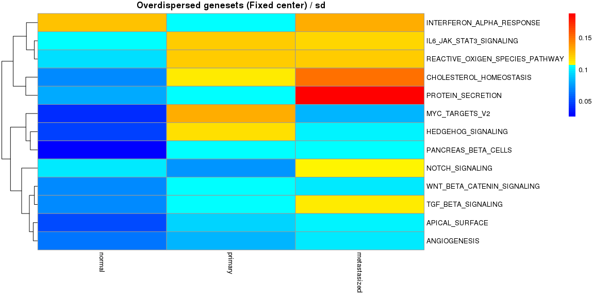<!-- -->

```
## $mean
##                                     normal    primary metastasized
## TNFA_SIGNALING_VIA_NFKB         -13972.669  3930.2928     9976.410
## CHOLESTEROL_HOMEOSTASIS          -8333.411  1189.1632     7147.078
## WNT_BETA_CATENIN_SIGNALING        8598.391 -2781.1356    -5726.658
## TGF_BETA_SIGNALING               -8420.751  2328.0791     5826.959
## IL6_JAK_STAT3_SIGNALING         -11069.085  2921.4550     8115.787
## DNA_REPAIR                      -11480.727  3415.1497     7314.981
## NOTCH_SIGNALING                  -6784.705  2649.9605     4081.167
## ANDROGEN_RESPONSE                10523.550 -1909.3322    -8318.343
## MYOGENESIS                       14706.161 -3124.4523   -11310.526
## PROTEIN_SECRETION                 6771.453 -1433.9250    -5268.083
## INTERFERON_ALPHA_RESPONSE         1675.947   548.0373    -2206.249
## INTERFERON_GAMMA_RESPONSE        16045.889 -5401.1723   -10617.903
## APICAL_JUNCTION                  12575.881 -2796.5094    -9826.974
## HEDGEHOG_SIGNALING                8680.299 -1993.6536    -6607.243
## COMPLEMENT                       14914.521 -4279.4807   -10306.290
## PI3K_AKT_MTOR_SIGNALING          10254.565 -3280.9176    -6727.250
## OXIDATIVE_PHOSPHORYLATION        13495.933 -5195.2788    -8301.760
## REACTIVE_OXIGEN_SPECIES_PATHWAY   7084.928 -1798.5503    -5044.940
## P53_PATHWAY                     -12128.474  3884.7648     7711.725
## UV_RESPONSE_DN                   10087.645 -2566.8224    -7665.371
## ANGIOGENESIS                     -6972.232  1019.9398     6094.582
## IL2_STAT5_SIGNALING              14030.620 -2694.2615   -11392.712
## KRAS_SIGNALING_UP                15773.126 -2635.6014   -12785.426
## 
## $sd
##                                   normal   primary metastasized
## TNFA_SIGNALING_VIA_NFKB         7626.419  9786.686    11795.796
## CHOLESTEROL_HOMEOSTASIS         5829.845  6043.365     6872.276
## WNT_BETA_CATENIN_SIGNALING      4948.882  6363.113     5710.310
## TGF_BETA_SIGNALING              4712.474  6554.812     5663.206
## IL6_JAK_STAT3_SIGNALING         5547.204  6106.055     6665.095
## DNA_REPAIR                      6835.850  8763.013     6192.017
## NOTCH_SIGNALING                 5384.687  5969.705     4045.946
## ANDROGEN_RESPONSE               5246.317  7653.663     5169.925
## MYOGENESIS                      5438.038 10591.395     7621.438
## PROTEIN_SECRETION               6953.136  7352.464     6092.481
## INTERFERON_ALPHA_RESPONSE       8780.567  9575.547    12521.139
## INTERFERON_GAMMA_RESPONSE       9696.716 10692.708     9083.162
## APICAL_JUNCTION                 7760.087  9643.238     6410.434
## HEDGEHOG_SIGNALING              3209.018  5377.410     5215.522
## COMPLEMENT                      9217.263  9116.336     8443.009
## PI3K_AKT_MTOR_SIGNALING         5742.441  7109.099     6216.010
## OXIDATIVE_PHOSPHORYLATION       6888.980 11499.262     6694.792
## REACTIVE_OXIGEN_SPECIES_PATHWAY 4693.074  6270.145     4941.237
## P53_PATHWAY                     6901.683 10548.899     6746.999
## UV_RESPONSE_DN                  9022.143  7213.059     5973.748
## ANGIOGENESIS                    3294.924  5393.614     6279.540
## IL2_STAT5_SIGNALING             6454.747  9956.660     8609.095
## KRAS_SIGNALING_UP               6183.455  9384.980     8239.276
```

and without the fixed center


```r
Plot.Genesets(RomaData = Data.NFC,
              Selected = SelectGeneSets(RomaData = Data.NFC, VarThr = 1e-3,
                                        VarMode = "Wil", VarType = "Under",
                                        MedThr = 1e-3, MedMode = "Wil", MedType = "Over"),
              GenesetMargin = 20, SampleMargin = 14, cluster_cols = FALSE,
              GroupInfo = Type, AggByGroupsFL = c("mean", "sd"),
              HMTite = "Underdispersed genesets (Non fixed center)")
```

```
## [1] "Using genestes underdispersed according to Wilcoxon test. VarThr = 0.001"
## [1] "Using genestes overdispersed according to Wilcoxon test. MedThr = 0.001"
## [1] "26 geneset selected"
```

<!-- --><!-- --><!-- --><!-- --><!-- -->

```
## $mean
##                                     normal    primary metastasized
## TNFA_SIGNALING_VIA_NFKB         -13874.952  4010.2483     9895.379
## HYPOXIA                         -14265.868  2095.1678    12028.868
## CHOLESTEROL_HOMEOSTASIS          -8352.131  1224.9702     7138.170
## WNT_BETA_CATENIN_SIGNALING        8615.171 -2727.5434    -5787.110
## TGF_BETA_SIGNALING               -8453.897  2387.1876     5838.825
## IL6_JAK_STAT3_SIGNALING           4977.983 -3581.2124    -1386.752
## DNA_REPAIR                      -11131.008  3490.9139     7049.551
## NOTCH_SIGNALING                  -6759.793  2679.0085     4049.790
## ESTROGEN_RESPONSE_LATE           15745.691 -3970.6626   -11516.098
## ANDROGEN_RESPONSE                10598.696 -1967.0252    -8344.632
## MYOGENESIS                       14927.095 -2590.3095   -11932.004
## PROTEIN_SECRETION                 6835.252 -1420.4951    -5324.381
## INTERFERON_ALPHA_RESPONSE         8206.633 -2392.3424    -5779.247
## INTERFERON_GAMMA_RESPONSE        15455.554 -5106.3860   -10286.381
## APICAL_JUNCTION                  12765.067 -2672.4820   -10099.737
## HEDGEHOG_SIGNALING                8678.894 -1922.3714    -6633.756
## COMPLEMENT                       15050.828 -4356.7220   -10329.562
## PI3K_AKT_MTOR_SIGNALING          10281.802 -3204.9517    -6792.748
## OXIDATIVE_PHOSPHORYLATION        13762.717 -4977.8664    -8641.668
## REACTIVE_OXIGEN_SPECIES_PATHWAY   7071.772 -1745.5653    -5054.270
## P53_PATHWAY                     -12118.637  3905.8586     7706.955
## UV_RESPONSE_DN                   11845.279 -3035.7091    -8672.811
## ANGIOGENESIS                     -7549.318   417.0993     7351.181
## IL2_STAT5_SIGNALING              14262.527 -2697.0063   -11554.889
## PEROXISOME                       11199.233  -835.0036   -10153.415
## KRAS_SIGNALING_UP                15923.478 -2605.7194   -12947.912
## 
## $sd
##                                   normal   primary metastasized
## TNFA_SIGNALING_VIA_NFKB         7617.237  9779.886    12355.901
## HYPOXIA                         8885.034  9650.370     9252.613
## CHOLESTEROL_HOMEOSTASIS         5852.970  6065.371     6951.816
## WNT_BETA_CATENIN_SIGNALING      4980.961  6383.666     5682.033
## TGF_BETA_SIGNALING              4673.647  6618.181     5768.699
## IL6_JAK_STAT3_SIGNALING         8089.694  8373.086    12392.292
## DNA_REPAIR                      6537.673  8165.014     6528.270
## NOTCH_SIGNALING                 5394.145  5972.208     4131.775
## ESTROGEN_RESPONSE_LATE          8355.102 12037.413     8449.827
## ANDROGEN_RESPONSE               5285.340  7827.683     5197.359
## MYOGENESIS                      5176.436 10835.415     8021.454
## PROTEIN_SECRETION               6939.358  7345.481     6129.055
## INTERFERON_ALPHA_RESPONSE       5397.580  9353.633    11276.063
## INTERFERON_GAMMA_RESPONSE       9763.177 11022.085    10244.064
## APICAL_JUNCTION                 7418.389  9646.394     6570.505
## HEDGEHOG_SIGNALING              3257.799  5416.375     5235.393
## COMPLEMENT                      9276.395  9422.190     8322.182
## PI3K_AKT_MTOR_SIGNALING         5742.104  7169.107     6203.021
## OXIDATIVE_PHOSPHORYLATION       6898.229 11294.537     6516.205
## REACTIVE_OXIGEN_SPECIES_PATHWAY 4645.490  6347.221     5010.466
## P53_PATHWAY                     6953.587 10542.358     6781.089
## UV_RESPONSE_DN                  8098.392  8013.409     6692.783
## ANGIOGENESIS                    2724.288  4864.074     6756.026
## IL2_STAT5_SIGNALING             6476.750 10146.539     8418.367
## PEROXISOME                      5421.327  7734.685     6975.958
## KRAS_SIGNALING_UP               6158.552  9636.050     8112.691
```

### Statistical comparison across samples

Visual inspection already stresses the difference between the groups. It is possible to quantify theses differnces performing statistical testing:


```r
CompareAcrossSamples(RomaData = Data.FC,
                     Selected = SelectGeneSets(RomaData = Data.FC, VarThr = 1e-3,
                                               VarMode = "Wil", VarType = "Over"),
                     Groups = Type)
```

```
## [1] "Using genestes overdispersed according to Wilcoxon test. VarThr = 0.001"
## [1] "19 geneset selected"
## [1] "Performing Type III AOV (R default)"
##               Df    Sum Sq   Mean Sq F value   Pr(>F)    
## Group          2 8.331e+09 4.165e+09   22.62 2.43e-10 ***
## Residuals   1023 1.883e+11 1.841e+08                     
## ---
## Signif. codes:  0 '***' 0.001 '**' 0.01 '*' 0.05 '.' 0.1 ' ' 1
```

<!-- --><!-- -->

```
## [1] "A significant difference is observed across groups"
## [1] "Calculating Tukey Honest Significant Differences"
## [1] "3 significant differences found"
```

<!-- -->

```
## [1] "Performing Type III AOV (R default)"
##                Df    Sum Sq   Mean Sq F value Pr(>F)    
## Group           2 8.331e+09 4.165e+09   47.12 <2e-16 ***
## Group:GeneSet  54 1.027e+11 1.902e+09   21.51 <2e-16 ***
## Residuals     969 8.566e+10 8.840e+07                   
## ---
## Signif. codes:  0 '***' 0.001 '**' 0.01 '*' 0.05 '.' 0.1 ' ' 1
```

<!-- -->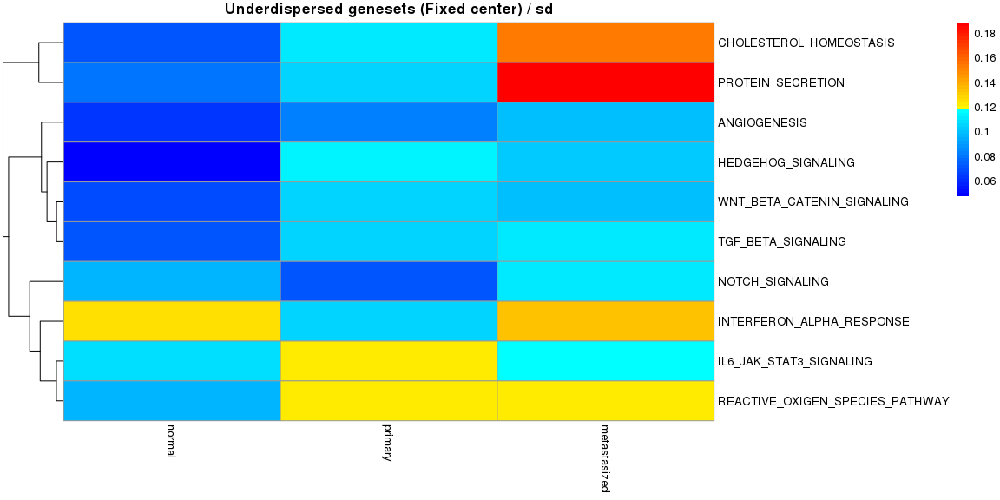<!-- --><!-- --><!-- --><!-- -->

```
## [1] "A significant difference is observed across groups and metagenes"
## [1] "Calculating Tukey Honest Significant Differences"
## [1] "678 significant differences found"
```

<!-- --><!-- --><!-- --><!-- --><!-- --><!-- --><!-- --><!-- --><!-- --><!-- --><!-- --><!-- --><!-- --><!-- --><!-- --><!-- --><!-- --><!-- -->


```r
CompareAcrossSamples(RomaData = Data.NFC,
                     Selected = SelectGeneSets(RomaData = Data.FC, VarThr = 1e-3,
                                               VarMode = "Wil", VarType = "Over"),
                     Groups = Type)
```

```
## [1] "Using genestes overdispersed according to Wilcoxon test. VarThr = 0.001"
## [1] "19 geneset selected"
## [1] "Performing Type III AOV (R default)"
##               Df    Sum Sq   Mean Sq F value   Pr(>F)    
## Group          2 8.114e+09 4.057e+09   21.92 4.76e-10 ***
## Residuals   1023 1.893e+11 1.851e+08                     
## ---
## Signif. codes:  0 '***' 0.001 '**' 0.01 '*' 0.05 '.' 0.1 ' ' 1
```

<!-- --><!-- -->

```
## [1] "A significant difference is observed across groups"
## [1] "Calculating Tukey Honest Significant Differences"
## [1] "3 significant differences found"
```

<!-- -->

```
## [1] "Performing Type III AOV (R default)"
##                Df    Sum Sq   Mean Sq F value Pr(>F)    
## Group           2 8.114e+09 4.057e+09   45.62 <2e-16 ***
## Group:GeneSet  54 1.031e+11 1.910e+09   21.48 <2e-16 ***
## Residuals     969 8.618e+10 8.893e+07                   
## ---
## Signif. codes:  0 '***' 0.001 '**' 0.01 '*' 0.05 '.' 0.1 ' ' 1
```

<!-- -->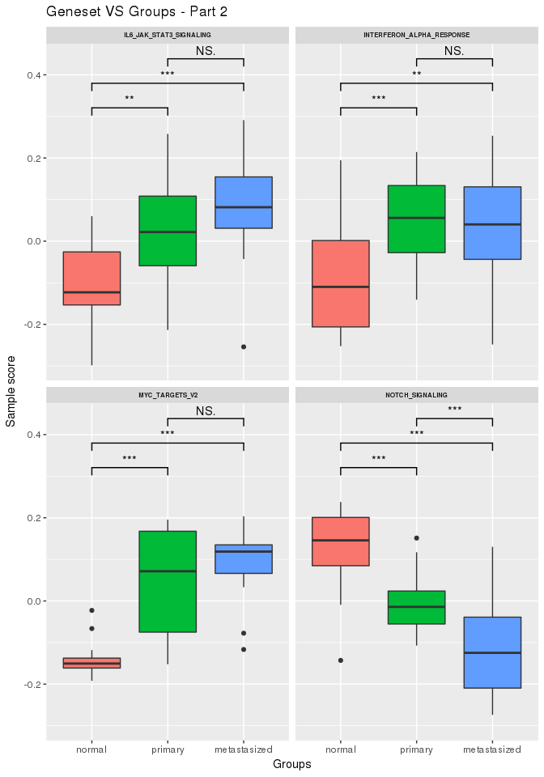<!-- --><!-- --><!-- --><!-- -->

```
## [1] "A significant difference is observed across groups and metagenes"
## [1] "Calculating Tukey Honest Significant Differences"
## [1] "681 significant differences found"
```

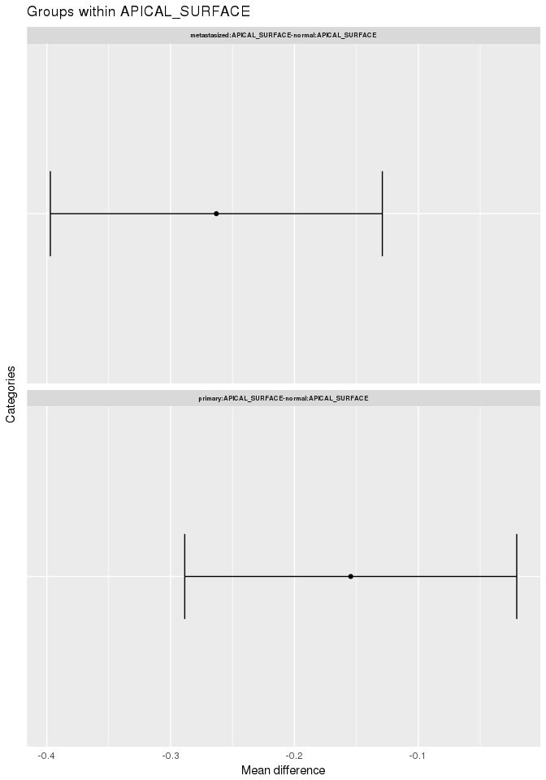<!-- -->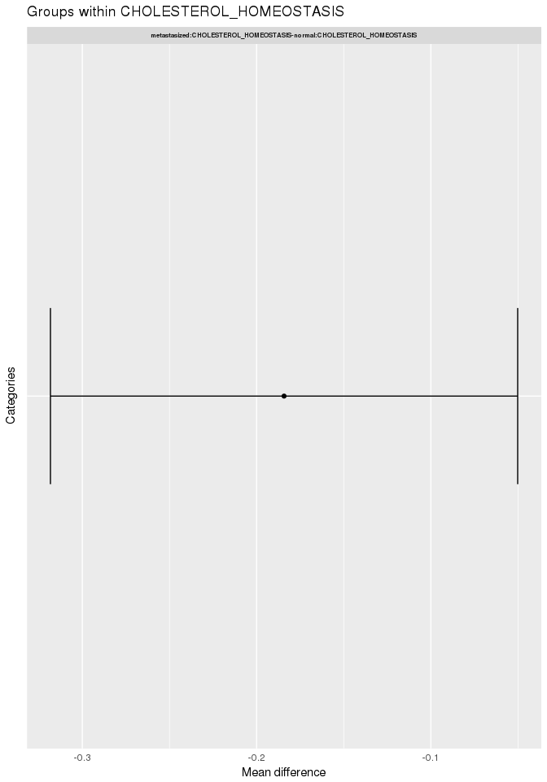<!-- --><!-- --><!-- --><!-- --><!-- --><!-- --><!-- --><!-- --><!-- --><!-- --><!-- --><!-- --><!-- --><!-- --><!-- --><!-- --><!-- --><!-- -->


### Gene weights

We can also explore the gene weigths with the fixed center


```r
PlotGeneWeight(RomaData = Data.FC, PlotGenes = 30,
               ExpressionMatrix = MatData, LogExpression = FALSE,
               Selected = SelectGeneSets(RomaData = Data.FC, VarThr = 1e-3,
                                         VarMode = "Wil", VarType = "Over"),
               PlotWeigthSign = TRUE)
```

```
## [1] "Using genestes overdispersed according to Wilcoxon test. VarThr = 0.001"
## [1] "19 geneset selected"
```

<!-- --><!-- --><!-- --><!-- --><!-- --><!-- --><!-- --><!-- --><!-- --><!-- --><!-- --><!-- --><!-- --><!-- --><!-- --><!-- --><!-- --><!-- --><!-- -->

and without the fixed center


```r
PlotGeneWeight(RomaData = Data.NFC, PlotGenes = 30,
               ExpressionMatrix = MatData, LogExpression = FALSE,
               Selected = SelectGeneSets(RomaData = Data.NFC, VarThr = 1e-3,
                                         VarMode = "Wil", VarType = "Over"),
               PlotWeigthSign = TRUE)
```

```
## [1] "Using genestes overdispersed according to Wilcoxon test. VarThr = 0.001"
## [1] "16 geneset selected"
```

<!-- -->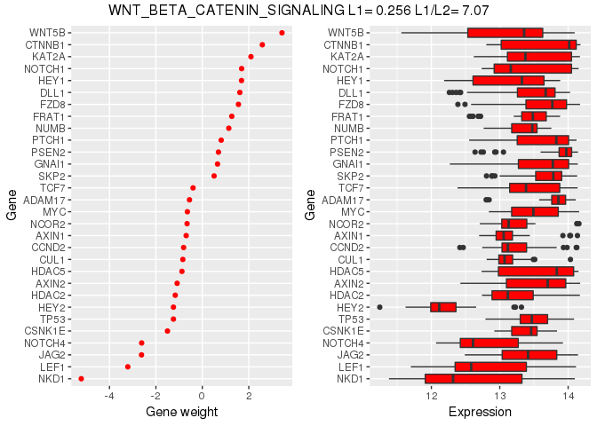<!-- --><!-- --><!-- -->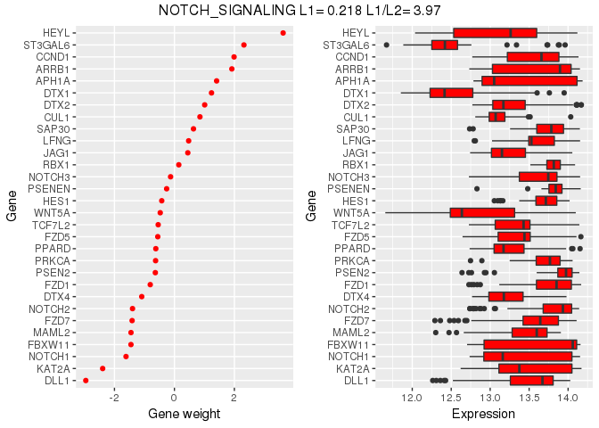<!-- --><!-- -->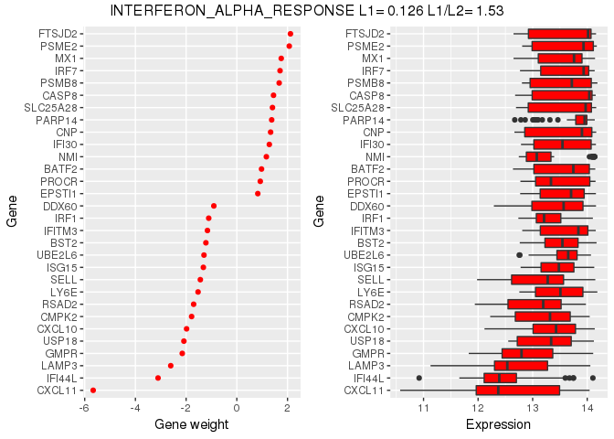<!-- --><!-- -->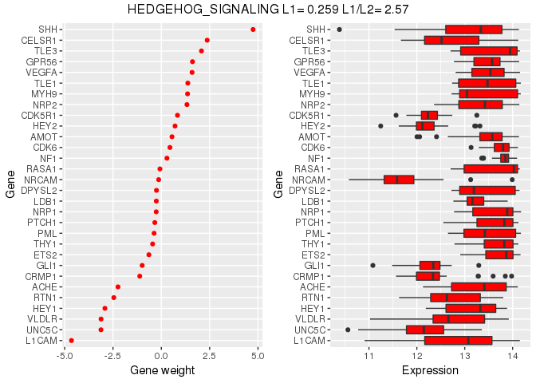<!-- --><!-- --><!-- --><!-- --><!-- --><!-- --><!-- --><!-- -->

### Sample projections

Moreover, we can look at the projections of the samples with the fixed center


```r
PlotSampleProjections(RomaData = Data.FC, PlotSamples = 30,
                      ExpressionMatrix = MatData, LogExpression = FALSE,
                      Selected = SelectGeneSets(RomaData = Data.FC, VarThr = 1e-6,
                                                VarMode = "Wil", VarType = "Over"),
                      PlotPCProj = "none")
```

```
## [1] "Using genestes overdispersed according to Wilcoxon test. VarThr = 1e-06"
## [1] "17 geneset selected"
```

<!-- -->

```
## NULL
```

and without the fixed center


```r
PlotSampleProjections(RomaData = Data.NFC, PlotSamples = 30,
                      ExpressionMatrix = MatData, LogExpression = FALSE,
                      Selected = SelectGeneSets(RomaData = Data.NFC, VarThr = 1e-6,
                                                VarMode = "Wil", VarType = "Over"),
                      PlotPCProj = "none")
```

```
## [1] "Using genestes overdispersed according to Wilcoxon test. VarThr = 1e-06"
## [1] "13 geneset selected"
```

<!-- -->

```
## NULL
```

### Recurrent genes

Finally, we can look at genes which appear across different genesests and explore thier weithgs


```r
PlotRecurringGenes(RomaData = Data.NFC,
                   Selected = SelectGeneSets(RomaData = Data.NFC, VarThr = 1e-3,
                                             VarMode = "Wil", VarType = "Over"),
                   GenesByGroup = 25, MinMult = 3)
```

```
## [1] "Using genestes overdispersed according to Wilcoxon test. VarThr = 0.001"
## [1] "16 geneset selected"
```

<!-- --><!-- --><!-- --><!-- --><!-- --><!-- --><!-- --><!-- --><!-- --><!-- --><!-- --><!-- --><!-- --><!-- --><!-- --><!-- --><!-- --><!-- --><!-- --><!-- --><!-- --><!-- --><!-- --><!-- --><!-- --><!-- --><!-- --><!-- --><!-- --><!-- --><!-- --><!-- --><!-- --><!-- --><!-- --><!-- --><!-- --><!-- -->


### Looking at the details 

By default, rRoma will perform the appropiate anaysis without showing all the details to the users. However, it is possible to obtain additioanl graphical and textual information. This will results in a large amount of inromation being derived an plotted. Hence, it is not advisable to do that for large analysis. To show an example of the extended information that can be produced, we will first obtain a smaller module list.


```r
RedGMT <- SelectFromMSIGdb(SearchString = "GO_POSITIVE_REGULATION_OF_CELL_CYCLE_ARREST", Mode = "ALL")
```

```
## [1] "Searching in MsigDB v6.0"
## [1] "The following genesets have been selected:"
## [1] "GO_POSITIVE_REGULATION_OF_CELL_CYCLE_ARREST (85 genes)"
```

Wen perfoming ROMA we will now set `PlotData = TRUE` (to produce diagnostic plots), `MoreInfo = TRUE` (to print additional diagnostic information), and `FullSampleInfo = TRUE` (to compute and save additional information on the samples). Note that rRoma will ask to confim cetain choiches if R is run interactivelly.


```r
tictoc::tic()
RedData.NFC <- rRoma.R(ExpressionMatrix = MatData, ModuleList = RedGMT, FixedCenter = FALSE,
                    UseParallel = TRUE, nCores = 8, ClusType = "FORK",
                    PCSignMode="CorrelateAllWeightsByGene", 
                    PlotData = TRUE, MoreInfo = TRUE, FullSampleInfo = TRUE,
                    Grouping = Type, GroupPCSign = FALSE)
```

```
## [1] "Centering gene expression over samples"
## [1] "Using local center (NOT centering over genes)"
## [1] "All the genesets will be used"
## [1] "2017-04-13 16:23:25 CEST"
## [1] "[1/1] Working on GO_POSITIVE_REGULATION_OF_CELL_CYCLE_ARREST - http://www.broadinstitute.org/gsea/msigdb/cards/GO_POSITIVE_REGULATION_OF_CELL_CYCLE_ARREST"
## [1] "84 genes available for analysis"
## [1] "The following genes will be used:"
##  [1] "POU4F1"   "ATM"      "RPS27A"   "CDK1"     "PPP2R5C"  "CNOT1"   
##  [7] "INSM1"    "SFN"      "UBC"      "PRKACA"   "CNOT10"   "TP53"    
## [13] "CARM1"    "MDM4"     "CRADD"    "FAP"      "E2F1"     "CHEK2"   
## [19] "CCNB1"    "EP300"    "HMGA2"    "BTG2"     "PLAGL1"   "CNOT6"   
## [25] "PCNA"     "MYOG"     "C2orf29"  "CDKN1B"   "TFDP1"    "ARID3A"  
## [31] "MDM2"     "DAB2IP"   "RQCD1"    "CDK2"     "E2F7"     "PLK2"    
## [37] "FOXO4"    "TFDP2"    "UBA52"    "ZNF385A"  "CNOT3"    "MUC1"    
## [43] "MYBBP1A"  "CNOT8"    "RBM38"    "PKD2"     "TNKS1BP1" "SOX4"    
## [49] "TRIAP1"   "AURKA"    "CDC25C"   "CNOT4"    "CDKN1A"   "CRLF3"   
## [55] "BAX"      "PPP2R5B"  "MED25"    "TP73"     "RRP8"     "RNF112"  
## [61] "NPM1"     "CDKN2A"   "GADD45A"  "PCBP4"    "GTSE1"    "PML"     
## [67] "ID2"      "UHRF2"    "CNOT6L"   "E2F4"     "TGFB1"    "CDK5R1"  
## [73] "UBB"      "BRCA1"    "CASP2"    "CNOT2"    "CNOT7"    "GML"     
## [79] "CENPJ"    "PLK3"     "PIDD"     "PRMT1"    "GATA6"    "RBL2"    
## [1] "Detecting outliers using leave one out and median-absolute-deviations away from median (scater package)"
```

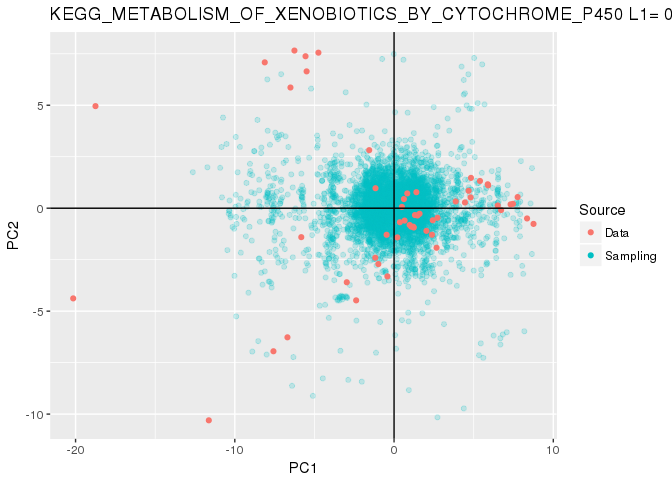<!-- -->

```
## [1] "2 gene(s) will be filtered:"
## [1] "FAP"  "CDK2"
## [1] "Not using weigths for PCA computation"
## [1] "Pre-filter data"
## [1] "L1 = 0.217899128880576 L1/L2 = 2.33664639834391"
## [1] "Median expression (uncentered): 11575.5"
## [1] "Median expression (centered/weighted): -10.9074074074074"
## [1] "Post-filter data"
## [1] "L1 = 0.195381466591884 L1/L2 = 1.9761821994038"
## [1] "Median expression (uncentered): 11615"
## [1] "Median expression (centered/weighted): -10.9074074074074"
## [1] "Previous sample size: 0"
## [1] "Next sample size: 84"
## [1] "Computing samples"
##    user  system elapsed 
##   0.091   0.159  12.260
```

<!-- -->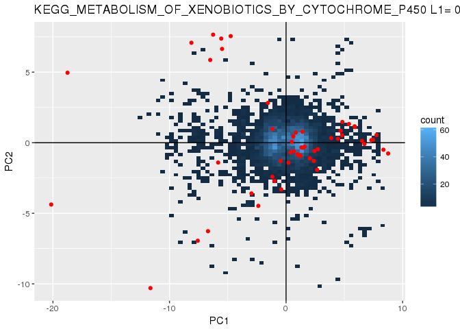<!-- --><!-- -->

```
## [1] "Missing gene weights will be replaced by 1"
## [1] "Orienting PC by correlating gene expression and PC projections"
## [1] "Not using groups"
## [1] "Computing correlations"
## [1] "Correcting using weights"
## [1] "Missing gene weights will be replaced by 1"
## [1] "Orienting PC by correlating gene expression and PC projections"
## [1] "Not using groups"
## [1] "Computing correlations"
## [1] "Correcting using weights"
## [1] "Missing gene weights will be replaced by 1"
## [1] "Orienting PC by correlating gene expression and PC projections"
## [1] "Not using groups"
## [1] "Computing correlations"
## [1] "Correcting using weights"
```

<!-- -->

```
## [1] "Plotting expression VS projections"
```

<!-- --><!-- --><!-- --><!-- --><!-- --><!-- -->

```
## [1] "Plotting correlations of expression VS projections"
```

<!-- --><!-- --><!-- --><!-- --><!-- --><!-- -->

```
## [1] "Plotting expression VS PC weigths"
```

<!-- --><!-- --><!-- -->

```
## [1] "Plotting correlation of expression VS PC weigths"
```

<!-- --><!-- -->

```
## Warning in if (length(ProjMatrix) == colnames(ExpressionMatrix)) {: la
## condition a une longueur > 1 et seul le premier lment est utilis
```

<!-- -->

```r
tictoc::toc()
```

```
## 31.799 sec elapsed
```


```r
PlotSampleProjections(RomaData = RedData.NFC, PlotSamples = 30,
                      ExpressionMatrix = MatData, LogExpression = FALSE,
                      Selected = NULL,
                      PlotPCProj = c('Points', 'Density',  'Bins'))
```

```
## [1] "1 geneset selected"
```

<!-- -->

```
## NULL
```
```


