-   [Intalling rROMA](#intalling-rroma)
-   [Using rROMA](#using-rroma)
-   [An example](#an-example)
    -   [Getting the dataset](#getting-the-dataset)
    -   [Performing ROMA](#performing-roma)
    -   [Module activity](#module-activity)
    -   [Statistical comparison across
        samples](#statistical-comparison-across-samples)
    -   [Top contributing genes](#top-contributing-genes)
    -   [Gene weights](#gene-weights)
    -   [Sample projections](#sample-projections)
    -   [Recurrent genes](#recurrent-genes)
    -   [Looking at the details](#looking-at-the-details)
    -   [Using the interactive
        dashboards](#using-the-interactive-dashboards)
    -   [Visualising on ACSN](#visualising-on-acsn)

This package provides an R implementation of
[ROMA](http://journal.frontiersin.org/article/10.3389/fgene.2016.00018/full).
The package is under active development and is currently being tested.

A Java implementation developed by Andrei Zynovyev and is also
[available](https://github.com/sysbio-curie/Roma).

Intalling rROMA
===============

The rRoma package relies on the `scater` package, which is available
only on BioConductor. This package can be installed with the following
command

    if(!requireNamespace("scater")){
      source("https://bioconductor.org/biocLite.R")
      biocLite("scater")
    }

    ## Loading required namespace: scater

rRoma can then be installed using `devtools`

    if(!requireNamespace("devtools")){
      install.packages("devtools")
    }
    devtools::install_github("Albluca/rROMA")

To fill missing values rRoma uses the mice package. This package needs
to be installed manually if datasets with missing values need to be
analysed:

    install.packages("tictoc")

Finally, rRoma allow projecting the results of the analysis on [ACSN
maps](https://acsn.curie.fr). To use this functionality it is necessary
to install the `RNaviCell` package:

    if(!requireNamespace("devtools")){
      install.packages("devtools")
    }
    devtools::install_github("sysbio-curie/RNaviCell")

The packages `GEOquery`, `tictoc`, and `readr` are not required to run
rRoma, but are used in the following example and need to be installed to
reproduce the analysis

    if(!requireNamespace("GEOquery")){
      source("https://bioconductor.org/biocLite.R")
      biocLite("GEOquery")
    }

    ## Loading required namespace: GEOquery

    ## Setting options('download.file.method.GEOquery'='auto')

    ## Setting options('GEOquery.inmemory.gpl'=FALSE)

    if(!requireNamespace("readr")){
      install.packages("readr")
    }

    ## Loading required namespace: readr

    if(!requireNamespace("tictoc")){
      install.packages("tictoc")
    }

    ## Loading required namespace: tictoc

Using rROMA
===========

The package can be loaded with the usual syntax, i.e., by typing

    library(rRoma)

rRoma requires a gene expression matrix - with column names indicating
samples and row names indicating gene names - and a module file
containing information on the genesets that need to be evaluated. The
module file can be loaded from a GMT file. Functions to automate the
generation of then GMT file are also available.

Various functions are then available to explore the analysis, including
plotting and statistical cross sample analysis.

An example
==========

To show a concrete example of rROMA we will use a dataset available on
GEO.

Getting the dataset
-------------------

Let us begin by getting the description of the dataset

    library(GEOquery)

    ## Loading required package: Biobase

    ## Loading required package: BiocGenerics

    ## Loading required package: parallel

    ## 
    ## Attaching package: 'BiocGenerics'

    ## The following objects are masked from 'package:parallel':
    ## 
    ##     clusterApply, clusterApplyLB, clusterCall, clusterEvalQ,
    ##     clusterExport, clusterMap, parApply, parCapply, parLapply,
    ##     parLapplyLB, parRapply, parSapply, parSapplyLB

    ## The following objects are masked from 'package:stats':
    ## 
    ##     IQR, mad, xtabs

    ## The following objects are masked from 'package:base':
    ## 
    ##     anyDuplicated, append, as.data.frame, cbind, colnames,
    ##     do.call, duplicated, eval, evalq, Filter, Find, get, grep,
    ##     grepl, intersect, is.unsorted, lapply, lengths, Map, mapply,
    ##     match, mget, order, paste, pmax, pmax.int, pmin, pmin.int,
    ##     Position, rank, rbind, Reduce, rownames, sapply, setdiff,
    ##     sort, table, tapply, union, unique, unsplit, which, which.max,
    ##     which.min

    ## Welcome to Bioconductor
    ## 
    ##     Vignettes contain introductory material; view with
    ##     'browseVignettes()'. To cite Bioconductor, see
    ##     'citation("Biobase")', and for packages 'citation("pkgname")'.

    gse <- getGEO("GSE50760", GSEMatrix = TRUE)

    ## https://ftp.ncbi.nlm.nih.gov/geo/series/GSE50nnn/GSE50760/matrix/

    ## OK

    ## Found 1 file(s)

    ## GSE50760_series_matrix.txt.gz

    ## File stored at:

    ## /tmp/Rtmp4nc7ch/GPL11154.soft

Then we get the actual expression expression files

    filePaths = getGEOSuppFiles("GSE50760")

    ## https://ftp.ncbi.nlm.nih.gov/geo/series/GSE50nnn/GSE50760/suppl/

    ## OK

Now we can construct the expression matrix. Note that the code below is
designed to work on a Unix-like environment (e.g. MacOS). The execution
on a Windows environment may require replacing `"/"` with `"\"`.

    library(readr)
    Content <- untar(row.names(filePaths)[1], list = TRUE)
    untar(row.names(filePaths)[1], list = FALSE)

    MatData <- NULL

    for(i in 1:length(Content)){
      Exp <- read_delim(Content[i], "\t", escape_double = FALSE, trim_ws = TRUE)
      
      if(is.null(MatData)){
        MatData <- cbind(unlist(Exp[,1]), unlist(Exp[,2]))
      } else {
        if(any(MatData[,1] != unlist(Exp[,1]))){
          stop("Incompatible samples")
        }
        MatData <- cbind(MatData, unlist(Exp[,2]))
      }
      
      file.remove(Content[i])
      
    }

    ## Parsed with column specification:
    ## cols(
    ##   genes = col_character(),
    ##   AMC_2.1_FPKM = col_double()
    ## )

    ## Parsed with column specification:
    ## cols(
    ##   genes = col_character(),
    ##   AMC_3.1_FPKM = col_double()
    ## )

    ## Parsed with column specification:
    ## cols(
    ##   genes = col_character(),
    ##   AMC_5.1_FPKM = col_double()
    ## )

    ## Parsed with column specification:
    ## cols(
    ##   genes = col_character(),
    ##   AMC_6.1_FPKM = col_double()
    ## )

    ## Parsed with column specification:
    ## cols(
    ##   genes = col_character(),
    ##   AMC_7.1_FPKM = col_double()
    ## )

    ## Parsed with column specification:
    ## cols(
    ##   genes = col_character(),
    ##   AMC_8.1_FPKM = col_double()
    ## )

    ## Parsed with column specification:
    ## cols(
    ##   genes = col_character(),
    ##   AMC_9.1_FPKM = col_double()
    ## )

    ## Parsed with column specification:
    ## cols(
    ##   genes = col_character(),
    ##   AMC_10.1_FPKM = col_double()
    ## )

    ## Parsed with column specification:
    ## cols(
    ##   genes = col_character(),
    ##   AMC_12.1_FPKM = col_double()
    ## )

    ## Parsed with column specification:
    ## cols(
    ##   genes = col_character(),
    ##   AMC_13.1_FPKM = col_double()
    ## )

    ## Parsed with column specification:
    ## cols(
    ##   genes = col_character(),
    ##   AMC_17.1_FPKM = col_double()
    ## )

    ## Parsed with column specification:
    ## cols(
    ##   genes = col_character(),
    ##   AMC_18.1_FPKM = col_double()
    ## )

    ## Parsed with column specification:
    ## cols(
    ##   genes = col_character(),
    ##   AMC_19.1_FPKM = col_double()
    ## )

    ## Parsed with column specification:
    ## cols(
    ##   genes = col_character(),
    ##   AMC_20.1_FPKM = col_double()
    ## )

    ## Parsed with column specification:
    ## cols(
    ##   genes = col_character(),
    ##   AMC_21.1_FPKM = col_double()
    ## )

    ## Parsed with column specification:
    ## cols(
    ##   genes = col_character(),
    ##   AMC_22.1_FPKM = col_double()
    ## )

    ## Parsed with column specification:
    ## cols(
    ##   genes = col_character(),
    ##   AMC_23.1_FPKM = col_double()
    ## )

    ## Parsed with column specification:
    ## cols(
    ##   genes = col_character(),
    ##   AMC_24.1_FPKM = col_double()
    ## )

    ## Parsed with column specification:
    ## cols(
    ##   genes = col_character(),
    ##   AMC_2.2_FPKM = col_double()
    ## )

    ## Parsed with column specification:
    ## cols(
    ##   genes = col_character(),
    ##   AMC_3.2_FPKM = col_double()
    ## )

    ## Parsed with column specification:
    ## cols(
    ##   genes = col_character(),
    ##   AMC_5.2_FPKM = col_double()
    ## )

    ## Parsed with column specification:
    ## cols(
    ##   genes = col_character(),
    ##   AMC_6.2_FPKM = col_double()
    ## )

    ## Parsed with column specification:
    ## cols(
    ##   genes = col_character(),
    ##   AMC_7.2_FPKM = col_double()
    ## )

    ## Parsed with column specification:
    ## cols(
    ##   genes = col_character(),
    ##   AMC_8.2_FPKM = col_double()
    ## )

    ## Parsed with column specification:
    ## cols(
    ##   genes = col_character(),
    ##   AMC_9.2_FPKM = col_double()
    ## )

    ## Parsed with column specification:
    ## cols(
    ##   genes = col_character(),
    ##   AMC_10.2_FPKM = col_double()
    ## )

    ## Parsed with column specification:
    ## cols(
    ##   genes = col_character(),
    ##   AMC_12.2_FPKM = col_double()
    ## )

    ## Parsed with column specification:
    ## cols(
    ##   genes = col_character(),
    ##   AMC_13.2_FPKM = col_double()
    ## )

    ## Parsed with column specification:
    ## cols(
    ##   genes = col_character(),
    ##   AMC_17.2_FPKM = col_double()
    ## )

    ## Parsed with column specification:
    ## cols(
    ##   genes = col_character(),
    ##   AMC_18.2_FPKM = col_double()
    ## )

    ## Parsed with column specification:
    ## cols(
    ##   genes = col_character(),
    ##   AMC_19.2_FPKM = col_double()
    ## )

    ## Parsed with column specification:
    ## cols(
    ##   genes = col_character(),
    ##   AMC_20.2_FPKM = col_double()
    ## )

    ## Parsed with column specification:
    ## cols(
    ##   genes = col_character(),
    ##   AMC_21.2_FPKM = col_double()
    ## )

    ## Parsed with column specification:
    ## cols(
    ##   genes = col_character(),
    ##   AMC_22.2_FPKM = col_double()
    ## )

    ## Parsed with column specification:
    ## cols(
    ##   genes = col_character(),
    ##   AMC_23.2_FPKM = col_double()
    ## )

    ## Parsed with column specification:
    ## cols(
    ##   genes = col_character(),
    ##   AMC_24.2_FPKM = col_double()
    ## )

    ## Parsed with column specification:
    ## cols(
    ##   genes = col_character(),
    ##   AMC_2.3_FPKM = col_double()
    ## )

    ## Parsed with column specification:
    ## cols(
    ##   genes = col_character(),
    ##   AMC_3.3_FPKM = col_double()
    ## )

    ## Parsed with column specification:
    ## cols(
    ##   genes = col_character(),
    ##   AMC_5.3_FPKM = col_double()
    ## )

    ## Parsed with column specification:
    ## cols(
    ##   genes = col_character(),
    ##   AMC_6.3_FPKM = col_double()
    ## )

    ## Parsed with column specification:
    ## cols(
    ##   genes = col_character(),
    ##   AMC_7.3_FPKM = col_double()
    ## )

    ## Parsed with column specification:
    ## cols(
    ##   genes = col_character(),
    ##   AMC_8.3_FPKM = col_double()
    ## )

    ## Parsed with column specification:
    ## cols(
    ##   genes = col_character(),
    ##   AMC_9.3_FPKM = col_double()
    ## )

    ## Parsed with column specification:
    ## cols(
    ##   genes = col_character(),
    ##   AMC_10.3_FPKM = col_double()
    ## )

    ## Parsed with column specification:
    ## cols(
    ##   genes = col_character(),
    ##   AMC_12.3_FPKM = col_double()
    ## )

    ## Parsed with column specification:
    ## cols(
    ##   genes = col_character(),
    ##   AMC_13.3_FPKM = col_double()
    ## )

    ## Parsed with column specification:
    ## cols(
    ##   genes = col_character(),
    ##   AMC_17.3_FPKM = col_double()
    ## )

    ## Parsed with column specification:
    ## cols(
    ##   genes = col_character(),
    ##   AMC_18.3_FPKM = col_double()
    ## )

    ## Parsed with column specification:
    ## cols(
    ##   genes = col_character(),
    ##   AMC_19.3_FPKM = col_double()
    ## )

    ## Parsed with column specification:
    ## cols(
    ##   genes = col_character(),
    ##   AMC_20.3_FPKM = col_double()
    ## )

    ## Parsed with column specification:
    ## cols(
    ##   genes = col_character(),
    ##   AMC_21.3_FPKM = col_double()
    ## )

    ## Parsed with column specification:
    ## cols(
    ##   genes = col_character(),
    ##   AMC_22.3_FPKM = col_double()
    ## )

    ## Parsed with column specification:
    ## cols(
    ##   genes = col_character(),
    ##   AMC_23.3_FPKM = col_double()
    ## )

    ## Parsed with column specification:
    ## cols(
    ##   genes = col_character(),
    ##   AMC_24.3_FPKM = col_double()
    ## )

    SplitPath <- unlist(strsplit(rownames(filePaths)[1], "/"))
    SplitPath <- SplitPath[-length(SplitPath)]
    unlink(x = paste(SplitPath, collapse = "/"), recursive = TRUE)

    Genes <- MatData[,1]
    MatData <- data.matrix(data.frame(MatData[,-1]))
    rownames(MatData) <- Genes
    colnames(MatData) <- unlist(lapply(strsplit(Content, "_"), "[[", 1))

And look at the different groups of cells present

    Type <- as.character(gse$GSE50760_series_matrix.txt.gz[[1]])
    Type <- unlist(lapply(strsplit(Type, " "), "[[", 1))
    names(Type) = as.character(gse$GSE50760_series_matrix.txt.gz[[2]])

    table(Type)

    ## Type
    ## metastasized       normal      primary 
    ##           18           18           18

For convenience, we will transform `Type` into a factor:

    Type <- factor(Type, levels = c("normal", "primary", "metastasized"))

This will allow plotting functions, such as `Plot.Genesets`, to use more
meaningful ordering when reporting information.

### Selecting the module list

At this point we can create the metagene files. We will extract all the
"HALLMARK" geneset from MSig. We will also remove "HALLMARK\_" from the
names to simplify the graphical representation.

    AllHall <- SelectFromMSIGdb("HALLMARK")

    ## [1] "Searching in MsigDB v6.0"
    ## [1] "The following genesets have been selected:"
    ##  [1] "HALLMARK_TNFA_SIGNALING_VIA_NFKB (200 genes)"          
    ##  [2] "HALLMARK_HYPOXIA (200 genes)"                          
    ##  [3] "HALLMARK_CHOLESTEROL_HOMEOSTASIS (74 genes)"           
    ##  [4] "HALLMARK_MITOTIC_SPINDLE (200 genes)"                  
    ##  [5] "HALLMARK_WNT_BETA_CATENIN_SIGNALING (42 genes)"        
    ##  [6] "HALLMARK_TGF_BETA_SIGNALING (54 genes)"                
    ##  [7] "HALLMARK_IL6_JAK_STAT3_SIGNALING (87 genes)"           
    ##  [8] "HALLMARK_DNA_REPAIR (150 genes)"                       
    ##  [9] "HALLMARK_G2M_CHECKPOINT (200 genes)"                   
    ## [10] "HALLMARK_APOPTOSIS (161 genes)"                        
    ## [11] "HALLMARK_NOTCH_SIGNALING (32 genes)"                   
    ## [12] "HALLMARK_ADIPOGENESIS (200 genes)"                     
    ## [13] "HALLMARK_ESTROGEN_RESPONSE_EARLY (200 genes)"          
    ## [14] "HALLMARK_ESTROGEN_RESPONSE_LATE (200 genes)"           
    ## [15] "HALLMARK_ANDROGEN_RESPONSE (101 genes)"                
    ## [16] "HALLMARK_MYOGENESIS (200 genes)"                       
    ## [17] "HALLMARK_PROTEIN_SECRETION (96 genes)"                 
    ## [18] "HALLMARK_INTERFERON_ALPHA_RESPONSE (97 genes)"         
    ## [19] "HALLMARK_INTERFERON_GAMMA_RESPONSE (200 genes)"        
    ## [20] "HALLMARK_APICAL_JUNCTION (200 genes)"                  
    ## [21] "HALLMARK_APICAL_SURFACE (44 genes)"                    
    ## [22] "HALLMARK_HEDGEHOG_SIGNALING (36 genes)"                
    ## [23] "HALLMARK_COMPLEMENT (200 genes)"                       
    ## [24] "HALLMARK_UNFOLDED_PROTEIN_RESPONSE (113 genes)"        
    ## [25] "HALLMARK_PI3K_AKT_MTOR_SIGNALING (105 genes)"          
    ## [26] "HALLMARK_MTORC1_SIGNALING (200 genes)"                 
    ## [27] "HALLMARK_E2F_TARGETS (200 genes)"                      
    ## [28] "HALLMARK_MYC_TARGETS_V1 (200 genes)"                   
    ## [29] "HALLMARK_MYC_TARGETS_V2 (58 genes)"                    
    ## [30] "HALLMARK_EPITHELIAL_MESENCHYMAL_TRANSITION (200 genes)"
    ## [31] "HALLMARK_INFLAMMATORY_RESPONSE (200 genes)"            
    ## [32] "HALLMARK_XENOBIOTIC_METABOLISM (200 genes)"            
    ## [33] "HALLMARK_FATTY_ACID_METABOLISM (158 genes)"            
    ## [34] "HALLMARK_OXIDATIVE_PHOSPHORYLATION (200 genes)"        
    ## [35] "HALLMARK_GLYCOLYSIS (200 genes)"                       
    ## [36] "HALLMARK_REACTIVE_OXIGEN_SPECIES_PATHWAY (49 genes)"   
    ## [37] "HALLMARK_P53_PATHWAY (200 genes)"                      
    ## [38] "HALLMARK_UV_RESPONSE_UP (158 genes)"                   
    ## [39] "HALLMARK_UV_RESPONSE_DN (144 genes)"                   
    ## [40] "HALLMARK_ANGIOGENESIS (36 genes)"                      
    ## [41] "HALLMARK_HEME_METABOLISM (200 genes)"                  
    ## [42] "HALLMARK_COAGULATION (138 genes)"                      
    ## [43] "HALLMARK_IL2_STAT5_SIGNALING (200 genes)"              
    ## [44] "HALLMARK_BILE_ACID_METABOLISM (112 genes)"             
    ## [45] "HALLMARK_PEROXISOME (104 genes)"                       
    ## [46] "HALLMARK_ALLOGRAFT_REJECTION (200 genes)"              
    ## [47] "HALLMARK_SPERMATOGENESIS (135 genes)"                  
    ## [48] "HALLMARK_KRAS_SIGNALING_UP (200 genes)"                
    ## [49] "HALLMARK_KRAS_SIGNALING_DN (200 genes)"                
    ## [50] "HALLMARK_PANCREAS_BETA_CELLS (40 genes)"

    AllHall <- lapply(AllHall, function(x){
      x$Name <- sub("HALLMARK_", "", x$Name)
      x
    })

Performing ROMA
---------------

To reduce potential problems we will remove genes with a duplicated name

    if(any(duplicated(rownames(MatData)))){
      MatData <- MatData[!(rownames(MatData) %in% rownames(MatData)[duplicated(rownames(MatData))]), ]
    }

Moreover, we will use pseudocount transformation to boost the normality
of the data

    MatData <- log2(MatData + 1)

And now we are ready to perform ROMA by using the `rRoma.R` function.
The function has a number of parameters that can be used to control its
behaviour, but can be run with a minimal set of input: the expression
matrix (ExpressionMatrix) and the module list (ModuleList). In the
following example we will also used `FixedCenter` (which control if PCA
with fuixed center should be used), `UseParallel` (which control if the
computation should be done in parallel, analyzsis with fuixed center
should be used), `nCores` (the number of cores to use), and `ClusType`
(the type of parallel environment to use). We will also use a PC
orientation mode that will try to correlates gene expression level and
module score (`PCSignMode="CorrelateAllWeightsByGene"`). Other
parameters are described in the fucntion manual.

To perform ROMA fixed center in parallel, by using 8 cores, it is
sufficient write:

    tictoc::tic()
    Data.FC <- rRoma.R(ExpressionMatrix = MatData, ModuleList = AllHall, FixedCenter = TRUE,
                       UseParallel = TRUE, nCores = 8, ClusType = "FORK",
                       PCSignMode="CorrelateAllWeightsByGene")

    ## [1] "Centering gene expression over samples"
    ## [1] "Using global center (centering over genes)"
    ## [1] "All the genesets will be used"
    ## [1] "2017-04-25 15:12:31 CEST"
    ## [1] "[1/50] Working on NOTCH_SIGNALING - http://www.broadinstitute.org/gsea/msigdb/cards/HALLMARK_NOTCH_SIGNALING"
    ## [1] "32 genes available for analysis"
    ## [1] "Detecting outliers using leave one out and median-absolute-deviations away from median (scater package)"
    ## [1] "1 gene(s) will be filtered:"
    ## [1] "WNT2"
    ## [1] "Not using weigths for PCA computation"
    ## [1] "Pre-filter data"
    ## [1] "L1 = 0.7729627544363 L1/L2 = 20.4674907313448"
    ## [1] "Median expression (uncentered): 13.5150221827314"
    ## [1] "Median expression (centered/weighted): 0.0288003550423865"
    ## [1] "Post-filter data"
    ## [1] "L1 = 0.19780208002591 L1/L2 = 1.53191768525623"
    ## [1] "Median expression (uncentered): 13.5291252684908"
    ## [1] "Median expression (centered/weighted): 0.0230072380009256"
    ## [1] "Previous sample size: 0"
    ## [1] "Next sample size: 32"
    ## [1] "Computing samples"
    ##    user  system elapsed 
    ##   0.098   0.150   2.667 
    ## [1] "Missing gene weights will be replaced by 1"
    ## [1] "Orienting PC by correlating gene expression and PC projections (pearson)"
    ## [1] "Not using groups"
    ## [1] "Computing correlations"
    ## [1] "Correcting using weights"
    ## [1] "Missing gene weights will be replaced by 1"
    ## [1] "Orienting PC by correlating gene expression and PC projections (pearson)"
    ## [1] "Not using groups"
    ## [1] "Computing correlations"
    ## [1] "Correcting using weights"
    ## [1] "Missing gene weights will be replaced by 1"
    ## [1] "Orienting PC by correlating gene expression and PC projections (pearson)"
    ## [1] "Not using groups"
    ## [1] "Computing correlations"
    ## [1] "Correcting using weights"
    ## [1] "2017-04-25 15:12:34 CEST"
    ## [1] "[2/50] Working on HEDGEHOG_SIGNALING - http://www.broadinstitute.org/gsea/msigdb/cards/HALLMARK_HEDGEHOG_SIGNALING"
    ## [1] "36 genes available for analysis"
    ## [1] "Detecting outliers using leave one out and median-absolute-deviations away from median (scater package)"
    ## [1] "5 gene(s) will be filtered:"
    ## [1] "SCG2"   "SLIT1"  "PLG"    "NKX6-1" "CNTFR" 
    ## [1] "Not using weigths for PCA computation"
    ## [1] "Pre-filter data"
    ## [1] "L1 = 0.368491187370065 L1/L2 = 1.79553927816643"
    ## [1] "Median expression (uncentered): 13.1529183587471"
    ## [1] "Median expression (centered/weighted): 0.00223034662800391"
    ## [1] "Post-filter data"
    ## [1] "L1 = 0.247256821908336 L1/L2 = 2.26610674514953"
    ## [1] "Median expression (uncentered): 13.2823644791553"
    ## [1] "Median expression (centered/weighted): 0.0064586698739066"
    ## [1] "Previous sample size: 32"
    ## [1] "Next sample size: 36"
    ## [1] "Computing samples"
    ##    user  system elapsed 
    ##   0.107   0.163   2.771 
    ## [1] "Missing gene weights will be replaced by 1"
    ## [1] "Orienting PC by correlating gene expression and PC projections (pearson)"
    ## [1] "Not using groups"
    ## [1] "Computing correlations"
    ## [1] "Correcting using weights"
    ## [1] "Missing gene weights will be replaced by 1"
    ## [1] "Orienting PC by correlating gene expression and PC projections (pearson)"
    ## [1] "Not using groups"
    ## [1] "Computing correlations"
    ## [1] "Correcting using weights"
    ## [1] "Missing gene weights will be replaced by 1"
    ## [1] "Orienting PC by correlating gene expression and PC projections (pearson)"
    ## [1] "Not using groups"
    ## [1] "Computing correlations"
    ## [1] "Correcting using weights"
    ## [1] "2017-04-25 15:12:37 CEST"
    ## [1] "[3/50] Working on ANGIOGENESIS - http://www.broadinstitute.org/gsea/msigdb/cards/HALLMARK_ANGIOGENESIS"
    ## [1] "36 genes available for analysis"
    ## [1] "Detecting outliers using leave one out and median-absolute-deviations away from median (scater package)"
    ## [1] "4 gene(s) will be filtered:"
    ## [1] "PF4"     "OLR1"    "PGLYRP1" "CXCL6"  
    ## [1] "Not using weigths for PCA computation"
    ## [1] "Pre-filter data"
    ## [1] "L1 = 0.364934677972989 L1/L2 = 1.49553133748276"
    ## [1] "Median expression (uncentered): 13.211812247159"
    ## [1] "Median expression (centered/weighted): 0.0245384923834588"
    ## [1] "Post-filter data"
    ## [1] "L1 = 0.649945580328028 L1/L2 = 6.84232902782506"
    ## [1] "Median expression (uncentered): 13.3594749443633"
    ## [1] "Median expression (centered/weighted): -0.00271666625244847"
    ## [1] "Previous sample size: 36"
    ## [1] "Next sample size: 36"
    ## [1] "Reusing previous sampling (Same metagene size)"
    ## [1] "Missing gene weights will be replaced by 1"
    ## [1] "Orienting PC by correlating gene expression and PC projections (pearson)"
    ## [1] "Not using groups"
    ## [1] "Computing correlations"
    ## [1] "Correcting using weights"
    ## [1] "Missing gene weights will be replaced by 1"
    ## [1] "Orienting PC by correlating gene expression and PC projections (pearson)"
    ## [1] "Not using groups"
    ## [1] "Computing correlations"
    ## [1] "Correcting using weights"
    ## [1] "Missing gene weights will be replaced by 1"
    ## [1] "Orienting PC by correlating gene expression and PC projections (pearson)"
    ## [1] "Not using groups"
    ## [1] "Computing correlations"
    ## [1] "Correcting using weights"
    ## [1] "2017-04-25 15:12:38 CEST"
    ## [1] "[4/50] Working on PANCREAS_BETA_CELLS - http://www.broadinstitute.org/gsea/msigdb/cards/HALLMARK_PANCREAS_BETA_CELLS"
    ## [1] "40 genes available for analysis"
    ## [1] "Detecting outliers using leave one out and median-absolute-deviations away from median (scater package)"
    ## [1] "9 gene(s) will be filtered:"
    ## [1] "NEUROD1" "NKX2-2"  "NKX6-1"  "SLC2A2"  "DCX"     "GCK"     "ABCC8"  
    ## [8] "IAPP"    "G6PC2"  
    ## [1] "Not using weigths for PCA computation"
    ## [1] "Pre-filter data"
    ## [1] "L1 = 0.414306587930285 L1/L2 = 4.08905160156185"
    ## [1] "Median expression (uncentered): 12.5489421629889"
    ## [1] "Median expression (centered/weighted): 0.109141826550011"
    ## [1] "Post-filter data"
    ## [1] "L1 = 0.449933099557886 L1/L2 = 2.64396512641813"
    ## [1] "Median expression (uncentered): 13.0369459690312"
    ## [1] "Median expression (centered/weighted): 0.107384554050584"
    ## [1] "Previous sample size: 36"
    ## [1] "Next sample size: 40"
    ## [1] "Computing samples"
    ##    user  system elapsed 
    ##   0.112   0.162   1.911 
    ## [1] "Missing gene weights will be replaced by 1"
    ## [1] "Orienting PC by correlating gene expression and PC projections (pearson)"
    ## [1] "Not using groups"
    ## [1] "Computing correlations"
    ## [1] "Correcting using weights"
    ## [1] "Missing gene weights will be replaced by 1"
    ## [1] "Orienting PC by correlating gene expression and PC projections (pearson)"
    ## [1] "Not using groups"
    ## [1] "Computing correlations"
    ## [1] "Correcting using weights"
    ## [1] "Missing gene weights will be replaced by 1"
    ## [1] "Orienting PC by correlating gene expression and PC projections (pearson)"
    ## [1] "Not using groups"
    ## [1] "Computing correlations"
    ## [1] "Correcting using weights"
    ## [1] "2017-04-25 15:12:40 CEST"
    ## [1] "[5/50] Working on WNT_BETA_CATENIN_SIGNALING - http://www.broadinstitute.org/gsea/msigdb/cards/HALLMARK_WNT_BETA_CATENIN_SIGNALING"
    ## [1] "42 genes available for analysis"
    ## [1] "Detecting outliers using leave one out and median-absolute-deviations away from median (scater package)"
    ## [1] "4 gene(s) will be filtered:"
    ## [1] "WNT6" "DKK4" "DKK1" "WNT1"
    ## [1] "Not using weigths for PCA computation"
    ## [1] "Pre-filter data"
    ## [1] "L1 = 0.520038868255264 L1/L2 = 2.56977403073158"
    ## [1] "Median expression (uncentered): 13.3219279229047"
    ## [1] "Median expression (centered/weighted): 0.0252941445542472"
    ## [1] "Post-filter data"
    ## [1] "L1 = 0.235144742884089 L1/L2 = 2.15765414057569"
    ## [1] "Median expression (uncentered): 13.4160717745688"
    ## [1] "Median expression (centered/weighted): -0.00505501664700372"
    ## [1] "Previous sample size: 40"
    ## [1] "Next sample size: 42"
    ## [1] "Reusing previous sampling (Comparable metagene size)"
    ## [1] "Missing gene weights will be replaced by 1"
    ## [1] "Orienting PC by correlating gene expression and PC projections (pearson)"
    ## [1] "Not using groups"
    ## [1] "Computing correlations"
    ## [1] "Correcting using weights"
    ## [1] "Missing gene weights will be replaced by 1"
    ## [1] "Orienting PC by correlating gene expression and PC projections (pearson)"
    ## [1] "Not using groups"
    ## [1] "Computing correlations"
    ## [1] "Correcting using weights"
    ## [1] "Missing gene weights will be replaced by 1"
    ## [1] "Orienting PC by correlating gene expression and PC projections (pearson)"
    ## [1] "Not using groups"
    ## [1] "Computing correlations"
    ## [1] "Correcting using weights"
    ## [1] "2017-04-25 15:12:40 CEST"
    ## [1] "[6/50] Working on APICAL_SURFACE - http://www.broadinstitute.org/gsea/msigdb/cards/HALLMARK_APICAL_SURFACE"
    ## [1] "44 genes available for analysis"
    ## [1] "Detecting outliers using leave one out and median-absolute-deviations away from median (scater package)"
    ## [1] "10 gene(s) will be filtered:"
    ##  [1] "RHCG"     "MAL"      "PKHD1"    "ATP6V0A4" "GHRL"     "SLC34A3" 
    ##  [7] "RTN4RL1"  "CD160"    "SLC22A12" "NTNG1"   
    ## [1] "Not using weigths for PCA computation"
    ## [1] "Pre-filter data"
    ## [1] "L1 = 0.292366805902816 L1/L2 = 1.59903206567858"
    ## [1] "Median expression (uncentered): 13.078317612573"
    ## [1] "Median expression (centered/weighted): 0.0615200797577556"
    ## [1] "Post-filter data"
    ## [1] "L1 = 0.312869371176746 L1/L2 = 3.0241726274248"
    ## [1] "Median expression (uncentered): 13.4014128725526"
    ## [1] "Median expression (centered/weighted): 0.0245102665025946"
    ## [1] "Previous sample size: 40"
    ## [1] "Next sample size: 44"
    ## [1] "Computing samples"
    ##    user  system elapsed 
    ##   0.126   0.163   2.247 
    ## [1] "Missing gene weights will be replaced by 1"
    ## [1] "Orienting PC by correlating gene expression and PC projections (pearson)"
    ## [1] "Not using groups"
    ## [1] "Computing correlations"
    ## [1] "Correcting using weights"
    ## [1] "Missing gene weights will be replaced by 1"
    ## [1] "Orienting PC by correlating gene expression and PC projections (pearson)"
    ## [1] "Not using groups"
    ## [1] "Computing correlations"
    ## [1] "Correcting using weights"
    ## [1] "Missing gene weights will be replaced by 1"
    ## [1] "Orienting PC by correlating gene expression and PC projections (pearson)"
    ## [1] "Not using groups"
    ## [1] "Computing correlations"
    ## [1] "Correcting using weights"
    ## [1] "2017-04-25 15:12:42 CEST"
    ## [1] "[7/50] Working on REACTIVE_OXIGEN_SPECIES_PATHWAY - http://www.broadinstitute.org/gsea/msigdb/cards/HALLMARK_REACTIVE_OXIGEN_SPECIES_PATHWAY"
    ## [1] "48 genes available for analysis"
    ## [1] "Detecting outliers using leave one out and median-absolute-deviations away from median (scater package)"
    ## [1] "1 gene(s) will be filtered:"
    ## [1] "MPO"
    ## [1] "Not using weigths for PCA computation"
    ## [1] "Pre-filter data"
    ## [1] "L1 = 0.54897536488735 L1/L2 = 7.97282092986276"
    ## [1] "Median expression (uncentered): 13.6307790036278"
    ## [1] "Median expression (centered/weighted): 0.0204939834579211"
    ## [1] "Post-filter data"
    ## [1] "L1 = 0.165995248046564 L1/L2 = 1.27219185409484"
    ## [1] "Median expression (uncentered): 13.6419952649137"
    ## [1] "Median expression (centered/weighted): 0.0139898251723049"
    ## [1] "Previous sample size: 44"
    ## [1] "Next sample size: 48"
    ## [1] "Computing samples"
    ##    user  system elapsed 
    ##   0.119   0.153   3.299 
    ## [1] "Missing gene weights will be replaced by 1"
    ## [1] "Orienting PC by correlating gene expression and PC projections (pearson)"
    ## [1] "Not using groups"
    ## [1] "Computing correlations"
    ## [1] "Correcting using weights"
    ## [1] "Missing gene weights will be replaced by 1"
    ## [1] "Orienting PC by correlating gene expression and PC projections (pearson)"
    ## [1] "Not using groups"
    ## [1] "Computing correlations"
    ## [1] "Correcting using weights"
    ## [1] "Missing gene weights will be replaced by 1"
    ## [1] "Orienting PC by correlating gene expression and PC projections (pearson)"
    ## [1] "Not using groups"
    ## [1] "Computing correlations"
    ## [1] "Correcting using weights"
    ## [1] "2017-04-25 15:12:46 CEST"
    ## [1] "[8/50] Working on TGF_BETA_SIGNALING - http://www.broadinstitute.org/gsea/msigdb/cards/HALLMARK_TGF_BETA_SIGNALING"
    ## [1] "54 genes available for analysis"
    ## [1] "Detecting outliers using leave one out and median-absolute-deviations away from median (scater package)"
    ## [1] "2 gene(s) will be filtered:"
    ## [1] "LEFTY2" "NOG"   
    ## [1] "Not using weigths for PCA computation"
    ## [1] "Pre-filter data"
    ## [1] "L1 = 0.543219309042768 L1/L2 = 5.943345674142"
    ## [1] "Median expression (uncentered): 13.6414872140507"
    ## [1] "Median expression (centered/weighted): 0.0335821943623831"
    ## [1] "Post-filter data"
    ## [1] "L1 = 0.169890392493586 L1/L2 = 1.39205830779711"
    ## [1] "Median expression (uncentered): 13.6720935948085"
    ## [1] "Median expression (centered/weighted): 0.0286294392766931"
    ## [1] "Previous sample size: 48"
    ## [1] "Next sample size: 54"
    ## [1] "Computing samples"
    ##    user  system elapsed 
    ##   0.142   0.148   3.081 
    ## [1] "Missing gene weights will be replaced by 1"
    ## [1] "Orienting PC by correlating gene expression and PC projections (pearson)"
    ## [1] "Not using groups"
    ## [1] "Computing correlations"
    ## [1] "Correcting using weights"
    ## [1] "Missing gene weights will be replaced by 1"
    ## [1] "Orienting PC by correlating gene expression and PC projections (pearson)"
    ## [1] "Not using groups"
    ## [1] "Computing correlations"
    ## [1] "Correcting using weights"
    ## [1] "Missing gene weights will be replaced by 1"
    ## [1] "Orienting PC by correlating gene expression and PC projections (pearson)"
    ## [1] "Not using groups"
    ## [1] "Computing correlations"
    ## [1] "Correcting using weights"
    ## [1] "2017-04-25 15:12:49 CEST"
    ## [1] "[9/50] Working on MYC_TARGETS_V2 - http://www.broadinstitute.org/gsea/msigdb/cards/HALLMARK_MYC_TARGETS_V2"
    ## [1] "58 genes available for analysis"
    ## [1] "Detecting outliers using leave one out and median-absolute-deviations away from median (scater package)"
    ## [1] "No gene will be filtered"
    ## [1] "Not using weigths for PCA computation"
    ## [1] "Pre-filter data"
    ## [1] "L1 = 0.277178834773448 L1/L2 = 2.10208475267861"
    ## [1] "Median expression (uncentered): 13.5235005936785"
    ## [1] "Median expression (centered/weighted): 0.0355963366138567"
    ## [1] "Post-filter data"
    ## [1] "L1 = 0.277178834773448 L1/L2 = 2.10208475279774"
    ## [1] "Median expression (uncentered): 13.5235005936785"
    ## [1] "Median expression (centered/weighted): 0.0355963366138567"
    ## [1] "Previous sample size: 54"
    ## [1] "Next sample size: 58"
    ## [1] "Computing samples"
    ##    user  system elapsed 
    ##   0.130   0.173   4.042 
    ## [1] "Missing gene weights will be replaced by 1"
    ## [1] "Orienting PC by correlating gene expression and PC projections (pearson)"
    ## [1] "Not using groups"
    ## [1] "Computing correlations"
    ## [1] "Correcting using weights"
    ## [1] "Missing gene weights will be replaced by 1"
    ## [1] "Orienting PC by correlating gene expression and PC projections (pearson)"
    ## [1] "Not using groups"
    ## [1] "Computing correlations"
    ## [1] "Correcting using weights"
    ## [1] "Missing gene weights will be replaced by 1"
    ## [1] "Orienting PC by correlating gene expression and PC projections (pearson)"
    ## [1] "Not using groups"
    ## [1] "Computing correlations"
    ## [1] "Correcting using weights"
    ## [1] "2017-04-25 15:12:53 CEST"
    ## [1] "[10/50] Working on CHOLESTEROL_HOMEOSTASIS - http://www.broadinstitute.org/gsea/msigdb/cards/HALLMARK_CHOLESTEROL_HOMEOSTASIS"
    ## [1] "74 genes available for analysis"
    ## [1] "Detecting outliers using leave one out and median-absolute-deviations away from median (scater package)"
    ## [1] "2 gene(s) will be filtered:"
    ## [1] "ADH4"   "AVPR1A"
    ## [1] "Not using weigths for PCA computation"
    ## [1] "Pre-filter data"
    ## [1] "L1 = 0.172200609164141 L1/L2 = 1.34243465219807"
    ## [1] "Median expression (uncentered): 13.5770747151966"
    ## [1] "Median expression (centered/weighted): 0.0261952514023445"
    ## [1] "Post-filter data"
    ## [1] "L1 = 0.135358040532362 L1/L2 = 1.14312103326758"
    ## [1] "Median expression (uncentered): 13.6116012020924"
    ## [1] "Median expression (centered/weighted): 0.0278583738048012"
    ## [1] "Previous sample size: 58"
    ## [1] "Next sample size: 74"
    ## [1] "Computing samples"
    ##    user  system elapsed 
    ##   0.146   0.141   4.942 
    ## [1] "Missing gene weights will be replaced by 1"
    ## [1] "Orienting PC by correlating gene expression and PC projections (pearson)"
    ## [1] "Not using groups"
    ## [1] "Computing correlations"
    ## [1] "Correcting using weights"
    ## [1] "Missing gene weights will be replaced by 1"
    ## [1] "Orienting PC by correlating gene expression and PC projections (pearson)"
    ## [1] "Not using groups"
    ## [1] "Computing correlations"
    ## [1] "Correcting using weights"
    ## [1] "Missing gene weights will be replaced by 1"
    ## [1] "Orienting PC by correlating gene expression and PC projections (pearson)"
    ## [1] "Not using groups"
    ## [1] "Computing correlations"
    ## [1] "Correcting using weights"
    ## [1] "2017-04-25 15:12:58 CEST"
    ## [1] "[11/50] Working on IL6_JAK_STAT3_SIGNALING - http://www.broadinstitute.org/gsea/msigdb/cards/HALLMARK_IL6_JAK_STAT3_SIGNALING"
    ## [1] "87 genes available for analysis"
    ## [1] "Detecting outliers using leave one out and median-absolute-deviations away from median (scater package)"
    ## [1] "9 gene(s) will be filtered:"
    ## [1] "IL6"   "REG1A" "INHBE" "CRLF2" "PF4"   "DNTT"  "CSF2"  "CNTFR" "CCL7" 
    ## [1] "Not using weigths for PCA computation"
    ## [1] "Pre-filter data"
    ## [1] "L1 = 0.255165830617036 L1/L2 = 1.1675278861914"
    ## [1] "Median expression (uncentered): 13.4361909954814"
    ## [1] "Median expression (centered/weighted): 0.0218640317615592"
    ## [1] "Post-filter data"
    ## [1] "L1 = 0.163987595202245 L1/L2 = 1.23108153381881"
    ## [1] "Median expression (uncentered): 13.4997835811167"
    ## [1] "Median expression (centered/weighted): 0.011905293892675"
    ## [1] "Previous sample size: 74"
    ## [1] "Next sample size: 87"
    ## [1] "Computing samples"
    ##    user  system elapsed 
    ##   0.157   0.161   6.895 
    ## [1] "Missing gene weights will be replaced by 1"
    ## [1] "Orienting PC by correlating gene expression and PC projections (pearson)"
    ## [1] "Not using groups"
    ## [1] "Computing correlations"
    ## [1] "Correcting using weights"
    ## [1] "Missing gene weights will be replaced by 1"
    ## [1] "Orienting PC by correlating gene expression and PC projections (pearson)"
    ## [1] "Not using groups"
    ## [1] "Computing correlations"
    ## [1] "Correcting using weights"
    ## [1] "Missing gene weights will be replaced by 1"
    ## [1] "Orienting PC by correlating gene expression and PC projections (pearson)"
    ## [1] "Not using groups"
    ## [1] "Computing correlations"
    ## [1] "Correcting using weights"
    ## [1] "2017-04-25 15:13:06 CEST"
    ## [1] "[12/50] Working on PROTEIN_SECRETION - http://www.broadinstitute.org/gsea/msigdb/cards/HALLMARK_PROTEIN_SECRETION"
    ## [1] "96 genes available for analysis"
    ## [1] "Detecting outliers using leave one out and median-absolute-deviations away from median (scater package)"
    ## [1] "2 gene(s) will be filtered:"
    ## [1] "SH3GL2"   "ATP6V1B1"
    ## [1] "Not using weigths for PCA computation"
    ## [1] "Pre-filter data"
    ## [1] "L1 = 0.454001061572679 L1/L2 = 2.4925682645763"
    ## [1] "Median expression (uncentered): 13.52851515655"
    ## [1] "Median expression (centered/weighted): -0.0081114967003805"
    ## [1] "Post-filter data"
    ## [1] "L1 = 0.174230033857673 L1/L2 = 1.44656175199722"
    ## [1] "Median expression (uncentered): 13.5401280182475"
    ## [1] "Median expression (centered/weighted): -0.0114954339367517"
    ## [1] "Previous sample size: 87"
    ## [1] "Next sample size: 96"
    ## [1] "Computing samples"
    ##    user  system elapsed 
    ##   0.156   0.152   8.251 
    ## [1] "Missing gene weights will be replaced by 1"
    ## [1] "Orienting PC by correlating gene expression and PC projections (pearson)"
    ## [1] "Not using groups"
    ## [1] "Computing correlations"
    ## [1] "Correcting using weights"
    ## [1] "Missing gene weights will be replaced by 1"
    ## [1] "Orienting PC by correlating gene expression and PC projections (pearson)"
    ## [1] "Not using groups"
    ## [1] "Computing correlations"
    ## [1] "Correcting using weights"
    ## [1] "Missing gene weights will be replaced by 1"
    ## [1] "Orienting PC by correlating gene expression and PC projections (pearson)"
    ## [1] "Not using groups"
    ## [1] "Computing correlations"
    ## [1] "Correcting using weights"
    ## [1] "2017-04-25 15:13:15 CEST"
    ## [1] "[13/50] Working on INTERFERON_ALPHA_RESPONSE - http://www.broadinstitute.org/gsea/msigdb/cards/HALLMARK_INTERFERON_ALPHA_RESPONSE"
    ## [1] "97 genes available for analysis"
    ## [1] "Detecting outliers using leave one out and median-absolute-deviations away from median (scater package)"
    ## [1] "3 gene(s) will be filtered:"
    ## [1] "SAMD9"   "TMEM140" "IL7"    
    ## [1] "Not using weigths for PCA computation"
    ## [1] "Pre-filter data"
    ## [1] "L1 = 0.124548239305664 L1/L2 = 1.09571729826167"
    ## [1] "Median expression (uncentered): 13.5266826196238"
    ## [1] "Median expression (centered/weighted): 0.0263565592174932"
    ## [1] "Post-filter data"
    ## [1] "L1 = 0.119095347645235 L1/L2 = 1.16509980698403"
    ## [1] "Median expression (uncentered): 13.5263769664826"
    ## [1] "Median expression (centered/weighted): 0.025869481899564"
    ## [1] "Previous sample size: 96"
    ## [1] "Next sample size: 97"
    ## [1] "Reusing previous sampling (Comparable metagene size)"
    ## [1] "Missing gene weights will be replaced by 1"
    ## [1] "Orienting PC by correlating gene expression and PC projections (pearson)"
    ## [1] "Not using groups"
    ## [1] "Computing correlations"
    ## [1] "Correcting using weights"
    ## [1] "Missing gene weights will be replaced by 1"
    ## [1] "Orienting PC by correlating gene expression and PC projections (pearson)"
    ## [1] "Not using groups"
    ## [1] "Computing correlations"
    ## [1] "Correcting using weights"
    ## [1] "Missing gene weights will be replaced by 1"
    ## [1] "Orienting PC by correlating gene expression and PC projections (pearson)"
    ## [1] "Not using groups"
    ## [1] "Computing correlations"
    ## [1] "Correcting using weights"
    ## [1] "2017-04-25 15:13:15 CEST"
    ## [1] "[14/50] Working on ANDROGEN_RESPONSE - http://www.broadinstitute.org/gsea/msigdb/cards/HALLMARK_ANDROGEN_RESPONSE"
    ## [1] "101 genes available for analysis"
    ## [1] "Detecting outliers using leave one out and median-absolute-deviations away from median (scater package)"
    ## [1] "4 gene(s) will be filtered:"
    ## [1] "KLK3"   "KLK2"   "BMPR1B" "MAK"   
    ## [1] "Not using weigths for PCA computation"
    ## [1] "Pre-filter data"
    ## [1] "L1 = 0.338120066940927 L1/L2 = 1.44483482563156"
    ## [1] "Median expression (uncentered): 13.5126787432295"
    ## [1] "Median expression (centered/weighted): 0.0161008043790264"
    ## [1] "Post-filter data"
    ## [1] "L1 = 0.165533978959497 L1/L2 = 1.37919342021131"
    ## [1] "Median expression (uncentered): 13.5330254869332"
    ## [1] "Median expression (centered/weighted): 0.0122530290349184"
    ## [1] "Previous sample size: 96"
    ## [1] "Next sample size: 101"
    ## [1] "Reusing previous sampling (Comparable metagene size)"
    ## [1] "Missing gene weights will be replaced by 1"
    ## [1] "Orienting PC by correlating gene expression and PC projections (pearson)"
    ## [1] "Not using groups"
    ## [1] "Computing correlations"
    ## [1] "Correcting using weights"
    ## [1] "Missing gene weights will be replaced by 1"
    ## [1] "Orienting PC by correlating gene expression and PC projections (pearson)"
    ## [1] "Not using groups"
    ## [1] "Computing correlations"
    ## [1] "Correcting using weights"
    ## [1] "Missing gene weights will be replaced by 1"
    ## [1] "Orienting PC by correlating gene expression and PC projections (pearson)"
    ## [1] "Not using groups"
    ## [1] "Computing correlations"
    ## [1] "Correcting using weights"
    ## [1] "2017-04-25 15:13:16 CEST"
    ## [1] "[15/50] Working on PEROXISOME - http://www.broadinstitute.org/gsea/msigdb/cards/HALLMARK_PEROXISOME"
    ## [1] "103 genes available for analysis"
    ## [1] "Detecting outliers using leave one out and median-absolute-deviations away from median (scater package)"
    ## [1] "11 gene(s) will be filtered:"
    ##  [1] "ABCD2"    "HAO2"     "DIO1"     "ABCC8"    "ALB"      "RXRG"    
    ##  [7] "UGT2B17"  "SERPINA6" "CRABP1"   "FABP6"    "CACNA1B" 
    ## [1] "Not using weigths for PCA computation"
    ## [1] "Pre-filter data"
    ## [1] "L1 = 0.36323721917504 L1/L2 = 2.11695878905138"
    ## [1] "Median expression (uncentered): 13.4885931973324"
    ## [1] "Median expression (centered/weighted): 0.0435682700069628"
    ## [1] "Post-filter data"
    ## [1] "L1 = 0.199225330240566 L1/L2 = 2.26150080468207"
    ## [1] "Median expression (uncentered): 13.5633750472982"
    ## [1] "Median expression (centered/weighted): 0.0225902487278652"
    ## [1] "Previous sample size: 96"
    ## [1] "Next sample size: 103"
    ## [1] "Computing samples"
    ##    user  system elapsed 
    ##   0.174   0.173   9.169 
    ## [1] "Missing gene weights will be replaced by 1"
    ## [1] "Orienting PC by correlating gene expression and PC projections (pearson)"
    ## [1] "Not using groups"
    ## [1] "Computing correlations"
    ## [1] "Correcting using weights"
    ## [1] "Missing gene weights will be replaced by 1"
    ## [1] "Orienting PC by correlating gene expression and PC projections (pearson)"
    ## [1] "Not using groups"
    ## [1] "Computing correlations"
    ## [1] "Correcting using weights"
    ## [1] "Missing gene weights will be replaced by 1"
    ## [1] "Orienting PC by correlating gene expression and PC projections (pearson)"
    ## [1] "Not using groups"
    ## [1] "Computing correlations"
    ## [1] "Correcting using weights"
    ## [1] "2017-04-25 15:13:25 CEST"
    ## [1] "[16/50] Working on PI3K_AKT_MTOR_SIGNALING - http://www.broadinstitute.org/gsea/msigdb/cards/HALLMARK_PI3K_AKT_MTOR_SIGNALING"
    ## [1] "105 genes available for analysis"
    ## [1] "Detecting outliers using leave one out and median-absolute-deviations away from median (scater package)"
    ## [1] "9 gene(s) will be filtered:"
    ## [1] "GNGT1" "ADCY2" "FGF6"  "FGF17" "FGF22" "IL4"   "PITX2" "FASLG" "NGF"  
    ## [1] "Not using weigths for PCA computation"
    ## [1] "Pre-filter data"
    ## [1] "L1 = 0.278264298470123 L1/L2 = 1.46969988940532"
    ## [1] "Median expression (uncentered): 13.4811687232326"
    ## [1] "Median expression (centered/weighted): 0.0120686361460057"
    ## [1] "Post-filter data"
    ## [1] "L1 = 0.185667863757476 L1/L2 = 1.52615255643652"
    ## [1] "Median expression (uncentered): 13.5280877688783"
    ## [1] "Median expression (centered/weighted): 0.0146540320966415"
    ## [1] "Previous sample size: 103"
    ## [1] "Next sample size: 105"
    ## [1] "Reusing previous sampling (Comparable metagene size)"
    ## [1] "Missing gene weights will be replaced by 1"
    ## [1] "Orienting PC by correlating gene expression and PC projections (pearson)"
    ## [1] "Not using groups"
    ## [1] "Computing correlations"
    ## [1] "Correcting using weights"
    ## [1] "Missing gene weights will be replaced by 1"
    ## [1] "Orienting PC by correlating gene expression and PC projections (pearson)"
    ## [1] "Not using groups"
    ## [1] "Computing correlations"
    ## [1] "Correcting using weights"
    ## [1] "Missing gene weights will be replaced by 1"
    ## [1] "Orienting PC by correlating gene expression and PC projections (pearson)"
    ## [1] "Not using groups"
    ## [1] "Computing correlations"
    ## [1] "Correcting using weights"
    ## [1] "2017-04-25 15:13:26 CEST"
    ## [1] "[17/50] Working on UNFOLDED_PROTEIN_RESPONSE - http://www.broadinstitute.org/gsea/msigdb/cards/HALLMARK_UNFOLDED_PROTEIN_RESPONSE"
    ## [1] "112 genes available for analysis"
    ## [1] "Detecting outliers using leave one out and median-absolute-deviations away from median (scater package)"
    ## [1] "2 gene(s) will be filtered:"
    ## [1] "IGFBP1" "STC2"  
    ## [1] "Not using weigths for PCA computation"
    ## [1] "Pre-filter data"
    ## [1] "L1 = 0.239386323115365 L1/L2 = 1.43036782799954"
    ## [1] "Median expression (uncentered): 13.5550683863539"
    ## [1] "Median expression (centered/weighted): -0.00431731167247401"
    ## [1] "Post-filter data"
    ## [1] "L1 = 0.219921969163851 L1/L2 = 1.7556960449481"
    ## [1] "Median expression (uncentered): 13.5609298477138"
    ## [1] "Median expression (centered/weighted): -0.00384545319501089"
    ## [1] "Previous sample size: 103"
    ## [1] "Next sample size: 112"
    ## [1] "Computing samples"
    ##    user  system elapsed 
    ##   0.199   0.164  10.742 
    ## [1] "Missing gene weights will be replaced by 1"
    ## [1] "Orienting PC by correlating gene expression and PC projections (pearson)"
    ## [1] "Not using groups"
    ## [1] "Computing correlations"
    ## [1] "Correcting using weights"
    ## [1] "Missing gene weights will be replaced by 1"
    ## [1] "Orienting PC by correlating gene expression and PC projections (pearson)"
    ## [1] "Not using groups"
    ## [1] "Computing correlations"
    ## [1] "Correcting using weights"
    ## [1] "Missing gene weights will be replaced by 1"
    ## [1] "Orienting PC by correlating gene expression and PC projections (pearson)"
    ## [1] "Not using groups"
    ## [1] "Computing correlations"
    ## [1] "Correcting using weights"
    ## [1] "2017-04-25 15:13:38 CEST"
    ## [1] "[18/50] Working on BILE_ACID_METABOLISM - http://www.broadinstitute.org/gsea/msigdb/cards/HALLMARK_BILE_ACID_METABOLISM"
    ## [1] "112 genes available for analysis"
    ## [1] "Detecting outliers using leave one out and median-absolute-deviations away from median (scater package)"
    ## [1] "22 gene(s) will be filtered:"
    ##  [1] "AKR1D1"  "ABCD2"   "CYP8B1"  "CYP7A1"  "HSD3B1"  "HAO1"    "CYP46A1"
    ##  [8] "BBOX1"   "ABCG4"   "ABCA6"   "GNMT"    "ABCA9"   "ABCA8"   "DIO1"   
    ## [15] "KLF1"    "SLCO1A2" "GC"      "ABCA4"   "RXRG"    "CH25H"   "SOAT2"  
    ## [22] "NR0B2"  
    ## [1] "Not using weigths for PCA computation"
    ## [1] "Pre-filter data"
    ## [1] "L1 = 0.337501748834406 L1/L2 = 2.96115713033"
    ## [1] "Median expression (uncentered): 13.3039947238114"
    ## [1] "Median expression (centered/weighted): 0.0628334546694925"
    ## [1] "Post-filter data"
    ## [1] "L1 = 0.313806280271421 L1/L2 = 2.0137644753192"
    ## [1] "Median expression (uncentered): 13.5042603675207"
    ## [1] "Median expression (centered/weighted): 0.0336177113650119"
    ## [1] "Previous sample size: 112"
    ## [1] "Next sample size: 112"
    ## [1] "Reusing previous sampling (Same metagene size)"
    ## [1] "Missing gene weights will be replaced by 1"
    ## [1] "Orienting PC by correlating gene expression and PC projections (pearson)"
    ## [1] "Not using groups"
    ## [1] "Computing correlations"
    ## [1] "Correcting using weights"
    ## [1] "Missing gene weights will be replaced by 1"
    ## [1] "Orienting PC by correlating gene expression and PC projections (pearson)"
    ## [1] "Not using groups"
    ## [1] "Computing correlations"
    ## [1] "Correcting using weights"
    ## [1] "Missing gene weights will be replaced by 1"
    ## [1] "Orienting PC by correlating gene expression and PC projections (pearson)"
    ## [1] "Not using groups"
    ## [1] "Computing correlations"
    ## [1] "Correcting using weights"
    ## [1] "2017-04-25 15:13:38 CEST"
    ## [1] "[19/50] Working on SPERMATOGENESIS - http://www.broadinstitute.org/gsea/msigdb/cards/HALLMARK_SPERMATOGENESIS"
    ## [1] "133 genes available for analysis"
    ## [1] "Detecting outliers using leave one out and median-absolute-deviations away from median (scater package)"
    ## [1] "44 gene(s) will be filtered:"
    ##  [1] "ZPBP"     "DPEP3"    "ADAM2"    "ACTL7B"   "TUBA3C"   "LDHC"    
    ##  [7] "DDX25"    "TCP11"    "PAPOLB"   "ODF1"     "TULP2"    "DDX4"    
    ## [13] "TEKT2"    "ACRV1"    "CRISP2"   "AKAP4"    "CCNA1"    "PACRG"   
    ## [19] "GSG1"     "THEG"     "DCC"      "NOS1"     "ART3"     "SNAP91"  
    ## [25] "TNP2"     "HBZ"      "POMC"     "TKTL1"    "HIST1H1T" "MTNR1A"  
    ## [31] "DMC1"     "CHRM4"    "NPY5R"    "TNNI3"    "GPR182"   "HTR5A"   
    ## [37] "CNIH2"    "ADCYAP1"  "MEP1B"    "SCG3"     "ELOVL3"   "DMRT1"   
    ## [43] "GAD1"     "HOXB1"   
    ## [1] "Not using weigths for PCA computation"
    ## [1] "Pre-filter data"
    ## [1] "L1 = 0.161899009884753 L1/L2 = 1.98544871134151"
    ## [1] "Median expression (uncentered): 12.3032098359823"
    ## [1] "Median expression (centered/weighted): 0.00316725566488098"
    ## [1] "Post-filter data"
    ## [1] "L1 = 0.178892714153006 L1/L2 = 1.40532041872954"
    ## [1] "Median expression (uncentered): 13.2196221902304"
    ## [1] "Median expression (centered/weighted): 0.0157392001166526"
    ## [1] "Previous sample size: 112"
    ## [1] "Next sample size: 133"
    ## [1] "Computing samples"
    ##    user  system elapsed 
    ##   0.234   0.177  14.238 
    ## [1] "Missing gene weights will be replaced by 1"
    ## [1] "Orienting PC by correlating gene expression and PC projections (pearson)"
    ## [1] "Not using groups"
    ## [1] "Computing correlations"
    ## [1] "Correcting using weights"
    ## [1] "Missing gene weights will be replaced by 1"
    ## [1] "Orienting PC by correlating gene expression and PC projections (pearson)"
    ## [1] "Not using groups"
    ## [1] "Computing correlations"
    ## [1] "Correcting using weights"
    ## [1] "Missing gene weights will be replaced by 1"
    ## [1] "Orienting PC by correlating gene expression and PC projections (pearson)"
    ## [1] "Not using groups"
    ## [1] "Computing correlations"
    ## [1] "Correcting using weights"
    ## [1] "2017-04-25 15:13:53 CEST"
    ## [1] "[20/50] Working on COAGULATION - http://www.broadinstitute.org/gsea/msigdb/cards/HALLMARK_COAGULATION"
    ## [1] "137 genes available for analysis"
    ## [1] "Detecting outliers using leave one out and median-absolute-deviations away from median (scater package)"
    ## [1] "33 gene(s) will be filtered:"
    ##  [1] "F2"       "PROC"     "PLG"      "F9"       "PROZ"     "MMP1"    
    ##  [7] "FGA"      "F11"      "HPN"      "MBL2"     "F13B"     "MMP8"    
    ## [13] "MMP10"    "MASP2"    "C8A"      "C8B"      "C9"       "GP9"     
    ## [19] "KLK8"     "SERPINC1" "ITIH1"    "KLKB1"    "MMP3"     "TF"      
    ## [25] "COMP"     "PF4"      "HRG"      "C8G"      "SERPINB2" "CPN1"    
    ## [31] "CPB2"     "DCT"      "APOC3"   
    ## [1] "Not using weigths for PCA computation"
    ## [1] "Pre-filter data"
    ## [1] "L1 = 0.361319108402517 L1/L2 = 2.6261037402638"
    ## [1] "Median expression (uncentered): 13.3824889301197"
    ## [1] "Median expression (centered/weighted): 0.0394884730726891"
    ## [1] "Post-filter data"
    ## [1] "L1 = 0.249409066531518 L1/L2 = 2.83368866893498"
    ## [1] "Median expression (uncentered): 13.5316251384226"
    ## [1] "Median expression (centered/weighted): 0.0227827182813579"
    ## [1] "Previous sample size: 133"
    ## [1] "Next sample size: 137"
    ## [1] "Reusing previous sampling (Comparable metagene size)"
    ## [1] "Missing gene weights will be replaced by 1"
    ## [1] "Orienting PC by correlating gene expression and PC projections (pearson)"
    ## [1] "Not using groups"
    ## [1] "Computing correlations"
    ## [1] "Correcting using weights"
    ## [1] "Missing gene weights will be replaced by 1"
    ## [1] "Orienting PC by correlating gene expression and PC projections (pearson)"
    ## [1] "Not using groups"
    ## [1] "Computing correlations"
    ## [1] "Correcting using weights"
    ## [1] "Missing gene weights will be replaced by 1"
    ## [1] "Orienting PC by correlating gene expression and PC projections (pearson)"
    ## [1] "Not using groups"
    ## [1] "Computing correlations"
    ## [1] "Correcting using weights"
    ## [1] "2017-04-25 15:13:54 CEST"
    ## [1] "[21/50] Working on UV_RESPONSE_DN - http://www.broadinstitute.org/gsea/msigdb/cards/HALLMARK_UV_RESPONSE_DN"
    ## [1] "144 genes available for analysis"
    ## [1] "Detecting outliers using leave one out and median-absolute-deviations away from median (scater package)"
    ## [1] "11 gene(s) will be filtered:"
    ##  [1] "MMP16"    "LPAR1"    "CACNA1A"  "RGS4"     "PRKAR2B"  "SERPINE1"
    ##  [7] "COL11A1"  "KCNMA1"   "SCHIP1"   "PTGFR"    "KIT"     
    ## [1] "Not using weigths for PCA computation"
    ## [1] "Pre-filter data"
    ## [1] "L1 = 0.214760028792223 L1/L2 = 1.68937913401952"
    ## [1] "Median expression (uncentered): 13.5051292259532"
    ## [1] "Median expression (centered/weighted): 0.034281438313519"
    ## [1] "Post-filter data"
    ## [1] "L1 = 0.126338726131126 L1/L2 = 1.25211993682919"
    ## [1] "Median expression (uncentered): 13.5444211458705"
    ## [1] "Median expression (centered/weighted): 0.0297874779990328"
    ## [1] "Previous sample size: 133"
    ## [1] "Next sample size: 144"
    ## [1] "Computing samples"
    ##    user  system elapsed 
    ##   0.238   0.177  17.588 
    ## [1] "Missing gene weights will be replaced by 1"
    ## [1] "Orienting PC by correlating gene expression and PC projections (pearson)"
    ## [1] "Not using groups"
    ## [1] "Computing correlations"
    ## [1] "Correcting using weights"
    ## [1] "Missing gene weights will be replaced by 1"
    ## [1] "Orienting PC by correlating gene expression and PC projections (pearson)"
    ## [1] "Not using groups"
    ## [1] "Computing correlations"
    ## [1] "Correcting using weights"
    ## [1] "Missing gene weights will be replaced by 1"
    ## [1] "Orienting PC by correlating gene expression and PC projections (pearson)"
    ## [1] "Not using groups"
    ## [1] "Computing correlations"
    ## [1] "Correcting using weights"
    ## [1] "2017-04-25 15:14:13 CEST"
    ## [1] "[22/50] Working on DNA_REPAIR - http://www.broadinstitute.org/gsea/msigdb/cards/HALLMARK_DNA_REPAIR"
    ## [1] "149 genes available for analysis"
    ## [1] "Detecting outliers using leave one out and median-absolute-deviations away from median (scater package)"
    ## [1] "1 gene(s) will be filtered:"
    ## [1] "CCNO"
    ## [1] "Not using weigths for PCA computation"
    ## [1] "Pre-filter data"
    ## [1] "L1 = 0.187686991156833 L1/L2 = 1.50146286908887"
    ## [1] "Median expression (uncentered): 13.5689654831483"
    ## [1] "Median expression (centered/weighted): 0.00999210525327615"
    ## [1] "Post-filter data"
    ## [1] "L1 = 0.167665865974354 L1/L2 = 1.27652285204496"
    ## [1] "Median expression (uncentered): 13.5715156310091"
    ## [1] "Median expression (centered/weighted): 0.0102617772281589"
    ## [1] "Previous sample size: 144"
    ## [1] "Next sample size: 149"
    ## [1] "Reusing previous sampling (Comparable metagene size)"
    ## [1] "Missing gene weights will be replaced by 1"
    ## [1] "Orienting PC by correlating gene expression and PC projections (pearson)"
    ## [1] "Not using groups"
    ## [1] "Computing correlations"
    ## [1] "Correcting using weights"
    ## [1] "Missing gene weights will be replaced by 1"
    ## [1] "Orienting PC by correlating gene expression and PC projections (pearson)"
    ## [1] "Not using groups"
    ## [1] "Computing correlations"
    ## [1] "Correcting using weights"
    ## [1] "Missing gene weights will be replaced by 1"
    ## [1] "Orienting PC by correlating gene expression and PC projections (pearson)"
    ## [1] "Not using groups"
    ## [1] "Computing correlations"
    ## [1] "Correcting using weights"
    ## [1] "2017-04-25 15:14:14 CEST"
    ## [1] "[23/50] Working on FATTY_ACID_METABOLISM - http://www.broadinstitute.org/gsea/msigdb/cards/HALLMARK_FATTY_ACID_METABOLISM"
    ## [1] "158 genes available for analysis"
    ## [1] "Detecting outliers using leave one out and median-absolute-deviations away from median (scater package)"
    ## [1] "15 gene(s) will be filtered:"
    ##  [1] "ACADL"   "CYP4A11" "FABP2"   "ADH7"    "HAO2"    "RDH16"   "CA6"    
    ##  [8] "FMO1"    "CIDEA"   "XIST"    "CYP4A22" "CYP1A1"  "GAD2"    "CEL"    
    ## [15] "BMPR1B" 
    ## [1] "Not using weigths for PCA computation"
    ## [1] "Pre-filter data"
    ## [1] "L1 = 0.309734654762709 L1/L2 = 2.16947888590268"
    ## [1] "Median expression (uncentered): 13.5139742684693"
    ## [1] "Median expression (centered/weighted): 0.0292705282678304"
    ## [1] "Post-filter data"
    ## [1] "L1 = 0.167794141297789 L1/L2 = 1.53190256710099"
    ## [1] "Median expression (uncentered): 13.5784316514737"
    ## [1] "Median expression (centered/weighted): 0.0298610784664905"
    ## [1] "Previous sample size: 144"
    ## [1] "Next sample size: 158"
    ## [1] "Computing samples"
    ##    user  system elapsed 
    ##   0.255   0.188  20.484 
    ## [1] "Missing gene weights will be replaced by 1"
    ## [1] "Orienting PC by correlating gene expression and PC projections (pearson)"
    ## [1] "Not using groups"
    ## [1] "Computing correlations"
    ## [1] "Correcting using weights"
    ## [1] "Missing gene weights will be replaced by 1"
    ## [1] "Orienting PC by correlating gene expression and PC projections (pearson)"
    ## [1] "Not using groups"
    ## [1] "Computing correlations"
    ## [1] "Correcting using weights"
    ## [1] "Missing gene weights will be replaced by 1"
    ## [1] "Orienting PC by correlating gene expression and PC projections (pearson)"
    ## [1] "Not using groups"
    ## [1] "Computing correlations"
    ## [1] "Correcting using weights"
    ## [1] "2017-04-25 15:14:36 CEST"
    ## [1] "[24/50] Working on UV_RESPONSE_UP - http://www.broadinstitute.org/gsea/msigdb/cards/HALLMARK_UV_RESPONSE_UP"
    ## [1] "158 genes available for analysis"
    ## [1] "Detecting outliers using leave one out and median-absolute-deviations away from median (scater package)"
    ## [1] "14 gene(s) will be filtered:"
    ##  [1] "SHOX2"   "LHX2"    "IL6"     "CYP1A1"  "NKX2-5"  "NPTX2"   "FMO1"   
    ##  [8] "COL2A1"  "NTRK3"   "FGF18"   "SLC6A12" "ONECUT1" "TACR3"   "CCK"    
    ## [1] "Not using weigths for PCA computation"
    ## [1] "Pre-filter data"
    ## [1] "L1 = 0.285175326811779 L1/L2 = 1.94590392794632"
    ## [1] "Median expression (uncentered): 13.5058115485883"
    ## [1] "Median expression (centered/weighted): 0.0272850948434725"
    ## [1] "Post-filter data"
    ## [1] "L1 = 0.188558360012701 L1/L2 = 1.61601772968145"
    ## [1] "Median expression (uncentered): 13.5559670975513"
    ## [1] "Median expression (centered/weighted): 0.0261316596015102"
    ## [1] "Previous sample size: 158"
    ## [1] "Next sample size: 158"
    ## [1] "Reusing previous sampling (Same metagene size)"
    ## [1] "Missing gene weights will be replaced by 1"
    ## [1] "Orienting PC by correlating gene expression and PC projections (pearson)"
    ## [1] "Not using groups"
    ## [1] "Computing correlations"
    ## [1] "Correcting using weights"
    ## [1] "Missing gene weights will be replaced by 1"
    ## [1] "Orienting PC by correlating gene expression and PC projections (pearson)"
    ## [1] "Not using groups"
    ## [1] "Computing correlations"
    ## [1] "Correcting using weights"
    ## [1] "Missing gene weights will be replaced by 1"
    ## [1] "Orienting PC by correlating gene expression and PC projections (pearson)"
    ## [1] "Not using groups"
    ## [1] "Computing correlations"
    ## [1] "Correcting using weights"
    ## [1] "2017-04-25 15:14:37 CEST"
    ## [1] "[25/50] Working on APOPTOSIS - http://www.broadinstitute.org/gsea/msigdb/cards/HALLMARK_APOPTOSIS"
    ## [1] "161 genes available for analysis"
    ## [1] "Detecting outliers using leave one out and median-absolute-deviations away from median (scater package)"
    ## [1] "10 gene(s) will be filtered:"
    ##  [1] "IL1A"   "FASLG"  "IFNB1"  "LPPR4"  "GSTM1"  "F2"     "IL6"   
    ##  [8] "CCNA1"  "GUCY2D" "AVPR1A"
    ## [1] "Not using weigths for PCA computation"
    ## [1] "Pre-filter data"
    ## [1] "L1 = 0.200668700874952 L1/L2 = 1.27417289768287"
    ## [1] "Median expression (uncentered): 13.5023967412149"
    ## [1] "Median expression (centered/weighted): 0.030497893698589"
    ## [1] "Post-filter data"
    ## [1] "L1 = 0.153666313413996 L1/L2 = 1.40703144193428"
    ## [1] "Median expression (uncentered): 13.5304673003377"
    ## [1] "Median expression (centered/weighted): 0.0243620603790383"
    ## [1] "Previous sample size: 158"
    ## [1] "Next sample size: 161"
    ## [1] "Reusing previous sampling (Comparable metagene size)"
    ## [1] "Missing gene weights will be replaced by 1"
    ## [1] "Orienting PC by correlating gene expression and PC projections (pearson)"
    ## [1] "Not using groups"
    ## [1] "Computing correlations"
    ## [1] "Correcting using weights"
    ## [1] "Missing gene weights will be replaced by 1"
    ## [1] "Orienting PC by correlating gene expression and PC projections (pearson)"
    ## [1] "Not using groups"
    ## [1] "Computing correlations"
    ## [1] "Correcting using weights"
    ## [1] "Missing gene weights will be replaced by 1"
    ## [1] "Orienting PC by correlating gene expression and PC projections (pearson)"
    ## [1] "Not using groups"
    ## [1] "Computing correlations"
    ## [1] "Correcting using weights"
    ## [1] "2017-04-25 15:14:38 CEST"
    ## [1] "[26/50] Working on ADIPOGENESIS - http://www.broadinstitute.org/gsea/msigdb/cards/HALLMARK_ADIPOGENESIS"
    ## [1] "197 genes available for analysis"
    ## [1] "Detecting outliers using leave one out and median-absolute-deviations away from median (scater package)"
    ## [1] "8 gene(s) will be filtered:"
    ## [1] "FABP4"  "ADIPOQ" "ACADL"  "LEP"    "RETN"   "CYP4B1" "OMD"    "CIDEA" 
    ## [1] "Not using weigths for PCA computation"
    ## [1] "Pre-filter data"
    ## [1] "L1 = 0.357695651962399 L1/L2 = 2.48799890983762"
    ## [1] "Median expression (uncentered): 13.5298575391099"
    ## [1] "Median expression (centered/weighted): 0.0203073654865543"
    ## [1] "Post-filter data"
    ## [1] "L1 = 0.164050747781357 L1/L2 = 1.24158076607384"
    ## [1] "Median expression (uncentered): 13.5554878565741"
    ## [1] "Median expression (centered/weighted): 0.0143227569092484"
    ## [1] "Previous sample size: 158"
    ## [1] "Next sample size: 197"
    ## [1] "Computing samples"
    ##    user  system elapsed 
    ##   0.289   0.183  30.493 
    ## [1] "Missing gene weights will be replaced by 1"
    ## [1] "Orienting PC by correlating gene expression and PC projections (pearson)"
    ## [1] "Not using groups"
    ## [1] "Computing correlations"
    ## [1] "Correcting using weights"
    ## [1] "Missing gene weights will be replaced by 1"
    ## [1] "Orienting PC by correlating gene expression and PC projections (pearson)"
    ## [1] "Not using groups"
    ## [1] "Computing correlations"
    ## [1] "Correcting using weights"
    ## [1] "Missing gene weights will be replaced by 1"
    ## [1] "Orienting PC by correlating gene expression and PC projections (pearson)"
    ## [1] "Not using groups"
    ## [1] "Computing correlations"
    ## [1] "Correcting using weights"
    ## [1] "2017-04-25 15:15:11 CEST"
    ## [1] "[27/50] Working on COMPLEMENT - http://www.broadinstitute.org/gsea/msigdb/cards/HALLMARK_COMPLEMENT"
    ## [1] "198 genes available for analysis"
    ## [1] "Detecting outliers using leave one out and median-absolute-deviations away from median (scater package)"
    ## [1] "21 gene(s) will be filtered:"
    ##  [1] "F5"       "MMP13"    "F7"       "PLG"      "CR2"      "GP9"     
    ##  [7] "F2"       "SERPINB2" "MT3"      "TMPRSS6"  "OLR1"     "ACTN2"   
    ## [13] "HPCAL4"   "C9"       "S100A12"  "PHEX"     "MMP8"     "SERPINC1"
    ## [19] "SCG3"     "APOA4"    "IL6"     
    ## [1] "Not using weigths for PCA computation"
    ## [1] "Pre-filter data"
    ## [1] "L1 = 0.254908170952829 L1/L2 = 1.57688877335297"
    ## [1] "Median expression (uncentered): 13.4448854735829"
    ## [1] "Median expression (centered/weighted): 0.0356517573290445"
    ## [1] "Post-filter data"
    ## [1] "L1 = 0.168009604183691 L1/L2 = 1.60374558650167"
    ## [1] "Median expression (uncentered): 13.5052533180781"
    ## [1] "Median expression (centered/weighted): 0.0251617738332994"
    ## [1] "Previous sample size: 197"
    ## [1] "Next sample size: 198"
    ## [1] "Reusing previous sampling (Comparable metagene size)"
    ## [1] "Missing gene weights will be replaced by 1"
    ## [1] "Orienting PC by correlating gene expression and PC projections (pearson)"
    ## [1] "Not using groups"
    ## [1] "Computing correlations"
    ## [1] "Correcting using weights"
    ## [1] "Missing gene weights will be replaced by 1"
    ## [1] "Orienting PC by correlating gene expression and PC projections (pearson)"
    ## [1] "Not using groups"
    ## [1] "Computing correlations"
    ## [1] "Correcting using weights"
    ## [1] "Missing gene weights will be replaced by 1"
    ## [1] "Orienting PC by correlating gene expression and PC projections (pearson)"
    ## [1] "Not using groups"
    ## [1] "Computing correlations"
    ## [1] "Correcting using weights"
    ## [1] "2017-04-25 15:15:13 CEST"
    ## [1] "[28/50] Working on HEME_METABOLISM - http://www.broadinstitute.org/gsea/msigdb/cards/HALLMARK_HEME_METABOLISM"
    ## [1] "198 genes available for analysis"
    ## [1] "Detecting outliers using leave one out and median-absolute-deviations away from median (scater package)"
    ## [1] "27 gene(s) will be filtered:"
    ##  [1] "RHD"      "GYPA"     "GYPE"     "EPB42"    "SLC4A1"   "RHCE"    
    ##  [7] "RHAG"     "HBQ1"     "AHSP"     "SPTA1"    "CLIC2"    "KEL"     
    ## [13] "TSPO2"    "KLF1"     "HBD"      "GATA1"    "CTSE"     "ACSL6"   
    ## [19] "SLC30A10" "HBZ"      "HIST1H4C" "FTCD"     "ADD2"     "MYL4"    
    ## [25] "HBBP1"    "TRIM58"   "ABCG2"   
    ## [1] "Not using weigths for PCA computation"
    ## [1] "Pre-filter data"
    ## [1] "L1 = 0.149390754163708 L1/L2 = 1.22768898583407"
    ## [1] "Median expression (uncentered): 13.4131651120199"
    ## [1] "Median expression (centered/weighted): 0.0151387491201863"
    ## [1] "Post-filter data"
    ## [1] "L1 = 0.389443674320604 L1/L2 = 3.54611137033289"
    ## [1] "Median expression (uncentered): 13.5200047416386"
    ## [1] "Median expression (centered/weighted): 0.0133070818761943"
    ## [1] "Previous sample size: 197"
    ## [1] "Next sample size: 198"
    ## [1] "Reusing previous sampling (Comparable metagene size)"
    ## [1] "Missing gene weights will be replaced by 1"
    ## [1] "Orienting PC by correlating gene expression and PC projections (pearson)"
    ## [1] "Not using groups"
    ## [1] "Computing correlations"
    ## [1] "Correcting using weights"
    ## [1] "Missing gene weights will be replaced by 1"
    ## [1] "Orienting PC by correlating gene expression and PC projections (pearson)"
    ## [1] "Not using groups"
    ## [1] "Computing correlations"
    ## [1] "Correcting using weights"
    ## [1] "Missing gene weights will be replaced by 1"
    ## [1] "Orienting PC by correlating gene expression and PC projections (pearson)"
    ## [1] "Not using groups"
    ## [1] "Computing correlations"
    ## [1] "Correcting using weights"
    ## [1] "2017-04-25 15:15:14 CEST"
    ## [1] "[29/50] Working on MITOTIC_SPINDLE - http://www.broadinstitute.org/gsea/msigdb/cards/HALLMARK_MITOTIC_SPINDLE"
    ## [1] "199 genes available for analysis"
    ## [1] "Detecting outliers using leave one out and median-absolute-deviations away from median (scater package)"
    ## [1] "15 gene(s) will be filtered:"
    ##  [1] "KIF11"  "KIF23"  "TTK"    "KIF15"  "KIF4A"  "BRCA2"  "ESPL1" 
    ##  [8] "CENPJ"  "CENPF"  "KIF20B" "CENPE"  "DLGAP5" "KNTC1"  "NDC80" 
    ## [15] "CEP72" 
    ## [1] "Not using weigths for PCA computation"
    ## [1] "Pre-filter data"
    ## [1] "L1 = 0.21560878289067 L1/L2 = 1.89479112538958"
    ## [1] "Median expression (uncentered): 13.4697053692697"
    ## [1] "Median expression (centered/weighted): 0.0127229257979371"
    ## [1] "Post-filter data"
    ## [1] "L1 = 0.145468346636305 L1/L2 = 1.24295800802538"
    ## [1] "Median expression (uncentered): 13.4924791247733"
    ## [1] "Median expression (centered/weighted): 0.0131507548579675"
    ## [1] "Previous sample size: 197"
    ## [1] "Next sample size: 199"
    ## [1] "Reusing previous sampling (Comparable metagene size)"
    ## [1] "Missing gene weights will be replaced by 1"
    ## [1] "Orienting PC by correlating gene expression and PC projections (pearson)"
    ## [1] "Not using groups"
    ## [1] "Computing correlations"
    ## [1] "Correcting using weights"
    ## [1] "Missing gene weights will be replaced by 1"
    ## [1] "Orienting PC by correlating gene expression and PC projections (pearson)"
    ## [1] "Not using groups"
    ## [1] "Computing correlations"
    ## [1] "Correcting using weights"
    ## [1] "Missing gene weights will be replaced by 1"
    ## [1] "Orienting PC by correlating gene expression and PC projections (pearson)"
    ## [1] "Not using groups"
    ## [1] "Computing correlations"
    ## [1] "Correcting using weights"
    ## [1] "2017-04-25 15:15:16 CEST"
    ## [1] "[30/50] Working on INTERFERON_GAMMA_RESPONSE - http://www.broadinstitute.org/gsea/msigdb/cards/HALLMARK_INTERFERON_GAMMA_RESPONSE"
    ## [1] "199 genes available for analysis"
    ## [1] "Detecting outliers using leave one out and median-absolute-deviations away from median (scater package)"
    ## [1] "8 gene(s) will be filtered:"
    ## [1] "CXCL11" "CCL7"   "GBP6"   "HLA-G"  "IRF4"   "P2RY14" "IL6"    "XCL1"  
    ## [1] "Not using weigths for PCA computation"
    ## [1] "Pre-filter data"
    ## [1] "L1 = 0.221406815910893 L1/L2 = 1.47544589876629"
    ## [1] "Median expression (uncentered): 13.500032686712"
    ## [1] "Median expression (centered/weighted): 0.0368830038740008"
    ## [1] "Post-filter data"
    ## [1] "L1 = 0.148131583879507 L1/L2 = 1.5268953763227"
    ## [1] "Median expression (uncentered): 13.5214777563578"
    ## [1] "Median expression (centered/weighted): 0.0317045114897241"
    ## [1] "Previous sample size: 197"
    ## [1] "Next sample size: 199"
    ## [1] "Reusing previous sampling (Comparable metagene size)"
    ## [1] "Missing gene weights will be replaced by 1"
    ## [1] "Orienting PC by correlating gene expression and PC projections (pearson)"
    ## [1] "Not using groups"
    ## [1] "Computing correlations"
    ## [1] "Correcting using weights"
    ## [1] "Missing gene weights will be replaced by 1"
    ## [1] "Orienting PC by correlating gene expression and PC projections (pearson)"
    ## [1] "Not using groups"
    ## [1] "Computing correlations"
    ## [1] "Correcting using weights"
    ## [1] "Missing gene weights will be replaced by 1"
    ## [1] "Orienting PC by correlating gene expression and PC projections (pearson)"
    ## [1] "Not using groups"
    ## [1] "Computing correlations"
    ## [1] "Correcting using weights"
    ## [1] "2017-04-25 15:15:18 CEST"
    ## [1] "[31/50] Working on E2F_TARGETS - http://www.broadinstitute.org/gsea/msigdb/cards/HALLMARK_E2F_TARGETS"
    ## [1] "199 genes available for analysis"
    ## [1] "Detecting outliers using leave one out and median-absolute-deviations away from median (scater package)"
    ## [1] "6 gene(s) will be filtered:"
    ## [1] "ORC6"   "KIF4A"  "HELLS"  "KIF18B" "DSCC1"  "DIAPH3"
    ## [1] "Not using weigths for PCA computation"
    ## [1] "Pre-filter data"
    ## [1] "L1 = 0.350924213891193 L1/L2 = 3.6484319011987"
    ## [1] "Median expression (uncentered): 13.580670763685"
    ## [1] "Median expression (centered/weighted): 0.0198028466949971"
    ## [1] "Post-filter data"
    ## [1] "L1 = 0.304381272796105 L1/L2 = 2.92204448712194"
    ## [1] "Median expression (uncentered): 13.5894170710207"
    ## [1] "Median expression (centered/weighted): 0.0199134089188142"
    ## [1] "Previous sample size: 197"
    ## [1] "Next sample size: 199"
    ## [1] "Reusing previous sampling (Comparable metagene size)"
    ## [1] "Missing gene weights will be replaced by 1"
    ## [1] "Orienting PC by correlating gene expression and PC projections (pearson)"
    ## [1] "Not using groups"
    ## [1] "Computing correlations"
    ## [1] "Correcting using weights"
    ## [1] "Missing gene weights will be replaced by 1"
    ## [1] "Orienting PC by correlating gene expression and PC projections (pearson)"
    ## [1] "Not using groups"
    ## [1] "Computing correlations"
    ## [1] "Correcting using weights"
    ## [1] "Missing gene weights will be replaced by 1"
    ## [1] "Orienting PC by correlating gene expression and PC projections (pearson)"
    ## [1] "Not using groups"
    ## [1] "Computing correlations"
    ## [1] "Correcting using weights"
    ## [1] "2017-04-25 15:15:20 CEST"
    ## [1] "[32/50] Working on MYC_TARGETS_V1 - http://www.broadinstitute.org/gsea/msigdb/cards/HALLMARK_MYC_TARGETS_V1"
    ## [1] "199 genes available for analysis"
    ## [1] "Detecting outliers using leave one out and median-absolute-deviations away from median (scater package)"
    ## [1] "No gene will be filtered"
    ## [1] "Not using weigths for PCA computation"
    ## [1] "Pre-filter data"
    ## [1] "L1 = 0.253502033269943 L1/L2 = 1.90646751074791"
    ## [1] "Median expression (uncentered): 13.6681093715379"
    ## [1] "Median expression (centered/weighted): -0.00250012916938683"
    ## [1] "Post-filter data"
    ## [1] "L1 = 0.253502033269943 L1/L2 = 1.90646751077081"
    ## [1] "Median expression (uncentered): 13.6681093715379"
    ## [1] "Median expression (centered/weighted): -0.00250012916938683"
    ## [1] "Previous sample size: 197"
    ## [1] "Next sample size: 199"
    ## [1] "Reusing previous sampling (Comparable metagene size)"
    ## [1] "Missing gene weights will be replaced by 1"
    ## [1] "Orienting PC by correlating gene expression and PC projections (pearson)"
    ## [1] "Not using groups"
    ## [1] "Computing correlations"
    ## [1] "Correcting using weights"
    ## [1] "Missing gene weights will be replaced by 1"
    ## [1] "Orienting PC by correlating gene expression and PC projections (pearson)"
    ## [1] "Not using groups"
    ## [1] "Computing correlations"
    ## [1] "Correcting using weights"
    ## [1] "Missing gene weights will be replaced by 1"
    ## [1] "Orienting PC by correlating gene expression and PC projections (pearson)"
    ## [1] "Not using groups"
    ## [1] "Computing correlations"
    ## [1] "Correcting using weights"
    ## [1] "2017-04-25 15:15:22 CEST"
    ## [1] "[33/50] Working on INFLAMMATORY_RESPONSE - http://www.broadinstitute.org/gsea/msigdb/cards/HALLMARK_INFLAMMATORY_RESPONSE"
    ## [1] "199 genes available for analysis"
    ## [1] "Detecting outliers using leave one out and median-absolute-deviations away from median (scater package)"
    ## [1] "32 gene(s) will be filtered:"
    ##  [1] "IL1A"    "CCL7"    "CXCL11"  "IL6"     "AQP9"    "OPRK1"   "INHBA"  
    ##  [8] "OSM"     "IL12B"   "CXCL6"   "BDKRB1"  "CSF3"    "OLR1"    "PTGER2" 
    ## [15] "TNFAIP6" "PROK2"   "TACR1"   "CCL17"   "SLC1A2"  "NPFFR2"  "IL10"   
    ## [22] "VIP"     "KCNMB2"  "MARCO"   "ROS1"    "NDP"     "SELE"    "CLEC5A" 
    ## [29] "TACR3"   "SLC4A4"  "ICAM4"   "SLC28A2"
    ## [1] "Not using weigths for PCA computation"
    ## [1] "Pre-filter data"
    ## [1] "L1 = 0.182127278008499 L1/L2 = 1.27156433021571"
    ## [1] "Median expression (uncentered): 13.263782678381"
    ## [1] "Median expression (centered/weighted): 0.051926496798465"
    ## [1] "Post-filter data"
    ## [1] "L1 = 0.164299689983162 L1/L2 = 1.31014946513074"
    ## [1] "Median expression (uncentered): 13.3935245244494"
    ## [1] "Median expression (centered/weighted): 0.0313498631447268"
    ## [1] "Previous sample size: 197"
    ## [1] "Next sample size: 199"
    ## [1] "Reusing previous sampling (Comparable metagene size)"
    ## [1] "Missing gene weights will be replaced by 1"
    ## [1] "Orienting PC by correlating gene expression and PC projections (pearson)"
    ## [1] "Not using groups"
    ## [1] "Computing correlations"
    ## [1] "Correcting using weights"
    ## [1] "Missing gene weights will be replaced by 1"
    ## [1] "Orienting PC by correlating gene expression and PC projections (pearson)"
    ## [1] "Not using groups"
    ## [1] "Computing correlations"
    ## [1] "Correcting using weights"
    ## [1] "Missing gene weights will be replaced by 1"
    ## [1] "Orienting PC by correlating gene expression and PC projections (pearson)"
    ## [1] "Not using groups"
    ## [1] "Computing correlations"
    ## [1] "Correcting using weights"
    ## [1] "2017-04-25 15:15:24 CEST"
    ## [1] "[34/50] Working on XENOBIOTIC_METABOLISM - http://www.broadinstitute.org/gsea/msigdb/cards/HALLMARK_XENOBIOTIC_METABOLISM"
    ## [1] "199 genes available for analysis"
    ## [1] "Detecting outliers using leave one out and median-absolute-deviations away from median (scater package)"
    ## [1] "33 gene(s) will be filtered:"
    ##  [1] "CYP1A1"  "CYP1A2"  "GSTA3"   "CYP2C18" "FMO3"    "ARG1"    "FMO1"   
    ##  [8] "UPB1"    "HGFAC"   "F11"     "CYP26A1" "GNMT"    "ADH7"    "FETUB"  
    ## [15] "GAD1"    "GSTT2"   "PLG"     "ABCD2"   "G6PC"    "CRP"     "VTN"    
    ## [22] "HRG"     "IGFBP1"  "ITIH4"   "LEAP2"   "CYP17A1" "REG1A"   "CCL25"  
    ## [29] "TAT"     "MBL2"    "ANGPTL3" "CYP2E1"  "ITIH1"  
    ## [1] "Not using weigths for PCA computation"
    ## [1] "Pre-filter data"
    ## [1] "L1 = 0.349357632349227 L1/L2 = 3.50341844236434"
    ## [1] "Median expression (uncentered): 13.450824618143"
    ## [1] "Median expression (centered/weighted): 0.0288680949904655"
    ## [1] "Post-filter data"
    ## [1] "L1 = 0.328450494932679 L1/L2 = 2.78108208993834"
    ## [1] "Median expression (uncentered): 13.5324168062038"
    ## [1] "Median expression (centered/weighted): 0.0274133249092404"
    ## [1] "Previous sample size: 197"
    ## [1] "Next sample size: 199"
    ## [1] "Reusing previous sampling (Comparable metagene size)"
    ## [1] "Missing gene weights will be replaced by 1"
    ## [1] "Orienting PC by correlating gene expression and PC projections (pearson)"
    ## [1] "Not using groups"
    ## [1] "Computing correlations"
    ## [1] "Correcting using weights"
    ## [1] "Missing gene weights will be replaced by 1"
    ## [1] "Orienting PC by correlating gene expression and PC projections (pearson)"
    ## [1] "Not using groups"
    ## [1] "Computing correlations"
    ## [1] "Correcting using weights"
    ## [1] "Missing gene weights will be replaced by 1"
    ## [1] "Orienting PC by correlating gene expression and PC projections (pearson)"
    ## [1] "Not using groups"
    ## [1] "Computing correlations"
    ## [1] "Correcting using weights"
    ## [1] "2017-04-25 15:15:26 CEST"
    ## [1] "[35/50] Working on GLYCOLYSIS - http://www.broadinstitute.org/gsea/msigdb/cards/HALLMARK_GLYCOLYSIS"
    ## [1] "199 genes available for analysis"
    ## [1] "Detecting outliers using leave one out and median-absolute-deviations away from median (scater package)"
    ## [1] "15 gene(s) will be filtered:"
    ##  [1] "PFKFB1" "FBP2"   "MIOX"   "TKTL1"  "LCT"    "LHX9"   "DPYSL4"
    ##  [8] "HS6ST2" "CLDN9"  "GYS2"   "LDHC"   "GPR87"  "NDST3"  "ARTN"  
    ## [15] "CHST4" 
    ## [1] "Not using weigths for PCA computation"
    ## [1] "Pre-filter data"
    ## [1] "L1 = 0.203202106002461 L1/L2 = 1.75814950477535"
    ## [1] "Median expression (uncentered): 13.4970409648082"
    ## [1] "Median expression (centered/weighted): 0.0198028466949971"
    ## [1] "Post-filter data"
    ## [1] "L1 = 0.207520272543673 L1/L2 = 2.08476479143324"
    ## [1] "Median expression (uncentered): 13.542850503762"
    ## [1] "Median expression (centered/weighted): 0.0134731298840469"
    ## [1] "Previous sample size: 197"
    ## [1] "Next sample size: 199"
    ## [1] "Reusing previous sampling (Comparable metagene size)"
    ## [1] "Missing gene weights will be replaced by 1"
    ## [1] "Orienting PC by correlating gene expression and PC projections (pearson)"
    ## [1] "Not using groups"
    ## [1] "Computing correlations"
    ## [1] "Correcting using weights"
    ## [1] "Missing gene weights will be replaced by 1"
    ## [1] "Orienting PC by correlating gene expression and PC projections (pearson)"
    ## [1] "Not using groups"
    ## [1] "Computing correlations"
    ## [1] "Correcting using weights"
    ## [1] "Missing gene weights will be replaced by 1"
    ## [1] "Orienting PC by correlating gene expression and PC projections (pearson)"
    ## [1] "Not using groups"
    ## [1] "Computing correlations"
    ## [1] "Correcting using weights"
    ## [1] "2017-04-25 15:15:28 CEST"
    ## [1] "[36/50] Working on KRAS_SIGNALING_DN - http://www.broadinstitute.org/gsea/msigdb/cards/HALLMARK_KRAS_SIGNALING_DN"
    ## [1] "199 genes available for analysis"
    ## [1] "Detecting outliers using leave one out and median-absolute-deviations away from median (scater package)"
    ## [1] "50 gene(s) will be filtered:"
    ##  [1] "CDH16"    "NOS1"     "TAS2R4"   "SLC6A3"   "CLDN8"    "CALCB"   
    ##  [7] "KRT4"     "MYH7"     "KCNN1"    "SNCB"     "DLK2"     "WNT16"   
    ## [13] "SLC12A3"  "CKM"      "CPB1"     "KRT1"     "MYOT"     "KLK7"    
    ## [19] "CHRNG"    "KRT13"    "CCNA1"    "KLK8"     "KCNQ2"    "EGF"     
    ## [25] "CLDN16"   "FGF22"    "OXT"      "TNNI3"    "TFF2"     "SSTR4"   
    ## [31] "IL5"      "TSHB"     "PAX4"     "IL12B"    "EPHA5"    "SOX10"   
    ## [37] "CACNG1"   "SMPX"     "PNMT"     "IFNG"     "ACTC1"    "HTR1B"   
    ## [43] "FGF16"    "SHOX2"    "NGB"      "SLC5A5"   "KRT5"     "ATP4A"   
    ## [49] "SERPINB2" "P2RY4"   
    ## [1] "Not using weigths for PCA computation"
    ## [1] "Pre-filter data"
    ## [1] "L1 = 0.171836674751782 L1/L2 = 2.78355779453392"
    ## [1] "Median expression (uncentered): 11.801304186049"
    ## [1] "Median expression (centered/weighted): 0.0607116512246847"
    ## [1] "Post-filter data"
    ## [1] "L1 = 0.16951665620146 L1/L2 = 1.97965844241841"
    ## [1] "Median expression (uncentered): 12.3062041215584"
    ## [1] "Median expression (centered/weighted): 0.0199165924906458"
    ## [1] "Previous sample size: 197"
    ## [1] "Next sample size: 199"
    ## [1] "Reusing previous sampling (Comparable metagene size)"
    ## [1] "Missing gene weights will be replaced by 1"
    ## [1] "Orienting PC by correlating gene expression and PC projections (pearson)"
    ## [1] "Not using groups"
    ## [1] "Computing correlations"
    ## [1] "Correcting using weights"
    ## [1] "Missing gene weights will be replaced by 1"
    ## [1] "Orienting PC by correlating gene expression and PC projections (pearson)"
    ## [1] "Not using groups"
    ## [1] "Computing correlations"
    ## [1] "Correcting using weights"
    ## [1] "Missing gene weights will be replaced by 1"
    ## [1] "Orienting PC by correlating gene expression and PC projections (pearson)"
    ## [1] "Not using groups"
    ## [1] "Computing correlations"
    ## [1] "Correcting using weights"
    ## [1] "2017-04-25 15:15:30 CEST"
    ## [1] "[37/50] Working on TNFA_SIGNALING_VIA_NFKB - http://www.broadinstitute.org/gsea/msigdb/cards/HALLMARK_TNFA_SIGNALING_VIA_NFKB"
    ## [1] "200 genes available for analysis"
    ## [1] "Detecting outliers using leave one out and median-absolute-deviations away from median (scater package)"
    ## [1] "8 gene(s) will be filtered:"
    ## [1] "IL6"      "FOSL1"    "SERPINB2" "CXCL6"    "INHBA"    "OLR1"    
    ## [7] "CSF2"     "IL12B"   
    ## [1] "Not using weigths for PCA computation"
    ## [1] "Pre-filter data"
    ## [1] "L1 = 0.288778020542248 L1/L2 = 1.70369586477606"
    ## [1] "Median expression (uncentered): 13.4979141914068"
    ## [1] "Median expression (centered/weighted): 0.0437216417722608"
    ## [1] "Post-filter data"
    ## [1] "L1 = 0.208166533754724 L1/L2 = 2.53249280285968"
    ## [1] "Median expression (uncentered): 13.516684944058"
    ## [1] "Median expression (centered/weighted): 0.0381322112776709"
    ## [1] "Previous sample size: 197"
    ## [1] "Next sample size: 200"
    ## [1] "Reusing previous sampling (Comparable metagene size)"
    ## [1] "Missing gene weights will be replaced by 1"
    ## [1] "Orienting PC by correlating gene expression and PC projections (pearson)"
    ## [1] "Not using groups"
    ## [1] "Computing correlations"
    ## [1] "Correcting using weights"
    ## [1] "Missing gene weights will be replaced by 1"
    ## [1] "Orienting PC by correlating gene expression and PC projections (pearson)"
    ## [1] "Not using groups"
    ## [1] "Computing correlations"
    ## [1] "Correcting using weights"
    ## [1] "Missing gene weights will be replaced by 1"
    ## [1] "Orienting PC by correlating gene expression and PC projections (pearson)"
    ## [1] "Not using groups"
    ## [1] "Computing correlations"
    ## [1] "Correcting using weights"
    ## [1] "2017-04-25 15:15:31 CEST"
    ## [1] "[38/50] Working on HYPOXIA - http://www.broadinstitute.org/gsea/msigdb/cards/HALLMARK_HYPOXIA"
    ## [1] "200 genes available for analysis"
    ## [1] "Detecting outliers using leave one out and median-absolute-deviations away from median (scater package)"
    ## [1] "14 gene(s) will be filtered:"
    ##  [1] "GCK"    "STC2"   "IGFBP1" "WISP2"  "EDN2"   "DPYSL4" "BRS3"  
    ##  [8] "TKTL1"  "PKP1"   "HAS1"   "INHA"   "IL6"    "LALBA"  "NCAN"  
    ## [1] "Not using weigths for PCA computation"
    ## [1] "Pre-filter data"
    ## [1] "L1 = 0.226621356042958 L1/L2 = 1.68497677296707"
    ## [1] "Median expression (uncentered): 13.459175435552"
    ## [1] "Median expression (centered/weighted): 0.0218696250297438"
    ## [1] "Post-filter data"
    ## [1] "L1 = 0.356086331108849 L1/L2 = 2.17293869871155"
    ## [1] "Median expression (uncentered): 13.4943556035328"
    ## [1] "Median expression (centered/weighted): 0.0165295748389246"
    ## [1] "Previous sample size: 197"
    ## [1] "Next sample size: 200"
    ## [1] "Reusing previous sampling (Comparable metagene size)"
    ## [1] "Missing gene weights will be replaced by 1"
    ## [1] "Orienting PC by correlating gene expression and PC projections (pearson)"
    ## [1] "Not using groups"
    ## [1] "Computing correlations"
    ## [1] "Correcting using weights"
    ## [1] "Missing gene weights will be replaced by 1"
    ## [1] "Orienting PC by correlating gene expression and PC projections (pearson)"
    ## [1] "Not using groups"
    ## [1] "Computing correlations"
    ## [1] "Correcting using weights"
    ## [1] "Missing gene weights will be replaced by 1"
    ## [1] "Orienting PC by correlating gene expression and PC projections (pearson)"
    ## [1] "Not using groups"
    ## [1] "Computing correlations"
    ## [1] "Correcting using weights"
    ## [1] "2017-04-25 15:15:33 CEST"
    ## [1] "[39/50] Working on G2M_CHECKPOINT - http://www.broadinstitute.org/gsea/msigdb/cards/HALLMARK_G2M_CHECKPOINT"
    ## [1] "200 genes available for analysis"
    ## [1] "Detecting outliers using leave one out and median-absolute-deviations away from median (scater package)"
    ## [1] "2 gene(s) will be filtered:"
    ## [1] "HOXC10" "EGF"   
    ## [1] "Not using weigths for PCA computation"
    ## [1] "Pre-filter data"
    ## [1] "L1 = 0.305877054260106 L1/L2 = 1.43079797939762"
    ## [1] "Median expression (uncentered): 13.5330863421676"
    ## [1] "Median expression (centered/weighted): 0.00635705370274554"
    ## [1] "Post-filter data"
    ## [1] "L1 = 0.357487480193691 L1/L2 = 3.79226169683809"
    ## [1] "Median expression (uncentered): 13.53885578248"
    ## [1] "Median expression (centered/weighted): 0.00580154063130126"
    ## [1] "Previous sample size: 197"
    ## [1] "Next sample size: 200"
    ## [1] "Reusing previous sampling (Comparable metagene size)"
    ## [1] "Missing gene weights will be replaced by 1"
    ## [1] "Orienting PC by correlating gene expression and PC projections (pearson)"
    ## [1] "Not using groups"
    ## [1] "Computing correlations"
    ## [1] "Correcting using weights"
    ## [1] "Missing gene weights will be replaced by 1"
    ## [1] "Orienting PC by correlating gene expression and PC projections (pearson)"
    ## [1] "Not using groups"
    ## [1] "Computing correlations"
    ## [1] "Correcting using weights"
    ## [1] "Missing gene weights will be replaced by 1"
    ## [1] "Orienting PC by correlating gene expression and PC projections (pearson)"
    ## [1] "Not using groups"
    ## [1] "Computing correlations"
    ## [1] "Correcting using weights"
    ## [1] "2017-04-25 15:15:35 CEST"
    ## [1] "[40/50] Working on ESTROGEN_RESPONSE_EARLY - http://www.broadinstitute.org/gsea/msigdb/cards/HALLMARK_ESTROGEN_RESPONSE_EARLY"
    ## [1] "200 genes available for analysis"
    ## [1] "Detecting outliers using leave one out and median-absolute-deviations away from median (scater package)"
    ## [1] "16 gene(s) will be filtered:"
    ##  [1] "NPY1R"   "ELOVL2"  "MSMB"    "WISP2"   "TFAP2C"  "DHRS2"   "KCNK15" 
    ##  [8] "MPPED2"  "GFRA1"   "CYP26B1" "KLK10"   "CALCR"   "SYT12"   "KRT13"  
    ## [15] "CALB2"   "SOX3"   
    ## [1] "Not using weigths for PCA computation"
    ## [1] "Pre-filter data"
    ## [1] "L1 = 0.202659250382984 L1/L2 = 1.3102955040201"
    ## [1] "Median expression (uncentered): 13.4208813130355"
    ## [1] "Median expression (centered/weighted): 0.034352107646555"
    ## [1] "Post-filter data"
    ## [1] "L1 = 0.210680155652855 L1/L2 = 2.2890879631091"
    ## [1] "Median expression (uncentered): 13.4790223469952"
    ## [1] "Median expression (centered/weighted): 0.0293594725288796"
    ## [1] "Previous sample size: 197"
    ## [1] "Next sample size: 200"
    ## [1] "Reusing previous sampling (Comparable metagene size)"
    ## [1] "Missing gene weights will be replaced by 1"
    ## [1] "Orienting PC by correlating gene expression and PC projections (pearson)"
    ## [1] "Not using groups"
    ## [1] "Computing correlations"
    ## [1] "Correcting using weights"
    ## [1] "Missing gene weights will be replaced by 1"
    ## [1] "Orienting PC by correlating gene expression and PC projections (pearson)"
    ## [1] "Not using groups"
    ## [1] "Computing correlations"
    ## [1] "Correcting using weights"
    ## [1] "Missing gene weights will be replaced by 1"
    ## [1] "Orienting PC by correlating gene expression and PC projections (pearson)"
    ## [1] "Not using groups"
    ## [1] "Computing correlations"
    ## [1] "Correcting using weights"
    ## [1] "2017-04-25 15:15:37 CEST"
    ## [1] "[41/50] Working on ESTROGEN_RESPONSE_LATE - http://www.broadinstitute.org/gsea/msigdb/cards/HALLMARK_ESTROGEN_RESPONSE_LATE"
    ## [1] "200 genes available for analysis"
    ## [1] "Detecting outliers using leave one out and median-absolute-deviations away from median (scater package)"
    ## [1] "23 gene(s) will be filtered:"
    ##  [1] "RET"     "GPER"    "WISP2"   "CALCR"   "TMPRSS3" "MAPT"    "SOX3"   
    ##  [8] "PCP4"    "ASCL1"   "KRT13"   "KLK11"   "PLAC1"   "CCNA1"   "TFAP2C" 
    ## [15] "IGSF1"   "DHRS2"   "KIF20A"  "CYP4F11" "SCUBE2"  "PRKAR2B" "TNNC1"  
    ## [22] "TH"      "CHST8"  
    ## [1] "Not using weigths for PCA computation"
    ## [1] "Pre-filter data"
    ## [1] "L1 = 0.205214452445593 L1/L2 = 1.37185589006439"
    ## [1] "Median expression (uncentered): 13.4437206006566"
    ## [1] "Median expression (centered/weighted): 0.0527148989889785"
    ## [1] "Post-filter data"
    ## [1] "L1 = 0.155486959846193 L1/L2 = 1.43888645442599"
    ## [1] "Median expression (uncentered): 13.5051292366259"
    ## [1] "Median expression (centered/weighted): 0.0363836712211286"
    ## [1] "Previous sample size: 197"
    ## [1] "Next sample size: 200"
    ## [1] "Reusing previous sampling (Comparable metagene size)"
    ## [1] "Missing gene weights will be replaced by 1"
    ## [1] "Orienting PC by correlating gene expression and PC projections (pearson)"
    ## [1] "Not using groups"
    ## [1] "Computing correlations"
    ## [1] "Correcting using weights"
    ## [1] "Missing gene weights will be replaced by 1"
    ## [1] "Orienting PC by correlating gene expression and PC projections (pearson)"
    ## [1] "Not using groups"
    ## [1] "Computing correlations"
    ## [1] "Correcting using weights"
    ## [1] "Missing gene weights will be replaced by 1"
    ## [1] "Orienting PC by correlating gene expression and PC projections (pearson)"
    ## [1] "Not using groups"
    ## [1] "Computing correlations"
    ## [1] "Correcting using weights"
    ## [1] "2017-04-25 15:15:39 CEST"
    ## [1] "[42/50] Working on MYOGENESIS - http://www.broadinstitute.org/gsea/msigdb/cards/HALLMARK_MYOGENESIS"
    ## [1] "200 genes available for analysis"
    ## [1] "Detecting outliers using leave one out and median-absolute-deviations away from median (scater package)"
    ## [1] "46 gene(s) will be filtered:"
    ##  [1] "ACTA1"  "TNNI2"  "TNNC1"  "MYLPF"  "TNNT3"  "TNNT2"  "CASQ2" 
    ##  [8] "ACTC1"  "MYL4"   "MYBPH"  "MYH7"   "MYH8"   "ACTN2"  "SGCG"  
    ## [15] "TNNT1"  "MYOZ1"  "CSRP3"  "ADAM12" "CKM"    "MYL2"   "MYH1"  
    ## [22] "ACTN3"  "TCAP"   "MYL3"   "LDB3"   "COX6A2" "MYL7"   "CHRNA1"
    ## [29] "KCNH1"  "MYF6"   "MYH2"   "MYOG"   "MYH4"   "NOS1"   "CACNG1"
    ## [36] "MB"     "SCHIP1" "CASQ1"  "ANKRD2" "NCAM1"  "PVALB"  "CHRNG" 
    ## [43] "CAV3"   "MYBPC3" "STC2"   "SLN"   
    ## [1] "Not using weigths for PCA computation"
    ## [1] "Pre-filter data"
    ## [1] "L1 = 0.164523800694041 L1/L2 = 1.71482332797709"
    ## [1] "Median expression (uncentered): 13.0835624270981"
    ## [1] "Median expression (centered/weighted): 0.0308616989387473"
    ## [1] "Post-filter data"
    ## [1] "L1 = 0.1633468400987 L1/L2 = 1.78334424102398"
    ## [1] "Median expression (uncentered): 13.4065372001286"
    ## [1] "Median expression (centered/weighted): 0.0244011868414699"
    ## [1] "Previous sample size: 197"
    ## [1] "Next sample size: 200"
    ## [1] "Reusing previous sampling (Comparable metagene size)"
    ## [1] "Missing gene weights will be replaced by 1"
    ## [1] "Orienting PC by correlating gene expression and PC projections (pearson)"
    ## [1] "Not using groups"
    ## [1] "Computing correlations"
    ## [1] "Correcting using weights"
    ## [1] "Missing gene weights will be replaced by 1"
    ## [1] "Orienting PC by correlating gene expression and PC projections (pearson)"
    ## [1] "Not using groups"
    ## [1] "Computing correlations"
    ## [1] "Correcting using weights"
    ## [1] "Missing gene weights will be replaced by 1"
    ## [1] "Orienting PC by correlating gene expression and PC projections (pearson)"
    ## [1] "Not using groups"
    ## [1] "Computing correlations"
    ## [1] "Correcting using weights"
    ## [1] "2017-04-25 15:15:40 CEST"
    ## [1] "[43/50] Working on APICAL_JUNCTION - http://www.broadinstitute.org/gsea/msigdb/cards/HALLMARK_APICAL_JUNCTION"
    ## [1] "200 genes available for analysis"
    ## [1] "Detecting outliers using leave one out and median-absolute-deviations away from median (scater package)"
    ## [1] "27 gene(s) will be filtered:"
    ##  [1] "ACTN3"   "CLDN19"  "CLDN9"   "CDH3"    "CLDN14"  "CADM3"   "CLDN8"  
    ##  [8] "CLDN18"  "ACTN2"   "CLDN6"   "CALB2"   "CDH8"    "CADM2"   "DSC1"   
    ## [15] "ICAM4"   "ACTC1"   "PDZD3"   "KRT31"   "AMH"     "CDH15"   "COL9A1" 
    ## [22] "SLC30A3" "CD209"   "NEGR1"   "PPP2R2C" "ACTA1"   "MADCAM1"
    ## [1] "Not using weigths for PCA computation"
    ## [1] "Pre-filter data"
    ## [1] "L1 = 0.213569869556236 L1/L2 = 1.91362650961308"
    ## [1] "Median expression (uncentered): 13.2903068962579"
    ## [1] "Median expression (centered/weighted): 0.0285629984124942"
    ## [1] "Post-filter data"
    ## [1] "L1 = 0.218055002765523 L1/L2 = 1.54817118220202"
    ## [1] "Median expression (uncentered): 13.4258715247789"
    ## [1] "Median expression (centered/weighted): 0.0142795349449701"
    ## [1] "Previous sample size: 197"
    ## [1] "Next sample size: 200"
    ## [1] "Reusing previous sampling (Comparable metagene size)"
    ## [1] "Missing gene weights will be replaced by 1"
    ## [1] "Orienting PC by correlating gene expression and PC projections (pearson)"
    ## [1] "Not using groups"
    ## [1] "Computing correlations"
    ## [1] "Correcting using weights"
    ## [1] "Missing gene weights will be replaced by 1"
    ## [1] "Orienting PC by correlating gene expression and PC projections (pearson)"
    ## [1] "Not using groups"
    ## [1] "Computing correlations"
    ## [1] "Correcting using weights"
    ## [1] "Missing gene weights will be replaced by 1"
    ## [1] "Orienting PC by correlating gene expression and PC projections (pearson)"
    ## [1] "Not using groups"
    ## [1] "Computing correlations"
    ## [1] "Correcting using weights"
    ## [1] "2017-04-25 15:15:42 CEST"
    ## [1] "[44/50] Working on MTORC1_SIGNALING - http://www.broadinstitute.org/gsea/msigdb/cards/HALLMARK_MTORC1_SIGNALING"
    ## [1] "200 genes available for analysis"
    ## [1] "Detecting outliers using leave one out and median-absolute-deviations away from median (scater package)"
    ## [1] "4 gene(s) will be filtered:"
    ## [1] "SLC7A11" "CCNF"    "STC1"    "NUFIP1" 
    ## [1] "Not using weigths for PCA computation"
    ## [1] "Pre-filter data"
    ## [1] "L1 = 0.203967065546909 L1/L2 = 1.68805907435888"
    ## [1] "Median expression (uncentered): 13.5665892384264"
    ## [1] "Median expression (centered/weighted): 0.0119298909355557"
    ## [1] "Post-filter data"
    ## [1] "L1 = 0.176745672500833 L1/L2 = 1.39561657662476"
    ## [1] "Median expression (uncentered): 13.573292145097"
    ## [1] "Median expression (centered/weighted): 0.0123385754241434"
    ## [1] "Previous sample size: 197"
    ## [1] "Next sample size: 200"
    ## [1] "Reusing previous sampling (Comparable metagene size)"
    ## [1] "Missing gene weights will be replaced by 1"
    ## [1] "Orienting PC by correlating gene expression and PC projections (pearson)"
    ## [1] "Not using groups"
    ## [1] "Computing correlations"
    ## [1] "Correcting using weights"
    ## [1] "Missing gene weights will be replaced by 1"
    ## [1] "Orienting PC by correlating gene expression and PC projections (pearson)"
    ## [1] "Not using groups"
    ## [1] "Computing correlations"
    ## [1] "Correcting using weights"
    ## [1] "Missing gene weights will be replaced by 1"
    ## [1] "Orienting PC by correlating gene expression and PC projections (pearson)"
    ## [1] "Not using groups"
    ## [1] "Computing correlations"
    ## [1] "Correcting using weights"
    ## [1] "2017-04-25 15:15:44 CEST"
    ## [1] "[45/50] Working on EPITHELIAL_MESENCHYMAL_TRANSITION - http://www.broadinstitute.org/gsea/msigdb/cards/HALLMARK_EPITHELIAL_MESENCHYMAL_TRANSITION"
    ## [1] "200 genes available for analysis"
    ## [1] "Detecting outliers using leave one out and median-absolute-deviations away from median (scater package)"
    ## [1] "18 gene(s) will be filtered:"
    ##  [1] "COL11A1" "FAP"     "MMP3"    "COMP"    "INHBA"   "LRRC15"  "FBN2"   
    ##  [8] "SFRP1"   "IL6"     "DKK1"    "SGCG"    "CRLF1"   "PRSS2"   "OXTR"   
    ## [15] "SCG2"    "CXCL6"   "FOXC2"   "ADAM12" 
    ## [1] "Not using weigths for PCA computation"
    ## [1] "Pre-filter data"
    ## [1] "L1 = 0.361582725735916 L1/L2 = 2.44824727085755"
    ## [1] "Median expression (uncentered): 13.4324114047036"
    ## [1] "Median expression (centered/weighted): 0.036947695210285"
    ## [1] "Post-filter data"
    ## [1] "L1 = 0.187050228930182 L1/L2 = 1.67993369003556"
    ## [1] "Median expression (uncentered): 13.4807270993576"
    ## [1] "Median expression (centered/weighted): 0.030698574733677"
    ## [1] "Previous sample size: 197"
    ## [1] "Next sample size: 200"
    ## [1] "Reusing previous sampling (Comparable metagene size)"
    ## [1] "Missing gene weights will be replaced by 1"
    ## [1] "Orienting PC by correlating gene expression and PC projections (pearson)"
    ## [1] "Not using groups"
    ## [1] "Computing correlations"
    ## [1] "Correcting using weights"
    ## [1] "Missing gene weights will be replaced by 1"
    ## [1] "Orienting PC by correlating gene expression and PC projections (pearson)"
    ## [1] "Not using groups"
    ## [1] "Computing correlations"
    ## [1] "Correcting using weights"
    ## [1] "Missing gene weights will be replaced by 1"
    ## [1] "Orienting PC by correlating gene expression and PC projections (pearson)"
    ## [1] "Not using groups"
    ## [1] "Computing correlations"
    ## [1] "Correcting using weights"
    ## [1] "2017-04-25 15:15:46 CEST"
    ## [1] "[46/50] Working on OXIDATIVE_PHOSPHORYLATION - http://www.broadinstitute.org/gsea/msigdb/cards/HALLMARK_OXIDATIVE_PHOSPHORYLATION"
    ## [1] "200 genes available for analysis"
    ## [1] "Detecting outliers using leave one out and median-absolute-deviations away from median (scater package)"
    ## [1] "No gene will be filtered"
    ## [1] "Not using weigths for PCA computation"
    ## [1] "Pre-filter data"
    ## [1] "L1 = 0.182180987249416 L1/L2 = 1.47594212936065"
    ## [1] "Median expression (uncentered): 13.6974563074403"
    ## [1] "Median expression (centered/weighted): 0.0213985847817505"
    ## [1] "Post-filter data"
    ## [1] "L1 = 0.182180987249415 L1/L2 = 1.47594212936065"
    ## [1] "Median expression (uncentered): 13.6974563074403"
    ## [1] "Median expression (centered/weighted): 0.0213985847817505"
    ## [1] "Previous sample size: 197"
    ## [1] "Next sample size: 200"
    ## [1] "Reusing previous sampling (Comparable metagene size)"
    ## [1] "Missing gene weights will be replaced by 1"
    ## [1] "Orienting PC by correlating gene expression and PC projections (pearson)"
    ## [1] "Not using groups"
    ## [1] "Computing correlations"
    ## [1] "Correcting using weights"
    ## [1] "Missing gene weights will be replaced by 1"
    ## [1] "Orienting PC by correlating gene expression and PC projections (pearson)"
    ## [1] "Not using groups"
    ## [1] "Computing correlations"
    ## [1] "Correcting using weights"
    ## [1] "Missing gene weights will be replaced by 1"
    ## [1] "Orienting PC by correlating gene expression and PC projections (pearson)"
    ## [1] "Not using groups"
    ## [1] "Computing correlations"
    ## [1] "Correcting using weights"
    ## [1] "2017-04-25 15:15:48 CEST"
    ## [1] "[47/50] Working on P53_PATHWAY - http://www.broadinstitute.org/gsea/msigdb/cards/HALLMARK_P53_PATHWAY"
    ## [1] "200 genes available for analysis"
    ## [1] "Detecting outliers using leave one out and median-absolute-deviations away from median (scater package)"
    ## [1] "9 gene(s) will be filtered:"
    ## [1] "SERPINB5" "KLK8"     "ZNF365"   "IL1A"     "TCHH"     "CLCA2"   
    ## [7] "KRT17"    "ZBTB16"   "NHLH2"   
    ## [1] "Not using weigths for PCA computation"
    ## [1] "Pre-filter data"
    ## [1] "L1 = 0.430033039712537 L1/L2 = 2.71526720581779"
    ## [1] "Median expression (uncentered): 13.5261324004452"
    ## [1] "Median expression (centered/weighted): 0.0187677972996269"
    ## [1] "Post-filter data"
    ## [1] "L1 = 0.166988263951546 L1/L2 = 1.61582600399963"
    ## [1] "Median expression (uncentered): 13.5554878565741"
    ## [1] "Median expression (centered/weighted): 0.0169469305809222"
    ## [1] "Previous sample size: 197"
    ## [1] "Next sample size: 200"
    ## [1] "Reusing previous sampling (Comparable metagene size)"
    ## [1] "Missing gene weights will be replaced by 1"
    ## [1] "Orienting PC by correlating gene expression and PC projections (pearson)"
    ## [1] "Not using groups"
    ## [1] "Computing correlations"
    ## [1] "Correcting using weights"
    ## [1] "Missing gene weights will be replaced by 1"
    ## [1] "Orienting PC by correlating gene expression and PC projections (pearson)"
    ## [1] "Not using groups"
    ## [1] "Computing correlations"
    ## [1] "Correcting using weights"
    ## [1] "Missing gene weights will be replaced by 1"
    ## [1] "Orienting PC by correlating gene expression and PC projections (pearson)"
    ## [1] "Not using groups"
    ## [1] "Computing correlations"
    ## [1] "Correcting using weights"
    ## [1] "2017-04-25 15:15:50 CEST"
    ## [1] "[48/50] Working on IL2_STAT5_SIGNALING - http://www.broadinstitute.org/gsea/msigdb/cards/HALLMARK_IL2_STAT5_SIGNALING"
    ## [1] "200 genes available for analysis"
    ## [1] "Detecting outliers using leave one out and median-absolute-deviations away from median (scater package)"
    ## [1] "10 gene(s) will be filtered:"
    ##  [1] "TNFRSF9" "IL10"    "PENK"    "IL13"    "CSF2"    "PTH1R"   "GATA1"  
    ##  [8] "GPR83"   "CCDC164" "TNFSF11"
    ## [1] "Not using weigths for PCA computation"
    ## [1] "Pre-filter data"
    ## [1] "L1 = 0.215132291966353 L1/L2 = 1.18259468253238"
    ## [1] "Median expression (uncentered): 13.4083297407674"
    ## [1] "Median expression (centered/weighted): 0.0295619856208624"
    ## [1] "Post-filter data"
    ## [1] "L1 = 0.186298198027508 L1/L2 = 2.11788331971814"
    ## [1] "Median expression (uncentered): 13.4524986519525"
    ## [1] "Median expression (centered/weighted): 0.0231916517741595"
    ## [1] "Previous sample size: 197"
    ## [1] "Next sample size: 200"
    ## [1] "Reusing previous sampling (Comparable metagene size)"
    ## [1] "Missing gene weights will be replaced by 1"
    ## [1] "Orienting PC by correlating gene expression and PC projections (pearson)"
    ## [1] "Not using groups"
    ## [1] "Computing correlations"
    ## [1] "Correcting using weights"
    ## [1] "Missing gene weights will be replaced by 1"
    ## [1] "Orienting PC by correlating gene expression and PC projections (pearson)"
    ## [1] "Not using groups"
    ## [1] "Computing correlations"
    ## [1] "Correcting using weights"
    ## [1] "Missing gene weights will be replaced by 1"
    ## [1] "Orienting PC by correlating gene expression and PC projections (pearson)"
    ## [1] "Not using groups"
    ## [1] "Computing correlations"
    ## [1] "Correcting using weights"
    ## [1] "2017-04-25 15:15:51 CEST"
    ## [1] "[49/50] Working on ALLOGRAFT_REJECTION - http://www.broadinstitute.org/gsea/msigdb/cards/HALLMARK_ALLOGRAFT_REJECTION"
    ## [1] "200 genes available for analysis"
    ## [1] "Detecting outliers using leave one out and median-absolute-deviations away from median (scater package)"
    ## [1] "26 gene(s) will be filtered:"
    ##  [1] "IL12B"  "IL12A"  "IFNG"   "IL10"   "HLA-G"  "IL4"    "IL2"   
    ##  [8] "IRF4"   "INHBA"  "IL6"    "FASLG"  "PF4"    "INHBB"  "ELANE" 
    ## [15] "IL11"   "CARTPT" "KRT1"   "NCR1"   "F2"     "PRKCG"  "CCL11" 
    ## [22] "IL13"   "MBL2"   "CCL7"   "RPL3L"  "IL9"   
    ## [1] "Not using weigths for PCA computation"
    ## [1] "Pre-filter data"
    ## [1] "L1 = 0.219209912164708 L1/L2 = 1.6048245525523"
    ## [1] "Median expression (uncentered): 13.3192487328175"
    ## [1] "Median expression (centered/weighted): 0.0411734727607429"
    ## [1] "Post-filter data"
    ## [1] "L1 = 0.238057517049489 L1/L2 = 2.22265894683343"
    ## [1] "Median expression (uncentered): 13.4457908360481"
    ## [1] "Median expression (centered/weighted): 0.027333235040238"
    ## [1] "Previous sample size: 197"
    ## [1] "Next sample size: 200"
    ## [1] "Reusing previous sampling (Comparable metagene size)"
    ## [1] "Missing gene weights will be replaced by 1"
    ## [1] "Orienting PC by correlating gene expression and PC projections (pearson)"
    ## [1] "Not using groups"
    ## [1] "Computing correlations"
    ## [1] "Correcting using weights"
    ## [1] "Missing gene weights will be replaced by 1"
    ## [1] "Orienting PC by correlating gene expression and PC projections (pearson)"
    ## [1] "Not using groups"
    ## [1] "Computing correlations"
    ## [1] "Correcting using weights"
    ## [1] "Missing gene weights will be replaced by 1"
    ## [1] "Orienting PC by correlating gene expression and PC projections (pearson)"
    ## [1] "Not using groups"
    ## [1] "Computing correlations"
    ## [1] "Correcting using weights"
    ## [1] "2017-04-25 15:15:53 CEST"
    ## [1] "[50/50] Working on KRAS_SIGNALING_UP - http://www.broadinstitute.org/gsea/msigdb/cards/HALLMARK_KRAS_SIGNALING_UP"
    ## [1] "200 genes available for analysis"
    ## [1] "Detecting outliers using leave one out and median-absolute-deviations away from median (scater package)"
    ## [1] "22 gene(s) will be filtered:"
    ##  [1] "ETV4"      "PPBP"      "GABRA3"    "FGF9"      "INHBA"    
    ##  [6] "MMP10"     "WNT7A"     "ITGBL1"    "PCP4"      "CFHR2"    
    ## [11] "CSF2"      "CIDEA"     "NR1H4"     "TMEM100"   "SCG3"     
    ## [16] "TNNT2"     "HIST1H2BB" "HOXD11"    "ANXA10"    "RELN"     
    ## [21] "NGF"       "SNAP91"   
    ## [1] "Not using weigths for PCA computation"
    ## [1] "Pre-filter data"
    ## [1] "L1 = 0.281092279363726 L1/L2 = 2.34415612082094"
    ## [1] "Median expression (uncentered): 13.3939266694146"
    ## [1] "Median expression (centered/weighted): 0.0532926016956236"
    ## [1] "Post-filter data"
    ## [1] "L1 = 0.338572405035907 L1/L2 = 1.97568150199039"
    ## [1] "Median expression (uncentered): 13.4715482054085"
    ## [1] "Median expression (centered/weighted): 0.0406110378165206"
    ## [1] "Previous sample size: 197"
    ## [1] "Next sample size: 200"
    ## [1] "Reusing previous sampling (Comparable metagene size)"
    ## [1] "Missing gene weights will be replaced by 1"
    ## [1] "Orienting PC by correlating gene expression and PC projections (pearson)"
    ## [1] "Not using groups"
    ## [1] "Computing correlations"
    ## [1] "Correcting using weights"
    ## [1] "Missing gene weights will be replaced by 1"
    ## [1] "Orienting PC by correlating gene expression and PC projections (pearson)"
    ## [1] "Not using groups"
    ## [1] "Computing correlations"
    ## [1] "Correcting using weights"
    ## [1] "Missing gene weights will be replaced by 1"
    ## [1] "Orienting PC by correlating gene expression and PC projections (pearson)"
    ## [1] "Not using groups"
    ## [1] "Computing correlations"
    ## [1] "Correcting using weights"

    tictoc::toc()

    ## 205.174 sec elapsed

Module activity
---------------

We can now explore the overdispersed genesets in ROMA with fixed center.
Since we have information on the groups, we can also aggregate the
module weigths by groups and consider the mean and standard deviation.
Note how we used the `SelectGeneSets` function to determind the
overdispersed genesets.

    AggData.FC <- Plot.Genesets(RomaData = Data.FC,
                  Selected = SelectGeneSets(RomaData = Data.FC, VarThr = 5e-3,
                                            VarMode = "Wil", VarType = "Over"),
                  GenesetMargin = 20, SampleMargin = 14, cluster_cols = FALSE,
                  GroupInfo = Type, AggByGroupsFL = c("mean", "sd"),
                  HMTite = "Overdispersed genesets (Fixed center)")

    ## [1] "Using genestes overdispersed according to Wilcoxon test. VarThr = 0.005"
    ## [1] "No expression filter selected"
    ## [1] "8 geneset selected"

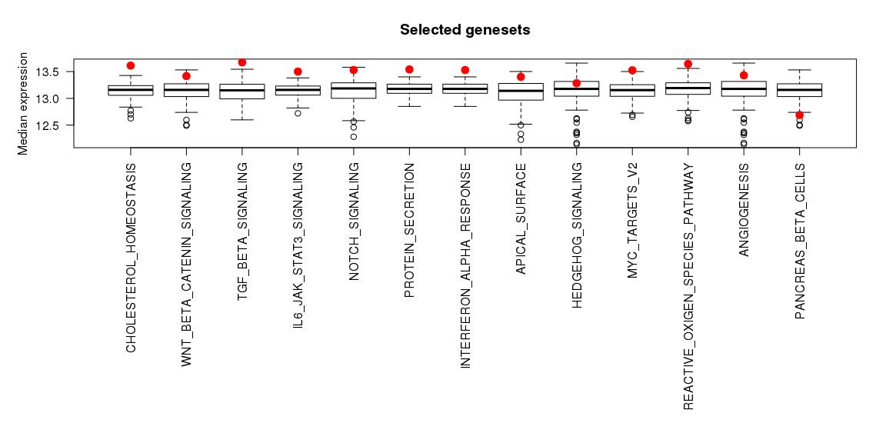

    ## [1] "54 samples have an associated group"

The fucntion returns a list of matrices with the aggregated data, which
we save in the `AggData.FC` variable.

    AggData.FC

    ## $mean
    ##                          normal    primary metastasized
    ## HYPOXIA               -1.757217  0.1445779    1.5785980
    ## G2M_CHECKPOINT        -2.395158  0.3438230    1.5702829
    ## E2F_TARGETS           -2.433854  0.5535342    1.5772392
    ## XENOBIOTIC_METABOLISM -2.938817 -1.0627398    3.8936887
    ## ANGIOGENESIS          -1.401274  0.2492051    1.3053128
    ## HEME_METABOLISM        2.177564 -1.6712380   -0.4589347
    ## KRAS_SIGNALING_UP      3.488294 -0.3843808   -3.4371667
    ## PANCREAS_BETA_CELLS    5.290600  0.3381962   -5.7489524
    ## 
    ## $sd
    ##                         normal  primary metastasized
    ## HYPOXIA               4.011373 4.332206     4.365263
    ## G2M_CHECKPOINT        2.163197 3.178354     1.929338
    ## E2F_TARGETS           1.488660 2.856401     1.701532
    ## XENOBIOTIC_METABOLISM 2.463468 2.467728     1.919900
    ## ANGIOGENESIS          3.705978 2.748504     1.352886
    ## HEME_METABOLISM       3.284550 3.193458     3.580726
    ## KRAS_SIGNALING_UP     4.000232 4.205250     3.315639
    ## PANCREAS_BETA_CELLS   1.835231 4.914703     4.879615

We can also look at underdispersed datasets. In this case we will also
look at the expression level and select only the genesets that are
significantly overexpressed (`MedType = "Over"`).

    AggData2.FC <- Plot.Genesets(RomaData = Data.FC,
                  Selected = SelectGeneSets(RomaData = Data.FC, VarThr = 5e-2,
                                            VarMode = "Wil", VarType = "Under",
                                            MedThr = 5e-3, MedMode = "Wil", MedType = "Over"),
                  GenesetMargin = 20, SampleMargin = 14, cluster_cols = FALSE,
                  GroupInfo = Type, AggByGroupsFL = c("mean", "sd"),
                  HMTite = "Underdispersed genesets (Fixed center)")

    ## [1] "Using genestes underdispersed according to Wilcoxon test. VarThr = 0.05"
    ## [1] "Using genestes overexpressed according to Wilcoxon test. MedThr = 0.005"
    ## [1] "38 geneset selected"

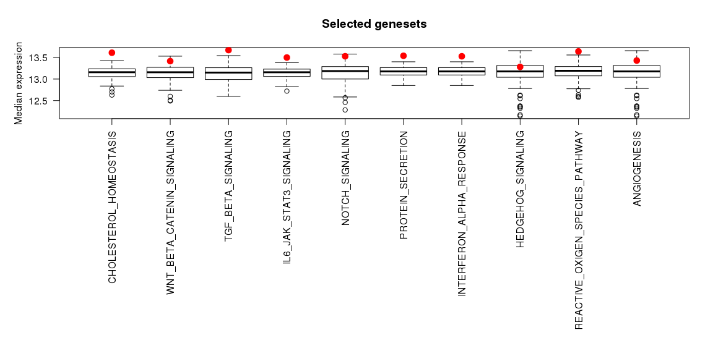

    ## [1] "54 samples have an associated group"

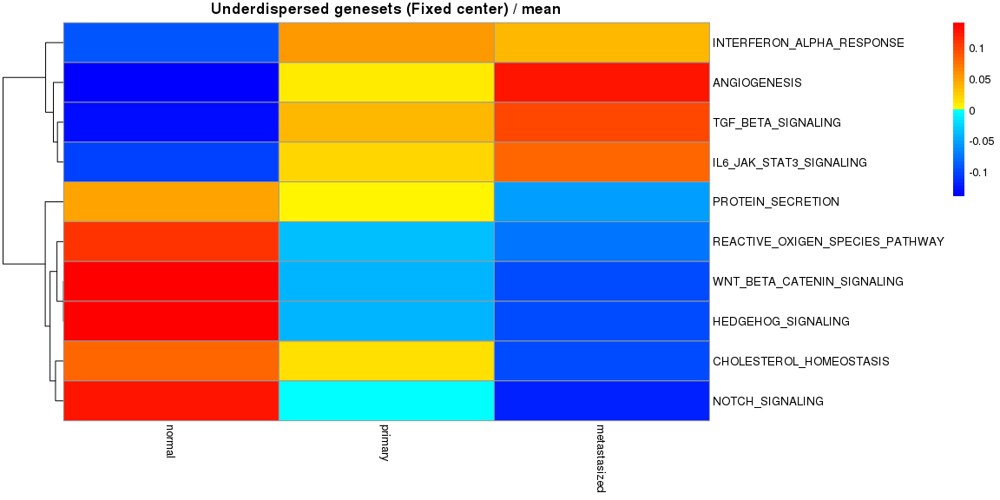

Statistical comparison across samples
-------------------------------------

Visual inspection already stresses the difference between the groups. It
is possible to quantify theses differnces performing statistical
testing:

    CompareAcrossSamples(RomaData = Data.FC,
                         Selected = SelectGeneSets(RomaData = Data.FC, VarThr = 5e-2,
                                                   VarMode = "Wil", VarType = "Over"),
                         Groups = Type)

    ## [1] "Using genestes overdispersed according to Wilcoxon test. VarThr = 0.05"
    ## [1] "No expression filter selected"
    ## [1] "8 geneset selected"
    ## [1] "Performing Type III AOV (R default)"
    ##              Df Sum Sq Mean Sq F value Pr(>F)
    ## Group         2      4   2.062   0.128   0.88
    ## Residuals   429   6919  16.128

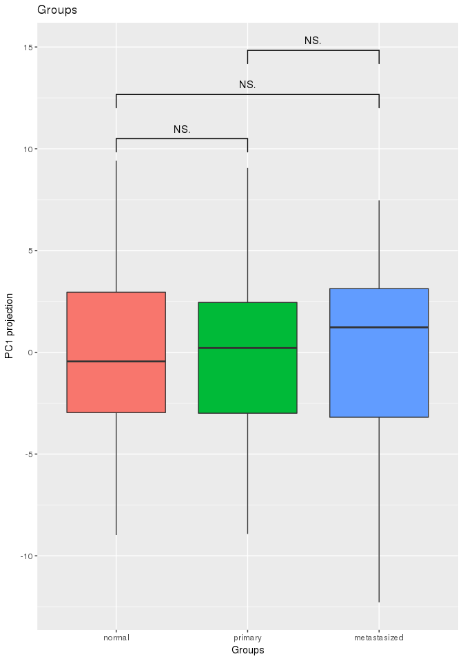

    ## [1] "Performing Type III AOV (R default)"
    ##                Df Sum Sq Mean Sq F value Pr(>F)    
    ## Group           2      4    2.06   0.195  0.823    
    ## Group:GeneSet  21   2593  123.46  11.644 <2e-16 ***
    ## Residuals     408   4326   10.60                   
    ## ---
    ## Signif. codes:  0 '***' 0.001 '**' 0.01 '*' 0.05 '.' 0.1 ' ' 1

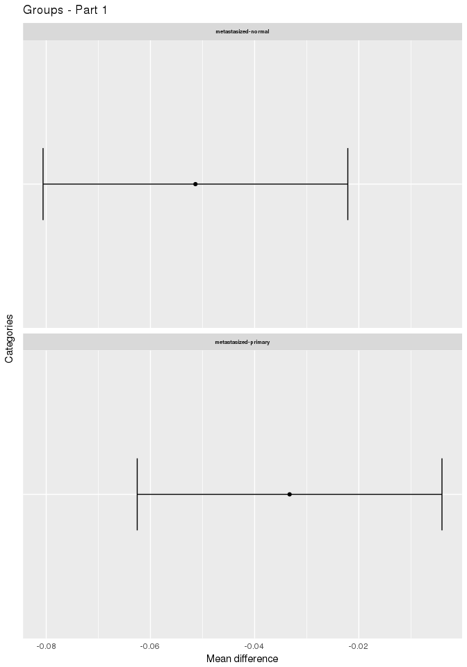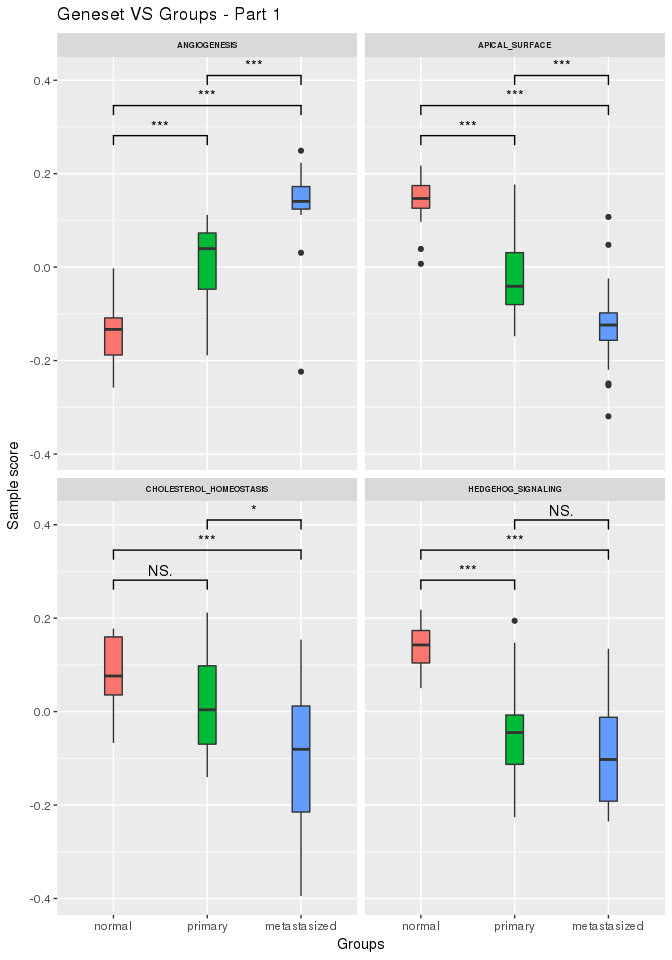

    ## [1] "A significant difference is observed across groups and metagenes"
    ## [1] "Calculating Tukey Honest Significant Differences"
    ## [1] "69 significant differences found"

Top contributing genes
----------------------

We can also explore the top contributing genes, i.e., the genes with the
largers weights in the selected modules:

    GeneMat <- GetTopContrib(Data.FC, Selected = SelectGeneSets(RomaData = Data.FC, VarThr = 1e-5,
                                            VarMode = "Wil", VarType = "Over"), nGenes = 6, OrderType = "Abs")

    ## [1] "Using genestes overdispersed according to Wilcoxon test. VarThr = 1e-05"
    ## [1] "No expression filter selected"

This allow us to quicky determine if a set of genes play a strong
(potentially opposite) role across different genesets. The function also
returns the matrix used to plot the heatmap.

Gene weights
------------

We can also explore the gene weigths with the fixed center

    PlotGeneWeight(RomaData = Data.FC, PlotGenes = 30,
                   ExpressionMatrix = MatData, LogExpression = FALSE,
                   Selected = SelectGeneSets(RomaData = Data.FC, VarThr = 5e-2,
                                             VarMode = "Wil", VarType = "Over"),
                   PlotWeigthSign = TRUE)

    ## [1] "Using genestes overdispersed according to Wilcoxon test. VarThr = 0.05"
    ## [1] "No expression filter selected"
    ## [1] "8 geneset selected"

Sample projections
------------------

Moreover, we can look at the projections of the samples with the fixed
center

    PlotSampleProjections(RomaData = Data.FC, PlotSamples = 30,
                          ExpressionMatrix = MatData, LogExpression = FALSE,
                          Selected = SelectGeneSets(RomaData = Data.FC, VarThr = 5e-3,
                                                    VarMode = "Wil", VarType = "Over"),
                          PlotPCProj = "none")

    ## [1] "Using genestes overdispersed according to Wilcoxon test. VarThr = 0.005"
    ## [1] "No expression filter selected"
    ## [1] "8 geneset selected"

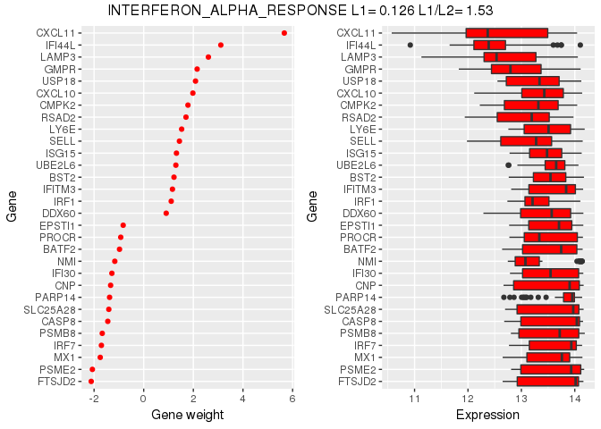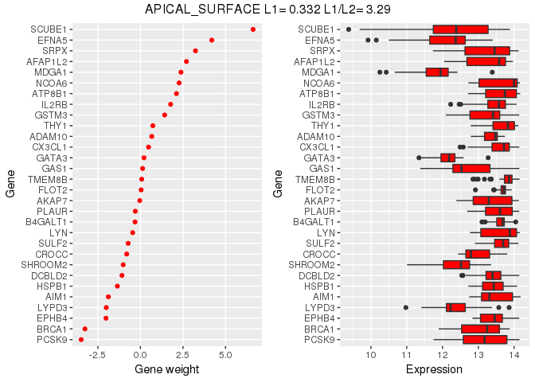

Recurrent genes
---------------

Finally, we can look at genes which appear across different genesests
and explore thier weithgs

    PlotRecurringGenes(RomaData = Data.FC,
                       Selected = SelectGeneSets(RomaData = Data.FC, VarThr = 5e-3,
                                                 VarMode = "Wil", VarType = "Over"),
                       GenesByGroup = 25, MinMult = 3)

    ## [1] "Using genestes overdispersed according to Wilcoxon test. VarThr = 0.005"
    ## [1] "No expression filter selected"
    ## [1] "8 geneset selected"

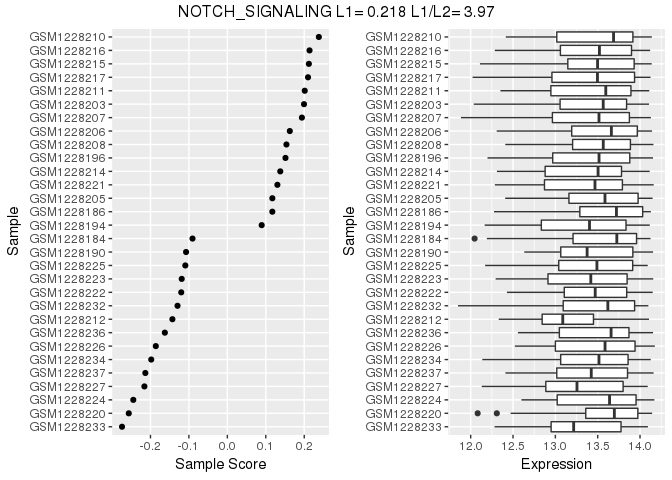

Looking at the details
----------------------

By default, rRoma will perform the appropiate anaysis without showing
all the details to the users. However, it is possible to obtain
additioanl graphical and textual information. This will results in a
large amount of inromation being derived an plotted. Hence, it is not
advisable to do that for large analysis. To show an example of the
extended information that can be produced, we will first obtain a
smaller module list.

    RedGMT <- SelectFromMSIGdb(SearchString = c("xenobiotic", "keg"), Mode = "ALL")

    ## [1] "Searching in MsigDB v6.0"
    ## [1] "The following genesets have been selected:"
    ## [1] "KEGG_METABOLISM_OF_XENOBIOTICS_BY_CYTOCHROME_P450 (70 genes)"

Wen perfoming ROMA we will now set `PlotData = TRUE` (to produce
diagnostic plots), `MoreInfo = TRUE` (to print additional diagnostic
information), and `FullSampleInfo = TRUE` (to compute and save
additional information on the samples). Note that rRoma will ask to
confim cetain choiches if R is run interactivelly.

    tictoc::tic()
    RedData.NFC <- rRoma.R(ExpressionMatrix = MatData, ModuleList = RedGMT, FixedCenter = FALSE,
                        UseParallel = TRUE, nCores = 8, ClusType = "FORK",
                        PCSignMode="CorrelateAllWeightsByGene", 
                        PlotData = TRUE, MoreInfo = TRUE, FullSampleInfo = TRUE,
                        Grouping = Type, GroupPCSign = FALSE)

    ## [1] "Centering gene expression over samples"
    ## [1] "Using local center (NOT centering over genes)"
    ## [1] "All the genesets will be used"
    ## [1] "2017-04-25 15:16:27 CEST"
    ## [1] "[1/1] Working on KEGG_METABOLISM_OF_XENOBIOTICS_BY_CYTOCHROME_P450 - http://www.broadinstitute.org/gsea/msigdb/cards/KEGG_METABOLISM_OF_XENOBIOTICS_BY_CYTOCHROME_P450"
    ## [1] "70 genes available for analysis"
    ## [1] "The following genes will be used:"
    ##  [1] "CYP2F1"  "CYP2E1"  "AKR1C4"  "EPHX1"   "CYP3A5"  "UGT2B28" "CYP3A4" 
    ##  [8] "GSTP1"   "GSTT2"   "GSTT1"   "AKR1C3"  "GSTZ1"   "CYP2C18" "ADH1B"  
    ## [15] "CYP2S1"  "ADH1C"   "ADH4"    "ADH5"    "GSTO1"   "ADH1A"   "GSTA5"  
    ## [22] "MGST2"   "MGST1"   "MGST3"   "GSTA3"   "GSTM1"   "UGT2B11" "CYP2C9" 
    ## [29] "GSTA4"   "CYP2C19" "GSTM4"   "CYP2C8"  "GSTM3"   "CYP2B6"  "GSTM2"  
    ## [36] "UGT2A3"  "UGT1A4"  "UGT1A1"  "CYP3A7"  "UGT1A3"  "GSTM5"   "UGT1A10"
    ## [43] "UGT1A8"  "UGT1A7"  "GSTA1"   "UGT1A6"  "GSTA2"   "ALDH3A1" "UGT1A5" 
    ## [50] "GSTK1"   "AKR1C2"  "AKR1C1"  "CYP1A1"  "ADH7"    "CYP1A2"  "CYP1B1" 
    ## [57] "ADH6"    "UGT2A1"  "ALDH1A3" "ALDH3B1" "ALDH3B2" "CYP3A43" "UGT1A9" 
    ## [64] "DHDH"    "GSTO2"   "UGT2B10" "UGT2B7"  "UGT2B4"  "UGT2B17" "UGT2B15"
    ## [1] "Detecting outliers using leave one out and median-absolute-deviations away from median (scater package)"

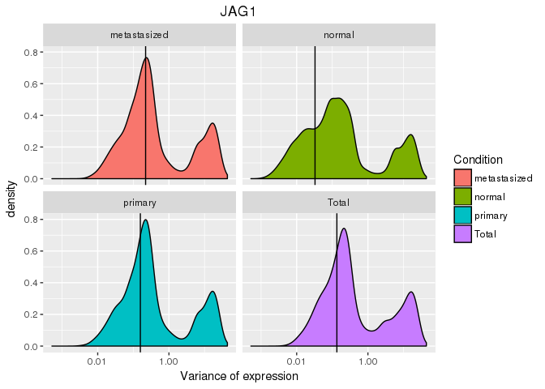

    ## [1] "19 gene(s) will be filtered:"
    ##  [1] "CYP2F1"  "AKR1C4"  "UGT2B28" "GSTT1"   "UGT2B11" "UGT1A4"  "UGT1A3" 
    ##  [8] "UGT1A8"  "UGT1A7"  "UGT1A5"  "CYP1A1"  "CYP1A2"  "UGT2A1"  "ALDH3B2"
    ## [15] "CYP3A43" "UGT1A9"  "DHDH"    "UGT2B4"  "UGT2B17"
    ## [1] "Not using weigths for PCA computation"
    ## [1] "Pre-filter data"
    ## [1] "L1 = 0.324847621722281 L1/L2 = 3.36077904254818"
    ## [1] "Median expression (uncentered): 12.7811547706959"
    ## [1] "Median expression (centered/weighted): 0.10923220260671"
    ## [1] "Post-filter data"
    ## [1] "L1 = 0.391959147712557 L1/L2 = 3.06919422461758"
    ## [1] "Median expression (uncentered): 13.2177305375661"
    ## [1] "Median expression (centered/weighted): 0.0819972157791584"
    ## [1] "Previous sample size: 0"
    ## [1] "Next sample size: 70"
    ## [1] "Computing samples"
    ##    user  system elapsed 
    ##   0.096   0.178   9.879

    ## [1] "Missing gene weights will be replaced by 1"
    ## [1] "Orienting PC by correlating gene expression and PC projections (pearson)"
    ## [1] "Not using groups"
    ## [1] "Computing correlations"
    ## [1] "Correcting using weights"
    ## [1] "Missing gene weights will be replaced by 1"
    ## [1] "Orienting PC by correlating gene expression and PC projections (pearson)"
    ## [1] "Not using groups"
    ## [1] "Computing correlations"
    ## [1] "Correcting using weights"
    ## [1] "Missing gene weights will be replaced by 1"
    ## [1] "Orienting PC by correlating gene expression and PC projections (pearson)"
    ## [1] "Not using groups"
    ## [1] "Computing correlations"
    ## [1] "Correcting using weights"

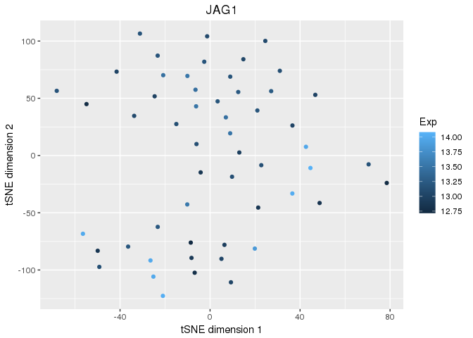

    ## [1] "Plotting expression VS projections"

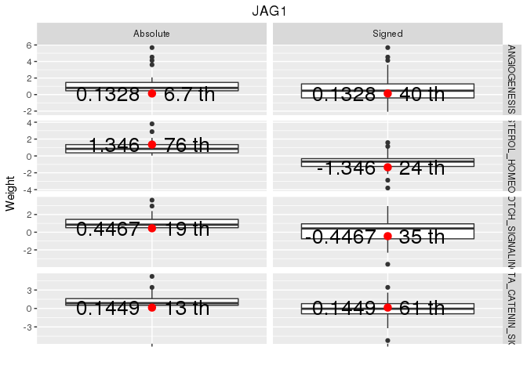

    ## [1] "Plotting correlations of expression VS projections"

    ## Warning in cor(x, y): l'cart type est nulle

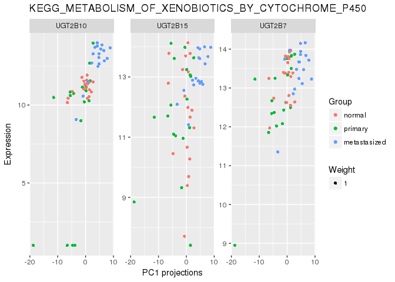

    ## Warning: Removed 1 rows containing missing values (geom_errorbar).

    ## Warning: Removed 1 rows containing missing values (geom_point).

    ## [1] "Plotting expression VS PC weigths"

    ## [1] "Plotting correlation of expression VS PC weigths"

    tictoc::toc()

    ## 26.892 sec elapsed

    PlotSampleProjections(RomaData = RedData.NFC, PlotSamples = 30,
                          ExpressionMatrix = MatData, LogExpression = FALSE,
                          Selected = NULL,
                          PlotPCProj = c('Points', 'Density',  'Bins'))

    ## [1] "1 geneset selected"

    ## Warning: Removed 18 rows containing missing values (geom_point).

    ## Warning: Removed 18 rows containing non-finite values (stat_density2d).

    ## Warning: Removed 18 rows containing non-finite values (stat_bin2d).

Using the interactive dashboards
--------------------------------

It is possible to explore interactivelly the results of the ananlysis
via two interactive dashboards:

    DashboardA(RomaData = Data.FC, Groups = Type, ExpMat = MatData)

and

    DashboardB(RomaData = Data.FC, Groups = Type)

Visualising on ACSN
-------------------

It is possible to project the results of rRoma analysis on a map. This
functionality is currently experimental. ACSN maps needs gene lists.
Therefore it is necessary to map the module activity to a gene specific
value. Since a gene can be associated with multiple modules, it is
possible to filter genes with a large variation in the gene weigths, as
this is associated with a larger variation, and hence uncertainlty, on
the contribution of the gene. The function takes several parameters:
`SampleName`, which indicates the name of the sample(s) to consider,
`AggScoreFun`, which describes the function used to group the module
scores when different samples are present, `FilterByWei`, which is a
parameters used to filter genes based on the variance of the gene weight
across modules, and `AggGeneFun`, which describes the function used to
obtain the value associated to a gene when the multiples weigths and
scores are present. The parameters `QTop`, `QBottom`, and `Steps`
control the heatmap of the plot. Finally, `DispMode` indicates which
quantities should be projected on the maps, the module score ("Module"),
or the gene weigths ("Gene").

In this example we will use the cell survival map and therefore we will
recompute ROMA using the associated GMT.

    tictoc::tic()
    Data.NFC.CS <- rRoma.R(ExpressionMatrix = MatData,
                           ModuleList = ReadGMTFile("http://acsn.curie.fr/files/survival_v1.1.gmt"),
                           FixedCenter = FALSE, MaxGenes = 500,
                           UseParallel = TRUE, nCores = 8, ClusType = "FORK",
                           PCSignMode="CorrelateAllWeightsByGene")

    ## Parsed with column specification:
    ## cols(
    ##   .default = col_character()
    ## )

    ## See spec(...) for full column specifications.

    ## Parsed with column specification:
    ## cols(
    ##   .default = col_character()
    ## )

    ## See spec(...) for full column specifications.

    ## Parsed with column specification:
    ## cols(
    ##   .default = col_character()
    ## )

    ## See spec(...) for full column specifications.

    ## Parsed with column specification:
    ## cols(
    ##   .default = col_character()
    ## )

    ## See spec(...) for full column specifications.

    ## Parsed with column specification:
    ## cols(
    ##   .default = col_character()
    ## )

    ## See spec(...) for full column specifications.

    ## Parsed with column specification:
    ## cols(
    ##   X = col_character()
    ## )

    ## [1] "The following genesets have been loaded and selected:"
    ## [1] "HEDGEHOG (281 genes)"          "MAPK (208 genes)"             
    ## [3] "PI3K_AKT_MTOR (296 genes)"     "WNT_CANONICAL (431 genes)"    
    ## [5] "WNT_NON_CANONICAL (425 genes)"
    ## [1] "Centering gene expression over samples"
    ## [1] "Using local center (NOT centering over genes)"
    ## [1] "All the genesets will be used"
    ## [1] "2017-04-25 15:17:05 CEST"
    ## [1] "[1/5] Working on MAPK - na"
    ## [1] "207 genes available for analysis"
    ## [1] "Detecting outliers using leave one out and median-absolute-deviations away from median (scater package)"
    ## [1] "17 gene(s) will be filtered:"
    ##  [1] "GRK1"  "GRK7"  "TCF15" "TCF23" "TCF24" "BCL2"  "GPR1"  "GPR6" 
    ##  [9] "GPR12" "GPR15" "GPR17" "GPR20" "PRKCB" "PRKCG" "ERBB4" "FLT3" 
    ## [17] "MMP13"
    ## [1] "Not using weigths for PCA computation"
    ## [1] "Pre-filter data"
    ## [1] "L1 = 0.272356623388721 L1/L2 = 2.12933935438316"
    ## [1] "Median expression (uncentered): 13.4653750856794"
    ## [1] "Median expression (centered/weighted): 0.0364940949992434"
    ## [1] "Post-filter data"
    ## [1] "L1 = 0.308532038175363 L1/L2 = 2.44906266395273"
    ## [1] "Median expression (uncentered): 13.5243580596037"
    ## [1] "Median expression (centered/weighted): 0.0341023905754732"
    ## [1] "Previous sample size: 0"
    ## [1] "Next sample size: 207"
    ## [1] "Computing samples"
    ##    user  system elapsed 
    ##   0.117   0.164  36.856 
    ## [1] "Missing gene weights will be replaced by 1"
    ## [1] "Orienting PC by correlating gene expression and PC projections (pearson)"
    ## [1] "Not using groups"
    ## [1] "Computing correlations"
    ## [1] "Correcting using weights"
    ## [1] "Missing gene weights will be replaced by 1"
    ## [1] "Orienting PC by correlating gene expression and PC projections (pearson)"
    ## [1] "Not using groups"
    ## [1] "Computing correlations"
    ## [1] "Correcting using weights"
    ## [1] "Missing gene weights will be replaced by 1"
    ## [1] "Orienting PC by correlating gene expression and PC projections (pearson)"
    ## [1] "Not using groups"
    ## [1] "Computing correlations"
    ## [1] "Correcting using weights"
    ## [1] "2017-04-25 15:17:44 CEST"
    ## [1] "[2/5] Working on HEDGEHOG - na"
    ## [1] "275 genes available for analysis"
    ## [1] "Detecting outliers using leave one out and median-absolute-deviations away from median (scater package)"
    ## [1] "28 gene(s) will be filtered:"
    ##  [1] "AKAP4"  "AKAP5"  "AKAP14" "GAS2"   "GPC5"   "GRK1"   "GRK7"  
    ##  [8] "GNG3"   "GNG4"   "GNG7"   "GNG8"   "GNG13"  "TCF15"  "TCF23" 
    ## [15] "TCF24"  "GNGT1"  "ARC"    "BCL2"   "FOXC2"  "FOXE1"  "FOXQ1" 
    ## [22] "NKX2-2" "PAX9"   "S100A7" "SFRP1"  "SIX1"   "SNAI1"  "HRK"   
    ## [1] "Not using weigths for PCA computation"
    ## [1] "Pre-filter data"
    ## [1] "L1 = 0.239363333828642 L1/L2 = 2.31207905299566"
    ## [1] "Median expression (uncentered): 13.382353827338"
    ## [1] "Median expression (centered/weighted): 0.0202799308952928"
    ## [1] "Post-filter data"
    ## [1] "L1 = 0.160857660690806 L1/L2 = 1.75047781401621"
    ## [1] "Median expression (uncentered): 13.4594315674689"
    ## [1] "Median expression (centered/weighted): 0.0225028382059111"
    ## [1] "Previous sample size: 207"
    ## [1] "Next sample size: 275"
    ## [1] "Computing samples"
    ##    user  system elapsed 
    ##   0.124   0.166  58.896 
    ## [1] "Missing gene weights will be replaced by 1"
    ## [1] "Orienting PC by correlating gene expression and PC projections (pearson)"
    ## [1] "Not using groups"
    ## [1] "Computing correlations"
    ## [1] "Correcting using weights"
    ## [1] "Missing gene weights will be replaced by 1"
    ## [1] "Orienting PC by correlating gene expression and PC projections (pearson)"
    ## [1] "Not using groups"
    ## [1] "Computing correlations"
    ## [1] "Correcting using weights"
    ## [1] "Missing gene weights will be replaced by 1"
    ## [1] "Orienting PC by correlating gene expression and PC projections (pearson)"
    ## [1] "Not using groups"
    ## [1] "Computing correlations"
    ## [1] "Correcting using weights"
    ## [1] "2017-04-25 15:18:46 CEST"
    ## [1] "[3/5] Working on PI3K_AKT_MTOR - na"
    ## [1] "293 genes available for analysis"
    ## [1] "Detecting outliers using leave one out and median-absolute-deviations away from median (scater package)"
    ## [1] "7 gene(s) will be filtered:"
    ## [1] "PRKCG"   "ERBB4"   "FLT3"    "EIF4E1B" "PPP3R2"  "PPP2R2C" "FASLG"  
    ## [1] "Not using weigths for PCA computation"
    ## [1] "Pre-filter data"
    ## [1] "L1 = 0.232218378608347 L1/L2 = 1.95407750611921"
    ## [1] "Median expression (uncentered): 13.5306501745991"
    ## [1] "Median expression (centered/weighted): 0.0212445487028692"
    ## [1] "Post-filter data"
    ## [1] "L1 = 0.204674888557722 L1/L2 = 2.5716859618024"
    ## [1] "Median expression (uncentered): 13.5487015183355"
    ## [1] "Median expression (centered/weighted): 0.020895886038816"
    ## [1] "Previous sample size: 275"
    ## [1] "Next sample size: 293"
    ## [1] "Computing samples"
    ##    user  system elapsed 
    ##   0.157   0.160  66.695 
    ## [1] "Missing gene weights will be replaced by 1"
    ## [1] "Orienting PC by correlating gene expression and PC projections (pearson)"
    ## [1] "Not using groups"
    ## [1] "Computing correlations"
    ## [1] "Correcting using weights"
    ## [1] "Missing gene weights will be replaced by 1"
    ## [1] "Orienting PC by correlating gene expression and PC projections (pearson)"
    ## [1] "Not using groups"
    ## [1] "Computing correlations"
    ## [1] "Correcting using weights"
    ## [1] "Missing gene weights will be replaced by 1"
    ## [1] "Orienting PC by correlating gene expression and PC projections (pearson)"
    ## [1] "Not using groups"
    ## [1] "Computing correlations"
    ## [1] "Correcting using weights"
    ## [1] "2017-04-25 15:19:57 CEST"
    ## [1] "[4/5] Working on WNT_NON_CANONICAL - na"
    ## [1] "412 genes available for analysis"
    ## [1] "Detecting outliers using leave one out and median-absolute-deviations away from median (scater package)"
    ## [1] "68 gene(s) will be filtered:"
    ##  [1] "CDH2"     "GNG3"     "GNG4"     "GNG7"     "GNG8"     "GNG13"   
    ##  [7] "GNGT1"    "MAPK4"    "MAPK10"   "PRKCB"    "PRKCG"    "ERBB4"   
    ## [13] "FLT3"     "PPP2R2C"  "PPP2R3A"  "ATP6V0D2" "FZD9"     "WNT1"    
    ## [19] "WNT2"     "WNT2B"    "WNT3"     "WNT3A"    "WNT5B"    "WNT6"    
    ## [25] "WNT7A"    "WNT7B"    "WNT8A"    "WNT8B"    "WNT9A"    "WNT9B"   
    ## [31] "WNT10B"   "WNT16"    "CTNND2"   "CTNNA2"   "CTNNA3"   "PRKAG3"  
    ## [37] "PRKAR2B"  "PRKAA2"   "PRKACG"   "ADCY2"    "ADCY5"    "ADCY8"   
    ## [43] "ADCY10"   "CAMK2A"   "CAMK2B"   "CAPN8"    "CAPN11"   "CAPN14"  
    ## [49] "CAPNS2"   "RSPO1"    "RSPO2"    "RSPO3"    "RSPO4"    "F2"      
    ## [55] "CASR"     "MEF2B"    "PPP3R2"   "TUBA3C"   "TUBA3D"   "TUBA3E"  
    ## [61] "ESR2"     "GATA1"    "GATA2"    "GATA4"    "GATA5"    "ACTA1"   
    ## [67] "SNAI1"    "IL2"     
    ## [1] "Not using weigths for PCA computation"
    ## [1] "Pre-filter data"
    ## [1] "L1 = 0.186860153257785 L1/L2 = 2.29958601053511"
    ## [1] "Median expression (uncentered): 13.3679607031876"
    ## [1] "Median expression (centered/weighted): 0.0365646440368517"
    ## [1] "Post-filter data"
    ## [1] "L1 = 0.154944841090472 L1/L2 = 1.77294425622784"
    ## [1] "Median expression (uncentered): 13.4977271172587"
    ## [1] "Median expression (centered/weighted): 0.0288109011789315"
    ## [1] "Previous sample size: 293"
    ## [1] "Next sample size: 412"
    ## [1] "Computing samples"
    ##    user  system elapsed 
    ##   0.171   0.186 128.780 
    ## [1] "Missing gene weights will be replaced by 1"
    ## [1] "Orienting PC by correlating gene expression and PC projections (pearson)"
    ## [1] "Not using groups"
    ## [1] "Computing correlations"
    ## [1] "Correcting using weights"
    ## [1] "Missing gene weights will be replaced by 1"
    ## [1] "Orienting PC by correlating gene expression and PC projections (pearson)"
    ## [1] "Not using groups"
    ## [1] "Computing correlations"
    ## [1] "Correcting using weights"
    ## [1] "Missing gene weights will be replaced by 1"
    ## [1] "Orienting PC by correlating gene expression and PC projections (pearson)"
    ## [1] "Not using groups"
    ## [1] "Computing correlations"
    ## [1] "Correcting using weights"
    ## [1] "2017-04-25 15:22:13 CEST"
    ## [1] "[5/5] Working on WNT_CANONICAL - na"
    ## [1] "420 genes available for analysis"
    ## [1] "Detecting outliers using leave one out and median-absolute-deviations away from median (scater package)"
    ## [1] "59 gene(s) will be filtered:"
    ##  [1] "TCF15"    "TCF23"    "TCF24"    "GNG3"     "GNG4"     "GNG7"    
    ##  [7] "GNG8"     "GNG13"    "GNGT1"    "ATP6V0D2" "DAB1"     "FZD9"    
    ## [13] "KLHL1"    "KLHL4"    "KLHL10"   "KLHL30"   "KLHL33"   "KLHL34"  
    ## [19] "KLHL35"   "KLHL38"   "HECW1"    "HECW2"    "PPP1R1A"  "PPP1R1C" 
    ## [25] "PPP1R17"  "PPP1R27"  "PPP1R36"  "PPP1R42"  "WNT1"     "WNT2"    
    ## [31] "WNT2B"    "WNT3"     "WNT3A"    "WNT5B"    "WNT6"     "WNT7A"   
    ## [37] "WNT7B"    "WNT8A"    "WNT8B"    "WNT9A"    "WNT9B"    "WNT10B"  
    ## [43] "WNT16"    "CTNND2"   "DKK1"     "KREMEN2"  "NKD1"     "RSPO1"   
    ## [49] "CTNNA2"   "CTNNA3"   "SIX3"     "PYGO1"    "PRKAG3"   "PRKAR2B" 
    ## [55] "PRKAA2"   "PRKACG"   "ACTA1"    "MIR34A"   "WIF1"    
    ## [1] "Not using weigths for PCA computation"
    ## [1] "Pre-filter data"
    ## [1] "L1 = 0.180229465059627 L1/L2 = 2.16790854203485"
    ## [1] "Median expression (uncentered): 13.3356694801966"
    ## [1] "Median expression (centered/weighted): 0.00857729655253436"
    ## [1] "Post-filter data"
    ## [1] "L1 = 0.170229862732015 L1/L2 = 2.17315215906912"
    ## [1] "Median expression (uncentered): 13.477252323938"
    ## [1] "Median expression (centered/weighted): 0.00396167735379649"
    ## [1] "Previous sample size: 412"
    ## [1] "Next sample size: 420"
    ## [1] "Reusing previous sampling (Comparable metagene size)"
    ## [1] "Missing gene weights will be replaced by 1"
    ## [1] "Orienting PC by correlating gene expression and PC projections (pearson)"
    ## [1] "Not using groups"
    ## [1] "Computing correlations"
    ## [1] "Correcting using weights"
    ## [1] "Missing gene weights will be replaced by 1"
    ## [1] "Orienting PC by correlating gene expression and PC projections (pearson)"
    ## [1] "Not using groups"
    ## [1] "Computing correlations"
    ## [1] "Correcting using weights"
    ## [1] "Missing gene weights will be replaced by 1"
    ## [1] "Orienting PC by correlating gene expression and PC projections (pearson)"
    ## [1] "Not using groups"
    ## [1] "Computing correlations"
    ## [1] "Correcting using weights"

    tictoc::toc()

    ## 316.981 sec elapsed

We can now project the information obtained by using the following
commands, which will open a windows in the default browser to visualize
the map.

    PlotOnACSN(RomaData = Data.NFC.CS, SampleName = names(Type[Type == "normal"]),
               AggScoreFun = "median", FilterByWei = 30, 
               DispMode = c("Module", "Gene"), DataName = "Normal", 
               QTop = .99, QBottom = .1, Steps = 5, 
               Selected = NULL,
               MapURL = 'https://acsn.curie.fr/navicell/maps/survival/master/index.php',
               AggGeneFun = "median")

    ## [1] "18 sample(s) selected"
    ## [1] "5 geneset selected"

    ## [1] "The following genes will be ignored:"
    ##  [1] "CDH2"    "CSNK2A2" "FGFR1"   "GAB1"    "GSK3B"   "PIK3CD"  "PIK3CG" 
    ##  [8] "PPP2R2B" "PPP2R3B" "PPP2R5E" "PPP3CA"  "PPP3CB"  "PRKCE"   "RPS6KA5"
    ## [15] "RPS6KA6" "RUNX2"   "SOS2"    "UBE3D"

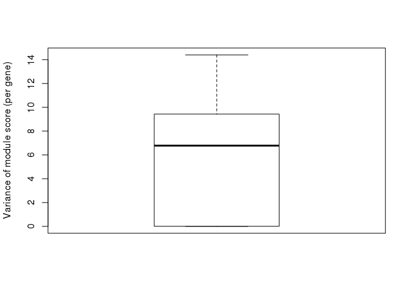

    ## [1] "User-defined url"

    ## waiting for data to be imported...

    ## data imported.

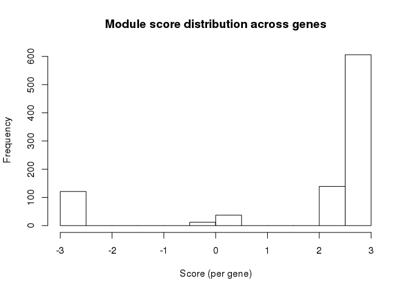

    ## [1] "User-defined url"

    ## waiting for data to be imported...
    ## data imported.

    PlotOnACSN(RomaData = Data.NFC.CS, SampleName = names(Type[Type == "metastasized"]),
               AggScoreFun = "median", FilterByWei = 30, 
               DispMode = "Module", DataName = "Metastasized", 
               QTop = .99, QBottom = .1, Steps = 5, 
               Selected = NULL,
               MapURL = 'https://acsn.curie.fr/navicell/maps/survival/master/index.php',
               AggGeneFun = "median")

    ## [1] "18 sample(s) selected"
    ## [1] "5 geneset selected"

    ## [1] "The following genes will be ignored:"
    ##  [1] "CDH2"    "CSNK2A2" "FGFR1"   "GAB1"    "GSK3B"   "PIK3CD"  "PIK3CG" 
    ##  [8] "PPP2R2B" "PPP2R3B" "PPP2R5E" "PPP3CA"  "PPP3CB"  "PRKCE"   "RPS6KA5"
    ## [15] "RPS6KA6" "RUNX2"   "SOS2"    "UBE3D"

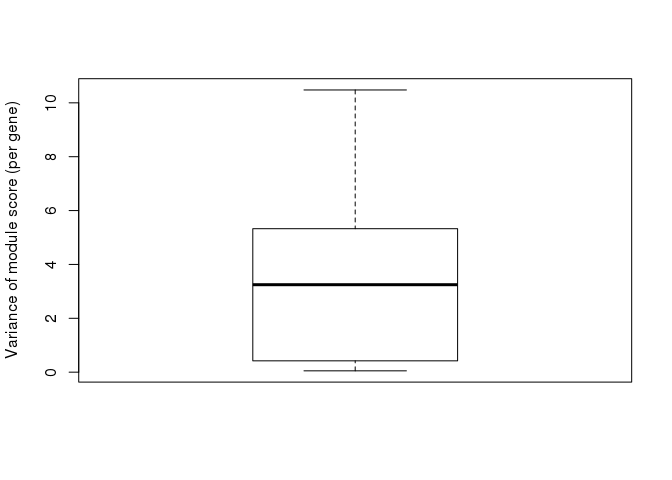

    ## [1] "User-defined url"

    ## waiting for data to be imported...

    ## data imported.

