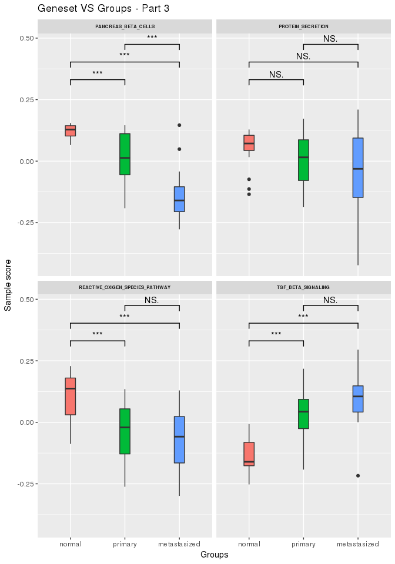
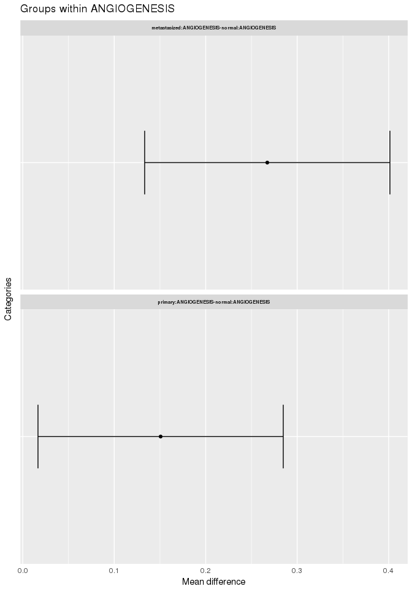
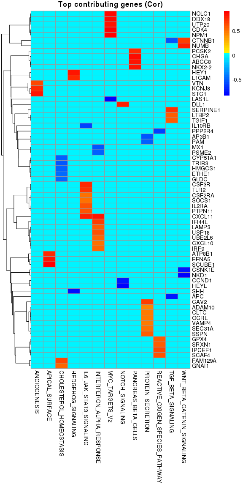
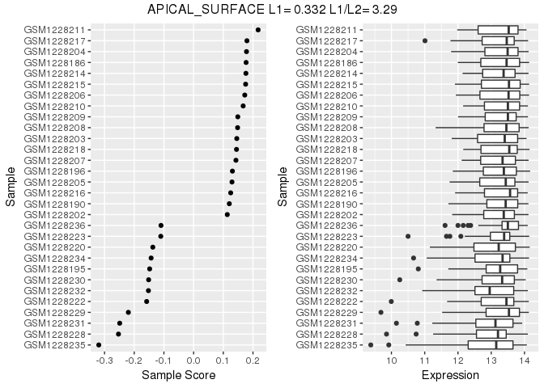
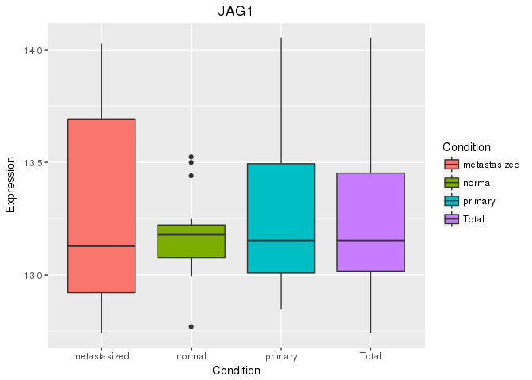
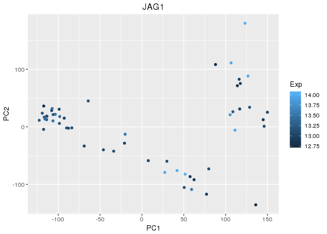
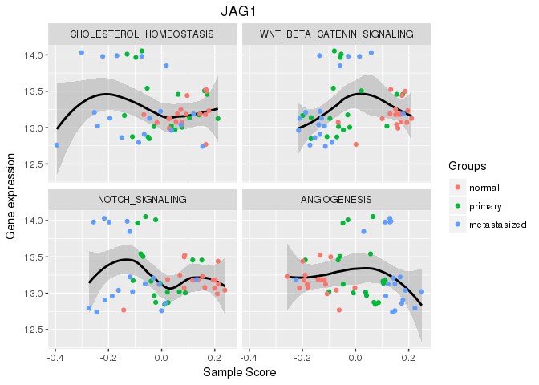
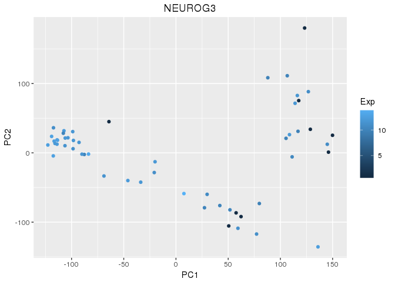

-   [Intalling rROMA](#intalling-rroma)
-   [Using rROMA](#using-rroma)
-   [An example](#an-example)
    -   [Getting the dataset](#getting-the-dataset)
    -   [Performing ROMA](#performing-roma)
    -   [Module activity](#module-activity)
    -   [Statistical comparison across
        samples](#statistical-comparison-across-samples)
    -   [Top contributing genes](#top-contributing-genes)
    -   [Gene weights](#gene-weights)
    -   [Sample projections](#sample-projections)
    -   [Recurrent genes](#recurrent-genes)
    -   [Looking at the details](#looking-at-the-details)
    -   [Visualising on ACSN](#visualising-on-acsn)

This package provides an R implementation of
[ROMA](http://journal.frontiersin.org/article/10.3389/fgene.2016.00018/full).
The package is under active development and is currently being tested.

A Java implementation developed by Andrei Zynovyev and is also
[available](https://github.com/sysbio-curie/Roma).

Intalling rROMA
===============

The rRoma package relies on the `scater` package, which is available
only on BioConductor. This package can be installed with the following
command

    if(!require("devtools")){
      source("https://bioconductor.org/biocLite.R")
      biocLite("scater")
    }

    ## Loading required package: devtools

rRoma can then be installed using `devtools`

    if(!require("devtools")){
      install.packages("devtools")
    }
    devtools::install_github("Albluca/rROMA")

To fill missing values rRoma uses the mice package. This package needs
to be installed manually if datasets with missing values need to be
analysed:

    install.packages("tictoc")

Finally, rRoma allow projecting the results of the analysis on [ACSN
maps](https://acsn.curie.fr). To use this functionality it is necessary
to install the `RNaviCell` package:

    if(!require("devtools")){
      install.packages("devtools")
    }
    devtools::install_github("sysbio-curie/RNaviCell")

The packages `GEOquery`, `tictoc`, and `readr` are not required to run
rRoma, but are used in the following example and need to be installed to
reproduce the analysis

    if(!require("GEOquery")){
      source("https://bioconductor.org/biocLite.R")
      biocLite("GEOquery")
    }

    ## Loading required package: GEOquery

    ## Loading required package: Biobase

    ## Loading required package: BiocGenerics

    ## Loading required package: parallel

    ## 
    ## Attaching package: 'BiocGenerics'

    ## The following objects are masked from 'package:parallel':
    ## 
    ##     clusterApply, clusterApplyLB, clusterCall, clusterEvalQ,
    ##     clusterExport, clusterMap, parApply, parCapply, parLapply,
    ##     parLapplyLB, parRapply, parSapply, parSapplyLB

    ## The following objects are masked from 'package:stats':
    ## 
    ##     IQR, mad, xtabs

    ## The following objects are masked from 'package:base':
    ## 
    ##     anyDuplicated, append, as.data.frame, cbind, colnames,
    ##     do.call, duplicated, eval, evalq, Filter, Find, get, grep,
    ##     grepl, intersect, is.unsorted, lapply, lengths, Map, mapply,
    ##     match, mget, order, paste, pmax, pmax.int, pmin, pmin.int,
    ##     Position, rank, rbind, Reduce, rownames, sapply, setdiff,
    ##     sort, table, tapply, union, unique, unsplit, which, which.max,
    ##     which.min

    ## Welcome to Bioconductor
    ## 
    ##     Vignettes contain introductory material; view with
    ##     'browseVignettes()'. To cite Bioconductor, see
    ##     'citation("Biobase")', and for packages 'citation("pkgname")'.

    ## Setting options('download.file.method.GEOquery'='auto')

    ## Setting options('GEOquery.inmemory.gpl'=FALSE)

    if(!require("readr")){
      install.packages("readr")
    }

    ## Loading required package: readr

    if(!require("tictoc")){
      install.packages("tictoc")
    }

    ## Loading required package: tictoc

Using rROMA
===========

The package can be loaded with the usual syntax, i.e., by typing

    library(rRoma)

rRoma requires a gene expression matrix - with column names indicating
samples and row names indicating gene names - and a module file
containing information on the genesets that need to be evaluated. The
module file can be loaded from a GMT file. Functions to automate the
generation of then GMT file are also available.

Various functions are then available to explore the analysis, including
plotting and statistical cross sample analysis.

An example
==========

To show a concrete example of rROMA we will use a dataset available on
GEO.

Getting the dataset
-------------------

Let us begin by getting the description of the dataset

    library(GEOquery)
    gse <- getGEO("GSE50760", GSEMatrix = TRUE)

    ## https://ftp.ncbi.nlm.nih.gov/geo/series/GSE50nnn/GSE50760/matrix/

    ## OK

    ## Found 1 file(s)

    ## GSE50760_series_matrix.txt.gz

    ## File stored at:

    ## /tmp/RtmpHqTJ8n/GPL11154.soft

Then we get the actual expression expression files

    filePaths = getGEOSuppFiles("GSE50760")

    ## https://ftp.ncbi.nlm.nih.gov/geo/series/GSE50nnn/GSE50760/suppl/

    ## OK

Now we can construct the expression matrix. Note that the code below is
designed to work on a Unix-like environment (e.g. MacOS). The execution
on a Windows environment may require replacing `"/"` with `"\"`.

    library(readr)
    Content <- untar(row.names(filePaths)[1], list = TRUE)
    untar(row.names(filePaths)[1], list = FALSE)

    MatData <- NULL

    for(i in 1:length(Content)){
      Exp <- read_delim(Content[i], "\t", escape_double = FALSE, trim_ws = TRUE)
      
      if(is.null(MatData)){
        MatData <- cbind(unlist(Exp[,1]), unlist(Exp[,2]))
      } else {
        if(any(MatData[,1] != unlist(Exp[,1]))){
          stop("Incompatible samples")
        }
        MatData <- cbind(MatData, unlist(Exp[,2]))
      }
      
      file.remove(Content[i])
      
    }

    ## Parsed with column specification:
    ## cols(
    ##   genes = col_character(),
    ##   AMC_2.1_FPKM = col_double()
    ## )

    ## Parsed with column specification:
    ## cols(
    ##   genes = col_character(),
    ##   AMC_3.1_FPKM = col_double()
    ## )

    ## Parsed with column specification:
    ## cols(
    ##   genes = col_character(),
    ##   AMC_5.1_FPKM = col_double()
    ## )

    ## Parsed with column specification:
    ## cols(
    ##   genes = col_character(),
    ##   AMC_6.1_FPKM = col_double()
    ## )

    ## Parsed with column specification:
    ## cols(
    ##   genes = col_character(),
    ##   AMC_7.1_FPKM = col_double()
    ## )

    ## Parsed with column specification:
    ## cols(
    ##   genes = col_character(),
    ##   AMC_8.1_FPKM = col_double()
    ## )

    ## Parsed with column specification:
    ## cols(
    ##   genes = col_character(),
    ##   AMC_9.1_FPKM = col_double()
    ## )

    ## Parsed with column specification:
    ## cols(
    ##   genes = col_character(),
    ##   AMC_10.1_FPKM = col_double()
    ## )

    ## Parsed with column specification:
    ## cols(
    ##   genes = col_character(),
    ##   AMC_12.1_FPKM = col_double()
    ## )

    ## Parsed with column specification:
    ## cols(
    ##   genes = col_character(),
    ##   AMC_13.1_FPKM = col_double()
    ## )

    ## Parsed with column specification:
    ## cols(
    ##   genes = col_character(),
    ##   AMC_17.1_FPKM = col_double()
    ## )

    ## Parsed with column specification:
    ## cols(
    ##   genes = col_character(),
    ##   AMC_18.1_FPKM = col_double()
    ## )

    ## Parsed with column specification:
    ## cols(
    ##   genes = col_character(),
    ##   AMC_19.1_FPKM = col_double()
    ## )

    ## Parsed with column specification:
    ## cols(
    ##   genes = col_character(),
    ##   AMC_20.1_FPKM = col_double()
    ## )

    ## Parsed with column specification:
    ## cols(
    ##   genes = col_character(),
    ##   AMC_21.1_FPKM = col_double()
    ## )

    ## Parsed with column specification:
    ## cols(
    ##   genes = col_character(),
    ##   AMC_22.1_FPKM = col_double()
    ## )

    ## Parsed with column specification:
    ## cols(
    ##   genes = col_character(),
    ##   AMC_23.1_FPKM = col_double()
    ## )

    ## Parsed with column specification:
    ## cols(
    ##   genes = col_character(),
    ##   AMC_24.1_FPKM = col_double()
    ## )

    ## Parsed with column specification:
    ## cols(
    ##   genes = col_character(),
    ##   AMC_2.2_FPKM = col_double()
    ## )

    ## Parsed with column specification:
    ## cols(
    ##   genes = col_character(),
    ##   AMC_3.2_FPKM = col_double()
    ## )

    ## Parsed with column specification:
    ## cols(
    ##   genes = col_character(),
    ##   AMC_5.2_FPKM = col_double()
    ## )

    ## Parsed with column specification:
    ## cols(
    ##   genes = col_character(),
    ##   AMC_6.2_FPKM = col_double()
    ## )

    ## Parsed with column specification:
    ## cols(
    ##   genes = col_character(),
    ##   AMC_7.2_FPKM = col_double()
    ## )

    ## Parsed with column specification:
    ## cols(
    ##   genes = col_character(),
    ##   AMC_8.2_FPKM = col_double()
    ## )

    ## Parsed with column specification:
    ## cols(
    ##   genes = col_character(),
    ##   AMC_9.2_FPKM = col_double()
    ## )

    ## Parsed with column specification:
    ## cols(
    ##   genes = col_character(),
    ##   AMC_10.2_FPKM = col_double()
    ## )

    ## Parsed with column specification:
    ## cols(
    ##   genes = col_character(),
    ##   AMC_12.2_FPKM = col_double()
    ## )

    ## Parsed with column specification:
    ## cols(
    ##   genes = col_character(),
    ##   AMC_13.2_FPKM = col_double()
    ## )

    ## Parsed with column specification:
    ## cols(
    ##   genes = col_character(),
    ##   AMC_17.2_FPKM = col_double()
    ## )

    ## Parsed with column specification:
    ## cols(
    ##   genes = col_character(),
    ##   AMC_18.2_FPKM = col_double()
    ## )

    ## Parsed with column specification:
    ## cols(
    ##   genes = col_character(),
    ##   AMC_19.2_FPKM = col_double()
    ## )

    ## Parsed with column specification:
    ## cols(
    ##   genes = col_character(),
    ##   AMC_20.2_FPKM = col_double()
    ## )

    ## Parsed with column specification:
    ## cols(
    ##   genes = col_character(),
    ##   AMC_21.2_FPKM = col_double()
    ## )

    ## Parsed with column specification:
    ## cols(
    ##   genes = col_character(),
    ##   AMC_22.2_FPKM = col_double()
    ## )

    ## Parsed with column specification:
    ## cols(
    ##   genes = col_character(),
    ##   AMC_23.2_FPKM = col_double()
    ## )

    ## Parsed with column specification:
    ## cols(
    ##   genes = col_character(),
    ##   AMC_24.2_FPKM = col_double()
    ## )

    ## Parsed with column specification:
    ## cols(
    ##   genes = col_character(),
    ##   AMC_2.3_FPKM = col_double()
    ## )

    ## Parsed with column specification:
    ## cols(
    ##   genes = col_character(),
    ##   AMC_3.3_FPKM = col_double()
    ## )

    ## Parsed with column specification:
    ## cols(
    ##   genes = col_character(),
    ##   AMC_5.3_FPKM = col_double()
    ## )

    ## Parsed with column specification:
    ## cols(
    ##   genes = col_character(),
    ##   AMC_6.3_FPKM = col_double()
    ## )

    ## Parsed with column specification:
    ## cols(
    ##   genes = col_character(),
    ##   AMC_7.3_FPKM = col_double()
    ## )

    ## Parsed with column specification:
    ## cols(
    ##   genes = col_character(),
    ##   AMC_8.3_FPKM = col_double()
    ## )

    ## Parsed with column specification:
    ## cols(
    ##   genes = col_character(),
    ##   AMC_9.3_FPKM = col_double()
    ## )

    ## Parsed with column specification:
    ## cols(
    ##   genes = col_character(),
    ##   AMC_10.3_FPKM = col_double()
    ## )

    ## Parsed with column specification:
    ## cols(
    ##   genes = col_character(),
    ##   AMC_12.3_FPKM = col_double()
    ## )

    ## Parsed with column specification:
    ## cols(
    ##   genes = col_character(),
    ##   AMC_13.3_FPKM = col_double()
    ## )

    ## Parsed with column specification:
    ## cols(
    ##   genes = col_character(),
    ##   AMC_17.3_FPKM = col_double()
    ## )

    ## Parsed with column specification:
    ## cols(
    ##   genes = col_character(),
    ##   AMC_18.3_FPKM = col_double()
    ## )

    ## Parsed with column specification:
    ## cols(
    ##   genes = col_character(),
    ##   AMC_19.3_FPKM = col_double()
    ## )

    ## Parsed with column specification:
    ## cols(
    ##   genes = col_character(),
    ##   AMC_20.3_FPKM = col_double()
    ## )

    ## Parsed with column specification:
    ## cols(
    ##   genes = col_character(),
    ##   AMC_21.3_FPKM = col_double()
    ## )

    ## Parsed with column specification:
    ## cols(
    ##   genes = col_character(),
    ##   AMC_22.3_FPKM = col_double()
    ## )

    ## Parsed with column specification:
    ## cols(
    ##   genes = col_character(),
    ##   AMC_23.3_FPKM = col_double()
    ## )

    ## Parsed with column specification:
    ## cols(
    ##   genes = col_character(),
    ##   AMC_24.3_FPKM = col_double()
    ## )

    SplitPath <- unlist(strsplit(rownames(filePaths)[1], "/"))
    SplitPath <- SplitPath[-length(SplitPath)]
    unlink(x = paste(SplitPath, collapse = "/"), recursive = TRUE)

    Genes <- MatData[,1]
    MatData <- data.matrix(data.frame(MatData[,-1]))
    rownames(MatData) <- Genes
    colnames(MatData) <- unlist(lapply(strsplit(Content, "_"), "[[", 1))

And look at the different groups of cells present

    Type <- as.character(gse$GSE50760_series_matrix.txt.gz[[1]])
    Type <- unlist(lapply(strsplit(Type, " "), "[[", 1))
    names(Type) = as.character(gse$GSE50760_series_matrix.txt.gz[[2]])

    table(Type)

    ## Type
    ## metastasized       normal      primary 
    ##           18           18           18

For convenience, we will transform `Type` into a factor:

    Type <- factor(Type, levels = c("normal", "primary", "metastasized"))

This will allow plotting functions, such as `Plot.Genesets`, to use more
meaningful ordering when reporting information.

### Selecting the module list

At this point we can create the metagene files. We will extract all the
"HALLMARK" geneset from MSig. We will also remove "HALLMARK\_" from the
names to simplify the graphical representation.

    AllHall <- SelectFromMSIGdb("HALLMARK")

    ## [1] "Searching in MsigDB v6.0"
    ## [1] "The following genesets have been selected:"
    ##  [1] "HALLMARK_TNFA_SIGNALING_VIA_NFKB (200 genes)"          
    ##  [2] "HALLMARK_HYPOXIA (200 genes)"                          
    ##  [3] "HALLMARK_CHOLESTEROL_HOMEOSTASIS (74 genes)"           
    ##  [4] "HALLMARK_MITOTIC_SPINDLE (200 genes)"                  
    ##  [5] "HALLMARK_WNT_BETA_CATENIN_SIGNALING (42 genes)"        
    ##  [6] "HALLMARK_TGF_BETA_SIGNALING (54 genes)"                
    ##  [7] "HALLMARK_IL6_JAK_STAT3_SIGNALING (87 genes)"           
    ##  [8] "HALLMARK_DNA_REPAIR (150 genes)"                       
    ##  [9] "HALLMARK_G2M_CHECKPOINT (200 genes)"                   
    ## [10] "HALLMARK_APOPTOSIS (161 genes)"                        
    ## [11] "HALLMARK_NOTCH_SIGNALING (32 genes)"                   
    ## [12] "HALLMARK_ADIPOGENESIS (200 genes)"                     
    ## [13] "HALLMARK_ESTROGEN_RESPONSE_EARLY (200 genes)"          
    ## [14] "HALLMARK_ESTROGEN_RESPONSE_LATE (200 genes)"           
    ## [15] "HALLMARK_ANDROGEN_RESPONSE (101 genes)"                
    ## [16] "HALLMARK_MYOGENESIS (200 genes)"                       
    ## [17] "HALLMARK_PROTEIN_SECRETION (96 genes)"                 
    ## [18] "HALLMARK_INTERFERON_ALPHA_RESPONSE (97 genes)"         
    ## [19] "HALLMARK_INTERFERON_GAMMA_RESPONSE (200 genes)"        
    ## [20] "HALLMARK_APICAL_JUNCTION (200 genes)"                  
    ## [21] "HALLMARK_APICAL_SURFACE (44 genes)"                    
    ## [22] "HALLMARK_HEDGEHOG_SIGNALING (36 genes)"                
    ## [23] "HALLMARK_COMPLEMENT (200 genes)"                       
    ## [24] "HALLMARK_UNFOLDED_PROTEIN_RESPONSE (113 genes)"        
    ## [25] "HALLMARK_PI3K_AKT_MTOR_SIGNALING (105 genes)"          
    ## [26] "HALLMARK_MTORC1_SIGNALING (200 genes)"                 
    ## [27] "HALLMARK_E2F_TARGETS (200 genes)"                      
    ## [28] "HALLMARK_MYC_TARGETS_V1 (200 genes)"                   
    ## [29] "HALLMARK_MYC_TARGETS_V2 (58 genes)"                    
    ## [30] "HALLMARK_EPITHELIAL_MESENCHYMAL_TRANSITION (200 genes)"
    ## [31] "HALLMARK_INFLAMMATORY_RESPONSE (200 genes)"            
    ## [32] "HALLMARK_XENOBIOTIC_METABOLISM (200 genes)"            
    ## [33] "HALLMARK_FATTY_ACID_METABOLISM (158 genes)"            
    ## [34] "HALLMARK_OXIDATIVE_PHOSPHORYLATION (200 genes)"        
    ## [35] "HALLMARK_GLYCOLYSIS (200 genes)"                       
    ## [36] "HALLMARK_REACTIVE_OXIGEN_SPECIES_PATHWAY (49 genes)"   
    ## [37] "HALLMARK_P53_PATHWAY (200 genes)"                      
    ## [38] "HALLMARK_UV_RESPONSE_UP (158 genes)"                   
    ## [39] "HALLMARK_UV_RESPONSE_DN (144 genes)"                   
    ## [40] "HALLMARK_ANGIOGENESIS (36 genes)"                      
    ## [41] "HALLMARK_HEME_METABOLISM (200 genes)"                  
    ## [42] "HALLMARK_COAGULATION (138 genes)"                      
    ## [43] "HALLMARK_IL2_STAT5_SIGNALING (200 genes)"              
    ## [44] "HALLMARK_BILE_ACID_METABOLISM (112 genes)"             
    ## [45] "HALLMARK_PEROXISOME (104 genes)"                       
    ## [46] "HALLMARK_ALLOGRAFT_REJECTION (200 genes)"              
    ## [47] "HALLMARK_SPERMATOGENESIS (135 genes)"                  
    ## [48] "HALLMARK_KRAS_SIGNALING_UP (200 genes)"                
    ## [49] "HALLMARK_KRAS_SIGNALING_DN (200 genes)"                
    ## [50] "HALLMARK_PANCREAS_BETA_CELLS (40 genes)"

    AllHall <- lapply(AllHall, function(x){
      x$Name <- sub("HALLMARK_", "", x$Name)
      x
    })

Performing ROMA
---------------

To reduce potential problems we will remove genes with a duplicated name

    if(any(duplicated(rownames(MatData)))){
      MatData <- MatData[!(rownames(MatData) %in% rownames(MatData)[duplicated(rownames(MatData))]), ]
    }

Moreover, we will use pseudocount transformation to boost the normality
of the data

    MatData <- log2(MatData + 1)

And now we are ready to perform ROMA by using the `rRoma.R` function.
The function has a number of parameters that can be used to control its
behaviour, but can be run with a minimal set of input: the expression
matrix (ExpressionMatrix) and the module list (ModuleList). In the
following example we will also used `FixedCenter` (which control if PCA
with fuixed center should be used), `UseParallel` (which control if the
computation should be done in parallel, analyzsis with fuixed center
should be used), `nCores` (the number of cores to use), and `ClusType`
(the type of parallel environment to use). We will also use a PC
orientation mode that will try to correlates gene expression level and
module score (`PCSignMode="CorrelateAllWeightsByGene"`). Other
parameters are described in the fucntion manual.

To perform ROMA fixed center in parallel, by using 8 cores, it is
sufficient write:

    tictoc::tic()
    Data.FC <- rRoma.R(ExpressionMatrix = MatData, ModuleList = AllHall, FixedCenter = TRUE,
                       UseParallel = TRUE, nCores = 8, ClusType = "FORK",
                       PCSignMode="CorrelateAllWeightsByGene")

    ## [1] "Centering gene expression over samples"
    ## [1] "Using global center (centering over genes)"
    ## [1] "All the genesets will be used"
    ## [1] "2017-04-20 09:12:39 CEST"
    ## [1] "[1/50] Working on NOTCH_SIGNALING - http://www.broadinstitute.org/gsea/msigdb/cards/HALLMARK_NOTCH_SIGNALING"
    ## [1] "32 genes available for analysis"
    ## [1] "Detecting outliers using leave one out and median-absolute-deviations away from median (scater package)"
    ## [1] "1 gene(s) will be filtered:"
    ## [1] "WNT2"
    ## [1] "Not using weigths for PCA computation"
    ## [1] "Pre-filter data"
    ## [1] "L1 = 0.7729627544363 L1/L2 = 20.4674907313449"
    ## [1] "Median expression (uncentered): 13.5150221827314"
    ## [1] "Median expression (centered/weighted): 0.0288003550423865"
    ## [1] "Post-filter data"
    ## [1] "L1 = 0.19780208002591 L1/L2 = 1.53191768525981"
    ## [1] "Median expression (uncentered): 13.5291252684908"
    ## [1] "Median expression (centered/weighted): 0.0230072380009256"
    ## [1] "Previous sample size: 0"
    ## [1] "Next sample size: 32"
    ## [1] "Computing samples"
    ##    user  system elapsed 
    ##   0.092   0.166   8.108 
    ## [1] "Missing gene weights will be replaced by 1"
    ## [1] "Orienting PC by correlating gene expression and PC projections (pearson)"
    ## [1] "Not using groups"
    ## [1] "Computing correlations"
    ## [1] "Correcting using weights"
    ## [1] "Missing gene weights will be replaced by 1"
    ## [1] "Orienting PC by correlating gene expression and PC projections (pearson)"
    ## [1] "Not using groups"
    ## [1] "Computing correlations"
    ## [1] "Correcting using weights"
    ## [1] "Missing gene weights will be replaced by 1"
    ## [1] "Orienting PC by correlating gene expression and PC projections (pearson)"
    ## [1] "Not using groups"
    ## [1] "Computing correlations"
    ## [1] "Correcting using weights"
    ## [1] "2017-04-20 09:12:52 CEST"
    ## [1] "[2/50] Working on HEDGEHOG_SIGNALING - http://www.broadinstitute.org/gsea/msigdb/cards/HALLMARK_HEDGEHOG_SIGNALING"
    ## [1] "36 genes available for analysis"
    ## [1] "Detecting outliers using leave one out and median-absolute-deviations away from median (scater package)"
    ## [1] "5 gene(s) will be filtered:"
    ## [1] "SCG2"   "SLIT1"  "PLG"    "NKX6-1" "CNTFR" 
    ## [1] "Not using weigths for PCA computation"
    ## [1] "Pre-filter data"
    ## [1] "L1 = 0.368491187370065 L1/L2 = 1.79553927817588"
    ## [1] "Median expression (uncentered): 13.1529183587471"
    ## [1] "Median expression (centered/weighted): 0.00223034662800391"
    ## [1] "Post-filter data"
    ## [1] "L1 = 0.247256821908337 L1/L2 = 2.26610674514844"
    ## [1] "Median expression (uncentered): 13.2823644791553"
    ## [1] "Median expression (centered/weighted): 0.0064586698739066"
    ## [1] "Previous sample size: 32"
    ## [1] "Next sample size: 36"
    ## [1] "Computing samples"
    ##    user  system elapsed 
    ##   0.105   0.164   1.799 
    ## [1] "Missing gene weights will be replaced by 1"
    ## [1] "Orienting PC by correlating gene expression and PC projections (pearson)"
    ## [1] "Not using groups"
    ## [1] "Computing correlations"
    ## [1] "Correcting using weights"
    ## [1] "Missing gene weights will be replaced by 1"
    ## [1] "Orienting PC by correlating gene expression and PC projections (pearson)"
    ## [1] "Not using groups"
    ## [1] "Computing correlations"
    ## [1] "Correcting using weights"
    ## [1] "Missing gene weights will be replaced by 1"
    ## [1] "Orienting PC by correlating gene expression and PC projections (pearson)"
    ## [1] "Not using groups"
    ## [1] "Computing correlations"
    ## [1] "Correcting using weights"
    ## [1] "2017-04-20 09:12:54 CEST"
    ## [1] "[3/50] Working on ANGIOGENESIS - http://www.broadinstitute.org/gsea/msigdb/cards/HALLMARK_ANGIOGENESIS"
    ## [1] "36 genes available for analysis"
    ## [1] "Detecting outliers using leave one out and median-absolute-deviations away from median (scater package)"
    ## [1] "4 gene(s) will be filtered:"
    ## [1] "PF4"     "OLR1"    "PGLYRP1" "CXCL6"  
    ## [1] "Not using weigths for PCA computation"
    ## [1] "Pre-filter data"
    ## [1] "L1 = 0.364934677972989 L1/L2 = 1.49553133758253"
    ## [1] "Median expression (uncentered): 13.211812247159"
    ## [1] "Median expression (centered/weighted): 0.0245384923834588"
    ## [1] "Post-filter data"
    ## [1] "L1 = 0.649945580328027 L1/L2 = 6.84232902781688"
    ## [1] "Median expression (uncentered): 13.3594749443633"
    ## [1] "Median expression (centered/weighted): -0.00271666625244847"
    ## [1] "Previous sample size: 36"
    ## [1] "Next sample size: 36"
    ## [1] "Reusing previous sampling (Same metagene size)"
    ## [1] "Missing gene weights will be replaced by 1"
    ## [1] "Orienting PC by correlating gene expression and PC projections (pearson)"
    ## [1] "Not using groups"
    ## [1] "Computing correlations"
    ## [1] "Correcting using weights"
    ## [1] "Missing gene weights will be replaced by 1"
    ## [1] "Orienting PC by correlating gene expression and PC projections (pearson)"
    ## [1] "Not using groups"
    ## [1] "Computing correlations"
    ## [1] "Correcting using weights"
    ## [1] "Missing gene weights will be replaced by 1"
    ## [1] "Orienting PC by correlating gene expression and PC projections (pearson)"
    ## [1] "Not using groups"
    ## [1] "Computing correlations"
    ## [1] "Correcting using weights"
    ## [1] "2017-04-20 09:12:54 CEST"
    ## [1] "[4/50] Working on PANCREAS_BETA_CELLS - http://www.broadinstitute.org/gsea/msigdb/cards/HALLMARK_PANCREAS_BETA_CELLS"
    ## [1] "40 genes available for analysis"
    ## [1] "Detecting outliers using leave one out and median-absolute-deviations away from median (scater package)"
    ## [1] "9 gene(s) will be filtered:"
    ## [1] "NEUROD1" "NKX2-2"  "NKX6-1"  "SLC2A2"  "DCX"     "GCK"     "ABCC8"  
    ## [8] "IAPP"    "G6PC2"  
    ## [1] "Not using weigths for PCA computation"
    ## [1] "Pre-filter data"
    ## [1] "L1 = 0.414306587930284 L1/L2 = 4.08905160156135"
    ## [1] "Median expression (uncentered): 12.5489421629889"
    ## [1] "Median expression (centered/weighted): 0.109141826550011"
    ## [1] "Post-filter data"
    ## [1] "L1 = 0.449933099557886 L1/L2 = 2.64396512656119"
    ## [1] "Median expression (uncentered): 13.0369459690312"
    ## [1] "Median expression (centered/weighted): 0.107384554050584"
    ## [1] "Previous sample size: 36"
    ## [1] "Next sample size: 40"
    ## [1] "Computing samples"
    ##    user  system elapsed 
    ##   0.130   0.148   2.683 
    ## [1] "Missing gene weights will be replaced by 1"
    ## [1] "Orienting PC by correlating gene expression and PC projections (pearson)"
    ## [1] "Not using groups"
    ## [1] "Computing correlations"
    ## [1] "Correcting using weights"
    ## [1] "Missing gene weights will be replaced by 1"
    ## [1] "Orienting PC by correlating gene expression and PC projections (pearson)"
    ## [1] "Not using groups"
    ## [1] "Computing correlations"
    ## [1] "Correcting using weights"
    ## [1] "Missing gene weights will be replaced by 1"
    ## [1] "Orienting PC by correlating gene expression and PC projections (pearson)"
    ## [1] "Not using groups"
    ## [1] "Computing correlations"
    ## [1] "Correcting using weights"
    ## [1] "2017-04-20 09:12:57 CEST"
    ## [1] "[5/50] Working on WNT_BETA_CATENIN_SIGNALING - http://www.broadinstitute.org/gsea/msigdb/cards/HALLMARK_WNT_BETA_CATENIN_SIGNALING"
    ## [1] "42 genes available for analysis"
    ## [1] "Detecting outliers using leave one out and median-absolute-deviations away from median (scater package)"
    ## [1] "4 gene(s) will be filtered:"
    ## [1] "WNT6" "DKK4" "DKK1" "WNT1"
    ## [1] "Not using weigths for PCA computation"
    ## [1] "Pre-filter data"
    ## [1] "L1 = 0.520038868255264 L1/L2 = 2.56977403073158"
    ## [1] "Median expression (uncentered): 13.3219279229047"
    ## [1] "Median expression (centered/weighted): 0.0252941445542472"
    ## [1] "Post-filter data"
    ## [1] "L1 = 0.235144742884089 L1/L2 = 2.15765414057556"
    ## [1] "Median expression (uncentered): 13.4160717745688"
    ## [1] "Median expression (centered/weighted): -0.00505501664700372"
    ## [1] "Previous sample size: 40"
    ## [1] "Next sample size: 42"
    ## [1] "Reusing previous sampling (Comparable metagene size)"
    ## [1] "Missing gene weights will be replaced by 1"
    ## [1] "Orienting PC by correlating gene expression and PC projections (pearson)"
    ## [1] "Not using groups"
    ## [1] "Computing correlations"
    ## [1] "Correcting using weights"
    ## [1] "Missing gene weights will be replaced by 1"
    ## [1] "Orienting PC by correlating gene expression and PC projections (pearson)"
    ## [1] "Not using groups"
    ## [1] "Computing correlations"
    ## [1] "Correcting using weights"
    ## [1] "Missing gene weights will be replaced by 1"
    ## [1] "Orienting PC by correlating gene expression and PC projections (pearson)"
    ## [1] "Not using groups"
    ## [1] "Computing correlations"
    ## [1] "Correcting using weights"
    ## [1] "2017-04-20 09:12:57 CEST"
    ## [1] "[6/50] Working on APICAL_SURFACE - http://www.broadinstitute.org/gsea/msigdb/cards/HALLMARK_APICAL_SURFACE"
    ## [1] "44 genes available for analysis"
    ## [1] "Detecting outliers using leave one out and median-absolute-deviations away from median (scater package)"
    ## [1] "10 gene(s) will be filtered:"
    ##  [1] "RHCG"     "MAL"      "PKHD1"    "ATP6V0A4" "GHRL"     "SLC34A3" 
    ##  [7] "RTN4RL1"  "CD160"    "SLC22A12" "NTNG1"   
    ## [1] "Not using weigths for PCA computation"
    ## [1] "Pre-filter data"
    ## [1] "L1 = 0.292366805902816 L1/L2 = 1.59903206567857"
    ## [1] "Median expression (uncentered): 13.078317612573"
    ## [1] "Median expression (centered/weighted): 0.0615200797577556"
    ## [1] "Post-filter data"
    ## [1] "L1 = 0.312869371176747 L1/L2 = 3.02417262742432"
    ## [1] "Median expression (uncentered): 13.4014128725526"
    ## [1] "Median expression (centered/weighted): 0.0245102665025946"
    ## [1] "Previous sample size: 40"
    ## [1] "Next sample size: 44"
    ## [1] "Computing samples"
    ##    user  system elapsed 
    ##   0.125   0.158   2.217 
    ## [1] "Missing gene weights will be replaced by 1"
    ## [1] "Orienting PC by correlating gene expression and PC projections (pearson)"
    ## [1] "Not using groups"
    ## [1] "Computing correlations"
    ## [1] "Correcting using weights"
    ## [1] "Missing gene weights will be replaced by 1"
    ## [1] "Orienting PC by correlating gene expression and PC projections (pearson)"
    ## [1] "Not using groups"
    ## [1] "Computing correlations"
    ## [1] "Correcting using weights"
    ## [1] "Missing gene weights will be replaced by 1"
    ## [1] "Orienting PC by correlating gene expression and PC projections (pearson)"
    ## [1] "Not using groups"
    ## [1] "Computing correlations"
    ## [1] "Correcting using weights"
    ## [1] "2017-04-20 09:12:59 CEST"
    ## [1] "[7/50] Working on REACTIVE_OXIGEN_SPECIES_PATHWAY - http://www.broadinstitute.org/gsea/msigdb/cards/HALLMARK_REACTIVE_OXIGEN_SPECIES_PATHWAY"
    ## [1] "48 genes available for analysis"
    ## [1] "Detecting outliers using leave one out and median-absolute-deviations away from median (scater package)"
    ## [1] "1 gene(s) will be filtered:"
    ## [1] "MPO"
    ## [1] "Not using weigths for PCA computation"
    ## [1] "Pre-filter data"
    ## [1] "L1 = 0.54897536488735 L1/L2 = 7.97282092986274"
    ## [1] "Median expression (uncentered): 13.6307790036278"
    ## [1] "Median expression (centered/weighted): 0.0204939834579211"
    ## [1] "Post-filter data"
    ## [1] "L1 = 0.165995248046565 L1/L2 = 1.27219185409484"
    ## [1] "Median expression (uncentered): 13.6419952649137"
    ## [1] "Median expression (centered/weighted): 0.0139898251723049"
    ## [1] "Previous sample size: 44"
    ## [1] "Next sample size: 48"
    ## [1] "Computing samples"
    ##    user  system elapsed 
    ##   0.140   0.154   2.545 
    ## [1] "Missing gene weights will be replaced by 1"
    ## [1] "Orienting PC by correlating gene expression and PC projections (pearson)"
    ## [1] "Not using groups"
    ## [1] "Computing correlations"
    ## [1] "Correcting using weights"
    ## [1] "Missing gene weights will be replaced by 1"
    ## [1] "Orienting PC by correlating gene expression and PC projections (pearson)"
    ## [1] "Not using groups"
    ## [1] "Computing correlations"
    ## [1] "Correcting using weights"
    ## [1] "Missing gene weights will be replaced by 1"
    ## [1] "Orienting PC by correlating gene expression and PC projections (pearson)"
    ## [1] "Not using groups"
    ## [1] "Computing correlations"
    ## [1] "Correcting using weights"
    ## [1] "2017-04-20 09:13:02 CEST"
    ## [1] "[8/50] Working on TGF_BETA_SIGNALING - http://www.broadinstitute.org/gsea/msigdb/cards/HALLMARK_TGF_BETA_SIGNALING"
    ## [1] "54 genes available for analysis"
    ## [1] "Detecting outliers using leave one out and median-absolute-deviations away from median (scater package)"
    ## [1] "2 gene(s) will be filtered:"
    ## [1] "LEFTY2" "NOG"   
    ## [1] "Not using weigths for PCA computation"
    ## [1] "Pre-filter data"
    ## [1] "L1 = 0.543219309042768 L1/L2 = 5.94334567414201"
    ## [1] "Median expression (uncentered): 13.6414872140507"
    ## [1] "Median expression (centered/weighted): 0.0335821943623831"
    ## [1] "Post-filter data"
    ## [1] "L1 = 0.169890392493585 L1/L2 = 1.39205830779712"
    ## [1] "Median expression (uncentered): 13.6720935948085"
    ## [1] "Median expression (centered/weighted): 0.0286294392766931"
    ## [1] "Previous sample size: 48"
    ## [1] "Next sample size: 54"
    ## [1] "Computing samples"
    ##    user  system elapsed 
    ##   0.124   0.171   3.868 
    ## [1] "Missing gene weights will be replaced by 1"
    ## [1] "Orienting PC by correlating gene expression and PC projections (pearson)"
    ## [1] "Not using groups"
    ## [1] "Computing correlations"
    ## [1] "Correcting using weights"
    ## [1] "Missing gene weights will be replaced by 1"
    ## [1] "Orienting PC by correlating gene expression and PC projections (pearson)"
    ## [1] "Not using groups"
    ## [1] "Computing correlations"
    ## [1] "Correcting using weights"
    ## [1] "Missing gene weights will be replaced by 1"
    ## [1] "Orienting PC by correlating gene expression and PC projections (pearson)"
    ## [1] "Not using groups"
    ## [1] "Computing correlations"
    ## [1] "Correcting using weights"
    ## [1] "2017-04-20 09:13:06 CEST"
    ## [1] "[9/50] Working on MYC_TARGETS_V2 - http://www.broadinstitute.org/gsea/msigdb/cards/HALLMARK_MYC_TARGETS_V2"
    ## [1] "58 genes available for analysis"
    ## [1] "Detecting outliers using leave one out and median-absolute-deviations away from median (scater package)"
    ## [1] "No gene will be filtered"
    ## [1] "Not using weigths for PCA computation"
    ## [1] "Pre-filter data"
    ## [1] "L1 = 0.277178834773448 L1/L2 = 2.10208475267861"
    ## [1] "Median expression (uncentered): 13.5235005936785"
    ## [1] "Median expression (centered/weighted): 0.0355963366138567"
    ## [1] "Post-filter data"
    ## [1] "L1 = 0.277178834773449 L1/L2 = 2.10208475271361"
    ## [1] "Median expression (uncentered): 13.5235005936785"
    ## [1] "Median expression (centered/weighted): 0.0355963366138567"
    ## [1] "Previous sample size: 54"
    ## [1] "Next sample size: 58"
    ## [1] "Computing samples"
    ##    user  system elapsed 
    ##   0.142   0.172   3.383 
    ## [1] "Missing gene weights will be replaced by 1"
    ## [1] "Orienting PC by correlating gene expression and PC projections (pearson)"
    ## [1] "Not using groups"
    ## [1] "Computing correlations"
    ## [1] "Correcting using weights"
    ## [1] "Missing gene weights will be replaced by 1"
    ## [1] "Orienting PC by correlating gene expression and PC projections (pearson)"
    ## [1] "Not using groups"
    ## [1] "Computing correlations"
    ## [1] "Correcting using weights"
    ## [1] "Missing gene weights will be replaced by 1"
    ## [1] "Orienting PC by correlating gene expression and PC projections (pearson)"
    ## [1] "Not using groups"
    ## [1] "Computing correlations"
    ## [1] "Correcting using weights"
    ## [1] "2017-04-20 09:13:10 CEST"
    ## [1] "[10/50] Working on CHOLESTEROL_HOMEOSTASIS - http://www.broadinstitute.org/gsea/msigdb/cards/HALLMARK_CHOLESTEROL_HOMEOSTASIS"
    ## [1] "74 genes available for analysis"
    ## [1] "Detecting outliers using leave one out and median-absolute-deviations away from median (scater package)"
    ## [1] "2 gene(s) will be filtered:"
    ## [1] "ADH4"   "AVPR1A"
    ## [1] "Not using weigths for PCA computation"
    ## [1] "Pre-filter data"
    ## [1] "L1 = 0.172200609164141 L1/L2 = 1.34243465219807"
    ## [1] "Median expression (uncentered): 13.5770747151966"
    ## [1] "Median expression (centered/weighted): 0.0261952514023445"
    ## [1] "Post-filter data"
    ## [1] "L1 = 0.135358040532362 L1/L2 = 1.14312103326757"
    ## [1] "Median expression (uncentered): 13.6116012020924"
    ## [1] "Median expression (centered/weighted): 0.0278583738048012"
    ## [1] "Previous sample size: 58"
    ## [1] "Next sample size: 74"
    ## [1] "Computing samples"
    ##    user  system elapsed 
    ##   0.147   0.158   5.196 
    ## [1] "Missing gene weights will be replaced by 1"
    ## [1] "Orienting PC by correlating gene expression and PC projections (pearson)"
    ## [1] "Not using groups"
    ## [1] "Computing correlations"
    ## [1] "Correcting using weights"
    ## [1] "Missing gene weights will be replaced by 1"
    ## [1] "Orienting PC by correlating gene expression and PC projections (pearson)"
    ## [1] "Not using groups"
    ## [1] "Computing correlations"
    ## [1] "Correcting using weights"
    ## [1] "Missing gene weights will be replaced by 1"
    ## [1] "Orienting PC by correlating gene expression and PC projections (pearson)"
    ## [1] "Not using groups"
    ## [1] "Computing correlations"
    ## [1] "Correcting using weights"
    ## [1] "2017-04-20 09:13:15 CEST"
    ## [1] "[11/50] Working on IL6_JAK_STAT3_SIGNALING - http://www.broadinstitute.org/gsea/msigdb/cards/HALLMARK_IL6_JAK_STAT3_SIGNALING"
    ## [1] "87 genes available for analysis"
    ## [1] "Detecting outliers using leave one out and median-absolute-deviations away from median (scater package)"
    ## [1] "9 gene(s) will be filtered:"
    ## [1] "IL6"   "REG1A" "INHBE" "CRLF2" "PF4"   "DNTT"  "CSF2"  "CNTFR" "CCL7" 
    ## [1] "Not using weigths for PCA computation"
    ## [1] "Pre-filter data"
    ## [1] "L1 = 0.255165830617036 L1/L2 = 1.16752788619139"
    ## [1] "Median expression (uncentered): 13.4361909954814"
    ## [1] "Median expression (centered/weighted): 0.0218640317615592"
    ## [1] "Post-filter data"
    ## [1] "L1 = 0.163987595202245 L1/L2 = 1.23108153381881"
    ## [1] "Median expression (uncentered): 13.4997835811167"
    ## [1] "Median expression (centered/weighted): 0.011905293892675"
    ## [1] "Previous sample size: 74"
    ## [1] "Next sample size: 87"
    ## [1] "Computing samples"
    ##    user  system elapsed 
    ##   0.144   0.153   7.211 
    ## [1] "Missing gene weights will be replaced by 1"
    ## [1] "Orienting PC by correlating gene expression and PC projections (pearson)"
    ## [1] "Not using groups"
    ## [1] "Computing correlations"
    ## [1] "Correcting using weights"
    ## [1] "Missing gene weights will be replaced by 1"
    ## [1] "Orienting PC by correlating gene expression and PC projections (pearson)"
    ## [1] "Not using groups"
    ## [1] "Computing correlations"
    ## [1] "Correcting using weights"
    ## [1] "Missing gene weights will be replaced by 1"
    ## [1] "Orienting PC by correlating gene expression and PC projections (pearson)"
    ## [1] "Not using groups"
    ## [1] "Computing correlations"
    ## [1] "Correcting using weights"
    ## [1] "2017-04-20 09:13:23 CEST"
    ## [1] "[12/50] Working on PROTEIN_SECRETION - http://www.broadinstitute.org/gsea/msigdb/cards/HALLMARK_PROTEIN_SECRETION"
    ## [1] "96 genes available for analysis"
    ## [1] "Detecting outliers using leave one out and median-absolute-deviations away from median (scater package)"
    ## [1] "2 gene(s) will be filtered:"
    ## [1] "SH3GL2"   "ATP6V1B1"
    ## [1] "Not using weigths for PCA computation"
    ## [1] "Pre-filter data"
    ## [1] "L1 = 0.454001061572679 L1/L2 = 2.4925682645763"
    ## [1] "Median expression (uncentered): 13.52851515655"
    ## [1] "Median expression (centered/weighted): -0.0081114967003805"
    ## [1] "Post-filter data"
    ## [1] "L1 = 0.174230033857673 L1/L2 = 1.44656175199722"
    ## [1] "Median expression (uncentered): 13.5401280182475"
    ## [1] "Median expression (centered/weighted): -0.0114954339367517"
    ## [1] "Previous sample size: 87"
    ## [1] "Next sample size: 96"
    ## [1] "Computing samples"
    ##    user  system elapsed 
    ##   0.166   0.169   8.832 
    ## [1] "Missing gene weights will be replaced by 1"
    ## [1] "Orienting PC by correlating gene expression and PC projections (pearson)"
    ## [1] "Not using groups"
    ## [1] "Computing correlations"
    ## [1] "Correcting using weights"
    ## [1] "Missing gene weights will be replaced by 1"
    ## [1] "Orienting PC by correlating gene expression and PC projections (pearson)"
    ## [1] "Not using groups"
    ## [1] "Computing correlations"
    ## [1] "Correcting using weights"
    ## [1] "Missing gene weights will be replaced by 1"
    ## [1] "Orienting PC by correlating gene expression and PC projections (pearson)"
    ## [1] "Not using groups"
    ## [1] "Computing correlations"
    ## [1] "Correcting using weights"
    ## [1] "2017-04-20 09:13:32 CEST"
    ## [1] "[13/50] Working on INTERFERON_ALPHA_RESPONSE - http://www.broadinstitute.org/gsea/msigdb/cards/HALLMARK_INTERFERON_ALPHA_RESPONSE"
    ## [1] "97 genes available for analysis"
    ## [1] "Detecting outliers using leave one out and median-absolute-deviations away from median (scater package)"
    ## [1] "3 gene(s) will be filtered:"
    ## [1] "SAMD9"   "TMEM140" "IL7"    
    ## [1] "Not using weigths for PCA computation"
    ## [1] "Pre-filter data"
    ## [1] "L1 = 0.124548239305664 L1/L2 = 1.09571729826165"
    ## [1] "Median expression (uncentered): 13.5266826196238"
    ## [1] "Median expression (centered/weighted): 0.0263565592174932"
    ## [1] "Post-filter data"
    ## [1] "L1 = 0.119095347645235 L1/L2 = 1.16509980698099"
    ## [1] "Median expression (uncentered): 13.5263769664826"
    ## [1] "Median expression (centered/weighted): 0.025869481899564"
    ## [1] "Previous sample size: 96"
    ## [1] "Next sample size: 97"
    ## [1] "Reusing previous sampling (Comparable metagene size)"
    ## [1] "Missing gene weights will be replaced by 1"
    ## [1] "Orienting PC by correlating gene expression and PC projections (pearson)"
    ## [1] "Not using groups"
    ## [1] "Computing correlations"
    ## [1] "Correcting using weights"
    ## [1] "Missing gene weights will be replaced by 1"
    ## [1] "Orienting PC by correlating gene expression and PC projections (pearson)"
    ## [1] "Not using groups"
    ## [1] "Computing correlations"
    ## [1] "Correcting using weights"
    ## [1] "Missing gene weights will be replaced by 1"
    ## [1] "Orienting PC by correlating gene expression and PC projections (pearson)"
    ## [1] "Not using groups"
    ## [1] "Computing correlations"
    ## [1] "Correcting using weights"
    ## [1] "2017-04-20 09:13:33 CEST"
    ## [1] "[14/50] Working on ANDROGEN_RESPONSE - http://www.broadinstitute.org/gsea/msigdb/cards/HALLMARK_ANDROGEN_RESPONSE"
    ## [1] "101 genes available for analysis"
    ## [1] "Detecting outliers using leave one out and median-absolute-deviations away from median (scater package)"
    ## [1] "4 gene(s) will be filtered:"
    ## [1] "KLK3"   "KLK2"   "BMPR1B" "MAK"   
    ## [1] "Not using weigths for PCA computation"
    ## [1] "Pre-filter data"
    ## [1] "L1 = 0.338120066940893 L1/L2 = 1.4448348256304"
    ## [1] "Median expression (uncentered): 13.5126787432295"
    ## [1] "Median expression (centered/weighted): 0.0161008043790264"
    ## [1] "Post-filter data"
    ## [1] "L1 = 0.165533978959497 L1/L2 = 1.37919342021131"
    ## [1] "Median expression (uncentered): 13.5330254869332"
    ## [1] "Median expression (centered/weighted): 0.0122530290349184"
    ## [1] "Previous sample size: 96"
    ## [1] "Next sample size: 101"
    ## [1] "Reusing previous sampling (Comparable metagene size)"
    ## [1] "Missing gene weights will be replaced by 1"
    ## [1] "Orienting PC by correlating gene expression and PC projections (pearson)"
    ## [1] "Not using groups"
    ## [1] "Computing correlations"
    ## [1] "Correcting using weights"
    ## [1] "Missing gene weights will be replaced by 1"
    ## [1] "Orienting PC by correlating gene expression and PC projections (pearson)"
    ## [1] "Not using groups"
    ## [1] "Computing correlations"
    ## [1] "Correcting using weights"
    ## [1] "Missing gene weights will be replaced by 1"
    ## [1] "Orienting PC by correlating gene expression and PC projections (pearson)"
    ## [1] "Not using groups"
    ## [1] "Computing correlations"
    ## [1] "Correcting using weights"
    ## [1] "2017-04-20 09:13:34 CEST"
    ## [1] "[15/50] Working on PEROXISOME - http://www.broadinstitute.org/gsea/msigdb/cards/HALLMARK_PEROXISOME"
    ## [1] "103 genes available for analysis"
    ## [1] "Detecting outliers using leave one out and median-absolute-deviations away from median (scater package)"
    ## [1] "11 gene(s) will be filtered:"
    ##  [1] "ABCD2"    "HAO2"     "DIO1"     "ABCC8"    "ALB"      "RXRG"    
    ##  [7] "UGT2B17"  "SERPINA6" "CRABP1"   "FABP6"    "CACNA1B" 
    ## [1] "Not using weigths for PCA computation"
    ## [1] "Pre-filter data"
    ## [1] "L1 = 0.363237219175039 L1/L2 = 2.11695878905138"
    ## [1] "Median expression (uncentered): 13.4885931973324"
    ## [1] "Median expression (centered/weighted): 0.0435682700069628"
    ## [1] "Post-filter data"
    ## [1] "L1 = 0.199225330240566 L1/L2 = 2.26150080467722"
    ## [1] "Median expression (uncentered): 13.5633750472982"
    ## [1] "Median expression (centered/weighted): 0.0225902487278652"
    ## [1] "Previous sample size: 96"
    ## [1] "Next sample size: 103"
    ## [1] "Computing samples"
    ##    user  system elapsed 
    ##   0.178   0.164   9.167 
    ## [1] "Missing gene weights will be replaced by 1"
    ## [1] "Orienting PC by correlating gene expression and PC projections (pearson)"
    ## [1] "Not using groups"
    ## [1] "Computing correlations"
    ## [1] "Correcting using weights"
    ## [1] "Missing gene weights will be replaced by 1"
    ## [1] "Orienting PC by correlating gene expression and PC projections (pearson)"
    ## [1] "Not using groups"
    ## [1] "Computing correlations"
    ## [1] "Correcting using weights"
    ## [1] "Missing gene weights will be replaced by 1"
    ## [1] "Orienting PC by correlating gene expression and PC projections (pearson)"
    ## [1] "Not using groups"
    ## [1] "Computing correlations"
    ## [1] "Correcting using weights"
    ## [1] "2017-04-20 09:13:43 CEST"
    ## [1] "[16/50] Working on PI3K_AKT_MTOR_SIGNALING - http://www.broadinstitute.org/gsea/msigdb/cards/HALLMARK_PI3K_AKT_MTOR_SIGNALING"
    ## [1] "105 genes available for analysis"
    ## [1] "Detecting outliers using leave one out and median-absolute-deviations away from median (scater package)"
    ## [1] "9 gene(s) will be filtered:"
    ## [1] "GNGT1" "ADCY2" "FGF6"  "FGF17" "FGF22" "IL4"   "PITX2" "FASLG" "NGF"  
    ## [1] "Not using weigths for PCA computation"
    ## [1] "Pre-filter data"
    ## [1] "L1 = 0.278264298470123 L1/L2 = 1.46969988940531"
    ## [1] "Median expression (uncentered): 13.4811687232326"
    ## [1] "Median expression (centered/weighted): 0.0120686361460057"
    ## [1] "Post-filter data"
    ## [1] "L1 = 0.185667863757477 L1/L2 = 1.52615255643653"
    ## [1] "Median expression (uncentered): 13.5280877688783"
    ## [1] "Median expression (centered/weighted): 0.0146540320966415"
    ## [1] "Previous sample size: 103"
    ## [1] "Next sample size: 105"
    ## [1] "Reusing previous sampling (Comparable metagene size)"
    ## [1] "Missing gene weights will be replaced by 1"
    ## [1] "Orienting PC by correlating gene expression and PC projections (pearson)"
    ## [1] "Not using groups"
    ## [1] "Computing correlations"
    ## [1] "Correcting using weights"
    ## [1] "Missing gene weights will be replaced by 1"
    ## [1] "Orienting PC by correlating gene expression and PC projections (pearson)"
    ## [1] "Not using groups"
    ## [1] "Computing correlations"
    ## [1] "Correcting using weights"
    ## [1] "Missing gene weights will be replaced by 1"
    ## [1] "Orienting PC by correlating gene expression and PC projections (pearson)"
    ## [1] "Not using groups"
    ## [1] "Computing correlations"
    ## [1] "Correcting using weights"
    ## [1] "2017-04-20 09:13:44 CEST"
    ## [1] "[17/50] Working on UNFOLDED_PROTEIN_RESPONSE - http://www.broadinstitute.org/gsea/msigdb/cards/HALLMARK_UNFOLDED_PROTEIN_RESPONSE"
    ## [1] "112 genes available for analysis"
    ## [1] "Detecting outliers using leave one out and median-absolute-deviations away from median (scater package)"
    ## [1] "2 gene(s) will be filtered:"
    ## [1] "IGFBP1" "STC2"  
    ## [1] "Not using weigths for PCA computation"
    ## [1] "Pre-filter data"
    ## [1] "L1 = 0.239386323116418 L1/L2 = 1.43036782781204"
    ## [1] "Median expression (uncentered): 13.5550683863539"
    ## [1] "Median expression (centered/weighted): -0.00431731167247401"
    ## [1] "Post-filter data"
    ## [1] "L1 = 0.219921969163851 L1/L2 = 1.7556960449481"
    ## [1] "Median expression (uncentered): 13.5609298477138"
    ## [1] "Median expression (centered/weighted): -0.00384545319501089"
    ## [1] "Previous sample size: 103"
    ## [1] "Next sample size: 112"
    ## [1] "Computing samples"
    ##    user  system elapsed 
    ##   0.195   0.177  11.623 
    ## [1] "Missing gene weights will be replaced by 1"
    ## [1] "Orienting PC by correlating gene expression and PC projections (pearson)"
    ## [1] "Not using groups"
    ## [1] "Computing correlations"
    ## [1] "Correcting using weights"
    ## [1] "Missing gene weights will be replaced by 1"
    ## [1] "Orienting PC by correlating gene expression and PC projections (pearson)"
    ## [1] "Not using groups"
    ## [1] "Computing correlations"
    ## [1] "Correcting using weights"
    ## [1] "Missing gene weights will be replaced by 1"
    ## [1] "Orienting PC by correlating gene expression and PC projections (pearson)"
    ## [1] "Not using groups"
    ## [1] "Computing correlations"
    ## [1] "Correcting using weights"
    ## [1] "2017-04-20 09:13:56 CEST"
    ## [1] "[18/50] Working on BILE_ACID_METABOLISM - http://www.broadinstitute.org/gsea/msigdb/cards/HALLMARK_BILE_ACID_METABOLISM"
    ## [1] "112 genes available for analysis"
    ## [1] "Detecting outliers using leave one out and median-absolute-deviations away from median (scater package)"
    ## [1] "22 gene(s) will be filtered:"
    ##  [1] "AKR1D1"  "ABCD2"   "CYP8B1"  "CYP7A1"  "HSD3B1"  "HAO1"    "CYP46A1"
    ##  [8] "BBOX1"   "ABCG4"   "ABCA6"   "GNMT"    "ABCA9"   "ABCA8"   "DIO1"   
    ## [15] "KLF1"    "SLCO1A2" "GC"      "ABCA4"   "RXRG"    "CH25H"   "SOAT2"  
    ## [22] "NR0B2"  
    ## [1] "Not using weigths for PCA computation"
    ## [1] "Pre-filter data"
    ## [1] "L1 = 0.337501748834406 L1/L2 = 2.96115713031074"
    ## [1] "Median expression (uncentered): 13.3039947238114"
    ## [1] "Median expression (centered/weighted): 0.0628334546694925"
    ## [1] "Post-filter data"
    ## [1] "L1 = 0.313806280271421 L1/L2 = 2.01376447522518"
    ## [1] "Median expression (uncentered): 13.5042603675207"
    ## [1] "Median expression (centered/weighted): 0.0336177113650119"
    ## [1] "Previous sample size: 112"
    ## [1] "Next sample size: 112"
    ## [1] "Reusing previous sampling (Same metagene size)"
    ## [1] "Missing gene weights will be replaced by 1"
    ## [1] "Orienting PC by correlating gene expression and PC projections (pearson)"
    ## [1] "Not using groups"
    ## [1] "Computing correlations"
    ## [1] "Correcting using weights"
    ## [1] "Missing gene weights will be replaced by 1"
    ## [1] "Orienting PC by correlating gene expression and PC projections (pearson)"
    ## [1] "Not using groups"
    ## [1] "Computing correlations"
    ## [1] "Correcting using weights"
    ## [1] "Missing gene weights will be replaced by 1"
    ## [1] "Orienting PC by correlating gene expression and PC projections (pearson)"
    ## [1] "Not using groups"
    ## [1] "Computing correlations"
    ## [1] "Correcting using weights"
    ## [1] "2017-04-20 09:13:57 CEST"
    ## [1] "[19/50] Working on SPERMATOGENESIS - http://www.broadinstitute.org/gsea/msigdb/cards/HALLMARK_SPERMATOGENESIS"
    ## [1] "133 genes available for analysis"
    ## [1] "Detecting outliers using leave one out and median-absolute-deviations away from median (scater package)"
    ## [1] "44 gene(s) will be filtered:"
    ##  [1] "ZPBP"     "DPEP3"    "ADAM2"    "ACTL7B"   "TUBA3C"   "LDHC"    
    ##  [7] "DDX25"    "TCP11"    "PAPOLB"   "ODF1"     "TULP2"    "DDX4"    
    ## [13] "TEKT2"    "ACRV1"    "CRISP2"   "AKAP4"    "CCNA1"    "PACRG"   
    ## [19] "GSG1"     "THEG"     "DCC"      "NOS1"     "ART3"     "SNAP91"  
    ## [25] "TNP2"     "HBZ"      "POMC"     "TKTL1"    "HIST1H1T" "MTNR1A"  
    ## [31] "DMC1"     "CHRM4"    "NPY5R"    "TNNI3"    "GPR182"   "HTR5A"   
    ## [37] "CNIH2"    "ADCYAP1"  "MEP1B"    "SCG3"     "ELOVL3"   "DMRT1"   
    ## [43] "GAD1"     "HOXB1"   
    ## [1] "Not using weigths for PCA computation"
    ## [1] "Pre-filter data"
    ## [1] "L1 = 0.161899009884753 L1/L2 = 1.98544871134147"
    ## [1] "Median expression (uncentered): 12.3032098359823"
    ## [1] "Median expression (centered/weighted): 0.00316725566488098"
    ## [1] "Post-filter data"
    ## [1] "L1 = 0.178892714153006 L1/L2 = 1.40532041872954"
    ## [1] "Median expression (uncentered): 13.2196221902304"
    ## [1] "Median expression (centered/weighted): 0.0157392001166526"
    ## [1] "Previous sample size: 112"
    ## [1] "Next sample size: 133"
    ## [1] "Computing samples"
    ##    user  system elapsed 
    ##   0.201   0.171  14.848 
    ## [1] "Missing gene weights will be replaced by 1"
    ## [1] "Orienting PC by correlating gene expression and PC projections (pearson)"
    ## [1] "Not using groups"
    ## [1] "Computing correlations"
    ## [1] "Correcting using weights"
    ## [1] "Missing gene weights will be replaced by 1"
    ## [1] "Orienting PC by correlating gene expression and PC projections (pearson)"
    ## [1] "Not using groups"
    ## [1] "Computing correlations"
    ## [1] "Correcting using weights"
    ## [1] "Missing gene weights will be replaced by 1"
    ## [1] "Orienting PC by correlating gene expression and PC projections (pearson)"
    ## [1] "Not using groups"
    ## [1] "Computing correlations"
    ## [1] "Correcting using weights"
    ## [1] "2017-04-20 09:14:13 CEST"
    ## [1] "[20/50] Working on COAGULATION - http://www.broadinstitute.org/gsea/msigdb/cards/HALLMARK_COAGULATION"
    ## [1] "137 genes available for analysis"
    ## [1] "Detecting outliers using leave one out and median-absolute-deviations away from median (scater package)"
    ## [1] "33 gene(s) will be filtered:"
    ##  [1] "F2"       "PROC"     "PLG"      "F9"       "PROZ"     "MMP1"    
    ##  [7] "FGA"      "F11"      "HPN"      "MBL2"     "F13B"     "MMP8"    
    ## [13] "MMP10"    "MASP2"    "C8A"      "C8B"      "C9"       "GP9"     
    ## [19] "KLK8"     "SERPINC1" "ITIH1"    "KLKB1"    "MMP3"     "TF"      
    ## [25] "COMP"     "PF4"      "HRG"      "C8G"      "SERPINB2" "CPN1"    
    ## [31] "CPB2"     "DCT"      "APOC3"   
    ## [1] "Not using weigths for PCA computation"
    ## [1] "Pre-filter data"
    ## [1] "L1 = 0.361319108402517 L1/L2 = 2.6261037402638"
    ## [1] "Median expression (uncentered): 13.3824889301197"
    ## [1] "Median expression (centered/weighted): 0.0394884730726891"
    ## [1] "Post-filter data"
    ## [1] "L1 = 0.249409066531517 L1/L2 = 2.83368866893341"
    ## [1] "Median expression (uncentered): 13.5316251384226"
    ## [1] "Median expression (centered/weighted): 0.0227827182813579"
    ## [1] "Previous sample size: 133"
    ## [1] "Next sample size: 137"
    ## [1] "Reusing previous sampling (Comparable metagene size)"
    ## [1] "Missing gene weights will be replaced by 1"
    ## [1] "Orienting PC by correlating gene expression and PC projections (pearson)"
    ## [1] "Not using groups"
    ## [1] "Computing correlations"
    ## [1] "Correcting using weights"
    ## [1] "Missing gene weights will be replaced by 1"
    ## [1] "Orienting PC by correlating gene expression and PC projections (pearson)"
    ## [1] "Not using groups"
    ## [1] "Computing correlations"
    ## [1] "Correcting using weights"
    ## [1] "Missing gene weights will be replaced by 1"
    ## [1] "Orienting PC by correlating gene expression and PC projections (pearson)"
    ## [1] "Not using groups"
    ## [1] "Computing correlations"
    ## [1] "Correcting using weights"
    ## [1] "2017-04-20 09:14:14 CEST"
    ## [1] "[21/50] Working on UV_RESPONSE_DN - http://www.broadinstitute.org/gsea/msigdb/cards/HALLMARK_UV_RESPONSE_DN"
    ## [1] "144 genes available for analysis"
    ## [1] "Detecting outliers using leave one out and median-absolute-deviations away from median (scater package)"
    ## [1] "11 gene(s) will be filtered:"
    ##  [1] "MMP16"    "LPAR1"    "CACNA1A"  "RGS4"     "PRKAR2B"  "SERPINE1"
    ##  [7] "COL11A1"  "KCNMA1"   "SCHIP1"   "PTGFR"    "KIT"     
    ## [1] "Not using weigths for PCA computation"
    ## [1] "Pre-filter data"
    ## [1] "L1 = 0.214760028792223 L1/L2 = 1.68937913401952"
    ## [1] "Median expression (uncentered): 13.5051292259532"
    ## [1] "Median expression (centered/weighted): 0.034281438313519"
    ## [1] "Post-filter data"
    ## [1] "L1 = 0.126338726131126 L1/L2 = 1.25211993682919"
    ## [1] "Median expression (uncentered): 13.5444211458705"
    ## [1] "Median expression (centered/weighted): 0.0297874779990328"
    ## [1] "Previous sample size: 133"
    ## [1] "Next sample size: 144"
    ## [1] "Computing samples"
    ##    user  system elapsed 
    ##   0.246   0.174  17.923 
    ## [1] "Missing gene weights will be replaced by 1"
    ## [1] "Orienting PC by correlating gene expression and PC projections (pearson)"
    ## [1] "Not using groups"
    ## [1] "Computing correlations"
    ## [1] "Correcting using weights"
    ## [1] "Missing gene weights will be replaced by 1"
    ## [1] "Orienting PC by correlating gene expression and PC projections (pearson)"
    ## [1] "Not using groups"
    ## [1] "Computing correlations"
    ## [1] "Correcting using weights"
    ## [1] "Missing gene weights will be replaced by 1"
    ## [1] "Orienting PC by correlating gene expression and PC projections (pearson)"
    ## [1] "Not using groups"
    ## [1] "Computing correlations"
    ## [1] "Correcting using weights"
    ## [1] "2017-04-20 09:14:33 CEST"
    ## [1] "[22/50] Working on DNA_REPAIR - http://www.broadinstitute.org/gsea/msigdb/cards/HALLMARK_DNA_REPAIR"
    ## [1] "149 genes available for analysis"
    ## [1] "Detecting outliers using leave one out and median-absolute-deviations away from median (scater package)"
    ## [1] "1 gene(s) will be filtered:"
    ## [1] "CCNO"
    ## [1] "Not using weigths for PCA computation"
    ## [1] "Pre-filter data"
    ## [1] "L1 = 0.187686991156833 L1/L2 = 1.50146286908887"
    ## [1] "Median expression (uncentered): 13.5689654831483"
    ## [1] "Median expression (centered/weighted): 0.00999210525327615"
    ## [1] "Post-filter data"
    ## [1] "L1 = 0.167665865974354 L1/L2 = 1.27652285204496"
    ## [1] "Median expression (uncentered): 13.5715156310091"
    ## [1] "Median expression (centered/weighted): 0.0102617772281589"
    ## [1] "Previous sample size: 144"
    ## [1] "Next sample size: 149"
    ## [1] "Reusing previous sampling (Comparable metagene size)"
    ## [1] "Missing gene weights will be replaced by 1"
    ## [1] "Orienting PC by correlating gene expression and PC projections (pearson)"
    ## [1] "Not using groups"
    ## [1] "Computing correlations"
    ## [1] "Correcting using weights"
    ## [1] "Missing gene weights will be replaced by 1"
    ## [1] "Orienting PC by correlating gene expression and PC projections (pearson)"
    ## [1] "Not using groups"
    ## [1] "Computing correlations"
    ## [1] "Correcting using weights"
    ## [1] "Missing gene weights will be replaced by 1"
    ## [1] "Orienting PC by correlating gene expression and PC projections (pearson)"
    ## [1] "Not using groups"
    ## [1] "Computing correlations"
    ## [1] "Correcting using weights"
    ## [1] "2017-04-20 09:14:34 CEST"
    ## [1] "[23/50] Working on FATTY_ACID_METABOLISM - http://www.broadinstitute.org/gsea/msigdb/cards/HALLMARK_FATTY_ACID_METABOLISM"
    ## [1] "158 genes available for analysis"
    ## [1] "Detecting outliers using leave one out and median-absolute-deviations away from median (scater package)"
    ## [1] "15 gene(s) will be filtered:"
    ##  [1] "ACADL"   "CYP4A11" "FABP2"   "ADH7"    "HAO2"    "RDH16"   "CA6"    
    ##  [8] "FMO1"    "CIDEA"   "XIST"    "CYP4A22" "CYP1A1"  "GAD2"    "CEL"    
    ## [15] "BMPR1B" 
    ## [1] "Not using weigths for PCA computation"
    ## [1] "Pre-filter data"
    ## [1] "L1 = 0.309734654762709 L1/L2 = 2.16947888590268"
    ## [1] "Median expression (uncentered): 13.5139742684693"
    ## [1] "Median expression (centered/weighted): 0.0292705282678304"
    ## [1] "Post-filter data"
    ## [1] "L1 = 0.167794141297789 L1/L2 = 1.53190256710099"
    ## [1] "Median expression (uncentered): 13.5784316514737"
    ## [1] "Median expression (centered/weighted): 0.0298610784664905"
    ## [1] "Previous sample size: 144"
    ## [1] "Next sample size: 158"
    ## [1] "Computing samples"
    ##    user  system elapsed 
    ##   0.246   0.172  20.140 
    ## [1] "Missing gene weights will be replaced by 1"
    ## [1] "Orienting PC by correlating gene expression and PC projections (pearson)"
    ## [1] "Not using groups"
    ## [1] "Computing correlations"
    ## [1] "Correcting using weights"
    ## [1] "Missing gene weights will be replaced by 1"
    ## [1] "Orienting PC by correlating gene expression and PC projections (pearson)"
    ## [1] "Not using groups"
    ## [1] "Computing correlations"
    ## [1] "Correcting using weights"
    ## [1] "Missing gene weights will be replaced by 1"
    ## [1] "Orienting PC by correlating gene expression and PC projections (pearson)"
    ## [1] "Not using groups"
    ## [1] "Computing correlations"
    ## [1] "Correcting using weights"
    ## [1] "2017-04-20 09:14:55 CEST"
    ## [1] "[24/50] Working on UV_RESPONSE_UP - http://www.broadinstitute.org/gsea/msigdb/cards/HALLMARK_UV_RESPONSE_UP"
    ## [1] "158 genes available for analysis"
    ## [1] "Detecting outliers using leave one out and median-absolute-deviations away from median (scater package)"
    ## [1] "14 gene(s) will be filtered:"
    ##  [1] "SHOX2"   "LHX2"    "IL6"     "CYP1A1"  "NKX2-5"  "NPTX2"   "FMO1"   
    ##  [8] "COL2A1"  "NTRK3"   "FGF18"   "SLC6A12" "ONECUT1" "TACR3"   "CCK"    
    ## [1] "Not using weigths for PCA computation"
    ## [1] "Pre-filter data"
    ## [1] "L1 = 0.285175326811779 L1/L2 = 1.94590392794632"
    ## [1] "Median expression (uncentered): 13.5058115485883"
    ## [1] "Median expression (centered/weighted): 0.0272850948434725"
    ## [1] "Post-filter data"
    ## [1] "L1 = 0.188558360012701 L1/L2 = 1.61601772968145"
    ## [1] "Median expression (uncentered): 13.5559670975513"
    ## [1] "Median expression (centered/weighted): 0.0261316596015102"
    ## [1] "Previous sample size: 158"
    ## [1] "Next sample size: 158"
    ## [1] "Reusing previous sampling (Same metagene size)"
    ## [1] "Missing gene weights will be replaced by 1"
    ## [1] "Orienting PC by correlating gene expression and PC projections (pearson)"
    ## [1] "Not using groups"
    ## [1] "Computing correlations"
    ## [1] "Correcting using weights"
    ## [1] "Missing gene weights will be replaced by 1"
    ## [1] "Orienting PC by correlating gene expression and PC projections (pearson)"
    ## [1] "Not using groups"
    ## [1] "Computing correlations"
    ## [1] "Correcting using weights"
    ## [1] "Missing gene weights will be replaced by 1"
    ## [1] "Orienting PC by correlating gene expression and PC projections (pearson)"
    ## [1] "Not using groups"
    ## [1] "Computing correlations"
    ## [1] "Correcting using weights"
    ## [1] "2017-04-20 09:14:57 CEST"
    ## [1] "[25/50] Working on APOPTOSIS - http://www.broadinstitute.org/gsea/msigdb/cards/HALLMARK_APOPTOSIS"
    ## [1] "161 genes available for analysis"
    ## [1] "Detecting outliers using leave one out and median-absolute-deviations away from median (scater package)"
    ## [1] "10 gene(s) will be filtered:"
    ##  [1] "IL1A"   "FASLG"  "IFNB1"  "LPPR4"  "GSTM1"  "F2"     "IL6"   
    ##  [8] "CCNA1"  "GUCY2D" "AVPR1A"
    ## [1] "Not using weigths for PCA computation"
    ## [1] "Pre-filter data"
    ## [1] "L1 = 0.200668700874952 L1/L2 = 1.27417289768291"
    ## [1] "Median expression (uncentered): 13.5023967412149"
    ## [1] "Median expression (centered/weighted): 0.030497893698589"
    ## [1] "Post-filter data"
    ## [1] "L1 = 0.153666313413996 L1/L2 = 1.40703144193427"
    ## [1] "Median expression (uncentered): 13.5304673003377"
    ## [1] "Median expression (centered/weighted): 0.0243620603790383"
    ## [1] "Previous sample size: 158"
    ## [1] "Next sample size: 161"
    ## [1] "Reusing previous sampling (Comparable metagene size)"
    ## [1] "Missing gene weights will be replaced by 1"
    ## [1] "Orienting PC by correlating gene expression and PC projections (pearson)"
    ## [1] "Not using groups"
    ## [1] "Computing correlations"
    ## [1] "Correcting using weights"
    ## [1] "Missing gene weights will be replaced by 1"
    ## [1] "Orienting PC by correlating gene expression and PC projections (pearson)"
    ## [1] "Not using groups"
    ## [1] "Computing correlations"
    ## [1] "Correcting using weights"
    ## [1] "Missing gene weights will be replaced by 1"
    ## [1] "Orienting PC by correlating gene expression and PC projections (pearson)"
    ## [1] "Not using groups"
    ## [1] "Computing correlations"
    ## [1] "Correcting using weights"
    ## [1] "2017-04-20 09:14:58 CEST"
    ## [1] "[26/50] Working on ADIPOGENESIS - http://www.broadinstitute.org/gsea/msigdb/cards/HALLMARK_ADIPOGENESIS"
    ## [1] "197 genes available for analysis"
    ## [1] "Detecting outliers using leave one out and median-absolute-deviations away from median (scater package)"
    ## [1] "8 gene(s) will be filtered:"
    ## [1] "FABP4"  "ADIPOQ" "ACADL"  "LEP"    "RETN"   "CYP4B1" "OMD"    "CIDEA" 
    ## [1] "Not using weigths for PCA computation"
    ## [1] "Pre-filter data"
    ## [1] "L1 = 0.3576956519624 L1/L2 = 2.48799890983764"
    ## [1] "Median expression (uncentered): 13.5298575391099"
    ## [1] "Median expression (centered/weighted): 0.0203073654865543"
    ## [1] "Post-filter data"
    ## [1] "L1 = 0.164050747781357 L1/L2 = 1.24158076607384"
    ## [1] "Median expression (uncentered): 13.5554878565741"
    ## [1] "Median expression (centered/weighted): 0.0143227569092484"
    ## [1] "Previous sample size: 158"
    ## [1] "Next sample size: 197"
    ## [1] "Computing samples"
    ##    user  system elapsed 
    ##   0.289   0.192  32.453 
    ## [1] "Missing gene weights will be replaced by 1"
    ## [1] "Orienting PC by correlating gene expression and PC projections (pearson)"
    ## [1] "Not using groups"
    ## [1] "Computing correlations"
    ## [1] "Correcting using weights"
    ## [1] "Missing gene weights will be replaced by 1"
    ## [1] "Orienting PC by correlating gene expression and PC projections (pearson)"
    ## [1] "Not using groups"
    ## [1] "Computing correlations"
    ## [1] "Correcting using weights"
    ## [1] "Missing gene weights will be replaced by 1"
    ## [1] "Orienting PC by correlating gene expression and PC projections (pearson)"
    ## [1] "Not using groups"
    ## [1] "Computing correlations"
    ## [1] "Correcting using weights"
    ## [1] "2017-04-20 09:15:32 CEST"
    ## [1] "[27/50] Working on COMPLEMENT - http://www.broadinstitute.org/gsea/msigdb/cards/HALLMARK_COMPLEMENT"
    ## [1] "198 genes available for analysis"
    ## [1] "Detecting outliers using leave one out and median-absolute-deviations away from median (scater package)"
    ## [1] "21 gene(s) will be filtered:"
    ##  [1] "F5"       "MMP13"    "F7"       "PLG"      "CR2"      "GP9"     
    ##  [7] "F2"       "SERPINB2" "MT3"      "TMPRSS6"  "OLR1"     "ACTN2"   
    ## [13] "HPCAL4"   "C9"       "S100A12"  "PHEX"     "MMP8"     "SERPINC1"
    ## [19] "SCG3"     "APOA4"    "IL6"     
    ## [1] "Not using weigths for PCA computation"
    ## [1] "Pre-filter data"
    ## [1] "L1 = 0.254908170952829 L1/L2 = 1.57688877335298"
    ## [1] "Median expression (uncentered): 13.4448854735829"
    ## [1] "Median expression (centered/weighted): 0.0356517573290445"
    ## [1] "Post-filter data"
    ## [1] "L1 = 0.168009604183691 L1/L2 = 1.60374558650166"
    ## [1] "Median expression (uncentered): 13.5052533180781"
    ## [1] "Median expression (centered/weighted): 0.0251617738332994"
    ## [1] "Previous sample size: 197"
    ## [1] "Next sample size: 198"
    ## [1] "Reusing previous sampling (Comparable metagene size)"
    ## [1] "Missing gene weights will be replaced by 1"
    ## [1] "Orienting PC by correlating gene expression and PC projections (pearson)"
    ## [1] "Not using groups"
    ## [1] "Computing correlations"
    ## [1] "Correcting using weights"
    ## [1] "Missing gene weights will be replaced by 1"
    ## [1] "Orienting PC by correlating gene expression and PC projections (pearson)"
    ## [1] "Not using groups"
    ## [1] "Computing correlations"
    ## [1] "Correcting using weights"
    ## [1] "Missing gene weights will be replaced by 1"
    ## [1] "Orienting PC by correlating gene expression and PC projections (pearson)"
    ## [1] "Not using groups"
    ## [1] "Computing correlations"
    ## [1] "Correcting using weights"
    ## [1] "2017-04-20 09:15:34 CEST"
    ## [1] "[28/50] Working on HEME_METABOLISM - http://www.broadinstitute.org/gsea/msigdb/cards/HALLMARK_HEME_METABOLISM"
    ## [1] "198 genes available for analysis"
    ## [1] "Detecting outliers using leave one out and median-absolute-deviations away from median (scater package)"
    ## [1] "27 gene(s) will be filtered:"
    ##  [1] "RHD"      "GYPA"     "GYPE"     "EPB42"    "SLC4A1"   "RHCE"    
    ##  [7] "RHAG"     "HBQ1"     "AHSP"     "SPTA1"    "CLIC2"    "KEL"     
    ## [13] "TSPO2"    "KLF1"     "HBD"      "GATA1"    "CTSE"     "ACSL6"   
    ## [19] "SLC30A10" "HBZ"      "HIST1H4C" "FTCD"     "ADD2"     "MYL4"    
    ## [25] "HBBP1"    "TRIM58"   "ABCG2"   
    ## [1] "Not using weigths for PCA computation"
    ## [1] "Pre-filter data"
    ## [1] "L1 = 0.149390754163708 L1/L2 = 1.22768898583271"
    ## [1] "Median expression (uncentered): 13.4131651120199"
    ## [1] "Median expression (centered/weighted): 0.0151387491201863"
    ## [1] "Post-filter data"
    ## [1] "L1 = 0.389443674320604 L1/L2 = 3.54611136936337"
    ## [1] "Median expression (uncentered): 13.5200047416386"
    ## [1] "Median expression (centered/weighted): 0.0133070818761943"
    ## [1] "Previous sample size: 197"
    ## [1] "Next sample size: 198"
    ## [1] "Reusing previous sampling (Comparable metagene size)"
    ## [1] "Missing gene weights will be replaced by 1"
    ## [1] "Orienting PC by correlating gene expression and PC projections (pearson)"
    ## [1] "Not using groups"
    ## [1] "Computing correlations"
    ## [1] "Correcting using weights"
    ## [1] "Missing gene weights will be replaced by 1"
    ## [1] "Orienting PC by correlating gene expression and PC projections (pearson)"
    ## [1] "Not using groups"
    ## [1] "Computing correlations"
    ## [1] "Correcting using weights"
    ## [1] "Missing gene weights will be replaced by 1"
    ## [1] "Orienting PC by correlating gene expression and PC projections (pearson)"
    ## [1] "Not using groups"
    ## [1] "Computing correlations"
    ## [1] "Correcting using weights"
    ## [1] "2017-04-20 09:15:36 CEST"
    ## [1] "[29/50] Working on MITOTIC_SPINDLE - http://www.broadinstitute.org/gsea/msigdb/cards/HALLMARK_MITOTIC_SPINDLE"
    ## [1] "199 genes available for analysis"
    ## [1] "Detecting outliers using leave one out and median-absolute-deviations away from median (scater package)"
    ## [1] "15 gene(s) will be filtered:"
    ##  [1] "KIF11"  "KIF23"  "TTK"    "KIF15"  "KIF4A"  "BRCA2"  "ESPL1" 
    ##  [8] "CENPJ"  "CENPF"  "KIF20B" "CENPE"  "DLGAP5" "KNTC1"  "NDC80" 
    ## [15] "CEP72" 
    ## [1] "Not using weigths for PCA computation"
    ## [1] "Pre-filter data"
    ## [1] "L1 = 0.21560878289067 L1/L2 = 1.89479112538958"
    ## [1] "Median expression (uncentered): 13.4697053692697"
    ## [1] "Median expression (centered/weighted): 0.0127229257979371"
    ## [1] "Post-filter data"
    ## [1] "L1 = 0.145468346636305 L1/L2 = 1.24295800802538"
    ## [1] "Median expression (uncentered): 13.4924791247733"
    ## [1] "Median expression (centered/weighted): 0.0131507548579675"
    ## [1] "Previous sample size: 197"
    ## [1] "Next sample size: 199"
    ## [1] "Reusing previous sampling (Comparable metagene size)"
    ## [1] "Missing gene weights will be replaced by 1"
    ## [1] "Orienting PC by correlating gene expression and PC projections (pearson)"
    ## [1] "Not using groups"
    ## [1] "Computing correlations"
    ## [1] "Correcting using weights"
    ## [1] "Missing gene weights will be replaced by 1"
    ## [1] "Orienting PC by correlating gene expression and PC projections (pearson)"
    ## [1] "Not using groups"
    ## [1] "Computing correlations"
    ## [1] "Correcting using weights"
    ## [1] "Missing gene weights will be replaced by 1"
    ## [1] "Orienting PC by correlating gene expression and PC projections (pearson)"
    ## [1] "Not using groups"
    ## [1] "Computing correlations"
    ## [1] "Correcting using weights"
    ## [1] "2017-04-20 09:15:38 CEST"
    ## [1] "[30/50] Working on INTERFERON_GAMMA_RESPONSE - http://www.broadinstitute.org/gsea/msigdb/cards/HALLMARK_INTERFERON_GAMMA_RESPONSE"
    ## [1] "199 genes available for analysis"
    ## [1] "Detecting outliers using leave one out and median-absolute-deviations away from median (scater package)"
    ## [1] "8 gene(s) will be filtered:"
    ## [1] "CXCL11" "CCL7"   "GBP6"   "HLA-G"  "IRF4"   "P2RY14" "IL6"    "XCL1"  
    ## [1] "Not using weigths for PCA computation"
    ## [1] "Pre-filter data"
    ## [1] "L1 = 0.221406815910893 L1/L2 = 1.47544589876628"
    ## [1] "Median expression (uncentered): 13.500032686712"
    ## [1] "Median expression (centered/weighted): 0.0368830038740008"
    ## [1] "Post-filter data"
    ## [1] "L1 = 0.148131583879507 L1/L2 = 1.5268953763227"
    ## [1] "Median expression (uncentered): 13.5214777563578"
    ## [1] "Median expression (centered/weighted): 0.0317045114897241"
    ## [1] "Previous sample size: 197"
    ## [1] "Next sample size: 199"
    ## [1] "Reusing previous sampling (Comparable metagene size)"
    ## [1] "Missing gene weights will be replaced by 1"
    ## [1] "Orienting PC by correlating gene expression and PC projections (pearson)"
    ## [1] "Not using groups"
    ## [1] "Computing correlations"
    ## [1] "Correcting using weights"
    ## [1] "Missing gene weights will be replaced by 1"
    ## [1] "Orienting PC by correlating gene expression and PC projections (pearson)"
    ## [1] "Not using groups"
    ## [1] "Computing correlations"
    ## [1] "Correcting using weights"
    ## [1] "Missing gene weights will be replaced by 1"
    ## [1] "Orienting PC by correlating gene expression and PC projections (pearson)"
    ## [1] "Not using groups"
    ## [1] "Computing correlations"
    ## [1] "Correcting using weights"
    ## [1] "2017-04-20 09:15:39 CEST"
    ## [1] "[31/50] Working on E2F_TARGETS - http://www.broadinstitute.org/gsea/msigdb/cards/HALLMARK_E2F_TARGETS"
    ## [1] "199 genes available for analysis"
    ## [1] "Detecting outliers using leave one out and median-absolute-deviations away from median (scater package)"
    ## [1] "6 gene(s) will be filtered:"
    ## [1] "ORC6"   "KIF4A"  "HELLS"  "KIF18B" "DSCC1"  "DIAPH3"
    ## [1] "Not using weigths for PCA computation"
    ## [1] "Pre-filter data"
    ## [1] "L1 = 0.350924213891193 L1/L2 = 3.6484319011987"
    ## [1] "Median expression (uncentered): 13.580670763685"
    ## [1] "Median expression (centered/weighted): 0.0198028466949971"
    ## [1] "Post-filter data"
    ## [1] "L1 = 0.304381272796105 L1/L2 = 2.92204448712194"
    ## [1] "Median expression (uncentered): 13.5894170710207"
    ## [1] "Median expression (centered/weighted): 0.0199134089188142"
    ## [1] "Previous sample size: 197"
    ## [1] "Next sample size: 199"
    ## [1] "Reusing previous sampling (Comparable metagene size)"
    ## [1] "Missing gene weights will be replaced by 1"
    ## [1] "Orienting PC by correlating gene expression and PC projections (pearson)"
    ## [1] "Not using groups"
    ## [1] "Computing correlations"
    ## [1] "Correcting using weights"
    ## [1] "Missing gene weights will be replaced by 1"
    ## [1] "Orienting PC by correlating gene expression and PC projections (pearson)"
    ## [1] "Not using groups"
    ## [1] "Computing correlations"
    ## [1] "Correcting using weights"
    ## [1] "Missing gene weights will be replaced by 1"
    ## [1] "Orienting PC by correlating gene expression and PC projections (pearson)"
    ## [1] "Not using groups"
    ## [1] "Computing correlations"
    ## [1] "Correcting using weights"
    ## [1] "2017-04-20 09:15:41 CEST"
    ## [1] "[32/50] Working on MYC_TARGETS_V1 - http://www.broadinstitute.org/gsea/msigdb/cards/HALLMARK_MYC_TARGETS_V1"
    ## [1] "199 genes available for analysis"
    ## [1] "Detecting outliers using leave one out and median-absolute-deviations away from median (scater package)"
    ## [1] "No gene will be filtered"
    ## [1] "Not using weigths for PCA computation"
    ## [1] "Pre-filter data"
    ## [1] "L1 = 0.253502033269943 L1/L2 = 1.90646751074598"
    ## [1] "Median expression (uncentered): 13.6681093715379"
    ## [1] "Median expression (centered/weighted): -0.00250012916938683"
    ## [1] "Post-filter data"
    ## [1] "L1 = 0.253502033269885 L1/L2 = 1.90646751075015"
    ## [1] "Median expression (uncentered): 13.6681093715379"
    ## [1] "Median expression (centered/weighted): -0.00250012916938683"
    ## [1] "Previous sample size: 197"
    ## [1] "Next sample size: 199"
    ## [1] "Reusing previous sampling (Comparable metagene size)"
    ## [1] "Missing gene weights will be replaced by 1"
    ## [1] "Orienting PC by correlating gene expression and PC projections (pearson)"
    ## [1] "Not using groups"
    ## [1] "Computing correlations"
    ## [1] "Correcting using weights"
    ## [1] "Missing gene weights will be replaced by 1"
    ## [1] "Orienting PC by correlating gene expression and PC projections (pearson)"
    ## [1] "Not using groups"
    ## [1] "Computing correlations"
    ## [1] "Correcting using weights"
    ## [1] "Missing gene weights will be replaced by 1"
    ## [1] "Orienting PC by correlating gene expression and PC projections (pearson)"
    ## [1] "Not using groups"
    ## [1] "Computing correlations"
    ## [1] "Correcting using weights"
    ## [1] "2017-04-20 09:15:43 CEST"
    ## [1] "[33/50] Working on INFLAMMATORY_RESPONSE - http://www.broadinstitute.org/gsea/msigdb/cards/HALLMARK_INFLAMMATORY_RESPONSE"
    ## [1] "199 genes available for analysis"
    ## [1] "Detecting outliers using leave one out and median-absolute-deviations away from median (scater package)"
    ## [1] "32 gene(s) will be filtered:"
    ##  [1] "IL1A"    "CCL7"    "CXCL11"  "IL6"     "AQP9"    "OPRK1"   "INHBA"  
    ##  [8] "OSM"     "IL12B"   "CXCL6"   "BDKRB1"  "CSF3"    "OLR1"    "PTGER2" 
    ## [15] "TNFAIP6" "PROK2"   "TACR1"   "CCL17"   "SLC1A2"  "NPFFR2"  "IL10"   
    ## [22] "VIP"     "KCNMB2"  "MARCO"   "ROS1"    "NDP"     "SELE"    "CLEC5A" 
    ## [29] "TACR3"   "SLC4A4"  "ICAM4"   "SLC28A2"
    ## [1] "Not using weigths for PCA computation"
    ## [1] "Pre-filter data"
    ## [1] "L1 = 0.182127278008499 L1/L2 = 1.2715643302157"
    ## [1] "Median expression (uncentered): 13.263782678381"
    ## [1] "Median expression (centered/weighted): 0.051926496798465"
    ## [1] "Post-filter data"
    ## [1] "L1 = 0.164299689983162 L1/L2 = 1.31014946513074"
    ## [1] "Median expression (uncentered): 13.3935245244494"
    ## [1] "Median expression (centered/weighted): 0.0313498631447268"
    ## [1] "Previous sample size: 197"
    ## [1] "Next sample size: 199"
    ## [1] "Reusing previous sampling (Comparable metagene size)"
    ## [1] "Missing gene weights will be replaced by 1"
    ## [1] "Orienting PC by correlating gene expression and PC projections (pearson)"
    ## [1] "Not using groups"
    ## [1] "Computing correlations"
    ## [1] "Correcting using weights"
    ## [1] "Missing gene weights will be replaced by 1"
    ## [1] "Orienting PC by correlating gene expression and PC projections (pearson)"
    ## [1] "Not using groups"
    ## [1] "Computing correlations"
    ## [1] "Correcting using weights"
    ## [1] "Missing gene weights will be replaced by 1"
    ## [1] "Orienting PC by correlating gene expression and PC projections (pearson)"
    ## [1] "Not using groups"
    ## [1] "Computing correlations"
    ## [1] "Correcting using weights"
    ## [1] "2017-04-20 09:15:45 CEST"
    ## [1] "[34/50] Working on XENOBIOTIC_METABOLISM - http://www.broadinstitute.org/gsea/msigdb/cards/HALLMARK_XENOBIOTIC_METABOLISM"
    ## [1] "199 genes available for analysis"
    ## [1] "Detecting outliers using leave one out and median-absolute-deviations away from median (scater package)"
    ## [1] "33 gene(s) will be filtered:"
    ##  [1] "CYP1A1"  "CYP1A2"  "GSTA3"   "CYP2C18" "FMO3"    "ARG1"    "FMO1"   
    ##  [8] "UPB1"    "HGFAC"   "F11"     "CYP26A1" "GNMT"    "ADH7"    "FETUB"  
    ## [15] "GAD1"    "GSTT2"   "PLG"     "ABCD2"   "G6PC"    "CRP"     "VTN"    
    ## [22] "HRG"     "IGFBP1"  "ITIH4"   "LEAP2"   "CYP17A1" "REG1A"   "CCL25"  
    ## [29] "TAT"     "MBL2"    "ANGPTL3" "CYP2E1"  "ITIH1"  
    ## [1] "Not using weigths for PCA computation"
    ## [1] "Pre-filter data"
    ## [1] "L1 = 0.349357632349227 L1/L2 = 3.50341844236433"
    ## [1] "Median expression (uncentered): 13.450824618143"
    ## [1] "Median expression (centered/weighted): 0.0288680949904655"
    ## [1] "Post-filter data"
    ## [1] "L1 = 0.328450494932679 L1/L2 = 2.78108208993833"
    ## [1] "Median expression (uncentered): 13.5324168062038"
    ## [1] "Median expression (centered/weighted): 0.0274133249092404"
    ## [1] "Previous sample size: 197"
    ## [1] "Next sample size: 199"
    ## [1] "Reusing previous sampling (Comparable metagene size)"
    ## [1] "Missing gene weights will be replaced by 1"
    ## [1] "Orienting PC by correlating gene expression and PC projections (pearson)"
    ## [1] "Not using groups"
    ## [1] "Computing correlations"
    ## [1] "Correcting using weights"
    ## [1] "Missing gene weights will be replaced by 1"
    ## [1] "Orienting PC by correlating gene expression and PC projections (pearson)"
    ## [1] "Not using groups"
    ## [1] "Computing correlations"
    ## [1] "Correcting using weights"
    ## [1] "Missing gene weights will be replaced by 1"
    ## [1] "Orienting PC by correlating gene expression and PC projections (pearson)"
    ## [1] "Not using groups"
    ## [1] "Computing correlations"
    ## [1] "Correcting using weights"
    ## [1] "2017-04-20 09:15:47 CEST"
    ## [1] "[35/50] Working on GLYCOLYSIS - http://www.broadinstitute.org/gsea/msigdb/cards/HALLMARK_GLYCOLYSIS"
    ## [1] "199 genes available for analysis"
    ## [1] "Detecting outliers using leave one out and median-absolute-deviations away from median (scater package)"
    ## [1] "15 gene(s) will be filtered:"
    ##  [1] "PFKFB1" "FBP2"   "MIOX"   "TKTL1"  "LCT"    "LHX9"   "DPYSL4"
    ##  [8] "HS6ST2" "CLDN9"  "GYS2"   "LDHC"   "GPR87"  "NDST3"  "ARTN"  
    ## [15] "CHST4" 
    ## [1] "Not using weigths for PCA computation"
    ## [1] "Pre-filter data"
    ## [1] "L1 = 0.203202106002461 L1/L2 = 1.75814950477536"
    ## [1] "Median expression (uncentered): 13.4970409648082"
    ## [1] "Median expression (centered/weighted): 0.0198028466949971"
    ## [1] "Post-filter data"
    ## [1] "L1 = 0.207520272543672 L1/L2 = 2.08476479143323"
    ## [1] "Median expression (uncentered): 13.542850503762"
    ## [1] "Median expression (centered/weighted): 0.0134731298840469"
    ## [1] "Previous sample size: 197"
    ## [1] "Next sample size: 199"
    ## [1] "Reusing previous sampling (Comparable metagene size)"
    ## [1] "Missing gene weights will be replaced by 1"
    ## [1] "Orienting PC by correlating gene expression and PC projections (pearson)"
    ## [1] "Not using groups"
    ## [1] "Computing correlations"
    ## [1] "Correcting using weights"
    ## [1] "Missing gene weights will be replaced by 1"
    ## [1] "Orienting PC by correlating gene expression and PC projections (pearson)"
    ## [1] "Not using groups"
    ## [1] "Computing correlations"
    ## [1] "Correcting using weights"
    ## [1] "Missing gene weights will be replaced by 1"
    ## [1] "Orienting PC by correlating gene expression and PC projections (pearson)"
    ## [1] "Not using groups"
    ## [1] "Computing correlations"
    ## [1] "Correcting using weights"
    ## [1] "2017-04-20 09:15:49 CEST"
    ## [1] "[36/50] Working on KRAS_SIGNALING_DN - http://www.broadinstitute.org/gsea/msigdb/cards/HALLMARK_KRAS_SIGNALING_DN"
    ## [1] "199 genes available for analysis"
    ## [1] "Detecting outliers using leave one out and median-absolute-deviations away from median (scater package)"
    ## [1] "50 gene(s) will be filtered:"
    ##  [1] "CDH16"    "NOS1"     "TAS2R4"   "SLC6A3"   "CLDN8"    "CALCB"   
    ##  [7] "KRT4"     "MYH7"     "KCNN1"    "SNCB"     "DLK2"     "WNT16"   
    ## [13] "SLC12A3"  "CKM"      "CPB1"     "KRT1"     "MYOT"     "KLK7"    
    ## [19] "CHRNG"    "KRT13"    "CCNA1"    "KLK8"     "KCNQ2"    "EGF"     
    ## [25] "CLDN16"   "FGF22"    "OXT"      "TNNI3"    "TFF2"     "SSTR4"   
    ## [31] "IL5"      "TSHB"     "PAX4"     "IL12B"    "EPHA5"    "SOX10"   
    ## [37] "CACNG1"   "SMPX"     "PNMT"     "IFNG"     "ACTC1"    "HTR1B"   
    ## [43] "FGF16"    "SHOX2"    "NGB"      "SLC5A5"   "KRT5"     "ATP4A"   
    ## [49] "SERPINB2" "P2RY4"   
    ## [1] "Not using weigths for PCA computation"
    ## [1] "Pre-filter data"
    ## [1] "L1 = 0.171836674751782 L1/L2 = 2.78355779453223"
    ## [1] "Median expression (uncentered): 11.801304186049"
    ## [1] "Median expression (centered/weighted): 0.0607116512246847"
    ## [1] "Post-filter data"
    ## [1] "L1 = 0.16951665620146 L1/L2 = 1.97965844204836"
    ## [1] "Median expression (uncentered): 12.3062041215584"
    ## [1] "Median expression (centered/weighted): 0.0199165924906458"
    ## [1] "Previous sample size: 197"
    ## [1] "Next sample size: 199"
    ## [1] "Reusing previous sampling (Comparable metagene size)"
    ## [1] "Missing gene weights will be replaced by 1"
    ## [1] "Orienting PC by correlating gene expression and PC projections (pearson)"
    ## [1] "Not using groups"
    ## [1] "Computing correlations"
    ## [1] "Correcting using weights"
    ## [1] "Missing gene weights will be replaced by 1"
    ## [1] "Orienting PC by correlating gene expression and PC projections (pearson)"
    ## [1] "Not using groups"
    ## [1] "Computing correlations"
    ## [1] "Correcting using weights"
    ## [1] "Missing gene weights will be replaced by 1"
    ## [1] "Orienting PC by correlating gene expression and PC projections (pearson)"
    ## [1] "Not using groups"
    ## [1] "Computing correlations"
    ## [1] "Correcting using weights"
    ## [1] "2017-04-20 09:15:51 CEST"
    ## [1] "[37/50] Working on TNFA_SIGNALING_VIA_NFKB - http://www.broadinstitute.org/gsea/msigdb/cards/HALLMARK_TNFA_SIGNALING_VIA_NFKB"
    ## [1] "200 genes available for analysis"
    ## [1] "Detecting outliers using leave one out and median-absolute-deviations away from median (scater package)"
    ## [1] "8 gene(s) will be filtered:"
    ## [1] "IL6"      "FOSL1"    "SERPINB2" "CXCL6"    "INHBA"    "OLR1"    
    ## [7] "CSF2"     "IL12B"   
    ## [1] "Not using weigths for PCA computation"
    ## [1] "Pre-filter data"
    ## [1] "L1 = 0.288778020542249 L1/L2 = 1.70369586477606"
    ## [1] "Median expression (uncentered): 13.4979141914068"
    ## [1] "Median expression (centered/weighted): 0.0437216417722608"
    ## [1] "Post-filter data"
    ## [1] "L1 = 0.208166533754725 L1/L2 = 2.5324928028596"
    ## [1] "Median expression (uncentered): 13.516684944058"
    ## [1] "Median expression (centered/weighted): 0.0381322112776709"
    ## [1] "Previous sample size: 197"
    ## [1] "Next sample size: 200"
    ## [1] "Reusing previous sampling (Comparable metagene size)"
    ## [1] "Missing gene weights will be replaced by 1"
    ## [1] "Orienting PC by correlating gene expression and PC projections (pearson)"
    ## [1] "Not using groups"
    ## [1] "Computing correlations"
    ## [1] "Correcting using weights"
    ## [1] "Missing gene weights will be replaced by 1"
    ## [1] "Orienting PC by correlating gene expression and PC projections (pearson)"
    ## [1] "Not using groups"
    ## [1] "Computing correlations"
    ## [1] "Correcting using weights"
    ## [1] "Missing gene weights will be replaced by 1"
    ## [1] "Orienting PC by correlating gene expression and PC projections (pearson)"
    ## [1] "Not using groups"
    ## [1] "Computing correlations"
    ## [1] "Correcting using weights"
    ## [1] "2017-04-20 09:15:52 CEST"
    ## [1] "[38/50] Working on HYPOXIA - http://www.broadinstitute.org/gsea/msigdb/cards/HALLMARK_HYPOXIA"
    ## [1] "200 genes available for analysis"
    ## [1] "Detecting outliers using leave one out and median-absolute-deviations away from median (scater package)"
    ## [1] "14 gene(s) will be filtered:"
    ##  [1] "GCK"    "STC2"   "IGFBP1" "WISP2"  "EDN2"   "DPYSL4" "BRS3"  
    ##  [8] "TKTL1"  "PKP1"   "HAS1"   "INHA"   "IL6"    "LALBA"  "NCAN"  
    ## [1] "Not using weigths for PCA computation"
    ## [1] "Pre-filter data"
    ## [1] "L1 = 0.226621356042958 L1/L2 = 1.68497677296706"
    ## [1] "Median expression (uncentered): 13.459175435552"
    ## [1] "Median expression (centered/weighted): 0.0218696250297438"
    ## [1] "Post-filter data"
    ## [1] "L1 = 0.35608633110885 L1/L2 = 2.17293869871355"
    ## [1] "Median expression (uncentered): 13.4943556035328"
    ## [1] "Median expression (centered/weighted): 0.0165295748389246"
    ## [1] "Previous sample size: 197"
    ## [1] "Next sample size: 200"
    ## [1] "Reusing previous sampling (Comparable metagene size)"
    ## [1] "Missing gene weights will be replaced by 1"
    ## [1] "Orienting PC by correlating gene expression and PC projections (pearson)"
    ## [1] "Not using groups"
    ## [1] "Computing correlations"
    ## [1] "Correcting using weights"
    ## [1] "Missing gene weights will be replaced by 1"
    ## [1] "Orienting PC by correlating gene expression and PC projections (pearson)"
    ## [1] "Not using groups"
    ## [1] "Computing correlations"
    ## [1] "Correcting using weights"
    ## [1] "Missing gene weights will be replaced by 1"
    ## [1] "Orienting PC by correlating gene expression and PC projections (pearson)"
    ## [1] "Not using groups"
    ## [1] "Computing correlations"
    ## [1] "Correcting using weights"
    ## [1] "2017-04-20 09:15:54 CEST"
    ## [1] "[39/50] Working on G2M_CHECKPOINT - http://www.broadinstitute.org/gsea/msigdb/cards/HALLMARK_G2M_CHECKPOINT"
    ## [1] "200 genes available for analysis"
    ## [1] "Detecting outliers using leave one out and median-absolute-deviations away from median (scater package)"
    ## [1] "2 gene(s) will be filtered:"
    ## [1] "HOXC10" "EGF"   
    ## [1] "Not using weigths for PCA computation"
    ## [1] "Pre-filter data"
    ## [1] "L1 = 0.305877054260088 L1/L2 = 1.43079797937148"
    ## [1] "Median expression (uncentered): 13.5330863421676"
    ## [1] "Median expression (centered/weighted): 0.00635705370274554"
    ## [1] "Post-filter data"
    ## [1] "L1 = 0.35748748019369 L1/L2 = 3.79226169683808"
    ## [1] "Median expression (uncentered): 13.53885578248"
    ## [1] "Median expression (centered/weighted): 0.00580154063130126"
    ## [1] "Previous sample size: 197"
    ## [1] "Next sample size: 200"
    ## [1] "Reusing previous sampling (Comparable metagene size)"
    ## [1] "Missing gene weights will be replaced by 1"
    ## [1] "Orienting PC by correlating gene expression and PC projections (pearson)"
    ## [1] "Not using groups"
    ## [1] "Computing correlations"
    ## [1] "Correcting using weights"
    ## [1] "Missing gene weights will be replaced by 1"
    ## [1] "Orienting PC by correlating gene expression and PC projections (pearson)"
    ## [1] "Not using groups"
    ## [1] "Computing correlations"
    ## [1] "Correcting using weights"
    ## [1] "Missing gene weights will be replaced by 1"
    ## [1] "Orienting PC by correlating gene expression and PC projections (pearson)"
    ## [1] "Not using groups"
    ## [1] "Computing correlations"
    ## [1] "Correcting using weights"
    ## [1] "2017-04-20 09:15:56 CEST"
    ## [1] "[40/50] Working on ESTROGEN_RESPONSE_EARLY - http://www.broadinstitute.org/gsea/msigdb/cards/HALLMARK_ESTROGEN_RESPONSE_EARLY"
    ## [1] "200 genes available for analysis"
    ## [1] "Detecting outliers using leave one out and median-absolute-deviations away from median (scater package)"
    ## [1] "16 gene(s) will be filtered:"
    ##  [1] "NPY1R"   "ELOVL2"  "MSMB"    "WISP2"   "TFAP2C"  "DHRS2"   "KCNK15" 
    ##  [8] "MPPED2"  "GFRA1"   "CYP26B1" "KLK10"   "CALCR"   "SYT12"   "KRT13"  
    ## [15] "CALB2"   "SOX3"   
    ## [1] "Not using weigths for PCA computation"
    ## [1] "Pre-filter data"
    ## [1] "L1 = 0.202659250382984 L1/L2 = 1.3102955040201"
    ## [1] "Median expression (uncentered): 13.4208813130355"
    ## [1] "Median expression (centered/weighted): 0.034352107646555"
    ## [1] "Post-filter data"
    ## [1] "L1 = 0.210680155652854 L1/L2 = 2.28908796310879"
    ## [1] "Median expression (uncentered): 13.4790223469952"
    ## [1] "Median expression (centered/weighted): 0.0293594725288796"
    ## [1] "Previous sample size: 197"
    ## [1] "Next sample size: 200"
    ## [1] "Reusing previous sampling (Comparable metagene size)"
    ## [1] "Missing gene weights will be replaced by 1"
    ## [1] "Orienting PC by correlating gene expression and PC projections (pearson)"
    ## [1] "Not using groups"
    ## [1] "Computing correlations"
    ## [1] "Correcting using weights"
    ## [1] "Missing gene weights will be replaced by 1"
    ## [1] "Orienting PC by correlating gene expression and PC projections (pearson)"
    ## [1] "Not using groups"
    ## [1] "Computing correlations"
    ## [1] "Correcting using weights"
    ## [1] "Missing gene weights will be replaced by 1"
    ## [1] "Orienting PC by correlating gene expression and PC projections (pearson)"
    ## [1] "Not using groups"
    ## [1] "Computing correlations"
    ## [1] "Correcting using weights"
    ## [1] "2017-04-20 09:15:58 CEST"
    ## [1] "[41/50] Working on ESTROGEN_RESPONSE_LATE - http://www.broadinstitute.org/gsea/msigdb/cards/HALLMARK_ESTROGEN_RESPONSE_LATE"
    ## [1] "200 genes available for analysis"
    ## [1] "Detecting outliers using leave one out and median-absolute-deviations away from median (scater package)"
    ## [1] "23 gene(s) will be filtered:"
    ##  [1] "RET"     "GPER"    "WISP2"   "CALCR"   "TMPRSS3" "MAPT"    "SOX3"   
    ##  [8] "PCP4"    "ASCL1"   "KRT13"   "KLK11"   "PLAC1"   "CCNA1"   "TFAP2C" 
    ## [15] "IGSF1"   "DHRS2"   "KIF20A"  "CYP4F11" "SCUBE2"  "PRKAR2B" "TNNC1"  
    ## [22] "TH"      "CHST8"  
    ## [1] "Not using weigths for PCA computation"
    ## [1] "Pre-filter data"
    ## [1] "L1 = 0.205214452445594 L1/L2 = 1.37185589006438"
    ## [1] "Median expression (uncentered): 13.4437206006566"
    ## [1] "Median expression (centered/weighted): 0.0527148989889785"
    ## [1] "Post-filter data"
    ## [1] "L1 = 0.155486959846193 L1/L2 = 1.43888645442599"
    ## [1] "Median expression (uncentered): 13.5051292366259"
    ## [1] "Median expression (centered/weighted): 0.0363836712211286"
    ## [1] "Previous sample size: 197"
    ## [1] "Next sample size: 200"
    ## [1] "Reusing previous sampling (Comparable metagene size)"
    ## [1] "Missing gene weights will be replaced by 1"
    ## [1] "Orienting PC by correlating gene expression and PC projections (pearson)"
    ## [1] "Not using groups"
    ## [1] "Computing correlations"
    ## [1] "Correcting using weights"
    ## [1] "Missing gene weights will be replaced by 1"
    ## [1] "Orienting PC by correlating gene expression and PC projections (pearson)"
    ## [1] "Not using groups"
    ## [1] "Computing correlations"
    ## [1] "Correcting using weights"
    ## [1] "Missing gene weights will be replaced by 1"
    ## [1] "Orienting PC by correlating gene expression and PC projections (pearson)"
    ## [1] "Not using groups"
    ## [1] "Computing correlations"
    ## [1] "Correcting using weights"
    ## [1] "2017-04-20 09:16:00 CEST"
    ## [1] "[42/50] Working on MYOGENESIS - http://www.broadinstitute.org/gsea/msigdb/cards/HALLMARK_MYOGENESIS"
    ## [1] "200 genes available for analysis"
    ## [1] "Detecting outliers using leave one out and median-absolute-deviations away from median (scater package)"
    ## [1] "46 gene(s) will be filtered:"
    ##  [1] "ACTA1"  "TNNI2"  "TNNC1"  "MYLPF"  "TNNT3"  "TNNT2"  "CASQ2" 
    ##  [8] "ACTC1"  "MYL4"   "MYBPH"  "MYH7"   "MYH8"   "ACTN2"  "SGCG"  
    ## [15] "TNNT1"  "MYOZ1"  "CSRP3"  "ADAM12" "CKM"    "MYL2"   "MYH1"  
    ## [22] "ACTN3"  "TCAP"   "MYL3"   "LDB3"   "COX6A2" "MYL7"   "CHRNA1"
    ## [29] "KCNH1"  "MYF6"   "MYH2"   "MYOG"   "MYH4"   "NOS1"   "CACNG1"
    ## [36] "MB"     "SCHIP1" "CASQ1"  "ANKRD2" "NCAM1"  "PVALB"  "CHRNG" 
    ## [43] "CAV3"   "MYBPC3" "STC2"   "SLN"   
    ## [1] "Not using weigths for PCA computation"
    ## [1] "Pre-filter data"
    ## [1] "L1 = 0.164523800694041 L1/L2 = 1.71482332797722"
    ## [1] "Median expression (uncentered): 13.0835624270981"
    ## [1] "Median expression (centered/weighted): 0.0308616989387473"
    ## [1] "Post-filter data"
    ## [1] "L1 = 0.163346840098699 L1/L2 = 1.78334424087497"
    ## [1] "Median expression (uncentered): 13.4065372001286"
    ## [1] "Median expression (centered/weighted): 0.0244011868414699"
    ## [1] "Previous sample size: 197"
    ## [1] "Next sample size: 200"
    ## [1] "Reusing previous sampling (Comparable metagene size)"
    ## [1] "Missing gene weights will be replaced by 1"
    ## [1] "Orienting PC by correlating gene expression and PC projections (pearson)"
    ## [1] "Not using groups"
    ## [1] "Computing correlations"
    ## [1] "Correcting using weights"
    ## [1] "Missing gene weights will be replaced by 1"
    ## [1] "Orienting PC by correlating gene expression and PC projections (pearson)"
    ## [1] "Not using groups"
    ## [1] "Computing correlations"
    ## [1] "Correcting using weights"
    ## [1] "Missing gene weights will be replaced by 1"
    ## [1] "Orienting PC by correlating gene expression and PC projections (pearson)"
    ## [1] "Not using groups"
    ## [1] "Computing correlations"
    ## [1] "Correcting using weights"
    ## [1] "2017-04-20 09:16:02 CEST"
    ## [1] "[43/50] Working on APICAL_JUNCTION - http://www.broadinstitute.org/gsea/msigdb/cards/HALLMARK_APICAL_JUNCTION"
    ## [1] "200 genes available for analysis"
    ## [1] "Detecting outliers using leave one out and median-absolute-deviations away from median (scater package)"
    ## [1] "27 gene(s) will be filtered:"
    ##  [1] "ACTN3"   "CLDN19"  "CLDN9"   "CDH3"    "CLDN14"  "CADM3"   "CLDN8"  
    ##  [8] "CLDN18"  "ACTN2"   "CLDN6"   "CALB2"   "CDH8"    "CADM2"   "DSC1"   
    ## [15] "ICAM4"   "ACTC1"   "PDZD3"   "KRT31"   "AMH"     "CDH15"   "COL9A1" 
    ## [22] "SLC30A3" "CD209"   "NEGR1"   "PPP2R2C" "ACTA1"   "MADCAM1"
    ## [1] "Not using weigths for PCA computation"
    ## [1] "Pre-filter data"
    ## [1] "L1 = 0.213569869556236 L1/L2 = 1.91362650961144"
    ## [1] "Median expression (uncentered): 13.2903068962579"
    ## [1] "Median expression (centered/weighted): 0.0285629984124942"
    ## [1] "Post-filter data"
    ## [1] "L1 = 0.218055002765523 L1/L2 = 1.54817118220202"
    ## [1] "Median expression (uncentered): 13.4258715247789"
    ## [1] "Median expression (centered/weighted): 0.0142795349449701"
    ## [1] "Previous sample size: 197"
    ## [1] "Next sample size: 200"
    ## [1] "Reusing previous sampling (Comparable metagene size)"
    ## [1] "Missing gene weights will be replaced by 1"
    ## [1] "Orienting PC by correlating gene expression and PC projections (pearson)"
    ## [1] "Not using groups"
    ## [1] "Computing correlations"
    ## [1] "Correcting using weights"
    ## [1] "Missing gene weights will be replaced by 1"
    ## [1] "Orienting PC by correlating gene expression and PC projections (pearson)"
    ## [1] "Not using groups"
    ## [1] "Computing correlations"
    ## [1] "Correcting using weights"
    ## [1] "Missing gene weights will be replaced by 1"
    ## [1] "Orienting PC by correlating gene expression and PC projections (pearson)"
    ## [1] "Not using groups"
    ## [1] "Computing correlations"
    ## [1] "Correcting using weights"
    ## [1] "2017-04-20 09:16:04 CEST"
    ## [1] "[44/50] Working on MTORC1_SIGNALING - http://www.broadinstitute.org/gsea/msigdb/cards/HALLMARK_MTORC1_SIGNALING"
    ## [1] "200 genes available for analysis"
    ## [1] "Detecting outliers using leave one out and median-absolute-deviations away from median (scater package)"
    ## [1] "4 gene(s) will be filtered:"
    ## [1] "SLC7A11" "CCNF"    "STC1"    "NUFIP1" 
    ## [1] "Not using weigths for PCA computation"
    ## [1] "Pre-filter data"
    ## [1] "L1 = 0.20396706554691 L1/L2 = 1.68805907408651"
    ## [1] "Median expression (uncentered): 13.5665892384264"
    ## [1] "Median expression (centered/weighted): 0.0119298909355557"
    ## [1] "Post-filter data"
    ## [1] "L1 = 0.176745672500815 L1/L2 = 1.39561657675896"
    ## [1] "Median expression (uncentered): 13.573292145097"
    ## [1] "Median expression (centered/weighted): 0.0123385754241434"
    ## [1] "Previous sample size: 197"
    ## [1] "Next sample size: 200"
    ## [1] "Reusing previous sampling (Comparable metagene size)"
    ## [1] "Missing gene weights will be replaced by 1"
    ## [1] "Orienting PC by correlating gene expression and PC projections (pearson)"
    ## [1] "Not using groups"
    ## [1] "Computing correlations"
    ## [1] "Correcting using weights"
    ## [1] "Missing gene weights will be replaced by 1"
    ## [1] "Orienting PC by correlating gene expression and PC projections (pearson)"
    ## [1] "Not using groups"
    ## [1] "Computing correlations"
    ## [1] "Correcting using weights"
    ## [1] "Missing gene weights will be replaced by 1"
    ## [1] "Orienting PC by correlating gene expression and PC projections (pearson)"
    ## [1] "Not using groups"
    ## [1] "Computing correlations"
    ## [1] "Correcting using weights"
    ## [1] "2017-04-20 09:16:06 CEST"
    ## [1] "[45/50] Working on EPITHELIAL_MESENCHYMAL_TRANSITION - http://www.broadinstitute.org/gsea/msigdb/cards/HALLMARK_EPITHELIAL_MESENCHYMAL_TRANSITION"
    ## [1] "200 genes available for analysis"
    ## [1] "Detecting outliers using leave one out and median-absolute-deviations away from median (scater package)"
    ## [1] "18 gene(s) will be filtered:"
    ##  [1] "COL11A1" "FAP"     "MMP3"    "COMP"    "INHBA"   "LRRC15"  "FBN2"   
    ##  [8] "SFRP1"   "IL6"     "DKK1"    "SGCG"    "CRLF1"   "PRSS2"   "OXTR"   
    ## [15] "SCG2"    "CXCL6"   "FOXC2"   "ADAM12" 
    ## [1] "Not using weigths for PCA computation"
    ## [1] "Pre-filter data"
    ## [1] "L1 = 0.361582725735916 L1/L2 = 2.44824727045189"
    ## [1] "Median expression (uncentered): 13.4324114047036"
    ## [1] "Median expression (centered/weighted): 0.036947695210285"
    ## [1] "Post-filter data"
    ## [1] "L1 = 0.187050228930182 L1/L2 = 1.67993369003556"
    ## [1] "Median expression (uncentered): 13.4807270993576"
    ## [1] "Median expression (centered/weighted): 0.030698574733677"
    ## [1] "Previous sample size: 197"
    ## [1] "Next sample size: 200"
    ## [1] "Reusing previous sampling (Comparable metagene size)"
    ## [1] "Missing gene weights will be replaced by 1"
    ## [1] "Orienting PC by correlating gene expression and PC projections (pearson)"
    ## [1] "Not using groups"
    ## [1] "Computing correlations"
    ## [1] "Correcting using weights"
    ## [1] "Missing gene weights will be replaced by 1"
    ## [1] "Orienting PC by correlating gene expression and PC projections (pearson)"
    ## [1] "Not using groups"
    ## [1] "Computing correlations"
    ## [1] "Correcting using weights"
    ## [1] "Missing gene weights will be replaced by 1"
    ## [1] "Orienting PC by correlating gene expression and PC projections (pearson)"
    ## [1] "Not using groups"
    ## [1] "Computing correlations"
    ## [1] "Correcting using weights"
    ## [1] "2017-04-20 09:16:08 CEST"
    ## [1] "[46/50] Working on OXIDATIVE_PHOSPHORYLATION - http://www.broadinstitute.org/gsea/msigdb/cards/HALLMARK_OXIDATIVE_PHOSPHORYLATION"
    ## [1] "200 genes available for analysis"
    ## [1] "Detecting outliers using leave one out and median-absolute-deviations away from median (scater package)"
    ## [1] "No gene will be filtered"
    ## [1] "Not using weigths for PCA computation"
    ## [1] "Pre-filter data"
    ## [1] "L1 = 0.182180987249416 L1/L2 = 1.47594212936065"
    ## [1] "Median expression (uncentered): 13.6974563074403"
    ## [1] "Median expression (centered/weighted): 0.0213985847817505"
    ## [1] "Post-filter data"
    ## [1] "L1 = 0.182180987249416 L1/L2 = 1.47594212936065"
    ## [1] "Median expression (uncentered): 13.6974563074403"
    ## [1] "Median expression (centered/weighted): 0.0213985847817505"
    ## [1] "Previous sample size: 197"
    ## [1] "Next sample size: 200"
    ## [1] "Reusing previous sampling (Comparable metagene size)"
    ## [1] "Missing gene weights will be replaced by 1"
    ## [1] "Orienting PC by correlating gene expression and PC projections (pearson)"
    ## [1] "Not using groups"
    ## [1] "Computing correlations"
    ## [1] "Correcting using weights"
    ## [1] "Missing gene weights will be replaced by 1"
    ## [1] "Orienting PC by correlating gene expression and PC projections (pearson)"
    ## [1] "Not using groups"
    ## [1] "Computing correlations"
    ## [1] "Correcting using weights"
    ## [1] "Missing gene weights will be replaced by 1"
    ## [1] "Orienting PC by correlating gene expression and PC projections (pearson)"
    ## [1] "Not using groups"
    ## [1] "Computing correlations"
    ## [1] "Correcting using weights"
    ## [1] "2017-04-20 09:16:09 CEST"
    ## [1] "[47/50] Working on P53_PATHWAY - http://www.broadinstitute.org/gsea/msigdb/cards/HALLMARK_P53_PATHWAY"
    ## [1] "200 genes available for analysis"
    ## [1] "Detecting outliers using leave one out and median-absolute-deviations away from median (scater package)"
    ## [1] "9 gene(s) will be filtered:"
    ## [1] "SERPINB5" "KLK8"     "ZNF365"   "IL1A"     "TCHH"     "CLCA2"   
    ## [7] "KRT17"    "ZBTB16"   "NHLH2"   
    ## [1] "Not using weigths for PCA computation"
    ## [1] "Pre-filter data"
    ## [1] "L1 = 0.430033039712537 L1/L2 = 2.71526720582956"
    ## [1] "Median expression (uncentered): 13.5261324004452"
    ## [1] "Median expression (centered/weighted): 0.0187677972996269"
    ## [1] "Post-filter data"
    ## [1] "L1 = 0.166988263951546 L1/L2 = 1.61582600399963"
    ## [1] "Median expression (uncentered): 13.5554878565741"
    ## [1] "Median expression (centered/weighted): 0.0169469305809222"
    ## [1] "Previous sample size: 197"
    ## [1] "Next sample size: 200"
    ## [1] "Reusing previous sampling (Comparable metagene size)"
    ## [1] "Missing gene weights will be replaced by 1"
    ## [1] "Orienting PC by correlating gene expression and PC projections (pearson)"
    ## [1] "Not using groups"
    ## [1] "Computing correlations"
    ## [1] "Correcting using weights"
    ## [1] "Missing gene weights will be replaced by 1"
    ## [1] "Orienting PC by correlating gene expression and PC projections (pearson)"
    ## [1] "Not using groups"
    ## [1] "Computing correlations"
    ## [1] "Correcting using weights"
    ## [1] "Missing gene weights will be replaced by 1"
    ## [1] "Orienting PC by correlating gene expression and PC projections (pearson)"
    ## [1] "Not using groups"
    ## [1] "Computing correlations"
    ## [1] "Correcting using weights"
    ## [1] "2017-04-20 09:16:11 CEST"
    ## [1] "[48/50] Working on IL2_STAT5_SIGNALING - http://www.broadinstitute.org/gsea/msigdb/cards/HALLMARK_IL2_STAT5_SIGNALING"
    ## [1] "200 genes available for analysis"
    ## [1] "Detecting outliers using leave one out and median-absolute-deviations away from median (scater package)"
    ## [1] "10 gene(s) will be filtered:"
    ##  [1] "TNFRSF9" "IL10"    "PENK"    "IL13"    "CSF2"    "PTH1R"   "GATA1"  
    ##  [8] "GPR83"   "CCDC164" "TNFSF11"
    ## [1] "Not using weigths for PCA computation"
    ## [1] "Pre-filter data"
    ## [1] "L1 = 0.215132291966354 L1/L2 = 1.18259468253239"
    ## [1] "Median expression (uncentered): 13.4083297407674"
    ## [1] "Median expression (centered/weighted): 0.0295619856208624"
    ## [1] "Post-filter data"
    ## [1] "L1 = 0.186298198027508 L1/L2 = 2.11788331967774"
    ## [1] "Median expression (uncentered): 13.4524986519525"
    ## [1] "Median expression (centered/weighted): 0.0231916517741595"
    ## [1] "Previous sample size: 197"
    ## [1] "Next sample size: 200"
    ## [1] "Reusing previous sampling (Comparable metagene size)"
    ## [1] "Missing gene weights will be replaced by 1"
    ## [1] "Orienting PC by correlating gene expression and PC projections (pearson)"
    ## [1] "Not using groups"
    ## [1] "Computing correlations"
    ## [1] "Correcting using weights"
    ## [1] "Missing gene weights will be replaced by 1"
    ## [1] "Orienting PC by correlating gene expression and PC projections (pearson)"
    ## [1] "Not using groups"
    ## [1] "Computing correlations"
    ## [1] "Correcting using weights"
    ## [1] "Missing gene weights will be replaced by 1"
    ## [1] "Orienting PC by correlating gene expression and PC projections (pearson)"
    ## [1] "Not using groups"
    ## [1] "Computing correlations"
    ## [1] "Correcting using weights"
    ## [1] "2017-04-20 09:16:13 CEST"
    ## [1] "[49/50] Working on ALLOGRAFT_REJECTION - http://www.broadinstitute.org/gsea/msigdb/cards/HALLMARK_ALLOGRAFT_REJECTION"
    ## [1] "200 genes available for analysis"
    ## [1] "Detecting outliers using leave one out and median-absolute-deviations away from median (scater package)"
    ## [1] "26 gene(s) will be filtered:"
    ##  [1] "IL12B"  "IL12A"  "IFNG"   "IL10"   "HLA-G"  "IL4"    "IL2"   
    ##  [8] "IRF4"   "INHBA"  "IL6"    "FASLG"  "PF4"    "INHBB"  "ELANE" 
    ## [15] "IL11"   "CARTPT" "KRT1"   "NCR1"   "F2"     "PRKCG"  "CCL11" 
    ## [22] "IL13"   "MBL2"   "CCL7"   "RPL3L"  "IL9"   
    ## [1] "Not using weigths for PCA computation"
    ## [1] "Pre-filter data"
    ## [1] "L1 = 0.219209912164707 L1/L2 = 1.6048245525523"
    ## [1] "Median expression (uncentered): 13.3192487328175"
    ## [1] "Median expression (centered/weighted): 0.0411734727607429"
    ## [1] "Post-filter data"
    ## [1] "L1 = 0.238057517049489 L1/L2 = 2.22265894683343"
    ## [1] "Median expression (uncentered): 13.4457908360481"
    ## [1] "Median expression (centered/weighted): 0.027333235040238"
    ## [1] "Previous sample size: 197"
    ## [1] "Next sample size: 200"
    ## [1] "Reusing previous sampling (Comparable metagene size)"
    ## [1] "Missing gene weights will be replaced by 1"
    ## [1] "Orienting PC by correlating gene expression and PC projections (pearson)"
    ## [1] "Not using groups"
    ## [1] "Computing correlations"
    ## [1] "Correcting using weights"
    ## [1] "Missing gene weights will be replaced by 1"
    ## [1] "Orienting PC by correlating gene expression and PC projections (pearson)"
    ## [1] "Not using groups"
    ## [1] "Computing correlations"
    ## [1] "Correcting using weights"
    ## [1] "Missing gene weights will be replaced by 1"
    ## [1] "Orienting PC by correlating gene expression and PC projections (pearson)"
    ## [1] "Not using groups"
    ## [1] "Computing correlations"
    ## [1] "Correcting using weights"
    ## [1] "2017-04-20 09:16:15 CEST"
    ## [1] "[50/50] Working on KRAS_SIGNALING_UP - http://www.broadinstitute.org/gsea/msigdb/cards/HALLMARK_KRAS_SIGNALING_UP"
    ## [1] "200 genes available for analysis"
    ## [1] "Detecting outliers using leave one out and median-absolute-deviations away from median (scater package)"
    ## [1] "22 gene(s) will be filtered:"
    ##  [1] "ETV4"      "PPBP"      "GABRA3"    "FGF9"      "INHBA"    
    ##  [6] "MMP10"     "WNT7A"     "ITGBL1"    "PCP4"      "CFHR2"    
    ## [11] "CSF2"      "CIDEA"     "NR1H4"     "TMEM100"   "SCG3"     
    ## [16] "TNNT2"     "HIST1H2BB" "HOXD11"    "ANXA10"    "RELN"     
    ## [21] "NGF"       "SNAP91"   
    ## [1] "Not using weigths for PCA computation"
    ## [1] "Pre-filter data"
    ## [1] "L1 = 0.281092279363725 L1/L2 = 2.34415612082093"
    ## [1] "Median expression (uncentered): 13.3939266694146"
    ## [1] "Median expression (centered/weighted): 0.0532926016956236"
    ## [1] "Post-filter data"
    ## [1] "L1 = 0.338572405035906 L1/L2 = 1.97568150192277"
    ## [1] "Median expression (uncentered): 13.4715482054085"
    ## [1] "Median expression (centered/weighted): 0.0406110378165206"
    ## [1] "Previous sample size: 197"
    ## [1] "Next sample size: 200"
    ## [1] "Reusing previous sampling (Comparable metagene size)"
    ## [1] "Missing gene weights will be replaced by 1"
    ## [1] "Orienting PC by correlating gene expression and PC projections (pearson)"
    ## [1] "Not using groups"
    ## [1] "Computing correlations"
    ## [1] "Correcting using weights"
    ## [1] "Missing gene weights will be replaced by 1"
    ## [1] "Orienting PC by correlating gene expression and PC projections (pearson)"
    ## [1] "Not using groups"
    ## [1] "Computing correlations"
    ## [1] "Correcting using weights"
    ## [1] "Missing gene weights will be replaced by 1"
    ## [1] "Orienting PC by correlating gene expression and PC projections (pearson)"
    ## [1] "Not using groups"
    ## [1] "Computing correlations"
    ## [1] "Correcting using weights"

    tictoc::toc()

    ## 219.222 sec elapsed

Module activity
---------------

We can now explore the overdispersed genesets in ROMA with fixed center.
Since we have information on the groups, we can also aggregate the
module weigths by groups and consider the mean and standard deviation.
Note how we used the `SelectGeneSets` function to determind the
overdispersed genesets.

    AggData.FC <- Plot.Genesets(RomaData = Data.FC,
                  Selected = SelectGeneSets(RomaData = Data.FC, VarThr = 5e-3,
                                            VarMode = "Wil", VarType = "Over"),
                  GenesetMargin = 20, SampleMargin = 14, cluster_cols = FALSE,
                  GroupInfo = Type, AggByGroupsFL = c("mean", "sd"),
                  HMTite = "Overdispersed genesets (Fixed center)")

    ## [1] "Using genestes overdispersed according to Wilcoxon test. VarThr = 0.005"
    ## [1] "8 geneset selected"

    ## [1] "54 samples have an associated group"

The fucntion returns a list of matrices with the aggregated data, which
we save in the `AggData.FC` variable.

    AggData.FC

    ## $mean
    ##                          normal    primary metastasized
    ## HYPOXIA               -1.757217  0.1445779    1.5785980
    ## G2M_CHECKPOINT        -2.395158  0.3438230    1.5702829
    ## E2F_TARGETS           -2.433854  0.5535342    1.5772392
    ## XENOBIOTIC_METABOLISM -2.938817 -1.0627398    3.8936887
    ## ANGIOGENESIS          -1.401274  0.2492051    1.3053128
    ## HEME_METABOLISM        2.177564 -1.6712380   -0.4589347
    ## KRAS_SIGNALING_UP      3.488294 -0.3843808   -3.4371667
    ## PANCREAS_BETA_CELLS    5.290600  0.3381962   -5.7489524
    ## 
    ## $sd
    ##                         normal  primary metastasized
    ## HYPOXIA               4.011373 4.332206     4.365263
    ## G2M_CHECKPOINT        2.163197 3.178354     1.929338
    ## E2F_TARGETS           1.488660 2.856401     1.701532
    ## XENOBIOTIC_METABOLISM 2.463468 2.467728     1.919900
    ## ANGIOGENESIS          3.705978 2.748504     1.352886
    ## HEME_METABOLISM       3.284550 3.193458     3.580726
    ## KRAS_SIGNALING_UP     4.000232 4.205250     3.315639
    ## PANCREAS_BETA_CELLS   1.835231 4.914703     4.879615

We can also look at underdispersed datasets. In this case we will also
look at the expression level and select only the genesets that are
significantly overexpressed (`MedType = "Over"`).

    AggData2.FC <- Plot.Genesets(RomaData = Data.FC,
                  Selected = SelectGeneSets(RomaData = Data.FC, VarThr = 5e-2,
                                            VarMode = "Wil", VarType = "Under",
                                            MedThr = 5e-3, MedMode = "Wil", MedType = "Over"),
                  GenesetMargin = 20, SampleMargin = 14, cluster_cols = FALSE,
                  GroupInfo = Type, AggByGroupsFL = c("mean", "sd"),
                  HMTite = "Underdispersed genesets (Fixed center)")

    ## [1] "Using genestes underdispersed according to Wilcoxon test. VarThr = 0.05"
    ## [1] "Using genestes overexpressed according to Wilcoxon test. MedThr = 0.005"
    ## [1] "36 geneset selected"

    ## [1] "54 samples have an associated group"

Statistical comparison across samples
-------------------------------------

Visual inspection already stresses the difference between the groups. It
is possible to quantify theses differnces performing statistical
testing:

    CompareAcrossSamples(RomaData = Data.FC,
                         Selected = SelectGeneSets(RomaData = Data.FC, VarThr = 5e-2,
                                                   VarMode = "Wil", VarType = "Over"),
                         Groups = Type)

    ## [1] "Using genestes overdispersed according to Wilcoxon test. VarThr = 0.05"
    ## [1] "8 geneset selected"
    ## [1] "Performing Type III AOV (R default)"
    ##              Df Sum Sq Mean Sq F value Pr(>F)
    ## Group         2      4   2.062   0.128   0.88
    ## Residuals   429   6919  16.128

    ## [1] "Performing Type III AOV (R default)"
    ##                Df Sum Sq Mean Sq F value Pr(>F)    
    ## Group           2      4    2.06   0.195  0.823    
    ## Group:GeneSet  21   2593  123.46  11.644 <2e-16 ***
    ## Residuals     408   4326   10.60                   
    ## ---
    ## Signif. codes:  0 '***' 0.001 '**' 0.01 '*' 0.05 '.' 0.1 ' ' 1

    ## [1] "A significant difference is observed across groups and metagenes"
    ## [1] "Calculating Tukey Honest Significant Differences"
    ## [1] "69 significant differences found"

Top contributing genes
----------------------

We can also explore the top contributing genes, i.e., the genes with the
largers weights in the selected modules:

    GeneMat <- GetTopContrib(Data.FC, Selected = SelectGeneSets(RomaData = Data.FC, VarThr = 1e-5,
                                            VarMode = "Wil", VarType = "Over"), nGenes = 6, OrderType = "Abs")

    ## [1] "Using genestes overdispersed according to Wilcoxon test. VarThr = 1e-05"

This allow us to quicky determine if a set of genes play a strong
(potentially opposite) role across different genesets. The function also
returns the matrix used to plot the heatmap.

Gene weights
------------

We can also explore the gene weigths with the fixed center

    PlotGeneWeight(RomaData = Data.FC, PlotGenes = 30,
                   ExpressionMatrix = MatData, LogExpression = FALSE,
                   Selected = SelectGeneSets(RomaData = Data.FC, VarThr = 5e-2,
                                             VarMode = "Wil", VarType = "Over"),
                   PlotWeigthSign = TRUE)

    ## [1] "Using genestes overdispersed according to Wilcoxon test. VarThr = 0.05"
    ## [1] "8 geneset selected"

Sample projections
------------------

Moreover, we can look at the projections of the samples with the fixed
center

    PlotSampleProjections(RomaData = Data.FC, PlotSamples = 30,
                          ExpressionMatrix = MatData, LogExpression = FALSE,
                          Selected = SelectGeneSets(RomaData = Data.FC, VarThr = 5e-3,
                                                    VarMode = "Wil", VarType = "Over"),
                          PlotPCProj = "none")

    ## [1] "Using genestes overdispersed according to Wilcoxon test. VarThr = 0.005"
    ## [1] "8 geneset selected"

Recurrent genes
---------------

Finally, we can look at genes which appear across different genesests
and explore thier weithgs

    PlotRecurringGenes(RomaData = Data.FC,
                       Selected = SelectGeneSets(RomaData = Data.FC, VarThr = 5e-3,
                                                 VarMode = "Wil", VarType = "Over"),
                       GenesByGroup = 25, MinMult = 3)

    ## [1] "Using genestes overdispersed according to Wilcoxon test. VarThr = 0.005"
    ## [1] "8 geneset selected"

Looking at the details
----------------------

By default, rRoma will perform the appropiate anaysis without showing
all the details to the users. However, it is possible to obtain
additioanl graphical and textual information. This will results in a
large amount of inromation being derived an plotted. Hence, it is not
advisable to do that for large analysis. To show an example of the
extended information that can be produced, we will first obtain a
smaller module list.

    RedGMT <- SelectFromMSIGdb(SearchString = c("xenobiotic", "keg"), Mode = "ALL")

    ## [1] "Searching in MsigDB v6.0"
    ## [1] "The following genesets have been selected:"
    ## [1] "KEGG_METABOLISM_OF_XENOBIOTICS_BY_CYTOCHROME_P450 (70 genes)"

Wen perfoming ROMA we will now set `PlotData = TRUE` (to produce
diagnostic plots), `MoreInfo = TRUE` (to print additional diagnostic
information), and `FullSampleInfo = TRUE` (to compute and save
additional information on the samples). Note that rRoma will ask to
confim cetain choiches if R is run interactivelly.

    tictoc::tic()
    RedData.NFC <- rRoma.R(ExpressionMatrix = MatData, ModuleList = RedGMT, FixedCenter = FALSE,
                        UseParallel = TRUE, nCores = 8, ClusType = "FORK",
                        PCSignMode="CorrelateAllWeightsByGene", 
                        PlotData = TRUE, MoreInfo = TRUE, FullSampleInfo = TRUE,
                        Grouping = Type, GroupPCSign = FALSE)

    ## [1] "Centering gene expression over samples"
    ## [1] "Using local center (NOT centering over genes)"
    ## [1] "All the genesets will be used"
    ## [1] "2017-04-20 09:16:50 CEST"
    ## [1] "[1/1] Working on KEGG_METABOLISM_OF_XENOBIOTICS_BY_CYTOCHROME_P450 - http://www.broadinstitute.org/gsea/msigdb/cards/KEGG_METABOLISM_OF_XENOBIOTICS_BY_CYTOCHROME_P450"
    ## [1] "70 genes available for analysis"
    ## [1] "The following genes will be used:"
    ##  [1] "CYP2F1"  "CYP2E1"  "AKR1C4"  "EPHX1"   "CYP3A5"  "UGT2B28" "CYP3A4" 
    ##  [8] "GSTP1"   "GSTT2"   "GSTT1"   "AKR1C3"  "GSTZ1"   "CYP2C18" "ADH1B"  
    ## [15] "CYP2S1"  "ADH1C"   "ADH4"    "ADH5"    "GSTO1"   "ADH1A"   "GSTA5"  
    ## [22] "MGST2"   "MGST1"   "MGST3"   "GSTA3"   "GSTM1"   "UGT2B11" "CYP2C9" 
    ## [29] "GSTA4"   "CYP2C19" "GSTM4"   "CYP2C8"  "GSTM3"   "CYP2B6"  "GSTM2"  
    ## [36] "UGT2A3"  "UGT1A4"  "UGT1A1"  "CYP3A7"  "UGT1A3"  "GSTM5"   "UGT1A10"
    ## [43] "UGT1A8"  "UGT1A7"  "GSTA1"   "UGT1A6"  "GSTA2"   "ALDH3A1" "UGT1A5" 
    ## [50] "GSTK1"   "AKR1C2"  "AKR1C1"  "CYP1A1"  "ADH7"    "CYP1A2"  "CYP1B1" 
    ## [57] "ADH6"    "UGT2A1"  "ALDH1A3" "ALDH3B1" "ALDH3B2" "CYP3A43" "UGT1A9" 
    ## [64] "DHDH"    "GSTO2"   "UGT2B10" "UGT2B7"  "UGT2B4"  "UGT2B17" "UGT2B15"
    ## [1] "Detecting outliers using leave one out and median-absolute-deviations away from median (scater package)"

    ## [1] "19 gene(s) will be filtered:"
    ##  [1] "CYP2F1"  "AKR1C4"  "UGT2B28" "GSTT1"   "UGT2B11" "UGT1A4"  "UGT1A3" 
    ##  [8] "UGT1A8"  "UGT1A7"  "UGT1A5"  "CYP1A1"  "CYP1A2"  "UGT2A1"  "ALDH3B2"
    ## [15] "CYP3A43" "UGT1A9"  "DHDH"    "UGT2B4"  "UGT2B17"
    ## [1] "Not using weigths for PCA computation"
    ## [1] "Pre-filter data"
    ## [1] "L1 = 0.324847621722281 L1/L2 = 3.36077904254818"
    ## [1] "Median expression (uncentered): 12.7811547706959"
    ## [1] "Median expression (centered/weighted): 0.10923220260671"
    ## [1] "Post-filter data"
    ## [1] "L1 = 0.391959147712557 L1/L2 = 3.06919422461758"
    ## [1] "Median expression (uncentered): 13.2177305375661"
    ## [1] "Median expression (centered/weighted): 0.0819972157791584"
    ## [1] "Previous sample size: 0"
    ## [1] "Next sample size: 70"
    ## [1] "Computing samples"
    ##    user  system elapsed 
    ##   0.102   0.186   9.697

    ## [1] "Missing gene weights will be replaced by 1"
    ## [1] "Orienting PC by correlating gene expression and PC projections (pearson)"
    ## [1] "Not using groups"
    ## [1] "Computing correlations"
    ## [1] "Correcting using weights"
    ## [1] "Missing gene weights will be replaced by 1"
    ## [1] "Orienting PC by correlating gene expression and PC projections (pearson)"
    ## [1] "Not using groups"
    ## [1] "Computing correlations"
    ## [1] "Correcting using weights"
    ## [1] "Missing gene weights will be replaced by 1"
    ## [1] "Orienting PC by correlating gene expression and PC projections (pearson)"
    ## [1] "Not using groups"
    ## [1] "Computing correlations"
    ## [1] "Correcting using weights"

    ## [1] "Plotting expression VS projections"

    ## [1] "Plotting correlations of expression VS projections"

    ## Warning in cor(x, y): l'cart type est nulle

    ## Warning: Removed 1 rows containing missing values (geom_errorbar).

    ## Warning: Removed 1 rows containing missing values (geom_point).

    ## [1] "Plotting expression VS PC weigths"

    ## [1] "Plotting correlation of expression VS PC weigths"

    tictoc::toc()

    ## 26.487 sec elapsed

    PlotSampleProjections(RomaData = RedData.NFC, PlotSamples = 30,
                          ExpressionMatrix = MatData, LogExpression = FALSE,
                          Selected = NULL,
                          PlotPCProj = c('Points', 'Density',  'Bins'))

    ## [1] "1 geneset selected"

    ## Warning: Removed 18 rows containing missing values (geom_point).

    ## Warning: Removed 18 rows containing non-finite values (stat_density2d).

    ## Warning: Removed 18 rows containing non-finite values (stat_bin2d).

Visualising on ACSN
-------------------

It is possible to project the results of rRoma analysis on a map. This
functionality is currently experimental. ACSN maps needs gene lists.
Therefore it is necessary to map the module activity to a gene specific
value. Since a gene can be associated with multiple modules, it is
possible to filter genes with a large variation in the gene weigths, as
this is associated with a larger variation, and hence uncertainlty, on
the contribution of the gene. The function takes several parameters:
`SampleName`, which indicates the name of the sample(s) to consider,
`AggScoreFun`, which describes the function used to group the module
scores when different samples are present, `FilterByWei`, which is a
parameters used to filter genes based on the variance of the gene weight
across modules, and `AggGeneFun`, which describes the function used to
obtain the value associated to a gene when the multiples weigths and
scores are present. The parameters `QTop`, `QBottom`, and `Steps`
control the heatmap of the plot. Finally, `DispMode` indicates which
quantities should be projected on the maps, the module score ("Module"),
or the gene weigths ("Gene").

In this example we will use the cell cycle map and therefore we will
recompute ROMA on genesets that are cell cycle related.

    tictoc::tic()
    Data.NFC.CC <- rRoma.R(ExpressionMatrix = MatData, ModuleList = SelectFromMSIGdb("cell_cycle"),
                       FixedCenter = FALSE, MaxGenes = 200,
                       UseParallel = TRUE, nCores = 8, ClusType = "FORK",
                       PCSignMode="CorrelateAllWeightsByGene")

    ## [1] "Searching in MsigDB v6.0"
    ## [1] "The following genesets have been selected:"
    ##  [1] "KEGG_CELL_CYCLE (128 genes)"                                                                
    ##  [2] "REACTOME_CELL_CYCLE (421 genes)"                                                            
    ##  [3] "REACTOME_CELL_CYCLE_MITOTIC (325 genes)"                                                    
    ##  [4] "REACTOME_CELL_CYCLE_CHECKPOINTS (124 genes)"                                                
    ##  [5] "REACTOME_REGULATION_OF_MITOTIC_CELL_CYCLE (85 genes)"                                       
    ##  [6] "EGUCHI_CELL_CYCLE_RB1_TARGETS (23 genes)"                                                   
    ##  [7] "SCIAN_CELL_CYCLE_TARGETS_OF_TP53_AND_TP73_UP (9 genes)"                                     
    ##  [8] "SCIAN_CELL_CYCLE_TARGETS_OF_TP53_AND_TP73_DN (22 genes)"                                    
    ##  [9] "GEORGES_CELL_CYCLE_MIR192_TARGETS (62 genes)"                                               
    ## [10] "STEGMEIER_PRE-MITOTIC_CELL_CYCLE_REGULATORS (11 genes)"                                     
    ## [11] "DONATO_CELL_CYCLE_TRETINOIN (6 genes)"                                                      
    ## [12] "WHITFIELD_CELL_CYCLE_LITERATURE (44 genes)"                                                 
    ## [13] "WHITFIELD_CELL_CYCLE_G1_S (147 genes)"                                                      
    ## [14] "WHITFIELD_CELL_CYCLE_S (162 genes)"                                                         
    ## [15] "WHITFIELD_CELL_CYCLE_G2 (182 genes)"                                                        
    ## [16] "WHITFIELD_CELL_CYCLE_G2_M (216 genes)"                                                      
    ## [17] "WHITFIELD_CELL_CYCLE_M_G1 (148 genes)"                                                      
    ## [18] "ZHOU_CELL_CYCLE_GENES_IN_IR_RESPONSE_2HR (8 genes)"                                         
    ## [19] "ZHOU_CELL_CYCLE_GENES_IN_IR_RESPONSE_6HR (85 genes)"                                        
    ## [20] "ZHOU_CELL_CYCLE_GENES_IN_IR_RESPONSE_24HR (128 genes)"                                      
    ## [21] "GO_REGULATION_OF_CELL_CYCLE_CHECKPOINT (29 genes)"                                          
    ## [22] "GO_CELL_CYCLE_DNA_REPLICATION (12 genes)"                                                   
    ## [23] "GO_CELL_CYCLE_PHASE_TRANSITION (255 genes)"                                                 
    ## [24] "GO_POSITIVE_REGULATION_OF_MITOTIC_CELL_CYCLE (123 genes)"                                   
    ## [25] "GO_CELL_CYCLE_ARREST (154 genes)"                                                           
    ## [26] "GO_REGULATION_OF_MEIOTIC_CELL_CYCLE (40 genes)"                                             
    ## [27] "GO_POSITIVE_REGULATION_OF_G1_S_TRANSITION_OF_MITOTIC_CELL_CYCLE (24 genes)"                 
    ## [28] "GO_REGULATION_OF_NUCLEAR_CELL_CYCLE_DNA_REPLICATION (11 genes)"                             
    ## [29] "GO_MITOTIC_CELL_CYCLE_ARREST (13 genes)"                                                    
    ## [30] "GO_REGULATION_OF_CELL_CYCLE_G2_M_PHASE_TRANSITION (59 genes)"                               
    ## [31] "GO_POSITIVE_REGULATION_OF_CELL_CYCLE_G2_M_PHASE_TRANSITION (18 genes)"                      
    ## [32] "GO_POSITIVE_REGULATION_OF_MEIOTIC_CELL_CYCLE (14 genes)"                                    
    ## [33] "GO_MITOTIC_CELL_CYCLE (766 genes)"                                                          
    ## [34] "GO_NEGATIVE_REGULATION_OF_MEIOTIC_CELL_CYCLE (19 genes)"                                    
    ## [35] "GO_NEGATIVE_REGULATION_OF_CELL_CYCLE_PROCESS (214 genes)"                                   
    ## [36] "GO_NEGATIVE_REGULATION_OF_CELL_CYCLE_ARREST (20 genes)"                                     
    ## [37] "GO_REGULATION_OF_CELL_CYCLE_G1_S_PHASE_TRANSITION (147 genes)"                              
    ## [38] "GO_POSITIVE_REGULATION_OF_CELL_CYCLE_PROCESS (247 genes)"                                   
    ## [39] "GO_CELL_CYCLE_G1_S_PHASE_TRANSITION (111 genes)"                                            
    ## [40] "GO_NEGATIVE_REGULATION_OF_MITOTIC_CELL_CYCLE (199 genes)"                                   
    ## [41] "GO_REGULATION_OF_CELL_CYCLE (949 genes)"                                                    
    ## [42] "GO_CHROMOSOME_ORGANIZATION_INVOLVED_IN_MEIOTIC_CELL_CYCLE (51 genes)"                       
    ## [43] "GO_MITOTIC_CELL_CYCLE_CHECKPOINT (139 genes)"                                               
    ## [44] "GO_CELL_CYCLE_G2_M_PHASE_TRANSITION (138 genes)"                                            
    ## [45] "GO_MEIOTIC_CELL_CYCLE (186 genes)"                                                          
    ## [46] "GO_CELL_CYCLE (1316 genes)"                                                                 
    ## [47] "GO_NEGATIVE_REGULATION_OF_CELL_CYCLE_G2_M_PHASE_TRANSITION (25 genes)"                      
    ## [48] "GO_NEGATIVE_REGULATION_OF_CELL_CYCLE_PHASE_TRANSITION (146 genes)"                          
    ## [49] "GO_NEGATIVE_REGULATION_OF_CELL_CYCLE_G1_S_PHASE_TRANSITION (98 genes)"                      
    ## [50] "GO_REGULATION_OF_CELL_CYCLE_ARREST (108 genes)"                                             
    ## [51] "GO_MEIOTIC_CELL_CYCLE_PROCESS (152 genes)"                                                  
    ## [52] "GO_POSITIVE_REGULATION_OF_CELL_CYCLE_ARREST (85 genes)"                                     
    ## [53] "GO_REGULATION_OF_CELL_CYCLE_PHASE_TRANSITION (321 genes)"                                   
    ## [54] "GO_REGULATION_OF_CELL_CYCLE_PROCESS (558 genes)"                                            
    ## [55] "GO_CELL_CYCLE_CHECKPOINT (194 genes)"                                                       
    ## [56] "GO_POSITIVE_REGULATION_OF_CELL_CYCLE (332 genes)"                                           
    ## [57] "GO_POSITIVE_REGULATION_OF_CELL_CYCLE_G1_S_PHASE_TRANSITION (29 genes)"                      
    ## [58] "GO_REGULATION_OF_MITOTIC_CELL_CYCLE (468 genes)"                                            
    ## [59] "GO_POSITIVE_REGULATION_OF_CELL_CYCLE_PHASE_TRANSITION (68 genes)"                           
    ## [60] "GO_REGULATION_OF_TRANSCRIPTION_INVOLVED_IN_G1_S_TRANSITION_OF_MITOTIC_CELL_CYCLE (27 genes)"
    ## [61] "GO_NEGATIVE_REGULATION_OF_CELL_CYCLE (433 genes)"                                           
    ## [62] "GO_CELL_CYCLE_PROCESS (1081 genes)"                                                         
    ## [1] "Centering gene expression over samples"
    ## [1] "Using local center (NOT centering over genes)"
    ## [1] "The following geneset(s) will be ignored due to the number of genes being outside the specified range"
    ##  [1] "REACTOME_CELL_CYCLE"                         
    ##  [2] "REACTOME_CELL_CYCLE_MITOTIC"                 
    ##  [3] "SCIAN_CELL_CYCLE_TARGETS_OF_TP53_AND_TP73_UP"
    ##  [4] "DONATO_CELL_CYCLE_TRETINOIN"                 
    ##  [5] "WHITFIELD_CELL_CYCLE_G2_M"                   
    ##  [6] "ZHOU_CELL_CYCLE_GENES_IN_IR_RESPONSE_2HR"    
    ##  [7] "GO_CELL_CYCLE_PHASE_TRANSITION"              
    ##  [8] "GO_MITOTIC_CELL_CYCLE"                       
    ##  [9] "GO_NEGATIVE_REGULATION_OF_CELL_CYCLE_PROCESS"
    ## [10] "GO_POSITIVE_REGULATION_OF_CELL_CYCLE_PROCESS"
    ## [11] "GO_REGULATION_OF_CELL_CYCLE"                 
    ## [12] "GO_CELL_CYCLE"                               
    ## [13] "GO_REGULATION_OF_CELL_CYCLE_PHASE_TRANSITION"
    ## [14] "GO_REGULATION_OF_CELL_CYCLE_PROCESS"         
    ## [15] "GO_POSITIVE_REGULATION_OF_CELL_CYCLE"        
    ## [16] "GO_REGULATION_OF_MITOTIC_CELL_CYCLE"         
    ## [17] "GO_NEGATIVE_REGULATION_OF_CELL_CYCLE"        
    ## [18] "GO_CELL_CYCLE_PROCESS"                       
    ## [1] "2017-04-20 09:17:28 CEST"
    ## [1] "[1/44] Working on STEGMEIER_PRE-MITOTIC_CELL_CYCLE_REGULATORS - http://www.broadinstitute.org/gsea/msigdb/cards/STEGMEIER_PRE-MITOTIC_CELL_CYCLE_REGULATORS"
    ## [1] "11 genes available for analysis"
    ## [1] "Detecting outliers using leave one out and median-absolute-deviations away from median (scater package)"
    ## [1] "No gene will be filtered"
    ## [1] "Not using weigths for PCA computation"
    ## [1] "Pre-filter data"
    ## [1] "L1 = 0.415859278522279 L1/L2 = 2.87775603305566"
    ## [1] "Median expression (uncentered): 13.5471345450684"
    ## [1] "Median expression (centered/weighted): 0.0345443319529526"
    ## [1] "Post-filter data"
    ## [1] "L1 = 0.41585927852228 L1/L2 = 2.87775603333531"
    ## [1] "Median expression (uncentered): 13.5471345450684"
    ## [1] "Median expression (centered/weighted): 0.0345443319529526"
    ## [1] "Previous sample size: 0"
    ## [1] "Next sample size: 11"
    ## [1] "Computing samples"
    ##    user  system elapsed 
    ##   0.107   0.175   2.343 
    ## [1] "Missing gene weights will be replaced by 1"
    ## [1] "Orienting PC by correlating gene expression and PC projections (pearson)"
    ## [1] "Not using groups"
    ## [1] "Computing correlations"
    ## [1] "Correcting using weights"
    ## [1] "Missing gene weights will be replaced by 1"
    ## [1] "Orienting PC by correlating gene expression and PC projections (pearson)"
    ## [1] "Not using groups"
    ## [1] "Computing correlations"
    ## [1] "Correcting using weights"
    ## [1] "Missing gene weights will be replaced by 1"
    ## [1] "Orienting PC by correlating gene expression and PC projections (pearson)"
    ## [1] "Not using groups"
    ## [1] "Computing correlations"
    ## [1] "Correcting using weights"
    ## [1] "2017-04-20 09:17:30 CEST"
    ## [1] "[2/44] Working on GO_REGULATION_OF_NUCLEAR_CELL_CYCLE_DNA_REPLICATION - http://www.broadinstitute.org/gsea/msigdb/cards/GO_REGULATION_OF_NUCLEAR_CELL_CYCLE_DNA_REPLICATION"
    ## [1] "11 genes available for analysis"
    ## [1] "Detecting outliers using leave one out and median-absolute-deviations away from median (scater package)"
    ## [1] "No gene will be filtered"
    ## [1] "Not using weigths for PCA computation"
    ## [1] "Pre-filter data"
    ## [1] "L1 = 0.316401911373653 L1/L2 = 1.69669035188486"
    ## [1] "Median expression (uncentered): 13.7592639851596"
    ## [1] "Median expression (centered/weighted): 0.092295120766603"
    ## [1] "Post-filter data"
    ## [1] "L1 = 0.316401911373653 L1/L2 = 1.69669035188487"
    ## [1] "Median expression (uncentered): 13.7592639851596"
    ## [1] "Median expression (centered/weighted): 0.092295120766603"
    ## [1] "Previous sample size: 11"
    ## [1] "Next sample size: 11"
    ## [1] "Reusing previous sampling (Same metagene size)"
    ## [1] "Missing gene weights will be replaced by 1"
    ## [1] "Orienting PC by correlating gene expression and PC projections (pearson)"
    ## [1] "Not using groups"
    ## [1] "Computing correlations"
    ## [1] "Correcting using weights"
    ## [1] "Missing gene weights will be replaced by 1"
    ## [1] "Orienting PC by correlating gene expression and PC projections (pearson)"
    ## [1] "Not using groups"
    ## [1] "Computing correlations"
    ## [1] "Correcting using weights"
    ## [1] "Missing gene weights will be replaced by 1"
    ## [1] "Orienting PC by correlating gene expression and PC projections (pearson)"
    ## [1] "Not using groups"
    ## [1] "Computing correlations"
    ## [1] "Correcting using weights"
    ## [1] "2017-04-20 09:17:30 CEST"
    ## [1] "[3/44] Working on GO_CELL_CYCLE_DNA_REPLICATION - http://www.broadinstitute.org/gsea/msigdb/cards/GO_CELL_CYCLE_DNA_REPLICATION"
    ## [1] "12 genes available for analysis"
    ## [1] "Detecting outliers using leave one out and median-absolute-deviations away from median (scater package)"
    ## [1] "1 gene(s) will be filtered:"
    ## [1] "RPA4"
    ## [1] "Not using weigths for PCA computation"
    ## [1] "Pre-filter data"
    ## [1] "L1 = 0.846378990999132 L1/L2 = 15.9290667128704"
    ## [1] "Median expression (uncentered): 13.3155739050578"
    ## [1] "Median expression (centered/weighted): 0.0384354949760066"
    ## [1] "Post-filter data"
    ## [1] "L1 = 0.361375874366159 L1/L2 = 1.92162274948576"
    ## [1] "Median expression (uncentered): 13.3907713957555"
    ## [1] "Median expression (centered/weighted): 0.0200496997830584"
    ## [1] "Previous sample size: 11"
    ## [1] "Next sample size: 12"
    ## [1] "Computing samples"
    ##    user  system elapsed 
    ##   0.109   0.149   0.815 
    ## [1] "Missing gene weights will be replaced by 1"
    ## [1] "Orienting PC by correlating gene expression and PC projections (pearson)"
    ## [1] "Not using groups"
    ## [1] "Computing correlations"
    ## [1] "Correcting using weights"
    ## [1] "Missing gene weights will be replaced by 1"
    ## [1] "Orienting PC by correlating gene expression and PC projections (pearson)"
    ## [1] "Not using groups"
    ## [1] "Computing correlations"
    ## [1] "Correcting using weights"
    ## [1] "Missing gene weights will be replaced by 1"
    ## [1] "Orienting PC by correlating gene expression and PC projections (pearson)"
    ## [1] "Not using groups"
    ## [1] "Computing correlations"
    ## [1] "Correcting using weights"
    ## [1] "2017-04-20 09:17:31 CEST"
    ## [1] "[4/44] Working on GO_MITOTIC_CELL_CYCLE_ARREST - http://www.broadinstitute.org/gsea/msigdb/cards/GO_MITOTIC_CELL_CYCLE_ARREST"
    ## [1] "12 genes available for analysis"
    ## [1] "Detecting outliers using leave one out and median-absolute-deviations away from median (scater package)"
    ## [1] "1 gene(s) will be filtered:"
    ## [1] "FAP"
    ## [1] "Not using weigths for PCA computation"
    ## [1] "Pre-filter data"
    ## [1] "L1 = 0.459181976358607 L1/L2 = 3.18230170807294"
    ## [1] "Median expression (uncentered): 13.5280267075907"
    ## [1] "Median expression (centered/weighted): 0.0579582076867542"
    ## [1] "Post-filter data"
    ## [1] "L1 = 0.296855350784462 L1/L2 = 1.42661192141931"
    ## [1] "Median expression (uncentered): 13.5525490080298"
    ## [1] "Median expression (centered/weighted): 0.059624612978479"
    ## [1] "Previous sample size: 12"
    ## [1] "Next sample size: 12"
    ## [1] "Reusing previous sampling (Same metagene size)"
    ## [1] "Missing gene weights will be replaced by 1"
    ## [1] "Orienting PC by correlating gene expression and PC projections (pearson)"
    ## [1] "Not using groups"
    ## [1] "Computing correlations"
    ## [1] "Correcting using weights"
    ## [1] "Missing gene weights will be replaced by 1"
    ## [1] "Orienting PC by correlating gene expression and PC projections (pearson)"
    ## [1] "Not using groups"
    ## [1] "Computing correlations"
    ## [1] "Correcting using weights"
    ## [1] "Missing gene weights will be replaced by 1"
    ## [1] "Orienting PC by correlating gene expression and PC projections (pearson)"
    ## [1] "Not using groups"
    ## [1] "Computing correlations"
    ## [1] "Correcting using weights"
    ## [1] "2017-04-20 09:17:31 CEST"
    ## [1] "[5/44] Working on GO_POSITIVE_REGULATION_OF_MEIOTIC_CELL_CYCLE - http://www.broadinstitute.org/gsea/msigdb/cards/GO_POSITIVE_REGULATION_OF_MEIOTIC_CELL_CYCLE"
    ## [1] "14 genes available for analysis"
    ## [1] "Detecting outliers using leave one out and median-absolute-deviations away from median (scater package)"
    ## [1] "3 gene(s) will be filtered:"
    ## [1] "DAZL"  "PRDM9" "DMRT1"
    ## [1] "Not using weigths for PCA computation"
    ## [1] "Pre-filter data"
    ## [1] "L1 = 0.502870118356572 L1/L2 = 1.58272660526306"
    ## [1] "Median expression (uncentered): 12.2797547732091"
    ## [1] "Median expression (centered/weighted): -0.107073336052237"
    ## [1] "Post-filter data"
    ## [1] "L1 = 0.478778583453966 L1/L2 = 3.5273400210184"
    ## [1] "Median expression (uncentered): 12.6388866089774"
    ## [1] "Median expression (centered/weighted): -0.0493404484541529"
    ## [1] "Previous sample size: 12"
    ## [1] "Next sample size: 14"
    ## [1] "Computing samples"
    ##    user  system elapsed 
    ##   0.097   0.166   0.933 
    ## [1] "Missing gene weights will be replaced by 1"
    ## [1] "Orienting PC by correlating gene expression and PC projections (pearson)"
    ## [1] "Not using groups"
    ## [1] "Computing correlations"
    ## [1] "Correcting using weights"
    ## [1] "Missing gene weights will be replaced by 1"
    ## [1] "Orienting PC by correlating gene expression and PC projections (pearson)"
    ## [1] "Not using groups"
    ## [1] "Computing correlations"
    ## [1] "Correcting using weights"
    ## [1] "Missing gene weights will be replaced by 1"
    ## [1] "Orienting PC by correlating gene expression and PC projections (pearson)"
    ## [1] "Not using groups"
    ## [1] "Computing correlations"
    ## [1] "Correcting using weights"
    ## [1] "2017-04-20 09:17:32 CEST"
    ## [1] "[6/44] Working on GO_POSITIVE_REGULATION_OF_CELL_CYCLE_G2_M_PHASE_TRANSITION - http://www.broadinstitute.org/gsea/msigdb/cards/GO_POSITIVE_REGULATION_OF_CELL_CYCLE_G2_M_PHASE_TRANSITION"
    ## [1] "18 genes available for analysis"
    ## [1] "Detecting outliers using leave one out and median-absolute-deviations away from median (scater package)"
    ## [1] "2 gene(s) will be filtered:"
    ## [1] "PHOX2B" "WNT10B"
    ## [1] "Not using weigths for PCA computation"
    ## [1] "Pre-filter data"
    ## [1] "L1 = 0.87109714410567 L1/L2 = 12.7136014085243"
    ## [1] "Median expression (uncentered): 13.4150764415492"
    ## [1] "Median expression (centered/weighted): 0.0430014029595336"
    ## [1] "Post-filter data"
    ## [1] "L1 = 0.349556532174842 L1/L2 = 2.16701921175579"
    ## [1] "Median expression (uncentered): 13.4939803685831"
    ## [1] "Median expression (centered/weighted): 0.027481596552291"
    ## [1] "Previous sample size: 14"
    ## [1] "Next sample size: 18"
    ## [1] "Computing samples"
    ##    user  system elapsed 
    ##   0.108   0.162   1.140 
    ## [1] "Missing gene weights will be replaced by 1"
    ## [1] "Orienting PC by correlating gene expression and PC projections (pearson)"
    ## [1] "Not using groups"
    ## [1] "Computing correlations"
    ## [1] "Correcting using weights"
    ## [1] "Missing gene weights will be replaced by 1"
    ## [1] "Orienting PC by correlating gene expression and PC projections (pearson)"
    ## [1] "Not using groups"
    ## [1] "Computing correlations"
    ## [1] "Correcting using weights"
    ## [1] "Missing gene weights will be replaced by 1"
    ## [1] "Orienting PC by correlating gene expression and PC projections (pearson)"
    ## [1] "Not using groups"
    ## [1] "Computing correlations"
    ## [1] "Correcting using weights"
    ## [1] "2017-04-20 09:17:33 CEST"
    ## [1] "[7/44] Working on GO_NEGATIVE_REGULATION_OF_MEIOTIC_CELL_CYCLE - http://www.broadinstitute.org/gsea/msigdb/cards/GO_NEGATIVE_REGULATION_OF_MEIOTIC_CELL_CYCLE"
    ## [1] "19 genes available for analysis"
    ## [1] "Detecting outliers using leave one out and median-absolute-deviations away from median (scater package)"
    ## [1] "7 gene(s) will be filtered:"
    ## [1] "HORMAD1" "FBXO43"  "NANOS2"  "MOS"     "DMRT1"   "STRA8"   "NPPC"   
    ## [1] "Not using weigths for PCA computation"
    ## [1] "Pre-filter data"
    ## [1] "L1 = 0.375057814178658 L1/L2 = 1.51469429897428"
    ## [1] "Median expression (uncentered): 12.9660539505967"
    ## [1] "Median expression (centered/weighted): -0.0407552168428955"
    ## [1] "Post-filter data"
    ## [1] "L1 = 0.382428952785372 L1/L2 = 1.91469643085187"
    ## [1] "Median expression (uncentered): 13.5370363416842"
    ## [1] "Median expression (centered/weighted): 0.0429385890462362"
    ## [1] "Previous sample size: 18"
    ## [1] "Next sample size: 19"
    ## [1] "Computing samples"
    ##    user  system elapsed 
    ##   0.119   0.160   1.006 
    ## [1] "Missing gene weights will be replaced by 1"
    ## [1] "Orienting PC by correlating gene expression and PC projections (pearson)"
    ## [1] "Not using groups"
    ## [1] "Computing correlations"
    ## [1] "Correcting using weights"
    ## [1] "Missing gene weights will be replaced by 1"
    ## [1] "Orienting PC by correlating gene expression and PC projections (pearson)"
    ## [1] "Not using groups"
    ## [1] "Computing correlations"
    ## [1] "Correcting using weights"
    ## [1] "Missing gene weights will be replaced by 1"
    ## [1] "Orienting PC by correlating gene expression and PC projections (pearson)"
    ## [1] "Not using groups"
    ## [1] "Computing correlations"
    ## [1] "Correcting using weights"
    ## [1] "2017-04-20 09:17:34 CEST"
    ## [1] "[8/44] Working on GO_NEGATIVE_REGULATION_OF_CELL_CYCLE_ARREST - http://www.broadinstitute.org/gsea/msigdb/cards/GO_NEGATIVE_REGULATION_OF_CELL_CYCLE_ARREST"
    ## [1] "20 genes available for analysis"
    ## [1] "Detecting outliers using leave one out and median-absolute-deviations away from median (scater package)"
    ## [1] "4 gene(s) will be filtered:"
    ## [1] "LOC389493" "FGF10"     "PHOX2B"    "FOXE3"    
    ## [1] "Not using weigths for PCA computation"
    ## [1] "Pre-filter data"
    ## [1] "L1 = 0.554220131814373 L1/L2 = 2.90132182123458"
    ## [1] "Median expression (uncentered): 13.3079122744358"
    ## [1] "Median expression (centered/weighted): 0.108085676405006"
    ## [1] "Post-filter data"
    ## [1] "L1 = 0.344072346978832 L1/L2 = 2.5687617001966"
    ## [1] "Median expression (uncentered): 13.4642265333055"
    ## [1] "Median expression (centered/weighted): 0.0660496065032259"
    ## [1] "Previous sample size: 19"
    ## [1] "Next sample size: 20"
    ## [1] "Reusing previous sampling (Comparable metagene size)"
    ## [1] "Missing gene weights will be replaced by 1"
    ## [1] "Orienting PC by correlating gene expression and PC projections (pearson)"
    ## [1] "Not using groups"
    ## [1] "Computing correlations"
    ## [1] "Correcting using weights"
    ## [1] "Missing gene weights will be replaced by 1"
    ## [1] "Orienting PC by correlating gene expression and PC projections (pearson)"
    ## [1] "Not using groups"
    ## [1] "Computing correlations"
    ## [1] "Correcting using weights"
    ## [1] "Missing gene weights will be replaced by 1"
    ## [1] "Orienting PC by correlating gene expression and PC projections (pearson)"
    ## [1] "Not using groups"
    ## [1] "Computing correlations"
    ## [1] "Correcting using weights"
    ## [1] "2017-04-20 09:17:34 CEST"
    ## [1] "[9/44] Working on SCIAN_CELL_CYCLE_TARGETS_OF_TP53_AND_TP73_DN - http://www.broadinstitute.org/gsea/msigdb/cards/SCIAN_CELL_CYCLE_TARGETS_OF_TP53_AND_TP73_DN"
    ## [1] "22 genes available for analysis"
    ## [1] "Detecting outliers using leave one out and median-absolute-deviations away from median (scater package)"
    ## [1] "3 gene(s) will be filtered:"
    ## [1] "CCNF"  "GTSE1" "KIF23"
    ## [1] "Not using weigths for PCA computation"
    ## [1] "Pre-filter data"
    ## [1] "L1 = 0.368699000528754 L1/L2 = 2.23623417928116"
    ## [1] "Median expression (uncentered): 13.4698956947877"
    ## [1] "Median expression (centered/weighted): 0.019774973937893"
    ## [1] "Post-filter data"
    ## [1] "L1 = 0.275138860131419 L1/L2 = 1.75200371613706"
    ## [1] "Median expression (uncentered): 13.4764291765369"
    ## [1] "Median expression (centered/weighted): 0.00352474967179006"
    ## [1] "Previous sample size: 19"
    ## [1] "Next sample size: 22"
    ## [1] "Computing samples"
    ##    user  system elapsed 
    ##   0.112   0.163   1.275 
    ## [1] "Missing gene weights will be replaced by 1"
    ## [1] "Orienting PC by correlating gene expression and PC projections (pearson)"
    ## [1] "Not using groups"
    ## [1] "Computing correlations"
    ## [1] "Correcting using weights"
    ## [1] "Missing gene weights will be replaced by 1"
    ## [1] "Orienting PC by correlating gene expression and PC projections (pearson)"
    ## [1] "Not using groups"
    ## [1] "Computing correlations"
    ## [1] "Correcting using weights"
    ## [1] "Missing gene weights will be replaced by 1"
    ## [1] "Orienting PC by correlating gene expression and PC projections (pearson)"
    ## [1] "Not using groups"
    ## [1] "Computing correlations"
    ## [1] "Correcting using weights"
    ## [1] "2017-04-20 09:17:36 CEST"
    ## [1] "[10/44] Working on EGUCHI_CELL_CYCLE_RB1_TARGETS - http://www.broadinstitute.org/gsea/msigdb/cards/EGUCHI_CELL_CYCLE_RB1_TARGETS"
    ## [1] "23 genes available for analysis"
    ## [1] "Detecting outliers using leave one out and median-absolute-deviations away from median (scater package)"
    ## [1] "No gene will be filtered"
    ## [1] "Not using weigths for PCA computation"
    ## [1] "Pre-filter data"
    ## [1] "L1 = 0.520691592855453 L1/L2 = 3.55800606659343"
    ## [1] "Median expression (uncentered): 13.4486324234523"
    ## [1] "Median expression (centered/weighted): 0.0497490407397381"
    ## [1] "Post-filter data"
    ## [1] "L1 = 0.520691592855452 L1/L2 = 3.55800606675611"
    ## [1] "Median expression (uncentered): 13.4486324234523"
    ## [1] "Median expression (centered/weighted): 0.0497490407397381"
    ## [1] "Previous sample size: 22"
    ## [1] "Next sample size: 23"
    ## [1] "Reusing previous sampling (Comparable metagene size)"
    ## [1] "Missing gene weights will be replaced by 1"
    ## [1] "Orienting PC by correlating gene expression and PC projections (pearson)"
    ## [1] "Not using groups"
    ## [1] "Computing correlations"
    ## [1] "Correcting using weights"
    ## [1] "Missing gene weights will be replaced by 1"
    ## [1] "Orienting PC by correlating gene expression and PC projections (pearson)"
    ## [1] "Not using groups"
    ## [1] "Computing correlations"
    ## [1] "Correcting using weights"
    ## [1] "Missing gene weights will be replaced by 1"
    ## [1] "Orienting PC by correlating gene expression and PC projections (pearson)"
    ## [1] "Not using groups"
    ## [1] "Computing correlations"
    ## [1] "Correcting using weights"
    ## [1] "2017-04-20 09:17:36 CEST"
    ## [1] "[11/44] Working on GO_POSITIVE_REGULATION_OF_G1_S_TRANSITION_OF_MITOTIC_CELL_CYCLE - http://www.broadinstitute.org/gsea/msigdb/cards/GO_POSITIVE_REGULATION_OF_G1_S_TRANSITION_OF_MITOTIC_CELL_CYCLE"
    ## [1] "24 genes available for analysis"
    ## [1] "Detecting outliers using leave one out and median-absolute-deviations away from median (scater package)"
    ## [1] "3 gene(s) will be filtered:"
    ## [1] "KCNA5"   "PPP1R1C" "CYP1A1" 
    ## [1] "Not using weigths for PCA computation"
    ## [1] "Pre-filter data"
    ## [1] "L1 = 0.763877096397811 L1/L2 = 10.3700335292058"
    ## [1] "Median expression (uncentered): 13.2923932328694"
    ## [1] "Median expression (centered/weighted): 0.00311820876450497"
    ## [1] "Post-filter data"
    ## [1] "L1 = 0.254692862688517 L1/L2 = 1.62137078469778"
    ## [1] "Median expression (uncentered): 13.4346925986482"
    ## [1] "Median expression (centered/weighted): -0.0109194164201885"
    ## [1] "Previous sample size: 22"
    ## [1] "Next sample size: 24"
    ## [1] "Computing samples"
    ##    user  system elapsed 
    ##   0.119   0.168   1.371 
    ## [1] "Missing gene weights will be replaced by 1"
    ## [1] "Orienting PC by correlating gene expression and PC projections (pearson)"
    ## [1] "Not using groups"
    ## [1] "Computing correlations"
    ## [1] "Correcting using weights"
    ## [1] "Missing gene weights will be replaced by 1"
    ## [1] "Orienting PC by correlating gene expression and PC projections (pearson)"
    ## [1] "Not using groups"
    ## [1] "Computing correlations"
    ## [1] "Correcting using weights"
    ## [1] "Missing gene weights will be replaced by 1"
    ## [1] "Orienting PC by correlating gene expression and PC projections (pearson)"
    ## [1] "Not using groups"
    ## [1] "Computing correlations"
    ## [1] "Correcting using weights"
    ## [1] "2017-04-20 09:17:37 CEST"
    ## [1] "[12/44] Working on GO_NEGATIVE_REGULATION_OF_CELL_CYCLE_G2_M_PHASE_TRANSITION - http://www.broadinstitute.org/gsea/msigdb/cards/GO_NEGATIVE_REGULATION_OF_CELL_CYCLE_G2_M_PHASE_TRANSITION"
    ## [1] "25 genes available for analysis"
    ## [1] "Detecting outliers using leave one out and median-absolute-deviations away from median (scater package)"
    ## [1] "1 gene(s) will be filtered:"
    ## [1] "HUS1B"
    ## [1] "Not using weigths for PCA computation"
    ## [1] "Pre-filter data"
    ## [1] "L1 = 0.814380910946739 L1/L2 = 14.8246296961402"
    ## [1] "Median expression (uncentered): 13.4438500716289"
    ## [1] "Median expression (centered/weighted): 0.0682958814650449"
    ## [1] "Post-filter data"
    ## [1] "L1 = 0.295388188267998 L1/L2 = 2.00830702616843"
    ## [1] "Median expression (uncentered): 13.5000313968994"
    ## [1] "Median expression (centered/weighted): 0.0620216099369371"
    ## [1] "Previous sample size: 24"
    ## [1] "Next sample size: 25"
    ## [1] "Reusing previous sampling (Comparable metagene size)"
    ## [1] "Missing gene weights will be replaced by 1"
    ## [1] "Orienting PC by correlating gene expression and PC projections (pearson)"
    ## [1] "Not using groups"
    ## [1] "Computing correlations"
    ## [1] "Correcting using weights"
    ## [1] "Missing gene weights will be replaced by 1"
    ## [1] "Orienting PC by correlating gene expression and PC projections (pearson)"
    ## [1] "Not using groups"
    ## [1] "Computing correlations"
    ## [1] "Correcting using weights"
    ## [1] "Missing gene weights will be replaced by 1"
    ## [1] "Orienting PC by correlating gene expression and PC projections (pearson)"
    ## [1] "Not using groups"
    ## [1] "Computing correlations"
    ## [1] "Correcting using weights"
    ## [1] "2017-04-20 09:17:37 CEST"
    ## [1] "[13/44] Working on GO_REGULATION_OF_TRANSCRIPTION_INVOLVED_IN_G1_S_TRANSITION_OF_MITOTIC_CELL_CYCLE - http://www.broadinstitute.org/gsea/msigdb/cards/GO_REGULATION_OF_TRANSCRIPTION_INVOLVED_IN_G1_S_TRANSITION_OF_MITOTIC_CELL_CYCLE"
    ## [1] "26 genes available for analysis"
    ## [1] "Detecting outliers using leave one out and median-absolute-deviations away from median (scater package)"
    ## [1] "1 gene(s) will be filtered:"
    ## [1] "CCNA1"
    ## [1] "Not using weigths for PCA computation"
    ## [1] "Pre-filter data"
    ## [1] "L1 = 0.760170857815286 L1/L2 = 9.26208735574028"
    ## [1] "Median expression (uncentered): 13.4892207617002"
    ## [1] "Median expression (centered/weighted): 0.0728638865275313"
    ## [1] "Post-filter data"
    ## [1] "L1 = 0.336877682533428 L1/L2 = 2.81949691750558"
    ## [1] "Median expression (uncentered): 13.5288200239898"
    ## [1] "Median expression (centered/weighted): 0.0622350805993479"
    ## [1] "Previous sample size: 24"
    ## [1] "Next sample size: 26"
    ## [1] "Computing samples"
    ##    user  system elapsed 
    ##   0.117   0.173   1.434 
    ## [1] "Missing gene weights will be replaced by 1"
    ## [1] "Orienting PC by correlating gene expression and PC projections (pearson)"
    ## [1] "Not using groups"
    ## [1] "Computing correlations"
    ## [1] "Correcting using weights"
    ## [1] "Missing gene weights will be replaced by 1"
    ## [1] "Orienting PC by correlating gene expression and PC projections (pearson)"
    ## [1] "Not using groups"
    ## [1] "Computing correlations"
    ## [1] "Correcting using weights"
    ## [1] "Missing gene weights will be replaced by 1"
    ## [1] "Orienting PC by correlating gene expression and PC projections (pearson)"
    ## [1] "Not using groups"
    ## [1] "Computing correlations"
    ## [1] "Correcting using weights"
    ## [1] "2017-04-20 09:17:39 CEST"
    ## [1] "[14/44] Working on GO_REGULATION_OF_CELL_CYCLE_CHECKPOINT - http://www.broadinstitute.org/gsea/msigdb/cards/GO_REGULATION_OF_CELL_CYCLE_CHECKPOINT"
    ## [1] "28 genes available for analysis"
    ## [1] "Detecting outliers using leave one out and median-absolute-deviations away from median (scater package)"
    ## [1] "1 gene(s) will be filtered:"
    ## [1] "USP44"
    ## [1] "Not using weigths for PCA computation"
    ## [1] "Pre-filter data"
    ## [1] "L1 = 0.687277262650581 L1/L2 = 9.60174074122149"
    ## [1] "Median expression (uncentered): 13.5257637985955"
    ## [1] "Median expression (centered/weighted): 0.0185043593781895"
    ## [1] "Post-filter data"
    ## [1] "L1 = 0.26694034746734 L1/L2 = 2.1323075197308"
    ## [1] "Median expression (uncentered): 13.5725816376855"
    ## [1] "Median expression (centered/weighted): 0.0145767533093561"
    ## [1] "Previous sample size: 26"
    ## [1] "Next sample size: 28"
    ## [1] "Computing samples"
    ##    user  system elapsed 
    ##   0.125   0.165   2.757 
    ## [1] "Missing gene weights will be replaced by 1"
    ## [1] "Orienting PC by correlating gene expression and PC projections (pearson)"
    ## [1] "Not using groups"
    ## [1] "Computing correlations"
    ## [1] "Correcting using weights"
    ## [1] "Missing gene weights will be replaced by 1"
    ## [1] "Orienting PC by correlating gene expression and PC projections (pearson)"
    ## [1] "Not using groups"
    ## [1] "Computing correlations"
    ## [1] "Correcting using weights"
    ## [1] "Missing gene weights will be replaced by 1"
    ## [1] "Orienting PC by correlating gene expression and PC projections (pearson)"
    ## [1] "Not using groups"
    ## [1] "Computing correlations"
    ## [1] "Correcting using weights"
    ## [1] "2017-04-20 09:17:42 CEST"
    ## [1] "[15/44] Working on GO_POSITIVE_REGULATION_OF_CELL_CYCLE_G1_S_PHASE_TRANSITION - http://www.broadinstitute.org/gsea/msigdb/cards/GO_POSITIVE_REGULATION_OF_CELL_CYCLE_G1_S_PHASE_TRANSITION"
    ## [1] "29 genes available for analysis"
    ## [1] "Detecting outliers using leave one out and median-absolute-deviations away from median (scater package)"
    ## [1] "3 gene(s) will be filtered:"
    ## [1] "KCNA5"   "PPP1R1C" "CYP1A1" 
    ## [1] "Not using weigths for PCA computation"
    ## [1] "Pre-filter data"
    ## [1] "L1 = 0.738780128573426 L1/L2 = 10.0082052524611"
    ## [1] "Median expression (uncentered): 13.2417597569684"
    ## [1] "Median expression (centered/weighted): 0.0124217044782222"
    ## [1] "Post-filter data"
    ## [1] "L1 = 0.20690083476974 L1/L2 = 1.45476373957778"
    ## [1] "Median expression (uncentered): 13.4075331117296"
    ## [1] "Median expression (centered/weighted): 0.00416463509097031"
    ## [1] "Previous sample size: 28"
    ## [1] "Next sample size: 29"
    ## [1] "Reusing previous sampling (Comparable metagene size)"
    ## [1] "Missing gene weights will be replaced by 1"
    ## [1] "Orienting PC by correlating gene expression and PC projections (pearson)"
    ## [1] "Not using groups"
    ## [1] "Computing correlations"
    ## [1] "Correcting using weights"
    ## [1] "Missing gene weights will be replaced by 1"
    ## [1] "Orienting PC by correlating gene expression and PC projections (pearson)"
    ## [1] "Not using groups"
    ## [1] "Computing correlations"
    ## [1] "Correcting using weights"
    ## [1] "Missing gene weights will be replaced by 1"
    ## [1] "Orienting PC by correlating gene expression and PC projections (pearson)"
    ## [1] "Not using groups"
    ## [1] "Computing correlations"
    ## [1] "Correcting using weights"
    ## [1] "2017-04-20 09:17:42 CEST"
    ## [1] "[16/44] Working on GO_REGULATION_OF_MEIOTIC_CELL_CYCLE - http://www.broadinstitute.org/gsea/msigdb/cards/GO_REGULATION_OF_MEIOTIC_CELL_CYCLE"
    ## [1] "40 genes available for analysis"
    ## [1] "Detecting outliers using leave one out and median-absolute-deviations away from median (scater package)"
    ## [1] "12 gene(s) will be filtered:"
    ##  [1] "NANOS2"  "MSX2"    "HORMAD1" "GPR3"    "MOS"     "DAZL"    "WEE2"   
    ##  [8] "FBXO43"  "DMRT1"   "STRA8"   "NPPC"    "SPATA22"
    ## [1] "Not using weigths for PCA computation"
    ## [1] "Pre-filter data"
    ## [1] "L1 = 0.26515616226533 L1/L2 = 1.70473639964913"
    ## [1] "Median expression (uncentered): 12.7356617855891"
    ## [1] "Median expression (centered/weighted): -0.0456452488071157"
    ## [1] "Post-filter data"
    ## [1] "L1 = 0.405365229986135 L1/L2 = 2.71639366273607"
    ## [1] "Median expression (uncentered): 13.2809154660421"
    ## [1] "Median expression (centered/weighted): -0.00819554468209915"
    ## [1] "Previous sample size: 28"
    ## [1] "Next sample size: 40"
    ## [1] "Computing samples"
    ##    user  system elapsed 
    ##   0.132   0.176   2.170 
    ## [1] "Missing gene weights will be replaced by 1"
    ## [1] "Orienting PC by correlating gene expression and PC projections (pearson)"
    ## [1] "Not using groups"
    ## [1] "Computing correlations"
    ## [1] "Correcting using weights"
    ## [1] "Missing gene weights will be replaced by 1"
    ## [1] "Orienting PC by correlating gene expression and PC projections (pearson)"
    ## [1] "Not using groups"
    ## [1] "Computing correlations"
    ## [1] "Correcting using weights"
    ## [1] "Missing gene weights will be replaced by 1"
    ## [1] "Orienting PC by correlating gene expression and PC projections (pearson)"
    ## [1] "Not using groups"
    ## [1] "Computing correlations"
    ## [1] "Correcting using weights"
    ## [1] "2017-04-20 09:17:44 CEST"
    ## [1] "[17/44] Working on WHITFIELD_CELL_CYCLE_LITERATURE - http://www.broadinstitute.org/gsea/msigdb/cards/WHITFIELD_CELL_CYCLE_LITERATURE"
    ## [1] "44 genes available for analysis"
    ## [1] "Detecting outliers using leave one out and median-absolute-deviations away from median (scater package)"
    ## [1] "No gene will be filtered"
    ## [1] "Not using weigths for PCA computation"
    ## [1] "Pre-filter data"
    ## [1] "L1 = 0.436115426880811 L1/L2 = 3.14232997472275"
    ## [1] "Median expression (uncentered): 13.4831227438334"
    ## [1] "Median expression (centered/weighted): 0.0598398584748612"
    ## [1] "Post-filter data"
    ## [1] "L1 = 0.43611542688081 L1/L2 = 3.14232997467752"
    ## [1] "Median expression (uncentered): 13.4831227438334"
    ## [1] "Median expression (centered/weighted): 0.0598398584748612"
    ## [1] "Previous sample size: 40"
    ## [1] "Next sample size: 44"
    ## [1] "Computing samples"
    ##    user  system elapsed 
    ##   0.141   0.167   3.366 
    ## [1] "Missing gene weights will be replaced by 1"
    ## [1] "Orienting PC by correlating gene expression and PC projections (pearson)"
    ## [1] "Not using groups"
    ## [1] "Computing correlations"
    ## [1] "Correcting using weights"
    ## [1] "Missing gene weights will be replaced by 1"
    ## [1] "Orienting PC by correlating gene expression and PC projections (pearson)"
    ## [1] "Not using groups"
    ## [1] "Computing correlations"
    ## [1] "Correcting using weights"
    ## [1] "Missing gene weights will be replaced by 1"
    ## [1] "Orienting PC by correlating gene expression and PC projections (pearson)"
    ## [1] "Not using groups"
    ## [1] "Computing correlations"
    ## [1] "Correcting using weights"
    ## [1] "2017-04-20 09:17:48 CEST"
    ## [1] "[18/44] Working on GO_CHROMOSOME_ORGANIZATION_INVOLVED_IN_MEIOTIC_CELL_CYCLE - http://www.broadinstitute.org/gsea/msigdb/cards/GO_CHROMOSOME_ORGANIZATION_INVOLVED_IN_MEIOTIC_CELL_CYCLE"
    ## [1] "50 genes available for analysis"
    ## [1] "Detecting outliers using leave one out and median-absolute-deviations away from median (scater package)"
    ## [1] "17 gene(s) will be filtered:"
    ##  [1] "HORMAD2"  "SPATA22"  "TEX15"    "TEX12"    "STRA8"    "SYCP1"   
    ##  [7] "C11orf85" "C15orf43" "DMC1"     "CCDC79"   "SYCE2"    "SYCE3"   
    ## [13] "MAEL"     "MSH4"     "C16orf73" "TEX11"    "HORMAD1" 
    ## [1] "Not using weigths for PCA computation"
    ## [1] "Pre-filter data"
    ## [1] "L1 = 0.160477879915375 L1/L2 = 1.41881177491031"
    ## [1] "Median expression (uncentered): 12.1612893652512"
    ## [1] "Median expression (centered/weighted): 0.0181977451798856"
    ## [1] "Post-filter data"
    ## [1] "L1 = 0.50374192263202 L1/L2 = 1.59235509234093"
    ## [1] "Median expression (uncentered): 13.2937584302534"
    ## [1] "Median expression (centered/weighted): 0.043224641925776"
    ## [1] "Previous sample size: 44"
    ## [1] "Next sample size: 50"
    ## [1] "Computing samples"
    ##    user  system elapsed 
    ##   0.143   0.161   2.988 
    ## [1] "Missing gene weights will be replaced by 1"
    ## [1] "Orienting PC by correlating gene expression and PC projections (pearson)"
    ## [1] "Not using groups"
    ## [1] "Computing correlations"
    ## [1] "Correcting using weights"
    ## [1] "Missing gene weights will be replaced by 1"
    ## [1] "Orienting PC by correlating gene expression and PC projections (pearson)"
    ## [1] "Not using groups"
    ## [1] "Computing correlations"
    ## [1] "Correcting using weights"
    ## [1] "Missing gene weights will be replaced by 1"
    ## [1] "Orienting PC by correlating gene expression and PC projections (pearson)"
    ## [1] "Not using groups"
    ## [1] "Computing correlations"
    ## [1] "Correcting using weights"
    ## [1] "2017-04-20 09:17:51 CEST"
    ## [1] "[19/44] Working on GO_REGULATION_OF_CELL_CYCLE_G2_M_PHASE_TRANSITION - http://www.broadinstitute.org/gsea/msigdb/cards/GO_REGULATION_OF_CELL_CYCLE_G2_M_PHASE_TRANSITION"
    ## [1] "59 genes available for analysis"
    ## [1] "Detecting outliers using leave one out and median-absolute-deviations away from median (scater package)"
    ## [1] "6 gene(s) will be filtered:"
    ## [1] "WNT10B" "CCNB3"  "HUS1B"  "NEK10"  "KCNH5"  "PHOX2B"
    ## [1] "Not using weigths for PCA computation"
    ## [1] "Pre-filter data"
    ## [1] "L1 = 0.410290068487971 L1/L2 = 1.40548000932986"
    ## [1] "Median expression (uncentered): 13.3453359230434"
    ## [1] "Median expression (centered/weighted): 0.0432776197873022"
    ## [1] "Post-filter data"
    ## [1] "L1 = 0.312990280990842 L1/L2 = 2.79169756219527"
    ## [1] "Median expression (uncentered): 13.4517905792851"
    ## [1] "Median expression (centered/weighted): 0.0402083440597369"
    ## [1] "Previous sample size: 50"
    ## [1] "Next sample size: 59"
    ## [1] "Computing samples"
    ##    user  system elapsed 
    ##   0.143   0.165   4.033 
    ## [1] "Missing gene weights will be replaced by 1"
    ## [1] "Orienting PC by correlating gene expression and PC projections (pearson)"
    ## [1] "Not using groups"
    ## [1] "Computing correlations"
    ## [1] "Correcting using weights"
    ## [1] "Missing gene weights will be replaced by 1"
    ## [1] "Orienting PC by correlating gene expression and PC projections (pearson)"
    ## [1] "Not using groups"
    ## [1] "Computing correlations"
    ## [1] "Correcting using weights"
    ## [1] "Missing gene weights will be replaced by 1"
    ## [1] "Orienting PC by correlating gene expression and PC projections (pearson)"
    ## [1] "Not using groups"
    ## [1] "Computing correlations"
    ## [1] "Correcting using weights"
    ## [1] "2017-04-20 09:17:55 CEST"
    ## [1] "[20/44] Working on GEORGES_CELL_CYCLE_MIR192_TARGETS - http://www.broadinstitute.org/gsea/msigdb/cards/GEORGES_CELL_CYCLE_MIR192_TARGETS"
    ## [1] "61 genes available for analysis"
    ## [1] "Detecting outliers using leave one out and median-absolute-deviations away from median (scater package)"
    ## [1] "7 gene(s) will be filtered:"
    ## [1] "MCM10"  "NCAPH"  "DTL"    "KIF14"  "HOXA10" "BRCA1"  "KIF23" 
    ## [1] "Not using weigths for PCA computation"
    ## [1] "Pre-filter data"
    ## [1] "L1 = 0.326500686809465 L1/L2 = 1.51879733515579"
    ## [1] "Median expression (uncentered): 13.5445418633823"
    ## [1] "Median expression (centered/weighted): 0.0557228595458295"
    ## [1] "Post-filter data"
    ## [1] "L1 = 0.282565990947276 L1/L2 = 2.70523366339705"
    ## [1] "Median expression (uncentered): 13.5898266734691"
    ## [1] "Median expression (centered/weighted): 0.0520489681302481"
    ## [1] "Previous sample size: 59"
    ## [1] "Next sample size: 61"
    ## [1] "Reusing previous sampling (Comparable metagene size)"
    ## [1] "Missing gene weights will be replaced by 1"
    ## [1] "Orienting PC by correlating gene expression and PC projections (pearson)"
    ## [1] "Not using groups"
    ## [1] "Computing correlations"
    ## [1] "Correcting using weights"
    ## [1] "Missing gene weights will be replaced by 1"
    ## [1] "Orienting PC by correlating gene expression and PC projections (pearson)"
    ## [1] "Not using groups"
    ## [1] "Computing correlations"
    ## [1] "Correcting using weights"
    ## [1] "Missing gene weights will be replaced by 1"
    ## [1] "Orienting PC by correlating gene expression and PC projections (pearson)"
    ## [1] "Not using groups"
    ## [1] "Computing correlations"
    ## [1] "Correcting using weights"
    ## [1] "2017-04-20 09:17:56 CEST"
    ## [1] "[21/44] Working on GO_POSITIVE_REGULATION_OF_CELL_CYCLE_PHASE_TRANSITION - http://www.broadinstitute.org/gsea/msigdb/cards/GO_POSITIVE_REGULATION_OF_CELL_CYCLE_PHASE_TRANSITION"
    ## [1] "68 genes available for analysis"
    ## [1] "Detecting outliers using leave one out and median-absolute-deviations away from median (scater package)"
    ## [1] "5 gene(s) will be filtered:"
    ## [1] "PPP1R1C" "CYP1A1"  "WNT10B"  "KCNA5"   "PHOX2B" 
    ## [1] "Not using weigths for PCA computation"
    ## [1] "Pre-filter data"
    ## [1] "L1 = 0.578457457013785 L1/L2 = 2.87570726780411"
    ## [1] "Median expression (uncentered): 13.3593377669916"
    ## [1] "Median expression (centered/weighted): 0.0127979863116732"
    ## [1] "Post-filter data"
    ## [1] "L1 = 0.229899720257843 L1/L2 = 2.21110894663459"
    ## [1] "Median expression (uncentered): 13.4332594142655"
    ## [1] "Median expression (centered/weighted): 0.00617547454026202"
    ## [1] "Previous sample size: 59"
    ## [1] "Next sample size: 68"
    ## [1] "Computing samples"
    ##    user  system elapsed 
    ##   0.161   0.175   5.435 
    ## [1] "Missing gene weights will be replaced by 1"
    ## [1] "Orienting PC by correlating gene expression and PC projections (pearson)"
    ## [1] "Not using groups"
    ## [1] "Computing correlations"
    ## [1] "Correcting using weights"
    ## [1] "Missing gene weights will be replaced by 1"
    ## [1] "Orienting PC by correlating gene expression and PC projections (pearson)"
    ## [1] "Not using groups"
    ## [1] "Computing correlations"
    ## [1] "Correcting using weights"
    ## [1] "Missing gene weights will be replaced by 1"
    ## [1] "Orienting PC by correlating gene expression and PC projections (pearson)"
    ## [1] "Not using groups"
    ## [1] "Computing correlations"
    ## [1] "Correcting using weights"
    ## [1] "2017-04-20 09:18:01 CEST"
    ## [1] "[22/44] Working on REACTOME_REGULATION_OF_MITOTIC_CELL_CYCLE - http://www.broadinstitute.org/gsea/msigdb/cards/REACTOME_REGULATION_OF_MITOTIC_CELL_CYCLE"
    ## [1] "77 genes available for analysis"
    ## [1] "Detecting outliers using leave one out and median-absolute-deviations away from median (scater package)"
    ## [1] "2 gene(s) will be filtered:"
    ## [1] "PSMA8" "CCNA1"
    ## [1] "Not using weigths for PCA computation"
    ## [1] "Pre-filter data"
    ## [1] "L1 = 0.454830276511926 L1/L2 = 1.29385036170256"
    ## [1] "Median expression (uncentered): 13.7089760643129"
    ## [1] "Median expression (centered/weighted): 0.0141239443000938"
    ## [1] "Post-filter data"
    ## [1] "L1 = 0.222922020896384 L1/L2 = 2.36463528713169"
    ## [1] "Median expression (uncentered): 13.7195492530945"
    ## [1] "Median expression (centered/weighted): 0.0128491781613302"
    ## [1] "Previous sample size: 68"
    ## [1] "Next sample size: 77"
    ## [1] "Computing samples"
    ##    user  system elapsed 
    ##   0.159   0.165   5.765 
    ## [1] "Missing gene weights will be replaced by 1"
    ## [1] "Orienting PC by correlating gene expression and PC projections (pearson)"
    ## [1] "Not using groups"
    ## [1] "Computing correlations"
    ## [1] "Correcting using weights"
    ## [1] "Missing gene weights will be replaced by 1"
    ## [1] "Orienting PC by correlating gene expression and PC projections (pearson)"
    ## [1] "Not using groups"
    ## [1] "Computing correlations"
    ## [1] "Correcting using weights"
    ## [1] "Missing gene weights will be replaced by 1"
    ## [1] "Orienting PC by correlating gene expression and PC projections (pearson)"
    ## [1] "Not using groups"
    ## [1] "Computing correlations"
    ## [1] "Correcting using weights"
    ## [1] "2017-04-20 09:18:07 CEST"
    ## [1] "[23/44] Working on ZHOU_CELL_CYCLE_GENES_IN_IR_RESPONSE_6HR - http://www.broadinstitute.org/gsea/msigdb/cards/ZHOU_CELL_CYCLE_GENES_IN_IR_RESPONSE_6HR"
    ## [1] "83 genes available for analysis"
    ## [1] "Detecting outliers using leave one out and median-absolute-deviations away from median (scater package)"
    ## [1] "1 gene(s) will be filtered:"
    ## [1] "EXO1"
    ## [1] "Not using weigths for PCA computation"
    ## [1] "Pre-filter data"
    ## [1] "L1 = 0.410705991139718 L1/L2 = 3.34057344368817"
    ## [1] "Median expression (uncentered): 13.4959798598777"
    ## [1] "Median expression (centered/weighted): 0.0386992341325678"
    ## [1] "Post-filter data"
    ## [1] "L1 = 0.395710781016163 L1/L2 = 3.12756568765054"
    ## [1] "Median expression (uncentered): 13.50270750881"
    ## [1] "Median expression (centered/weighted): 0.040415581168201"
    ## [1] "Previous sample size: 77"
    ## [1] "Next sample size: 83"
    ## [1] "Computing samples"
    ##    user  system elapsed 
    ##   0.158   0.191   7.214 
    ## [1] "Missing gene weights will be replaced by 1"
    ## [1] "Orienting PC by correlating gene expression and PC projections (pearson)"
    ## [1] "Not using groups"
    ## [1] "Computing correlations"
    ## [1] "Correcting using weights"
    ## [1] "Missing gene weights will be replaced by 1"
    ## [1] "Orienting PC by correlating gene expression and PC projections (pearson)"
    ## [1] "Not using groups"
    ## [1] "Computing correlations"
    ## [1] "Correcting using weights"
    ## [1] "Missing gene weights will be replaced by 1"
    ## [1] "Orienting PC by correlating gene expression and PC projections (pearson)"
    ## [1] "Not using groups"
    ## [1] "Computing correlations"
    ## [1] "Correcting using weights"
    ## [1] "2017-04-20 09:18:15 CEST"
    ## [1] "[24/44] Working on GO_POSITIVE_REGULATION_OF_CELL_CYCLE_ARREST - http://www.broadinstitute.org/gsea/msigdb/cards/GO_POSITIVE_REGULATION_OF_CELL_CYCLE_ARREST"
    ## [1] "84 genes available for analysis"
    ## [1] "Detecting outliers using leave one out and median-absolute-deviations away from median (scater package)"
    ## [1] "6 gene(s) will be filtered:"
    ## [1] "POU4F1" "INSM1"  "MYOG"   "TP73"   "RNF112" "GML"   
    ## [1] "Not using weigths for PCA computation"
    ## [1] "Pre-filter data"
    ## [1] "L1 = 0.312208151182823 L1/L2 = 1.36652737704879"
    ## [1] "Median expression (uncentered): 13.4989115178971"
    ## [1] "Median expression (centered/weighted): 0.0222577147073704"
    ## [1] "Post-filter data"
    ## [1] "L1 = 0.265256453911433 L1/L2 = 2.50477193553675"
    ## [1] "Median expression (uncentered): 13.5406729315956"
    ## [1] "Median expression (centered/weighted): 0.0285776433229161"
    ## [1] "Previous sample size: 83"
    ## [1] "Next sample size: 84"
    ## [1] "Reusing previous sampling (Comparable metagene size)"
    ## [1] "Missing gene weights will be replaced by 1"
    ## [1] "Orienting PC by correlating gene expression and PC projections (pearson)"
    ## [1] "Not using groups"
    ## [1] "Computing correlations"
    ## [1] "Correcting using weights"
    ## [1] "Missing gene weights will be replaced by 1"
    ## [1] "Orienting PC by correlating gene expression and PC projections (pearson)"
    ## [1] "Not using groups"
    ## [1] "Computing correlations"
    ## [1] "Correcting using weights"
    ## [1] "Missing gene weights will be replaced by 1"
    ## [1] "Orienting PC by correlating gene expression and PC projections (pearson)"
    ## [1] "Not using groups"
    ## [1] "Computing correlations"
    ## [1] "Correcting using weights"
    ## [1] "2017-04-20 09:18:15 CEST"
    ## [1] "[25/44] Working on GO_NEGATIVE_REGULATION_OF_CELL_CYCLE_G1_S_PHASE_TRANSITION - http://www.broadinstitute.org/gsea/msigdb/cards/GO_NEGATIVE_REGULATION_OF_CELL_CYCLE_G1_S_PHASE_TRANSITION"
    ## [1] "97 genes available for analysis"
    ## [1] "Detecting outliers using leave one out and median-absolute-deviations away from median (scater package)"
    ## [1] "3 gene(s) will be filtered:"
    ## [1] "TP73"  "MYO16" "GML"  
    ## [1] "Not using weigths for PCA computation"
    ## [1] "Pre-filter data"
    ## [1] "L1 = 0.208170285553986 L1/L2 = 1.31962256009288"
    ## [1] "Median expression (uncentered): 13.5200047416386"
    ## [1] "Median expression (centered/weighted): 0.0287407004084095"
    ## [1] "Post-filter data"
    ## [1] "L1 = 0.203792621057484 L1/L2 = 2.08496592410024"
    ## [1] "Median expression (uncentered): 13.5370970177595"
    ## [1] "Median expression (centered/weighted): 0.0309579853563884"
    ## [1] "Previous sample size: 83"
    ## [1] "Next sample size: 97"
    ## [1] "Computing samples"
    ##    user  system elapsed 
    ##   0.196   0.164   8.780 
    ## [1] "Missing gene weights will be replaced by 1"
    ## [1] "Orienting PC by correlating gene expression and PC projections (pearson)"
    ## [1] "Not using groups"
    ## [1] "Computing correlations"
    ## [1] "Correcting using weights"
    ## [1] "Missing gene weights will be replaced by 1"
    ## [1] "Orienting PC by correlating gene expression and PC projections (pearson)"
    ## [1] "Not using groups"
    ## [1] "Computing correlations"
    ## [1] "Correcting using weights"
    ## [1] "Missing gene weights will be replaced by 1"
    ## [1] "Orienting PC by correlating gene expression and PC projections (pearson)"
    ## [1] "Not using groups"
    ## [1] "Computing correlations"
    ## [1] "Correcting using weights"
    ## [1] "2017-04-20 09:18:25 CEST"
    ## [1] "[26/44] Working on GO_REGULATION_OF_CELL_CYCLE_ARREST - http://www.broadinstitute.org/gsea/msigdb/cards/GO_REGULATION_OF_CELL_CYCLE_ARREST"
    ## [1] "107 genes available for analysis"
    ## [1] "Detecting outliers using leave one out and median-absolute-deviations away from median (scater package)"
    ## [1] "11 gene(s) will be filtered:"
    ##  [1] "NEUROD1"   "FGF10"     "MYOG"      "POU4F1"    "INSM1"    
    ##  [6] "FOXE3"     "GML"       "RNF112"    "LOC389493" "TP73"     
    ## [11] "PHOX2B"   
    ## [1] "Not using weigths for PCA computation"
    ## [1] "Pre-filter data"
    ## [1] "L1 = 0.459934208498362 L1/L2 = 3.63809653351077"
    ## [1] "Median expression (uncentered): 13.4592394500452"
    ## [1] "Median expression (centered/weighted): 0.0329924228169425"
    ## [1] "Post-filter data"
    ## [1] "L1 = 0.26224110603479 L1/L2 = 2.76357376887795"
    ## [1] "Median expression (uncentered): 13.5230105373784"
    ## [1] "Median expression (centered/weighted): 0.0287770009892263"
    ## [1] "Previous sample size: 97"
    ## [1] "Next sample size: 107"
    ## [1] "Computing samples"
    ##    user  system elapsed 
    ##   0.191   0.163  10.977 
    ## [1] "Missing gene weights will be replaced by 1"
    ## [1] "Orienting PC by correlating gene expression and PC projections (pearson)"
    ## [1] "Not using groups"
    ## [1] "Computing correlations"
    ## [1] "Correcting using weights"
    ## [1] "Missing gene weights will be replaced by 1"
    ## [1] "Orienting PC by correlating gene expression and PC projections (pearson)"
    ## [1] "Not using groups"
    ## [1] "Computing correlations"
    ## [1] "Correcting using weights"
    ## [1] "Missing gene weights will be replaced by 1"
    ## [1] "Orienting PC by correlating gene expression and PC projections (pearson)"
    ## [1] "Not using groups"
    ## [1] "Computing correlations"
    ## [1] "Correcting using weights"
    ## [1] "2017-04-20 09:18:36 CEST"
    ## [1] "[27/44] Working on GO_CELL_CYCLE_G1_S_PHASE_TRANSITION - http://www.broadinstitute.org/gsea/msigdb/cards/GO_CELL_CYCLE_G1_S_PHASE_TRANSITION"
    ## [1] "109 genes available for analysis"
    ## [1] "Detecting outliers using leave one out and median-absolute-deviations away from median (scater package)"
    ## [1] "6 gene(s) will be filtered:"
    ## [1] "CAMK2A" "INHBA"  "TRIM71" "RPA4"   "CCNA1"  "CDK3"  
    ## [1] "Not using weigths for PCA computation"
    ## [1] "Pre-filter data"
    ## [1] "L1 = 0.289178360649829 L1/L2 = 1.43979749535285"
    ## [1] "Median expression (uncentered): 13.4754801210352"
    ## [1] "Median expression (centered/weighted): 0.0222604670380395"
    ## [1] "Post-filter data"
    ## [1] "L1 = 0.318538188895942 L1/L2 = 3.43081504762324"
    ## [1] "Median expression (uncentered): 13.5184687490409"
    ## [1] "Median expression (centered/weighted): 0.0182316505562703"
    ## [1] "Previous sample size: 107"
    ## [1] "Next sample size: 109"
    ## [1] "Reusing previous sampling (Comparable metagene size)"
    ## [1] "Missing gene weights will be replaced by 1"
    ## [1] "Orienting PC by correlating gene expression and PC projections (pearson)"
    ## [1] "Not using groups"
    ## [1] "Computing correlations"
    ## [1] "Correcting using weights"
    ## [1] "Missing gene weights will be replaced by 1"
    ## [1] "Orienting PC by correlating gene expression and PC projections (pearson)"
    ## [1] "Not using groups"
    ## [1] "Computing correlations"
    ## [1] "Correcting using weights"
    ## [1] "Missing gene weights will be replaced by 1"
    ## [1] "Orienting PC by correlating gene expression and PC projections (pearson)"
    ## [1] "Not using groups"
    ## [1] "Computing correlations"
    ## [1] "Correcting using weights"
    ## [1] "2017-04-20 09:18:37 CEST"
    ## [1] "[28/44] Working on REACTOME_CELL_CYCLE_CHECKPOINTS - http://www.broadinstitute.org/gsea/msigdb/cards/REACTOME_CELL_CYCLE_CHECKPOINTS"
    ## [1] "111 genes available for analysis"
    ## [1] "Detecting outliers using leave one out and median-absolute-deviations away from median (scater package)"
    ## [1] "1 gene(s) will be filtered:"
    ## [1] "PSMA8"
    ## [1] "Not using weigths for PCA computation"
    ## [1] "Pre-filter data"
    ## [1] "L1 = 0.573287109070118 L1/L2 = 4.41255500096437"
    ## [1] "Median expression (uncentered): 13.6901617052361"
    ## [1] "Median expression (centered/weighted): 0.0160969338503554"
    ## [1] "Post-filter data"
    ## [1] "L1 = 0.314812931006375 L1/L2 = 4.21956525093092"
    ## [1] "Median expression (uncentered): 13.6937047351165"
    ## [1] "Median expression (centered/weighted): 0.0165367158237739"
    ## [1] "Previous sample size: 107"
    ## [1] "Next sample size: 111"
    ## [1] "Reusing previous sampling (Comparable metagene size)"
    ## [1] "Missing gene weights will be replaced by 1"
    ## [1] "Orienting PC by correlating gene expression and PC projections (pearson)"
    ## [1] "Not using groups"
    ## [1] "Computing correlations"
    ## [1] "Correcting using weights"
    ## [1] "Missing gene weights will be replaced by 1"
    ## [1] "Orienting PC by correlating gene expression and PC projections (pearson)"
    ## [1] "Not using groups"
    ## [1] "Computing correlations"
    ## [1] "Correcting using weights"
    ## [1] "Missing gene weights will be replaced by 1"
    ## [1] "Orienting PC by correlating gene expression and PC projections (pearson)"
    ## [1] "Not using groups"
    ## [1] "Computing correlations"
    ## [1] "Correcting using weights"
    ## [1] "2017-04-20 09:18:38 CEST"
    ## [1] "[29/44] Working on GO_POSITIVE_REGULATION_OF_MITOTIC_CELL_CYCLE - http://www.broadinstitute.org/gsea/msigdb/cards/GO_POSITIVE_REGULATION_OF_MITOTIC_CELL_CYCLE"
    ## [1] "122 genes available for analysis"
    ## [1] "Detecting outliers using leave one out and median-absolute-deviations away from median (scater package)"
    ## [1] "13 gene(s) will be filtered:"
    ##  [1] "DRD3"    "DMRT1"   "EGF"     "IL1A"    "FGF8"    "PHOX2B"  "EPGN"   
    ##  [8] "KCNA5"   "FGF10"   "WNT10B"  "INS"     "PPP1R1C" "CYP1A1" 
    ## [1] "Not using weigths for PCA computation"
    ## [1] "Pre-filter data"
    ## [1] "L1 = 0.364278368388768 L1/L2 = 2.77379901897022"
    ## [1] "Median expression (uncentered): 13.3408237093076"
    ## [1] "Median expression (centered/weighted): 0.0116834341651177"
    ## [1] "Post-filter data"
    ## [1] "L1 = 0.253426274485905 L1/L2 = 2.65944573789463"
    ## [1] "Median expression (uncentered): 13.448697074549"
    ## [1] "Median expression (centered/weighted): 0.0158916117187555"
    ## [1] "Previous sample size: 107"
    ## [1] "Next sample size: 122"
    ## [1] "Computing samples"
    ##    user  system elapsed 
    ##   0.215   0.194  13.140 
    ## [1] "Missing gene weights will be replaced by 1"
    ## [1] "Orienting PC by correlating gene expression and PC projections (pearson)"
    ## [1] "Not using groups"
    ## [1] "Computing correlations"
    ## [1] "Correcting using weights"
    ## [1] "Missing gene weights will be replaced by 1"
    ## [1] "Orienting PC by correlating gene expression and PC projections (pearson)"
    ## [1] "Not using groups"
    ## [1] "Computing correlations"
    ## [1] "Correcting using weights"
    ## [1] "Missing gene weights will be replaced by 1"
    ## [1] "Orienting PC by correlating gene expression and PC projections (pearson)"
    ## [1] "Not using groups"
    ## [1] "Computing correlations"
    ## [1] "Correcting using weights"
    ## [1] "2017-04-20 09:18:52 CEST"
    ## [1] "[30/44] Working on KEGG_CELL_CYCLE - http://www.broadinstitute.org/gsea/msigdb/cards/KEGG_CELL_CYCLE"
    ## [1] "124 genes available for analysis"
    ## [1] "Detecting outliers using leave one out and median-absolute-deviations away from median (scater package)"
    ## [1] "4 gene(s) will be filtered:"
    ## [1] "SMC1B" "WEE2"  "PTTG2" "CCNA1"
    ## [1] "Not using weigths for PCA computation"
    ## [1] "Pre-filter data"
    ## [1] "L1 = 0.254535599258912 L1/L2 = 1.19447220607547"
    ## [1] "Median expression (uncentered): 13.5741795788232"
    ## [1] "Median expression (centered/weighted): 0.0368563959737793"
    ## [1] "Post-filter data"
    ## [1] "L1 = 0.277610096829152 L1/L2 = 2.89617036311949"
    ## [1] "Median expression (uncentered): 13.6083703392366"
    ## [1] "Median expression (centered/weighted): 0.0367386794198126"
    ## [1] "Previous sample size: 122"
    ## [1] "Next sample size: 124"
    ## [1] "Reusing previous sampling (Comparable metagene size)"
    ## [1] "Missing gene weights will be replaced by 1"
    ## [1] "Orienting PC by correlating gene expression and PC projections (pearson)"
    ## [1] "Not using groups"
    ## [1] "Computing correlations"
    ## [1] "Correcting using weights"
    ## [1] "Missing gene weights will be replaced by 1"
    ## [1] "Orienting PC by correlating gene expression and PC projections (pearson)"
    ## [1] "Not using groups"
    ## [1] "Computing correlations"
    ## [1] "Correcting using weights"
    ## [1] "Missing gene weights will be replaced by 1"
    ## [1] "Orienting PC by correlating gene expression and PC projections (pearson)"
    ## [1] "Not using groups"
    ## [1] "Computing correlations"
    ## [1] "Correcting using weights"
    ## [1] "2017-04-20 09:18:53 CEST"
    ## [1] "[31/44] Working on ZHOU_CELL_CYCLE_GENES_IN_IR_RESPONSE_24HR - http://www.broadinstitute.org/gsea/msigdb/cards/ZHOU_CELL_CYCLE_GENES_IN_IR_RESPONSE_24HR"
    ## [1] "125 genes available for analysis"
    ## [1] "Detecting outliers using leave one out and median-absolute-deviations away from median (scater package)"
    ## [1] "1 gene(s) will be filtered:"
    ## [1] "LRRN4CL"
    ## [1] "Not using weigths for PCA computation"
    ## [1] "Pre-filter data"
    ## [1] "L1 = 0.35745960046937 L1/L2 = 1.85077199489765"
    ## [1] "Median expression (uncentered): 13.5038257326497"
    ## [1] "Median expression (centered/weighted): 0.0414441272907879"
    ## [1] "Post-filter data"
    ## [1] "L1 = 0.374937996210834 L1/L2 = 1.86880612560471"
    ## [1] "Median expression (uncentered): 13.5090945594052"
    ## [1] "Median expression (centered/weighted): 0.0389794841305644"
    ## [1] "Previous sample size: 122"
    ## [1] "Next sample size: 125"
    ## [1] "Reusing previous sampling (Comparable metagene size)"
    ## [1] "Missing gene weights will be replaced by 1"
    ## [1] "Orienting PC by correlating gene expression and PC projections (pearson)"
    ## [1] "Not using groups"
    ## [1] "Computing correlations"
    ## [1] "Correcting using weights"
    ## [1] "Missing gene weights will be replaced by 1"
    ## [1] "Orienting PC by correlating gene expression and PC projections (pearson)"
    ## [1] "Not using groups"
    ## [1] "Computing correlations"
    ## [1] "Correcting using weights"
    ## [1] "Missing gene weights will be replaced by 1"
    ## [1] "Orienting PC by correlating gene expression and PC projections (pearson)"
    ## [1] "Not using groups"
    ## [1] "Computing correlations"
    ## [1] "Correcting using weights"
    ## [1] "2017-04-20 09:18:54 CEST"
    ## [1] "[32/44] Working on GO_MITOTIC_CELL_CYCLE_CHECKPOINT - http://www.broadinstitute.org/gsea/msigdb/cards/GO_MITOTIC_CELL_CYCLE_CHECKPOINT"
    ## [1] "136 genes available for analysis"
    ## [1] "Detecting outliers using leave one out and median-absolute-deviations away from median (scater package)"
    ## [1] "6 gene(s) will be filtered:"
    ## [1] "RAD9B"   "USP17L2" "WNT9A"   "TEX14"   "GML"     "HUS1B"  
    ## [1] "Not using weigths for PCA computation"
    ## [1] "Pre-filter data"
    ## [1] "L1 = 0.331749797865259 L1/L2 = 2.15375710017836"
    ## [1] "Median expression (uncentered): 13.5230105373784"
    ## [1] "Median expression (centered/weighted): 0.0357570084342562"
    ## [1] "Post-filter data"
    ## [1] "L1 = 0.262497969664031 L1/L2 = 2.8336722337478"
    ## [1] "Median expression (uncentered): 13.5577030090765"
    ## [1] "Median expression (centered/weighted): 0.0364123352253323"
    ## [1] "Previous sample size: 122"
    ## [1] "Next sample size: 136"
    ## [1] "Computing samples"
    ##    user  system elapsed 
    ##   0.251   0.171  16.752 
    ## [1] "Missing gene weights will be replaced by 1"
    ## [1] "Orienting PC by correlating gene expression and PC projections (pearson)"
    ## [1] "Not using groups"
    ## [1] "Computing correlations"
    ## [1] "Correcting using weights"
    ## [1] "Missing gene weights will be replaced by 1"
    ## [1] "Orienting PC by correlating gene expression and PC projections (pearson)"
    ## [1] "Not using groups"
    ## [1] "Computing correlations"
    ## [1] "Correcting using weights"
    ## [1] "Missing gene weights will be replaced by 1"
    ## [1] "Orienting PC by correlating gene expression and PC projections (pearson)"
    ## [1] "Not using groups"
    ## [1] "Computing correlations"
    ## [1] "Correcting using weights"
    ## [1] "2017-04-20 09:19:11 CEST"
    ## [1] "[33/44] Working on GO_CELL_CYCLE_G2_M_PHASE_TRANSITION - http://www.broadinstitute.org/gsea/msigdb/cards/GO_CELL_CYCLE_G2_M_PHASE_TRANSITION"
    ## [1] "136 genes available for analysis"
    ## [1] "Detecting outliers using leave one out and median-absolute-deviations away from median (scater package)"
    ## [1] "4 gene(s) will be filtered:"
    ## [1] "CDC25C"  "PRKAR2B" "WNT10B"  "TUBB4A" 
    ## [1] "Not using weigths for PCA computation"
    ## [1] "Pre-filter data"
    ## [1] "L1 = 0.252171572986038 L1/L2 = 2.42034222609128"
    ## [1] "Median expression (uncentered): 13.5477380153897"
    ## [1] "Median expression (centered/weighted): 0.026754805976533"
    ## [1] "Post-filter data"
    ## [1] "L1 = 0.20903670242713 L1/L2 = 1.88700781441023"
    ## [1] "Median expression (uncentered): 13.560810463788"
    ## [1] "Median expression (centered/weighted): 0.0263213144660961"
    ## [1] "Previous sample size: 136"
    ## [1] "Next sample size: 136"
    ## [1] "Reusing previous sampling (Same metagene size)"
    ## [1] "Missing gene weights will be replaced by 1"
    ## [1] "Orienting PC by correlating gene expression and PC projections (pearson)"
    ## [1] "Not using groups"
    ## [1] "Computing correlations"
    ## [1] "Correcting using weights"
    ## [1] "Missing gene weights will be replaced by 1"
    ## [1] "Orienting PC by correlating gene expression and PC projections (pearson)"
    ## [1] "Not using groups"
    ## [1] "Computing correlations"
    ## [1] "Correcting using weights"
    ## [1] "Missing gene weights will be replaced by 1"
    ## [1] "Orienting PC by correlating gene expression and PC projections (pearson)"
    ## [1] "Not using groups"
    ## [1] "Computing correlations"
    ## [1] "Correcting using weights"
    ## [1] "2017-04-20 09:19:12 CEST"
    ## [1] "[34/44] Working on WHITFIELD_CELL_CYCLE_G1_S - http://www.broadinstitute.org/gsea/msigdb/cards/WHITFIELD_CELL_CYCLE_G1_S"
    ## [1] "141 genes available for analysis"
    ## [1] "Detecting outliers using leave one out and median-absolute-deviations away from median (scater package)"
    ## [1] "4 gene(s) will be filtered:"
    ## [1] "C21orf90" "SERPINB3" "PCNAP1"   "HORMAD1" 
    ## [1] "Not using weigths for PCA computation"
    ## [1] "Pre-filter data"
    ## [1] "L1 = 0.410761917849084 L1/L2 = 1.71130749989516"
    ## [1] "Median expression (uncentered): 13.4637797853354"
    ## [1] "Median expression (centered/weighted): 0.0340437264669138"
    ## [1] "Post-filter data"
    ## [1] "L1 = 0.290514234209631 L1/L2 = 3.48648128995313"
    ## [1] "Median expression (uncentered): 13.4877144237042"
    ## [1] "Median expression (centered/weighted): 0.034695443299916"
    ## [1] "Previous sample size: 136"
    ## [1] "Next sample size: 141"
    ## [1] "Reusing previous sampling (Comparable metagene size)"
    ## [1] "Missing gene weights will be replaced by 1"
    ## [1] "Orienting PC by correlating gene expression and PC projections (pearson)"
    ## [1] "Not using groups"
    ## [1] "Computing correlations"
    ## [1] "Correcting using weights"
    ## [1] "Missing gene weights will be replaced by 1"
    ## [1] "Orienting PC by correlating gene expression and PC projections (pearson)"
    ## [1] "Not using groups"
    ## [1] "Computing correlations"
    ## [1] "Correcting using weights"
    ## [1] "Missing gene weights will be replaced by 1"
    ## [1] "Orienting PC by correlating gene expression and PC projections (pearson)"
    ## [1] "Not using groups"
    ## [1] "Computing correlations"
    ## [1] "Correcting using weights"
    ## [1] "2017-04-20 09:19:13 CEST"
    ## [1] "[35/44] Working on WHITFIELD_CELL_CYCLE_M_G1 - http://www.broadinstitute.org/gsea/msigdb/cards/WHITFIELD_CELL_CYCLE_M_G1"
    ## [1] "145 genes available for analysis"
    ## [1] "Detecting outliers using leave one out and median-absolute-deviations away from median (scater package)"
    ## [1] "5 gene(s) will be filtered:"
    ## [1] "AOC2"   "CRYBA1" "ZPBP"   "ZNF98"  "NOS1"  
    ## [1] "Not using weigths for PCA computation"
    ## [1] "Pre-filter data"
    ## [1] "L1 = 0.25740145729078 L1/L2 = 1.07505522717251"
    ## [1] "Median expression (uncentered): 13.5347892063589"
    ## [1] "Median expression (centered/weighted): 0.0304649721542667"
    ## [1] "Post-filter data"
    ## [1] "L1 = 0.175238247442807 L1/L2 = 2.2048383368156"
    ## [1] "Median expression (uncentered): 13.560153679257"
    ## [1] "Median expression (centered/weighted): 0.0320884070185201"
    ## [1] "Previous sample size: 136"
    ## [1] "Next sample size: 145"
    ## [1] "Computing samples"
    ##    user  system elapsed 
    ##   0.277   0.179  18.148 
    ## [1] "Missing gene weights will be replaced by 1"
    ## [1] "Orienting PC by correlating gene expression and PC projections (pearson)"
    ## [1] "Not using groups"
    ## [1] "Computing correlations"
    ## [1] "Correcting using weights"
    ## [1] "Missing gene weights will be replaced by 1"
    ## [1] "Orienting PC by correlating gene expression and PC projections (pearson)"
    ## [1] "Not using groups"
    ## [1] "Computing correlations"
    ## [1] "Correcting using weights"
    ## [1] "Missing gene weights will be replaced by 1"
    ## [1] "Orienting PC by correlating gene expression and PC projections (pearson)"
    ## [1] "Not using groups"
    ## [1] "Computing correlations"
    ## [1] "Correcting using weights"
    ## [1] "2017-04-20 09:19:32 CEST"
    ## [1] "[36/44] Working on GO_NEGATIVE_REGULATION_OF_CELL_CYCLE_PHASE_TRANSITION - http://www.broadinstitute.org/gsea/msigdb/cards/GO_NEGATIVE_REGULATION_OF_CELL_CYCLE_PHASE_TRANSITION"
    ## [1] "145 genes available for analysis"
    ## [1] "Detecting outliers using leave one out and median-absolute-deviations away from median (scater package)"
    ## [1] "7 gene(s) will be filtered:"
    ## [1] "MYO16" "STRA8" "TEX14" "MOS"   "HUS1B" "GML"   "SOX11"
    ## [1] "Not using weigths for PCA computation"
    ## [1] "Pre-filter data"
    ## [1] "L1 = 0.276716247751983 L1/L2 = 1.07869862238428"
    ## [1] "Median expression (uncentered): 13.5189604441996"
    ## [1] "Median expression (centered/weighted): 0.032111336239522"
    ## [1] "Post-filter data"
    ## [1] "L1 = 0.23773985176045 L1/L2 = 2.46084889896583"
    ## [1] "Median expression (uncentered): 13.5521286948167"
    ## [1] "Median expression (centered/weighted): 0.037898885718505"
    ## [1] "Previous sample size: 145"
    ## [1] "Next sample size: 145"
    ## [1] "Reusing previous sampling (Same metagene size)"
    ## [1] "Missing gene weights will be replaced by 1"
    ## [1] "Orienting PC by correlating gene expression and PC projections (pearson)"
    ## [1] "Not using groups"
    ## [1] "Computing correlations"
    ## [1] "Correcting using weights"
    ## [1] "Missing gene weights will be replaced by 1"
    ## [1] "Orienting PC by correlating gene expression and PC projections (pearson)"
    ## [1] "Not using groups"
    ## [1] "Computing correlations"
    ## [1] "Correcting using weights"
    ## [1] "Missing gene weights will be replaced by 1"
    ## [1] "Orienting PC by correlating gene expression and PC projections (pearson)"
    ## [1] "Not using groups"
    ## [1] "Computing correlations"
    ## [1] "Correcting using weights"
    ## [1] "2017-04-20 09:19:33 CEST"
    ## [1] "[37/44] Working on GO_REGULATION_OF_CELL_CYCLE_G1_S_PHASE_TRANSITION - http://www.broadinstitute.org/gsea/msigdb/cards/GO_REGULATION_OF_CELL_CYCLE_G1_S_PHASE_TRANSITION"
    ## [1] "146 genes available for analysis"
    ## [1] "Detecting outliers using leave one out and median-absolute-deviations away from median (scater package)"
    ## [1] "8 gene(s) will be filtered:"
    ## [1] "PLK5"    "GML"     "FGF10"   "MYO16"   "TP73"    "PPP1R1C" "CYP1A1" 
    ## [8] "KCNA5"  
    ## [1] "Not using weigths for PCA computation"
    ## [1] "Pre-filter data"
    ## [1] "L1 = 0.388952830803626 L1/L2 = 1.896450830971"
    ## [1] "Median expression (uncentered): 13.4991607310695"
    ## [1] "Median expression (centered/weighted): 0.028977647184421"
    ## [1] "Post-filter data"
    ## [1] "L1 = 0.194271005308579 L1/L2 = 2.38157814257657"
    ## [1] "Median expression (uncentered): 13.5340596564504"
    ## [1] "Median expression (centered/weighted): 0.0279620424056235"
    ## [1] "Previous sample size: 145"
    ## [1] "Next sample size: 146"
    ## [1] "Reusing previous sampling (Comparable metagene size)"
    ## [1] "Missing gene weights will be replaced by 1"
    ## [1] "Orienting PC by correlating gene expression and PC projections (pearson)"
    ## [1] "Not using groups"
    ## [1] "Computing correlations"
    ## [1] "Correcting using weights"
    ## [1] "Missing gene weights will be replaced by 1"
    ## [1] "Orienting PC by correlating gene expression and PC projections (pearson)"
    ## [1] "Not using groups"
    ## [1] "Computing correlations"
    ## [1] "Correcting using weights"
    ## [1] "Missing gene weights will be replaced by 1"
    ## [1] "Orienting PC by correlating gene expression and PC projections (pearson)"
    ## [1] "Not using groups"
    ## [1] "Computing correlations"
    ## [1] "Correcting using weights"
    ## [1] "2017-04-20 09:19:35 CEST"
    ## [1] "[38/44] Working on GO_MEIOTIC_CELL_CYCLE_PROCESS - http://www.broadinstitute.org/gsea/msigdb/cards/GO_MEIOTIC_CELL_CYCLE_PROCESS"
    ## [1] "150 genes available for analysis"
    ## [1] "Detecting outliers using leave one out and median-absolute-deviations away from median (scater package)"
    ## [1] "48 gene(s) will be filtered:"
    ##  [1] "DAZL"        "BOLL"        "HORMAD1"     "DMC1"        "MAEL"       
    ##  [6] "FKBP6"       "FMN2"        "SPO11"       "TEX15"       "DUSP13"     
    ## [11] "C16orf73"    "MOS"         "HUS1B"       "ASZ1"        "SYCE3"      
    ## [16] "PTTG2"       "WEE2"        "TEX14"       "TAF1L"       "TEX11"      
    ## [21] "CCDC155"     "CCNA1"       "BRDT"        "SYCE1"       "HFM1"       
    ## [26] "SYCP3"       "TEX12"       "SPATA22"     "STRA8"       "MSH4"       
    ## [31] "DMRTC2"      "DPEP3"       "C2orf65"     "SYCE2"       "CCDC79"     
    ## [36] "CYP26B1"     "SMC1B"       "MOV10L1"     "DDX4"        "TDRD12"     
    ## [41] "C15orf43"    "TDRD9"       "HORMAD2"     "C11orf20"    "ZFP42"      
    ## [46] "SPANXA2-OT1" "SYCP1"       "C11orf85"   
    ## [1] "Not using weigths for PCA computation"
    ## [1] "Pre-filter data"
    ## [1] "L1 = 0.105651407744169 L1/L2 = 1.30795661724574"
    ## [1] "Median expression (uncentered): 12.8743089800303"
    ## [1] "Median expression (centered/weighted): 0"
    ## [1] "Post-filter data"
    ## [1] "L1 = 0.2992540041178 L1/L2 = 1.98901472643455"
    ## [1] "Median expression (uncentered): 13.4273783229641"
    ## [1] "Median expression (centered/weighted): 0.0259851724546287"
    ## [1] "Previous sample size: 145"
    ## [1] "Next sample size: 150"
    ## [1] "Reusing previous sampling (Comparable metagene size)"
    ## [1] "Missing gene weights will be replaced by 1"
    ## [1] "Orienting PC by correlating gene expression and PC projections (pearson)"
    ## [1] "Not using groups"
    ## [1] "Computing correlations"
    ## [1] "Correcting using weights"
    ## [1] "Missing gene weights will be replaced by 1"
    ## [1] "Orienting PC by correlating gene expression and PC projections (pearson)"
    ## [1] "Not using groups"
    ## [1] "Computing correlations"
    ## [1] "Correcting using weights"
    ## [1] "Missing gene weights will be replaced by 1"
    ## [1] "Orienting PC by correlating gene expression and PC projections (pearson)"
    ## [1] "Not using groups"
    ## [1] "Computing correlations"
    ## [1] "Correcting using weights"
    ## [1] "2017-04-20 09:19:36 CEST"
    ## [1] "[39/44] Working on GO_CELL_CYCLE_ARREST - http://www.broadinstitute.org/gsea/msigdb/cards/GO_CELL_CYCLE_ARREST"
    ## [1] "153 genes available for analysis"
    ## [1] "Detecting outliers using leave one out and median-absolute-deviations away from median (scater package)"
    ## [1] "20 gene(s) will be filtered:"
    ##  [1] "INHA"      "LOC389493" "DBC1"      "IFNW1"     "RPRM"     
    ##  [6] "INHBA"     "IL12A"     "IL12B"     "GAS2"      "SOX2"     
    ## [11] "GAS2L2"    "PRKAG3"    "FAM5C"     "CDC14A"    "WNT10B"   
    ## [16] "TP73"      "HEPACAM"   "BTG4"      "FAM5B"     "IFNG"     
    ## [1] "Not using weigths for PCA computation"
    ## [1] "Pre-filter data"
    ## [1] "L1 = 0.252628368081792 L1/L2 = 2.24168598467274"
    ## [1] "Median expression (uncentered): 13.4238381261332"
    ## [1] "Median expression (centered/weighted): 0.0299875202705895"
    ## [1] "Post-filter data"
    ## [1] "L1 = 0.224045326911571 L1/L2 = 2.44269380770116"
    ## [1] "Median expression (uncentered): 13.5070513022479"
    ## [1] "Median expression (centered/weighted): 0.0235145632800906"
    ## [1] "Previous sample size: 145"
    ## [1] "Next sample size: 153"
    ## [1] "Computing samples"
    ##    user  system elapsed 
    ##   0.336   0.219  20.746 
    ## [1] "Missing gene weights will be replaced by 1"
    ## [1] "Orienting PC by correlating gene expression and PC projections (pearson)"
    ## [1] "Not using groups"
    ## [1] "Computing correlations"
    ## [1] "Correcting using weights"
    ## [1] "Missing gene weights will be replaced by 1"
    ## [1] "Orienting PC by correlating gene expression and PC projections (pearson)"
    ## [1] "Not using groups"
    ## [1] "Computing correlations"
    ## [1] "Correcting using weights"
    ## [1] "Missing gene weights will be replaced by 1"
    ## [1] "Orienting PC by correlating gene expression and PC projections (pearson)"
    ## [1] "Not using groups"
    ## [1] "Computing correlations"
    ## [1] "Correcting using weights"
    ## [1] "2017-04-20 09:19:58 CEST"
    ## [1] "[40/44] Working on WHITFIELD_CELL_CYCLE_S - http://www.broadinstitute.org/gsea/msigdb/cards/WHITFIELD_CELL_CYCLE_S"
    ## [1] "159 genes available for analysis"
    ## [1] "Detecting outliers using leave one out and median-absolute-deviations away from median (scater package)"
    ## [1] "7 gene(s) will be filtered:"
    ## [1] "HIST1H4B"  "SH3GL2"    "HIST1H4H"  "ABCC2"     "HIST1H2AM" "ASIP"     
    ## [7] "HIST1H4C" 
    ## [1] "Not using weigths for PCA computation"
    ## [1] "Pre-filter data"
    ## [1] "L1 = 0.295899680939281 L1/L2 = 1.40593658493281"
    ## [1] "Median expression (uncentered): 13.40174617856"
    ## [1] "Median expression (centered/weighted): 0.0368881528917875"
    ## [1] "Post-filter data"
    ## [1] "L1 = 0.293016949066403 L1/L2 = 3.28337685324913"
    ## [1] "Median expression (uncentered): 13.4361259124733"
    ## [1] "Median expression (centered/weighted): 0.0289268024146647"
    ## [1] "Previous sample size: 153"
    ## [1] "Next sample size: 159"
    ## [1] "Reusing previous sampling (Comparable metagene size)"
    ## [1] "Missing gene weights will be replaced by 1"
    ## [1] "Orienting PC by correlating gene expression and PC projections (pearson)"
    ## [1] "Not using groups"
    ## [1] "Computing correlations"
    ## [1] "Correcting using weights"
    ## [1] "Missing gene weights will be replaced by 1"
    ## [1] "Orienting PC by correlating gene expression and PC projections (pearson)"
    ## [1] "Not using groups"
    ## [1] "Computing correlations"
    ## [1] "Correcting using weights"
    ## [1] "Missing gene weights will be replaced by 1"
    ## [1] "Orienting PC by correlating gene expression and PC projections (pearson)"
    ## [1] "Not using groups"
    ## [1] "Computing correlations"
    ## [1] "Correcting using weights"
    ## [1] "2017-04-20 09:19:59 CEST"
    ## [1] "[41/44] Working on WHITFIELD_CELL_CYCLE_G2 - http://www.broadinstitute.org/gsea/msigdb/cards/WHITFIELD_CELL_CYCLE_G2"
    ## [1] "176 genes available for analysis"
    ## [1] "Detecting outliers using leave one out and median-absolute-deviations away from median (scater package)"
    ## [1] "8 gene(s) will be filtered:"
    ## [1] "TRIM69"   "MND1"     "SKA3"     "NCAPH"    "C5orf49"  "KIAA1524"
    ## [7] "CCNF"     "CKAP2L"  
    ## [1] "Not using weigths for PCA computation"
    ## [1] "Pre-filter data"
    ## [1] "L1 = 0.265980614176555 L1/L2 = 1.84150084285223"
    ## [1] "Median expression (uncentered): 13.4510822882727"
    ## [1] "Median expression (centered/weighted): 0.0247673557280672"
    ## [1] "Post-filter data"
    ## [1] "L1 = 0.274873501051977 L1/L2 = 1.91765721057505"
    ## [1] "Median expression (uncentered): 13.4664588855313"
    ## [1] "Median expression (centered/weighted): 0.0217869478229877"
    ## [1] "Previous sample size: 153"
    ## [1] "Next sample size: 176"
    ## [1] "Computing samples"
    ##    user  system elapsed 
    ##   0.324   0.210  26.922 
    ## [1] "Missing gene weights will be replaced by 1"
    ## [1] "Orienting PC by correlating gene expression and PC projections (pearson)"
    ## [1] "Not using groups"
    ## [1] "Computing correlations"
    ## [1] "Correcting using weights"
    ## [1] "Missing gene weights will be replaced by 1"
    ## [1] "Orienting PC by correlating gene expression and PC projections (pearson)"
    ## [1] "Not using groups"
    ## [1] "Computing correlations"
    ## [1] "Correcting using weights"
    ## [1] "Missing gene weights will be replaced by 1"
    ## [1] "Orienting PC by correlating gene expression and PC projections (pearson)"
    ## [1] "Not using groups"
    ## [1] "Computing correlations"
    ## [1] "Correcting using weights"
    ## [1] "2017-04-20 09:20:27 CEST"
    ## [1] "[42/44] Working on GO_MEIOTIC_CELL_CYCLE - http://www.broadinstitute.org/gsea/msigdb/cards/GO_MEIOTIC_CELL_CYCLE"
    ## [1] "184 genes available for analysis"
    ## [1] "Detecting outliers using leave one out and median-absolute-deviations away from median (scater package)"
    ## [1] "57 gene(s) will be filtered:"
    ##  [1] "HORMAD1"     "BOLL"        "SLC26A8"     "DAZL"        "TDRD1"      
    ##  [6] "MAEL"        "DMC1"        "FBXO43"      "FMN2"        "TEX19"      
    ## [11] "FKBP6"       "DUSP13"      "PIWIL3"      "SPO11"       "TEX15"      
    ## [16] "HUS1B"       "C16orf73"    "C15orf60"    "MOS"         "TEX14"      
    ## [21] "WEE2"        "PTTG2"       "ASZ1"        "SYCE3"       "TAF1L"      
    ## [26] "CCDC155"     "TEX11"       "SYCE1"       "EXD1"        "CCNA1"      
    ## [31] "BRDT"        "HFM1"        "SYCP3"       "STRA8"       "TEX12"      
    ## [36] "SPATA22"     "WBP2NL"      "DPEP3"       "C2orf65"     "DMRTC2"     
    ## [41] "MSH4"        "PIWIL1"      "MOV10L1"     "SMC1B"       "CYP26B1"    
    ## [46] "SYCE2"       "CCDC79"      "TDRD9"       "C15orf43"    "DDX4"       
    ## [51] "TDRD12"      "C11orf85"    "SYCP1"       "SPANXA2-OT1" "HORMAD2"    
    ## [56] "ZFP42"       "C11orf20"   
    ## [1] "Not using weigths for PCA computation"
    ## [1] "Pre-filter data"
    ## [1] "L1 = 0.0947590695997912 L1/L2 = 1.26024781223634"
    ## [1] "Median expression (uncentered): 12.880826920706"
    ## [1] "Median expression (centered/weighted): 0"
    ## [1] "Post-filter data"
    ## [1] "L1 = 0.290695112540169 L1/L2 = 2.23383523167487"
    ## [1] "Median expression (uncentered): 13.4051414631363"
    ## [1] "Median expression (centered/weighted): 0.0187874914635113"
    ## [1] "Previous sample size: 176"
    ## [1] "Next sample size: 184"
    ## [1] "Reusing previous sampling (Comparable metagene size)"
    ## [1] "Missing gene weights will be replaced by 1"
    ## [1] "Orienting PC by correlating gene expression and PC projections (pearson)"
    ## [1] "Not using groups"
    ## [1] "Computing correlations"
    ## [1] "Correcting using weights"
    ## [1] "Missing gene weights will be replaced by 1"
    ## [1] "Orienting PC by correlating gene expression and PC projections (pearson)"
    ## [1] "Not using groups"
    ## [1] "Computing correlations"
    ## [1] "Correcting using weights"
    ## [1] "Missing gene weights will be replaced by 1"
    ## [1] "Orienting PC by correlating gene expression and PC projections (pearson)"
    ## [1] "Not using groups"
    ## [1] "Computing correlations"
    ## [1] "Correcting using weights"
    ## [1] "2017-04-20 09:20:29 CEST"
    ## [1] "[43/44] Working on GO_CELL_CYCLE_CHECKPOINT - http://www.broadinstitute.org/gsea/msigdb/cards/GO_CELL_CYCLE_CHECKPOINT"
    ## [1] "191 genes available for analysis"
    ## [1] "Detecting outliers using leave one out and median-absolute-deviations away from median (scater package)"
    ## [1] "12 gene(s) will be filtered:"
    ##  [1] "RAD9B"   "TP73"    "STRA8"   "USP17L2" "WNT9A"   "TEX14"   "PLK5"   
    ##  [8] "GML"     "HUS1B"   "RPA4"    "SOX11"   "HORMAD1"
    ## [1] "Not using weigths for PCA computation"
    ## [1] "Pre-filter data"
    ## [1] "L1 = 0.1934643375911 L1/L2 = 1.04534308360676"
    ## [1] "Median expression (uncentered): 13.5056254984165"
    ## [1] "Median expression (centered/weighted): 0.028189848652886"
    ## [1] "Post-filter data"
    ## [1] "L1 = 0.292780193781085 L1/L2 = 3.19155036433754"
    ## [1] "Median expression (uncentered): 13.5515881121273"
    ## [1] "Median expression (centered/weighted): 0.0277716074375922"
    ## [1] "Previous sample size: 176"
    ## [1] "Next sample size: 191"
    ## [1] "Computing samples"
    ##    user  system elapsed 
    ##   0.389   0.195  30.518 
    ## [1] "Missing gene weights will be replaced by 1"
    ## [1] "Orienting PC by correlating gene expression and PC projections (pearson)"
    ## [1] "Not using groups"
    ## [1] "Computing correlations"
    ## [1] "Correcting using weights"
    ## [1] "Missing gene weights will be replaced by 1"
    ## [1] "Orienting PC by correlating gene expression and PC projections (pearson)"
    ## [1] "Not using groups"
    ## [1] "Computing correlations"
    ## [1] "Correcting using weights"
    ## [1] "Missing gene weights will be replaced by 1"
    ## [1] "Orienting PC by correlating gene expression and PC projections (pearson)"
    ## [1] "Not using groups"
    ## [1] "Computing correlations"
    ## [1] "Correcting using weights"
    ## [1] "2017-04-20 09:21:01 CEST"
    ## [1] "[44/44] Working on GO_NEGATIVE_REGULATION_OF_MITOTIC_CELL_CYCLE - http://www.broadinstitute.org/gsea/msigdb/cards/GO_NEGATIVE_REGULATION_OF_MITOTIC_CELL_CYCLE"
    ## [1] "196 genes available for analysis"
    ## [1] "Detecting outliers using leave one out and median-absolute-deviations away from median (scater package)"
    ## [1] "14 gene(s) will be filtered:"
    ##  [1] "TEX14"   "PTTG2"   "GML"     "HUS1B"   "DBC1"    "FAM5C"   "MYO16"  
    ##  [8] "RAD9B"   "TP73"    "WNT9A"   "BMP7"    "FAM5B"   "BTG4"    "USP17L2"
    ## [1] "Not using weigths for PCA computation"
    ## [1] "Pre-filter data"
    ## [1] "L1 = 0.264427249639623 L1/L2 = 1.62635972092381"
    ## [1] "Median expression (uncentered): 13.502334580198"
    ## [1] "Median expression (centered/weighted): 0.0301366629884328"
    ## [1] "Post-filter data"
    ## [1] "L1 = 0.228215285948829 L1/L2 = 2.50511577381029"
    ## [1] "Median expression (uncentered): 13.5577030090765"
    ## [1] "Median expression (centered/weighted): 0.031462917194232"
    ## [1] "Previous sample size: 191"
    ## [1] "Next sample size: 196"
    ## [1] "Reusing previous sampling (Comparable metagene size)"
    ## [1] "Missing gene weights will be replaced by 1"
    ## [1] "Orienting PC by correlating gene expression and PC projections (pearson)"
    ## [1] "Not using groups"
    ## [1] "Computing correlations"
    ## [1] "Correcting using weights"
    ## [1] "Missing gene weights will be replaced by 1"
    ## [1] "Orienting PC by correlating gene expression and PC projections (pearson)"
    ## [1] "Not using groups"
    ## [1] "Computing correlations"
    ## [1] "Correcting using weights"
    ## [1] "Missing gene weights will be replaced by 1"
    ## [1] "Orienting PC by correlating gene expression and PC projections (pearson)"
    ## [1] "Not using groups"
    ## [1] "Computing correlations"
    ## [1] "Correcting using weights"

    tictoc::toc()

    ## 215.968 sec elapsed

We can now project the information obtained by using the following
commands, which will open a windows in the default browser to visualize
the map.

    PlotOnACSN(RomaData = Data.NFC.CC, SampleName = names(Type[Type == "normal"]),
               AggScoreFun = "median", FilterByWei = 30, 
               DispMode = c("Module", "Gene"), DataName = "Normal", 
               QTop = .99, QBottom = .1, Steps = 5, 
               Selected = SelectGeneSets(RomaData = Data.NFC.CC, VarThr = 5e-3,
                                            VarMode = "Wil", VarType = "Over"),
               MapURL = 'https://navicell.curie.fr/navicell/maps/cellcycle/master/index.php',
               AggGeneFun = "median")

    ## [1] "Using genestes overdispersed according to Wilcoxon test. VarThr = 0.005"
    ## [1] "7 geneset selected"

    ## [1] "The following genes will be ignored:"
    ##  [1] "AURKA"      "BCL2"       "CAST"       "CDC14A"     "CDC20"     
    ##  [6] "CDC25B"     "CDC25C"     "CDC45"      "CDC7"       "CDC73"     
    ## [11] "CDK2"       "CDK4"       "CDKN3"      "CDT1"       "CKS2"      
    ## [16] "CUL4B"      "DBF4B"      "DNA2"       "DYNC1LI1"   "E4F1"      
    ## [21] "GADD45GIP1" "GPER"       "HMGN5"      "KIF20A"     "KIF20B"    
    ## [26] "MAGI2"      "MCM3"       "MCM6"       "MCPH1"      "MIF"       
    ## [31] "MLXIPL"     "MSX1"       "MTBP"       "NBN"        "NDC80"     
    ## [36] "OSM"        "PLCB1"      "PNPT1"      "POLQ"       "PRDM9"     
    ## [41] "RACGAP1"    "RAD18"      "RAD51"      "RAN"        "RASSF1"    
    ## [46] "SGOL2"      "STOX1"      "TIPIN"      "TOP1"       "TP63"      
    ## [51] "TPX2"       "TUBGCP3"    "UBE2C"      "WNT5A"      "ZNF268"    
    ## [56] "ZNF830"

    ## [1] "User-defined url"

    ## waiting for data to be imported...

    ## data imported.

    ## [1] "User-defined url"

    ## waiting for data to be imported...
    ## data imported.

    PlotOnACSN(RomaData = Data.NFC.CC, SampleName = names(Type[Type == "metastasized"]),
               AggScoreFun = "median", FilterByWei = 30, 
               DispMode = c("Module", "Gene"), DataName = "Metastasized", 
               QTop = .99, QBottom = .1, Steps = 5, 
               Selected = SelectGeneSets(RomaData = Data.NFC.CC, VarThr = 5e-3,
                                            VarMode = "Wil", VarType = "Over"),
               MapURL = 'https://navicell.curie.fr/navicell/maps/cellcycle/master/index.php',
               AggGeneFun = "median")

    ## [1] "Using genestes overdispersed according to Wilcoxon test. VarThr = 0.005"
    ## [1] "7 geneset selected"

    ## [1] "The following genes will be ignored:"
    ##  [1] "AURKA"      "BCL2"       "CAST"       "CDC14A"     "CDC20"     
    ##  [6] "CDC25B"     "CDC25C"     "CDC45"      "CDC7"       "CDC73"     
    ## [11] "CDK2"       "CDK4"       "CDKN3"      "CDT1"       "CKS2"      
    ## [16] "CUL4B"      "DBF4B"      "DNA2"       "DYNC1LI1"   "E4F1"      
    ## [21] "GADD45GIP1" "GPER"       "HMGN5"      "KIF20A"     "KIF20B"    
    ## [26] "MAGI2"      "MCM3"       "MCM6"       "MCPH1"      "MIF"       
    ## [31] "MLXIPL"     "MSX1"       "MTBP"       "NBN"        "NDC80"     
    ## [36] "OSM"        "PLCB1"      "PNPT1"      "POLQ"       "PRDM9"     
    ## [41] "RACGAP1"    "RAD18"      "RAD51"      "RAN"        "RASSF1"    
    ## [46] "SGOL2"      "STOX1"      "TIPIN"      "TOP1"       "TP63"      
    ## [51] "TPX2"       "TUBGCP3"    "UBE2C"      "WNT5A"      "ZNF268"    
    ## [56] "ZNF830"

    ## [1] "User-defined url"

    ## waiting for data to be imported...

    ## data imported.

    ## [1] "User-defined url"

    ## waiting for data to be imported...
    ## data imported.

